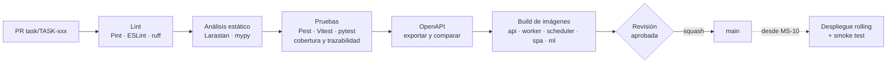
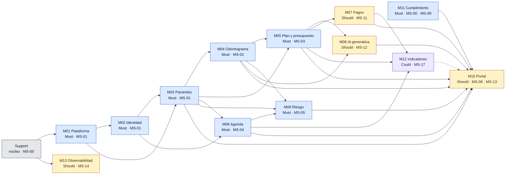

# Plan de Implementación: DentiCore

## 1. Estrategia de entrega

### 1.1 Principios del plan

| ID | Principio | Regla operativa | Origen |
| :-- | :-- | :-- | :-- |
| P-01 | Fuente de verdad | El SDD v2 (idéntico a `claude/SDD_DentiCore.md` del proyecto) define módulos, tablas, rutas, reglas y pruebas; este plan solo los secuencia. Ante una diferencia entre el SDD y el SRS prevalece el SRS (SDD §1.1). Una tarea que necesite algo ausente del SDD se detiene y se registra en §9, salvo la fontanería, que se declara como tal (tarea `infra` o comando marcado «de fontanería» en la descripción). | SDD §1.1 |
| P-02 | Entregas del SRS | El plan adopta las cuatro entregas de SRS §17: **E1** (curso, S3–S12, datos sintéticos), **E2** (resto del alcance *Must*, antes de tratar datos reales), **E3** (*Should*) y **E4** (*Could*). RES-07 pide que el *Must* quepa en 12 semanas; SRS §17 ya resolvió que no cabe y lo dividió en E1 + E2. El plan aplica §17 y comprueba E1 contra la capacidad en §4.6. | RES-07, DD-21, SRS §17 |
| P-03 | Incremento vertical | Cada *slice* atraviesa los 7 pasos de §1.2 y termina con su pantalla mínima y sus pruebas. No existe una fase de pruebas ni una fase de frontend separadas. | SDD §1.3, §6 |
| P-04 | Grafo de dependencias | Ninguna tarea empieza antes de que terminen sus dependencias (columna *Depende de* del backlog). Los milestones siguen SDD §1.4; las excepciones justificadas están en §8.4. | SDD §1.4 |
| P-05 | Estado real | Lo construido en las fases 0–3 heredadas no se reescribe: se mueve a la estructura modular, se reconcilia con migraciones expandir/contraer y se completa (§2). | SRS §4.1, SRS §15.7 |
| P-06 | *Must* primero | E1 contiene los RF *Must* de los CUS de SRS §17.2. Un RF *Should* o *Could* de un CUS de E1 se entrega en MS-15 o MS-17. Adelantos permitidos: RF *Must* de E2 que ejecutan el mismo código que un RF de E1 (RF-040, RF-130), rutas habilitantes (§5.20) y los requisitos que un criterio de aceptación de E1 exige (supuesto S-06). | SRS §17.4 |
| P-07 | Datos sintéticos | Ningún dato real entra a la plataforma antes de aceptar E2. Las migraciones de reconciliación pueden regenerar los datos de demostración. | RES-08, SRS §17.1 |

### 1.2 Anatomía de un incremento vertical

| Paso | Artefacto | Regla del SDD | Verificación que cierra el paso |
| :-: | :-- | :-- | :-- |
| 1 | Migración: tablas del *slice* con base BT/BTi, FK compuestas `(tenant_id, x_id)`, CHECK, índices que empiezan por `tenant_id`, RLS con `enableTenantRls` | §2.1, §2.13, DI-19 | La migración se aplica sobre una BD vacía y sobre la BD del milestone anterior; cada restricción tiene una prueba que la viola. |
| 2 | Modelo y aislamiento: Eloquent con `BelongsToTenant`, `HasUuid`, *casts* (`TenantEncrypted`, `MoneyCast`) | §1.6.3 | T-160 en verde. |
| 3 | Service y reglas: Service/Action en `DB::transaction()`, bloqueos de fila, validadores de dominio, `OutboxWriter`, `AuditLogger` | §1.3, §5 | Pruebas unitarias y *feature* de las RN de la tarea. |
| 4 | Controlador y ruta: Form Request, Controller, Resource (UUID), ruta con el grupo y los middleware de §4.2 | §4.1–§4.3 | T-162 (OpenAPI) en verde; respuestas 422/409 en `problem+json`. |
| 5 | Autorización: `role:` + Policy + celdas ❌ del CUS en `AUTH_MATRIX` | §3.2, §3.4 | T-019 en verde con las celdas nuevas. |
| 6 | Pruebas: las del catálogo §6.3 asignadas a la tarea, aislamiento (T-015, T-016) y auditoría (T-149) | §6 | CI verde con `->group` por ID. |
| 7 | Frontend mínimo: pantalla con guardias de interfaz, errores junto al campo, confirmación de acciones irreversibles, formatos `es-PE` | §1.10 | Vitest de los componentes con lógica y el E2E del milestone. |

### 1.3 Definición de terminado (DoD)

Una tarea se da por terminada solo si cumple **todas** las filas que le aplican. El revisor del PR marca cada fila.

| ID | Criterio | Verificación | Origen |
| :-- | :-- | :-- | :-- |
| DoD-01 | El código está en su módulo (`app/Modules/<Módulo>`) o en `app/Support`, sin atajos entre capas ni módulos. | T-158 y T-159 en verde. | DI-01, RNF-119, RNF-120 |
| DoD-02 | Toda tabla de clínica es BT/BTi con FK compuestas, índice por `tenant_id` y RLS (salvo que se aplique el recorte R-01); todo modelo con `tenant_id NOT NULL` usa `BelongsToTenant`. | T-160 y la prueba de RLS por `information_schema`. | DD-03, DD-40, DI-19 |
| DoD-03 | `tenant_id` nunca llega desde la solicitud; los recursos de otra clínica responden 404. | T-014 y T-015 con las rutas nuevas. | RN-01, RN-03 |
| DoD-04 | Cada escritura corre en una transacción del Service; los efectos asíncronos van al outbox en esa transacción. | Prueba de *rollback* sin efectos (patrón de T-157). | DD-41, RF-012 |
| DoD-05 | Cada evento auditable del catálogo §5.14 que la tarea produce queda en `audit_logs` sin valores clínicos ni de identificación. | T-149 ampliada con los eventos de la tarea. | RN-67, CUS-65 |
| DoD-06 | Las pruebas del catálogo §6.3 asignadas a la tarea están en verde y agrupadas por su ID; cada RF de la tarea sin prueba nominal tiene una prueba *feature* con `->group('RF-xxx')`. | Informe de trazabilidad de la CI. | SDD §6.2, RNF-128 |
| DoD-07 | Las reglas que dependen del tiempo se prueban con reloj simulado. | T-161 en verde. | RNF-130 |
| DoD-08 | Cada celda ❌ de los CUS de la tarea está en `AUTH_MATRIX`. | T-019 en verde. | RN-06, RF-004 |
| DoD-09 | El contrato OpenAPI refleja los endpoints de la tarea y las respuestas reales coinciden. | T-162 en verde. | RNF-044 |
| DoD-10 | La pantalla mínima existe, muestra los errores junto al campo, pide confirmación en acciones irreversibles y usa textos en español y formatos `es-PE`. | Vitest o E2E de la tarea. | RNF-063, RNF-064, RNF-188, RNF-189 |
| DoD-11 | Las puertas de la CI de §6.4 aplicables están en verde y otra persona del equipo aprobó el PR. | Estado del PR. | RNF-135, SDD §6.4 |
| DoD-12 | No hay secretos en el código ni datos reales en semillas o pruebas. | Escaneo de secretos; revisión de semillas. | RNF-100, RES-08 |

### 1.4 Ramas, PR e integración continua

| Aspecto | Regla |
| :-- | :-- |
| Repositorios | `denticore-api` (Laravel), `denticore-spa` (React) y `denticore-ml` (FastAPI), cada uno con su pipeline; la separación API/SPA ya existe (fases 0–3). |
| Ramas | `main` protegida. Ramas cortas `task/TASK-xxx-<slug>` desde `main`, con *rebase* diario sobre `main`. |
| PR | Una tarea por PR (o una parte con sufijo `-a`, `-b`). La plantilla exige: ID de la tarea, secciones del SDD, pruebas `T-xxx` cerradas, filas DoD marcadas y capturas si hay pantalla. Aprobación de 1 persona de otro carril. Integración por *squash*. |
| Mensajes | `TASK-049: registra hallazgos del odontograma`. |
| Pipeline | lint → análisis estático → pruebas → OpenAPI → build (SDD §1.11); desde MS-10 se agregan despliegue *rolling* y *smoke test*. Las puertas y umbrales son los de SDD §6.4. |
| Migraciones | Expandir y contraer van en PR distintos (§1.5). |
| Etiquetas | Una por milestone (`ms-03`) y una por entrega (`e1.0`), creada solo si la regla de liberación de §6.5 se cumple. |



### 1.5 Migraciones expandir/contraer

| Paso | Qué se hace | Condición para pasar al siguiente |
| :-: | :-- | :-- |
| 1. Expandir | Agregar tablas o columnas nuevas (nulables o con valor por defecto) sin tocar las existentes. | La versión anterior del código sigue funcionando sobre el esquema expandido. |
| 2. Poblar | *Backfill* idempotente desde las columnas viejas (o semilla, si el dato no existe y solo hay datos sintéticos). | Conteos de filas pobladas = filas totales; el comando se puede repetir sin cambios. |
| 3. Cambiar | El código lee y escribe solo lo nuevo; se agregan los NOT NULL y CHECK. | Suite completa en verde; ninguna referencia a lo viejo (prueba `arch()`). |
| 4. Contraer | Eliminar lo viejo en un PR posterior (TASK-038 para las fases 0–3). | Registrada como irreversible; desde MS-10 nunca en la misma versión que su expansión. |

La lista de objetos del estado base que siguen este patrón está en §2.3 (RNF-132). Las FK hacia tablas de milestones posteriores también se agregan por expansión, en la tarea que crea la tabla referida: `attentions.appointment_id` (TASK-064), `appointments.risk_alert_id` y `treatment_plans.risk_alert_id` (TASK-078), `patient_identity_history.arco_request_id` y `consent_purpose_revocations.arco_request_id` (TASK-103) y `appointments.periodic_control_id` (TASK-151).

### 1.6 Orquestación con el agente de codificación

| Regla | Detalle |
| :-- | :-- |
| Unidad de trabajo | El agente recibe una tarea (`TASK-xxx`) completa: descripción, criterios, dependencias y origen. No recibe milestones enteros. |
| Contexto | Se adjuntan solo las secciones del SDD citadas en *Origen* y el catálogo de pruebas de la tarea. |
| Límites | El agente no crea tablas, columnas, rutas, estados ni reglas ausentes del SDD. Si los necesita, se detiene y lo informa; la persona responsable lo registra en §9. |
| Pruebas primero | Las pruebas `T-xxx` de la tarea se escriben antes que la implementación y deben fallar por la razón esperada. |
| Revisión humana | El PR lo revisa una persona de otro carril con la lista DoD; el agente no aprueba ni integra. |
| Evidencia | La descripción del PR incluye la salida de la suite de la tarea y la consulta `EXPLAIN` cuando la tarea agrega un listado o búsqueda. |

```text
Tarea: TASK-049 — Hallazgos y correcciones del odontograma (MS-02, M04, service)
Fuente: SDD §5.3, §2.6, §4.3.4, §3.4 (CUS-22, CUS-23); pruebas T-049 a T-052, T-054, T-057 a T-059, T-061, T-062 de §6.3.3
Depende de: TASK-046 (ClinicalValidator), TASK-047 (AttentionService)
Hacer: <descripción accionable de la tarea>
Criterios de aceptación: <lista verificable de la tarea>
Restricciones: solo lo descrito; sin tablas, rutas ni reglas nuevas; pruebas con reloj simulado;
               respuestas problem+json; tenant_id nunca desde la solicitud.
Entrega: PR task/TASK-049-hallazgos con las pruebas en verde y la lista DoD completada.
```

### 1.7 Unidad de estimación y capacidad

| Concepto | Valor | Fundamento |
| :-- | :-- | :-- |
| Unidad | **dp** (día-persona): una jornada de trabajo efectivo de una persona con el agente de codificación, incluidas la revisión, las pruebas y las correcciones del PR. | Criterio del plan. |
| Capacidad nominal | 3 personas × 5 dp = 15 dp por semana. | RES-07. |
| Capacidad planificable | 3 × 4 dp = 12 dp por semana (80 %; el 20 % restante cubre revisiones cruzadas, incidencias y la carga académica). | Supuesto S-01. |
| Ventana de E1 | S3–S12 (S1–S2 se consumieron en las fases 0–3). | SRS §17.3. |
| Carga estimada de E1 | 119,5 dp. | Suma del backlog (§5). |
| Velocidad requerida | 4,4 dp por persona y semana (13,2 dp por semana de equipo) para cerrar E1 en S12 respetando las dependencias y con la regla de *pull*; la holgura sale de los recortes predefinidos. | Programación de §4.5 y §4.6. |
| Puntos de control | Al iniciar MS-00 (con la respuesta a PL-05), al terminar MS-00 y al terminar MS-01 se mide o estima la velocidad y se aplica la regla de decisión de §4.6. | §4.6. |

## 2. Estado base y brechas

### 2.1 Inventario de lo implementado

Fuente: `implementation_plan.md` (fases 0 a 3 completadas), SRS §4.1 y SRS §15.7. Suite heredada: 35 pruebas / 96 aserciones sobre PostgreSQL `denticore_testing`.

| Elemento implementado | Estado frente al SDD | Acción del plan | Tarea |
| :-- | :-- | :-- | :-- |
| Laravel 13 (PHP 8.3) y SPA React 18 + React Router 7 + Axios + TanStack Query en repositorios separados | Compatible (DD-01, DD-02). Estructura por capas (`Controllers/`, `Services/`, `Models/`), no modular. | Mover a `app/Modules` y `app/Support` sin cambiar comportamiento. | TASK-004 |
| PostgreSQL 16 y Redis (Memurai en Windows) | Compatible con el motor; el entorno local de §1.11 exige Compose con MinIO, Mailpit y el motor ML. | Entorno Compose. | TASK-001 |
| Sanctum Bearer, prefijo `/api/v1`, `POST /auth/login` con `tenant_slug`, `POST /auth/logout`, `GET /auth/me` | Compatible (DD-19, DD-29). Faltan habilidades, vencimiento absoluto, inactividad, bloqueo y límites (DD-15). | Completar el login y la sesión. | TASK-027 |
| `tenants` con `slug`, `subscription_plan` y `status` en inglés, `settings` jsonb | Cambia: `subscription_plans` como tabla, `clinic_settings`, estados en español (DI-03), RUC, razón social y dirección (DD-22). | Expandir/contraer. | TASK-021, TASK-038 |
| `POST /tenants` con la contraseña del primer administrador y `GET /tenants` | Cambia: rutas `/platform/tenants` e invitación por correo (DD-22). | Reemplazar el contrato. | TASK-023 |
| `encryption_keys` con `UNIQUE(tenant_id)` e `is_active` | Cambia: versionado `version` + `status` (DD-04, RF-048). | Expandir, recifrar al formato `v1:` y contraer. | TASK-013, TASK-038 |
| `BelongsToTenant` + `TenantScope` *deny-by-default*; `users` sin Global Scope; `ResolveTenant` antes de `SubstituteBindings`; `withoutTenantScope()` para `super_admin` | Compatible (DD-03). Falta `TenantContext`, `set_config` para RLS y `TenantAwareJob`. | Completar el núcleo de aislamiento. | TASK-005, TASK-007 |
| `HasUuid` y atributos por defecto generados en PHP | Compatible (DI-02). | Se conserva. | TASK-004 |
| `users` con `is_active`, `UNIQUE(tenant_id, email)` y único parcial para `super_admin` | Cambia: `status` en español, COP, oficial de datos, 2FA, bloqueo (DI-03, RN-75, DD-15). | Expandir/contraer. | TASK-026, TASK-038 |
| `UserController` (`GET/POST /users`, `PATCH /users/{user}`), aislamiento explícito y revocación de tokens al desactivar | Compatible (DD-03). Faltan invitación, COP, protección del último administrador y reactivación (SRS §15.7). | Completar CUS-11. | TASK-030 |
| `patients` con `document_id` y `phone` cifrados (AES de `Crypt`), `document_id_hash`, `medical_history` estructurado, `user_id` del portal | Compatible en intención (DD-04). Cambia: nombres de columnas, tipo de documento, número de HC cifrado (DI-07), dirección cifrada, `search_name` (DI-14), estados de archivo, FK compuestas (DI-19). | Expandir, recifrar y contraer. | TASK-031, TASK-013, TASK-038 |
| `PatientController` (`GET/POST /patients`, `GET /patients/{patient}`) y `PatientPolicy::view` que admite al propio paciente | Cambia: búsqueda (RF-054) y portal en rutas propias (DI-13); el rol `patient` deja de usar rutas del personal. | Completar; restringir el rol `patient` cuando exista el portal. | TASK-032, TASK-033, TASK-085 |
| Estructura de `medical_history` (`alergias`, `enfermedades`, `medicamentos`, `observaciones`) | Compatible con §2.14.1. Falta exigir consentimiento (RN-10) y los límites de tamaño. | Completar. | TASK-037 |
| SPA: login con código de clínica, clínicas (SA), usuarios (CA), pacientes, "Mi ficha" con `patient_uuid`, `<RequireRole>`, `AuthProvider`, `lang/es` y semilla de demostración | Compatible en parte. Verificar `sessionStorage` (DD-44); rutas `/c/:slug/...` (DD-29); "Mi ficha" pasa al portal (DI-13). | Base de la SPA y portal. | TASK-019, TASK-089 |

### 2.2 Brechas por módulo

Columnas E1 a E4: CUS que cada entrega completa (SRS §17). "Parcial" = CUS con implementación heredada incompleta (SRS §15.7); se completan dentro de E1 sin rehacer lo existente.

| Módulo | Prioridad | Parcial (heredado) | E1 | E2 | E3 | E4 | Milestones |
| :-- | :-- | :-- | :-- | :-- | :-- | :-- | :-- |
| M01 | Must | CUS-01 | CUS-01 a CUS-04 | — | CUS-05, CUS-84 | — | MS-01, MS-09, MS-12, MS-14, MS-15 |
| M02 | Must | CUS-06, CUS-10, CUS-11 | CUS-06 a CUS-11 | CUS-78, CUS-79 | CUS-12 | — | MS-01, MS-09, MS-14 |
| M03 | Must | CUS-13, CUS-14 | CUS-13 a CUS-17, CUS-82, CUS-83 | CUS-18 | CUS-19 | CUS-20, CUS-88 | MS-01, MS-03, MS-09, MS-13, MS-15, MS-17 |
| M04 | Must | CUS-21 | CUS-21 a CUS-27, CUS-80, CUS-81 | — | — | — | MS-02, MS-10, MS-15 |
| M05 | Must | — | CUS-32 a CUS-40 | — | — | CUS-89 | MS-03, MS-15, MS-17 |
| M06 | Must | — | CUS-44 a CUS-53, CUS-77 | — | CUS-85 | CUS-86 | MS-01, MS-04, MS-15, MS-17 |
| M07 | Should | — | — | — | CUS-41 a CUS-43, CUS-87 | — | MS-11, MS-17 |
| M08 | Should | — | — | — | CUS-28 a CUS-31 | — | MS-12 |
| M09 | Must | — | CUS-54 a CUS-58 | — | CUS-59, CUS-61 | CUS-60 | MS-05, MS-09, MS-15 |
| M10 | Should | — | Rutas PORT de CUS-17, CUS-24, CUS-36, CUS-37 y CUS-46 a CUS-49 (portal mínimo) | Rutas PORT de CUS-18, CUS-62 y CUS-63 | Resto de las rutas PORT y CUS-19 (SRS §9.5) | — | MS-06, MS-13 |
| M11 | Must | — | CUS-65 | CUS-62 a CUS-64, CUS-66, CUS-69 | CUS-67, CUS-68, CUS-70, CUS-71 | — | MS-00, MS-07, MS-09, MS-10, MS-13, MS-14 |
| M12 | Could | — | — | — | — | CUS-72 a CUS-74 | MS-17 |
| M13 | Should | — | — | — | CUS-75, CUS-76 | — | MS-14 |

### 2.3 Reconciliación con migraciones expandir/contraer

| Objeto | Estado actual | Estado del SDD | Expandir y poblar | Contraer | Tareas |
| :-- | :-- | :-- | :-- | :-- | :-- |
| `tenants.status` | `active`, `suspended`, `cancelled` | `activa`, `suspendida`, `cancelada`, `eliminada` (DI-03) | Columna nueva poblada por correspondencia 1:1. | Eliminar la columna vieja. | TASK-021 → TASK-038 |
| `tenants.subscription_plan`, `tenants.settings` | enum y jsonb | `subscription_plan_id` → `subscription_plans`; `clinic_settings` 1:1 | FK poblada por código; fila de `clinic_settings` por clínica desde `settings`. | Eliminar ambas columnas. | TASK-021 → TASK-038 |
| `encryption_keys` | `UNIQUE(tenant_id)`, `is_active` | `version`, `status`, único parcial `activa` | `version = 1`, `status = activa`. | Eliminar `is_active` y el único total. | TASK-013 → TASK-038 |
| Texto cifrado de `patients` | AES de `Crypt` sin versión | AES-256-GCM con sobre `v{n}:` (DI-06) | Comando idempotente `encryption:reencrypt-legacy`. | Retirar el descifrado del formato viejo. | TASK-013 → TASK-038 |
| `users.is_active` | booleano | `status` en español | `activo`/`inactivo` desde el booleano; COP de la semilla para odontólogos. | Eliminar `is_active`. | TASK-026 → TASK-038 |
| `patients.document_id`, `document_id_hash` | nombres heredados, HMAC con la clave de la clínica | `document_number`, `document_hash` (clave `bidx` por HKDF) | Columnas nuevas pobladas desde las viejas, con el índice ciego recalculado. | Eliminar las columnas viejas. | TASK-031 → TASK-038 |
| `patients` (columnas nuevas) | — | `document_type`, `clinical_record_number/hash`, `sex`, `address`, `search_name`, `archive_status`, FK compuestas | Poblado desde el DNI (`document_type = dni`, número de HC = DNI) o desde la semilla sintética. | — | TASK-031 |
| `POST /tenants` con contraseña | contrato heredado | `POST /platform/tenants` con invitación | Ruta nueva. | Retirar la ruta vieja y su pantalla. | TASK-023, TASK-039 |
| `PatientPolicy::view` para `patient` | el paciente usa `GET /patients/{uuid}` | Portal `/api/v1/portal/*` (DI-13) | Portal mínimo en E1. | Retirar el acceso del rol `patient` a rutas STAFF cuando el portal exista. | TASK-085 |
| `POST /patients` acepta `user_uuid`; las cuentas `patient` se crean con `/users` | vínculo de portal heredado | Vínculo por invitación de CUS-19 (E3); el contrato de `POST /patients` de SDD §4.5 no tiene `user_uuid` | En E1 las cuentas de portal de pacientes sintéticos las crea la semilla (S-14, PL-08). | Retirar `user_uuid`. | TASK-038 |

## 3. Andamiaje previo (fase 0)

La fase 0 es el milestone MS-00. Construye lo que todos los *slices* usan y reconcilia el núcleo heredado; ninguna tarea funcional de MS-01 empieza sin la parte del andamiaje de la que depende.

### 3.1 Componentes

| Componente | Contenido | Habilita | Tarea |
| :-- | :-- | :-- | :-- |
| Estructura modular | `app/Modules/<Módulo>` y `app/Support/*` (§1.3); pruebas `arch()` de capas y módulos. | Fronteras verificables para 3 carriles en paralelo. | TASK-004 |
| Contexto de clínica | `TenantContext`, `TenantScope`, `BelongsToTenant` con bloqueo de `tenant_id`, `ResolveTenant` con `set_config`, `TenantAwareJob`. | Aislamiento en solicitudes, *jobs* y tareas programadas. | TASK-005 |
| RLS | Roles `denticore_app` (sin `BYPASSRLS`), `denticore_platform`, `denticore_migrator`; *macro* `enableTenantRls`. | Segunda barrera en cada tabla BT (DD-40, *Should*, adelantada; primer recorte si falta capacidad). | TASK-007 |
| Objetos SQL | Funciones de §2.2, tipo `timerange`, disparadores de inmutabilidad y de cadena de hashes. | CHECK del odontograma, `EXCLUDE` de la agenda, BTi. | TASK-006 |
| Errores y recursos | `ProblemDetails`, `ApiResource`, correlación, cabeceras, CORS. | Contrato uniforme de §4.1. | TASK-008 |
| Idempotencia | `idempotency_keys` + middleware `idempotent`. | Escrituras críticas reintentables (DD-45). | TASK-009 |
| Outbox y colas | `outbox_messages`, despachador, colas y *scheduler* con `scheduled_task_runs`. | Correos, PDF y tareas programadas exactamente una vez. | TASK-010 |
| Auditoría | `audit_logs` particionada con cadena de hashes, `AuditLogger`, catálogo `AuditEvent`. | CUS-65 en cada Service desde el primer *slice*. | TASK-011 |
| Dinero | `Money` con `brick/math` y `MoneyCast`. | Presupuestos y abonos exactos (DI-05). | TASK-012 |
| Cifrado versionado | AES-256-GCM con sobre `v{n}:`, HKDF, índice ciego, `encryption_keys` versionada. | Pacientes, representantes y rotación futura (DD-04). | TASK-013 |
| Evidencias y reloj | `EvidenceSealer`, `ClinicClock`, `HashChainVerifier`, `integrity:verify`. | Consentimientos, cierres y decisiones sellados; plazos en hora local. | TASK-014 |
| Tokens de un solo uso | `one_time_tokens`, `tenant.token`, `tenant.slug`, `throttle:codes`. | Invitaciones, restablecimiento, confirmación de citas. | TASK-015 |
| Archivos y documentos | `stored_files`, `generated_documents`, antivirus, `GenerateDocumentJob`, URL firmadas. | PDF de constancias, presupuestos y copias. | TASK-016 |
| Entorno y CI | Docker Compose (§1.11), pipelines de API y SPA con las puertas de §6.4. | Integración continua desde el primer PR. | TASK-001, TASK-002, TASK-003 |
| Pruebas | Pest bajo `denticore_app`, fábricas por clínica, `AUTH_MATRIX`, OpenAPI, Playwright + axe-core. | Red de pruebas acumulativa (§6.3). | TASK-017, TASK-018, TASK-020 |
| SPA base | Token en `sessionStorage`, interceptores, guardias, rutas `/c/:slug`, formatos. | Pantallas de todos los *slices*. | TASK-019 |

### 3.2 Orden interno

| Tarea | Título | Depende de | Carril | Ventana |
| :-- | :-- | :-- | :-- | :-- |
| TASK-002 | Pipeline de CI del backend | — | C | S3 |
| TASK-001 | Entorno local con Docker Compose | — | A | S3 |
| TASK-003 | Pipeline de CI de la SPA | — | B | S3 |
| TASK-019 | Base de la SPA | TASK-003 | B | S3 |
| TASK-004 | Reestructurar el backend en módulos | TASK-002 | A | S3 |
| TASK-006 | Objetos SQL auxiliares | TASK-001, TASK-002 | B | S3 |
| TASK-005 | Contexto de clínica y aislamiento en jobs | TASK-004 | A | S3 |
| TASK-020 | Base de pruebas E2E | TASK-001, TASK-019 | C | S3 |
| TASK-012 | Aritmética monetaria exacta | TASK-004 | B | S3 |
| TASK-010 | Outbox, colas y tareas programadas | TASK-005 | B | S3–S4 |
| TASK-013 | Cifrado AES-256-GCM versionado | TASK-004 | A | S3–S4 |
| TASK-007 | Seguridad por fila (RLS) como segunda barrera | TASK-005, TASK-006 | C | S3–S4 |
| TASK-017 | Infraestructura de pruebas | TASK-005, TASK-007, TASK-010 | C | S4 |
| TASK-011 | Bitácora de auditoría inalterable (CUS-65) | TASK-005, TASK-006 | A | S4 |
| TASK-016 | Archivos, documentos generados y URL firmadas | TASK-005, TASK-010, TASK-007 | B | S4 |
| TASK-008 | Errores, recursos, correlación y cabeceras | TASK-004 | A | S4 |
| TASK-009 | Idempotencia de escrituras críticas | TASK-008 | A | S4 |
| TASK-014 | Evidencias, reloj de clínica e integridad | TASK-011, TASK-010 | B | S4 |
| TASK-018 | Contrato OpenAPI y esquemas de la SPA | TASK-002, TASK-008 | C | S4 |
| TASK-015 | Tokens de un solo uso y resolución de clínica pública | TASK-005, TASK-008 | A | S4–S5 |

### 3.3 Criterio de salida de la fase 0

| Criterio | Verificación |
| :-- | :-- |
| Las 35 pruebas heredadas siguen en verde dentro de la estructura modular. | Pipeline de `main`. |
| T-013, T-014, T-017, T-026 a T-028, T-150, T-158 a T-162, T-164 a T-167 en verde. | Informe de trazabilidad. |
| `docker compose up` levanta el entorno completo en una máquina limpia de otra persona del equipo. | Verificación cruzada. |
| Velocidad real de MS-00 medida (dp estimados cerrados por persona y semana). | Entrada del punto de control de fin de MS-00 (§4.6). |

## 4. Hoja de ruta por hitos

### 4.1 Grafo de dependencias entre módulos

Aristas de SDD §1.4 (una flecha `A --> B` significa "B depende de A"), con la prioridad MoSCoW y el milestone donde se construye cada módulo. La arista punteada M12 → M10 no tiene ninguna ruta que la materialice (§8.4). M11 depende de todos los módulos y se dibuja sin aristas para no saturar el grafo: su parte transversal (CUS-65, auditoría) vive en `app/Support` desde MS-00 y sus CUS de E2 se construyen cuando M01 a M06 y M09 ya existen.



### 4.2 Secuencia de milestones

Las flechas continuas salen de las dependencias entre tareas (reducción transitiva); las punteadas son la regla de entregas de SRS §17 (una entrega empieza cuando la anterior se acepta). Las semanas son las ventanas objetivo de la programación de §4.5 con la velocidad requerida de §4.6; E2 a E4 no tienen fecha: se programan al cerrar la entrega anterior con la velocidad medida.

```mermaid
flowchart LR
    subgraph E1["E1 · Curso · S3–S12"]
        MS00["MS-00 Andamiaje<br/>S3–S5 · 21,25 dp"]
        MS01["MS-01 Fundamentos<br/>S4–S7 · 26,5 dp"]
        MS02["MS-02 Atención y odontograma<br/>S6–S9 · 15,25 dp"]
        MS03["MS-03 Plan y presupuesto<br/>S7–S10 · 14,25 dp"]
        MS04["MS-04 Agenda<br/>S7–S10 · 13 dp"]
        MS05["MS-05 Riesgo de caries<br/>S3–S11 (motor S3–S5; integración S8–S11) · 13 dp"]
        MS06["MS-06 Portal mínimo<br/>S6–S11 · 6,25 dp"]
        MS07["MS-07 Verificación E1<br/>S10–S12 · 7 dp"]
        MS08["MS-08 Cierre E1<br/>S12 · 3 dp"]
    end
    subgraph E2["E2 · Piloto"]
        MS09["MS-09 Derechos del titular<br/>14,25 dp"]
        MS10["MS-10 Datos reales<br/>16 dp"]
    end
    subgraph E3["E3 · Comercial"]
        MS11["MS-11 Pagos<br/>6 dp"]
        MS12["MS-12 IA generativa<br/>8,75 dp"]
        MS13["MS-13 Portal completo<br/>6,5 dp"]
        MS14["MS-14 Operación y cumplimiento<br/>12 dp"]
        MS15["MS-15 Extensiones Should<br/>15 dp"]
        MS16["MS-16 Calidad Should<br/>8,5 dp"]
    end
    subgraph E4["E4 · Mejoras"]
        MS17["MS-17 Mejoras Could<br/>13 dp"]
    end
    MS00 --> MS01
    MS01 --> MS02
    MS02 --> MS03
    MS03 --> MS04
    MS04 --> MS05
    MS04 --> MS06
    MS05 --> MS07
    MS05 --> MS09
    MS06 --> MS07
    MS06 --> MS09
    MS07 --> MS08
    MS08 --> MS10
    MS09 --> MS10
    MS09 --> MS11
    MS09 --> MS12
    MS10 --> MS14
    MS11 --> MS13
    MS11 --> MS17
    MS14 --> MS15
    MS15 --> MS16
    MS15 --> MS17
    MS08 -.->|entrega| MS09
    MS10 -.->|entrega| MS11
    MS10 -.->|entrega| MS12
    MS16 -.->|entrega| MS17
```



### 4.3 Milestones

| MS | Entrega | Semanas | Módulos | CUS | Entregable demostrable | Depende de | dp |
| :-- | :-: | :-- | :-- | :-- | :-- | :-- | --: |
| MS-00 Andamiaje y reconciliación técnica (fase 0) | E1 | S3–S5 | Support, M11 (CUS-65) | CUS-65 | Entorno Compose, CI con puertas de §6.4, núcleo `app/Support` (contexto de clínica, RLS, outbox, auditoría, cifrado v1, idempotencia, tokens de un solo uso, documentos) y SPA base; las 35 pruebas heredadas en verde dentro de la estructura modular. | fases 0–3 heredadas | 21,25 |
| MS-01 Fundamentos: plataforma, identidad, pacientes y consentimiento | E1 | S4–S7 | M01, M02, M03 (+ canal de correo de M06) | CUS-01 a CUS-04, CUS-06 a CUS-11, CUS-13 a CUS-17, CUS-65 | Un Súper Administrador da de alta una clínica con invitación; el administrador activa su cuenta con 2FA, invita personal; recepción registra un paciente (menor con representante) y su consentimiento; toda escritura queda auditada y aislada. | MS-00 | 26,5 |
| MS-02 Atención, nota clínica y odontograma NTS 188 | E1 | S6–S9 | M04 | CUS-21 a CUS-27, CUS-65, CUS-80, CUS-81 | Un odontólogo abre una atención, registra nota con CIE-10 y hallazgos en el odontograma inicial y de evolución, corrige una entrada y cierra; la HC muestra el estado vigente y el historial por pieza. | MS-01 | 15,25 |
| MS-03 Catálogo, plan, presupuesto, consentimiento informado y procedimiento | E1 | S7–S10 | M05 (+ CUS-82/83 de M03) | CUS-32 a CUS-40, CUS-65, CUS-82, CUS-83 | Desde un hallazgo rojo se arma el plan, se emite un presupuesto con IGV y número correlativo, se acepta presencialmente, se firma el consentimiento informado y el procedimiento realizado crea la entrada de evolución. | MS-02 | 14,25 |
| MS-04 Agenda, sala de espera y notificaciones | E1 | S7–S10 | M06 | CUS-44 a CUS-53, CUS-65, CUS-77 | Recepción configura horarios, reserva sin solapamientos, el paciente confirma por enlace, el check-in abre la atención y los recordatorios salen 24 h antes solo con la finalidad (b). | MS-03 | 13 |
| MS-05 Motor ML y predicción de riesgo de caries | E1 | S3–S11 (motor S3–S5; integración S8–S11) | M09 (+ motor Python) | CUS-54 a CUS-58, CUS-65 | El odontólogo captura variables, obtiene nivel, probabilidad calibrada y explicación SHAP; con el motor caído la atención continúa con "Predicción no disponible"; el riesgo alto genera una alerta que se reconoce con una acción. | MS-04 | 13 |
| MS-06 Portal mínimo de E1 | E1 | S6–S11 | M10 (rutas que implementan RF y CA de E1) | CUS-17, CUS-24, CUS-36, CUS-37, CUS-46 a CUS-49 | El paciente, en el portal, consulta y acepta su presupuesto, reserva, reprograma, cancela y confirma citas, otorga su consentimiento y ve el historial por pieza. | MS-04 | 6,25 |
| MS-07 Verificación de E1 | E1 | S10–S12 | Transversal | CUS-65 | Informe de carga k6, aislamiento completo, seguridad, E2E en 4 navegadores × 4 tamaños y trazabilidad al 100 % de RF, RN y CA de E1. | MS-05, MS-06 | 7 |
| MS-08 Cierre de E1 | E1 | S12 | Transversal | — | Documentación, informe de pruebas y demostración del flujo cita → HC → riesgo → plan → presupuesto → procedimiento con datos sintéticos. | MS-07 | 3 |
| MS-09 Derechos del titular, bitácora consultable y seguridad de cuentas | E2 | Posterior | M11, M02, M03, M01 | CUS-02, CUS-05, CUS-18, CUS-62 a CUS-66, CUS-69, CUS-78, CUS-79 | ARCO completo con plazos hábiles, copia de HC, revocación de finalidades, bitácora consultable, retención, perfil y restablecimiento de acceso, cancelación con exportación. | MS-05, MS-06, MS-08 (entrega) | 14,25 |
| MS-10 Preparación para datos reales | E2 | Posterior | Infraestructura y conformidad | — | Producción aprovisionada (PQ-04), respaldos probados, despliegue reversible, seguridad verificada, conformidad clínica y legal firmada; aceptación de E2. | MS-08, MS-09, PQ-04 y PQ-05 resueltas | 16 |
| MS-11 Pagos internos | E3 | Posterior | M07 | CUS-41 a CUS-43, CUS-65, CUS-87 | Abonos con recibo no tributario, anulación, estado de cuenta, caja y cuentas por cobrar. | MS-09, MS-10 (entrega) | 6 |
| MS-12 Asistencia de IA generativa | E3 | Posterior | M08 | CUS-04, CUS-28 a CUS-31, CUS-65 | Sugerencias de hallazgos y planes desde notas seudonimizadas, con decisión humana por elemento y cuota mensual. | MS-09, MS-10 (entrega), PQ-02; validador de PQ-05 | 8,75 |
| MS-13 Portal completo y vinculación de cuentas | E3 | Posterior | M10, M03 (CUS-19) | CUS-19, CUS-21, CUS-43, CUS-62 | Portal con representados, resumen, odontograma, planes, estado de cuenta, copia de HC y portabilidad, accesible WCAG AA. | MS-11 | 6,5 |
| MS-14 Operación de plataforma y cumplimiento | E3 | Posterior | M13, M11, M01, M02 | CUS-02, CUS-05, CUS-12, CUS-65, CUS-67, CUS-68, CUS-70, CUS-71, CUS-75, CUS-76 | Observabilidad con alertas, incidentes con plazo de 48 h, rotación de claves, exportación completa, purga del día 91 y eliminación por retención. | MS-10 | 12 |
| MS-15 Continuidad clínica y extensiones Should | E3 | Posterior | M09, M01, M06, M04, M05, M03 | CUS-01, CUS-15, CUS-21, CUS-22, CUS-24 a CUS-26, CUS-32, CUS-35, CUS-38, CUS-52, CUS-54, CUS-56, CUS-58, CUS-59, CUS-61, CUS-65, CUS-77 a CUS-80, CUS-84, CUS-85 | Seguimiento y versiones del modelo, importación, controles periódicos y las funciones Should de CUS ya entregados. | MS-14 | 15 |
| MS-16 Calidad operativa Should | E3 | Posterior | Transversal | — | RNF Should de usabilidad, capacidad, resiliencia y mantenibilidad verificados. | MS-15 | 8,5 |
| MS-17 Mejoras Could | E4 | Posterior | M03, M05, M06, M12 | CUS-20, CUS-60, CUS-65, CUS-72 a CUS-74, CUS-86 a CUS-89 | Adjuntos, fusión de fichas, presupuesto compartido, lista de espera, encuestas e indicadores. | MS-11, MS-15, MS-16 (entrega) | 13 |
| **Total** | | | | | E1 119,5 · E2 30,25 · E3 56,75 · E4 13 | | **219,5** |

### 4.4 Requisitos que cubre cada milestone

RF y RNF que cada milestone implementa o verifica (lista derivada del origen de sus tareas; §8.1 agrega CUS, DD y DI). Un RF o RNF de E2 o E3 que aparece en un milestone de E1 indica que su mecanismo se construye allí porque E1 lo necesita (por ejemplo, el outbox de RNF-078 o los tokens de RNF-111 y RNF-112); su aceptación formal se registra en la entrega que le asigna SRS §17.4. Los únicos RF adelantados son RF-040, RF-130 y RF-148 (S-06, S-07).

| MS | RF | RNF |
| :-- | :-- | :-- |
| MS-00 | RF-001, RF-002, RF-007 a RF-009, RF-186 | RNF-001, RNF-003, RNF-028, RNF-044, RNF-046, RNF-051, RNF-052, RNF-064, RNF-078, RNF-079, RNF-087, RNF-089, RNF-091, RNF-094, RNF-096, RNF-099 a RNF-104, RNF-107, RNF-110 a RNF-114, RNF-119, RNF-120, RNF-122, RNF-123, RNF-125 a RNF-128, RNF-130, RNF-132, RNF-135, RNF-189, RNF-192 |
| MS-01 | RF-003 a RF-006, RF-010, RF-013 a RF-016, RF-018, RF-019, RF-022 a RF-026, RF-032 a RF-047, RF-054 a RF-062, RF-064 a RF-067, RF-155 | RNF-002, RNF-007, RNF-063 a RNF-065, RNF-078, RNF-093, RNF-101, RNF-132, RNF-146, RNF-149, RNF-188, RNF-190, RNF-191 |
| MS-02 | RF-004, RF-064, RF-076 a RF-079, RF-081, RF-082, RF-084, RF-085, RF-087 a RF-091, RF-093, RF-094, RF-096, RF-097 | RNF-002 a RNF-004, RNF-061, RNF-063, RNF-101, RNF-121, RNF-146, RNF-149, RNF-151, RNF-153 |
| MS-03 | RF-004, RF-011, RF-012, RF-072 a RF-074, RF-107, RF-109 a RF-116, RF-118 a RF-124, RF-126 a RF-130 | RNF-001, RNF-011, RNF-038, RNF-063, RNF-101, RNF-189 |
| MS-04 | RF-004, RF-067, RF-142 a RF-147, RF-149 a RF-153, RF-155, RF-156, RF-158 | RNF-015, RNF-016, RNF-030, RNF-037, RNF-038, RNF-063, RNF-101 |
| MS-05 | RF-004, RF-161, RF-162, RF-164 a RF-168, RF-170, RF-171 | RNF-013, RNF-045, RNF-074, RNF-099, RNF-101, RNF-122, RNF-126, RNF-147, RNF-165, RNF-168, RNF-169, RNF-174 |
| MS-06 | RF-004, RF-061, RF-065, RF-066, RF-081, RF-121 a RF-123, RF-146, RF-148 a RF-150 | RNF-051, RNF-052, RNF-101 |
| MS-07 | RF-186 | RNF-005 a RNF-008, RNF-010, RNF-011, RNF-013, RNF-016, RNF-035, RNF-038, RNF-051, RNF-052, RNF-091, RNF-093, RNF-094, RNF-096, RNF-100, RNF-101, RNF-104, RNF-110, RNF-126, RNF-128, RNF-188, RNF-189 |
| MS-08 | — | RNF-005, RNF-044, RNF-136, RNF-141, RNF-171 |
| MS-09 | RF-004, RF-020, RF-040, RF-049, RF-051, RF-052, RF-068, RF-069, RF-180, RF-182 a RF-185, RF-187, RF-190 | RNF-002, RNF-063, RNF-101, RNF-148, RNF-159 |
| MS-10 | — | RNF-004, RNF-009, RNF-010, RNF-012, RNF-015, RNF-019, RNF-020, RNF-037, RNF-042, RNF-044, RNF-045, RNF-049, RNF-054, RNF-059, RNF-065, RNF-070, RNF-071, RNF-073, RNF-076, RNF-078, RNF-081 a RNF-084, RNF-086, RNF-088, RNF-090, RNF-092, RNF-095, RNF-097 a RNF-100, RNF-103, RNF-106 a RNF-108, RNF-111, RNF-112, RNF-114, RNF-125, RNF-132, RNF-134, RNF-136, RNF-142, RNF-152, RNF-154 a RNF-157, RNF-160 a RNF-163, RNF-171, RNF-179, RNF-187 |
| MS-11 | RF-004, RF-130, RF-133 a RF-140 | RNF-017, RNF-038, RNF-047, RNF-063, RNF-089, RNF-101 |
| MS-12 | RF-004, RF-027, RF-099 a RF-106 | RNF-014, RNF-033, RNF-075, RNF-101, RNF-109, RNF-144, RNF-147, RNF-153, RNF-175 a RNF-178 |
| MS-13 | RF-004, RF-070, RF-177 a RF-179, RF-181 | RNF-026, RNF-048, RNF-059, RNF-062, RNF-101, RNF-164 |
| MS-14 | RF-004, RF-021, RF-028, RF-048, RF-188, RF-189, RF-191, RF-192, RF-197 a RF-201 | RNF-022, RNF-023, RNF-043, RNF-101, RNF-105, RNF-117, RNF-159, RNF-172, RNF-181 a RNF-183 |
| MS-15 | RF-004, RF-017, RF-029 a RF-031, RF-050, RF-053, RF-063, RF-080, RF-083, RF-086, RF-092, RF-095, RF-098, RF-108, RF-117, RF-125, RF-154, RF-157, RF-159, RF-163, RF-169, RF-172, RF-173, RF-175 | RNF-021, RNF-047, RNF-101, RNF-145, RNF-166, RNF-167, RNF-170, RNF-172 |
| MS-16 | — | RNF-024, RNF-025, RNF-027 a RNF-029, RNF-031, RNF-032, RNF-034, RNF-036, RNF-039 a RNF-041, RNF-043, RNF-053, RNF-055 a RNF-058, RNF-060, RNF-066, RNF-068, RNF-069, RNF-072, RNF-077, RNF-080, RNF-085, RNF-089, RNF-102, RNF-113, RNF-120, RNF-124, RNF-127, RNF-129, RNF-131, RNF-133, RNF-137 a RNF-141, RNF-143, RNF-144, RNF-150, RNF-158, RNF-180, RNF-181, RNF-186, RNF-190, RNF-194 |
| MS-17 | RF-004, RF-071, RF-075, RF-131, RF-132, RF-141, RF-160, RF-174, RF-176, RF-193 a RF-196 | RNF-018, RNF-047, RNF-050, RNF-067, RNF-101, RNF-103, RNF-115, RNF-116, RNF-118, RNF-173, RNF-184, RNF-185, RNF-193 |

### 4.5 Carriles y distribución semanal de E1

Cada tarea tiene un carril de afinidad: **A** (núcleo, plataforma, identidad, clínico y comercial), **B** (pacientes, agenda, riesgo en Laravel y portal) y **C** (entorno, CI, SPA transversal, odontograma, motor ML y verificación). Regla de *pull*: quien termina su tarea toma, entre las tareas listas que puede empezar antes, la del milestone más antiguo y, a igualdad, la de camino restante más largo; las tareas del motor ML (TASK-074 a TASK-077) se tratan como de MS-01 para integrarlo temprano (RT-01). Prefiere una tarea de su carril salvo que eso retrase el inicio más de media jornada, y lo registra en el PR. Es la regla que implementa `meta.schedule`. La columna *Carril* del backlog y esta tabla muestran el carril resultante de esa programación con la velocidad requerida; la regla de *pull* es parte del plan, no una opción.

| Semana | Carril A | Carril B | Carril C | Milestones activos |
| :-- | :-- | :-- | :-- | :-- |
| S3 | TASK-001 · TASK-074 · TASK-004 · TASK-005 · TASK-013 | TASK-003 · TASK-019 · TASK-006 · TASK-012 · TASK-010 | TASK-002 · TASK-075 · TASK-020 · TASK-007 | MS-00, MS-05 |
| S4 | TASK-013 · TASK-011 · TASK-008 · TASK-009 · TASK-015 | TASK-010 · TASK-016 · TASK-031 · TASK-014 · TASK-034 | TASK-007 · TASK-017 · TASK-076 · TASK-018 · TASK-077 | MS-00, MS-01, MS-05 |
| S5 | TASK-015 · TASK-021 · TASK-026 · TASK-023 | TASK-034 · TASK-022 · TASK-036 · TASK-033 | TASK-077 · TASK-035 · TASK-032 · TASK-027 | MS-00, MS-01, MS-05 |
| S6 | TASK-023 · TASK-024 · TASK-029 · TASK-043 · TASK-040 | TASK-033 · TASK-037 · TASK-041 · TASK-025 · TASK-085 | TASK-027 · TASK-028 · TASK-030 · TASK-051 | MS-01, MS-02, MS-06 |
| S7 | TASK-040 · TASK-044 · TASK-045 · TASK-047 · TASK-049 | TASK-085 · TASK-039 · TASK-038 · TASK-046 · TASK-064 · TASK-065 | TASK-051 · TASK-042 · TASK-054 · TASK-048 | MS-01, MS-02, MS-03, MS-04, MS-06 |
| S8 | TASK-049 · TASK-057 · TASK-078 · TASK-056 | TASK-065 · TASK-066 · TASK-067 · TASK-069 | TASK-048 · TASK-055 · TASK-050 · TASK-052 | MS-02, MS-03, MS-04, MS-05 |
| S9 | TASK-056 · TASK-058 · TASK-059 · TASK-061 | TASK-069 · TASK-070 · TASK-060 · TASK-068 · TASK-080 · TASK-079 | TASK-052 · TASK-053 · TASK-071 | MS-02, MS-03, MS-04, MS-05 |
| S10 | TASK-061 · TASK-062 · TASK-083 | TASK-079 · TASK-081 · TASK-082 · TASK-087 | TASK-071 · TASK-072 · TASK-063 · TASK-073 · TASK-091 | MS-03, MS-04, MS-05, MS-06, MS-07 |
| S11 | TASK-083 · TASK-092 | TASK-087 · TASK-086 · TASK-088 · TASK-090 · TASK-093 | TASK-091 · TASK-084 · TASK-089 · TASK-094 | MS-05, MS-06, MS-07 |
| S12 | TASK-092 · TASK-096 | TASK-097 | TASK-094 · TASK-095 · TASK-098 | MS-07, MS-08 |
| **Carga E1** | 39 dp | 39 dp | 41,5 dp | 119,5 dp |

### 4.6 Capacidad, carga y punto de control

La carga de E1 es **119,5 dp**, el 100 % de la capacidad planificable de S3–S12 (10 semanas × 12 dp = 120 dp). La programación aplica la regla de *pull* de §4.5. Resultado: con la capacidad planificable (4 dp por persona y semana) E1 termina en **S13**, una semana después de S12. Cerrar en S12 exige **4,4 dp** por persona y semana sin recortes (+10 %) o **4,15 dp** con el mejor subconjunto de recortes decidido al inicio (R-01, R-03, R-04). Con carriles fijos (sin *pull*) la misma carga a 4 dp termina en S17, porque unos carriles esperan dependencias mientras otros acumulan trabajo. El camino crítico mide 32,75 dp y va de TASK-002 a TASK-098. El plan nace sin holgura: la decisión del punto de control es obligatoria, no opcional. Con la capacidad planificable de S-01 (4 dp) ningún subconjunto de recortes cierra E1 en S12 (termina en S13): hace falta una dedicación mayor (PL-05) o una de las opciones del dueño del producto de la tabla de recortes.

| Velocidad (dp por persona y semana) | Equipo (dp por semana) | Fin de E1 sin recortes | Fin de E1 con el mejor subconjunto de R-01 a R-06 desde S3 |
| :-- | :-- | :-- | :-- |
| 3,5 | 10,5 | S15 (+3 semanas) | S14 (+2 semanas) |
| 4 (capacidad planificable, S-01) | 12 | S13 (+1 semana) | S13 (+1 semana) |
| 4,15 (mínima con el mejor subconjunto de recortes desde S3) | 12,45 | S13 (+1 semana) | S12 |
| 4,4 (mínima sin recortes; plan base) | 13,2 | S12 | S12 |
| 4,5 | 13,5 | S12 | S12 |
| 5 | 15 | S11 | S11 |

**Regla de decisión por punto de control.** Cada recorte solo ahorra esfuerzo si se decide antes de que empiece su tarea; por eso los umbrales cambian en cada punto de control.

| Punto de control | Semana (programa base) | Recortes aún aplicables | Se mantiene el plan si la velocidad medida es | Se aplican recortes si está entre | Recortes que bastan en el umbral | Se escala al dueño del producto si es |
| :-- | :-- | :-- | :-- | :-- | :-- | :-- |
| Inicio de MS-00 (respuesta a PL-05) | S3 | R-01, R-02, R-03, R-04, R-05, R-06 | ≥ 4,4 | 4,15 a 4,4 | R-01, R-03, R-04 | < 4,15 |
| Fin de MS-00 | S5 | R-02, R-03, R-04, R-05, R-06 | ≥ 4,4 | 4,2 a 4,4 | R-03, R-04 | < 4,2 |
| Fin de MS-01 | S7 | R-02, R-03, R-04, R-05 | ≥ 4,4 | 4,2 a 4,4 | R-03, R-04 | < 4,2 |

Los umbrales suponen que la velocidad medida se mantiene hasta S12. Los recortes no se aplican en orden fijo: en cada punto de control se reprograma con `meta.schedule` y la velocidad real, y se elige el subconjunto más pequeño que cierra en S12 (acortar una tarea puede cambiar el orden de la programación y no siempre adelanta el cierre). R-01 solo puede decidirse antes de iniciar TASK-007 y R-06 antes de iniciar TASK-051: después ya no ahorran esfuerzo. El autoagendamiento del portal no es un recorte del equipo: depende de la respuesta a PL-01.

| ID | Recorte | Qué se mueve y a dónde | Ahorro (dp) | Requisito afectado |
| :-- | :-- | :-- | --: | :-- |
| R-01 | RLS como segunda barrera | TASK-007 y T-017 pasan a MS-16 (DD-40 es *Should*); el aislamiento *Must* sigue verificado por T-014 a T-016 y T-018 sobre DD-03 y DI-19. | 1,25 | DD-40, RNF-102 (E3) |
| R-02 | Agenda solo en vista de día | La vista semanal de CUS-77 pasa a MS-15. | 0,75 | CUS-77 (RR-01 lo prevé) |
| R-03 | Pruebas de carga de desempeño de E1 | TASK-072 y los perfiles k6 de desempeño de TASK-091 pasan a MS-10; T-176 (concurrencia, RNF-038) sigue en E1 contra el entorno local. | 3 | RNF-006 a RNF-008, RNF-011, RNF-013, RNF-016, RNF-035 (desempeño, no corrección) |
| R-04 | Matriz E2E reducida | En E1 solo Chromium a 360 y 1280 px; la matriz 4 × 4 pasa a MS-10. | 1 | RNF-051, RNF-052 (interoperabilidad) |
| R-05 | Documentación mínima | Solo OpenAPI y guía de instalación; el resto pasa a MS-10. | 0,5 | RNF-136 (E2), RNF-141 (E3) |
| R-06 | Teclado completo del odontograma | La navegación completa por teclado pasa a MS-16; sigla y color no se recortan. | 0,5 | RNF-058 (*Should*) |
| — | **Total** | | **7** | |
| PO | Opciones que decide el dueño del producto si los recortes no alcanzan | (a) extender E1 las semanas que indique la reprogramación; (b) mover MS-06 a E2, con lo que E1 no cumple la regla de liberación: CA-37.3, CA-37.5 y CA-47.4 y el límite de cancelación del portal de RF-149 (T-119) quedan sin verificar; (c) aumentar la dedicación del equipo. | — | RNF-005 |

Ningún recorte relaja una regla de negocio ni una prueba de un requisito *Must* de corrección, aislamiento o seguridad (SRS §17.5, RR-01). R-01 difiere un mecanismo *Should* (DD-40); R-03 difiere solo mediciones de desempeño.

### 4.7 Entregas posteriores (E2 a E4)

| Entrega | Milestones | Carga (dp) | Semanas de equipo a 12 dp | Semanas de equipo a 13,2 dp | Condición de inicio |
| :-- | :-- | --: | --: | --: | :-- |
| E2 | MS-09, MS-10 | 30,25 | 2,5 | 2,3 | E1 aceptada; PQ-04 resuelta para MS-10; validador de PQ-05 disponible. |
| E3 | MS-11, MS-12, MS-13, MS-14, MS-15, MS-16 | 56,75 | 4,7 | 4,3 | E2 aceptada (datos reales permitidos); PQ-02 para MS-12. |
| E4 | MS-17 | 13 | 1,1 | 1 | E3 aceptada. |

Las semanas son de equipo completo y sin fecha: el calendario de E2 a E4 se fija al cerrar la entrega anterior con la velocidad medida. Dentro de E3, MS-11, MS-12 y MS-14 no dependen entre sí y pueden repartirse entre carriles; MS-13 espera a MS-11 (estado de cuenta del portal) y MS-15 a MS-14 (observabilidad para la deriva del modelo).

## 5. Backlog detallado por tarea

### 5.1 Convenciones

| Columna | Contenido |
| :-- | :-- |
| ID | `TASK-xxx`, único y estable; el orden numérico sigue el milestone y el orden de construcción dentro de él. |
| Tipo | `migración`, `modelo`, `service`, `endpoint`, `policy`, `frontend`, `test` o `infra`. Un `service` incluye su Form Request, controlador, Resource, Policy y rutas cuando la descripción las nombra; un `endpoint` es una tarea cuyo peso está en la exposición HTTP de un Service existente o simple. |
| Descripción | Acción concreta sobre clases, tablas y rutas del SDD. |
| Criterios de aceptación | Afirmaciones verificables. Toda tarea cumple además la DoD de §1.3. |
| Depende de | Tareas que deben estar integradas en `main` antes de empezar. |
| Origen | IDs del SDD y del SRS que la tarea materializa (CUS, RF, RN, RNF, DD, DI, PQ), secciones del SDD (§) y tablas (en `código`). |
| dp | Esfuerzo estimado (§1.7). |
| Carril | En E1, carril asignado por la programación de §4.5; en E2 a E4, carril de afinidad. |

La asignación de cada endpoint del SDD a su tarea está en §5.20.

### 5.2 MS-00 — Andamiaje y reconciliación técnica (fase 0)

Entrega E1 · semanas S3–S5 · 20 tareas · 21,25 dp · módulos Support, M11 (CUS-65).

| ID | Tarea | Mód. | Tipo | Descripción accionable | Criterios de aceptación | Depende de | Origen | dp | Carril |
| :-- | :-- | :-- | :-- | :-- | :-- | :-- | :-- | --: | :-: |
| TASK-001 | Entorno local con Docker Compose | Support | infra | Crear `docker-compose.yml` con PostgreSQL 16 (extensiones `btree_gist`, `pg_trgm`, `pgcrypto`), Redis 7, MinIO (bucket con versionado), Mailpit, escáner antivirus y un contenedor `denticore-ml` provisional que solo expone `GET /v1/health`. Script de inicialización de la BD que crea `denticore_migrator`, `denticore_app` y `denticore_platform`. `.env.example` con todas las variables del SDD (`APP_KEY`, `EVIDENCE_HMAC_KEY`, `ML_SERVICE_KEY`, credenciales S3/SMTP) sin valores reales. Reemplaza Memurai del entorno Windows actual. | 1) `docker compose up -d` deja los 6 servicios en estado *healthy*<br>2) `php artisan migrate` con la conexión del migrador termina sin errores sobre una BD vacía<br>3) un correo de prueba aparece en Mailpit y un archivo subido aparece en el bucket de MinIO<br>4) el escaneo de secretos del repositorio no encuentra credenciales | Fases 0–3 | §1.11, RES-08, RNF-100, RNF-107 | 1 | A |
| TASK-002 | Pipeline de CI del backend | Support | infra | Configurar el pipeline del repositorio de la API en este orden: lint (Pint `--test`) → análisis estático (Larastan nivel 6) → pruebas (Pest con PostgreSQL 16 como servicio y cobertura) → OpenAPI (exportación y diferencia) → build de las imágenes `denticore-api`, `denticore-worker` y `denticore-scheduler`. Agregar `composer audit`, escaneo de secretos, SAST (reglas de consultas crudas e inyección, RNF-104) y un trabajo nocturno de mutación (`pest --mutate`) sobre los servicios críticos que reporta sin bloquear en E1. Proteger `main`: integración solo por PR con 1 aprobación y pipeline en verde. | 1) un PR con una diferencia de estilo falla en la etapa lint<br>2) un PR sin aprobación no se puede integrar en `main`<br>3) el pipeline completo con la suite actual (35 pruebas) termina en ≤ 15 min<br>4) las 3 imágenes se publican etiquetadas con el SHA del commit | Fases 0–3 | §1.11, §6.4, RNF-122, RNF-123, RNF-126, RNF-135, RNF-099, RNF-104, RNF-127 | 1,5 | C |
| TASK-003 | Pipeline de CI de la SPA | Support | infra | Pipeline del repositorio de la SPA: ESLint + Prettier → Vitest con cobertura (umbral 70 %) → build de Vite con presupuesto de tamaño del JS inicial (≤ 300 KB comprimido) → `npm audit` → imagen `denticore-spa` (nginx estático con la CSP de §1.7). | 1) un PR que baja la cobertura de la SPA de 70 % falla<br>2) un build cuyo JS inicial supera 300 KB comprimido falla<br>3) la imagen sirve la SPA con la cabecera `Content-Security-Policy` de §1.7 | Fases 0–3 | §1.11, §6.4, RNF-126, RNF-028, DD-44 | 0,75 | B |
| TASK-004 | Reestructurar el backend en módulos | Support | infra | Mover las clases existentes (`TenantScope`, `BelongsToTenant`, `ResolveTenant`, `HasUuid`, `TenantEncrypted`, `TenantEncryption`, `TenantService`, `UserService`, `PatientService` y sus controladores) a `app/Support/*` y `app/Modules/{Platform,Identity,Patients}` según §1.3, sin cambiar comportamiento. Rutas separadas en `routes/api/<modulo>.php`. Agregar las pruebas de arquitectura de capas y de módulos. | 1) las 35 pruebas existentes pasan sin modificar sus aserciones<br>2) T-158 y T-159 en verde<br>3) ningún controlador usa `DB::` ni Eloquent directo (verificado por `arch()`) | TASK-002 | DI-01, DD-01, §1.3, RNF-119, RNF-120 | 1 | A |
| TASK-005 | Contexto de clínica y aislamiento en jobs | Support | service | Implementar `TenantContext` (`id()`, `idOrFail()`, `run($tenant, fn)`), reescribir `TenantScope` sobre `TenantContext` (reemplaza `app()->instance('currentTenant')`), agregar a `BelongsToTenant` el bloqueo de cambios de `tenant_id` (`TenantMutationException`), hacer que `ResolveTenant` (alias `tenant`) ejecute `set_config('app.tenant_id', …, false)` y lo limpie en `terminate()`, y crear el *job middleware* `TenantAwareJob`. | 1) T-013, T-014 y T-160 en verde<br>2) un *job* de clínica despachado sin `tenant_id` falla sin leer ni escribir filas<br>3) actualizar `tenant_id` de un modelo lanza `TenantMutationException`<br>4) `ResolveTenant` corre antes de `SubstituteBindings` (prueba de prioridad de middleware) | TASK-004 | §1.6, DD-03, RN-01, RN-02, RF-001, RF-002, DI-10, RNF-101 | 1 | A |
| TASK-006 | Objetos SQL auxiliares | Support | migración | Migración con las extensiones y los objetos de §2.2: `fn_valid_tooth`, `fn_valid_surfaces`, `fn_same_arch`, tipo `timerange`, `fn_forbid_update_delete` (con la excepción `app.retention_delete` de DI-21) y `fn_hash_chain` (tabla padre por `TG_ARGV[0]`). | 1) `fn_valid_tooth` devuelve verdadero para las 52 piezas del Sistema Dígito Dos y falso para 19, 29, 56 y 91<br>2) `fn_valid_surfaces` coincide con la tabla de RN-18 en las 364 combinaciones pieza × superficie<br>3) un disparador de prueba con `fn_forbid_update_delete` rechaza `UPDATE` y `DELETE` con SQLSTATE 55000 y acepta `DELETE` solo con `app.retention_delete = on`<br>4) la migración se aplica sobre una BD vacía y sobre la BD actual | TASK-001, TASK-002 | §2.2, RN-16, RN-18, DI-08, DI-09, DI-11, DI-21, RNF-003, RNF-192 | 1 | B |
| TASK-007 | Seguridad por fila (RLS) como segunda barrera | Support | infra | Configurar los roles `denticore_app` (sin `BYPASSRLS`), `denticore_platform` (`BYPASSRLS`) y `denticore_migrator`; conexiones `pgsql`, `pgsql_platform` y `pgsql_concurrent`; *macro* de migración `enableTenantRls($table)` (ENABLE + FORCE + política `tenant_isolation`) aplicada a las tablas BT existentes y obligatoria en cada tabla BT nueva. La suite *feature* corre con `denticore_app`. DD-40 es *Should*: se adelanta porque incorporarla después obliga a revisar todas las fábricas y *jobs*. | 1) T-017 en verde<br>2) una prueba que recorre `information_schema` falla si una tabla BT no tiene RLS habilitada<br>3) una consulta cruda sin `app.tenant_id` devuelve 0 filas con `denticore_app` | TASK-005, TASK-006 | §2.13, DD-40, DI-10, RNF-102 | 1,25 | C |
| TASK-008 | Errores, recursos, correlación y cabeceras | Support | service | Implementar `ProblemDetails` (RFC 9457 en español con `rule` e `instance`), `ApiResource` base (uuid como `id`, sin IDs numéricos), middleware de id de correlación con `Log::withContext`, procesador Monolog que elimina claves personales, middleware de cabeceras de seguridad de §1.7, CORS con lista explícita de orígenes y el limitador `throttle:api` (60/min por usuario). | 1) T-027, T-028 y T-164 en verde<br>2) toda respuesta incluye `X-Correlation-Id`<br>3) una solicitud desde un origen no listado no recibe cabeceras CORS | TASK-004 | DD-19, DD-44, RF-007, RF-008, RNF-046, RNF-096, RNF-110, RNF-125 | 1 | A |
| TASK-009 | Idempotencia de escrituras críticas | Support | service | Crear `idempotency_keys` y el middleware `idempotent` (`HandleIdempotencyKey`) con `subject` = usuario o hash del token público; comando `idempotency:prune`. | 1) T-026 en verde<br>2) una ruta marcada sin cabecera `Idempotency-Key` responde 400<br>3) la misma clave con otro cuerpo responde 422 | TASK-008 | DD-45, RNF-079, `idempotency_keys` | 0,75 | A |
| TASK-010 | Outbox, colas y tareas programadas | Support | service | Crear `outbox_messages`, `OutboxWriter`, el proceso `outbox:dispatch` (lotes de 100 con `FOR UPDATE SKIP LOCKED`), marca `consumed_at` para *jobs* idempotentes, `outbox:prune`, colas `critical`, `notifications`, `documents` y `heavy`, *scheduler* con `onOneServer` y la tabla `scheduled_task_runs` (`UNIQUE NULLS NOT DISTINCT`). | 1) un mensaje confirmado se despacha exactamente una vez y un mensaje de una transacción revertida no existe<br>2) con Redis detenido los mensajes quedan en PostgreSQL y se despachan al reanudarlo<br>3) una tarea programada que no corrió procesa desde su última ejecución exitosa sin duplicar efectos (prueba con `travelTo`) | TASK-005 | DD-10, DD-41, §1.9, RNF-078, RNF-087, `outbox_messages`, `scheduled_task_runs` | 1,5 | B |
| TASK-011 | Bitácora de auditoría inalterable (CUS-65) | M11 | service | Crear `audit_logs` particionada por año (DI-17) con `fn_hash_chain('audit_logs','tenant_id')` y `fn_forbid_update_delete`; `AuditLogger`, enum `AuditEvent` con el catálogo de §5.14, middleware `AuditClinicalRecordRead`; auditar los eventos ya implementados (`auth.login_ok`, `auth.login_failed`, `tenant.created`, `user.*`, `patient.created`). Cada milestone posterior agrega sus eventos (DoD). | 1) T-150 en verde<br>2) T-149 en verde para los eventos implementados hasta este milestone<br>3) ninguna fila contiene valores clínicos ni de identificación (prueba con patrones)<br>4) particiones creadas para el año en curso y los dos siguientes | TASK-005, TASK-006 | CUS-65, RN-67, RF-186, DD-46, DI-11, DI-17, RNF-114, `audit_logs` | 1,5 | A |
| TASK-012 | Aritmética monetaria exacta | Support | service | Implementar `Money` sobre `brick/math` (`BigDecimal`, escala 2, `RoundingMode::HALF_UP`), `MoneyCast` (`numeric(12,2)` ↔ cadena `"1234.56"`) y el generador de casos con semilla para pruebas de propiedades. | 1) `0.10 + 0.20` produce exactamente `0.30`<br>2) un importe ida y vuelta por `MoneyCast` conserva sus 2 decimales<br>3) los importes se serializan en JSON como cadena | TASK-004 | DI-05, RNF-001, RNF-046 | 0,5 | B |
| TASK-013 | Cifrado AES-256-GCM versionado | Support | service | Migrar `TenantEncryption` a AES-256-GCM con sobre `v{n}:`, derivación HKDF (`enc`, `bidx`) y `BlindIndex`. Expansión de `encryption_keys`: agregar `version` y `status`, poblar v1 `activa` y crear `UNIQUE(tenant_id) WHERE status = 'activa'`; la contracción (`is_active`, `UNIQUE(tenant_id)`) va en TASK-038. Comando de fontanería idempotente `encryption:reencrypt-legacy` que recifra los datos existentes al formato v1. | 1) los valores cifrados en BD empiezan por `v1:`<br>2) el comando se ejecuta dos veces sin alterar el resultado de la primera<br>3) un texto cifrado con la clave de la clínica A no se descifra con la de la clínica B<br>4) la prueba existente de cifrado en reposo sigue en verde | TASK-004 | DD-04, DI-06, RNF-091, RNF-132, `encryption_keys` | 1,5 | A |
| TASK-014 | Evidencias, reloj de clínica e integridad | Support | service | Implementar `EvidenceSealer` (HMAC-SHA256 sobre JSON canónico con `EVIDENCE_HMAC_KEY`), `ClinicClock` (zona de la clínica, fin del día local), `HashChainVerifier` y la tarea diaria `integrity:verify`, que cada módulo amplía con sus invariantes. | 1) alterar un campo de un payload sellado hace fallar la verificación<br>2) el fin del día local de America/Lima para 2026-10-05 es 2026-10-06T04:59:59Z<br>3) `integrity:verify` recorre la cadena de `audit_logs` y detecta una fila alterada con `denticore_platform` | TASK-011, TASK-010 | DD-46, RF-009, RNF-089, RNF-113 | 0,75 | B |
| TASK-015 | Tokens de un solo uso y resolución de clínica pública | Support | service | Crear `one_time_tokens` (DI-15) y `OneTimeTokenService` (token ≥ 128 bits, se guarda su SHA-256, vencimiento, un uso, `failed_attempts` ≤ 5), middlewares `tenant.token` (`ResolveTenantByToken`) y `tenant.slug` (`ResolveTenantBySlug`) y el limitador `throttle:codes`. | 1) un token vencido, usado o inexistente produce el mismo 404<br>2) el 6.º intento fallido sobre un código lo invalida<br>3) la BD no contiene el token en claro | TASK-005, TASK-008 | DI-15, DD-15, DD-22, DD-29, RNF-111, RNF-112, `one_time_tokens` | 1 | A |
| TASK-016 | Archivos, documentos generados y URL firmadas | Support | service | Crear `stored_files` y `generated_documents` (DI-16), disco `s3` (MinIO en local), `ScanStoredFileJob` contra el escáner antivirus (solo `limpio` se entrega), `GenerateDocumentJob` base (cola `documents`, `barryvdh/laravel-dompdf`, 3 reintentos) y emisión de URL firmada de 10 min tras la Policy. | 1) la URL firmada deja de funcionar a los 10 min (`travelTo`)<br>2) la ruta del objeto incluye el `tenant_uuid`<br>3) un archivo `infectado` o `pendiente` no se entrega<br>4) el *job* corre bajo `TenantAwareJob` | TASK-005, TASK-010, TASK-007 | DI-16, DD-18, RNF-103, §5.15, `stored_files`, `generated_documents` | 1,25 | B |
| TASK-017 | Infraestructura de pruebas | Support | test | Configurar Pest con `denticore_testing` bajo `denticore_app`, fábricas con clínica explícita (`Tenant::factory()->withAdmin()`), `actingAsRole()`, conexión `pgsql_concurrent`, `Outbox::assertRecorded`, ayudas de `Http::fake`, la prueba de reloj simulado y el arreglo `AUTH_MATRIX` con la prueba que falla si una ruta no figura en la matriz. | 1) T-161 en verde<br>2) T-019 en verde para las rutas existentes<br>3) dos conexiones concurrentes ejecutan transacciones en paralelo en una prueba de ejemplo | TASK-005, TASK-007, TASK-010 | §6.2, RNF-128, RNF-130, RES-08 | 1 | C |
| TASK-018 | Contrato OpenAPI y esquemas de la SPA | Support | infra | Generar OpenAPI 3.1 con `dedoc/scramble` desde Form Requests y Resources, prueba de contrato contra respuestas reales y generación de esquemas `zod` para la SPA. | 1) T-162 en verde para los endpoints existentes<br>2) `npm run gen:api` genera los esquemas sin diferencias con el repositorio<br>3) la CI falla si una respuesta no coincide con el documento | TASK-002, TASK-008 | RNF-044, RNF-064, §4.1 | 0,75 | C |
| TASK-019 | Base de la SPA | Support | frontend | Guardar el token en `sessionStorage` (`dc.token`); interceptores de Axios (`Accept-Language: es-PE`, `X-Correlation-Id`, `Idempotency-Key` por envío reutilizada en reintentos, 401 → borrar token y volver al login de la clínica, 409/422 → errores por campo); cadena de guardias `RequireAuth` → `RequireTwoFactor` → `RequireRole` → `RequireFeature`; rutas de DD-29 (`/c/:slug/...`); utilidades de formato; *code splitting* por área. | 1) T-165, T-166 y T-167 en verde<br>2) las pantallas existentes (login, clínicas, usuarios, pacientes) funcionan bajo `/c/:slug/app`<br>3) la búsqueda en el código no encuentra usos de `localStorage` para el token | TASK-003 | §1.10, DD-02, DD-29, DD-44, DD-45, RF-009, RNF-094, RNF-189 | 1,5 | B |
| TASK-020 | Base de pruebas E2E | Support | test | Configurar Playwright (Chromium, Firefox, WebKit y canal Edge), viewports 360/768/1280/1920 px y `axe-core`; prueba de humo de login contra el entorno Compose. | 1) la prueba de humo pasa en CI<br>2) el informe de `axe-core` se adjunta como artefacto | TASK-001, TASK-019 | §6.1, RNF-051, RNF-052 | 0,75 | C |

### 5.3 MS-01 — Fundamentos: plataforma, identidad, pacientes y consentimiento

Entrega E1 · semanas S4–S7 · 22 tareas · 26,5 dp · módulos M01, M02, M03 (+ canal de correo de M06).

| ID | Tarea | Mód. | Tipo | Descripción accionable | Criterios de aceptación | Depende de | Origen | dp | Carril |
| :-- | :-- | :-- | :-- | :-- | :-- | :-- | :-- | --: | :-: |
| TASK-021 | Esquema de plataforma y clínicas (expandir/contraer) | M01 | migración | Crear `subscription_plans` (semilla DD-16; `monthly_price_pen` nulo por PQ-01; `ai_monthly_quota` con el supuesto de PQ-02), `platform_settings` (semillas de §2.3), `clinic_settings` (BT, 1:1) y `document_sequences`. Expandir `tenants` con `legal_name`, `ruc`, `address`, `phone`, `contact_email`, `logo_file_id`, `subscription_plan_id`, `status` en español, `status_reason`, `suspended_at`, `cancelled_at`, `purged_at`, `timezone`, CHECK de `ruc` y `slug`, disparador de `slug` inmutable e índice GIN de `name`; poblar desde `subscription_plan`, `status` (`active`→`activa`, `suspended`→`suspendida`, `cancelled`→`cancelada`) y `settings`. | 1) la migración se aplica sobre una BD vacía y sobre los datos de demostración actuales<br>2) cada clínica existente queda con su `slug`, su plan como FK y una fila en `clinic_settings`<br>3) `UPDATE tenants SET slug = …` es rechazado por el disparador<br>4) la etapa de expansión se revierte con `down()` sin pérdida de datos | TASK-006, TASK-007, TASK-016, TASK-017 | §2.3, DI-02, DD-16, DD-22, DD-23, DI-03, DI-04, RF-013, RF-014, RNF-132, `subscription_plans`, `tenants`, `clinic_settings`, `platform_settings`, `document_sequences` | 1,5 | A |
| TASK-022 | Canal de correo y notificaciones (fontanería consumida por M02) | M06 | service | Crear `notifications` (§2.10) y `SendNotificationJob` (cola `notifications`, 3 reintentos a 1, 4 y 16 min, HTML + texto plano, `recipient_email_hash`) con las plantillas de `invitacion_activacion`, `restablecimiento_contrasena`, `cuenta_bloqueada`, `clinica_suspendida`, `clinica_reactivada` y `consentimiento_constancia` (§4.8). La tabla pertenece a M06; se construye aquí porque M02 y M03 emiten correos. | 1) un evento confirmado produce exactamente 1 correo visible en Mailpit<br>2) con SMTP detenido la notificación termina `fallida` con `attempts = 3` y la operación de negocio queda confirmada<br>3) T-157 en verde (una transacción revertida no produce correo y una confirmada no pierde ninguno) | TASK-010, TASK-017 | DD-10, DD-41, IE-04, RF-155, RNF-078, §4.8, `notifications` | 1 | B |
| TASK-023 | Alta de clínica con invitación (CUS-01) | M01 | service | `RucValidator` (módulo 11) y `TenantService::create` en una transacción: clínica `activa`, `clinic_settings` por defecto, `encryption_keys` v1, 2 filas de `document_sequences`, `clinic_admin` `pendiente_activacion` con `is_data_officer = true`, token de invitación de 72 h y `invitacion_activacion` en el outbox. Endpoints `GET/POST /platform/tenants`, `GET/PATCH /platform/tenants/{tenant}`, `POST /platform/tenants/{tenant}/admin-invitation`, `GET /platform/plans`. El contrato actual de `POST /tenants` con contraseña del administrador se retira (DD-22). La plantilla base de procedimientos (RF-017, *Should*) queda para MS-15. | 1) T-001, T-002, T-003 y T-004 en verde<br>2) un RUC con dígito verificador inválido responde 422 en el campo `ruc`<br>3) la respuesta expone `uuid` y ningún id numérico<br>4) el evento `tenant.created` queda en la bitácora | TASK-021, TASK-013, TASK-015, TASK-022, TASK-011, TASK-009 | CUS-01, RF-013, RF-014, RF-015, RF-016, RF-018, DD-17, DD-22, RN-04, RN-05 | 1,5 | A |
| TASK-024 | Suspensión, reactivación y cambio de plan (CUS-02, CUS-03) | M01 | service | `TenantStatusController` (`suspend`, `reactivate` con motivo obligatorio y correo a los administradores), `TenantPlanController::update` (RF-022: rechaza si los odontólogos activos superan el máximo e indica cuántos desactivar; RF-023: al bajar de plan las funciones quedan en lectura), middlewares `tenant.writable`, `tenant.readonly_ok`, `plan.feature` y el limitador `throttle:tenant` (`subscription_plans.rate_limit_per_minute`). La cancelación (RF-020) queda en MS-09. T-021 se cierra en TASK-081 porque necesita las rutas de predicción. | 1) T-011 en verde<br>2) con la clínica suspendida ningún `GET` de STAFF responde 403 por el estado de la clínica y toda escritura de STAFF responde 403 (dataset sobre las rutas registradas)<br>3) la prueba del middleware `plan.feature` con una ruta registrada solo en el entorno de pruebas responde 403 `plan_feature_unavailable` para el plan `basic`<br>4) cambiar a un plan cuyo máximo de odontólogos es menor que los activos responde 422 con la cantidad a desactivar | TASK-023 | CUS-02, CUS-03, RF-006, RF-019, RF-022, RF-023, RN-07, RN-08, DD-16 | 1 | A |
| TASK-025 | Parámetros de la clínica (CUS-04) | M01 | endpoint | `GET/PATCH /clinic/settings` (IGV incluido, tope de descuento, vigencia del presupuesto, horas de cancelación del portal, autoagendamiento y condiciones del presupuesto) y `POST /clinic/logo` (PNG/JPG ≤ 1 MB en `stored_files`), con pantalla de configuración. `ai_enabled` (RF-027) no se acepta hasta MS-12 y `complaints_book_url` (RNF-164) hasta MS-13. | 1) valores fuera de los CHECK de `clinic_settings` responden 422 por campo<br>2) un logotipo de 1,1 MB responde 422<br>3) solo `clinic_admin` accede (celdas de la matriz en verde) | TASK-021, TASK-016 | CUS-04, RF-024, RF-025, RF-026, RN-31, RN-35, RN-49 | 1 | B |
| TASK-026 | Esquema de identidad (expandir/contraer) | M02 | migración | Expandir `users` con `status` en español (poblar desde `is_active`), `is_data_officer` (verdadero para el primer `clinic_admin` de cada clínica), `cop_number`, `specialty`, `rne_number`, campos de 2FA, `failed_login_count`, `locked_until`, `last_login_at`, `password_changed_at`, `deactivated_at` y sus CHECK; crear `user_password_histories` y `two_factor_recovery_codes`; ampliar `personal_access_tokens` con `tenant_id`, `ip_address`, `user_agent`, `device_label`. | 1) la migración se aplica sobre los datos de demostración (la semilla asigna COP a los odontólogos existentes)<br>2) insertar un `dentist` sin `cop_number` viola el CHECK<br>3) `is_data_officer = true` en un rol distinto de `clinic_admin` viola el CHECK | TASK-021 | §2.4, DI-03, RN-75, RF-043, RF-047, `users`, `user_password_histories`, `two_factor_recovery_codes`, `personal_access_tokens` | 1 | A |
| TASK-027 | Inicio de sesión reforzado y cierre (CUS-06, CUS-10) | M02 | service | Login con `tenant.slug` y `throttle:login` (5/min por IP), bcrypt 12, 401 idéntico para correo inexistente y contraseña errónea, bloqueo de 15 min al 5.º fallo con `cuenta_bloqueada`, habilidades `2fa:pending`/`2fa:setup`/`full`, `expires_at` de 12 h con `createToken`, inactividad de 30/15 min en `Sanctum::authenticateAccessTokensUsing`, `token.fresh`, `POST /auth/keepalive`, `GET /auth/me`, `POST /auth/logout` y `GET /public/clinics/{slug}`. | 1) T-006, T-007, T-008 y T-010 en verde<br>2) `POST /auth/keepalive` reinicia el conteo de inactividad<br>3) los eventos `auth.login_ok`, `auth.login_failed`, `auth.locked` y `auth.logout` quedan en la bitácora | TASK-026, TASK-015, TASK-022, TASK-011 | CUS-06, CUS-10, RF-032, RF-033, RF-034, RF-035, RF-036, RF-041, DD-15, DD-29, §1.7, §1.8 | 1,5 | C |
| TASK-028 | Segundo factor TOTP (CUS-07, CUS-08) | M02 | service | TOTP RFC 6238 (6 dígitos, 30 s, ventana ±1) con secreto cifrado con la clave maestra; `POST /auth/2fa/setup`, `/confirm` (genera 10 códigos de recuperación guardados como hash), `/verify` (código o código de recuperación; un fallo cuenta como intento de login); middleware `2fa`; `super_admin` y `clinic_admin` sin 2FA reciben un token `2fa:setup` limitado a esas rutas. | 1) T-009 en verde<br>2) un código de recuperación usado dos veces responde 422<br>3) el 6.º código fallido en 15 min responde 429 con `Retry-After` | TASK-027 | CUS-07, CUS-08, RF-037, RF-038, DD-15, DD-36 | 1,25 | C |
| TASK-029 | Recuperación de contraseña y activación por invitación (CUS-09) | M02 | service | `POST /auth/password/forgot` (misma respuesta exista o no el correo), `POST /auth/password/reset` (token de 60 min, un uso, revoca todos los tokens), `GET /auth/invitations/{token}` y `POST /auth/invitations/{token}/accept`; `PasswordPolicy` (10–128 caracteres, lista ≥ 10 000 contraseñas comunes, sin correo ni nombre, no repetir las 5 últimas). RF-040 es de E2, pero se implementa aquí porque la activación y el restablecimiento lo ejecutan. | 1) T-005 y T-024 en verde<br>2) reutilizar un token de restablecimiento responde 404<br>3) tras restablecer, un token emitido antes responde 401 | TASK-027 | CUS-09, RF-016, RF-039, RF-040, DD-15, DD-22, RNF-093 | 1,25 | A |
| TASK-030 | Gestión de usuarios de la clínica (CUS-11) | M02 | service | `UserRepository` con los filtros de §3.7; alta con invitación (sin contraseña), COP obligatorio para `dentist`, especialidad y RNE, `is_data_officer` solo para `clinic_admin`, protección del último administrador y del último oficial, desactivación que revoca tokens, reactivación sujeta al máximo del plan y reenvío de invitación. Rutas `/users` y `/users/{user}` de §4.3.2. | 1) T-020, T-022 y T-023 en verde<br>2) crear un usuario con rol `super_admin` responde 422<br>3) un odontólogo sin COP responde 422 en el campo `cop_number` | TASK-026, TASK-015, TASK-022, TASK-011, TASK-009 | CUS-11, RF-042, RF-043, RF-044, RF-045, RF-046, RF-047, RN-05, RN-06, RN-08, RN-75, DD-03 | 1,25 | C |
| TASK-031 | Esquema de pacientes (expandir/contraer) | M03 | migración | Expandir `patients` sin tocar las columnas heredadas: agregar `document_number` y `document_hash` (poblados desde `document_id` y `document_id_hash`, con el índice ciego recalculado con la clave `bidx`; las columnas viejas se eliminan en TASK-038), `document_type`, `clinical_record_number` cifrado con `clinical_record_hash` (DI-07), `sex`, `address` cifrada, `search_name` con índice GIN (DI-14), `archive_status`, `first_attention_at`, `last_attention_at`, `deceased_on`, `merged_into_patient_id`, `created_by`, colación `es-PE-x-icu`, `UNIQUE(tenant_id, id)` y FK compuestas (DI-19); crear `patient_identity_history` (BTi) con RLS. Solo existen datos sintéticos (RES-08): los campos sin origen se completan con la semilla. | 1) todas las filas quedan con `document_number`, `document_hash`, `clinical_record_number` y `search_name` poblados; los valores cifrados empiezan por `v1:`<br>2) `UPDATE` de `clinical_record_number` es rechazado por el disparador<br>3) una `birth_date` anterior a 1900-01-01 viola el CHECK<br>4) una FK hacia un paciente de otra clínica viola la FK compuesta | TASK-013, TASK-007, TASK-017 | §2.5, DD-04, DI-07, DI-14, DI-19, RN-09, RN-79, RNF-191, RNF-132, `patients`, `patient_identity_history` | 1,5 | B |
| TASK-032 | Registro y actualización de identificación (CUS-14, CUS-15) | M03 | service | `PatientService::register` (normaliza `TIPO:NUMERO`; si el índice ciego existe devuelve la ficha existente; número de HC = DNI o prefijo; menor solo con representante en la misma transacción; fecha de nacimiento no futura y edad ≤ 120 en el Form Request; nombres con tildes, ñ, apóstrofes y guiones) y `PatientService::updateIdentity` (historial con nombres de campos y valores previos cifrados). `PATCH /patients/{patient}`. El acceso heredado del rol `patient` a `GET /patients/{patient}` se mantiene hasta TASK-085 (DI-13). El registro de fallecimiento (RF-063, *Should*) queda en MS-15. | 1) T-029, T-030, T-031, T-032, T-034 y T-018 en verde<br>2) la fila de auditoría `patient.identity_updated` contiene nombres de campos y ningún valor | TASK-031, TASK-011, TASK-034, TASK-009 | CUS-14, CUS-15, RF-055, RF-056, RF-057, RF-058, RF-062, RN-09, RN-12, RN-79, RF-005, DD-04 | 1,5 | C |
| TASK-033 | Búsqueda de pacientes (CUS-13) | M03 | endpoint | `GET /patients?q=` por `search_name` con trigramas (excluye `pasivo`, `bloqueado` y `fusionado` salvo filtro explícito), `GET /patients/lookup` por tipo y número (índice ciego), orden con colación `es-PE`, `per_page` ≤ 100. | 1) buscar "nunez" encuentra "Núñez"<br>2) `per_page=101` responde 422<br>3) con 20 000 pacientes sintéticos el plan de ejecución no contiene `Seq Scan` sobre `patients` | TASK-032 | CUS-13, RF-010, RF-054, DI-14, RNF-007, RNF-190 | 0,75 | B |
| TASK-034 | Representante legal (CUS-16) | M03 | service | Crear `legal_representatives` (documento y teléfono cifrados, índice ciego) y su Service, que TASK-032 usa para registrar a un menor con su representante en la misma transacción; `GET/POST /patients/{patient}/representatives` y `POST …/{representative}/end`; tarea `representations:end-at-majority` (00:05 hora de la clínica). | 1) la tarea `representations:end-at-majority` fija `valid_until` y `ended_reason = mayoria_de_edad` el día en que el paciente cumple 18 años (reloj simulado)<br>2) el documento del representante no aparece en claro en la BD<br>3) el Service de representación se invoca dentro de una transacción abierta por otro Service sin abrir una propia (prueba con *rollback*) | TASK-031, TASK-010, TASK-014 | CUS-16, RF-059, RF-060, RF-061, RN-12, RN-13, DD-13, RNF-002, `legal_representatives` | 1,25 | B |
| TASK-035 | Esquema de consentimientos | M03 | migración | Crear `consent_templates` (plataforma, versionada; semilla v1 de DD-28), `consents` (BT; finalidades a–e, otorgante, canal, `evidence_hmac`, índice único parcial `vigente` por paciente) y `consent_purpose_revocations`; disparador que solo permite cambiar `status`, `superseded_at` y `revoked_at` (y `patient_id` con `app.patient_merge`, DI-21). `consent_purpose_revocations.arco_request_id` se agrega en TASK-103 (expansión). | 1) `UPDATE` de una finalidad de un consentimiento es rechazado<br>2) un segundo consentimiento `vigente` del mismo paciente viola el índice único | TASK-031, TASK-016, TASK-034 | §2.5, DD-14, DD-28, RN-15, DI-21, `consent_templates`, `consents`, `consent_purpose_revocations` | 0,75 | C |
| TASK-036 | Consentimiento de datos (CUS-17) | M03 | service | `ConsentRenderer` (§5.10), `ConsentGate::allows` con marca `outdated`, middleware `consent:<finalidad>`; `GET …/consents/preview`, `POST/GET /patients/{patient}/consents`, `GET /consents/{consent}/certificate` (PDF en la cola `documents`); sustitución del vigente; menor → otorga el representante; finalidades (c) y (d) solo si el plan las incluye y, para (c), si la IA está activa (en E1 nunca lo está). | 1) T-036, T-037, T-038, T-039 y T-040 en verde<br>2) la constancia PDF se genera en la cola `documents` y se descarga con URL firmada<br>3) el evento `consent.granted` queda en la bitácora | TASK-035, TASK-034, TASK-016, TASK-014, TASK-022, TASK-009 | CUS-17, RF-065, RF-066, RF-067, RN-10, RN-11, RN-12, RN-15, DD-13, DD-14, DD-28 | 1,5 | B |
| TASK-037 | Antecedentes médicos con consentimiento | M03 | endpoint | `PUT /patients/{patient}/medical-history` con la estructura de §2.14.1 (exactamente 4 claves; listas ≤ 30 elementos de ≤ 150 caracteres; se normaliza a `null` si todo está vacío) detrás de `consent:atencion`; la ficha expone el aviso de alergias. | 1) T-033 en verde<br>2) una clave adicional en `medical_history` responde 422<br>3) una ficha con alergias devuelve el aviso en su Resource | TASK-036 | RF-064, RN-10, RNF-149, §2.14.1 | 0,5 | B |
| TASK-038 | Contracción de columnas heredadas | M02 | migración | Cuando todo el código usa las columnas nuevas: eliminar `tenants.subscription_plan`, `tenants.settings`, el `status` en inglés, `users.is_active`, `encryption_keys.is_active` y su `UNIQUE(tenant_id)`, `patients.document_id` y `patients.document_id_hash`, el descifrado del formato heredado y el campo `user_uuid` de `POST /patients` (ausente del contrato de SDD §4.5; supuesto S-14). Registrar en la migración que la contracción no es reversible. | 1) una prueba `arch()` no encuentra referencias a las columnas eliminadas<br>2) `migrate:fresh` + suite completa en verde | TASK-024, TASK-030, TASK-033, TASK-037, TASK-027, TASK-028, TASK-029, TASK-025, TASK-039, TASK-040, TASK-041 | RNF-132, DI-03, §1.11 | 0,5 | B |
| TASK-039 | Pantallas de plataforma y configuración | M01 | frontend | Súper Administrador: alta de clínica (razón social, RUC, dirección, correo del administrador, sin contraseña), listado con búsqueda (RF-018), detalle, suspender y reactivar con motivo y cambio de plan con el mensaje de RF-022. Administrador de Clínica: pantalla de parámetros y logotipo. | 1) un RUC inválido muestra el error junto al campo (Vitest)<br>2) E2E: el alta de una clínica deja la invitación visible en Mailpit<br>3) toda acción de suspensión pide confirmación | TASK-024, TASK-025, TASK-019, TASK-020, TASK-018 | CUS-01, CUS-02, CUS-03, CUS-04, RNF-063, RNF-064, RNF-188 | 1,25 | B |
| TASK-040 | Pantallas de acceso y usuarios | M02 | frontend | Login en `/c/:slug/login` con mensaje de bloqueo, verificación y configuración de 2FA (QR y códigos de recuperación), olvido y restablecimiento, activación por invitación con reglas de contraseña, aviso de inactividad a los 28/13 min con opción de continuar, y gestión de usuarios (COP, oficial de datos, reenviar invitación, desactivar, reactivar). | 1) T-168 en verde<br>2) E2E: activación → configuración de 2FA → acceso completo<br>3) los errores 422 se muestran junto al campo y se conservan los datos del formulario | TASK-028, TASK-029, TASK-030, TASK-019, TASK-020, TASK-018 | CUS-06, CUS-07, CUS-08, CUS-09, CUS-10, CUS-11, RNF-064, RNF-065 | 2 | A |
| TASK-041 | Pantallas de pacientes y consentimiento | M03 | frontend | Búsqueda paginada, alta con tipos de documento y aviso de ficha existente, edición de identificación, representante, antecedentes con aviso de alergias y consentimiento con el componente `ConsentForm` (finalidades opcionales desmarcadas; se reutiliza en el portal). La cabecera con la identidad del paciente es visible en toda pantalla clínica. | 1) T-035 en verde<br>2) la cabecera del paciente aparece en todas las rutas bajo `/app/pacientes/:uuid` (Vitest)<br>3) E2E: registrar paciente → consentimiento → antecedentes | TASK-033, TASK-036, TASK-037, TASK-019, TASK-020, TASK-018 | CUS-13, CUS-14, CUS-15, CUS-16, CUS-17, RNF-146, RNF-149, RNF-191 | 2 | B |
| TASK-042 | Matriz, aislamiento y auditoría de MS-01 | Support | test | Agregar a `AUTH_MATRIX` las celdas ❌ de CUS-01 a CUS-04, CUS-06 a CUS-11 y CUS-13 a CUS-17; ampliar los *datasets* de aislamiento con las rutas `{uuid}` del milestone y los *jobs*, PDF y búsquedas nuevos; ampliar T-149 con los eventos del milestone. | 1) T-019, T-015 y T-016 en verde para las rutas del milestone<br>2) T-149 en verde para los eventos del milestone | TASK-024, TASK-030, TASK-036, TASK-033, TASK-017, TASK-021, TASK-022, TASK-023, TASK-025, TASK-026, TASK-027, TASK-028, TASK-029, TASK-031, TASK-032, TASK-034, TASK-035, TASK-037, TASK-038 | RF-003, RF-004, RN-03, RN-06, RNF-101, CUS-65 | 0,75 | C |

### 5.4 MS-02 — Atención, nota clínica y odontograma NTS 188

Entrega E1 · semanas S6–S9 · 11 tareas · 15,25 dp · módulos M04.

| ID | Tarea | Mód. | Tipo | Descripción accionable | Criterios de aceptación | Depende de | Origen | dp | Carril |
| :-- | :-- | :-- | :-- | :-- | :-- | :-- | :-- | --: | :-: |
| TASK-043 | Catálogo de hallazgos NTS 188 | M04 | migración | Crear y sembrar `finding_catalog` y `finding_states` del anexo de la NTS N° 188 (sigla, color, nivel pieza/superficie/tramo, dentición). La semilla se registra con la revisión del validador clínico (PQ-05); la firma bloquea E2, no E1. | 1) cada hallazgo sembrado tiene sigla, color y nivel no nulos<br>2) la lista de verificación del anexo gráfico está en el repositorio con su estado de revisión | TASK-006 | §2.6, DD-05, RNF-004, RNF-151, PQ-05, `finding_catalog`, `finding_states` | 0,75 | A |
| TASK-044 | Catálogo CIE-10 | M04 | migración | Crear y sembrar `cie10_codes` desde la fuente que resuelva PL-03, con índice de trigramas y prioridad del capítulo K. | 1) buscar "caries" devuelve primero códigos K02<br>2) la semilla registra la fuente y su licencia | TASK-006 | §2.6, DD-30, RF-085, `cie10_codes` | 0,25 | A |
| TASK-045 | Esquema de atención y odontograma | M04 | migración | Crear `attentions` (índice parcial: una atención `abierta` por odontólogo y paciente), `clinical_notes`, `attention_diagnoses`, `attention_addenda`, `initial_odontograms` y `odontogram_entries` particionada por año de `recorded_at` (DI-17) con `chain_patient_id`, `fn_hash_chain('odontogram_entries','chain_patient_id','patient_id')`, `fn_forbid_update_delete` y CHECK con `fn_valid_tooth`, `fn_valid_surfaces` y `fn_same_arch`. Disparador de la nota que impide cambios si está `firmada` o si la atención no está `abierta`. `attentions.appointment_id` se agrega en TASK-064 (expansión), porque `appointments` aún no existe. | 1) T-053 en verde<br>2) T-068 en verde (la verificación diaria detecta una entrada alterada)<br>3) particiones creadas para el año en curso y los dos siguientes | TASK-043, TASK-044, TASK-031, TASK-014 | §2.6, DD-05, DD-46, DI-11, DI-17, DI-21, RN-22, RF-089, `attentions`, `clinical_notes`, `attention_diagnoses`, `attention_addenda`, `initial_odontograms`, `odontogram_entries` | 1,5 | A |
| TASK-046 | Validador clínico central | M04 | service | `ClinicalValidator::finding(tooth, tooth_end, surfaces, finding, state)` con RN-16, RN-17, RN-18 y RN-25 (dentición compatible con la pieza, nivel, tramo en el mismo arco). | 1) T-055 (364 combinaciones) y T-056 en verde<br>2) la misma clase es la única que valida piezas y superficies (prueba `arch()` de uso) | TASK-043 | RN-16, RN-17, RN-18, RN-25, RNF-003, RNF-121 | 0,75 | B |
| TASK-047 | Abrir, cerrar y cerrar automáticamente la atención (CUS-25, CUS-26, CUS-27) | M04 | service | `AttentionService::open` (sin exigir consentimiento, con `consent_warning`; middleware `cop` (`EnsureDentistLicense`, 422 RN-75); 409 ante una 2.ª atención abierta; crea `initial_odontograms` en la primera; `pasivo` → `activo`), `close` (§5.2: RN-77, firma de la nota, `evidence_hmac`, cierre del odontograma inicial, `last_attention_at`) y tarea `attentions:auto-close` por clínica a las 23:59 locales (`cerrada_incompleta` + `atencion_cierre_incompleto`). Rutas `GET/POST /patients/{patient}/attentions`, `GET /attentions/{attention}`, `POST /attentions/{attention}/close`. El inicio clínico (RF-083) queda en MS-15. | 1) T-063 y T-064 en verde<br>2) abrir una 2.ª atención del mismo odontólogo y paciente responde 409<br>3) el cierre automático corre con `travelTo` a las 23:59 de America/Lima | TASK-045, TASK-036, TASK-026, TASK-009 | CUS-25, CUS-26, CUS-27, RF-082, RF-094, RF-096, RN-10, RN-20, RN-75, RN-77, DD-30, RNF-002 | 1,5 | A |
| TASK-048 | Nota, diagnósticos CIE-10 y adenda (CUS-80, CUS-81) | M04 | service | `ClinicalNoteService::save` (`PUT /attentions/{attention}/note`, idempotente; nota firmada → 409), `POST/DELETE /attentions/{attention}/diagnoses`, `GET /cie10`, `AddendumService::add` (`POST /attentions/{attention}/addenda`; completa una atención `cerrada_incompleta`). El autoguardado cada 30 s (RF-086) queda en MS-15. | 1) T-065, T-066 y T-067 en verde<br>2) agregar un diagnóstico a una atención cerrada responde 409 | TASK-047, TASK-044 | CUS-80, CUS-81, RF-084, RF-085, RF-090, RF-097, RN-77, RN-78, DD-30 | 1,25 | C |
| TASK-049 | Hallazgos y correcciones del odontograma (CUS-22, CUS-23) | M04 | service | `OdontogramEntryService::record` (§5.3: odontólogo a cargo, atención abierta, consentimiento (a), paciente no bloqueado, `ClinicalValidator`, modo inicial/evolución con `FOR UPDATE`, color del estado, autor y COP, hora del servidor) y `OdontogramCorrectionService::correct` (bloqueo consultivo por paciente, 409 ante 2.ª corrección, motivo 10–500, anulación o reemplazo). Rutas `POST /attentions/{attention}/odontogram-entries`, `POST /odontogram-entries/{entry}/corrections`, `GET /finding-catalog`. | 1) T-049, T-050, T-051, T-052, T-054, T-057, T-058, T-059, T-061 y T-062 en verde<br>2) los eventos `odontogram.entry_added` y `odontogram.entry_corrected` quedan en la bitácora | TASK-046, TASK-047, TASK-009 | CUS-22, CUS-23, RF-077, RF-078, RF-087, RF-088, RF-089, RF-090, RF-091, RF-093, RN-10, RN-16, RN-17, RN-18, RN-19, RN-20, RN-21, RN-22, RN-23, RN-24, RN-25, DD-05 | 2 | A |
| TASK-050 | Consulta de la historia clínica y del odontograma (CUS-21, CUS-24) | M04 | endpoint | `GET /patients/{patient}/clinical-record` (identificación, alergias, estado del consentimiento, atenciones y, desde MS-05, la predicción vigente), `GET /patients/{patient}/odontogram` (estado vigente RN-24, parámetro `at`), `GET /patients/{patient}/odontogram/initial`, `GET /patients/{patient}/teeth/{tooth}/history`; lectura auditada con `clinical_record.viewed`; recepción en solo lectura; `super_admin` 403. La comparación entre fechas (RF-080) queda en MS-15. | 1) T-060 en verde (el estado vigente excluye entradas anuladas y aplica reemplazos)<br>2) el historial por pieza devuelve las entradas en orden cronológico con las correcciones marcadas<br>3) cada lectura de HC deja una fila `clinical_record.viewed` | TASK-049, TASK-011 | CUS-21, CUS-24, RF-064, RF-076, RF-077, RF-079, RF-081, RN-24, RN-67, RNF-153 | 1,25 | C |
| TASK-051 | Componente de odontograma NTS 188 | M04 | frontend | Componente SVG propio con las 52 piezas: sigla y color de cada hallazgo, selección de pieza sin viaje al servidor, navegación por teclado (número de pieza y letra de superficie), historial por pieza con marca de corrección y origen de cada dato. | 1) T-169 en verde<br>2) cada hallazgo del catálogo se dibuja con la sigla, el color y la posición del anexo gráfico (lista de verificación revisada)<br>3) ningún estado se comunica solo por color (sigla visible en todos los hallazgos) | TASK-043, TASK-019, TASK-018 | CUS-21, CUS-22, CUS-24, RF-077, RNF-004, RNF-061, RNF-151, RNF-153 | 3 | C |
| TASK-052 | Pantallas de atención e historia clínica | M04 | frontend | Abrir atención (con aviso de consentimiento), nota, diagnósticos CIE-10 con búsqueda, registro de hallazgos desde el odontograma, corrección con motivo y confirmación, cierre con la validación de RN-77, adenda, y ficha de HC (resumen, atenciones, odontograma inicial y vigente, historial por pieza). | 1) E2E: abrir atención → registrar hallazgo → cerrar → ver el historial de la pieza<br>2) cerrar la atención y registrar una corrección piden confirmación<br>3) el aviso de alergias aparece antes de registrar datos clínicos | TASK-051, TASK-048, TASK-049, TASK-041, TASK-020, TASK-018, TASK-050 | CUS-21, CUS-22, CUS-23, CUS-25, CUS-26, CUS-80, CUS-81, RNF-063, RNF-146, RNF-149 | 2,5 | C |
| TASK-053 | Matriz, aislamiento y auditoría de MS-02 | Support | test | Agregar las celdas ❌ de CUS-21 a CUS-27, CUS-80 y CUS-81; ampliar los *datasets* de aislamiento y T-149 con los eventos clínicos. | 1) T-019, T-015 y T-149 en verde para las rutas y eventos del milestone | TASK-050, TASK-048, TASK-042, TASK-043, TASK-044, TASK-045, TASK-046, TASK-047, TASK-049 | RF-004, RNF-101, CUS-65 | 0,5 | C |

### 5.5 MS-03 — Catálogo, plan, presupuesto, consentimiento informado y procedimiento

Entrega E1 · semanas S7–S10 · 10 tareas · 14,25 dp · módulos M05 (+ CUS-82/83 de M03).

| ID | Tarea | Mód. | Tipo | Descripción accionable | Criterios de aceptación | Depende de | Origen | dp | Carril |
| :-- | :-- | :-- | :-- | :-- | :-- | :-- | :-- | --: | :-: |
| TASK-054 | Esquema comercial y de consentimiento informado | M05 | migración | Crear `procedure_catalog`, `treatment_plans`, `plan_items`, `plan_item_findings`, `finding_no_treat_decisions` (motivo NOT NULL), `budgets` (con `replaced_at`, `expired_at` y el disparador que solo permite las columnas de estado y decisión de §2.8), `budget_lines` (inmutables tras la emisión), `performed_procedures`, `informed_consent_templates`, `informed_consent_template_versions`, `procedure_informed_consent_template` e `informed_consents`, con FK compuestas y RLS. `procedure_price_history` (RF-108) queda en MS-15 y `treatment_plans.risk_alert_id` se agrega en TASK-078 (expansión). | 1) editar una línea de un presupuesto `emitido` es rechazado por la BD<br>2) el disparador de `budgets` permite escribir las columnas de decisión y `expired_at`<br>3) los CHECK con `IS NOT NULL` rechazan un descuento > 0 sin motivo | TASK-045, TASK-012, TASK-016, TASK-034 | §2.8, §2.5, DD-06, DD-07, DD-31, RN-34, `procedure_catalog`, `treatment_plans`, `plan_items`, `plan_item_findings`, `finding_no_treat_decisions`, `budgets`, `budget_lines`, `performed_procedures`, `informed_consent_templates`, `informed_consent_template_versions`, `procedure_informed_consent_template`, `informed_consents` | 1,5 | C |
| TASK-055 | Catálogo de procedimientos (CUS-32) | M05 | endpoint | `GET/POST /procedures`, `PATCH/DELETE /procedures/{procedure}` (`DELETE` de un procedimiento usado en planes o presupuestos responde 409; solo puede desactivarse), código único por clínica, precio ≥ 0, marcas de pieza, superficies, consentimiento informado y hallazgo resultante. | 1) eliminar un procedimiento usado responde 409 y desactivarlo responde 200<br>2) un procedimiento inactivo no puede agregarse a un ítem nuevo (422)<br>3) solo `clinic_admin` modifica el catálogo (matriz) | TASK-054 | CUS-32, RF-107, RF-109, RN-26, RN-33, RN-39 | 0,75 | C |
| TASK-056 | Plan de tratamiento, no tratar, descarte y cancelación (CUS-33, CUS-34, CUS-40) | M05 | service | `TreatmentPlanService` (crear, `addItems` desde hallazgos rojos con `ClinicalValidator`, editar, `propose`, `reopen`, `discardItem`, `cancel` con vista previa), `NoTreatDecisionService`, `GET /patients/{patient}/pending-findings`, `POST /odontogram-entries/{entry}/no-treat`; máquina de estados de SRS §5.5.2 (transición no definida → 409). El avance del plan (RF-130, E2) se expone en el Resource porque usa los mismos datos. | 1) T-095, T-096 y T-097 en verde<br>2) la vista previa de cancelación informa ítems realizados y valor realizado | TASK-055, TASK-049, TASK-050 | CUS-33, CUS-34, CUS-40, RF-110, RF-111, RF-112, RF-113, RF-114, RF-129, RF-130, RN-26, RN-27, DD-06 | 1,75 | A |
| TASK-057 | Cálculo del presupuesto | M05 | service | `BudgetCalculator` según §5.4.1 (subtotal por línea con descuento, base e IGV en las dos modalidades de `prices_include_igv`) y la implementación de referencia para la prueba de propiedades. | 1) T-081 y T-082 en verde (10 000 presupuestos aleatorios) | TASK-012 | RN-29, RN-30, RNF-001, DI-05, DD-07 | 0,75 | A |
| TASK-058 | Borrador, emisión, corrección y PDF del presupuesto (CUS-35, CUS-36) | M05 | service | `BudgetIssuer` (§5.4.2: plan `propuesto`, tope de descuento por rol, procedimientos inactivos → 422 con lista, *snapshot* de precios, número `P-%06d` con `document_sequences` `FOR UPDATE`, `expires_at` al fin del día local); `GenerateBudgetPdfJob`; `presupuesto_emitido` si hay finalidad (b). Rutas `POST /treatment-plans/{plan}/budgets`, `PATCH /budgets/{budget}/lines/{line}`, `DELETE /budgets/{budget}`, `POST …/issue`, `POST …/corrections`, `POST …/pdf/regenerate`, `GET /budgets/{budget}`, `GET /patients/{patient}/budgets`, `GET /budgets/{budget}/pdf`, `GET /documents/{document}`. Las diferencias de precio (RF-117) quedan en MS-15. | 1) T-083, T-084, T-085, T-086, T-087 y T-088 en verde<br>2) el PDF queda `listo` en la cola `documents` y se descarga con URL firmada<br>3) una edición sobre un presupuesto emitido responde 409 con el mensaje de §5.4.2 | TASK-056, TASK-057, TASK-016, TASK-022, TASK-009 | CUS-35, CUS-36, RF-115, RF-116, RF-118, RF-119, RF-120, RF-121, RN-28, RN-29, RN-30, RN-31, RN-32, RN-33, RN-34, RN-35, DD-07, DD-18, DD-23, RNF-011 | 2 | A |
| TASK-059 | Decisión y vencimiento del presupuesto (CUS-37, CUS-38) | M05 | service | `BudgetDecisionService::decide` (§5.4.3: `FOR UPDATE`, vencido → `ExpireBudgetAction` en transacción propia y luego 409, firmante verificado, evidencia sellada, aceptación total que reemplaza otros emitidos del plan, `presupuesto_aceptado` in-app) y tarea `budgets:expire` por clínica. Ruta `POST /budgets/{budget}/decision`. La decisión desde el portal se entrega en MS-06. | 1) T-089, T-090, T-092 y T-094 en verde<br>2) la decisión deja `decision_evidence_hmac` verificable con `EvidenceSealer` | TASK-058, TASK-014, TASK-009 | CUS-37, CUS-38, RF-122, RF-123, RF-124, RN-35, RN-36, RN-37, DD-46, RF-011, RNF-038 | 1,25 | A |
| TASK-060 | Consentimiento informado de procedimientos (CUS-82, CUS-83) | M03 | service | Plantillas por clínica con versiones (`/informed-consent-templates`), vista previa y firma por ítem de plan (`/plan-items/{item}/informed-consents`, `…/preview`) con evidencia sellada, revocación antes del procedimiento (`POST /informed-consents/{informedConsent}/revoke`); inmutable una vez firmado. | 1) T-046 en verde<br>2) desactivar una plantilla no altera los consentimientos ya firmados | TASK-054, TASK-036, TASK-009, TASK-056, TASK-055 | CUS-82, CUS-83, RF-072, RF-073, RF-074, RN-76, DD-31 | 1,25 | B |
| TASK-061 | Procedimiento realizado y de urgencia (CUS-39) | M05 | service | `PerformedProcedureService::record` (§5.5: ítem `aceptado`, atención abierta, cantidad pendiente, consentimiento informado si aplica, pieza no ausente, entrada de evolución con origen `procedimiento`, avance del plan) y `UrgentProcedureService` (plan, presupuesto, aceptación presencial y procedimiento en una transacción). Rutas `POST /plan-items/{item}/performed-procedures` y `POST /attentions/{attention}/urgent-procedures`. | 1) T-045, T-098, T-099, T-100, T-101 y T-102 en verde | TASK-059, TASK-060, TASK-049, TASK-009, TASK-050 | CUS-39, RF-126, RF-127, RF-128, RN-38, RN-39, RN-76, RF-012 | 1,5 | A |
| TASK-062 | Pantallas de catálogo, plan, presupuesto y procedimiento | M05 | frontend | Catálogo (CA); plan desde hallazgos pendientes y decisión de no tratar; proponer, reabrir, descartar y cancelar con vista previa; presupuesto (descuentos con tope, emisión con confirmación, número, PDF, corrección); decisión presencial con verificación del documento; plantillas y firma de consentimiento informado; registro del procedimiento desde la atención abierta. | 1) E2E: hallazgo rojo → ítem → plan propuesto → presupuesto emitido → aceptado → procedimiento → entrada de evolución visible en el odontograma<br>2) los importes se muestran como `S/ 1,234.56`<br>3) emitir, aceptar, rechazar y cancelar piden confirmación | TASK-061, TASK-051, TASK-020, TASK-018, TASK-050 | CUS-32, CUS-33, CUS-34, CUS-35, CUS-36, CUS-37, CUS-39, CUS-40, CUS-82, CUS-83, RNF-063, RNF-189 | 3 | A |
| TASK-063 | Matriz, aislamiento y auditoría de MS-03 | Support | test | Agregar las celdas ❌ de CUS-32 a CUS-40, CUS-82 y CUS-83; ampliar los *datasets* de aislamiento (incluidos PDF y *jobs* de presupuesto) y T-149 con los eventos comerciales. | 1) T-019, T-015, T-016 y T-149 en verde para el milestone | TASK-061, TASK-053, TASK-054, TASK-055, TASK-056, TASK-057, TASK-058, TASK-059, TASK-060 | RF-004, RNF-101, CUS-65 | 0,5 | C |

### 5.6 MS-04 — Agenda, sala de espera y notificaciones

Entrega E1 · semanas S7–S10 · 10 tareas · 13 dp · módulos M06.

| ID | Tarea | Mód. | Tipo | Descripción accionable | Criterios de aceptación | Depende de | Origen | dp | Carril |
| :-- | :-- | :-- | :-- | :-- | :-- | :-- | :-- | --: | :-: |
| TASK-064 | Esquema de agenda | M06 | migración | Crear `work_schedules` (`timerange`, `EXCLUDE` por odontólogo y día, DI-09), `schedule_blocks`, `appointment_types` y `appointments` (`tstzrange`, `EXCLUDE USING gist` por odontólogo y por paciente sobre estados activos, estados de SRS §5.5.4, `reconfirmation_pending`), con FK compuestas y RLS; expandir `attentions` con `appointment_id` (UNIQUE, FK → `appointments`). `risk_alert_id` se agrega en TASK-078 y `periodic_control_id` en TASK-151 (expansiones). | 1) dos citas solapadas del mismo odontólogo violan la restricción (SQLSTATE 23P01)<br>2) una cita `cancelada` no bloquea su franja<br>3) dos franjas solapadas del mismo día violan la restricción de `work_schedules`<br>4) dos atenciones con la misma `appointment_id` violan el UNIQUE | TASK-031, TASK-026, TASK-045 | §2.10, DD-09, DD-24, DI-09, RN-46, RN-74, `work_schedules`, `schedule_blocks`, `appointment_types`, `appointments` | 1,25 | B |
| TASK-065 | Horario laboral, bloqueos y tipos de cita (CUS-44, CUS-45) | M06 | service | `GET/PUT /dentists/{dentist}/work-schedules`, `GET /schedule-blocks`, `POST /schedule-blocks/impact`, `POST/DELETE /schedule-blocks`, `GET/POST/PATCH /appointment-types`; toda reducción de horario o bloqueo sobre citas activas sin una decisión por cita responde 422 (RN-82). La aplicación de las decisiones llega en TASK-068. | 1) T-123 y T-124 en verde<br>2) un odontólogo solo crea bloqueos propios (matriz) | TASK-064, TASK-009 | CUS-44, CUS-45, RF-142, RF-143, RF-145, RN-47, RN-82, DI-09 | 1 | B |
| TASK-066 | Disponibilidad (CUS-46) | M06 | service | `AvailabilityCalculator::slots` (§5.7: inicios cada 15 min dentro de las franjas, sin bloqueos ni citas activas del odontólogo o del paciente, rama de portal con + 2 h y tipos visibles) y `GET /availability`. | 1) T-118 en verde<br>2) el cálculo ejecuta una consulta por tabla (aserción de conteo de consultas) | TASK-065 | CUS-46, RF-146, DD-24, RN-46, RN-47, RN-48, RN-74, RNF-015 | 1 | B |
| TASK-067 | Reserva, reprogramación, cancelación y confirmación (CUS-47, CUS-48, CUS-49) | M06 | service | `AppointmentService::book` (23P01 → 409 con el mensaje del odontólogo o RN-74), `reschedule` (una cita `confirmada` sigue `confirmada` con `reconfirmation_pending = true`), `cancel` con motivo, confirmación por el personal y por enlace público (`POST /public/appointment-confirmations/{token}` con `tenant.token` y `tenant.writable`); correos `cita_*` solo con finalidad (b). Rutas de §4.3.8 para citas. | 1) T-111, T-112, T-113, T-115, T-116 y T-117 en verde<br>2) reprogramar una cita confirmada emite un nuevo enlace de confirmación y conserva el estado | TASK-066, TASK-036, TASK-022, TASK-009, TASK-015, TASK-024 | CUS-47, CUS-48, CUS-49, RF-147, RF-149, RF-150, RN-46, RN-47, RN-49, RN-52, RN-74, RNF-016, RNF-038 | 1,75 | B |
| TASK-068 | Aplicación de decisiones sobre citas afectadas (RN-82) | M06 | service | Con `decisions: [{appointment_id, action, new_starts_at?}]`, `POST /schedule-blocks` y `PUT …/work-schedules` reprograman o cancelan cada cita afectada con `AppointmentService` en la misma transacción que el bloqueo o el horario y notifican a cada paciente con finalidad (b) (§5.7). | 1) un bloqueo con decisiones reprograma y cancela las citas afectadas en una transacción; si una reprogramación choca (23P01) no queda nada aplicado<br>2) cada paciente afectado con finalidad (b) recibe `cita_modificada` o `cita_cancelada` | TASK-065, TASK-067 | CUS-44, CUS-48, RF-144, RN-82, RN-46 | 0,5 | B |
| TASK-069 | Check-in, inasistencias, agenda y sala de espera (CUS-50, CUS-51, CUS-77) | M06 | service | `POST /appointments/{appointment}/check-in` (ventana de RN-50; abre la atención con `AttentionService::open` y devuelve `consent_warning`), vínculo cita → `atendida` al cerrar la atención, tarea `appointments:mark-no-shows` (cada 5 min), `GET /appointments`, `GET /appointments/{appointment}` y `GET /waiting-room`. El panel de inicio por rol (RF-154) queda en MS-15. | 1) T-120 y T-121 en verde<br>2) un check-in sin consentimiento abre la atención y devuelve `consent_warning`<br>3) cerrar la atención deja la cita `atendida` | TASK-067, TASK-047, TASK-009 | CUS-50, CUS-51, CUS-77, RF-067, RF-151, RF-152, RF-153, RN-50, RN-51, RN-10 | 1,25 | B |
| TASK-070 | Recordatorios y notificaciones in-app (CUS-52, CUS-53) | M06 | service | Tarea `appointments:send-reminders` (ventana de 24 h, `dedupe_key`) y bandeja in-app que muestra los eventos in-app que emiten otras tareas (`presupuesto_aceptado` y `atencion_cierre_incompleto`; `alerta_riesgo_alto` se agrega con TASK-081) (`GET /notifications`, `POST /notifications/{notification}/read`, `POST /notifications/read-all`) y `notifications:prune-inapp`. El estado y reenvío de notificaciones (RF-157) queda en MS-15. | 1) T-122 en verde<br>2) una notificación in-app de otro usuario responde 404 | TASK-067 | CUS-52, CUS-53, RF-155, RF-156, RF-158, RN-52, DD-10 | 1,25 | B |
| TASK-071 | Pantallas de agenda y sala de espera | M06 | frontend | Configuración de horario y bloqueos con impacto y decisiones, tipos de cita, agenda día/semana por odontólogo, reserva con disponibilidad, reprogramación y cancelación con motivo, confirmación, sala de espera con check-in (actualización cada 30 s) y bandeja in-app. | 1) E2E: reservar → confirmar → check-in → atención abierta visible para el odontólogo<br>2) cancelar y reducir horario piden confirmación | TASK-069, TASK-070, TASK-019, TASK-020, TASK-018 | CUS-44, CUS-45, CUS-46, CUS-47, CUS-48, CUS-49, CUS-50, CUS-53, CUS-77, RNF-063 | 3 | C |
| TASK-072 | Generador del conjunto de datos de referencia (CDR) | Support | infra | Comando que genera datos sintéticos con la volumetría de §2.16 (118 000 pacientes, ≈ 2,95 M entradas de odontograma, ≈ 1,18 M citas, ≈ 944 000 atenciones, ≈ 236 000 presupuestos) en `staging`, y la verificación `EXPLAIN (FORMAT JSON)` de listados y búsquedas. | 1) el generador con la misma semilla produce los mismos conteos<br>2) la CI falla ante un `Seq Scan` sobre una tabla de más de 10 000 filas en las consultas registradas | TASK-058, TASK-050, TASK-064 | DD-43, RES-08, RNF-030, RNF-037, §2.16 | 1,5 | C |
| TASK-073 | Matriz, aislamiento y auditoría de MS-04 | Support | test | Agregar las celdas ❌ de CUS-44 a CUS-53 y CUS-77; ampliar aislamiento (incluida la ruta pública de confirmación) y T-149 con los eventos de agenda. | 1) T-019, T-015 y T-149 en verde para el milestone | TASK-069, TASK-042, TASK-064, TASK-065, TASK-066, TASK-067, TASK-068, TASK-070 | RF-004, RNF-101, CUS-65 | 0,5 | C |

### 5.7 MS-05 — Motor ML y predicción de riesgo de caries

Entrega E1 · semanas S3–S11 (motor S3–S5; integración S8–S11) · 11 tareas · 13 dp · módulos M09 (+ motor Python).

| ID | Tarea | Mód. | Tipo | Descripción accionable | Criterios de aceptación | Depende de | Origen | dp | Carril |
| :-- | :-- | :-- | :-- | :-- | :-- | :-- | :-- | --: | :-: |
| TASK-074 | Repositorio y pipeline del motor ML | M09 | infra | Repositorio `denticore-ml` con Python 3.12 y FastAPI; pipeline ruff → mypy estricto → pytest con cobertura (≥ 80 %) → `pip-audit` → imagen `denticore-ml`; autenticación `X-ML-Service-Key`; `GET /v1/health` con versiones cargadas. | 1) una solicitud sin `X-ML-Service-Key` válida responde 401<br>2) el pipeline falla ante un error de mypy | TASK-001 | RES-04, IE-02, §4.6, RNF-122, RNF-126, RNF-099 | 0,75 | A |
| TASK-075 | Conjunto de datos sintético del modelo | M09 | service | Generador determinista (semilla) de datos sintéticos con las distribuciones de la base de conocimiento (supuesto de PQ-06), `dataset_hash` reproducible y ficha del conjunto que declara que un AUC sobre datos sintéticos no demuestra validez clínica (OUT-06). | 1) dos ejecuciones con la misma semilla producen el mismo `dataset_hash`<br>2) la ficha del conjunto está versionada junto al código | TASK-074 | PQ-06, RN-84, OUT-06, DD-12 | 1,25 | C |
| TASK-076 | Entrenamiento, calibración y artefactos | M09 | service | Entrenamiento XGBoost + calibración isotónica + SHAP con umbrales 0,30/0,60; métricas de validación (AUC, Brier, ECE); artefactos en S3 `models/<version>/` (DI-18) y borrador de ficha técnica. | 1) AUC de validación ≥ 0,75 sobre el conjunto sintético (RNF-165)<br>2) los artefactos de la versión quedan en `models/<version>/` con su `dataset_hash` | TASK-075, TASK-016 | DD-12, DI-18, RN-59, RN-84, RNF-165 | 1,5 | C |
| TASK-077 | Contrato del motor `/v1/predict` y `/v1/models` | M09 | endpoint | `POST /v1/predict` según §4.6 (validación de dominio → 422, `request_ref`, `contract_version`, probabilidad calibrada, contribuciones SHAP) y `GET /v1/models`; el motor no accede a la BD de Laravel. | 1) T-139, T-140 y T-141 en verde<br>2) el esquema JSON del contrato 1.0 está publicado en el repositorio | TASK-076 | RES-04, IE-02, RF-167, RNF-168, RNF-169, RNF-174, §4.6 | 1,25 | C |
| TASK-078 | Esquema de riesgo | M09 | migración | Crear `model_versions` (una sola `activa`; CHECK de AUC y Brier), `risk_variable_sets` (secciones `jsonb`, `is_complete`, `locked_at`, `supersedes_id`), `risk_predictions` (inmutables salvo estado), `risk_alerts` (FK compuesta con nivel) y `external_call_logs`; expandir `appointments` y `treatment_plans` con `risk_alert_id`. | 1) activar una versión con AUC 0,74 viola el CHECK<br>2) una 2.ª versión `activa` viola el índice único<br>3) `UPDATE` del contenido de una predicción es rechazado | TASK-064, TASK-054, TASK-016 | §2.11, §2.12, DD-12, RN-60, RN-84, `model_versions`, `risk_variable_sets`, `risk_predictions`, `risk_alerts`, `external_call_logs` | 1 | A |
| TASK-079 | Variables de riesgo (CUS-54) | M09 | service | `RiskVariableSetService::upsert` (recepción escribe solo `sociodemographic`; odontólogo `clinical` y `behavioral`; dominios de §2.14.2; DI-20 para CPOD/ceod; nuevo conjunto con `supersedes_id` si el anterior está bloqueado) y rutas `GET/POST /patients/{patient}/risk-variable-sets`, `PATCH /risk-variable-sets/{set}` con `plan.feature:risk` y `consent:prediccion`. La precarga (RF-163) queda en MS-15. | 1) T-138 en verde<br>2) un valor fuera de dominio responde 422 en su campo | TASK-078, TASK-036, TASK-024 | CUS-54, RF-161, RF-162, RF-164, RN-58, DI-20, §2.14.2 | 1 | B |
| TASK-080 | Cliente del motor, Circuit Breaker y versión activa | M09 | service | `RiskEngineClient` (timeout 3 s, conexión 1 s, `request_ref` aleatorio, verificación de `contract_version`), `CircuitBreaker` en Redis con Lua (DI-12: 5 fallos → abierto 60 s), registro en `external_call_logs` y `ModelVersionService` (registro y activación con las condiciones de RN-84) invocado por un comando de fontanería `risk:register-model`; los endpoints de CUS-61 se entregan en MS-15. | 1) T-129 y T-163 en verde<br>2) con Redis detenido el breaker se considera cerrado y rige el timeout de 3 s<br>3) el comando rechaza activar una versión que no figura en `GET /v1/models` | TASK-078, TASK-077 | RF-166, RN-64, RN-84, DI-12, DI-18, IE-02, RNF-045 | 1,25 | B |
| TASK-081 | Predicción, explicación y alerta (CUS-55, CUS-56, CUS-57) | M09 | service | `RiskPredictionService::predict` (§5.8.2: condiciones de RN-58, idempotencia de 60 s, llamada fuera de transacción, nivel por umbrales de la versión, reemplazo de la vigente, bloqueo del conjunto, alerta si `alto` con `alerta_riesgo_alto` en la cola `critical`), `RiskPredictionResource` con campos por rol (§3.5), tarea `risk:expire-predictions`; rutas `POST /patients/{patient}/risk-predictions` y `GET /risk-predictions/{prediction}`; la HC muestra la predicción vigente. | 1) T-125, T-126, T-127, T-128, T-130, T-132, T-133 y T-134 en verde<br>2) T-021 en verde para las rutas de predicción (bajar a `basic` las bloquea y conserva el historial); las rutas de IA se agregan al mismo test en TASK-129<br>3) la respuesta a `clinic_admin` no contiene `probability`, `top_increasing`, `top_decreasing` ni `explanation_individual` | TASK-079, TASK-080, TASK-050, TASK-009 | CUS-55, CUS-56, CUS-57, RF-165, RF-166, RF-167, RF-168, RF-170, RN-58, RN-59, RN-60, RN-61, RN-62, RN-63, RN-64, DD-12, DD-27, RNF-013, RNF-074, RNF-147 | 1,75 | B |
| TASK-082 | Reconocimiento de alertas (CUS-58) | M09 | endpoint | `GET /risk-alerts` (alertas del odontólogo autenticado) y `POST /risk-alerts/{alert}/acknowledge` con acción obligatoria: `plan_preventivo` (plan con `origin = alerta`), `cita_control` (cita con `risk_alert_id`) o `justificacion` ≥ 20 caracteres. El orden y conteo de RF-172 quedan en MS-15. | 1) T-135 en verde<br>2) otro odontólogo recibe 404 al reconocer una alerta ajena | TASK-081, TASK-067, TASK-056 | CUS-58, RF-171, RN-65 | 0,75 | B |
| TASK-083 | Pantallas de riesgo de caries | M09 | frontend | Captura de variables por sección y rol, cálculo con sus estados (disponible, "Predicción no disponible", baja confianza), explicación con 3 contribuciones a favor y 3 en contra y leyendas fijas, resumen en la HC y bandeja de alertas con reconocimiento. | 1) T-131 en verde<br>2) con el motor detenido la pantalla muestra "Predicción no disponible" y la atención sigue editable (E2E) | TASK-081, TASK-082, TASK-052, TASK-020, TASK-018 | CUS-54, CUS-55, CUS-56, CUS-58, RN-63, RNF-074, RNF-147 | 2 | A |
| TASK-084 | Matriz, aislamiento, visibilidad y auditoría de MS-05 | Support | test | Agregar las celdas ❌ de CUS-54 a CUS-58; prueba de contrato por rol de la visibilidad de campos de §3.5; ampliar aislamiento y T-149 con los eventos de riesgo. | 1) T-019, T-015 y T-149 en verde para el milestone<br>2) la prueba de visibilidad por rol falla si aparece una clave prohibida | TASK-081, TASK-042, TASK-075, TASK-076, TASK-077, TASK-078, TASK-079, TASK-080, TASK-082 | RF-004, RNF-101, CUS-65, §3.5 | 0,5 | C |

### 5.8 MS-06 — Portal mínimo de E1

Entrega E1 · semanas S6–S11 · 6 tareas · 6,25 dp · módulos M10 (rutas que implementan RF y CA de E1).

| ID | Tarea | Mód. | Tipo | Descripción accionable | Criterios de aceptación | Depende de | Origen | dp | Carril |
| :-- | :-- | :-- | :-- | :-- | :-- | :-- | :-- | --: | :-: |
| TASK-085 | Base del portal | M10 | service | Grupo PORT, `PortalSubjectResolver` y middleware `portal.subject` (§3.3), `GET /portal/subjects` (ruta habilitante: la SPA obtiene el titular o sus representados; el selector de RF-177 llega en MS-13), `portal.adult`, `portal.self_booking` y Resources del portal sin notas clínicas (DI-13). Solo se entregan las rutas del portal que implementan RF de E1 o criterios de aceptación de CUS de E1; el resto de M10 queda en MS-13. | 1) T-043 en verde (al cumplir 18 años el representante deja de ver al paciente en `GET /portal/subjects`)<br>2) ningún Resource del portal contiene claves de nota clínica (prueba de contrato) | TASK-027, TASK-034, TASK-032 | DI-13, RN-03, RN-06, RN-12, RN-13, RF-061, §3.3 | 1 | B |
| TASK-086 | Presupuestos en el portal (CUS-36, CUS-37) | M10 | endpoint | `GET /portal/patients/{patient}/budgets`, `GET /portal/budgets/{budget}`, `GET /portal/budgets/{budget}/pdf` y `POST /portal/budgets/{budget}/decision` (`portal.adult`, canal `portal` con la misma evidencia de CUS-37). | 1) T-091 y T-093 en verde<br>2) un titular menor recibe 403 al decidir | TASK-085, TASK-059 | CUS-36, CUS-37, RF-121, RF-122, RF-123, RN-36 | 0,75 | B |
| TASK-087 | Citas en el portal (CUS-46 a CUS-49) | M10 | endpoint | `GET /portal/patients/{patient}/appointments`, `GET /portal/availability`, `POST /portal/patients/{patient}/appointments` (RN-48; como máximo 2 citas activas autoagendadas), `POST /portal/appointments/{appointment}/reschedule`, `…/cancel` (RN-49) y `…/confirm`. La reserva desde el portal pertenece a RF-148 (*Should*), pero CA-47.4 la exige en E1 (supuesto S-06). | 1) T-114 y T-119 en verde<br>2) con `self_booking_enabled = false` la reserva responde 403 | TASK-085, TASK-067 | CUS-46, CUS-47, CUS-48, CUS-49, RF-146, RF-148, RF-149, RF-150, RN-48, RN-49 | 1 | B |
| TASK-088 | Consentimiento e historial por pieza en el portal | M10 | endpoint | `GET /portal/patients/{patient}/consents`, `GET …/consents/preview`, `POST …/consents` (`portal.adult`) y `GET /portal/patients/{patient}/teeth/{tooth}/history` sin notas. | 1) el historial por pieza del portal no contiene campos de nota (prueba de contrato)<br>2) el consentimiento otorgado desde el portal registra el canal `portal` | TASK-085, TASK-036, TASK-050 | CUS-17, CUS-24, RF-065, RF-066, RF-081 | 0,5 | B |
| TASK-089 | Portal del paciente (E1) | M10 | frontend | SPA del portal (≥ 360 px) en `/c/:slug/portal`: mis presupuestos y decisión, mis citas (reservar, reprogramar, cancelar, confirmar), mi consentimiento (`ConsentForm`) e historial por pieza; reemplaza la pantalla "Mi ficha" y, en el mismo PR, retira el acceso heredado del rol `patient` a `GET /patients/{patient}` (`PatientPolicy`, DI-13). | 1) T-171 en verde (recepción emite, el portal acepta)<br>2) un token de rol `patient` en `GET /patients/{patient}` responde 403<br>3) a 360 px ninguna pantalla del portal tiene desplazamiento horizontal | TASK-086, TASK-087, TASK-088, TASK-041, TASK-020, TASK-018, TASK-062 | CUS-17, CUS-36, CUS-37, CUS-47, CUS-48, CUS-49, DI-13, RNF-051, RNF-052 | 2,5 | C |
| TASK-090 | Matriz y aislamiento del portal | Support | test | Agregar las filas PA/REP de las rutas del portal de E1 a `AUTH_MATRIX`; *dataset* de aislamiento entre pacientes y entre clínicas para cada ruta PORT. | 1) T-019 y T-015 en verde para las rutas PORT | TASK-087, TASK-086, TASK-042, TASK-085, TASK-088 | RF-004, RN-03, RNF-101 | 0,5 | B |

### 5.9 MS-07 — Verificación de E1

Entrega E1 · semanas S10–S12 · 5 tareas · 7 dp · módulos Transversal.

| ID | Tarea | Mód. | Tipo | Descripción accionable | Criterios de aceptación | Depende de | Origen | dp | Carril |
| :-- | :-- | :-- | :-- | :-- | :-- | :-- | :-- | --: | :-: |
| TASK-091 | Pruebas de carga de E1 | Support | test | Ejecutar con k6 los perfiles PC-N, PC-P y PC-E y los escenarios de presupuesto y predicción sobre el CDR en el entorno de referencia (o su equivalente declarado en el supuesto S-04). | 1) T-174, T-175, T-176, T-178 y T-179 en verde<br>2) el informe k6 queda adjunto al informe de pruebas de E1 | TASK-072, TASK-081, TASK-067, TASK-058 | DD-43, RNF-006, RNF-007, RNF-008, RNF-011, RNF-013, RNF-016, RNF-035, RNF-038 | 2 | C |
| TASK-092 | Verificación de seguridad de E1 | Support | test | SAST sobre el backend (consultas crudas, inyección), revisión de secretos, CORS, almacenamiento del token y registros sin datos personales en una corrida sintética completa. | 1) SAST sin hallazgos altos ni críticos abiertos<br>2) T-164 y T-165 en verde sobre la corrida completa<br>3) el escaneo de secretos no encuentra hallazgos | TASK-090, TASK-042, TASK-053, TASK-063, TASK-073, TASK-084, TASK-019, TASK-039, TASK-040, TASK-041, TASK-051, TASK-052, TASK-062, TASK-071, TASK-083, TASK-089 | RNF-091, RNF-093, RNF-094, RNF-096, RNF-100, RNF-104, RNF-110 | 1 | A |
| TASK-093 | Auditoría completa de aislamiento y bitácora de E1 | M11 | test | Regenerar los *datasets* de aislamiento a partir de todas las rutas de E1 registradas; ejecutar T-014 a T-018, T-160 y T-149 para todos los eventos auditables de E1. | 1) T-014 a T-018, T-149 y T-160 en verde sobre todas las rutas y eventos de E1 | TASK-090, TASK-042, TASK-053, TASK-063, TASK-073, TASK-084 | RN-01, RN-02, RN-03, RN-04, RN-67, RF-186, RNF-101, CUS-65 | 1 | B |
| TASK-094 | E2E en navegadores y tamaños | Support | test | Ejecutar los flujos críticos (T-170, T-171 y los E2E de cada milestone) en Chrome, Edge, Firefox y WebKit a 360/768/1280/1920 px; revisión de textos en español del Perú. | 1) los E2E críticos pasan en las 4 × 4 combinaciones<br>2) la revisión automatizada no encuentra textos de interfaz en inglés<br>3) T-170 en verde (la medición de 3 s se registra; su umbral es de E2) | TASK-089, TASK-083, TASK-071, TASK-019, TASK-039, TASK-040, TASK-041, TASK-051, TASK-052, TASK-062 | RNF-051, RNF-052, RNF-188, RNF-189, RNF-010 | 1,5 | C |
| TASK-095 | Trazabilidad y cobertura de E1 | Support | test | Informe de CI por ID (`->group`): 100 % de los RF de E1, de las RN de los CUS de E1 y de los CA de §11 de esos CUS con ≥ 1 prueba; cobertura backend ≥ 80 % (≥ 95 % en servicios críticos), SPA ≥ 70 %, motor ML ≥ 80 %. Completar las pruebas faltantes. | 1) el informe de trazabilidad no lista RF, RN ni CA de E1 sin prueba<br>2) los umbrales de cobertura de §6.4 se cumplen | TASK-093, TASK-091, TASK-042, TASK-053, TASK-063, TASK-073, TASK-084, TASK-090, TASK-019, TASK-039, TASK-040, TASK-041, TASK-051, TASK-052, TASK-062, TASK-071, TASK-083, TASK-089, TASK-094, TASK-092 | RNF-005, RNF-126, RNF-128, DD-20, §6.4 | 1,5 | C |

### 5.10 MS-08 — Cierre de E1

Entrega E1 · semanas S12 · 3 tareas · 3 dp · módulos Transversal.

| ID | Tarea | Mód. | Tipo | Descripción accionable | Criterios de aceptación | Depende de | Origen | dp | Carril |
| :-- | :-- | :-- | :-- | :-- | :-- | :-- | :-- | --: | :-: |
| TASK-096 | Documentación técnica de E1 | Support | infra | Publicar el OpenAPI de la versión, la guía de instalación del entorno local, el registro de migraciones expandir/contraer aplicadas y la ficha técnica provisional del modelo v1. | 1) la guía levanta el entorno desde cero en una máquina limpia (verificado por otra persona del equipo)<br>2) el OpenAPI publicado coincide con el de la CI | TASK-095 | RNF-044, RNF-136, RNF-141, RNF-171 | 1 | A |
| TASK-097 | Informe de pruebas y aceptación de E1 | Support | test | Informe con resultados por ID (RF, RN, CA, RNF de E1), cobertura, mutación nocturna, k6 y E2E; aplicación de la regla de liberación de SRS §17.1 y registro de lo diferido. | 1) cada RF y RNF de E1 figura con su evidencia o con su decisión de diferimiento aprobada<br>2) el informe está versionado con la etiqueta de la liberación | TASK-095, TASK-094, TASK-092, TASK-091, TASK-093 | RNF-005, §6.4, DD-21 | 1 | B |
| TASK-098 | Demostración de E1 con datos sintéticos | Support | infra | Guion y datos sintéticos del flujo cita → historia clínica → riesgo → plan → presupuesto → procedimiento, ejecutado en `staging`, y retrospectiva con la velocidad medida para re-planificar E2. | 1) el guion se ejecuta de principio a fin sin intervención en la BD<br>2) la velocidad real (dp por semana) queda registrada para la re-planificación | TASK-097 | RES-08, OB-02 | 1 | C |

### 5.11 MS-09 — Derechos del titular, bitácora consultable y seguridad de cuentas

Entrega E2 · semanas posteriores a la entrega anterior · 12 tareas · 14,25 dp · módulos M11, M02, M03, M01.

| ID | Tarea | Mód. | Tipo | Descripción accionable | Criterios de aceptación | Depende de | Origen | dp | Carril |
| :-- | :-- | :-- | :-- | :-- | :-- | :-- | :-- | --: | :-: |
| TASK-099 | Revocación de finalidades del consentimiento (CUS-18) | M03 | service | `POST /patients/{patient}/consents/{consent}/revocations` y su par del portal (`portal.adult`); efecto inmediato en `ConsentGate` (notificaciones, predicción, encuestas); revocar (a) deja el consentimiento `revocado` y los datos clínicos en solo lectura. | 1) T-041 y T-042 en verde<br>2) el evento `consent.purpose_revoked` queda en la bitácora | TASK-036, TASK-085, TASK-070 | CUS-18, RF-068, RF-069, RN-14 | 1 | B |
| TASK-100 | Perfil, contraseña y segundo factor propios (CUS-78) | M02 | endpoint | `PATCH /me/profile`, `PUT /me/password` (política e historial), `POST /auth/2fa/recovery-codes` (invalida los anteriores), `DELETE /auth/2fa` (403 para `super_admin` y `clinic_admin`). Las sesiones propias (RF-050) y el correo `cambio_seguridad` (RF-053), ambos *Should*, quedan en MS-15. | 1) `DELETE /auth/2fa` con token de `clinic_admin` responde 403<br>2) tras regenerar, un código de recuperación anterior responde 422<br>3) cambiar la contraseña con una de las 5 últimas responde 422 | TASK-028, TASK-029 | CUS-78, RF-040, RF-049, RF-051, DD-36 | 1 | A |
| TASK-101 | Restablecer el acceso de un usuario (CUS-79) | M02 | endpoint | `POST /users/{user}/unlock`, `POST /users/{user}/2fa/reset` (CA sobre su clínica) y `POST /platform/clinic-admins/{user}/unlock` y `…/2fa/reset` (SA solo sobre `clinic_admin`); `two_factor_reset_required` obliga a reconfigurar. | 1) T-025 en verde<br>2) tras el restablecimiento el siguiente login recibe un token `2fa:setup` | TASK-100, TASK-030 | CUS-79, RF-052, RN-04 | 0,75 | A |
| TASK-102 | Copia de la historia clínica (CUS-62) | M11 | service | `ClinicalRecordCopyService` (PDF completo con los datos de los módulos construidos; MS-11 agrega pagos y MS-12 sugerencias de IA), `POST /patients/{patient}/clinical-record-copies`, `POST /portal/patients/{patient}/clinical-record-copies`, `GET /portal/documents/{document}`; permitidas con la clínica `suspendida` (`tenant.readonly_ok`). | 1) T-147 en verde<br>2) con la clínica suspendida la copia se genera (200) y otras escrituras responden 403 | TASK-085, TASK-016, TASK-081, TASK-061 | CUS-62, RF-180, RN-70 | 1,5 | B |
| TASK-103 | Registro de solicitudes ARCO (CUS-63) | M11 | service | Crear `arco_requests` y `arco_request_files`; expandir `patient_identity_history` y `consent_purpose_revocations` con `arco_request_id`; `BusinessDays::addWorkingDays` (10 días hábiles); `GET/POST /patients/{patient}/arco-requests` y sus pares del portal. | 1) T-142 en verde<br>2) el evento `arco.received` queda en la bitácora | TASK-085, TASK-014, TASK-016 | CUS-63, RF-182, DD-14, DD-26, `arco_requests`, `arco_request_files` | 1,25 | B |
| TASK-104 | Atención de solicitudes ARCO (CUS-64) | M11 | service | Middleware `data.officer`; bandeja, inicio, asignación de corrección al odontólogo (CUS-23), `ArcoCancellationService` (§5.11 con DI-21: paciente `bloqueado`, datos sociodemográficos vaciados, respuestas de encuestas borradas cuando M12 exista, finalidades opcionales revocadas, portal desactivado), resolución con respuesta y fundamento, tarea `arco:deadline-reminders`, correo `respuesta_arco`. | 1) T-143, T-144, T-145 y T-146 en verde<br>2) la HC del paciente bloqueado sigue completa tras la cancelación | TASK-103, TASK-102, TASK-049, TASK-079 | CUS-64, RF-183, RF-184, RF-185, RN-68, RN-69, DD-14, DI-21 | 1,75 | B |
| TASK-105 | Bitácora consultable y exportable (CUS-66) | M11 | endpoint | `GET /audit-logs`, `POST /audit-logs/exports` (CA, su clínica), `GET /platform/audit-logs`, `POST /platform/audit-logs/exports` (SA, metadatos de todas); filtros por fecha, usuario y acción; `audit.exported`. | 1) un `clinic_admin` no ve filas de otra clínica<br>2) el filtro por fecha y usuario usa el índice `(tenant_id, created_at)` (EXPLAIN)<br>3) la exportación deja su propio evento en la bitácora | TASK-011, TASK-016 | CUS-66, RF-187, RN-67 | 1 | A |
| TASK-106 | Política de retención (CUS-69) | M11 | service | Tarea `retention:apply` (02:00): `activo` → `pasivo` a los 5 años sin atención; `pasivo`/`bloqueado` → `apto_eliminacion` a los 20; los listados excluyen `pasivo` por defecto; una nueva atención reactiva. | 1) T-151 en verde<br>2) la tarea termina dentro de su ventana con el CDR<br>3) ninguna ruta registrada borra datos clínicos (prueba sobre las rutas `DELETE`; la eliminación de CUS-70 llega en MS-14) | TASK-047, TASK-033 | CUS-69, RF-190, RN-68, RNF-002, RNF-159 | 0,75 | B |
| TASK-107 | Cancelación de clínica con exportación durante 90 días (RF-020) | M01 | service | `POST /platform/tenants/{tenant}/cancel` con motivo, middleware `tenant.exportable`, `POST /clinic/exports` y `GET /clinic/exports/{document}` (exportación `exportacion_clinica` en la cola `heavy`), correo `clinica_cancelada`. La purga del día 91 (RF-021) queda en MS-14. | 1) T-012 en verde<br>2) el día 91 la exportación responde 403 | TASK-024, TASK-016 | CUS-02, CUS-05, RF-020, RN-07, RN-72 | 1,25 | A |
| TASK-108 | Predicciones no confiables (RNF-148) | M09 | service | `stale = true` si la predicción tiene más de 12 meses o variables anteriores a la última actualización; una predicción `stale` no genera alertas nuevas. | 1) una predicción de 13 meses se presenta con `stale = true`<br>2) una predicción `stale` de nivel alto no crea alerta | TASK-081 | RNF-148, RN-60, RN-61 | 0,5 | B |
| TASK-109 | Pantallas de E2 | M11 | frontend | Revocación de finalidades, ARCO (registro, bandeja del oficial, resolución), copia de HC (personal y portal), bitácora con filtros y exportación, perfil y 2FA propios, restablecimiento de acceso y cancelación de clínica. | 1) E2E: solicitud de cancelación ARCO aceptada → paciente bloqueado y registro clínico rechazado<br>2) las acciones irreversibles piden confirmación | TASK-104, TASK-105, TASK-101, TASK-107, TASK-099 | CUS-18, CUS-62, CUS-63, CUS-64, CUS-66, CUS-78, CUS-79, RNF-063 | 3 | C |
| TASK-110 | Matriz completa de los CUS Must | Support | test | Agregar las celdas ❌ de CUS-18, CUS-62 a CUS-64, CUS-66, CUS-69, CUS-78 y CUS-79; la matriz alcanza las 133 celdas de los 60 CUS *Must* (§3.8). | 1) T-019 en verde con 133 celdas<br>2) T-015 y T-149 en verde para las rutas y eventos de E2 | TASK-109, TASK-090, TASK-099, TASK-100, TASK-101, TASK-102, TASK-103, TASK-104, TASK-105, TASK-106, TASK-107, TASK-108 | RF-004, RN-06, RNF-101, CUS-65 | 0,5 | C |

### 5.12 MS-10 — Preparación para datos reales

Entrega E2 · semanas posteriores a la entrega anterior · 10 tareas · 16 dp · módulos Infraestructura y conformidad.

| ID | Tarea | Mód. | Tipo | Descripción accionable | Criterios de aceptación | Depende de | Origen | dp | Carril |
| :-- | :-- | :-- | :-- | :-- | :-- | :-- | :-- | --: | :-: |
| TASK-111 | Entornos `staging` y `production` | Support | infra | Aprovisionar en el proveedor que resuelva PQ-04 (ISO/IEC 27001, región de DD-42): red privada con solo el balanceador público, TLS ≥ 1.2 con HSTS, NTP, gestor de secretos con rotación, `staging` equivalente al ER con el CDR y separación de datos entre entornos. | 1) un escaneo externo solo encuentra el puerto 443 del balanceador<br>2) PostgreSQL, Redis y el motor ML no responden desde internet<br>3) una conexión TLS 1.1 es rechazada<br>4) la desviación de reloj entre nodos es ≤ 1 s | TASK-098 | PQ-04, DD-42, DD-43, RNF-088, RNF-090, RNF-092, RNF-100, RNF-106, RNF-107, RNF-108, RNF-155, RNF-156, RNF-187 | 3 | C |
| TASK-112 | Despliegue sin corte y reversión | Support | infra | Despliegue *rolling* con *smoke test* y reversión automática; la etapa de despliegue rechaza una migración de contracción en la misma versión que su expansión. | 1) un *smoke test* fallido revierte a la versión anterior en ≤ 10 min<br>2) durante un despliegue con migración de expansión la versión anterior sigue respondiendo | TASK-111 | §1.11, RNF-132, RNF-142, RNF-134 | 1,5 | C |
| TASK-113 | Respaldos y recuperación ante desastres | Support | infra | PITR (RPO ≤ 15 min), completos diarios por 35 días y mensuales por 12 meses cifrados en otra región, versionado y réplica del bucket, y simulacro de restauración documentado. | 1) el simulacro restaura a un instante con pérdida ≤ 15 min y servicio en ≤ 4 h<br>2) un objeto borrado del bucket se recupera desde su versión anterior | TASK-111 | DD-39, RNF-081, RNF-082, RNF-083, RNF-084, RNF-086 | 2 | A |
| TASK-114 | Alertas mínimas de operación | Support | infra | Verificación externa de disponibilidad sobre `/up` y alerta de tasa de errores desde los registros estructurados al canal del equipo, para cumplir RNF-070, RNF-073 y RNF-179 antes de que exista M13. | 1) detener la API dispara la alerta dentro del plazo de RNF-179<br>2) la disponibilidad mensual se calcula desde el historial del verificador | TASK-111 | RNF-070, RNF-071, RNF-073, RNF-179, RNF-125 | 1 | C |
| TASK-115 | Verificación de seguridad para datos reales | Support | test | Lista ASVS nivel 2, DAST sobre `staging`, cabeceras de seguridad, archivos subidos no confiables (antivirus y tipo por contenido), códigos y enlaces de un solo uso, dependencias y correo con SPF, DKIM y DMARC. | 1) DAST sin hallazgos altos ni críticos abiertos<br>2) la lista ASVS nivel 2 tiene evidencia en todos los ítems aplicables<br>3) el dominio de correo pasa SPF, DKIM y DMARC | TASK-111, TASK-092 | RNF-049, RNF-095, RNF-097, RNF-098, RNF-099, RNF-103, RNF-111, RNF-112 | 2 | A |
| TASK-116 | Desempeño de E2 en el entorno de referencia | Support | test | k6 y mediciones sobre el ER con el CDR para los RNF de E2: login, HC completa, PDF, disponibilidad, notificaciones, tareas programadas, volumen de referencia y límite por clínica. | 1) T-177 en verde<br>2) T-170 cumple 3 s en el ER<br>3) cada RNF de desempeño de E2 tiene su medición en el informe | TASK-111, TASK-091 | RNF-009, RNF-010, RNF-012, RNF-015, RNF-019, RNF-020, RNF-037, RNF-042 | 1,5 | B |
| TASK-117 | Conformidad clínica NTS 188 y NTS 139 | M04 | test | Revisión y firma del validador clínico (PQ-05) sobre el odontograma, los catálogos, la plantilla de HC y el consentimiento informado; prueba de aprendizaje con un odontólogo nuevo. | 1) acta firmada por el validador para RNF-160 y RNF-161<br>2) resultado de la prueba de aprendizaje registrado según RNF-054 | TASK-052, TASK-111 | PQ-05, RNF-054, RNF-160, RNF-161, RNF-004 | 1 | B |
| TASK-118 | Cumplimiento de la Ley N° 29733 y documentación legal | M11 | infra | Política de privacidad y términos publicados, contratos de encargo con los proveedores, registro de transferencias internacionales, privacidad por defecto verificada y precio total final en el PDF del presupuesto. | 1) la documentación legal es accesible sin autenticación desde la SPA<br>2) cada proveedor que trata datos tiene contrato de encargo registrado<br>3) el PDF del presupuesto muestra el total final con IGV | TASK-111, TASK-058 | RNF-154, RNF-155, RNF-156, RNF-157, RNF-162, RNF-163, DD-42 | 1,5 | A |
| TASK-119 | Verificación técnica de los RNF de E2 | Support | test | Evidencia de los RNF de E2 no cubiertos por otras tareas: contrato API verificable, versión del contrato ML, integración protegida del modelo, bitácora inalterable, outbox exacto, correo caído, pérdida de trabajo por sesión, documentación técnica, versiones con soporte, registros estructurados, ficha del modelo y WCAG AA del portal. | 1) T-172 en verde<br>2) cada RNF de E2 figura en el informe con su evidencia | TASK-116, TASK-115, TASK-109 | RNF-044, RNF-045, RNF-059, RNF-065, RNF-076, RNF-078, RNF-114, RNF-125, RNF-134, RNF-136, RNF-152, RNF-171 | 1,5 | B |
| TASK-120 | Aceptación de E2 | Support | test | Aplicar la regla de liberación de SRS §17.1 a E2: todos sus RF con pruebas en verde y todos sus RNF cumplidos; solo entonces se admiten datos reales. | 1) el informe de E2 no tiene RF ni RNF sin evidencia<br>2) la decisión de admitir datos reales queda registrada | TASK-119, TASK-117, TASK-118, TASK-113, TASK-112, TASK-114, TASK-110 | DD-21, §6.4 | 1 | A |

### 5.13 MS-11 — Pagos internos

Entrega E3 · semanas posteriores a la entrega anterior · 5 tareas · 6 dp · módulos M07.

| ID | Tarea | Mód. | Tipo | Descripción accionable | Criterios de aceptación | Depende de | Origen | dp | Carril |
| :-- | :-- | :-- | :-- | :-- | :-- | :-- | :-- | --: | :-: |
| TASK-121 | Esquema de pagos | M07 | migración | Crear `payments` (inmutable salvo las columnas de anulación, FK compuestas, RLS) y ampliar `integrity:verify` con Σ abonos vigentes ≤ total. | 1) `UPDATE` del monto de un abono es rechazado<br>2) la verificación diaria detecta un presupuesto con abonos mayores al total | TASK-059 | §2.9, DD-08, RNF-089, `payments` | 0,5 | A |
| TASK-122 | Registro y anulación de abonos (CUS-41, CUS-42) | M07 | service | `PaymentService::register` y `::void` según §5.6 (bloqueo del presupuesto, saldo, referencia para medios distintos del efectivo, número `R-%06d`, recibo PDF con monto en letras y leyenda no tributaria, anulación solo por CA sin liberar el número); rutas de §4.3.7 para abonos y recibo; la copia de HC incorpora los abonos. | 1) T-104, T-105, T-106, T-107, T-108, T-109 y T-110 en verde | TASK-121, TASK-016, TASK-102 | CUS-41, CUS-42, RF-133, RF-134, RF-135, RF-136, RF-137, RN-40, RN-41, RN-42, RN-43, RN-44, RN-45, DD-08, RNF-038 | 1,75 | A |
| TASK-123 | Estado de cuenta, caja y cuentas por cobrar (CUS-43, CUS-87) | M07 | endpoint | `GET /patients/{patient}/account-statement`, `GET /budgets/{budget}/payments`, `GET /reports/cash` (recepción: día en curso y abonos propios), `GET /reports/receivables`. La exportación de reportes (RF-141, *Could*) queda en MS-17. | 1) la recepción no ve abonos de otros usuarios ni de otros días en caja<br>2) los reportes cumplen el tiempo de RNF-017 con el CDR | TASK-122 | CUS-43, CUS-87, RF-130, RF-138, RF-139, RF-140, RN-44, RNF-017, RNF-047 | 1,5 | A |
| TASK-124 | Pantallas de pagos | M07 | frontend | Registro de abono con saldo visible, recibo, anulación con motivo, estado de cuenta, caja y cuentas por cobrar con exportación. | 1) E2E: presupuesto aceptado → abono → recibo PDF → saldo actualizado<br>2) anular pide confirmación y motivo | TASK-123 | CUS-41, CUS-42, CUS-43, CUS-87, RNF-063 | 2 | C |
| TASK-125 | Matriz, aislamiento y auditoría de MS-11 | Support | test | Agregar las celdas de CUS-41 a CUS-43 y CUS-87 y sus eventos `payment.*`. | 1) T-019, T-015 y T-149 en verde para el milestone | TASK-123, TASK-110, TASK-121, TASK-122 | RF-004, RNF-101, CUS-65 | 0,25 | C |

### 5.14 MS-12 — Asistencia de IA generativa

Entrega E3 · semanas posteriores a la entrega anterior · 8 tareas · 8,75 dp · módulos M08.

| ID | Tarea | Mód. | Tipo | Descripción accionable | Criterios de aceptación | Depende de | Origen | dp | Carril |
| :-- | :-- | :-- | :-- | :-- | :-- | :-- | :-- | --: | :-: |
| TASK-126 | Activación de la IA por clínica (RF-027) | M01 | endpoint | `PATCH /clinic/settings` acepta `ai_enabled` solo si el plan incluye IA (`ai_enabled_at`, `ai_enabled_by`); el consentimiento muestra la finalidad (c) desde ese momento. | 1) activar la IA con plan `basic` responde 422<br>2) con la IA activa la vista previa del consentimiento incluye la finalidad (c) | TASK-025, TASK-036 | CUS-04, RF-027, RN-53 | 0,5 | B |
| TASK-127 | Esquema de sugerencias de IA | M08 | migración | Crear `ai_suggestions`, `ai_suggestion_items` y `ai_usage` con FK compuestas y RLS. | 1) los elementos de una sugerencia decidida no admiten `UPDATE` de su `payload` | TASK-054 | §2.7, DD-11, `ai_suggestions`, `ai_suggestion_items`, `ai_usage` | 0,5 | B |
| TASK-128 | Seudonimización | M08 | service | `Pseudonymizer` de §4.7 y conjunto de evaluación de ≥ 100 notas sintéticas con identificadores insertados. | 1) T-069 y T-079 en verde | TASK-127 | DD-11, RN-54, RF-100, RNF-176 | 1,25 | B |
| TASK-129 | Solicitud de sugerencias (CUS-28, CUS-29) | M08 | service | `AiSuggestionService::request` con `laravel/ai` (timeout 15 s, salida con esquema JSON, validación contra catálogos, `ai_usage` y `cuota_ia_80`), middlewares `plan.feature:ai`, `clinic.ai`, `consent:ia`, `ai.quota`; rutas de §4.3.5 para solicitar, consultar y cancelar. | 1) T-070, T-071, T-072, T-073 y T-078 en verde; T-021 ampliada con las rutas de IA<br>2) con el proveedor detenido la atención sigue editable y la sugerencia queda `fallida` | TASK-128, TASK-126, TASK-048, TASK-056 | CUS-28, CUS-29, RF-099, RF-100, RF-101, RF-102, RF-103, RF-106, RN-53, RN-54, RN-56, RN-57, RN-83, IE-03, PQ-02, RNF-014, RNF-033, RNF-075, RNF-109, RNF-144 | 2 | B |
| TASK-130 | Decisión y vencimiento de sugerencias (CUS-30, CUS-31) | M08 | service | `AiSuggestionDecisionService::decide` (§5.9: decisión por elemento, registro con `origin = ia`, *rollback* total ante un elemento inválido) y tarea `ai:expire-suggestions`. | 1) T-074, T-075, T-076 y T-077 en verde<br>2) ninguna entrada clínica con `origin = ia` existe sin decisión (prueba de invariante) | TASK-129, TASK-049 | CUS-30, CUS-31, RF-104, RF-105, RN-55, RN-17, RN-26, RNF-147, RNF-178 | 1,25 | B |
| TASK-131 | Conjuntos de evaluación de la IA | M08 | test | Conjunto de ≥ 50 notas anotadas validado por el validador clínico (PQ-05) para la precisión de RNF-175 y conjunto de ≥ 20 notas con instrucciones inyectadas. | 1) T-080 en verde<br>2) la precisión medida cumple RNF-175 antes de habilitar la IA en una clínica | TASK-130 | RNF-175, RNF-177, PQ-05 | 1,5 | C |
| TASK-132 | Pantallas de asistencia de IA | M08 | frontend | Solicitud desde la nota, estado de la sugerencia y decisión por elemento (aceptar, modificar, descartar) con origen visible. | 1) E2E: sugerencia → aceptar 2 de 3 elementos → 2 entradas con origen IA en el odontograma | TASK-130, TASK-052 | CUS-28, CUS-29, CUS-30, RNF-153 | 1,5 | C |
| TASK-133 | Matriz, aislamiento y auditoría de MS-12 | Support | test | Agregar las celdas de CUS-28 a CUS-31 y los eventos `ai.*`. | 1) T-019, T-015 y T-149 en verde para el milestone | TASK-130, TASK-110, TASK-126, TASK-127, TASK-128, TASK-129 | RF-004, RNF-101, CUS-65 | 0,25 | C |

### 5.15 MS-13 — Portal completo y vinculación de cuentas

Entrega E3 · semanas posteriores a la entrega anterior · 5 tareas · 6,5 dp · módulos M10, M03 (CUS-19).

| ID | Tarea | Mód. | Tipo | Descripción accionable | Criterios de aceptación | Depende de | Origen | dp | Carril |
| :-- | :-- | :-- | :-- | :-- | :-- | :-- | :-- | --: | :-: |
| TASK-134 | Vinculación de cuentas de portal (CUS-19) | M03 | endpoint | `POST /patients/{patient}/portal-invitations` y `POST …/representatives/{representative}/portal-invitations` con invitación de un solo uso y verificación de identidad. | 1) un usuario `patient` ya vinculado a otra ficha no puede aceptar una segunda invitación<br>2) el representante vinculado ve solo a sus representados vigentes | TASK-085, TASK-029 | CUS-19, RF-070, RF-177, RN-05, RN-13 | 1 | B |
| TASK-135 | Resto de rutas del portal | M10 | endpoint | Selector de representados (RF-177) sobre `GET /portal/subjects`, `GET /portal/clinic` (con libro de reclamaciones; `PATCH /clinic/settings` acepta `complaints_book_url`), `GET /portal/patients/{patient}/summary`, `…/odontogram`, `…/treatment-plans` y `…/account-statement`, sin notas clínicas (DI-13). | 1) ninguna respuesta del portal contiene claves de nota clínica<br>2) el estado de cuenta del portal coincide con el del personal | TASK-134, TASK-123 | CUS-21, CUS-43, RF-177, RF-178, RF-179, RNF-164, DI-13 | 1,75 | B |
| TASK-136 | Portabilidad de datos | M11 | service | `POST /patients/{patient}/portability-exports` y `POST /portal/patients/{patient}/portability-exports`: `portabilidad_json` validado contra el JSON Schema 2020-12 publicado. | 1) T-148 en verde | TASK-102, TASK-135 | CUS-62, RF-181, RN-81, RNF-048 | 1 | B |
| TASK-137 | Portal completo | M10 | frontend | Selector de representados, datos de la clínica, resumen, odontograma, planes, estado de cuenta, copia de HC y portabilidad; accesible (WCAG 2.1 AA) y legible para personas mayores. | 1) `axe-core` sin violaciones A/AA en todas las pantallas del portal<br>2) LCP ≤ 4 s en el perfil de teléfono de RNF-026 | TASK-135, TASK-136, TASK-089 | CUS-19, CUS-21, RNF-026, RNF-059, RNF-062, RNF-164 | 2,5 | C |
| TASK-138 | Matriz y aislamiento del portal completo | Support | test | Agregar las filas PA/REP de las rutas PORT restantes y de CUS-19. | 1) T-019 y T-015 en verde para todas las rutas PORT | TASK-135, TASK-110, TASK-134, TASK-136 | RF-004, RN-03, RNF-101 | 0,25 | C |

### 5.16 MS-14 — Operación de plataforma y cumplimiento

Entrega E3 · semanas posteriores a la entrega anterior · 9 tareas · 12 dp · módulos M13, M11, M01, M02.

| ID | Tarea | Mód. | Tipo | Descripción accionable | Criterios de aceptación | Depende de | Origen | dp | Carril |
| :-- | :-- | :-- | :-- | :-- | :-- | :-- | :-- | --: | :-: |
| TASK-139 | Exportación completa de la clínica (CUS-05) | M01 | service | Contenido completo de la exportación (RF-028) en la cola `heavy`, auditada y solo para `clinic_admin`. | 1) T-154 en verde<br>2) la exportación de la clínica grande del CDR termina dentro de RNF-022 | TASK-107 | CUS-05, RF-028, RN-72, RNF-022, RNF-043 | 1,25 | A |
| TASK-140 | Purga de clínicas canceladas (RF-021) | M01 | service | `PurgeCancelledTenantsJob` (`tenants:purge-cancelled`, 03:00): exportación final, eliminación con `app.retention_delete` y `denticore_platform` (DI-21), estado `eliminada` y evento `tenant.purged`. | 1) el día 91 no quedan filas de la clínica en tablas BT<br>2) la exportación final queda disponible antes del borrado | TASK-139 | CUS-02, RF-021, DD-16, DI-21 | 1 | A |
| TASK-141 | Rotación de la clave de una clínica (CUS-12) | M02 | service | `GET /platform/tenants/{tenant}/encryption-keys` y `POST …/rotate`; `RotateTenantKeyJob` (lotes de 500 con `SKIP LOCKED`, índices recalculados, unicidad contra ambos índices durante la rotación). | 1) durante la rotación el registro de un DNI existente sigue detectando el duplicado<br>2) al terminar la versión anterior queda `retirada` y todos los valores empiezan por `v2:`<br>3) la operación de la clínica no supera los tiempos de RNF-023 durante la rotación | TASK-013, TASK-032, TASK-034 | CUS-12, RF-048, DD-04, RNF-023 | 1,5 | A |
| TASK-142 | Incidentes de seguridad (CUS-67, CUS-68) | M11 | service | Crear `security_incidents` y `security_incident_tenants`; `SecurityIncidentService::register` (plazo de 48 h), tarea `incidents:deadline-alerts`, notificación a la autoridad y a los titulares; rutas de §4.3.11 para incidentes. | 1) T-153 en verde<br>2) el plan de respuesta a incidentes se ejercita una vez con un incidente simulado | TASK-011, TASK-070 | CUS-67, CUS-68, RF-188, RF-189, RN-71, RNF-117, `security_incidents`, `security_incident_tenants` | 1,5 | B |
| TASK-143 | Eliminación de HC con retención cumplida (CUS-70) | M11 | service | `GET /retention/eligible-patients` y `DELETE /patients/{patient}` con doble confirmación por número de HC, `patient_retention_summaries` y borrado con DI-21. | 1) T-152 en verde<br>2) ninguna otra ruta borra datos clínicos (prueba sobre las rutas `DELETE` registradas) | TASK-106 | CUS-70, RF-191, RN-68, RNF-159, DI-21, `patient_retention_summaries` | 1,25 | B |
| TASK-144 | Reporte de cumplimiento (CUS-71) | M11 | endpoint | `GET /platform/compliance-report` con los indicadores de RF-192. | 1) el reporte no contiene datos de identificación de pacientes | TASK-104, TASK-142 | CUS-71, RF-192 | 0,75 | A |
| TASK-145 | Observabilidad de la plataforma (CUS-75, CUS-76) | M13 | service | Crear `request_metrics` y `performance_alerts`; middleware `RecordRequestMetrics`, tareas `observability:flush` y `observability:evaluate` (reglas de RF-198 y RF-199), `GET /health`, `GET /platform/performance-alerts`, `GET /platform/service-status`, `GET /performance-alerts` (CA), eventos `alerta_desempeno` y `consulta_masiva`. | 1) una ruta con p95 sobre su umbral durante la ventana crea una alerta `abierta`<br>2) `GET /health` no expone datos de clínicas<br>3) > 100 lecturas de HC en 1 h por un usuario emiten `consulta_masiva` | TASK-080, TASK-114 | CUS-75, CUS-76, RF-197, RF-198, RF-199, RF-200, RF-201, RNF-105, RNF-172, RNF-181, RNF-182, RNF-183, `request_metrics`, `performance_alerts` | 2,5 | C |
| TASK-146 | Pantallas de operación y cumplimiento | M11 | frontend | Incidentes, alertas de desempeño y estado de servicios, rotación de claves, exportación, elegibles para eliminación y reporte de cumplimiento. | 1) E2E: registrar incidente → alerta de 24 h → notificación a la autoridad | TASK-145, TASK-142, TASK-143, TASK-141, TASK-144 | CUS-05, CUS-12, CUS-67, CUS-68, CUS-70, CUS-71, CUS-76 | 2 | C |
| TASK-147 | Matriz, aislamiento y auditoría de MS-14 | Support | test | Agregar las celdas de CUS-05, CUS-12, CUS-67, CUS-68, CUS-70, CUS-71, CUS-75 y CUS-76. | 1) T-019, T-015 y T-149 en verde para el milestone | TASK-146, TASK-110, TASK-139, TASK-140, TASK-141, TASK-142, TASK-143, TASK-144, TASK-145 | RF-004, RNF-101, CUS-65 | 0,25 | C |

### 5.17 MS-15 — Continuidad clínica y extensiones Should

Entrega E3 · semanas posteriores a la entrega anterior · 10 tareas · 15 dp · módulos M09, M01, M06, M04, M05, M03.

| ID | Tarea | Mód. | Tipo | Descripción accionable | Criterios de aceptación | Depende de | Origen | dp | Carril |
| :-- | :-- | :-- | :-- | :-- | :-- | :-- | :-- | --: | :-: |
| TASK-148 | Seguimiento clínico (CUS-59) | M09 | service | Crear `clinical_followups`; `POST /risk-predictions/{prediction}/followups` con cálculo de la ventana de 9 a 15 meses. | 1) T-136 en verde | TASK-081 | CUS-59, RF-173, RN-66, `clinical_followups` | 0,75 | B |
| TASK-149 | Publicación de versiones del modelo (CUS-61) | M09 | endpoint | `GET/POST /platform/model-versions`, `POST …/{version}/activate` y `…/retire` sobre `ModelVersionService`; ficha técnica por versión; entrenamiento reproducible, calibración, equidad por subgrupo y deriva de variables. | 1) T-137 en verde<br>2) activar una versión nueva no requiere desplegar Laravel ni el motor<br>3) reentrenar con la misma semilla reproduce las métricas registradas | TASK-080, TASK-145 | CUS-61, RF-175, RN-84, DI-18, RNF-145, RNF-166, RNF-167, RNF-170, RNF-172 | 1,5 | B |
| TASK-150 | Importación de pacientes y catálogo (CUS-84) | M01 | service | Crear `imports`; plantillas, subida CSV/XLSX ≤ 5000 filas, `ValidateImportJob` con los mismos Form Requests y `ClinicalValidator`, confirmación y `RunImportJob` por lotes de 500; rutas de §4.3.1 para importaciones. | 1) T-048 en verde<br>2) un archivo en Windows-1252 con punto y coma se importa sin caracteres alterados<br>3) la importación de 5000 filas termina dentro de RNF-021 | TASK-032, TASK-055, TASK-016 | CUS-84, RF-029, RF-030, RF-031, RN-85, DD-32, RNF-021, RNF-047, `imports` | 2 | A |
| TASK-151 | Controles periódicos (CUS-85) | M06 | service | Crear `periodic_controls`; al cerrar la atención se propone el próximo control (3/6/12 meses según riesgo, 6 sin predicción; RF-095, DD-33); `PUT /patients/{patient}/periodic-control`, `GET /periodic-controls` y tarea `controls:remind-and-expire`; expandir `appointments` con `periodic_control_id`. | 1) cerrar una atención con riesgo alto propone 3 meses<br>2) el recordatorio sale 7 días antes solo con finalidad (b) | TASK-047, TASK-081, TASK-070 | CUS-85, CUS-26, RF-095, RF-159, DD-33, `periodic_controls` | 1,25 | B |
| TASK-152 | Extensiones clínicas Should | M04 | service | Comparación del odontograma entre fechas (`GET …/odontogram/compare`, RF-080), inicio clínico (`POST /attentions/{attention}/start`, RF-083), autoguardado de la nota cada 30 s (RF-086), dentición propuesta por edad (RF-092, DD-25) y ficha de atención en PDF (`POST /attentions/{attention}/sheet`, RF-098). | 1) la comparación entre dos fechas coincide con el estado vigente calculado con `at`<br>2) la nota se guarda sin acción del usuario cada 30 s (prueba con reloj simulado) | TASK-050, TASK-048 | CUS-21, CUS-22, CUS-24, CUS-25, CUS-80, RF-080, RF-083, RF-086, RF-092, RF-098, DD-25 | 2 | A |
| TASK-153 | Extensiones comerciales Should | M05 | service | Plantilla base de procedimientos inactivos a S/ 0,00 al crear la clínica (RF-017, DD-38), `procedure_price_history` y `GET /procedures/{procedure}/price-history` (RF-108), `GET /budgets/{budget}/price-diff` (RF-117) y tarea `budgets:notify-expiring` (RF-125). | 1) una clínica nueva recibe la plantilla con todos los procedimientos inactivos<br>2) el aviso de vencimiento sale 3 días antes solo con finalidad (b) | TASK-058, TASK-023 | CUS-01, CUS-32, CUS-35, CUS-38, RF-017, RF-108, RF-117, RF-125, DD-38, `procedure_price_history` | 1,5 | A |
| TASK-154 | Registro de fallecimiento (RF-063) | M03 | endpoint | `POST /patients/{patient}/deceased`: desde esa fecha no se envían correos ni encuestas, no se reservan citas y el portal queda desactivado (RN-80). | 1) T-044 en verde | TASK-032, TASK-067, TASK-085 | CUS-15, RF-063, RN-80 | 0,75 | B |
| TASK-155 | Extensiones operativas Should | M06 | endpoint | Panel de inicio por rol (`GET /dashboard`, RF-154), estado y reenvío de notificaciones (`/notification-deliveries`, RF-157), precarga de CPOD/ceod (`…/risk-variable-sets/prefill`, RF-163), historial de predicciones (`GET /patients/{patient}/risk-predictions`, RF-169), orden y conteo de alertas (RF-172), sesiones propias (`/me/sessions`, RF-050) y correo `cambio_seguridad` (RF-053). | 1) el reenvío manual reinicia `attempts` y suma `manual_resends`<br>2) cerrar otra sesión propia invalida su token (401)<br>3) cambiar la contraseña o restablecer el 2FA encola `cambio_seguridad` | TASK-070, TASK-081, TASK-100 | CUS-77, CUS-52, CUS-54, CUS-56, CUS-58, CUS-78, CUS-79, RF-050, RF-053, RF-154, RF-157, RF-163, RF-169, RF-172 | 2 | B |
| TASK-156 | Pantallas de las extensiones Should | Support | frontend | Pantallas de seguimiento, versiones del modelo, importación, controles periódicos, comparación de odontograma, ficha PDF, historial de precios, panel de inicio, notificaciones, historial de predicciones y sesiones. | 1) E2E de importación: plantilla → validación → confirmación | TASK-152, TASK-153, TASK-155, TASK-150, TASK-151, TASK-148, TASK-149, TASK-154 | CUS-59, CUS-61, CUS-84, CUS-85, CUS-77 | 3 | C |
| TASK-157 | Matriz, aislamiento y auditoría de MS-15 | Support | test | Agregar las celdas de CUS-59, CUS-61, CUS-84 y CUS-85 y las rutas nuevas del milestone. | 1) T-019, T-015 y T-149 en verde para el milestone | TASK-156, TASK-110, TASK-148, TASK-149, TASK-150, TASK-151, TASK-152, TASK-153, TASK-154, TASK-155 | RF-004, RNF-101, CUS-65 | 0,25 | C |

### 5.18 MS-16 — Calidad operativa Should

Entrega E3 · semanas posteriores a la entrega anterior · 4 tareas · 8,5 dp · módulos Transversal.

| ID | Tarea | Mód. | Tipo | Descripción accionable | Criterios de aceptación | Depende de | Origen | dp | Carril |
| :-- | :-- | :-- | :-- | :-- | :-- | :-- | :-- | --: | :-: |
| TASK-158 | Usabilidad, accesibilidad y desempeño de la SPA | Support | frontend | Core Web Vitals del personal, documentos imprimibles, respuesta del odontograma sin servidor, operación sin ratón, WCAG AA del personal, pasos por tarea, SUS por rol, progreso de operaciones, ayuda en pantalla y por rol, reintentos solo idempotentes, aviso de cambios concurrentes en la HC abierta, orden alfabético español, material de inducción y notas de versión. | 1) T-173 en verde<br>2) Lighthouse cumple LCP ≤ 2,5 s, INP ≤ 200 ms y CLS ≤ 0,1 en las pantallas del personal<br>3) el SUS por rol alcanza el umbral de RNF-057 | TASK-156 | RNF-025, RNF-027, RNF-028, RNF-053, RNF-055, RNF-056, RNF-057, RNF-058, RNF-060, RNF-066, RNF-068, RNF-069, RNF-080, RNF-150, RNF-186, RNF-190, RNF-194 | 3 | C |
| TASK-159 | Capacidad y recursos | Support | test | Auditoría sin penalizar la operación, perfiles k6 PC-C y PC-R, punto de saturación documentado, memoria estable, documentos acotados, respuestas comprimidas, recursos del motor ML, volumen de notificaciones y predicciones, 20 años de historia, aislamiento de colas pesadas y escalado horizontal de API y *workers*. | 1) el informe documenta el punto de saturación y cada RNF de capacidad con su medición<br>2) con 2 instancias de API el Circuit Breaker comparte estado (DI-12) | TASK-145, TASK-111 | RNF-024, RNF-029, RNF-031, RNF-032, RNF-034, RNF-036, RNF-039, RNF-040, RNF-041, RNF-043, RNF-137, RNF-138 | 2 | B |
| TASK-160 | Resiliencia y cambio operativo | Support | test | Despliegue sin interrupción, operación con Redis caído, restauración de una sola clínica, invariantes diarias completas, sellado de evidencias verificado, parámetros sin desplegar, versionado de interfaces, nuevos canales sin cambiar eventos, cambios normativos por configuración, contenedores configurables y reemplazo de proveedores por configuración. | 1) T-156 en verde<br>2) la restauración de una clínica en `staging` no altera las demás<br>3) cambiar `igv_rate` en `platform_settings` no requiere desplegar | TASK-112, TASK-113 | RNF-072, RNF-077, RNF-085, RNF-089, RNF-113, RNF-131, RNF-133, RNF-139, RNF-140, RNF-143, RNF-144 | 2 | A |
| TASK-161 | Mantenibilidad y soporte | Support | test | Independencia de módulos, complejidad ≤ 10 en ≥ 95 % de métodos, mutación MSI ≥ 70 % en servicios críticos, suite ≤ 15 min, guía de instalación, documento de seguridad, tiempos de atención de incidentes y alertas de capacidad. | 1) el pipeline nocturno de mutación alcanza MSI ≥ 70 %<br>2) la puerta de complejidad de §6.4 está activa en la CI | TASK-160 | RNF-120, RNF-124, RNF-127, RNF-129, RNF-141, RNF-158, RNF-180, RNF-181, RNF-102 | 1,5 | A |

### 5.19 MS-17 — Mejoras Could

Entrega E4 · semanas posteriores a la entrega anterior · 10 tareas · 13 dp · módulos M03, M05, M06, M12.

| ID | Tarea | Mód. | Tipo | Descripción accionable | Criterios de aceptación | Depende de | Origen | dp | Carril |
| :-- | :-- | :-- | :-- | :-- | :-- | :-- | :-- | --: | :-: |
| TASK-162 | Adjuntos del paciente (CUS-20) | M03 | endpoint | Crear `patient_attachments`; rutas de §4.3.3 para listar, subir (con `consent:atencion` y antivirus), anular y descargar. | 1) un archivo `infectado` no se descarga<br>2) anular un adjunto conserva el archivo y su evento | TASK-016, TASK-036 | CUS-20, RF-071, RNF-103, `patient_attachments` | 1,25 | B |
| TASK-163 | Fusión de fichas duplicadas (CUS-88) | M03 | service | Crear `patient_merges`; `PatientMergeService` según §5.16 (precondiciones, resolución de índices únicos parciales, reasignación con `app.patient_merge`, ficha secundaria `fusionado`). | 1) T-047 en verde<br>2) la cadena de hashes del odontograma sigue verificable tras la fusión | TASK-049, TASK-081, TASK-067 | CUS-88, RF-075, DD-37, DI-21, `patient_merges` | 1,75 | A |
| TASK-164 | Presupuesto compartido por enlace firmado (CUS-89) | M05 | service | Crear `shared_links`; token `presupuesto_compartido` en `one_time_tokens`, rutas públicas de consulta, OTP y decisión con `tenant.writable` e idempotencia. | 1) T-103 en verde | TASK-059, TASK-015 | CUS-89, RF-131, RF-132, DD-35, `shared_links` | 1,5 | A |
| TASK-165 | Lista de espera (CUS-86) | M06 | endpoint | Crear `waitlist_entries`; rutas `/waitlist` y aviso `lista_espera_coincidencia` al liberarse un horario compatible. | 1) cancelar una cita compatible genera exactamente un aviso a recepción | TASK-067 | CUS-86, RF-160, DD-34, `waitlist_entries` | 1 | B |
| TASK-166 | Encuestas de satisfacción (CUS-72, CUS-73) | M12 | service | Crear `satisfaction_surveys`; tarea `surveys:send` (2 h tras cita `atendida`, finalidad e), rutas públicas `GET/POST /public/surveys/{token}`; la cancelación ARCO borra sus respuestas. | 1) T-155 en verde | TASK-069, TASK-104 | CUS-72, CUS-73, RF-193, RF-194, RN-73, `satisfaction_surveys` | 1,25 | B |
| TASK-167 | Indicadores y distribución de riesgo (CUS-74, CUS-60) | M12 | endpoint | `GET /analytics/dashboard`, `POST /analytics/exports`, `GET /reports/risk-distribution` y `GET /platform/model-versions/{version}/performance` (desempeño real con ≥ 200 seguimientos). | 1) el panel responde dentro de RNF-018 con el CDR<br>2) con < 200 seguimientos el desempeño real no se calcula e informa el conteo | TASK-166, TASK-123, TASK-148 | CUS-74, CUS-60, RF-174, RF-176, RF-195, RF-196, RNF-018, RNF-173 | 2 | A |
| TASK-168 | Exportación de reportes de caja y cuentas por cobrar (RF-141) | M07 | endpoint | `POST /reports/{report}/exports` en CSV y XLSX (cola `heavy`, `generated_documents` de tipo `reporte`). | 1) los totales del archivo coinciden con el reporte en pantalla<br>2) el archivo XLSX abre con los separadores y la codificación de RNF-047 | TASK-123 | CUS-87, RF-141, RNF-047 | 0,5 | A |
| TASK-169 | RNF Could | Support | infra | Archivo iCalendar en la confirmación de cita, identidad visual consistente, máximo de 5 sesiones por usuario, recordatorio de revisión de permisos, canal de divulgación responsable, canal de soporte, estado del servicio en incidentes y documento de volumetría. | 1) el 6.º token `full` de un usuario elimina el más antiguo<br>2) el correo de confirmación adjunta un `.ics` válido | TASK-145 | RNF-050, RNF-067, RNF-115, RNF-116, RNF-118, RNF-184, RNF-185, RNF-193 | 1,5 | C |
| TASK-170 | Pantallas de E4 | Support | frontend | Adjuntos, fusión con doble confirmación, compartir presupuesto y página pública con OTP, lista de espera, encuesta pública, panel de indicadores y distribución de riesgo. | 1) E2E: compartir presupuesto → OTP → aceptación registrada con canal `enlace` | TASK-162, TASK-163, TASK-164, TASK-165, TASK-166, TASK-167 | CUS-20, CUS-60, CUS-73, CUS-74, CUS-86, CUS-88, CUS-89 | 2 | C |
| TASK-171 | Matriz, aislamiento y auditoría de MS-17 | Support | test | Agregar las celdas de los CUS de E4 y las rutas públicas de encuesta y presupuesto compartido. | 1) T-019, T-015 y T-149 en verde para el milestone | TASK-170, TASK-110, TASK-162, TASK-163, TASK-164, TASK-165, TASK-166, TASK-167, TASK-168 | RF-004, RNF-101, CUS-65 | 0,25 | C |

### 5.20 Endpoints por tarea

Las 255 rutas de SDD §4.3 con la tarea que las entrega. Una ruta se entrega en la entrega de su RF más temprano; las rutas habilitantes (lecturas necesarias para operar un RF de la misma entrega) se marcan con *h*.

**M01**

| Método | Ruta | CUS | Entrega | Tarea | MS |
| :-- | :-- | :-- | :-: | :-- | :-- |
| GET | `/platform/plans` | CUS-03 | E1 | TASK-023 | MS-01 |
| GET | `/platform/tenants` | CUS-01, CUS-02 | E1 | TASK-023 | MS-01 |
| POST | `/platform/tenants` | CUS-01 | E1 | TASK-023 | MS-01 |
| GET | `/platform/tenants/{tenant}` | CUS-01, CUS-02 | E1 | TASK-023 | MS-01 |
| PATCH | `/platform/tenants/{tenant}` | CUS-01 | E1 | TASK-023 | MS-01 |
| POST | `/platform/tenants/{tenant}/admin-invitation` | CUS-01 | E1 | TASK-023 | MS-01 |
| POST | `/platform/tenants/{tenant}/suspend` | CUS-02 | E1 | TASK-024 | MS-01 |
| POST | `/platform/tenants/{tenant}/reactivate` | CUS-02 | E1 | TASK-024 | MS-01 |
| POST | `/platform/tenants/{tenant}/cancel` | CUS-02 | E2 | TASK-107 | MS-09 |
| PUT | `/platform/tenants/{tenant}/plan` | CUS-03 | E1 | TASK-024 | MS-01 |
| GET | `/clinic/settings` | CUS-04 | E1 | TASK-025 | MS-01 |
| PATCH | `/clinic/settings` | CUS-04 | E1 | TASK-025 | MS-01 |
| POST | `/clinic/logo` | CUS-04 | E1 | TASK-025 | MS-01 |
| POST | `/clinic/exports` | CUS-05 | E2 | TASK-107 | MS-09 |
| GET | `/clinic/exports/{document}` | CUS-05 | E2 *h* | TASK-107 | MS-09 |
| GET | `/imports/templates/{kind}` | CUS-84 | E3 | TASK-150 | MS-15 |
| POST | `/imports` | CUS-84 | E3 | TASK-150 | MS-15 |
| GET | `/imports/{import}` | CUS-84 | E3 | TASK-150 | MS-15 |
| POST | `/imports/{import}/confirm` | CUS-84 | E3 | TASK-150 | MS-15 |
| DELETE | `/imports/{import}` | CUS-84 | E3 | TASK-150 | MS-15 |

**M02**

| Método | Ruta | CUS | Entrega | Tarea | MS |
| :-- | :-- | :-- | :-: | :-- | :-- |
| POST | `/auth/login` | CUS-06 | E1 | TASK-027 | MS-01 |
| POST | `/auth/2fa/verify` | CUS-07 | E1 | TASK-028 | MS-01 |
| POST | `/auth/2fa/setup` | CUS-08 | E1 | TASK-028 | MS-01 |
| POST | `/auth/2fa/confirm` | CUS-08 | E1 | TASK-028 | MS-01 |
| POST | `/auth/2fa/recovery-codes` | CUS-78 | E2 | TASK-100 | MS-09 |
| DELETE | `/auth/2fa` | CUS-78 | E2 | TASK-100 | MS-09 |
| POST | `/auth/logout` | CUS-10 | E1 | TASK-027 | MS-01 |
| POST | `/auth/keepalive` | CUS-06 | E1 | TASK-027 | MS-01 |
| GET | `/auth/me` | CUS-78 | E1 *h* | TASK-027 | MS-01 |
| POST | `/auth/password/forgot` | CUS-09 | E1 | TASK-029 | MS-01 |
| POST | `/auth/password/reset` | CUS-09 | E1 | TASK-029 | MS-01 |
| GET | `/auth/invitations/{token}` | CUS-01, CUS-11, CUS-19 | E1 | TASK-029 | MS-01 |
| POST | `/auth/invitations/{token}/accept` | CUS-01, CUS-11, CUS-19 | E1 | TASK-029 | MS-01 |
| GET | `/public/clinics/{slug}` | CUS-06 | E1 | TASK-027 | MS-01 |
| PATCH | `/me/profile` | CUS-78 | E2 | TASK-100 | MS-09 |
| PUT | `/me/password` | CUS-78 | E2 | TASK-100 | MS-09 |
| GET | `/me/sessions` | CUS-78 | E3 | TASK-155 | MS-15 |
| DELETE | `/me/sessions/{session}` | CUS-78 | E3 | TASK-155 | MS-15 |
| DELETE | `/me/sessions` | CUS-78 | E3 | TASK-155 | MS-15 |
| GET | `/users` | CUS-11 | E1 | TASK-030 | MS-01 |
| POST | `/users` | CUS-11 | E1 | TASK-030 | MS-01 |
| GET | `/users/{user}` | CUS-11 | E1 | TASK-030 | MS-01 |
| PATCH | `/users/{user}` | CUS-11 | E1 | TASK-030 | MS-01 |
| POST | `/users/{user}/deactivate` | CUS-11 | E1 | TASK-030 | MS-01 |
| POST | `/users/{user}/reactivate` | CUS-11 | E1 | TASK-030 | MS-01 |
| POST | `/users/{user}/invitation` | CUS-11 | E1 | TASK-030 | MS-01 |
| POST | `/users/{user}/unlock` | CUS-79 | E2 | TASK-101 | MS-09 |
| POST | `/users/{user}/2fa/reset` | CUS-79 | E2 | TASK-101 | MS-09 |
| POST | `/platform/clinic-admins/{user}/unlock` | CUS-79 | E2 | TASK-101 | MS-09 |
| POST | `/platform/clinic-admins/{user}/2fa/reset` | CUS-79 | E2 | TASK-101 | MS-09 |
| GET | `/platform/tenants/{tenant}/encryption-keys` | CUS-12 | E3 | TASK-141 | MS-14 |
| POST | `/platform/tenants/{tenant}/encryption-keys/rotate` | CUS-12 | E3 | TASK-141 | MS-14 |

**M03**

| Método | Ruta | CUS | Entrega | Tarea | MS |
| :-- | :-- | :-- | :-: | :-- | :-- |
| GET | `/patients` | CUS-13 | E1 | TASK-033 | MS-01 |
| GET | `/patients/lookup` | CUS-13, CUS-14 | E1 | TASK-033 | MS-01 |
| POST | `/patients` | CUS-14 | E1 | TASK-032 | MS-01 |
| GET | `/patients/{patient}` | CUS-21 | E1 | TASK-032 | MS-01 |
| PATCH | `/patients/{patient}` | CUS-15 | E1 | TASK-032 | MS-01 |
| POST | `/patients/{patient}/deceased` | CUS-15 | E3 | TASK-154 | MS-15 |
| PUT | `/patients/{patient}/medical-history` | CUS-14, CUS-21 | E1 | TASK-037 | MS-01 |
| GET | `/patients/{patient}/representatives` | CUS-16 | E1 | TASK-034 | MS-01 |
| POST | `/patients/{patient}/representatives` | CUS-16 | E1 | TASK-034 | MS-01 |
| POST | `/patients/{patient}/representatives/{representative}/end` | CUS-16 | E1 | TASK-034 | MS-01 |
| GET | `/patients/{patient}/consents/preview` | CUS-17 | E1 | TASK-036 | MS-01 |
| POST | `/patients/{patient}/consents` | CUS-17 | E1 | TASK-036 | MS-01 |
| GET | `/patients/{patient}/consents` | CUS-17, CUS-21 | E1 | TASK-036 | MS-01 |
| GET | `/consents/{consent}/certificate` | CUS-17 | E1 | TASK-036 | MS-01 |
| POST | `/patients/{patient}/consents/{consent}/revocations` | CUS-18 | E2 | TASK-099 | MS-09 |
| POST | `/patients/{patient}/portal-invitations` | CUS-19 | E3 | TASK-134 | MS-13 |
| POST | `/patients/{patient}/representatives/{representative}/portal-invitations` | CUS-19 | E3 | TASK-134 | MS-13 |
| GET | `/patients/{patient}/attachments` | CUS-20 | E4 | TASK-162 | MS-17 |
| POST | `/patients/{patient}/attachments` | CUS-20 | E4 | TASK-162 | MS-17 |
| POST | `/attachments/{attachment}/void` | CUS-20 | E4 | TASK-162 | MS-17 |
| GET | `/attachments/{attachment}/download` | CUS-20 | E4 | TASK-162 | MS-17 |
| GET | `/informed-consent-templates` | CUS-82 | E1 | TASK-060 | MS-03 |
| POST | `/informed-consent-templates` | CUS-82 | E1 | TASK-060 | MS-03 |
| PUT | `/informed-consent-templates/{template}` | CUS-82 | E1 | TASK-060 | MS-03 |
| POST | `/informed-consent-templates/{template}/deactivate` | CUS-82 | E1 | TASK-060 | MS-03 |
| GET | `/plan-items/{item}/informed-consents/preview` | CUS-83 | E1 | TASK-060 | MS-03 |
| POST | `/plan-items/{item}/informed-consents` | CUS-83 | E1 | TASK-060 | MS-03 |
| POST | `/informed-consents/{informedConsent}/revoke` | CUS-83 | E1 | TASK-060 | MS-03 |
| POST | `/patients/{patient}/merge` | CUS-88 | E4 | TASK-163 | MS-17 |

**M04**

| Método | Ruta | CUS | Entrega | Tarea | MS |
| :-- | :-- | :-- | :-: | :-- | :-- |
| GET | `/patients/{patient}/clinical-record` | CUS-21 | E1 | TASK-050 | MS-02 |
| GET | `/patients/{patient}/odontogram` | CUS-21 | E1 | TASK-050 | MS-02 |
| GET | `/patients/{patient}/odontogram/initial` | CUS-21 | E1 | TASK-050 | MS-02 |
| GET | `/patients/{patient}/odontogram/compare` | CUS-21, CUS-24 | E3 | TASK-152 | MS-15 |
| GET | `/patients/{patient}/teeth/{tooth}/history` | CUS-24 | E1 | TASK-050 | MS-02 |
| GET | `/finding-catalog` | CUS-22 | E1 | TASK-049 | MS-02 |
| GET | `/cie10` | CUS-80 | E1 | TASK-048 | MS-02 |
| GET | `/patients/{patient}/attentions` | CUS-21 | E1 | TASK-047 | MS-02 |
| POST | `/patients/{patient}/attentions` | CUS-25 | E1 | TASK-047 | MS-02 |
| GET | `/attentions/{attention}` | CUS-21 | E1 | TASK-047 | MS-02 |
| POST | `/attentions/{attention}/start` | CUS-25 | E3 | TASK-152 | MS-15 |
| PUT | `/attentions/{attention}/note` | CUS-80 | E1 | TASK-048 | MS-02 |
| POST | `/attentions/{attention}/diagnoses` | CUS-80 | E1 | TASK-048 | MS-02 |
| DELETE | `/attentions/{attention}/diagnoses/{diagnosis}` | CUS-80 | E1 | TASK-048 | MS-02 |
| POST | `/attentions/{attention}/close` | CUS-26 | E1 | TASK-047 | MS-02 |
| POST | `/attentions/{attention}/addenda` | CUS-81 | E1 | TASK-048 | MS-02 |
| POST | `/attentions/{attention}/sheet` | CUS-21, CUS-62 | E3 | TASK-152 | MS-15 |
| POST | `/attentions/{attention}/odontogram-entries` | CUS-22 | E1 | TASK-049 | MS-02 |
| POST | `/odontogram-entries/{entry}/corrections` | CUS-23 | E1 | TASK-049 | MS-02 |
| GET | `/patients/{patient}/pending-findings` | CUS-34 | E1 | TASK-056 | MS-03 |
| POST | `/odontogram-entries/{entry}/no-treat` | CUS-34 | E1 | TASK-056 | MS-03 |

**M05**

| Método | Ruta | CUS | Entrega | Tarea | MS |
| :-- | :-- | :-- | :-: | :-- | :-- |
| GET | `/procedures` | CUS-32 | E1 | TASK-055 | MS-03 |
| POST | `/procedures` | CUS-32 | E1 | TASK-055 | MS-03 |
| PATCH | `/procedures/{procedure}` | CUS-32 | E1 | TASK-055 | MS-03 |
| DELETE | `/procedures/{procedure}` | CUS-32 | E1 | TASK-055 | MS-03 |
| GET | `/procedures/{procedure}/price-history` | CUS-32 | E3 | TASK-153 | MS-15 |
| GET | `/patients/{patient}/treatment-plans` | CUS-21, CUS-33 | E1 *h* | TASK-056 | MS-03 |
| POST | `/patients/{patient}/treatment-plans` | CUS-33 | E1 | TASK-056 | MS-03 |
| GET | `/treatment-plans/{plan}` | CUS-33, CUS-39 | E1 *h* | TASK-056 | MS-03 |
| PATCH | `/treatment-plans/{plan}` | CUS-33 | E1 | TASK-056 | MS-03 |
| POST | `/treatment-plans/{plan}/items` | CUS-33 | E1 | TASK-056 | MS-03 |
| PATCH | `/plan-items/{item}` | CUS-33 | E1 | TASK-056 | MS-03 |
| DELETE | `/plan-items/{item}` | CUS-33 | E1 | TASK-056 | MS-03 |
| POST | `/treatment-plans/{plan}/propose` | CUS-33 | E1 | TASK-056 | MS-03 |
| POST | `/treatment-plans/{plan}/reopen` | CUS-33 | E1 | TASK-056 | MS-03 |
| POST | `/plan-items/{item}/discard` | CUS-40 | E1 | TASK-056 | MS-03 |
| GET | `/treatment-plans/{plan}/cancellation-preview` | CUS-40 | E1 | TASK-056 | MS-03 |
| POST | `/treatment-plans/{plan}/cancel` | CUS-40 | E1 | TASK-056 | MS-03 |
| POST | `/treatment-plans/{plan}/budgets` | CUS-35 | E1 | TASK-058 | MS-03 |
| GET | `/patients/{patient}/budgets` | CUS-36 | E1 | TASK-058 | MS-03 |
| GET | `/budgets/{budget}` | CUS-36 | E1 | TASK-058 | MS-03 |
| PATCH | `/budgets/{budget}/lines/{line}` | CUS-35 | E1 | TASK-058 | MS-03 |
| DELETE | `/budgets/{budget}` | CUS-35 | E1 | TASK-058 | MS-03 |
| GET | `/budgets/{budget}/price-diff` | CUS-35 | E3 | TASK-153 | MS-15 |
| POST | `/budgets/{budget}/issue` | CUS-35 | E1 | TASK-058 | MS-03 |
| POST | `/budgets/{budget}/corrections` | CUS-35 | E1 | TASK-058 | MS-03 |
| GET | `/budgets/{budget}/pdf` | CUS-36 | E1 | TASK-058 | MS-03 |
| POST | `/budgets/{budget}/pdf/regenerate` | CUS-35 | E1 | TASK-058 | MS-03 |
| POST | `/budgets/{budget}/decision` | CUS-37 | E1 | TASK-059 | MS-03 |
| POST | `/budgets/{budget}/share-links` | CUS-89 | E4 | TASK-164 | MS-17 |
| DELETE | `/share-links/{link}` | CUS-89 | E4 | TASK-164 | MS-17 |
| GET | `/public/shared-budgets/{token}` | CUS-89 | E4 | TASK-164 | MS-17 |
| POST | `/public/shared-budgets/{token}/otp` | CUS-89 | E4 | TASK-164 | MS-17 |
| POST | `/public/shared-budgets/{token}/decision` | CUS-37, CUS-89 | E4 *h* | TASK-164 | MS-17 |
| POST | `/plan-items/{item}/performed-procedures` | CUS-39 | E1 | TASK-061 | MS-03 |
| POST | `/attentions/{attention}/urgent-procedures` | CUS-39 | E1 | TASK-061 | MS-03 |

**M06**

| Método | Ruta | CUS | Entrega | Tarea | MS |
| :-- | :-- | :-- | :-: | :-- | :-- |
| GET | `/dentists/{dentist}/work-schedules` | CUS-44 | E1 | TASK-065 | MS-04 |
| PUT | `/dentists/{dentist}/work-schedules` | CUS-44 | E1 | TASK-065 | MS-04 |
| GET | `/schedule-blocks` | CUS-44 | E1 | TASK-065 | MS-04 |
| POST | `/schedule-blocks/impact` | CUS-44 | E1 | TASK-065 | MS-04 |
| POST | `/schedule-blocks` | CUS-44, CUS-48 | E1 | TASK-065 | MS-04 |
| DELETE | `/schedule-blocks/{block}` | CUS-44 | E1 | TASK-065 | MS-04 |
| GET | `/appointment-types` | CUS-45 | E1 | TASK-065 | MS-04 |
| POST | `/appointment-types` | CUS-45 | E1 | TASK-065 | MS-04 |
| PATCH | `/appointment-types/{type}` | CUS-45 | E1 | TASK-065 | MS-04 |
| GET | `/availability` | CUS-46 | E1 | TASK-066 | MS-04 |
| GET | `/appointments` | CUS-77 | E1 | TASK-069 | MS-04 |
| GET | `/waiting-room` | CUS-77 | E1 | TASK-069 | MS-04 |
| GET | `/dashboard` | CUS-53, CUS-77 | E3 | TASK-155 | MS-15 |
| POST | `/appointments` | CUS-47 | E1 | TASK-067 | MS-04 |
| GET | `/appointments/{appointment}` | CUS-77 | E1 | TASK-069 | MS-04 |
| POST | `/appointments/{appointment}/reschedule` | CUS-48 | E1 | TASK-067 | MS-04 |
| POST | `/appointments/{appointment}/cancel` | CUS-48 | E1 | TASK-067 | MS-04 |
| POST | `/appointments/{appointment}/confirm` | CUS-49 | E1 | TASK-067 | MS-04 |
| POST | `/public/appointment-confirmations/{token}` | CUS-49 | E1 | TASK-067 | MS-04 |
| POST | `/appointments/{appointment}/check-in` | CUS-25, CUS-50 | E1 | TASK-069 | MS-04 |
| GET | `/notifications` | CUS-53 | E1 | TASK-070 | MS-04 |
| POST | `/notifications/{notification}/read` | CUS-53 | E1 | TASK-070 | MS-04 |
| POST | `/notifications/read-all` | CUS-53 | E1 | TASK-070 | MS-04 |
| GET | `/notification-deliveries` | CUS-52 | E3 | TASK-155 | MS-15 |
| POST | `/notification-deliveries/{notification}/resend` | CUS-52 | E3 | TASK-155 | MS-15 |
| GET | `/periodic-controls` | CUS-85 | E3 | TASK-151 | MS-15 |
| PUT | `/patients/{patient}/periodic-control` | CUS-26, CUS-85 | E3 | TASK-151 | MS-15 |
| GET | `/waitlist` | CUS-86 | E4 | TASK-165 | MS-17 |
| POST | `/waitlist` | CUS-86 | E4 | TASK-165 | MS-17 |
| POST | `/waitlist/{entry}/withdraw` | CUS-86 | E4 | TASK-165 | MS-17 |

**M07**

| Método | Ruta | CUS | Entrega | Tarea | MS |
| :-- | :-- | :-- | :-: | :-- | :-- |
| POST | `/budgets/{budget}/payments` | CUS-41 | E3 | TASK-122 | MS-11 |
| GET | `/budgets/{budget}/payments` | CUS-43 | E3 | TASK-123 | MS-11 |
| POST | `/payments/{payment}/void` | CUS-42 | E3 | TASK-122 | MS-11 |
| GET | `/payments/{payment}/receipt` | CUS-41 | E3 | TASK-122 | MS-11 |
| GET | `/patients/{patient}/account-statement` | CUS-43 | E3 | TASK-123 | MS-11 |
| GET | `/reports/cash` | CUS-87 | E3 | TASK-123 | MS-11 |
| GET | `/reports/receivables` | CUS-87 | E3 | TASK-123 | MS-11 |
| POST | `/reports/{report}/exports` | CUS-87 | E4 | TASK-168 | MS-17 |

**M08**

| Método | Ruta | CUS | Entrega | Tarea | MS |
| :-- | :-- | :-- | :-: | :-- | :-- |
| POST | `/attentions/{attention}/ai/finding-suggestions` | CUS-28 | E3 | TASK-129 | MS-12 |
| POST | `/treatment-plans/{plan}/ai/plan-suggestions` | CUS-29 | E3 | TASK-129 | MS-12 |
| GET | `/ai-suggestions/{suggestion}` | CUS-28, CUS-30 | E3 | TASK-129 | MS-12 |
| POST | `/ai-suggestions/{suggestion}/cancel` | CUS-28 | E3 | TASK-129 | MS-12 |
| POST | `/ai-suggestions/{suggestion}/decision` | CUS-30 | E3 | TASK-130 | MS-12 |

**M09**

| Método | Ruta | CUS | Entrega | Tarea | MS |
| :-- | :-- | :-- | :-: | :-- | :-- |
| GET | `/patients/{patient}/risk-variable-sets` | CUS-54 | E1 | TASK-079 | MS-05 |
| GET | `/patients/{patient}/risk-variable-sets/prefill` | CUS-54 | E3 | TASK-155 | MS-15 |
| POST | `/patients/{patient}/risk-variable-sets` | CUS-54 | E1 | TASK-079 | MS-05 |
| PATCH | `/risk-variable-sets/{set}` | CUS-54 | E1 | TASK-079 | MS-05 |
| POST | `/patients/{patient}/risk-predictions` | CUS-55 a CUS-57 | E1 | TASK-081 | MS-05 |
| GET | `/patients/{patient}/risk-predictions` | CUS-56 | E3 | TASK-155 | MS-15 |
| GET | `/risk-predictions/{prediction}` | CUS-56 | E1 | TASK-081 | MS-05 |
| GET | `/risk-alerts` | CUS-58 | E1 *h* | TASK-082 | MS-05 |
| POST | `/risk-alerts/{alert}/acknowledge` | CUS-58 | E1 | TASK-082 | MS-05 |
| POST | `/risk-predictions/{prediction}/followups` | CUS-59 | E3 | TASK-148 | MS-15 |
| GET | `/reports/risk-distribution` | CUS-60 | E4 | TASK-167 | MS-17 |
| GET | `/platform/model-versions` | CUS-61 | E3 | TASK-149 | MS-15 |
| POST | `/platform/model-versions` | CUS-61 | E3 | TASK-149 | MS-15 |
| POST | `/platform/model-versions/{version}/activate` | CUS-61 | E3 | TASK-149 | MS-15 |
| POST | `/platform/model-versions/{version}/retire` | CUS-61 | E3 | TASK-149 | MS-15 |
| GET | `/platform/model-versions/{version}/performance` | CUS-61 | E4 | TASK-167 | MS-17 |

**M10**

| Método | Ruta | CUS | Entrega | Tarea | MS |
| :-- | :-- | :-- | :-: | :-- | :-- |
| GET | `/portal/subjects` | CUS-19, CUS-21 | E1 *h* | TASK-085 | MS-06 |
| GET | `/portal/clinic` | CUS-21 | E3 | TASK-135 | MS-13 |
| GET | `/portal/patients/{patient}/summary` | CUS-21 | E3 | TASK-135 | MS-13 |
| GET | `/portal/patients/{patient}/odontogram` | CUS-21 | E3 | TASK-135 | MS-13 |
| GET | `/portal/patients/{patient}/teeth/{tooth}/history` | CUS-24 | E1 | TASK-088 | MS-06 |
| GET | `/portal/patients/{patient}/treatment-plans` | CUS-21 | E3 | TASK-135 | MS-13 |
| GET | `/portal/patients/{patient}/budgets` | CUS-36 | E1 | TASK-086 | MS-06 |
| GET | `/portal/budgets/{budget}` | CUS-36 | E1 | TASK-086 | MS-06 |
| GET | `/portal/budgets/{budget}/pdf` | CUS-36 | E1 | TASK-086 | MS-06 |
| POST | `/portal/budgets/{budget}/decision` | CUS-37 | E1 | TASK-086 | MS-06 |
| GET | `/portal/patients/{patient}/account-statement` | CUS-43 | E3 | TASK-135 | MS-13 |
| GET | `/portal/patients/{patient}/appointments` | CUS-77 | E1 *h* | TASK-087 | MS-06 |
| GET | `/portal/availability` | CUS-46 | E1 | TASK-087 | MS-06 |
| POST | `/portal/patients/{patient}/appointments` | CUS-47 | E1 *h* | TASK-087 | MS-06 |
| POST | `/portal/appointments/{appointment}/reschedule` | CUS-48 | E1 | TASK-087 | MS-06 |
| POST | `/portal/appointments/{appointment}/cancel` | CUS-48 | E1 | TASK-087 | MS-06 |
| POST | `/portal/appointments/{appointment}/confirm` | CUS-49 | E1 | TASK-087 | MS-06 |
| GET | `/portal/patients/{patient}/consents` | CUS-17 | E1 | TASK-088 | MS-06 |
| GET | `/portal/patients/{patient}/consents/preview` | CUS-17 | E1 | TASK-088 | MS-06 |
| POST | `/portal/patients/{patient}/consents` | CUS-17 | E1 | TASK-088 | MS-06 |
| POST | `/portal/patients/{patient}/consents/{consent}/revocations` | CUS-18 | E2 | TASK-099 | MS-09 |
| POST | `/portal/patients/{patient}/clinical-record-copies` | CUS-62 | E2 | TASK-102 | MS-09 |
| POST | `/portal/patients/{patient}/portability-exports` | CUS-62 | E3 | TASK-136 | MS-13 |
| GET | `/portal/documents/{document}` | CUS-62 | E2 | TASK-102 | MS-09 |
| GET | `/portal/patients/{patient}/arco-requests` | CUS-63 | E2 | TASK-103 | MS-09 |
| POST | `/portal/patients/{patient}/arco-requests` | CUS-63 | E2 | TASK-103 | MS-09 |

**M11**

| Método | Ruta | CUS | Entrega | Tarea | MS |
| :-- | :-- | :-- | :-: | :-- | :-- |
| POST | `/patients/{patient}/clinical-record-copies` | CUS-62 | E2 | TASK-102 | MS-09 |
| POST | `/patients/{patient}/portability-exports` | CUS-62 | E3 | TASK-136 | MS-13 |
| GET | `/documents/{document}` | CUS-36, CUS-41, CUS-62 | E1 | TASK-058 | MS-03 |
| GET | `/patients/{patient}/arco-requests` | CUS-63 | E2 | TASK-103 | MS-09 |
| POST | `/patients/{patient}/arco-requests` | CUS-63 | E2 | TASK-103 | MS-09 |
| GET | `/arco-requests` | CUS-64 | E2 | TASK-104 | MS-09 |
| GET | `/arco-requests/{arcoRequest}` | CUS-64 | E2 | TASK-104 | MS-09 |
| POST | `/arco-requests/{arcoRequest}/start` | CUS-64 | E2 | TASK-104 | MS-09 |
| POST | `/arco-requests/{arcoRequest}/assign-correction` | CUS-64 | E2 | TASK-104 | MS-09 |
| POST | `/arco-requests/{arcoRequest}/cancellation` | CUS-64 | E2 | TASK-104 | MS-09 |
| POST | `/arco-requests/{arcoRequest}/resolve` | CUS-64 | E2 | TASK-104 | MS-09 |
| GET | `/audit-logs` | CUS-66 | E2 | TASK-105 | MS-09 |
| POST | `/audit-logs/exports` | CUS-66 | E2 | TASK-105 | MS-09 |
| GET | `/platform/audit-logs` | CUS-66 | E2 | TASK-105 | MS-09 |
| POST | `/platform/audit-logs/exports` | CUS-66 | E2 | TASK-105 | MS-09 |
| GET | `/platform/security-incidents` | CUS-67, CUS-68 | E3 | TASK-142 | MS-14 |
| POST | `/platform/security-incidents` | CUS-67 | E3 | TASK-142 | MS-14 |
| GET | `/platform/security-incidents/{incident}` | CUS-67, CUS-68 | E3 | TASK-142 | MS-14 |
| POST | `/platform/security-incidents/{incident}/authority-notification` | CUS-68 | E3 | TASK-142 | MS-14 |
| POST | `/platform/security-incidents/{incident}/close` | CUS-68 | E3 | TASK-142 | MS-14 |
| GET | `/security-incidents` | CUS-68 | E3 | TASK-142 | MS-14 |
| POST | `/security-incidents/{incident}/subject-notification` | CUS-68 | E3 | TASK-142 | MS-14 |
| GET | `/retention/eligible-patients` | CUS-70 | E3 | TASK-143 | MS-14 |
| DELETE | `/patients/{patient}` | CUS-70 | E3 | TASK-143 | MS-14 |
| GET | `/platform/compliance-report` | CUS-71 | E3 | TASK-144 | MS-14 |

**M12**

| Método | Ruta | CUS | Entrega | Tarea | MS |
| :-- | :-- | :-- | :-: | :-- | :-- |
| GET | `/public/surveys/{token}` | CUS-73 | E4 | TASK-166 | MS-17 |
| POST | `/public/surveys/{token}` | CUS-73 | E4 | TASK-166 | MS-17 |
| GET | `/analytics/dashboard` | CUS-74 | E4 | TASK-167 | MS-17 |
| POST | `/analytics/exports` | CUS-74 | E4 | TASK-167 | MS-17 |

**M13**

| Método | Ruta | CUS | Entrega | Tarea | MS |
| :-- | :-- | :-- | :-: | :-- | :-- |
| GET | `/health` | CUS-75 | E3 | TASK-145 | MS-14 |
| GET | `/platform/performance-alerts` | CUS-76 | E3 | TASK-145 | MS-14 |
| GET | `/platform/service-status` | CUS-76 | E3 | TASK-145 | MS-14 |
| GET | `/performance-alerts` | CUS-76 | E3 | TASK-145 | MS-14 |

## 6. Estrategia de pruebas y verificación por incremento

### 6.1 Niveles de prueba por milestone

Los niveles, herramientas y entornos son los de SDD §6.1. ✔ = el milestone agrega pruebas de ese nivel; ● = se ejecuta la red acumulada sin pruebas nuevas.

| Nivel (SDD §6.1) | MS-00 | MS-01 | MS-02 | MS-03 | MS-04 | MS-05 | MS-06 | MS-07 | E2 | E3 | E4 |
| :-- | :-: | :-: | :-: | :-: | :-: | :-: | :-: | :-: | :-: | :-: | :-: |
| Unitario (Pest) | ✔ | ✔ | ✔ | ✔ | ✔ | ✔ | ● | ● | ✔ | ✔ | ✔ |
| *Feature* / integración (Pest + PostgreSQL 16) | ✔ | ✔ | ✔ | ✔ | ✔ | ✔ | ✔ | ✔ | ✔ | ✔ | ✔ |
| Aislamiento multi-tenant (T-014 a T-018) | ✔ | ✔ | ✔ | ✔ | ✔ | ✔ | ✔ | ✔ | ✔ | ✔ | ✔ |
| Autorización (`AUTH_MATRIX`, T-019) | ✔ | ✔ | ✔ | ✔ | ✔ | ✔ | ✔ | ● | ✔ | ✔ | ✔ |
| Arquitectura (`arch()`) | ✔ | ● | ● | ● | ● | ● | ● | ● | ● | ✔ | ● |
| Propiedades | ✔ | ● | ✔ | ✔ | ✔ | ● | ● | ● | ● | ● | ● |
| Contrato OpenAPI | ✔ | ✔ | ✔ | ✔ | ✔ | ✔ | ✔ | ● | ✔ | ✔ | ✔ |
| Contrato ML y pytest del motor | — | — | — | — | — | ✔ | — | ● | ✔ | ✔ | ✔ |
| IA (conjuntos de evaluación) | — | — | — | — | — | — | — | — | — | ✔ | — |
| Frontend (Vitest + RTL) | ✔ | ✔ | ✔ | ✔ | ✔ | ✔ | ✔ | ● | ✔ | ✔ | ✔ |
| E2E (Playwright + axe-core) | ✔ | ✔ | ✔ | ✔ | ✔ | ✔ | ✔ | ✔ | ✔ | ✔ | ✔ |
| Carga (k6 en el ER con el CDR) | — | — | — | — | — | — | — | ✔ | ✔ | ✔ | — |
| Mutación (nocturna) | — | — | ✔ | ✔ | ✔ | ✔ | — | ✔ | ● | ✔ | ● |

Las pruebas de mutación corren cada noche sobre los servicios críticos existentes (aislamiento, odontograma, presupuestos, citas, riesgo); su umbral MSI ≥ 70 % bloquea la liberación desde E3 (RNF-127, *Should*) y se reporta sin bloquear en E1.

### 6.2 Catálogo de SDD §6.3 por milestone

Cada prueba del catálogo tiene exactamente una tarea que la pone en verde (columna *Pruebas* de §8.2). Las pruebas de *datasets* acumulativos (T-015, T-016, T-019, T-149) se amplían en cada milestone y se cierran formalmente en la tarea indicada.

| MS | Pruebas del catálogo que cierra | Cantidad |
| :-- | :-- | --: |
| MS-00 | T-013, T-014, T-017, T-026 a T-028, T-150, T-158 a T-162, T-164 a T-167 | 16 |
| MS-01 | T-001 a T-011, T-015, T-016, T-018 a T-020, T-022 a T-024, T-029 a T-040, T-157, T-168 | 33 |
| MS-02 | T-049 a T-068, T-169 | 21 |
| MS-03 | T-045, T-046, T-081 a T-090, T-092, T-094 a T-102 | 22 |
| MS-04 | T-111 a T-113, T-115 a T-118, T-120 a T-124 | 12 |
| MS-05 | T-021, T-125 a T-135, T-138 a T-141, T-163 | 17 |
| MS-06 | T-043, T-091, T-093, T-114, T-119, T-171 | 6 |
| MS-07 | T-149, T-170, T-174 a T-176, T-178, T-179 | 7 |
| MS-08 | — | 0 |
| MS-09 | T-012, T-025, T-041, T-042, T-142 a T-147, T-151 | 11 |
| MS-10 | T-172, T-177 | 2 |
| MS-11 | T-104 a T-110 | 7 |
| MS-12 | T-069 a T-080 | 12 |
| MS-13 | T-148 | 1 |
| MS-14 | T-152 a T-154 | 3 |
| MS-15 | T-044, T-048, T-136, T-137 | 4 |
| MS-16 | T-156, T-173 | 2 |
| MS-17 | T-047, T-103, T-155 | 3 |
| **Total** | | **179** |

### 6.3 Red transversal acumulativa

| Red | Cómo crece | Falla si |
| :-- | :-- | :-- |
| `AUTH_MATRIX` (T-019) | Cada milestone agrega las celdas ❌ de sus CUS (§3.4); MS-09 completa las 133 celdas de los 60 CUS *Must*. | Una ruta de `routes/api.php` no figura en la matriz o un rol denegado recibe 2xx. |
| Aislamiento (T-014 a T-016) | El *dataset* se regenera desde las rutas registradas con parámetro `{uuid}`; cada *job*, PDF y búsqueda nuevo agrega un caso. | Un recurso de otra clínica responde distinto de 404 o un *job* procesa filas de otra clínica. |
| RLS (T-017) | Cada tabla BT nueva queda incluida por la prueba sobre `information_schema`. | Una tabla BT no tiene RLS o una consulta cruda devuelve filas ajenas. |
| Bitácora (T-149, T-150) | Cada tarea agrega los eventos de §5.14 que emite. | Un evento del catálogo no se registra o una fila contiene valores clínicos. |
| Arquitectura (T-158 a T-161) | Se ejecuta en cada PR. | Un controlador accede a la BD, un módulo usa clases internas de otro, un modelo con `tenant_id` no usa `BelongsToTenant` o una prueba usa `sleep`. |
| Contrato (T-162, T-163) | El documento OpenAPI se regenera en cada PR; el contrato ML se versiona en `denticore-ml`. | Una respuesta real no coincide con el documento o el motor responde otra versión del contrato. |
| Trazabilidad | El informe de la CI agrupa por `->group('RN-xx', 'CA-xx.x', 'RF-xxx')`. | Un RF *Must*, una RN o un CA de un CUS ya entregado no tiene prueba. |

### 6.4 Puertas de calidad entre milestones

Un milestone se cierra solo si su puerta está en verde; el siguiente milestone del mismo carril puede empezar sus tareas sin dependencia pendiente, pero no se etiqueta hasta que la puerta anterior cierre.

| Milestone | Puerta (además de las puertas de CI de SDD §6.4 en cada PR) |
| :-- | :-- |
| MS-00 | Criterio de salida de §3.3; velocidad medida para el punto de control. |
| MS-01 | T-001 a T-011, T-015, T-016, T-018 a T-020, T-022 a T-024, T-029 a T-040, T-157, T-168 en verde; contracción de columnas heredadas integrada; E2E de alta de clínica → activación con 2FA → registro de paciente con consentimiento; punto de control de velocidad de fin de MS-01 (§4.6). |
| MS-02 | T-049 a T-068, T-169 en verde; `integrity:verify` recorre la cadena de hashes del odontograma; lista del anexo gráfico NTS 188 revisada por el equipo. |
| MS-03 | T-045, T-046, T-081 a T-090, T-092, T-094 a T-102 en verde; propiedades de montos con 10 000 casos; aceptación concurrente (T-092) con dos conexiones. |
| MS-04 | T-111 a T-113, T-115 a T-118, T-120 a T-124 en verde; `EXCLUDE` probado con concurrencia (T-112). |
| MS-05 | T-021, T-125 a T-135, T-138 a T-141, T-163 en verde; E2E con el motor detenido; visibilidad por rol de §3.5 sin claves prohibidas. |
| MS-06 | T-043, T-091, T-093, T-114, T-119, T-171 en verde; ninguna respuesta PORT contiene claves de nota. |
| MS-07 | T-149, T-170, T-174 a T-176, T-178, T-179 en verde; informe de trazabilidad sin RF, RN ni CA de E1 sin prueba; umbrales de cobertura de §6.4; SAST sin hallazgos altos ni críticos (con R-03 aplicado, los k6 de desempeño se difieren a MS-10 y T-176 se mantiene). |
| MS-08 | Regla de liberación de §6.5 aplicada a E1 y etiqueta `e1.0`. |
| MS-09 y MS-10 | Regla de liberación aplicada a E2; solo entonces se admiten datos reales. |
| MS-11 a MS-16 | Pruebas del catálogo de cada milestone en verde; en MS-16, mutación MSI ≥ 70 % y RNF *Should* con evidencia. |
| MS-17 | Pruebas del catálogo de E4 en verde. |

### 6.5 Regla de liberación por entrega

Se aplica literalmente SRS §17.1 (SDD §6.4): una entrega se acepta solo si todos sus RF tienen sus pruebas en verde y todos sus RNF cumplen su criterio. Lo que se difiera por la regla de decisión de §4.6 se registra con su nueva entrega en el informe de la liberación (tarea TASK-097); un RF de E1 diferido deja E1 sin aceptar hasta que lo apruebe el dueño del producto. Ningún dato real entra antes de aceptar E2.

## 7. Gestión de riesgos y dependencias externas

Probabilidad e impacto: A (alto), M (medio), B (bajo). Los riesgos RR-01 a RR-05 de SRS §17.5 se integran con su ID de origen.

### 7.1 Riesgos técnicos

| ID | Riesgo | P | I | Mitigación | Disparador y contingencia | Tareas |
| :-- | :-- | :-: | :-: | :-- | :-- | :-- |
| RT-01 | El motor ML o el proveedor de IA bloquean la atención (tiempos de espera, errores, respuestas inválidas). | M | A | Llamada fuera de la transacción, timeout de 3 s, Circuit Breaker compartido en Redis (DI-12), `external_call_logs`; el motor se construye en S3–S5 para integrarlo temprano; pruebas T-127, T-129 y T-163; la IA (E3) usa el mismo patrón con 15 s. | Una prueba E2E con el motor detenido falla → no se cierra MS-05 hasta que la atención siga editable. | TASK-080, TASK-081, TASK-083, TASK-129 |
| RT-02 | La RLS con `FORCE` rompe fábricas, semillas o *jobs* que escriben sin `app.tenant_id`. | M | M | La suite *feature* corre con `denticore_app` desde MS-00; fábricas por clínica con `TenantContext::run`; `TenantAwareJob` obligatorio (T-160). | Más de 1 dp de retrabajo por RLS en un milestone → recorte R-01: la RLS pasa a MS-16; el aislamiento sigue garantizado por DD-03 y DI-19 (SDD §2.13). | TASK-007, TASK-017 |
| RT-03 | Las migraciones de reconciliación rompen las 35 pruebas heredadas o las pantallas existentes. | M | M | Patrón expandir/poblar/cambiar/contraer (§1.5) en PR separados; contracción solo en TASK-038; solo existen datos sintéticos (RES-08). | Una prueba heredada falla tras una expansión → se revierte la expansión con `down()` antes de seguir. | TASK-021, TASK-026, TASK-031, TASK-038 |
| RT-04 | El cambio a AES-256-GCM versionado o una rotación de claves deja texto cifrado ilegible o índices ciegos desalineados. | B | A | Comando `encryption:reencrypt-legacy` idempotente; prueba de descifrado de todas las filas; rotación (E3) por lotes con unicidad contra ambos índices; respaldo previo a cada ejecución en `staging`. | Una fila no descifra tras el comando → se restaura el respaldo y se corrige antes de MS-01. | TASK-013, TASK-141 |
| RT-05 | Los disparadores de cadena de hashes sobre tablas particionadas serializan escrituras (`pg_advisory_xact_lock`) y degradan la escritura de hallazgos. | M | M | El bloqueo es por paciente (odontograma) y por clínica (auditoría); particiones creadas con 2 años de anticipación; medición de escritura con el CDR en MS-07. | p95 de escrituras simples sobre RNF-008 → se revisa el alcance del bloqueo sin cambiar DI-11 y se registra como pregunta. | TASK-011, TASK-045, TASK-091 |
| RT-06 | Dobles reservas o dobles aceptaciones bajo concurrencia. | B | A | `EXCLUDE USING gist` y `FOR UPDATE` definidos en el SDD; pruebas con dos conexiones (T-092, T-112) y k6 PC-E (T-176). | Una prueba concurrente intermitente → se trata como defecto bloqueante, nunca se reintenta en la CI. | TASK-067, TASK-059 |
| RT-07 | La lógica de fechas (23:59 locales, ventanas de check-in, vencimientos, mayoría de edad, días hábiles) falla en bordes. | M | A | `ClinicClock` y `BusinessDays` centralizados; reloj simulado obligatorio (T-161); casos de borde de CA-37.2, CA-64.1, RN-50, RN-51. | Un defecto de fecha en producción de E2 → prueba de regresión con la fecha exacta antes de la corrección. | TASK-014, TASK-047, TASK-059, TASK-069 |
| RT-08 | El callback de inactividad de Sanctum no se ejecuta en el orden esperado y los tokens no vencen. | B | A | Prueba T-010 en MS-01 con `travelTo` para personal (30 min) y portal (15 min). | T-010 en rojo → no se cierra MS-01. | TASK-027 |
| RT-09 | El componente SVG del odontograma (camino crítico de E1) consume más de lo estimado. | M | M | Empieza en cuanto existe el catálogo sembrado, sin esperar la API de hallazgos; T-169 y lista del anexo gráfico. | Desvío > 50 % antes de empezar la tarea → recorte R-06: la navegación completa por teclado pasa a MS-16 (RNF-058, *Should*); la sigla y el color (RNF-061, RNF-151) no se recortan. | TASK-051 |
| RT-10 | La generación de PDF (dompdf) excede memoria o tiempo con documentos largos. | M | B | Cola `documents` con 3 reintentos y estado en `generated_documents`; el PDF no bloquea la respuesta (DD-18). | `fallido` repetido → regeneración manual (`…/pdf/regenerate`) y registro en el informe. | TASK-016, TASK-058 |
| RT-11 | Los umbrales de desempeño se miden sin el ER definitivo (PQ-04). | A | M | CDR sintético desde MS-04; medición provisional en el entorno del supuesto S-04; re-medición en el ER en MS-10. | Sin ER en S10 → los k6 de E1 corren en el `staging` provisional de S-04; R-03 solo se aplica si lo exige la regla de decisión de §4.6. | TASK-072, TASK-091, TASK-116 |
| RT-12 | El modelo entrenado con datos sintéticos alcanza AUC ≥ 0,75 sin validez clínica (RR-03). | A | M | La ficha del conjunto y la del modelo lo declaran (OUT-06); el umbral de RN-84 se aplica igual. | — | TASK-075, TASK-076 |

### 7.2 Riesgos de proyecto

| ID | Riesgo | P | I | Mitigación | Disparador y contingencia |
| :-- | :-- | :-: | :-: | :-- | :-- |
| RP-01 | La carga de E1 (119,5 dp) no cierra en S12 con la capacidad planificable: a 4 dp por persona y semana E1 termina en S13 con la regla de *pull* y en S17 con carriles fijos; cerrar en S12 exige 4,4 dp (o 4,15 con recortes) (RR-01). | A | A | Regla de *pull* de §4.5; puntos de control al inicio y al final de MS-00 y al final de MS-01; recortes R-01 a R-06 predefinidos. | Regla de decisión de §4.6. |
| RP-02 | No hay cirujano dentista validador para el odontograma, los catálogos y el conjunto de evaluación de IA (PQ-05, RR-02). | M | A | Identificarlo antes de MS-02 (catálogo NTS 188); la firma bloquea E2, no E1. | Sin validador al iniciar MS-10 → E2 no se acepta; E1 no se afecta. |
| RP-03 | Concentración de conocimiento (motor ML y odontograma en el carril C; núcleo en el carril A). | M | M | Revisión cruzada obligatoria entre carriles (§1.4); guía de instalación y ficha del modelo en MS-08. | Ausencia de una persona > 1 semana → la regla de *pull* reasigna sus tareas listas. |
| RP-04 | El código generado por el agente introduce alcance no pedido o atajos entre capas. | M | M | Plantilla de §1.6, pruebas `arch()`, revisión con la DoD, OpenAPI comparado en cada PR. | Una ruta, tabla o columna ausente del SDD aparece en un PR → se rechaza el PR. |
| RP-05 | El calendario académico (evaluaciones de otros cursos) reduce la dedicación en semanas concretas. | A | M | Capacidad planificable al 80 %; tareas ≤ 3 dp para poder redistribuirlas. | Semana con capacidad < 50 % → se replanifica con la regla de *pull* y se revisa el punto de control. |
| RP-06 | Conflictos de integración entre carriles sobre `app/Support`. | M | B | El núcleo se completa en MS-00; los cambios posteriores a `Support` pasan por el carril A. | Dos PR concurrentes sobre la misma clase de `Support` → se integra primero el del carril A. |
| RP-07 | Cambios del SRS o del SDD durante la construcción (RR-04). | B | M | Todo cambio de alcance entra primero como PR al SDD y a este plan, con su impacto en la trazabilidad. | Un cambio aprobado → se recalcula la carga y la programación de §4.6. |

### 7.3 Dependencias externas

| ID | Dependencia | Necesaria para | Milestone | Contingencia |
| :-- | :-- | :-- | :-- | :-- |
| DE-01 | Proveedor de nube con ISO/IEC 27001 y región conforme a DD-42 (PQ-04). | ER, `staging`, `production`, respaldos. | MS-10 (y MS-07 para el ER) | Supuesto S-04: `staging` provisional con los recursos de SRS §13.2.1; E2 no se acepta sin el proveedor. |
| DE-02 | Servicio SMTP transaccional y dominio propio con SPF, DKIM y DMARC. | Correos reales (RNF-049). | MS-10 | Mailpit en `local` y `staging` durante E1; los envíos quedan `pendiente` y se reintentan (IE-04). |
| DE-03 | Proveedor de IA generativa que no conserve ni reutilice datos (RNF-109) accesible desde `laravel/ai`. | CUS-28 a CUS-31. | MS-12 | Proveedor local (Ollama) por configuración (SDD §1.2, RNF-144); la atención nunca depende de la IA (RN-57). |
| DE-04 | Cirujano dentista colegiado validador (PQ-05). | RNF-004, RNF-160, RNF-161, RNF-175. | MS-02 (revisión), MS-10 (firma) | E1 se cierra con la lista del anexo revisada por el equipo; la firma se exige en E2. |
| DE-05 | Conjunto de datos para el modelo de riesgo (PQ-06). | CUS-55. | MS-05 | Datos sintéticos con las distribuciones de la base de conocimiento (supuesto de SRS §16). |
| DE-06 | Catálogo CIE-10 en español con licencia de uso. | CUS-80 (RF-085). | MS-02 | Pregunta PL-03; mientras se define, las pruebas usan un subconjunto de códigos K02 como datos de prueba; TASK-044 no se cierra sin la fuente y la respuesta se necesita antes de S5. |
| DE-07 | Anexo gráfico de la NTS N° 188 (siglas, colores y posiciones). | RNF-004, RNF-151. | MS-02 | Sin contingencia: es insumo normativo obligatorio. |
| DE-08 | Motor antivirus y sus firmas (DI-16, RNF-103). | Entrega de archivos subidos. | MS-00 | Pregunta PL-02; los archivos sin escanear quedan `pendiente` y no se entregan (SDD §2.5). |
| DE-09 | Lista pública de ≥ 10 000 contraseñas comunes con licencia compatible. | RF-040. | MS-01 | Cualquier lista pública con licencia abierta que cumpla el tamaño. |
| DE-10 | Paquetes `laravel/ai`, `barryvdh/laravel-dompdf`, `brick/math`, `dedoc/scramble`, Pest, XGBoost, SHAP con versiones con soporte (RNF-134). | Todo el backlog. | MS-00 en adelante | `composer audit`, `npm audit` y `pip-audit` en la CI; actualización en PR propio. |

## 8. Trazabilidad Plan ↔ SDD

### 8.1 Milestone → módulos, CUS, RF, RNF y decisiones

| MS | Módulos | CUS | RF | RNF | DD | DI | Tareas |
| :-- | :-- | :-- | :-- | :-- | :-- | :-- | :-- |
| MS-00 | M11, Support | CUS-65 | RF-001, RF-002, RF-007 a RF-009, RF-186 | RNF-001, RNF-003, RNF-028, RNF-044, RNF-046, RNF-051, RNF-052, RNF-064, RNF-078, RNF-079, RNF-087, RNF-089, RNF-091, RNF-094, RNF-096, RNF-099 a RNF-104, RNF-107, RNF-110 a RNF-114, RNF-119, RNF-120, RNF-122, RNF-123, RNF-125 a RNF-128, RNF-130, RNF-132, RNF-135, RNF-189, RNF-192 | DD-01 a DD-04, DD-10, DD-15, DD-18, DD-19, DD-22, DD-29, DD-40, DD-41, DD-44 a DD-46 | DI-01, DI-05, DI-06, DI-08 a DI-11, DI-15 a DI-17, DI-21 | TASK-001 a TASK-020 |
| MS-01 | M01, M02, M03, M06, Support | CUS-01 a CUS-04, CUS-06 a CUS-11, CUS-13 a CUS-17, CUS-65 | RF-003 a RF-006, RF-010, RF-013 a RF-016, RF-018, RF-019, RF-022 a RF-026, RF-032 a RF-047, RF-054 a RF-062, RF-064 a RF-067, RF-155 | RNF-002, RNF-007, RNF-063 a RNF-065, RNF-078, RNF-093, RNF-101, RNF-132, RNF-146, RNF-149, RNF-188, RNF-190, RNF-191 | DD-03, DD-04, DD-10, DD-13 a DD-17, DD-22, DD-23, DD-28, DD-29, DD-36, DD-41 | DI-02 a DI-04, DI-07, DI-14, DI-19, DI-21 | TASK-021 a TASK-042 |
| MS-02 | M04, Support | CUS-21 a CUS-27, CUS-65, CUS-80, CUS-81 | RF-004, RF-064, RF-076 a RF-079, RF-081, RF-082, RF-084, RF-085, RF-087 a RF-091, RF-093, RF-094, RF-096, RF-097 | RNF-002 a RNF-004, RNF-061, RNF-063, RNF-101, RNF-121, RNF-146, RNF-149, RNF-151, RNF-153 | DD-05, DD-30, DD-46 | DI-11, DI-17, DI-21 | TASK-043 a TASK-053 |
| MS-03 | M03, M05, Support | CUS-32 a CUS-40, CUS-65, CUS-82, CUS-83 | RF-004, RF-011, RF-012, RF-072 a RF-074, RF-107, RF-109 a RF-116, RF-118 a RF-124, RF-126 a RF-130 | RNF-001, RNF-011, RNF-038, RNF-063, RNF-101, RNF-189 | DD-06, DD-07, DD-18, DD-23, DD-31, DD-46 | DI-05 | TASK-054 a TASK-063 |
| MS-04 | M06, Support | CUS-44 a CUS-53, CUS-65, CUS-77 | RF-004, RF-067, RF-142 a RF-147, RF-149 a RF-153, RF-155, RF-156, RF-158 | RNF-015, RNF-016, RNF-030, RNF-037, RNF-038, RNF-063, RNF-101 | DD-09, DD-10, DD-24, DD-43 | DI-09 | TASK-064 a TASK-073 |
| MS-05 | M09, Support | CUS-54 a CUS-58, CUS-65 | RF-004, RF-161, RF-162, RF-164 a RF-168, RF-170, RF-171 | RNF-013, RNF-045, RNF-074, RNF-099, RNF-101, RNF-122, RNF-126, RNF-147, RNF-165, RNF-168, RNF-169, RNF-174 | DD-12, DD-27 | DI-12, DI-18, DI-20 | TASK-074 a TASK-084 |
| MS-06 | M10, Support | CUS-17, CUS-24, CUS-36, CUS-37, CUS-46 a CUS-49 | RF-004, RF-061, RF-065, RF-066, RF-081, RF-121 a RF-123, RF-146, RF-148 a RF-150 | RNF-051, RNF-052, RNF-101 | — | DI-13 | TASK-085 a TASK-090 |
| MS-07 | M11, Support | CUS-65 | RF-186 | RNF-005 a RNF-008, RNF-010, RNF-011, RNF-013, RNF-016, RNF-035, RNF-038, RNF-051, RNF-052, RNF-091, RNF-093, RNF-094, RNF-096, RNF-100, RNF-101, RNF-104, RNF-110, RNF-126, RNF-128, RNF-188, RNF-189 | DD-20, DD-43 | — | TASK-091 a TASK-095 |
| MS-08 | Support | — | — | RNF-005, RNF-044, RNF-136, RNF-141, RNF-171 | DD-21 | — | TASK-096 a TASK-098 |
| MS-09 | M01, M02, M03, M09, M11, Support | CUS-02, CUS-05, CUS-18, CUS-62 a CUS-66, CUS-69, CUS-78, CUS-79 | RF-004, RF-020, RF-040, RF-049, RF-051, RF-052, RF-068, RF-069, RF-180, RF-182 a RF-185, RF-187, RF-190 | RNF-002, RNF-063, RNF-101, RNF-148, RNF-159 | DD-14, DD-26, DD-36 | DI-21 | TASK-099 a TASK-110 |
| MS-10 | M04, M11, Support | — | — | RNF-004, RNF-009, RNF-010, RNF-012, RNF-015, RNF-019, RNF-020, RNF-037, RNF-042, RNF-044, RNF-045, RNF-049, RNF-054, RNF-059, RNF-065, RNF-070, RNF-071, RNF-073, RNF-076, RNF-078, RNF-081 a RNF-084, RNF-086, RNF-088, RNF-090, RNF-092, RNF-095, RNF-097 a RNF-100, RNF-103, RNF-106 a RNF-108, RNF-111, RNF-112, RNF-114, RNF-125, RNF-132, RNF-134, RNF-136, RNF-142, RNF-152, RNF-154 a RNF-157, RNF-160 a RNF-163, RNF-171, RNF-179, RNF-187 | DD-21, DD-39, DD-42, DD-43 | — | TASK-111 a TASK-120 |
| MS-11 | M07, Support | CUS-41 a CUS-43, CUS-65, CUS-87 | RF-004, RF-130, RF-133 a RF-140 | RNF-017, RNF-038, RNF-047, RNF-063, RNF-089, RNF-101 | DD-08 | — | TASK-121 a TASK-125 |
| MS-12 | M01, M08, Support | CUS-04, CUS-28 a CUS-31, CUS-65 | RF-004, RF-027, RF-099 a RF-106 | RNF-014, RNF-033, RNF-075, RNF-101, RNF-109, RNF-144, RNF-147, RNF-153, RNF-175 a RNF-178 | DD-11 | — | TASK-126 a TASK-133 |
| MS-13 | M03, M10, M11, Support | CUS-19, CUS-21, CUS-43, CUS-62 | RF-004, RF-070, RF-177 a RF-179, RF-181 | RNF-026, RNF-048, RNF-059, RNF-062, RNF-101, RNF-164 | — | DI-13 | TASK-134 a TASK-138 |
| MS-14 | M01, M02, M11, M13, Support | CUS-02, CUS-05, CUS-12, CUS-65, CUS-67, CUS-68, CUS-70, CUS-71, CUS-75, CUS-76 | RF-004, RF-021, RF-028, RF-048, RF-188, RF-189, RF-191, RF-192, RF-197 a RF-201 | RNF-022, RNF-023, RNF-043, RNF-101, RNF-105, RNF-117, RNF-159, RNF-172, RNF-181 a RNF-183 | DD-04, DD-16 | DI-21 | TASK-139 a TASK-147 |
| MS-15 | M01, M03, M04, M05, M06, M09, Support | CUS-01, CUS-15, CUS-21, CUS-22, CUS-24 a CUS-26, CUS-32, CUS-35, CUS-38, CUS-52, CUS-54, CUS-56, CUS-58, CUS-59, CUS-61, CUS-65, CUS-77 a CUS-80, CUS-84, CUS-85 | RF-004, RF-017, RF-029 a RF-031, RF-050, RF-053, RF-063, RF-080, RF-083, RF-086, RF-092, RF-095, RF-098, RF-108, RF-117, RF-125, RF-154, RF-157, RF-159, RF-163, RF-169, RF-172, RF-173, RF-175 | RNF-021, RNF-047, RNF-101, RNF-145, RNF-166, RNF-167, RNF-170, RNF-172 | DD-25, DD-32, DD-33, DD-38 | DI-18 | TASK-148 a TASK-157 |
| MS-16 | Support | — | — | RNF-024, RNF-025, RNF-027 a RNF-029, RNF-031, RNF-032, RNF-034, RNF-036, RNF-039 a RNF-041, RNF-043, RNF-053, RNF-055 a RNF-058, RNF-060, RNF-066, RNF-068, RNF-069, RNF-072, RNF-077, RNF-080, RNF-085, RNF-089, RNF-102, RNF-113, RNF-120, RNF-124, RNF-127, RNF-129, RNF-131, RNF-133, RNF-137 a RNF-141, RNF-143, RNF-144, RNF-150, RNF-158, RNF-180, RNF-181, RNF-186, RNF-190, RNF-194 | — | — | TASK-158 a TASK-161 |
| MS-17 | M03, M05, M06, M07, M12, Support | CUS-20, CUS-60, CUS-65, CUS-72 a CUS-74, CUS-86 a CUS-89 | RF-004, RF-071, RF-075, RF-131, RF-132, RF-141, RF-160, RF-174, RF-176, RF-193 a RF-196 | RNF-018, RNF-047, RNF-050, RNF-067, RNF-101, RNF-103, RNF-115, RNF-116, RNF-118, RNF-173, RNF-184, RNF-185, RNF-193 | DD-34, DD-35, DD-37 | DI-21 | TASK-162 a TASK-171 |

### 8.2 Tarea → origen

Columnas derivadas de la columna *Origen* del backlog. *Pruebas*: pruebas del catálogo SDD §6.3 que la tarea pone en verde.

| Tarea | MS | Mód. | CUS | RF | RN | RNF | DD / DI | Pruebas |
| :-- | :-- | :-- | :-- | :-- | :-- | :-- | :-- | :-- |
| TASK-001 | MS-00 | Support | — | — | — | RNF-100, RNF-107 | — | — |
| TASK-002 | MS-00 | Support | — | — | — | RNF-099, RNF-104, RNF-122, RNF-123, RNF-126, RNF-127, RNF-135 | — | — |
| TASK-003 | MS-00 | Support | — | — | — | RNF-028, RNF-126 | DD-44 | — |
| TASK-004 | MS-00 | Support | — | — | — | RNF-119, RNF-120 | DD-01 · DI-01 | T-158, T-159 |
| TASK-005 | MS-00 | Support | — | RF-001, RF-002 | RN-01, RN-02 | RNF-101 | DD-03 · DI-10 | T-013, T-014, T-160 |
| TASK-006 | MS-00 | Support | — | — | RN-16, RN-18 | RNF-003, RNF-192 | DI-08, DI-09, DI-11, DI-21 | — |
| TASK-007 | MS-00 | Support | — | — | — | RNF-102 | DD-40 · DI-10 | T-017 |
| TASK-008 | MS-00 | Support | — | RF-007, RF-008 | — | RNF-046, RNF-096, RNF-110, RNF-125 | DD-19, DD-44 | T-027, T-028, T-164 |
| TASK-009 | MS-00 | Support | — | — | — | RNF-079 | DD-45 | T-026 |
| TASK-010 | MS-00 | Support | — | — | — | RNF-078, RNF-087 | DD-10, DD-41 | — |
| TASK-011 | MS-00 | M11 | CUS-65 | RF-186 | RN-67 | RNF-114 | DD-46 · DI-11, DI-17 | T-150 |
| TASK-012 | MS-00 | Support | — | — | — | RNF-001, RNF-046 | DI-05 | — |
| TASK-013 | MS-00 | Support | — | — | — | RNF-091, RNF-132 | DD-04 · DI-06 | — |
| TASK-014 | MS-00 | Support | — | RF-009 | — | RNF-089, RNF-113 | DD-46 | — |
| TASK-015 | MS-00 | Support | — | — | — | RNF-111, RNF-112 | DD-15, DD-22, DD-29 · DI-15 | — |
| TASK-016 | MS-00 | Support | — | — | — | RNF-103 | DD-18 · DI-16 | — |
| TASK-017 | MS-00 | Support | — | — | — | RNF-128, RNF-130 | — | T-161 |
| TASK-018 | MS-00 | Support | — | — | — | RNF-044, RNF-064 | — | T-162 |
| TASK-019 | MS-00 | Support | — | RF-009 | — | RNF-094, RNF-189 | DD-02, DD-29, DD-44, DD-45 | T-165 a T-167 |
| TASK-020 | MS-00 | Support | — | — | — | RNF-051, RNF-052 | — | — |
| TASK-021 | MS-01 | M01 | — | RF-013, RF-014 | — | RNF-132 | DD-16, DD-22, DD-23 · DI-02 a DI-04 | — |
| TASK-022 | MS-01 | M06 | — | RF-155 | — | RNF-078 | DD-10, DD-41 | T-157 |
| TASK-023 | MS-01 | M01 | CUS-01 | RF-013 a RF-016, RF-018 | RN-04, RN-05 | — | DD-17, DD-22 | T-001 a T-004 |
| TASK-024 | MS-01 | M01 | CUS-02, CUS-03 | RF-006, RF-019, RF-022, RF-023 | RN-07, RN-08 | — | DD-16 | T-011 |
| TASK-025 | MS-01 | M01 | CUS-04 | RF-024 a RF-026 | RN-31, RN-35, RN-49 | — | — | — |
| TASK-026 | MS-01 | M02 | — | RF-043, RF-047 | RN-75 | — | DI-03 | — |
| TASK-027 | MS-01 | M02 | CUS-06, CUS-10 | RF-032 a RF-036, RF-041 | — | — | DD-15, DD-29 | T-006 a T-008, T-010 |
| TASK-028 | MS-01 | M02 | CUS-07, CUS-08 | RF-037, RF-038 | — | — | DD-15, DD-36 | T-009 |
| TASK-029 | MS-01 | M02 | CUS-09 | RF-016, RF-039, RF-040 | — | RNF-093 | DD-15, DD-22 | T-005, T-024 |
| TASK-030 | MS-01 | M02 | CUS-11 | RF-042 a RF-047 | RN-05, RN-06, RN-08, RN-75 | — | DD-03 | T-020, T-022, T-023 |
| TASK-031 | MS-01 | M03 | — | — | RN-09, RN-79 | RNF-132, RNF-191 | DD-04 · DI-07, DI-14, DI-19 | — |
| TASK-032 | MS-01 | M03 | CUS-14, CUS-15 | RF-005, RF-055 a RF-058, RF-062 | RN-09, RN-12, RN-79 | — | DD-04 | T-018, T-029 a T-032, T-034 |
| TASK-033 | MS-01 | M03 | CUS-13 | RF-010, RF-054 | — | RNF-007, RNF-190 | DI-14 | — |
| TASK-034 | MS-01 | M03 | CUS-16 | RF-059 a RF-061 | RN-12, RN-13 | RNF-002 | DD-13 | — |
| TASK-035 | MS-01 | M03 | — | — | RN-15 | — | DD-14, DD-28 · DI-21 | — |
| TASK-036 | MS-01 | M03 | CUS-17 | RF-065 a RF-067 | RN-10 a RN-12, RN-15 | — | DD-13, DD-14, DD-28 | T-036 a T-040 |
| TASK-037 | MS-01 | M03 | — | RF-064 | RN-10 | RNF-149 | — | T-033 |
| TASK-038 | MS-01 | M02 | — | — | — | RNF-132 | DI-03 | — |
| TASK-039 | MS-01 | M01 | CUS-01 a CUS-04 | — | — | RNF-063, RNF-064, RNF-188 | — | — |
| TASK-040 | MS-01 | M02 | CUS-06 a CUS-11 | — | — | RNF-064, RNF-065 | — | T-168 |
| TASK-041 | MS-01 | M03 | CUS-13 a CUS-17 | — | — | RNF-146, RNF-149, RNF-191 | — | T-035 |
| TASK-042 | MS-01 | Support | CUS-65 | RF-003, RF-004 | RN-03, RN-06 | RNF-101 | — | T-015, T-016, T-019 |
| TASK-043 | MS-02 | M04 | — | — | — | RNF-004, RNF-151 | DD-05 | — |
| TASK-044 | MS-02 | M04 | — | RF-085 | — | — | DD-30 | — |
| TASK-045 | MS-02 | M04 | — | RF-089 | RN-22 | — | DD-05, DD-46 · DI-11, DI-17, DI-21 | T-053, T-068 |
| TASK-046 | MS-02 | M04 | — | — | RN-16 a RN-18, RN-25 | RNF-003, RNF-121 | — | T-055, T-056 |
| TASK-047 | MS-02 | M04 | CUS-25 a CUS-27 | RF-082, RF-094, RF-096 | RN-10, RN-20, RN-75, RN-77 | RNF-002 | DD-30 | T-063, T-064 |
| TASK-048 | MS-02 | M04 | CUS-80, CUS-81 | RF-084, RF-085, RF-090, RF-097 | RN-77, RN-78 | — | DD-30 | T-065 a T-067 |
| TASK-049 | MS-02 | M04 | CUS-22, CUS-23 | RF-077, RF-078, RF-087 a RF-091, RF-093 | RN-10, RN-16 a RN-25 | — | DD-05 | T-049 a T-052, T-054, T-057 a T-059, T-061, T-062 |
| TASK-050 | MS-02 | M04 | CUS-21, CUS-24 | RF-064, RF-076, RF-077, RF-079, RF-081 | RN-24, RN-67 | RNF-153 | — | T-060 |
| TASK-051 | MS-02 | M04 | CUS-21, CUS-22, CUS-24 | RF-077 | — | RNF-004, RNF-061, RNF-151, RNF-153 | — | T-169 |
| TASK-052 | MS-02 | M04 | CUS-21 a CUS-23, CUS-25, CUS-26, CUS-80, CUS-81 | — | — | RNF-063, RNF-146, RNF-149 | — | — |
| TASK-053 | MS-02 | Support | CUS-65 | RF-004 | — | RNF-101 | — | — |
| TASK-054 | MS-03 | M05 | — | — | RN-34 | — | DD-06, DD-07, DD-31 | — |
| TASK-055 | MS-03 | M05 | CUS-32 | RF-107, RF-109 | RN-26, RN-33, RN-39 | — | — | — |
| TASK-056 | MS-03 | M05 | CUS-33, CUS-34, CUS-40 | RF-110 a RF-114, RF-129, RF-130 | RN-26, RN-27 | — | DD-06 | T-095 a T-097 |
| TASK-057 | MS-03 | M05 | — | — | RN-29, RN-30 | RNF-001 | DD-07 · DI-05 | T-081, T-082 |
| TASK-058 | MS-03 | M05 | CUS-35, CUS-36 | RF-115, RF-116, RF-118 a RF-121 | RN-28 a RN-35 | RNF-011 | DD-07, DD-18, DD-23 | T-083 a T-088 |
| TASK-059 | MS-03 | M05 | CUS-37, CUS-38 | RF-011, RF-122 a RF-124 | RN-35 a RN-37 | RNF-038 | DD-46 | T-089, T-090, T-092, T-094 |
| TASK-060 | MS-03 | M03 | CUS-82, CUS-83 | RF-072 a RF-074 | RN-76 | — | DD-31 | T-046 |
| TASK-061 | MS-03 | M05 | CUS-39 | RF-012, RF-126 a RF-128 | RN-38, RN-39, RN-76 | — | — | T-045, T-098 a T-102 |
| TASK-062 | MS-03 | M05 | CUS-32 a CUS-37, CUS-39, CUS-40, CUS-82, CUS-83 | — | — | RNF-063, RNF-189 | — | — |
| TASK-063 | MS-03 | Support | CUS-65 | RF-004 | — | RNF-101 | — | — |
| TASK-064 | MS-04 | M06 | — | — | RN-46, RN-74 | — | DD-09, DD-24 · DI-09 | — |
| TASK-065 | MS-04 | M06 | CUS-44, CUS-45 | RF-142, RF-143, RF-145 | RN-47, RN-82 | — | DI-09 | T-123, T-124 |
| TASK-066 | MS-04 | M06 | CUS-46 | RF-146 | RN-46 a RN-48, RN-74 | RNF-015 | DD-24 | T-118 |
| TASK-067 | MS-04 | M06 | CUS-47 a CUS-49 | RF-147, RF-149, RF-150 | RN-46, RN-47, RN-49, RN-52, RN-74 | RNF-016, RNF-038 | — | T-111 a T-113, T-115 a T-117 |
| TASK-068 | MS-04 | M06 | CUS-44, CUS-48 | RF-144 | RN-46, RN-82 | — | — | — |
| TASK-069 | MS-04 | M06 | CUS-50, CUS-51, CUS-77 | RF-067, RF-151 a RF-153 | RN-10, RN-50, RN-51 | — | — | T-120, T-121 |
| TASK-070 | MS-04 | M06 | CUS-52, CUS-53 | RF-155, RF-156, RF-158 | RN-52 | — | DD-10 | T-122 |
| TASK-071 | MS-04 | M06 | CUS-44 a CUS-50, CUS-53, CUS-77 | — | — | RNF-063 | — | — |
| TASK-072 | MS-04 | Support | — | — | — | RNF-030, RNF-037 | DD-43 | — |
| TASK-073 | MS-04 | Support | CUS-65 | RF-004 | — | RNF-101 | — | — |
| TASK-074 | MS-05 | M09 | — | — | — | RNF-099, RNF-122, RNF-126 | — | — |
| TASK-075 | MS-05 | M09 | — | — | RN-84 | — | DD-12 | — |
| TASK-076 | MS-05 | M09 | — | — | RN-59, RN-84 | RNF-165 | DD-12 · DI-18 | — |
| TASK-077 | MS-05 | M09 | — | RF-167 | — | RNF-168, RNF-169, RNF-174 | — | T-139 a T-141 |
| TASK-078 | MS-05 | M09 | — | — | RN-60, RN-84 | — | DD-12 | — |
| TASK-079 | MS-05 | M09 | CUS-54 | RF-161, RF-162, RF-164 | RN-58 | — | DI-20 | T-138 |
| TASK-080 | MS-05 | M09 | — | RF-166 | RN-64, RN-84 | RNF-045 | DI-12, DI-18 | T-129, T-163 |
| TASK-081 | MS-05 | M09 | CUS-55 a CUS-57 | RF-165 a RF-168, RF-170 | RN-58 a RN-64 | RNF-013, RNF-074, RNF-147 | DD-12, DD-27 | T-021, T-125 a T-128, T-130, T-132 a T-134 |
| TASK-082 | MS-05 | M09 | CUS-58 | RF-171 | RN-65 | — | — | T-135 |
| TASK-083 | MS-05 | M09 | CUS-54 a CUS-56, CUS-58 | — | RN-63 | RNF-074, RNF-147 | — | T-131 |
| TASK-084 | MS-05 | Support | CUS-65 | RF-004 | — | RNF-101 | — | — |
| TASK-085 | MS-06 | M10 | — | RF-061 | RN-03, RN-06, RN-12, RN-13 | — | DI-13 | T-043 |
| TASK-086 | MS-06 | M10 | CUS-36, CUS-37 | RF-121 a RF-123 | RN-36 | — | — | T-091, T-093 |
| TASK-087 | MS-06 | M10 | CUS-46 a CUS-49 | RF-146, RF-148 a RF-150 | RN-48, RN-49 | — | — | T-114, T-119 |
| TASK-088 | MS-06 | M10 | CUS-17, CUS-24 | RF-065, RF-066, RF-081 | — | — | — | — |
| TASK-089 | MS-06 | M10 | CUS-17, CUS-36, CUS-37, CUS-47 a CUS-49 | — | — | RNF-051, RNF-052 | DI-13 | T-171 |
| TASK-090 | MS-06 | Support | — | RF-004 | RN-03 | RNF-101 | — | — |
| TASK-091 | MS-07 | Support | — | — | — | RNF-006 a RNF-008, RNF-011, RNF-013, RNF-016, RNF-035, RNF-038 | DD-43 | T-174 a T-176, T-178, T-179 |
| TASK-092 | MS-07 | Support | — | — | — | RNF-091, RNF-093, RNF-094, RNF-096, RNF-100, RNF-104, RNF-110 | — | — |
| TASK-093 | MS-07 | M11 | CUS-65 | RF-186 | RN-01 a RN-04, RN-67 | RNF-101 | — | T-149 |
| TASK-094 | MS-07 | Support | — | — | — | RNF-010, RNF-051, RNF-052, RNF-188, RNF-189 | — | T-170 |
| TASK-095 | MS-07 | Support | — | — | — | RNF-005, RNF-126, RNF-128 | DD-20 | — |
| TASK-096 | MS-08 | Support | — | — | — | RNF-044, RNF-136, RNF-141, RNF-171 | — | — |
| TASK-097 | MS-08 | Support | — | — | — | RNF-005 | DD-21 | — |
| TASK-098 | MS-08 | Support | — | — | — | — | — | — |
| TASK-099 | MS-09 | M03 | CUS-18 | RF-068, RF-069 | RN-14 | — | — | T-041, T-042 |
| TASK-100 | MS-09 | M02 | CUS-78 | RF-040, RF-049, RF-051 | — | — | DD-36 | — |
| TASK-101 | MS-09 | M02 | CUS-79 | RF-052 | RN-04 | — | — | T-025 |
| TASK-102 | MS-09 | M11 | CUS-62 | RF-180 | RN-70 | — | — | T-147 |
| TASK-103 | MS-09 | M11 | CUS-63 | RF-182 | — | — | DD-14, DD-26 | T-142 |
| TASK-104 | MS-09 | M11 | CUS-64 | RF-183 a RF-185 | RN-68, RN-69 | — | DD-14 · DI-21 | T-143 a T-146 |
| TASK-105 | MS-09 | M11 | CUS-66 | RF-187 | RN-67 | — | — | — |
| TASK-106 | MS-09 | M11 | CUS-69 | RF-190 | RN-68 | RNF-002, RNF-159 | — | T-151 |
| TASK-107 | MS-09 | M01 | CUS-02, CUS-05 | RF-020 | RN-07, RN-72 | — | — | T-012 |
| TASK-108 | MS-09 | M09 | — | — | RN-60, RN-61 | RNF-148 | — | — |
| TASK-109 | MS-09 | M11 | CUS-18, CUS-62 a CUS-64, CUS-66, CUS-78, CUS-79 | — | — | RNF-063 | — | — |
| TASK-110 | MS-09 | Support | CUS-65 | RF-004 | RN-06 | RNF-101 | — | — |
| TASK-111 | MS-10 | Support | — | — | — | RNF-088, RNF-090, RNF-092, RNF-100, RNF-106 a RNF-108, RNF-155, RNF-156, RNF-187 | DD-42, DD-43 | — |
| TASK-112 | MS-10 | Support | — | — | — | RNF-132, RNF-134, RNF-142 | — | — |
| TASK-113 | MS-10 | Support | — | — | — | RNF-081 a RNF-084, RNF-086 | DD-39 | — |
| TASK-114 | MS-10 | Support | — | — | — | RNF-070, RNF-071, RNF-073, RNF-125, RNF-179 | — | — |
| TASK-115 | MS-10 | Support | — | — | — | RNF-049, RNF-095, RNF-097 a RNF-099, RNF-103, RNF-111, RNF-112 | — | — |
| TASK-116 | MS-10 | Support | — | — | — | RNF-009, RNF-010, RNF-012, RNF-015, RNF-019, RNF-020, RNF-037, RNF-042 | — | T-177 |
| TASK-117 | MS-10 | M04 | — | — | — | RNF-004, RNF-054, RNF-160, RNF-161 | — | — |
| TASK-118 | MS-10 | M11 | — | — | — | RNF-154 a RNF-157, RNF-162, RNF-163 | DD-42 | — |
| TASK-119 | MS-10 | Support | — | — | — | RNF-044, RNF-045, RNF-059, RNF-065, RNF-076, RNF-078, RNF-114, RNF-125, RNF-134, RNF-136, RNF-152, RNF-171 | — | T-172 |
| TASK-120 | MS-10 | Support | — | — | — | — | DD-21 | — |
| TASK-121 | MS-11 | M07 | — | — | — | RNF-089 | DD-08 | — |
| TASK-122 | MS-11 | M07 | CUS-41, CUS-42 | RF-133 a RF-137 | RN-40 a RN-45 | RNF-038 | DD-08 | T-104 a T-110 |
| TASK-123 | MS-11 | M07 | CUS-43, CUS-87 | RF-130, RF-138 a RF-140 | RN-44 | RNF-017, RNF-047 | — | — |
| TASK-124 | MS-11 | M07 | CUS-41 a CUS-43, CUS-87 | — | — | RNF-063 | — | — |
| TASK-125 | MS-11 | Support | CUS-65 | RF-004 | — | RNF-101 | — | — |
| TASK-126 | MS-12 | M01 | CUS-04 | RF-027 | RN-53 | — | — | — |
| TASK-127 | MS-12 | M08 | — | — | — | — | DD-11 | — |
| TASK-128 | MS-12 | M08 | — | RF-100 | RN-54 | RNF-176 | DD-11 | T-069, T-079 |
| TASK-129 | MS-12 | M08 | CUS-28, CUS-29 | RF-099 a RF-103, RF-106 | RN-53, RN-54, RN-56, RN-57, RN-83 | RNF-014, RNF-033, RNF-075, RNF-109, RNF-144 | — | T-070 a T-073, T-078 |
| TASK-130 | MS-12 | M08 | CUS-30, CUS-31 | RF-104, RF-105 | RN-17, RN-26, RN-55 | RNF-147, RNF-178 | — | T-074 a T-077 |
| TASK-131 | MS-12 | M08 | — | — | — | RNF-175, RNF-177 | — | T-080 |
| TASK-132 | MS-12 | M08 | CUS-28 a CUS-30 | — | — | RNF-153 | — | — |
| TASK-133 | MS-12 | Support | CUS-65 | RF-004 | — | RNF-101 | — | — |
| TASK-134 | MS-13 | M03 | CUS-19 | RF-070, RF-177 | RN-05, RN-13 | — | — | — |
| TASK-135 | MS-13 | M10 | CUS-21, CUS-43 | RF-177 a RF-179 | — | RNF-164 | DI-13 | — |
| TASK-136 | MS-13 | M11 | CUS-62 | RF-181 | RN-81 | RNF-048 | — | T-148 |
| TASK-137 | MS-13 | M10 | CUS-19, CUS-21 | — | — | RNF-026, RNF-059, RNF-062, RNF-164 | — | — |
| TASK-138 | MS-13 | Support | — | RF-004 | RN-03 | RNF-101 | — | — |
| TASK-139 | MS-14 | M01 | CUS-05 | RF-028 | RN-72 | RNF-022, RNF-043 | — | T-154 |
| TASK-140 | MS-14 | M01 | CUS-02 | RF-021 | — | — | DD-16 · DI-21 | — |
| TASK-141 | MS-14 | M02 | CUS-12 | RF-048 | — | RNF-023 | DD-04 | — |
| TASK-142 | MS-14 | M11 | CUS-67, CUS-68 | RF-188, RF-189 | RN-71 | RNF-117 | — | T-153 |
| TASK-143 | MS-14 | M11 | CUS-70 | RF-191 | RN-68 | RNF-159 | DI-21 | T-152 |
| TASK-144 | MS-14 | M11 | CUS-71 | RF-192 | — | — | — | — |
| TASK-145 | MS-14 | M13 | CUS-75, CUS-76 | RF-197 a RF-201 | — | RNF-105, RNF-172, RNF-181 a RNF-183 | — | — |
| TASK-146 | MS-14 | M11 | CUS-05, CUS-12, CUS-67, CUS-68, CUS-70, CUS-71, CUS-76 | — | — | — | — | — |
| TASK-147 | MS-14 | Support | CUS-65 | RF-004 | — | RNF-101 | — | — |
| TASK-148 | MS-15 | M09 | CUS-59 | RF-173 | RN-66 | — | — | T-136 |
| TASK-149 | MS-15 | M09 | CUS-61 | RF-175 | RN-84 | RNF-145, RNF-166, RNF-167, RNF-170, RNF-172 | DI-18 | T-137 |
| TASK-150 | MS-15 | M01 | CUS-84 | RF-029 a RF-031 | RN-85 | RNF-021, RNF-047 | DD-32 | T-048 |
| TASK-151 | MS-15 | M06 | CUS-26, CUS-85 | RF-095, RF-159 | — | — | DD-33 | — |
| TASK-152 | MS-15 | M04 | CUS-21, CUS-22, CUS-24, CUS-25, CUS-80 | RF-080, RF-083, RF-086, RF-092, RF-098 | — | — | DD-25 | — |
| TASK-153 | MS-15 | M05 | CUS-01, CUS-32, CUS-35, CUS-38 | RF-017, RF-108, RF-117, RF-125 | — | — | DD-38 | — |
| TASK-154 | MS-15 | M03 | CUS-15 | RF-063 | RN-80 | — | — | T-044 |
| TASK-155 | MS-15 | M06 | CUS-52, CUS-54, CUS-56, CUS-58, CUS-77 a CUS-79 | RF-050, RF-053, RF-154, RF-157, RF-163, RF-169, RF-172 | — | — | — | — |
| TASK-156 | MS-15 | Support | CUS-59, CUS-61, CUS-77, CUS-84, CUS-85 | — | — | — | — | — |
| TASK-157 | MS-15 | Support | CUS-65 | RF-004 | — | RNF-101 | — | — |
| TASK-158 | MS-16 | Support | — | — | — | RNF-025, RNF-027, RNF-028, RNF-053, RNF-055 a RNF-058, RNF-060, RNF-066, RNF-068, RNF-069, RNF-080, RNF-150, RNF-186, RNF-190, RNF-194 | — | T-173 |
| TASK-159 | MS-16 | Support | — | — | — | RNF-024, RNF-029, RNF-031, RNF-032, RNF-034, RNF-036, RNF-039 a RNF-041, RNF-043, RNF-137, RNF-138 | — | — |
| TASK-160 | MS-16 | Support | — | — | — | RNF-072, RNF-077, RNF-085, RNF-089, RNF-113, RNF-131, RNF-133, RNF-139, RNF-140, RNF-143, RNF-144 | — | T-156 |
| TASK-161 | MS-16 | Support | — | — | — | RNF-102, RNF-120, RNF-124, RNF-127, RNF-129, RNF-141, RNF-158, RNF-180, RNF-181 | — | — |
| TASK-162 | MS-17 | M03 | CUS-20 | RF-071 | — | RNF-103 | — | — |
| TASK-163 | MS-17 | M03 | CUS-88 | RF-075 | — | — | DD-37 · DI-21 | T-047 |
| TASK-164 | MS-17 | M05 | CUS-89 | RF-131, RF-132 | — | — | DD-35 | T-103 |
| TASK-165 | MS-17 | M06 | CUS-86 | RF-160 | — | — | DD-34 | — |
| TASK-166 | MS-17 | M12 | CUS-72, CUS-73 | RF-193, RF-194 | RN-73 | — | — | T-155 |
| TASK-167 | MS-17 | M12 | CUS-60, CUS-74 | RF-174, RF-176, RF-195, RF-196 | — | RNF-018, RNF-173 | — | — |
| TASK-168 | MS-17 | M07 | CUS-87 | RF-141 | — | RNF-047 | — | — |
| TASK-169 | MS-17 | Support | — | — | — | RNF-050, RNF-067, RNF-115, RNF-116, RNF-118, RNF-184, RNF-185, RNF-193 | — | — |
| TASK-170 | MS-17 | Support | CUS-20, CUS-60, CUS-73, CUS-74, CUS-86, CUS-88, CUS-89 | — | — | — | — | — |
| TASK-171 | MS-17 | Support | CUS-65 | RF-004 | — | RNF-101 | — | — |

### 8.3 Cobertura verificada

Comprobaciones automáticas ejecutadas sobre el backlog al generar este plan:

| Comprobación | Resultado |
| :-- | :-- |
| CUS de SRS §9 con al menos una tarea | 89/89 |
| RF con al menos una tarea | 201/201 |
| RF de E1 (SRS §17.4) con tarea en E1 | 115/115 |
| RN con al menos una tarea | 85/85 |
| RNF con al menos una tarea | 194/194 |
| DD con al menos una tarea | 46/46 |
| DI del SDD con al menos una tarea | 21/21 |
| Tablas de SDD §2 con su tarea de migración | 74/74 |
| Endpoints de SDD §4.3 asignados a una tarea | 255/255 |
| Endpoints cuya tarea está en la entrega de su RF más temprano (o marcada *h*) | 255/255 |
| RNF de E1 (SRS §17.4) verificados por tareas de E1 | 50/50 |
| RNF de E2 verificados por tareas de E1 o E2 | 58/58 |
| RF de E2 con tarea en E1 o E2 | 15/15 |
| Pruebas con CA de un CUS de E1 cerradas en E1 | 59/59 |
| Módulos iniciados antes que un módulo del que dependen (§1.4) | 15, todos de M10 (portal mínimo) y M11 (CUS-65), documentados en §8.4 |
| Pruebas de SDD §6.3 cerradas por exactamente una tarea | 179/179 |
| Dependencias hacia un milestone posterior | 0 |
| Ciclos de dependencias | 0 |
| IDs fuera de rango (RN, DD, RF, RNF, CUS, PQ, DI, OB, RES, IE, T) | 0 |
| Palabras prohibidas en tareas | 0 |

### 8.4 Excepciones al orden del grafo de SDD §1.4

| Excepción | Motivo | Tratamiento |
| :-- | :-- | :-- |
| La tabla `notifications` y `SendNotificationJob` (M06) se construyen en MS-01 (TASK-022). | M02 y M03 envían correos (invitación, restablecimiento, bloqueo, constancia de consentimiento) antes de que exista la agenda. | Solo la fontanería del canal; los eventos de agenda y la bandeja in-app siguen en MS-04. |
| `external_call_logs` (M13) se crea en MS-05 (TASK-078). | RN-64 exige registrar los fallos del motor ML en E1. | El resto de M13 (métricas, alertas, salud) sigue en MS-14. |
| CUS-65 (M11) se construye en MS-00 (TASK-011). | Todo Service de escritura registra su evento (SDD §5); M11 depende de todos los módulos, pero la auditoría es transversal. | Los CUS de E2 de M11 se construyen en MS-09, con M01 a M06 y M09 terminados; MS-11, MS-12 y MS-17 amplían la copia de HC y la cancelación ARCO con sus datos. |
| Rutas del portal (M10, *Should*) en E1 (TASK-085 a TASK-090). | Implementan RF *Must* de CUS de E1 (RF-121 a RF-123, RF-149, RF-150) y los criterios CA-37.3, CA-37.5 y CA-47.4, exigidos por RNF-005 en E1. | Solo esas rutas y las lecturas que las habilitan (marcadas *h* en §5.20, incluida `GET /portal/subjects`); el resto de M10 en MS-13. |
| M10 (*Should*, MS-13) antes que M12 (*Could*, MS-17), aunque SDD §1.4 declara M10 → M12. | Ninguna ruta del portal (§4.3.10) consume un componente de M12. | Supuesto S-13 y pregunta PL-04. |
| RLS (DD-40, *Should*) en MS-00 (TASK-007). | Incorporarla tarde obliga a revisar fábricas, semillas y *jobs* ya escritos. | Primer recorte (R-01) si la velocidad no alcanza. |

## 9. Supuestos y preguntas `[REQUIERE DEFINICIÓN]`

### 9.1 Supuestos del plan

Cada supuesto permite avanzar sin decidir por el dueño del producto; se reemplaza cuando llegue la respuesta.

| ID | Supuesto | Afecta a | Se invalida si |
| :-- | :-- | :-- | :-- |
| S-01 | Capacidad planificable de 4 dp por persona y semana (80 % de una dedicación de 5 días) y 3 personas durante S3–S12. `[REQUIERE DEFINICIÓN]` dedicación real (PL-05). | §1.7, §4.6 | La velocidad medida en el punto de control difiere. |
| S-02 | S1 y S2 del ciclo se consumieron en las fases 0–3 heredadas; E1 dispone de S3–S12. | §4 | El calendario académico es otro. |
| S-03 | El SDD v2 adjunto es idéntico a `claude/SDD_DentiCore.md` del proyecto (comparación byte a byte). | Todo el plan | Se publica una versión posterior del SDD. |
| S-04 | Mientras PQ-04 no se resuelva, el desempeño de E1 se mide en un `staging` provisional con los recursos del ER de SRS §13.2.1; los resultados son provisionales y se repiten en el ER en MS-10. `[REQUIERE DEFINICIÓN]` (PL-06). | TASK-091, TASK-116 | Se dispone del ER antes de S10. |
| S-05 | Solo existen datos sintéticos; las migraciones de reconciliación pueden completar campos nuevos desde la semilla. | §2.3 | Aparecen datos reales en algún entorno (prohibido por RES-08). |
| S-06 | CA-47.4 (E1 por RNF-005) prueba el autoagendamiento del portal, que RF-148 clasifica como *Should*; el plan entrega esa ruta en E1. `[REQUIERE DEFINICIÓN]` (PL-01). | TASK-087 | El dueño del producto decide que CA-47.4 se verifica en E3: la reserva del portal y T-114 pasan a MS-13. |
| S-07 | RF-040 (política de contraseñas) y RF-130 (avance del plan) son de E2, pero se implementan en E1 porque las tareas de E1 ejecutan el mismo código; su aceptación formal se cuenta en E2. | TASK-029, TASK-056 | — |
| S-08 | El escáner antivirus es un contenedor adicional del entorno invocado por `ScanStoredFileJob`; SDD DI-16 menciona el antivirus sin nombrar la herramienta. `[REQUIERE DEFINICIÓN]` (PL-02). | TASK-001, TASK-016 | Se elige otra herramienta o un servicio externo. |
| S-09 | El comando `risk:register-model` (fontanería) activa la versión del modelo en E1 con las condiciones de RN-84; los endpoints de CUS-61 llegan en E3. | TASK-080 | — |
| S-10 | Las particiones anuales de `audit_logs` y `odontogram_entries` se crean con 2 años de anticipación desde la migración y se extienden con un comando programado de fontanería (DI-17). | TASK-011, TASK-045 | — |
| S-11 | Hay 3 repositorios (`denticore-api`, `denticore-spa`, `denticore-ml`); los dos primeros ya existen. | §1.4 | El equipo unifica repositorios. |
| S-12 | Los datos de demostración actuales no se conservan si una migración de reconciliación exige un valor que no existe (por ejemplo, `sex`). | TASK-031 | — |
| S-13 | La arista M10 → M12 de SDD §1.4 es documental: ninguna ruta del portal consume M12, por lo que M10 (*Should*) se construye antes que M12 (*Could*). `[REQUIERE DEFINICIÓN]` (PL-04). | MS-13, MS-17 | El SDD agrega una ruta del portal que use M12. |
| S-14 | En E1 las cuentas de portal de los pacientes sintéticos las crea la semilla de `local` y `staging`; el vínculo por invitación (CUS-19, *Should*) llega en MS-13 y el campo heredado `user_uuid` de `POST /patients` se retira. `[REQUIERE DEFINICIÓN]` (PL-08). | TASK-085, TASK-089, TASK-038 | El dueño del producto adelanta CUS-19 a E1. |

### 9.2 Preguntas heredadas del SRS y del SDD

| ID | Pregunta | Impacto en el plan | Supuesto vigente | Bloquea |
| :-- | :-- | :-- | :-- | :-- |
| PQ-01 | Precio mensual en PEN de `basic`, `pro` y `enterprise`. | `subscription_plans.monthly_price_pen` queda nulo en TASK-021. | Sin efecto funcional. | E3 comercial |
| PQ-02 | Sugerencias de IA por mes por plan y compra adicional. | Semilla de `ai_monthly_quota` en TASK-021; `ai.quota` en TASK-129. | `pro` 300, `enterprise` 1500, sin compra adicional. | MS-12 |
| PQ-03 | Cuotas y devoluciones de pagos. | Ninguna tarea; los errores se corrigen anulando abonos (TASK-122). | No se implementan. | Ninguno |
| PQ-04 | Presupuesto de infraestructura y proveedor de nube. | TASK-111, TASK-113, TASK-116; ER de E1 (S-04). | ER de SRS §13.2.1 en una región conforme a DD-42. | MS-10 (E2) |
| PQ-05 | Cirujano dentista colegiado validador del odontograma, catálogos, plantilla base y evaluación de IA. | TASK-043 (revisión), TASK-117 y TASK-131 (firma). | Asesor externo del equipo. | E2 y MS-12 |
| PQ-06 | Conjunto de datos del modelo de riesgo. | TASK-075, TASK-076. | Datos sintéticos; el AUC sintético no demuestra validez clínica (OUT-06). | E1 (M09), mitigado por el supuesto |

### 9.3 Preguntas nuevas del plan

| ID | Pregunta | Quién decide | Tarea afectada | Supuesto mientras tanto |
| :-- | :-- | :-- | :-- | :-- |
| PL-01 | ¿CA-47.4 se verifica en E1 (y con él la reserva desde el portal de RF-148) o se difiere a E3 junto con RF-148? | Dueño del producto | TASK-087 | S-06: se entrega en E1. |
| PL-02 | ¿Qué motor antivirus se usa para `stored_files.scan_status` (DI-16, RNF-103)? | Equipo | TASK-001, TASK-016 | S-08: contenedor adicional en Compose. |
| PL-03 | ¿Qué fuente oficial del catálogo CIE-10 en español se siembra y bajo qué licencia? Se necesita antes de S5. | Equipo con el validador (PQ-05) | TASK-044 | Pruebas con un subconjunto K02; la tarea no se cierra sin la fuente. |
| PL-04 | ¿La dependencia M10 → M12 de SDD §1.4 impone algún componente de M12 al portal? | Autor del SDD | MS-13, MS-17 | S-13: es documental. |
| PL-05 | ¿Cuántos días por semana dedica cada integrante al proyecto durante S3–S12? | Equipo | §4.6 | S-01: 4 dp por persona y semana. |
| PL-06 | ¿Dónde se ejecutan las pruebas de carga de E1 antes de contratar el proveedor de PQ-04? | Dueño del producto | TASK-091 | S-04: `staging` provisional. |
| PL-07 | ¿Se acepta que los pasos 2 a 5 de SRS §17.3 se solapen y se desplacen dentro de S4–S11, manteniendo el cierre de E1 en S12? | Dueño del producto | §4.2 a §4.5 | Se aplica la programación por dependencias de §4.5. |
| PL-08 | ¿Cómo se crean y vinculan las cuentas de portal en E1, si CUS-19 (vincular cuenta de portal) es *Should*? Hoy se crean cuentas `patient` con `/users` y se vinculan con `user_uuid` en `POST /patients`; el SDD no prevé ninguno de los dos mecanismos. | Dueño del producto | TASK-085, TASK-089 | S-14: semilla de datos sintéticos. |
