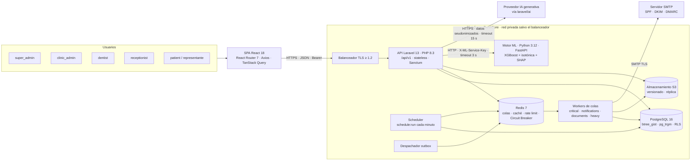
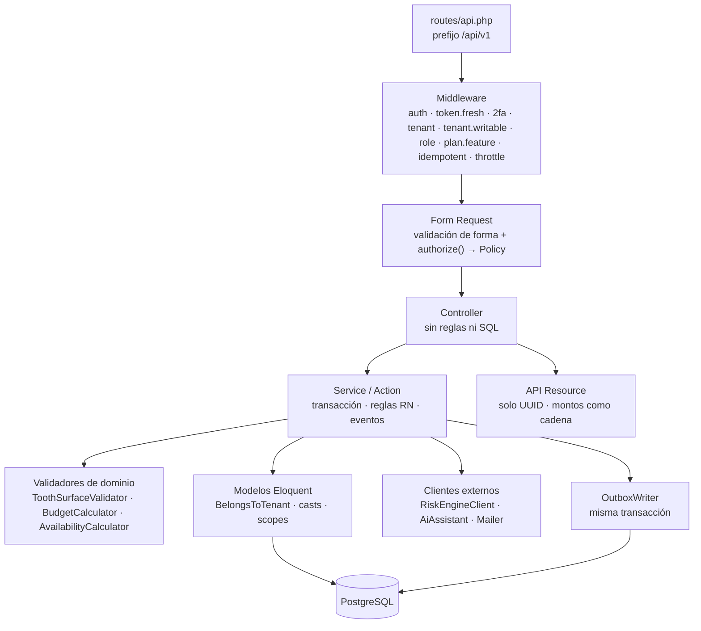
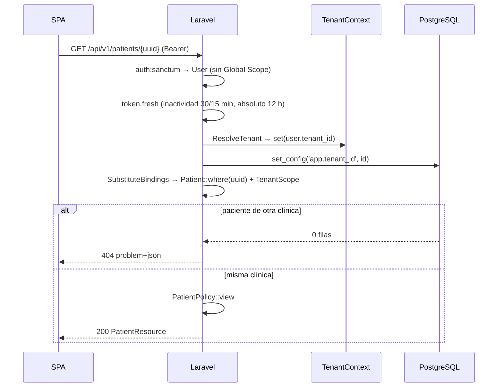
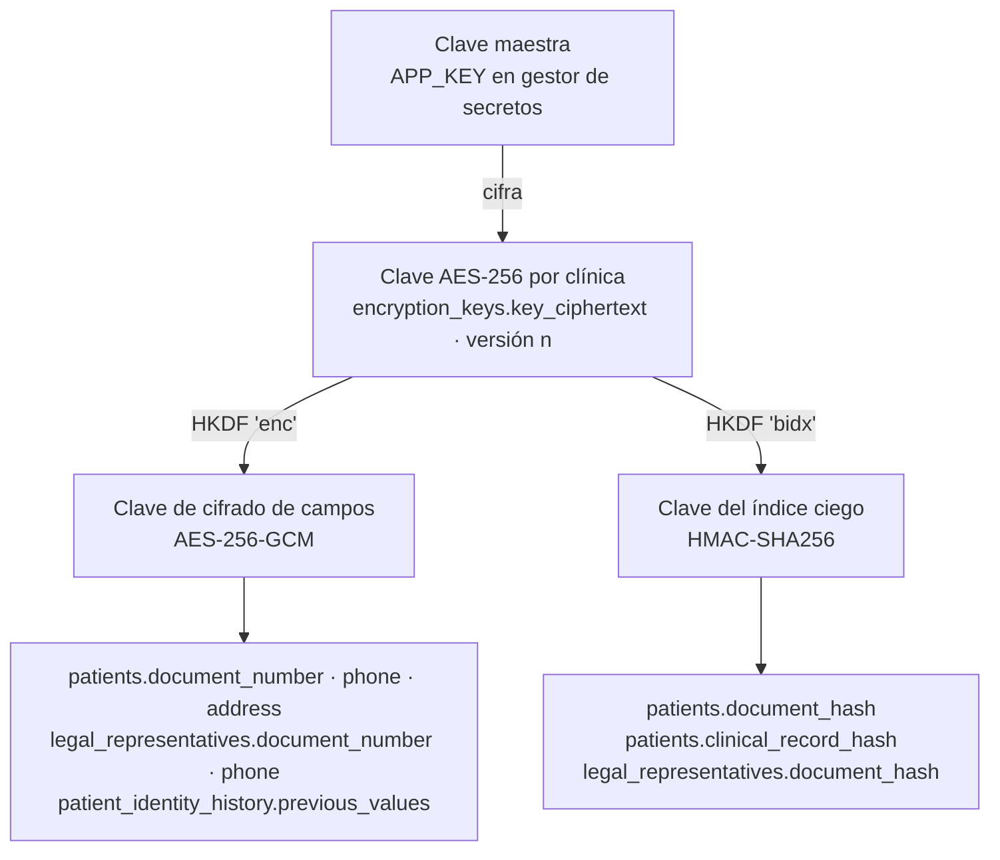
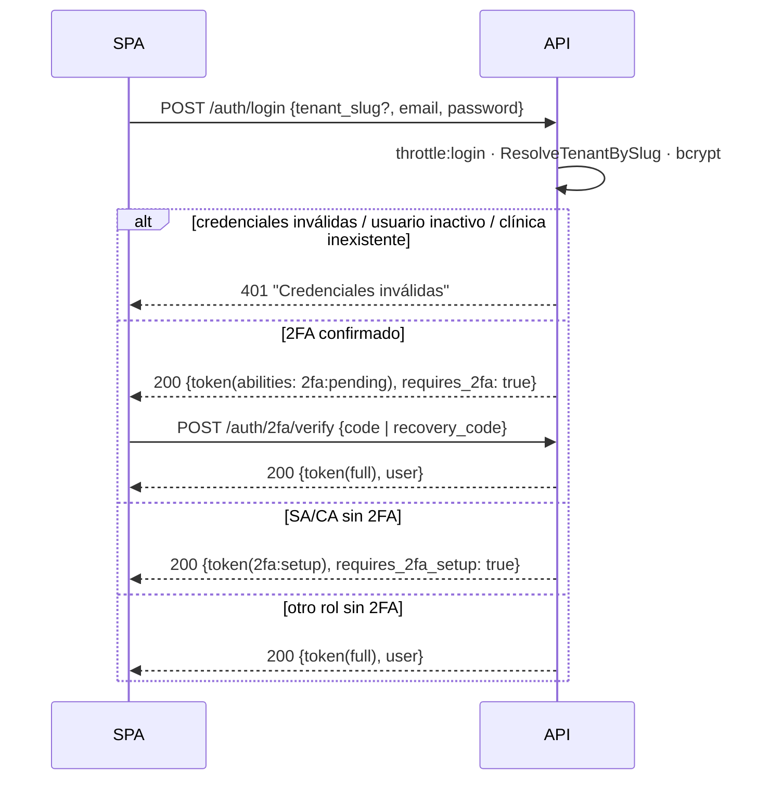
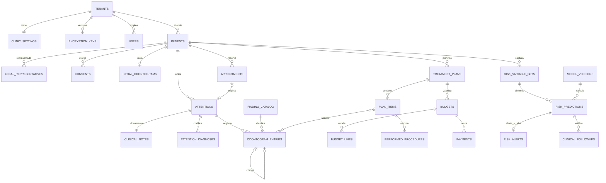
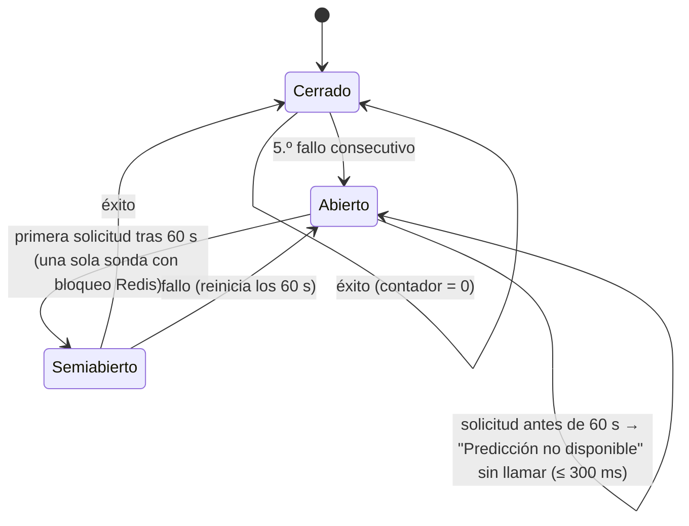
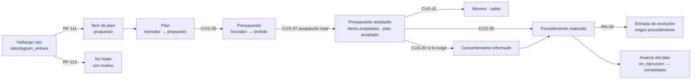
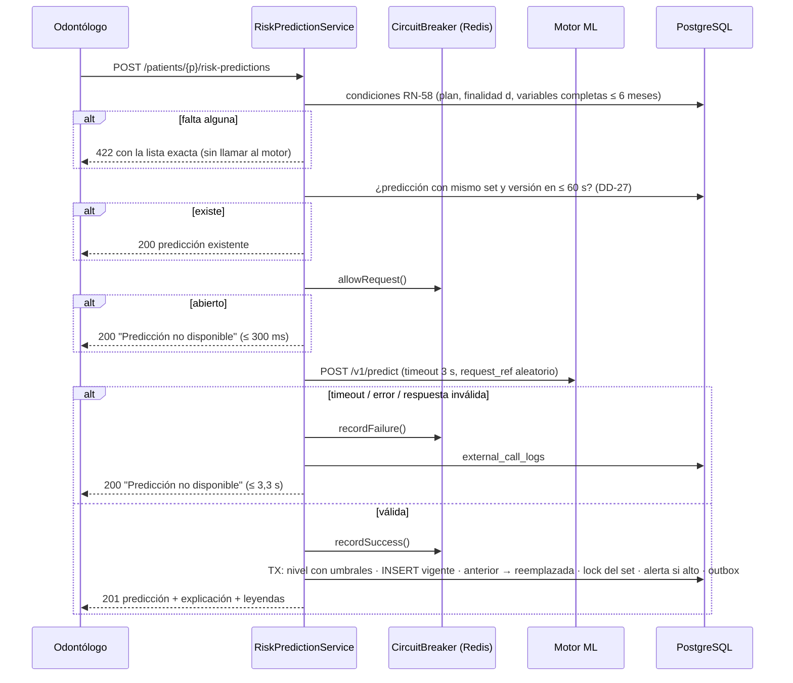

# Software Design Document: DentiCore

## 1. Arquitectura del Sistema

### 1.1 Convenciones y fuentes

| Aspecto | Regla |
| :-- | :-- |
| Fuente de requisitos | SRS DentiCore v1.0 (`claude/SRS_DentiCore.md`): 18 NN, 16 OB, 85 RN, 46 DD, 89 CUS, 201 RF, 194 RNF, 6 PQ. Ante cualquier diferencia entre este SDD y el SRS, prevalece el SRS. |
| Citas | Cada elemento de diseño cita su origen entre paréntesis: `RN-xx`, `DD-xx`, `RF-xxx`, `RNF-xxx`, `CUS-xx`, `RES-xx`, `CA-xx.x`. |
| Decisiones propias del SDD | Se identifican como `DI-xx` y se registran en §1.13. Resuelven detalles de bajo nivel que el SRS no fija; ninguna contradice un DD. |
| Pendientes | `[REQUIERE DEFINICIÓN]` + `PQ-xx`, con el supuesto de trabajo del SRS §16. Se consolidan en §8. |
| Referencias | `SRS §x.y` = sección del SRS; `§x.y` sin prefijo = sección de este SDD. |
| Idioma del código | Tablas, columnas, clases y rutas en inglés (convención Laravel). Valores de estado en español `snake_case` sin tildes, idénticos a los estados del SRS §5.5 (DI-03). |
| Notación de tipos | Laravel/PostgreSQL: `id` (`bigint` identity), `foreignId`, `uuid`, `jsonb`, `enum(...)` (en Laravel sobre PostgreSQL: `varchar` + `CHECK`), `numeric(12,2)`, `timestamptz`, `tstzrange`, `date`, `text[]`. |
| Verbos | "debe" = obligatorio para la implementación; "puede" = opcional. |

### 1.2 Vista de contexto y contenedores



| Contenedor | Tecnología | Responsabilidad | Escala | Origen |
| :-- | :-- | :-- | :-- | :-- |
| SPA | React 18, React Router 7, Axios, TanStack Query, Vite | Interfaz del personal (≥ 768 px) y del portal (≥ 360 px). Guardias de ruta solo de interfaz. | Archivos estáticos detrás de CDN o del balanceador. | DD-02, RNF-028, RNF-052 |
| API | PHP 8.3 + OPcache, Laravel 13, Sanctum | Única puerta de entrada a los datos. REST `/api/v1`, `application/problem+json`, UUID públicos. | Sin estado; ≥ 2 instancias de 2 vCPU/4 GB (ER). | DD-01, DD-19, RNF-137, SRS §13.2.1 |
| Workers | `php artisan queue:work` (Redis) | PDF, correos, exportaciones, importaciones, rotación de claves, recálculos. | ≥ 1 instancia 2 vCPU/2 GB; colas separadas. | DD-10, DD-18, RNF-043, RNF-138 |
| Scheduler | `php artisan schedule:run` (1 instancia con `onOneServer`) | Tareas temporales de §1.9. | 1 activa. | RNF-020, RNF-087 |
| Despachador outbox | Comando `outbox:dispatch` (proceso largo) | Publica en Redis los mensajes confirmados en `outbox_messages`. | 1 activo; bloqueo `FOR UPDATE SKIP LOCKED`. | DD-41, RNF-078 |
| PostgreSQL 16 | Extensiones `btree_gist`, `pg_trgm`, `pgcrypto` | Fuente de verdad; restricciones de dominio, `EXCLUDE`, disparadores de inmutabilidad, RLS. | 4 vCPU/16 GB, SSD ≥ 3000 IOPS; PITR. | RES-02, DD-09, DD-39, DD-40, RNF-192 |
| Redis 7 | Colas, caché, *rate limiting*, estado del Circuit Breaker, bloqueos distribuidos | Estado efímero; nunca fuente de verdad. | 1 GB. | DD-10, RNF-077 |
| S3 | Disco `s3` de Laravel (MinIO en desarrollo) | PDF, adjuntos, exportaciones, artefactos del modelo. Acceso solo por URL firmada de 10 min. | Versionado y réplica en otra región. | DD-18, RNF-086, RNF-103 |
| Motor ML | Python 3.12, FastAPI, scikit-learn, XGBoost, SHAP | Predicción calibrada y explicación. Sin acceso a la BD. | 1 instancia 2 vCPU/2 GB; ≤ 1 GB RAM. | RES-04, DD-12, RNF-034, RNF-040 |
| Proveedor IA | Paquete `laravel/ai`, proveedor configurable (externo u Ollama) | Salida estructurada de hallazgos y planes desde notas seudonimizadas. | Externo. | DD-11, RNF-144 |
| SMTP | Proveedor transaccional | Correos HTML + texto plano. | Externo. | DD-10, RNF-049 |

### 1.3 Arquitectura por capas del backend



| Capa | Contiene | Prohibido | Verificación | Origen |
| :-- | :-- | :-- | :-- | :-- |
| Rutas | Declaración de endpoint, grupo de middleware, *model binding* por `uuid`. | Lógica. | Prueba de contrato OpenAPI. | RNF-044 |
| Middleware | Autenticación, contexto de clínica, autorización gruesa, idempotencia, límites. | Acceso a datos de negocio fuera del contexto. | Pruebas de middleware. | RN-02, RN-06, DD-45 |
| Form Request | Reglas de formato (`rules()`), mensajes en español, `authorize()` que delega en la Policy. | Consultas de negocio complejas. | Pruebas 422 por campo. | RF-008, RNF-064 |
| Controller | Invoca un único Service/Action y devuelve un Resource. | `DB::`, Eloquent directo, reglas RN. | Pest `arch()`. | RNF-119 |
| Service / Action | Una operación de CUS, en `DB::transaction()`, con bloqueos de fila cuando corresponde. Emite eventos al outbox. | Llamadas HTTP dentro de una transacción abierta. | Pruebas unitarias e integración. | RF-011, RF-012, DD-41 |
| Validadores de dominio | Reglas puras reutilizables (FDI, superficies, catálogo, cálculo de montos, disponibilidad). | Dependencias de HTTP. | Pruebas parametrizadas y por propiedades. | RNF-121, RNF-001, RNF-003 |
| Modelos | Relaciones, *casts* (`TenantEncrypted`, `MoneyCast`), *scopes*. | Llamadas a servicios HTTP. | Pest `arch()`. | RNF-119 |
| Resources | Serialización: `uuid` como `id`, fechas ISO 8601 con zona, importes como cadena `"1234.56"`. | IDs numéricos. | Inspección automatizada. | RF-007, RNF-046 |

**Estructura de carpetas (DI-01).**

```text
app/
├── Support/                      # núcleo compartido
│   ├── Tenancy/                  # TenantContext, TenantScope, BelongsToTenant, ResolveTenant, TenantAwareJob
│   ├── Encryption/               # TenantEncryption, TenantEncrypted (cast), BlindIndex, KeyRing
│   ├── Audit/                    # AuditLogger, Auditable (trait), AuditEvent (enum)
│   ├── Evidence/                 # EvidenceSealer (HMAC), HashChainVerifier
│   ├── Http/                     # ProblemDetails, IdempotencyMiddleware, ApiResource base
│   ├── Outbox/                   # OutboxWriter, OutboxDispatcher
│   ├── Money/                    # Money (brick/math), MoneyCast, IgvCalculator
│   ├── Time/                     # ClinicClock, BusinessDays
│   └── Resilience/               # CircuitBreaker (Redis)
└── Modules/
    ├── Platform/        # M01
    ├── Identity/        # M02
    ├── Patients/        # M03
    ├── Odontogram/      # M04 (incluye atención, nota, CIE-10)
    ├── Treatment/       # M05 (catálogo, plan, presupuesto, procedimiento)
    ├── Scheduling/      # M06 (agenda y notificaciones)
    ├── Billing/         # M07
    ├── AiAssist/        # M08
    ├── Risk/            # M09
    ├── Portal/          # M10 (controladores del portal; reutiliza servicios de otros módulos)
    ├── Compliance/      # M11
    ├── Analytics/       # M12
    └── Observability/   # M13
        └── {Http/Controllers, Http/Requests, Http/Resources, Models, Services, Policies, Jobs, Events, Listeners, Enums}
```

Regla de dependencia entre módulos: un módulo solo usa los `Services` públicos y los `Models` de otro módulo, nunca sus clases internas (`Jobs`, `Listeners`, `Requests`). La prueba `arch()` lo verifica (RNF-119, RNF-120). Las clases ya implementadas (`TenantScope`, `BelongsToTenant`, `ResolveTenant`, `HasUuid`, `TenantEncrypted`, `TenantEncryption`, `TenantService`, `UserService`, `PatientService`) se mueven a esta estructura sin cambiar su comportamiento.

### 1.4 Módulos y dependencias

| Módulo | Namespace | Depende de | CUS | Prioridad |
| :-- | :-- | :-- | :-- | :-- |
| M01 Plataforma y clínicas | `Modules\Platform` | Support | CUS-01 a 05, 84 | Must |
| M02 Identidad, acceso y seguridad | `Modules\Identity` | M01 | CUS-06 a 12, 78, 79 | Must |
| M03 Pacientes y consentimientos | `Modules\Patients` | M01, M02 | CUS-13 a 20, 82, 83, 88 | Must |
| M04 Odontograma NTS 188 | `Modules\Odontogram` | M03 | CUS-21 a 27, 80, 81 | Must |
| M08 Asistencia de IA generativa | `Modules\AiAssist` | M04, M05 | CUS-28 a 31 | Should |
| M05 Plan de tratamiento y presupuestos | `Modules\Treatment` | M03, M04 | CUS-32 a 40, 89 | Must |
| M07 Pagos internos | `Modules\Billing` | M05 | CUS-41 a 43, 87 | Should |
| M06 Agenda y notificaciones | `Modules\Scheduling` | M02, M03 | CUS-44 a 53, 77, 85, 86 | Must |
| M09 Predicción de riesgo | `Modules\Risk` | M03, M04, M06 | CUS-54 a 61 | Must |
| M10 Portal del paciente | `Modules\Portal` | M03 a M09, M11, M12 | SRS §9.5 | Should |
| M11 Cumplimiento y auditoría | `Modules\Compliance` | Todos | CUS-62 a 71 | Must |
| M12 Indicadores y encuestas | `Modules\Analytics` | M05 a M07 | CUS-72 a 74 | Could |
| M13 Observabilidad | `Modules\Observability` | Support | CUS-75, 76 | Should |

### 1.5 Interfaces externas

| ID | Interfaz | Protocolo y autenticación | Tiempo máximo | Reintentos | Degradación | Origen |
| :-- | :-- | :-- | :-- | :-- | :-- | :-- |
| IE-01 | SPA → API | HTTPS, JSON UTF-8, `Authorization: Bearer <token>`; CORS con lista explícita de orígenes. | Objetivos de RNF-006 a RNF-016. | Lecturas: 2 reintentos con espera exponencial; escrituras solo con `Idempotency-Key`. | Error `problem+json` visible junto al campo o como aviso. | DD-19, RNF-080, RNF-096 |
| IE-02 | API → Motor ML | HTTP en red privada; cabecera `X-ML-Service-Key` (rotada cada 90 días); ruta versionada `/v1/predict`. | 3 s (conexión 1 s). | 0 en la solicitud del usuario (el Circuit Breaker gobierna). | "Predicción no disponible"; la atención continúa. | DD-12, RN-64, RNF-045, RNF-108 |
| IE-03 | API → Proveedor IA | `laravel/ai`; credencial del proveedor en el gestor de secretos; texto seudonimizado. | 15 s. | 0 (la sugerencia queda `fallida`). | Registro manual sin cambios. | DD-11, RN-57, RNF-109 |
| IE-04 | Workers → SMTP | SMTP con TLS; dominio con SPF, DKIM y DMARC. | 30 s por envío. | 3 reintentos con espera exponencial (1, 4, 16 min). | La operación de negocio no se revierte; notificación `fallida` reenviable. | DD-10, RF-155, RNF-076 |
| IE-05 | API/Workers ↔ S3 | API S3 con credencial de servicio; objetos cifrados AES-256 en reposo. | 10 s por operación. | 3 reintentos. | El documento queda pendiente de regeneración; alerta M13. | DD-18, RNF-086 |

### 1.6 Lógica multi-tenant

#### 1.6.1 Principios

| Principio | Implementación | Origen |
| :-- | :-- | :-- |
| BD compartida | Todas las clínicas comparten esquema; toda tabla de datos de clínica tiene `tenant_id bigint NOT NULL REFERENCES tenants(id)`. | RES-02, DD-03 |
| Asignación en servidor | `tenant_id` nunca está en `$fillable` ni se lee del cuerpo de la solicitud; lo asigna el evento `creating` de `BelongsToTenant` desde `TenantContext`. | RN-01, RF-001 |
| *Deny-by-default* | `TenantScope` agrega `WHERE tenant_id = :ctx`; sin contexto agrega `WHERE 1 = 0`. | RN-02, RF-002 |
| No revelar existencia | *Route model binding* por `uuid` pasa por el Global Scope: un recurso de otra clínica produce `ModelNotFoundException` → 404. | RN-03, RF-003 |
| Excepción `users` | `User` no usa `BelongsToTenant`: Sanctum resuelve el usuario antes que la clínica. Todo acceso a `users` pasa por `UserRepository`, que siempre filtra `tenant_id = TenantContext::id()` salvo en los servicios de plataforma de `super_admin`, que filtran `role = 'clinic_admin'` o `tenant_id IS NULL` según el caso. | DD-03 |
| Tablas de plataforma | Sin `tenant_id`: `subscription_plans`, `tenants`, `platform_settings`, `finding_catalog`, `finding_states`, `cie10_codes`, `consent_templates`, `model_versions`, `security_incidents`. Con `tenant_id` nulable: `audit_logs`, `performance_alerts`, `notifications`, `outbox_messages`, `request_metrics`, `external_call_logs`, `one_time_tokens`. | RN-04 |
| Segunda barrera | RLS de PostgreSQL por `tenant_id` en tablas de clínica (§2.13). | DD-40, RNF-102 |
| Súper Administrador | Sin `tenant_id`; opera solo sobre tablas de plataforma y metadatos. Las rutas de pacientes y HC no admiten el rol `super_admin` (403). | RN-04, RF-005 |

#### 1.6.2 Resolución de la clínica

| Origen de la solicitud | Middleware | Cómo resuelve | Resultado si falla |
| :-- | :-- | :-- | :-- |
| `POST /auth/login`, `POST /auth/password/forgot`, `GET /public/clinics/{slug}` | `ResolveTenantBySlug` | `tenant_slug` del cuerpo o `{slug}` de la ruta (tomado por la SPA de `/c/<codigo>`, DD-29); busca `tenants.slug` con estado distinto de `eliminada`. Ausente en login = `super_admin`. | Login: 401 "Credenciales inválidas" (RF-033). Perfil público: 404. |
| Rutas autenticadas de clínica | `ResolveTenant` (alias `tenant`) | `auth()->user()->tenant_id`; carga el `Tenant` (tabla de plataforma); fija `TenantContext`; ejecuta `select set_config('app.tenant_id', :id, false)`; solo después carga `ClinicSetting` (tabla de clínica). Se ejecuta antes de `SubstituteBindings` (prioridad de middleware). | Usuario sin `tenant_id` en ruta de clínica: 403. |
| Enlaces con token (confirmación de cita, encuesta, presupuesto compartido, invitación, restablecimiento) | `ResolveTenantByToken` | Busca el SHA-256 del token en `one_time_tokens` (tabla de plataforma, sin Global Scope); toma `tenant_id` del registro y fija `TenantContext` antes de cargar el recurso (`tokenable`). | 404 sin distinguir inexistente, vencido o usado (RNF-112). |
| *Jobs* en cola | `TenantAwareJob` (*job middleware*) | El *payload* serializa `tenant_id`; el middleware fija `TenantContext` y la variable de RLS antes de `handle()` y los limpia al terminar. | El *job* falla sin tocar datos. |
| Comandos programados | `TenantContext::run($tenant, fn)` | Iteran clínicas `activa`/`suspendida` y ejecutan cada lote dentro del contexto. | — |



#### 1.6.3 Contrato de las clases de aislamiento

```php
// app/Support/Tenancy/BelongsToTenant.php
trait BelongsToTenant
{
    public static function bootBelongsToTenant(): void
    {
        static::addGlobalScope(new TenantScope());
        static::creating(function (Model $model): void {
            $model->tenant_id = TenantContext::idOrFail();   // ignora cualquier valor recibido (RN-01)
        });
        static::updating(function (Model $model): void {
            if ($model->isDirty('tenant_id')) {
                throw new TenantMutationException();          // tenant_id es inmutable
            }
        });
    }

    public function tenant(): BelongsTo { return $this->belongsTo(Tenant::class); }
}

// app/Support/Tenancy/TenantScope.php
final class TenantScope implements Scope
{
    public function apply(Builder $builder, Model $model): void
    {
        $id = TenantContext::id();
        $id === null
            ? $builder->whereRaw('1 = 0')                                  // deny-by-default (RN-02)
            : $builder->where($model->qualifyColumn('tenant_id'), $id);
    }
}
```

| Regla de uso | Verificación |
| :-- | :-- |
| La única forma de omitir el scope es `Model::withoutTenantScope()`, permitida solo en clases de `Modules\Platform` (incluido `EncryptionKeyController`), `Modules\Compliance\Services\Platform*` y comandos de retención y purga. | Pest `arch()`: ninguna otra clase invoca `withoutTenantScope` ni `withoutGlobalScopes`. |
| Prohibidas las consultas crudas sobre tablas de clínica fuera de repositorios que reciben `tenant_id` explícito. | Regla SAST de RNF-104 + `arch()`. |
| Todo modelo con `tenant_id NOT NULL` usa `BelongsToTenant`. Excepciones explícitas (tenant nulable o autenticación previa a la clínica): `User`, `PersonalAccessToken`, `OneTimeToken`, `AuditLog`, `Notification`, `OutboxMessage`, `PerformanceAlert`, `RequestMetric`, `ExternalCallLog`, `ScheduledTaskRun`, `IdempotencyKey`; se consultan solo mediante repositorios que filtran `tenant_id` o el usuario. | Prueba que recorre los modelos y compara con la lista de excepciones (RNF-101). |

### 1.7 Seguridad transversal

| Control | Diseño | Origen |
| :-- | :-- | :-- |
| Tokens | Sanctum `personal_access_tokens` (hash SHA-256 del token de 40 caracteres aleatorios ≥ 128 bits). `expires_at` (columna estándar de Sanctum) = emisión + 12 h vía `createToken($name, $abilities, now()->addHours(12))`; Sanctum rechaza el token vencido. Columnas agregadas: `tenant_id`, `ip_address`, `user_agent`, `device_label`. Habilidades (`abilities`): `2fa:pending`, `2fa:setup`, `full`. | RF-036, RNF-094 |
| Inactividad | `Sanctum::authenticateAccessTokensUsing(fn ($token, bool $isValid) => $isValid && !InactivityPolicy::expired($token))` en `AppServiceProvider`. El *callback* se ejecuta antes de que Sanctum actualice `last_used_at`, por lo que compara `now − last_used_at` con 30 min (personal) o 15 min (`patient`); si venció, borra el token y la solicitud recibe 401. | DD-15, RF-036, CA-06.5 |
| 2FA | TOTP RFC 6238 (6 dígitos, 30 s, ventana ±1). Secreto cifrado con la clave maestra. Tras contraseña correcta: si el usuario tiene 2FA confirmado → token `2fa:pending`; si es `super_admin`/`clinic_admin` sin 2FA → token `2fa:setup` (solo rutas de configuración, CA-06.4); en otro caso → `full`. Middleware `2fa` exige `full`. | DD-15, DD-36, RF-037, RF-038 |
| Bloqueo | `users.failed_login_count`; al 5.º fallo consecutivo `status = bloqueado_temporal`, `locked_until = now + 15 min`, correo de aviso (outbox). Un fallo de TOTP cuenta como intento. | RF-034, CA-06.2 |
| Límites | `throttle:login` 5/min por IP; `throttle:api` 60/min por usuario; `throttle:tenant` 1200/min por clínica (valor del plan); `throttle:codes` 5 intentos fallidos/15 min por usuario y propósito para TOTP, recuperación y OTP. Respuesta 429 con `Retry-After`. | DD-19, RF-035, RNF-042, RNF-111 |
| Contraseñas | `Hash::make` bcrypt `rounds = 12`; política 10–128 caracteres, lista de ≥ 10 000 contraseñas comunes (`storage/app/security/common-passwords.txt`), no contener correo ni nombre, no repetir las 5 últimas (`user_password_histories`). | DD-15, RF-040, RNF-093 |
| Token en el navegador | `sessionStorage` (clave `dc.token`); nunca `localStorage`. Se borra en logout y en 401. | DD-44, RNF-094 |
| Cabeceras | CSP `default-src 'self'; script-src 'self'; style-src 'self'; img-src 'self' data: blob: https://<bucket>; connect-src 'self' https://<api>; frame-ancestors 'none'; base-uri 'none'; form-action 'self'`; `X-Content-Type-Options: nosniff`; `Referrer-Policy: strict-origin-when-cross-origin`; `Permissions-Policy: camera=(), microphone=(), geolocation=()`; HSTS `max-age=31536000; includeSubDomains`. | DD-44, RNF-090, RNF-095 |
| Errores | `ProblemDetails` renderiza toda excepción como `application/problem+json` con `type`, `title`, `status`, `detail` en español, `instance` (id de correlación) y, en 422, `errors: {campo: [motivo]}`. Nunca expone trazas ni SQL. | DD-19, RF-008 |
| Identificadores | `HasUuid` genera `uuid` en PHP; *route keys* por `uuid`; `$hidden = ['id', '*_id']` en Resources. | DD-19, RF-007 |
| Idempotencia | Middleware `idempotent`: exige cabecera `Idempotency-Key` (UUID) en las rutas marcadas; guarda `(subject, key, request_hash)` con la respuesta 24 h (`subject` = usuario autenticado o hash del token público); misma clave y mismo cuerpo → misma respuesta; misma clave y cuerpo distinto → 422. | DD-45, RNF-079 |
| Evidencias | `EvidenceSealer::seal(array $payload)` = HMAC-SHA256 con `EVIDENCE_HMAC_KEY` (gestor de secretos) sobre JSON canónico (claves ordenadas, UTF-8). Aplica a consentimientos, decisiones de presupuesto, cierres de atención y consentimientos informados. | DD-46, RNF-113 |
| Cadenas de hashes | Disparadores `BEFORE INSERT` calculan `hash = sha256(prev_hash ‖ fila canónica)` por paciente en `odontogram_entries` y por clínica en `audit_logs` (cadena de plataforma para `tenant_id` nulo), serializados con `pg_advisory_xact_lock`; la fila previa se busca en la tabla padre particionada, no en la partición. Verificación diaria (§1.9). | DD-46, RNF-089, RNF-114 |
| Registros técnicos | `Log::withContext(['correlation_id', 'tenant_uuid', 'user_uuid'])`; un procesador Monolog elimina claves `document*`, `phone`, `email`, `address`, `note`, `token`, `password`. | RNF-110, RNF-125 |

#### 1.7.1 Jerarquía de claves de cifrado



| Elemento | Diseño | Origen |
| :-- | :-- | :-- |
| Sobre del texto cifrado | `v{version}:{base64(iv ‖ ciphertext ‖ tag)}`; la versión identifica la clave con la que se descifra durante una rotación. | DD-04, RF-048 |
| Normalización antes del índice ciego | `strtoupper(trim(numero))` + prefijo del tipo (`DNI:`, `CE:`, `PAS:`, `CPP:`). | RN-09, CA-14.1 |
| Rotación | `RotateTenantKeyJob` (cola `heavy`): crea versión n+1 `activa`, marca la n `rotando`, recifra por lotes de 500 con `FOR UPDATE SKIP LOCKED` y recalcula índices; al terminar, versión n `retirada`. Durante la rotación, la unicidad se comprueba contra ambos índices. | DD-04, RF-048, RNF-023 |

### 1.8 Flujo de autenticación



### 1.9 Procesamiento asíncrono y tareas programadas

**Outbox (DD-41).** Todo efecto asíncrono se escribe con `OutboxWriter::record(type, payload, queue)` dentro de la transacción del Service. `outbox:dispatch` lee lotes `WHERE dispatched_at IS NULL AND available_at <= now() ORDER BY id FOR UPDATE SKIP LOCKED LIMIT 100`, publica el *job* en Redis y marca `dispatched_at`. Los *jobs* son idempotentes por `outbox_messages.uuid`: al terminar marcan `consumed_at` y, si ya estaba marcado, no repiten el efecto. Con Redis caído, los mensajes esperan en PostgreSQL (RNF-077, RNF-078).

| Cola | Contenido | Concurrencia | Origen |
| :-- | :-- | :-- | :-- |
| `critical` | Alertas de riesgo, avisos de incidentes y plazos ARCO. | 2 workers | RN-61, RN-71 |
| `notifications` | Correos y notificaciones in-app. | ≥ 300 mensajes/min | RNF-039 |
| `documents` | PDF de presupuesto, recibo, constancia, ficha de atención, copia de HC. | 2 | DD-18, RNF-012 |
| `heavy` | Exportaciones, importaciones, rotación de claves, eliminación de clínica. | Máx. 2 simultáneos por clínica (`WithoutOverlapping` + semáforo Redis) | RNF-043 |

| Tarea programada | Frecuencia | Efecto | CUS / RF | Ventana |
| :-- | :-- | :-- | :-- | :-- |
| `appointments:mark-no-shows` | Cada 5 min | Citas activas con `ends_at + 30 min <= now()` y sin check-in → `inasistencia`. | CUS-51, RF-152 | 30–35 min (RNF-020) |
| `attentions:auto-close` | Cada 5 min; por clínica, cuando son las 23:59 en su zona | Cierra atenciones abiertas y odontogramas iniciales; `cerrada_incompleta` si falta RN-77. | CUS-27, RF-096 | ≤ 5 min tras 23:59 |
| `budgets:expire` | Cada 5 min; por clínica, tras las 23:59 | `emitido` con `expires_at <= now()` → `vencido`. | CUS-38, RF-124 | ≤ 5 min |
| `budgets:notify-expiring` | Diaria 08:00 hora clínica | Aviso 3 días antes (finalidad b). | RF-125 | — |
| `appointments:send-reminders` | Cada 5 min | Recordatorio para citas con inicio en [now + 23 h 30 min, now + 24 h]; `dedupe_key` único. | CUS-52, RF-156 | RNF-019 |
| `controls:remind-and-expire` | Diaria 07:00 | Recordatorio 7 días antes; `pendiente` vencido → `vencido`. | CUS-85, RF-159 | — |
| `ai:expire-suggestions` | Cada 15 min | `pendiente` con `expires_at <= now()` → `expirada`. | CUS-31, RF-105 | — |
| `risk:expire-predictions` | Diaria 00:30 | `vigente` con `expires_at <= now()` → `vencida`. | RN-60 | — |
| `representations:end-at-majority` | Diaria 00:05 hora clínica | Cierra representaciones de pacientes que cumplen 18 años; revoca acceso del representante. | RF-061 | — |
| `arco:deadline-reminders` | Diaria 08:00 | Aviso a 2 días hábiles del plazo. | RF-185 | — |
| `incidents:deadline-alerts` | Cada 15 min | Alertas a 24 h y 40 h sin notificación a la autoridad. | CUS-68, RF-189 | — |
| `retention:apply` | Diaria 02:00 | `activo` → `pasivo` (5 años); `pasivo`/`bloqueado` → `apto_eliminacion` (20 años). | CUS-69, RF-190 | ≤ 30 min |
| `tenants:purge-cancelled` | Diaria 03:00 | Día 91 tras cancelación: exportación final y eliminación. | RF-021 | — |
| `surveys:send` | Cada 15 min | Encuesta 2 h después de cita `atendida` (finalidad e). | CUS-72, RF-193 | — |
| `integrity:verify` | Diaria 04:00 | Cadenas de hashes, abonos ≤ total, citas sin solapamiento; violación → alerta. | RNF-089 | — |
| `observability:evaluate` | Cada minuto | Reglas de RF-198 y RF-199 sobre `request_metrics` y `external_call_logs`. | CUS-75 | — |
| `notifications:prune-inapp` | Diaria | Oculta in-app con más de 90 días. | RF-158 | — |
| `idempotency:prune` / `outbox:prune` | Horaria | Borra claves vencidas (24 h) y mensajes despachados > 7 días. | DD-45 | — |

Todas las tareas procesan lo pendiente desde su última ejecución exitosa (marca en `scheduled_task_runs`), por lo que una caída no pierde efectos ni los duplica (RNF-087). Las pruebas usan `Carbon::setTestNow()` / `$this->travelTo()` (RNF-130).

### 1.10 Arquitectura del frontend

| Aspecto | Diseño | Origen |
| :-- | :-- | :-- |
| Rutas | `/login` (SA) · `/c/:slug/login` · `/c/:slug/activar/:token` · `/c/:slug/restablecer/:token` · `/admin/*` (SA) · `/c/:slug/app/*` (personal) · `/c/:slug/portal/*` (paciente) · `/c/:slug/p/:token` (presupuesto compartido) · `/c/:slug/confirmar/:token` · `/c/:slug/encuesta/:token`. | DD-29 |
| Guardias | `<RequireAuth>` → `<RequireTwoFactor>` → `<RequireRole allow={[...]}>` → `<RequireFeature feature="ai|risk|analytics">`. Solo ocultan navegación; el backend decide (RN-06). | DD-02 |
| Cliente HTTP | `src/api/client.js` (Axios): `baseURL = VITE_API_URL + '/api/v1'`; interceptor que añade `Authorization` desde `sessionStorage`, `Accept-Language: es-PE`, `X-Correlation-Id`; en 401 borra el token y redirige al login de la clínica; en 409/422 entrega `errors` al formulario; genera `Idempotency-Key` (UUID v4) por intento de envío de formulario y lo reutiliza en reintentos. | DD-44, DD-45, RNF-080 |
| Estado de servidor | TanStack Query: claves `[recurso, tenantSlug, uuid, filtros]`; `staleTime` 30 s en HC y agenda; `refetchInterval` 30 s en la HC abierta y la sala de espera. | RNF-150 |
| Inactividad | Temporizador global: aviso a los 28 min (personal) y 13 min (portal) con opción de continuar (`POST /auth/keepalive`). | RNF-065 |
| Formato | `Intl.NumberFormat('es-PE', {style:'currency', currency:'PEN'})` → `S/ 1,234.56`; fechas `dd/MM/yyyy`, 24 h, zona de la clínica (`Intl.DateTimeFormat` con `timeZone`). | RF-009, RNF-189 |
| Validación en cliente | Esquemas `zod` generados desde el OpenAPI; mismos límites que los Form Requests. | RNF-064 |
| Odontograma | Componente SVG propio con las 52 piezas; selección de pieza sin viaje al servidor; sigla + color en cada hallazgo; navegación por teclado (número de pieza, letra de superficie). | RF-077, RNF-027, RNF-058, RNF-061 |
| Carga | *Code splitting* por área (`admin`, `app`, `portal`); JS inicial ≤ 300 KB comprimido. | RNF-028 |
| Accesibilidad | Componentes con `aria-*`; `axe-core` en Playwright. | RNF-059, RNF-060 |

### 1.11 Despliegue y entornos

| Aspecto | Diseño | Origen |
| :-- | :-- | :-- |
| Artefactos | Imágenes OCI: `denticore-api` (php-fpm + nginx), `denticore-worker`, `denticore-scheduler`, `denticore-ml`, `denticore-spa` (nginx estático). Configuración por variables de entorno. | RNF-143 |
| Entornos | `local` (Docker Compose con PostgreSQL 16, Redis 7, MinIO, Mailpit, ML), `staging` (= ER con CDR sintético), `production`. Sin datos reales fuera de producción. | RES-08, RNF-107, RNF-187 |
| Alojamiento | Proveedor con ISO/IEC 27001; región en Perú o país con protección equivalente; contratos de encargo. `[REQUIERE DEFINICIÓN]` proveedor y presupuesto (PQ-04). | DD-42, RNF-155, RNF-156 |
| Respaldos | PITR continuo (RPO ≤ 15 min); completos diarios 35 días y mensuales 12 meses, AES-256, otra región; simulacro trimestral; RTO ≤ 4 h. | DD-39, RNF-081 a RNF-084 |
| Despliegue | Pipeline: lint → análisis estático → pruebas → OpenAPI → build → despliegue continuo sin corte (rolling) → *smoke test*. Migraciones con patrón expandir/contraer. Reversión ≤ 10 min. | RNF-072, RNF-132, RNF-142 |
| Red | Solo el balanceador es público; ML, PostgreSQL y Redis en red privada. | RNF-108 |
| Reloj | NTP en todos los nodos (desviación ≤ 1 s). | RNF-088 |

### 1.12 Observabilidad

| Señal | Diseño | Origen |
| :-- | :-- | :-- |
| Métricas por solicitud | Middleware `RecordRequestMetrics` acumula en Redis por minuto `(tenant_id, route_name, status_class)` → histograma de latencia; `observability:flush` persiste en `request_metrics` cada minuto. | RF-197 |
| Servicios externos | `external_call_logs` por llamada a ML, IA y SMTP (latencia, resultado, estado del Circuit Breaker). | RF-197, RN-64 |
| Alertas | `observability:evaluate` crea `performance_alerts` según RF-198 y RF-199 y notifica al Súper Administrador (y al Administrador de Clínica si la alerta tiene `tenant_id`). | CUS-75, CUS-76 |
| Salud | `GET /api/v1/health` (sin autenticación, sin datos de clínicas): estado de BD, Redis, cola (edad del *job* más antiguo), ML (`/v1/health`) y proveedor IA (última llamada). | RF-201 |
| Logs | JSON con `correlation_id`, propagado a *jobs* (propiedad del *payload*), al motor ML (`X-Correlation-Id`) y a la IA (metadatos). Retención 90 días. | RNF-125, RNF-182 |

### 1.13 Decisiones de implementación (SDD)

| ID | Decisión | Alternativa descartada | Fundamento | SRS relacionado |
| :-- | :-- | :-- | :-- | :-- |
| DI-01 | Monolito modular con `app/Modules/<Módulo>` y núcleo `app/Support`. | Microservicios por módulo. | RES-07 (3 personas, 12 semanas); RNF-119 y RNF-120 exigen fronteras verificables, no despliegues separados. | RNF-119, RNF-120 |
| DI-02 | Clave primaria interna `bigint` identity + `uuid` público en cada tabla expuesta. | UUID como PK. | Índices más compactos para las tablas de mayor volumen (`odontogram_entries` ≈ 2,95 M filas en el CDR); la API solo expone UUID. | DD-19, RNF-037 |
| DI-03 | Valores de estado en español `snake_case`, idénticos al SRS (`borrador`, `emitido`, `cerrada_incompleta`, `activa`). Los datos existentes de `tenants.status` (`active`, `suspended`, `cancelled`) y `users.is_active` se migran a `status` en español. | Estados en inglés. | Un solo vocabulario SRS ↔ BD ↔ API ↔ pruebas; evita tablas de traducción. Los roles técnicos se mantienen en inglés porque así los define SRS §2.3. | SRS §5.5 |
| DI-04 | Dominios cerrados con `enum()` de Laravel (`varchar` + `CHECK`). | Tipos `ENUM` nativos de PostgreSQL. | Ya adoptado en la implementación; agregar un valor es una migración de `CHECK` sin `ALTER TYPE`. | RNF-192 |
| DI-05 | Importes `numeric(12,2)` y aritmética con `brick/math` (`BigDecimal`, `RoundingMode::HALF_UP`) en `Money`. | `float` o `numeric(10,2)`. | RNF-001 fija `numeric(12,2)` y aritmética exacta. | RNF-001, RN-29 |
| DI-06 | Cifrado de campos con AES-256-GCM y sobre versionado `v{n}:`. | AES-256-CBC de `Crypt` sin versión. | La versión permite descifrar durante la rotación (RF-048); GCM autentica el texto. | DD-04 |
| DI-07 | Número de HC guardado cifrado (`clinical_record_number`) con su propio índice ciego y fijado al crear la ficha. | Número de HC en claro. | RN-79 iguala el número de HC al DNI; guardarlo en claro anularía el cifrado de DD-04. Se fija al crear porque RN-79 dice que no cambia. | RN-79, DD-04 |
| DI-08 | Superficies como `text[]` con `CHECK` de subconjunto de `{M,D,O,I,V,L,P}` y función `fn_valid_surfaces(tooth, surfaces)`. | Tabla por superficie. | Una entrada es atómica (SRS §5.3); la función permite el `CHECK` de RN-18 en BD (RNF-192). | RN-18, RNF-003 |
| DI-09 | Tipo de rango propio `timerange` (`CREATE TYPE timerange AS RANGE (subtype = time)`) para franjas de horario laboral. | Validar solapamiento solo en PHP. | Permite `EXCLUDE USING gist` entre franjas de un mismo día (RF-142). | RF-142, DD-09 |
| DI-10 | RLS con `set_config('app.tenant_id', …, false)` fijado por `ResolveTenant` y limpiado en `terminate()`; *jobs* lo fijan en `TenantAwareJob`. Rol de BD `denticore_app` sin `BYPASSRLS`; rol `denticore_platform` con `BYPASSRLS` solo para servicios de plataforma y retención. | `SET LOCAL` por transacción. | Las lecturas fuera de transacción también quedan cubiertas; compatible con conexiones por solicitud de PHP-FPM. | DD-40, RNF-102 |
| DI-11 | Cadenas de hashes calculadas por disparador de BD con `pg_advisory_xact_lock`. | Cálculo en PHP. | Ninguna inserción (incluida una manual) escapa de la cadena. | DD-46 |
| DI-12 | Estado del Circuit Breaker en Redis (`cb:ml:state`, `cb:ml:failures`, `cb:ml:opened_at`) con operaciones atómicas Lua; si Redis no responde, el breaker se considera cerrado y rige el timeout de 3 s. | Estado en memoria del proceso. | Varias instancias de API deben compartir el estado (RNF-137). | RF-166, RNF-077 |
| DI-13 | Portal en rutas propias `/api/v1/portal/*` con Resources sin notas clínicas. | Reutilizar rutas del personal con filtros por rol. | Garantiza por construcción que la respuesta del portal no contiene la nota (RF-179). | RF-179, RN-06 |
| DI-14 | Búsqueda de nombres con columna `search_name` (minúsculas, sin tildes, calculada en el modelo) e índice GIN `pg_trgm`. | Extensión `unaccent` en índice funcional. | `unaccent` no es `IMMUTABLE`; la columna normalizada evita funciones envoltorio. Orden alfabético con colación ICU `es-PE-x-icu`. | RF-054, RNF-007, RNF-190 |
| DI-15 | Tokens de un solo uso en `one_time_tokens` (propósitos: invitación, restablecimiento, confirmación de cita, OTP de presupuesto, cambio de correo). | Una tabla por propósito. | Mismo tratamiento de hash, vencimiento, uso y límite de intentos (RNF-111, RNF-112). | DD-15, DD-22, DD-35 |
| DI-16 | Documentos generados en `generated_documents` (polimórfica) y archivos en `stored_files`. | Rutas de archivo en cada tabla. | Un único punto para URL firmada de 10 min, antivirus y auditoría de descargas. | DD-18, RNF-103, RN-67 |
| DI-17 | Particionado anual por `created_at` de `audit_logs` y por `recorded_at` de `odontogram_entries`. | Tablas sin particionar. | RNF-041 exige mantener tiempos con 20 años de historia. | RNF-041 |
| DI-18 | El motor ML carga los artefactos de cada versión desde S3 (`models/<version>/`) y atiende la versión indicada en la solicitud; Laravel decide cuál está activa. | Versión fija en la imagen del motor. | Publicar un modelo sin desplegar Laravel (RNF-145) ni el motor. | RNF-145, CUS-61 |
| DI-21 | Excepciones acotadas a los disparadores de inmutabilidad mediante variables de sesión transaccionales (`set_config(…, 'on', true)`) fijadas solo por su Service: `app.arco_erasure` (`ArcoCancellationService`) permite vaciar `risk_variable_sets.sociodemographic` y los valores sociodemográficos de `risk_predictions.explanation_individual`; `app.patient_merge` (`PatientMergeService`) permite cambiar únicamente `patient_id`; `app.retention_delete` (`RetentionService` de CUS-70 y `PurgeCancelledTenantsJob`) permite `DELETE`. Todas quedan auditadas. | Conservar datos opcionales, no fusionar fichas con historial o impedir la eliminación legal. | RN-69 exige eliminar los datos de finalidades opcionales, DD-37 reasignar las entradas sin cambiar su contenido y RN-68/DD-16 eliminar tras la retención o la cancelación; la excepción queda limitada a columnas u operaciones concretas y a una transacción. | RN-68, RN-69, RF-184, RF-021, RF-191, DD-37 |

## 2. Esquema de Base de Datos

### 2.1 Convenciones

| Convención | Regla | Origen |
| :-- | :-- | :-- |
| Motor | PostgreSQL 16, codificación UTF-8, colación por defecto `und-x-icu`; columnas de nombres con `COLLATE "es-PE-x-icu"`. | RES-01, RNF-190, RNF-191 |
| Extensiones | `btree_gist` (EXCLUDE), `pg_trgm` (búsqueda por nombre y CIE-10), `pgcrypto` (`gen_random_uuid`, `digest`). | DD-09, RF-054, RF-085 |
| Columnas base | **B** = `id bigint GENERATED ALWAYS AS IDENTITY PK`, `created_at timestamptz NOT NULL DEFAULT now()`, `updated_at timestamptz NULL`. **BU** = B + `uuid uuid NOT NULL UNIQUE` (generado en PHP por `HasUuid`, `DEFAULT gen_random_uuid()` como respaldo). **BT** = BU + `tenant_id bigint NOT NULL → tenants(id)` + `BelongsToTenant` + política RLS (§2.13). **BTi** = BT inmutable: sin `updated_at` y con disparador `trg_forbid_update_delete`. | DI-02, DD-03, DD-19 |
| Claves foráneas | `ON DELETE RESTRICT` salvo indicación. Dentro de una clínica, las FK son compuestas `(tenant_id, x_id) → x(tenant_id, id)`; por eso toda tabla BT declara además `UNIQUE (tenant_id, id)`. Un registro no puede referenciar datos de otra clínica ni por error de aplicación (DI-19). | RN-01, RNF-192 |
| Montos | `numeric(12,2)`; porcentajes `numeric(5,2)`; probabilidades `numeric(5,4)`. | RNF-001 |
| Tiempo | `timestamptz` en UTC; fechas civiles (`birth_date`, `operation_date`) como `date`. La zona de presentación es `tenants.timezone`. | RF-009 |
| Estados | `enum(...)` = `varchar` + `CHECK` (DI-04). Valores del SRS §5.5 (DI-03). | SRS §5.5 |
| Borrado | No hay `softDeletes` en datos clínicos: se usan estados (`anulado`, `revocado`, `fusionado`). Eliminación física solo en CUS-70 y en la purga de clínica cancelada. | RN-68, RNF-159 |
| Índice por clínica | Toda tabla BT de consulta frecuente tiene un índice que empieza por `tenant_id`. | RNF-030 |
| Tablas particionadas | `odontogram_entries` y `audit_logs` (DI-17) quedan exentas de `uuid UNIQUE` y de `UNIQUE (tenant_id, id)`: usan `UNIQUE (uuid, <clave de partición>)` y se referencian por `uuid` sin FK. | RNF-041 |

**Decisión adicional.** DI-19: FK compuestas con `tenant_id` en todas las relaciones intra-clínica (alternativa descartada: FK simples por `id`). Fundamento: el aislamiento queda garantizado por la BD además del Global Scope y la RLS (RNF-101, RNF-192).

### 2.2 Objetos SQL auxiliares

```sql
-- Piezas del Sistema Dígito Dos (RN-16)
CREATE FUNCTION fn_valid_tooth(t smallint) RETURNS boolean IMMUTABLE LANGUAGE sql AS $$
  SELECT (t / 10 IN (1,2,3,4) AND t % 10 BETWEEN 1 AND 8)
      OR (t / 10 IN (5,6,7,8) AND t % 10 BETWEEN 1 AND 5) $$;

-- Superficies por tipo de pieza (RN-18): O premolares/molares; I incisivos/caninos;
-- P superiores (cuadrantes 1,2,5,6); L inferiores (3,4,7,8); M, D, V todas.
CREATE FUNCTION fn_valid_surfaces(t smallint, s text[]) RETURNS boolean IMMUTABLE LANGUAGE sql AS $$
  SELECT s <@ ARRAY['M','D','O','I','V','L','P']
     AND cardinality(s) = cardinality(ARRAY(SELECT DISTINCT unnest(s)))
     AND (NOT 'O' = ANY(s) OR t % 10 >= 4)   -- premolares 4-5 y molares 6-8; temporales 4-5
     AND (NOT 'I' = ANY(s) OR t % 10 <= 3)   -- incisivos 1-2 y canino 3
     AND (NOT 'P' = ANY(s) OR (t / 10) IN (1,2,5,6))
     AND (NOT 'L' = ANY(s) OR (t / 10) IN (3,4,7,8)) $$;

-- Mismo arco (superior: cuadrantes 1,2,5,6; inferior: 3,4,7,8) para hallazgos de tramo
CREATE FUNCTION fn_same_arch(a smallint, b smallint) RETURNS boolean IMMUTABLE LANGUAGE sql AS $$
  SELECT ((a / 10) IN (1,2,5,6)) = ((b / 10) IN (1,2,5,6)) $$;

-- Rango de horas para franjas del horario laboral (DI-09)
CREATE TYPE timerange AS RANGE (subtype = time);

-- Inmutabilidad (RN-22, RN-34, RN-67, RN-78)
CREATE FUNCTION fn_forbid_update_delete() RETURNS trigger LANGUAGE plpgsql AS $$
BEGIN
  IF TG_OP = 'DELETE' AND current_setting('app.retention_delete', true) = 'on' THEN RETURN OLD; END IF;  -- DI-21
  RAISE EXCEPTION 'immutable_row: % on %', TG_OP, TG_TABLE_NAME USING ERRCODE = '55000';
END $$;

-- Cadena de hashes (DD-46, DI-11)
-- TG_ARGV[0] = tabla padre (particionada); TG_ARGV[1] = columna que agrupa la cadena;
-- TG_ARGV[2] = columna excluida del hash (opcional)
CREATE FUNCTION fn_hash_chain() RETURNS trigger LANGUAGE plpgsql AS $$
DECLARE scope_val bigint; prev text;
BEGIN
  EXECUTE format('SELECT ($1).%I', TG_ARGV[1]) INTO scope_val USING NEW;
  PERFORM pg_advisory_xact_lock(hashtextextended(TG_ARGV[0] || ':' || coalesce(scope_val, 0), 0));
  EXECUTE format('SELECT hash FROM %I WHERE %I IS NOT DISTINCT FROM $1 ORDER BY id DESC LIMIT 1',
                 TG_ARGV[0], TG_ARGV[1]) INTO prev USING scope_val;           -- busca en la tabla padre
  NEW.prev_hash := coalesce(prev, repeat('0', 64));
  NEW.hash := encode(sha256(convert_to(NEW.prev_hash
              || (to_jsonb(NEW) - 'hash' - 'prev_hash' - coalesce(TG_ARGV[2], ''))::text, 'UTF8')), 'hex');
  RETURN NEW;
END $$;
```

| Objeto | Uso | Verificación |
| :-- | :-- | :-- |
| `fn_valid_tooth` | `CHECK` en `odontogram_entries.tooth`, `tooth_end`, `plan_items.tooth`, `budget_lines.tooth`. | RNF-003: 52 piezas válidas; 19, 29, 56, 91 inválidas. |
| `fn_valid_surfaces` | `CHECK` en `odontogram_entries`, `plan_items`. | RNF-003: 364 combinaciones pieza × superficie. |
| `fn_forbid_update_delete` | Disparador `BEFORE UPDATE OR DELETE` en tablas BTi; en tablas con estado controlado, un disparador específico permite solo las columnas de estado. Todos estos disparadores (incluidos los de `consents`, `payments`, `budgets`, `budget_lines`, `clinical_notes` y `attention_diagnoses`) aceptan `DELETE` solo con `app.retention_delete = on` y cambios de `patient_id` solo con `app.patient_merge = on` (DI-21). | CA-22.5, RF-089, RF-186 |
| `fn_hash_chain('odontogram_entries', 'chain_patient_id', 'patient_id')` / `fn_hash_chain('audit_logs', 'tenant_id')` | `BEFORE INSERT` en `odontogram_entries` y `audit_logs` (cadena de plataforma cuando `tenant_id` es nulo). | RNF-089, RNF-114 |

### 2.3 Plataforma y clínicas (M01)

#### `subscription_plans`
Base **BU** (plataforma, sin `tenant_id`).

| Columna | Tipo | Restricciones | Origen |
| :-- | :-- | :-- | :-- |
| code | enum('basic','pro','enterprise') | NOT NULL, UNIQUE | DD-16 |
| name | varchar(60) | NOT NULL | DD-16 |
| max_dentists | smallint | NULL = ilimitado; CHECK (max_dentists > 0) | RN-08 |
| includes_ai | boolean | NOT NULL | RN-08, RN-53 |
| includes_risk | boolean | NOT NULL | RN-08, RN-58 |
| includes_analytics | boolean | NOT NULL | DD-16 |
| ai_monthly_quota | integer | NULL; CHECK (≥ 0). Semilla: `pro` 300, `enterprise` 1500 `[REQUIERE DEFINICIÓN]` (PQ-02) | RN-83 |
| rate_limit_per_minute | integer | NOT NULL DEFAULT 1200 | RNF-042 |
| monthly_price_pen | numeric(12,2) | NULL `[REQUIERE DEFINICIÓN]` (PQ-01) | DD-16 |

Semilla: `basic` (2, false, false, false), `pro` (10, true, true, false), `enterprise` (NULL, true, true, true) (DD-16).

#### `tenants`
Base **BU** (plataforma; raíz del aislamiento).

| Columna | Tipo | Restricciones | Origen |
| :-- | :-- | :-- | :-- |
| name | varchar(150) | NOT NULL; 3–150 | RF-013 |
| legal_name | varchar(200) | NOT NULL; 3–200 | DD-22 |
| ruc | char(11) | NOT NULL, UNIQUE; CHECK (ruc ~ '^(10\|20)[0-9]{9}$'); dígito verificador módulo 11 en `RucValidator` | RF-014 |
| slug | varchar(50) | NOT NULL, UNIQUE; CHECK (slug ~ '^[a-z0-9]([a-z0-9-]{1,48})[a-z0-9]$'); inmutable (disparador) | DD-03, DD-29 |
| address | varchar(200) | NOT NULL | DD-22 |
| phone | varchar(20) | NULL | RF-024 |
| contact_email | varchar(180) | NULL | RF-024 |
| logo_file_id | foreignId → stored_files | NULL; PNG/JPG ≤ 1 MB | RF-024 |
| subscription_plan_id | foreignId → subscription_plans | NOT NULL | DD-16 |
| status | enum('activa','suspendida','cancelada','eliminada') | NOT NULL DEFAULT 'activa' | RN-07, SRS §5.5.7 |
| status_reason | varchar(500) | NULL; obligatorio al suspender o cancelar | RF-019, RF-020 |
| suspended_at · cancelled_at · purged_at | timestamptz | NULL | RF-020, RF-021 |
| timezone | varchar(40) | NOT NULL DEFAULT 'America/Lima' | SRS §2.4 |

Índices: UNIQUE(slug), UNIQUE(ruc), INDEX(status, subscription_plan_id), GIN(name gin_trgm_ops) (RF-018).

#### `clinic_settings`
Base **BT**; relación 1:1 con `tenants`.

| Columna | Tipo | Restricciones | Origen |
| :-- | :-- | :-- | :-- |
| tenant_id | foreignId → tenants | UNIQUE | RF-015 |
| prices_include_igv | boolean | NOT NULL DEFAULT true | DD-07, RN-30 |
| discount_cap_pct | numeric(5,2) | NOT NULL DEFAULT 10.00; CHECK (0 ≤ x ≤ 100) | RN-31, RF-025 |
| budget_validity_days | smallint | NOT NULL DEFAULT 30; CHECK (1 ≤ x ≤ 180) | RN-35, RF-025 |
| portal_cancel_hours | smallint | NOT NULL DEFAULT 24; CHECK (0 ≤ x ≤ 72) | RN-49, RF-026 |
| self_booking_enabled | boolean | NOT NULL DEFAULT false | RF-026, RF-148 |
| ai_enabled | boolean | NOT NULL DEFAULT false; CHECK en servicio: solo si el plan incluye IA | RN-53, RF-027 |
| ai_enabled_at · ai_enabled_by | timestamptz · foreignId → users | NULL | RF-027 |
| budget_terms | text | NULL; ≤ 2000 | RF-024 |
| complaints_book_url | varchar(300) | NULL | RNF-164 |

#### `platform_settings`
Base **B** (plataforma).

| Columna | Tipo | Restricciones | Origen |
| :-- | :-- | :-- | :-- |
| key | varchar(80) | NOT NULL, UNIQUE | RNF-131 |
| value | jsonb | NOT NULL | RNF-131 |
| updated_by | foreignId → users | NULL | RN-67 |

Claves semilla: `igv_rate` = `0.18` (RN-30); `ml.timeout_ms` = 3000, `ml.cb_failures` = 5, `ml.cb_open_seconds` = 60 (DD-12); `ai.timeout_s` = 15, `ai.provider`, `ai.model`, `ai.prompt_version` (DD-11); `perf.route_p95_ms` (mapa por ruta, SRS §13), `perf.error_rate_pct` = 1, `perf.ai_failure_pct` = 20, `perf.queue_wait_s` = 600, `perf.tenant_share_pct` = 50 (RF-198, RF-199); `consent.current_version` (DD-28).

#### `encryption_keys`
Base **BT**.

| Columna | Tipo | Restricciones | Origen |
| :-- | :-- | :-- | :-- |
| version | smallint | NOT NULL; UNIQUE(tenant_id, version) | DD-04, RF-048 |
| key_ciphertext | text | NOT NULL; clave AES-256 cifrada con la clave maestra | DD-04, RNF-092 |
| status | enum('activa','rotando','retirada') | NOT NULL | RF-048 |
| rotated_at · retired_at | timestamptz | NULL | RF-048 |

Índices: UNIQUE(tenant_id) WHERE status = 'activa'. Cambio frente a la implementación actual: se elimina `UNIQUE(tenant_id)` y `is_active` se reemplaza por `status`.

#### `document_sequences`
Base **B**; `tenant_id` NOT NULL.

| Columna | Tipo | Restricciones | Origen |
| :-- | :-- | :-- | :-- |
| tenant_id | foreignId → tenants | NOT NULL | DD-23 |
| doc_type | enum('presupuesto','recibo') | NOT NULL; UNIQUE(tenant_id, doc_type) | DD-23 |
| last_value | bigint | NOT NULL DEFAULT 0; CHECK (≥ 0) | RN-42 |

Uso: `SELECT last_value FROM document_sequences WHERE tenant_id=? AND doc_type=? FOR UPDATE` → `last_value + 1` → formato `P-%06d` / `R-%06d`, dentro de la transacción de emisión o abono. Un número asignado nunca se libera (RN-42, CA-35.5).

### 2.4 Identidad y acceso (M02)

#### `users`
Base **BU**; `tenant_id` nulable (excepción de DD-03; sin Global Scope).

| Columna | Tipo | Restricciones | Origen |
| :-- | :-- | :-- | :-- |
| tenant_id | foreignId → tenants | NULL solo para `super_admin` | RN-05 |
| name | varchar(150) | NOT NULL | RF-042 |
| email | varchar(180) | NOT NULL; guardado en minúsculas | RN-05 |
| password | varchar(255) | NULL mientras `pendiente_activacion`; bcrypt cost 12 | DD-15, DD-22 |
| role | enum('super_admin','clinic_admin','dentist','receptionist','patient') | NOT NULL | SRS §2.3 |
| status | enum('pendiente_activacion','activo','bloqueado_temporal','inactivo') | NOT NULL DEFAULT 'pendiente_activacion' | SRS §5.5.7, CA-01.1 |
| is_data_officer | boolean | NOT NULL DEFAULT false; CHECK (NOT is_data_officer OR role = 'clinic_admin') | RF-047, CUS-64 |
| cop_number | varchar(10) | NULL; CHECK (role <> 'dentist' OR cop_number IS NOT NULL); UNIQUE(tenant_id, cop_number) | RN-75, RF-043 |
| specialty · rne_number | varchar(100) · varchar(10) | NULL | RF-043 |
| two_factor_secret | text | NULL; cifrado con clave maestra | DD-15 |
| two_factor_confirmed_at | timestamptz | NULL | RF-038 |
| two_factor_reset_required | boolean | NOT NULL DEFAULT false | RF-052 |
| failed_login_count | smallint | NOT NULL DEFAULT 0 | RF-034 |
| locked_until | timestamptz | NULL | RF-034 |
| last_login_at · password_changed_at · deactivated_at | timestamptz | NULL | RF-044, RF-053 |

Restricciones: CHECK ((role = 'super_admin') = (tenant_id IS NULL)). Índices: UNIQUE(tenant_id, email); UNIQUE(email) WHERE tenant_id IS NULL; INDEX(tenant_id, role, status). Aislamiento: sin RLS ni Global Scope; `UserRepository` filtra `tenant_id` (DD-03).

#### `user_password_histories`
Base **B**. `user_id` foreignId → users (CASCADE); `password_hash` varchar(255). Se conservan las 5 últimas (RF-040).

#### `two_factor_recovery_codes`
Base **B**. `user_id` foreignId → users (CASCADE); `code_hash` char(64) NOT NULL; `used_at` timestamptz NULL. 10 por usuario; regenerar invalida los anteriores (DD-36, RF-038, RF-051).

#### `personal_access_tokens` (Sanctum, ampliada)

| Columna agregada | Tipo | Restricciones | Origen |
| :-- | :-- | :-- | :-- |
| tenant_id | foreignId → tenants | NULL (SA) | RN-01 |
| ip_address | inet | NULL | RF-050 |
| user_agent | varchar(300) | NULL | RF-050 |
| device_label | varchar(100) | NULL | RF-050 |

`expires_at` (columna estándar de Sanctum) = emisión + 12 h (RF-036). `abilities` ∈ {`["2fa:pending"]`, `["2fa:setup"]`, `["full"]`}. Índice INDEX(tokenable_id, last_used_at). Máximo 5 tokens `full` por usuario: al emitir el sexto se borra el más antiguo (RNF-115).

#### `one_time_tokens`
Base **BU**; `tenant_id` NULL (DI-15).

| Columna | Tipo | Restricciones | Origen |
| :-- | :-- | :-- | :-- |
| purpose | enum('invitacion','restablecimiento','confirmacion_cita','otp_presupuesto','presupuesto_compartido','encuesta','verificacion_correo') | NOT NULL | DD-22, DD-15, RF-150, DD-35, RN-73 |
| token_hash | char(64) | NOT NULL, UNIQUE (SHA-256 del token ≥ 128 bits; OTP: HMAC del código de 6 dígitos) | RNF-112 |
| tokenable_type · tokenable_id | varchar(60) · bigint | NOT NULL | — |
| expires_at | timestamptz | NOT NULL (invitación 72 h; restablecimiento 60 min; confirmación = inicio de la cita; OTP 10 min; presupuesto compartido = vencimiento del presupuesto; encuesta 7 días) | DD-15, DD-22, RF-132, RF-150, RN-73 |
| used_at · invalidated_at | timestamptz | NULL; el propósito `presupuesto_compartido` no fija `used_at` (enlace reutilizable hasta su vencimiento o revocación) | RF-016, RF-131 |
| failed_attempts | smallint | NOT NULL DEFAULT 0; bloqueo a 5 | RNF-111 |

Índice: INDEX(tokenable_type, tokenable_id, purpose) WHERE used_at IS NULL AND invalidated_at IS NULL.

### 2.5 Pacientes y consentimientos (M03)

#### `patients`
Base **BT**.

| Columna | Tipo | Restricciones | Origen |
| :-- | :-- | :-- | :-- |
| document_type | enum('dni','ce','pasaporte','cpp') | NOT NULL | RN-09, RF-055 |
| document_number | text | NOT NULL; cifrado (`TenantEncrypted`); en claro: DNI 8 dígitos; CE y CPP 9–12 alfanuméricos; pasaporte 6–12 | DD-04, RF-057, SRS §11.3 |
| document_hash | char(64) | NOT NULL; HMAC-SHA256 de `TIPO:NUMERO`; UNIQUE(tenant_id, document_hash) | DD-04, RN-09 |
| clinical_record_number | text | NOT NULL; cifrado; = DNI o `CE-`, `PAS-`, `CPP-` + número; inmutable (disparador) | RN-79, DI-07 |
| clinical_record_hash | char(64) | NOT NULL; UNIQUE(tenant_id, clinical_record_hash) | RN-79 |
| first_name · last_name | varchar(100) | NOT NULL; `COLLATE "es-PE-x-icu"` | RF-055, RNF-191 |
| search_name | varchar(210) | NOT NULL; minúsculas sin tildes; GIN(search_name gin_trgm_ops) | RF-054, DI-14 |
| birth_date | date | NOT NULL; CHECK (birth_date >= DATE '1900-01-01'); "no posterior a hoy" y "edad ≤ 120" se validan en el Form Request (un CHECK con `current_date` no es inmutable) | RN-12, SRS §11.3 |
| sex | enum('femenino','masculino') | NOT NULL | SRS §11.3 (REF-03) |
| phone | text | NOT NULL; cifrado; en claro `^9[0-9]{8}$` o E.164 | DD-04, SRS §11.3 |
| email | varchar(180) | NULL | SRS §11.3 |
| address | text | NULL; cifrado | DD-04 |
| medical_history | jsonb | NULL; estructura §2.14.1; solo con consentimiento vigente (a) | RN-10, RF-064 |
| archive_status | enum('activo','pasivo','bloqueado','apto_eliminacion','fusionado') | NOT NULL DEFAULT 'activo' | RN-68, SRS §5.6 |
| first_attention_at · last_attention_at | timestamptz | NULL | RN-68 |
| deceased_on | date | NULL | RN-80, RF-063 |
| merged_into_patient_id | bigint | NULL; FK (tenant_id, merged_into_patient_id) → patients; CHECK ((archive_status = 'fusionado') = (merged_into_patient_id IS NOT NULL)) | DD-37 |
| user_id | foreignId → users | NULL; UNIQUE; cuenta de portal del titular | RF-070 |
| created_by | foreignId → users | NOT NULL | RN-67 |

Índices: UNIQUE(tenant_id, document_hash); UNIQUE(tenant_id, clinical_record_hash); INDEX(tenant_id, archive_status, last_name, first_name); GIN(search_name gin_trgm_ops); INDEX(tenant_id, last_attention_at) (retención).

#### `patient_identity_history`
Base **BTi**. `patient_id` FK → patients; `changed_fields` jsonb (nombres de campo, sin valores); `previous_values` text (JSON cifrado con la clave de la clínica); `changed_by` → users; `arco_request_id` NULL → arco_requests (RF-062, RN-69).

#### `legal_representatives`
Base **BT**.

| Columna | Tipo | Restricciones | Origen |
| :-- | :-- | :-- | :-- |
| patient_id | bigint | NOT NULL; FK → patients (representado) | RN-12 |
| representative_patient_id | bigint | NULL; FK → patients (si el representante también es paciente) | SRS §5.3 |
| document_type · document_number · document_hash | enum · text (cifrado) · char(64) | NOT NULL | RF-060, DD-04 |
| first_name · last_name | varchar(100) | NOT NULL | RF-060 |
| relationship | enum('madre','padre','tutor','curador','otro') | NOT NULL | RF-060 |
| phone | text | NOT NULL; cifrado | RF-060 |
| email | varchar(180) | NULL | RF-060 |
| user_id | foreignId → users | NULL; cuenta de portal del representante (un usuario puede representar a varios) | RF-070, RF-177 |
| valid_from | date | NOT NULL | RF-060 |
| valid_until | date | NULL; CHECK (valid_until IS NULL OR valid_until >= valid_from) | RF-061 |
| ended_reason | enum('mayoria_de_edad','revocada','otro') | NULL | RN-13 |

Índices: INDEX(tenant_id, patient_id) WHERE valid_until IS NULL; INDEX(tenant_id, user_id); INDEX(tenant_id, document_hash).

#### `consent_templates`
Base **B** (plataforma; DD-28). `version` smallint UNIQUE; `body` text (con marcadores `{{clinica.razon_social}}`, `{{clinica.ruc}}`, `{{clinica.direccion}}`, `{{oficial.contacto}}`, `{{titular.nombre}}`, `{{transferencias}}`); `body_sha256` char(64); `published_at` timestamptz. Inmutable (BTi sin tenant) (RN-15).

#### `consents`
Base **BT**; inmutable salvo `status`, `superseded_at`, `revoked_at` (disparador de columnas permitidas).

| Columna | Tipo | Restricciones | Origen |
| :-- | :-- | :-- | :-- |
| patient_id | bigint | NOT NULL; FK → patients | RN-10 |
| consent_template_version | smallint | NOT NULL; FK → consent_templates(version) | RN-15, DD-28 |
| purpose_care | boolean | NOT NULL; CHECK (purpose_care) | RN-11 (a) |
| purpose_notifications · purpose_ai · purpose_risk · purpose_surveys | boolean | NOT NULL DEFAULT false | RN-11 (b)–(e) |
| granted_by | enum('titular','representante') | NOT NULL | RN-12 |
| legal_representative_id | bigint | NULL; FK → legal_representatives; CHECK ((granted_by = 'representante') = (legal_representative_id IS NOT NULL)) | RN-12, CA-17.3 |
| channel | enum('presencial','portal','papel') | NOT NULL | SRS §11.4 |
| rendered_text | text | NOT NULL; texto presentado | DD-28 |
| text_sha256 | char(64) | NOT NULL | RF-065 |
| scanned_file_id | foreignId → stored_files | NULL; obligatorio si `channel = 'papel'` | SRS §11.4 FA-2 |
| granted_at | timestamptz | NOT NULL | RF-065 |
| ip_address | inet | NULL | RF-065 |
| assisted_by | foreignId → users | NULL (portal) | RF-065 |
| evidence_hmac | char(64) | NOT NULL | DD-46 |
| status | enum('vigente','revocado','sustituido') | NOT NULL DEFAULT 'vigente' | SRS §5.5.7 |
| superseded_at · revoked_at | timestamptz | NULL | CA-17.4 |
| certificate_document_id | foreignId → generated_documents | NULL | RF-066 |

Índices: UNIQUE(tenant_id, patient_id) WHERE status = 'vigente'; INDEX(tenant_id, consent_template_version) (RF-067).

#### `consent_purpose_revocations`
Base **BTi**. `consent_id` FK → consents; `purpose` enum('atencion','notificaciones','ia','prediccion','encuestas'); `channel` enum('presencial','portal','arco'); `revoked_by_user_id` → users; `arco_request_id` NULL; `reason` varchar(500) NULL; UNIQUE(consent_id, purpose). Revocar `atencion` pasa el consentimiento a `revocado` (RN-14, RF-068, RF-069).

#### `stored_files`
Base **BT** (DI-16).

| Columna | Tipo | Restricciones | Origen |
| :-- | :-- | :-- | :-- |
| disk · path | varchar(20) · varchar(300) | NOT NULL; `s3`; ruta `tenants/{tenant_uuid}/{yyyy}/{uuid}` | DD-18 |
| original_name | varchar(200) | NOT NULL | RF-071 |
| mime_type | varchar(80) | NOT NULL; validado por contenido | RNF-103 |
| size_bytes | integer | NOT NULL; CHECK (size_bytes <= 10485760) | RNF-103 |
| sha256 | char(64) | NOT NULL | RNF-113 |
| scan_status | enum('pendiente','limpio','infectado') | NOT NULL DEFAULT 'pendiente'; solo `limpio` se entrega | RNF-103 |
| uploaded_by | foreignId → users | NULL | RN-67 |

#### `patient_attachments` (*Could*)
Base **BT**. `patient_id` FK; `stored_file_id` FK; `type` enum('radiografia','consentimiento_firmado','informe_externo','otro'); `description` varchar(300); `voided_at` timestamptz NULL; `void_reason` varchar(300) NULL; `created_by` → users. Sin borrado (RF-071, CUS-20).

#### `informed_consent_templates` e `informed_consent_template_versions`
`informed_consent_templates` — Base **BT**: `title` varchar(150); `is_active` boolean; `current_version` smallint.
`informed_consent_template_versions` — Base **BTi**: `informed_consent_template_id` FK; `version` smallint (UNIQUE(informed_consent_template_id, version)); `body` text con campos `{{paciente}}`, `{{procedimiento}}`, `{{pieza}}`, `{{riesgos}}`, `{{alternativas}}`, `{{odontologo}}`; `body_sha256` char(64); `created_by`. Editar crea una versión (RF-072, DD-31).
`procedure_informed_consent_template` — pivote: `tenant_id`, `procedure_id`, `informed_consent_template_id`; PK compuesta (RF-072).

#### `informed_consents`
Base **BT**; inmutable salvo `status`, `used_at`, `revoked_at`, `revocation_reason`.

| Columna | Tipo | Restricciones | Origen |
| :-- | :-- | :-- | :-- |
| patient_id · plan_item_id | bigint | NOT NULL; FK compuestas | RN-76 |
| template_version_id | bigint | NOT NULL; FK → informed_consent_template_versions | DD-31 |
| rendered_text · text_sha256 | text · char(64) | NOT NULL | RF-073 |
| signer | enum('titular','representante') | NOT NULL | RN-12 |
| legal_representative_id | bigint | NULL; CHECK como en `consents` | RN-12 |
| channel | enum('dispositivo','papel') | NOT NULL | DD-31 |
| scanned_file_id | foreignId → stored_files | NULL; obligatorio si `papel` | DD-31 |
| informed_by | foreignId → users | NOT NULL (odontólogo) | RF-073 |
| registered_by | foreignId → users | NOT NULL | CUS-83 |
| signed_at | timestamptz | NOT NULL | RF-073 |
| ip_address | inet | NULL | RNF-113 |
| evidence_hmac | char(64) | NOT NULL | DD-46 |
| status | enum('vigente','utilizado','revocado') | NOT NULL DEFAULT 'vigente' | SRS §5.6 |
| used_at · revoked_at | timestamptz | NULL | RF-074 |
| revocation_reason | varchar(500) | NULL; obligatorio si `revocado` | RF-074 |

Índice: INDEX(tenant_id, plan_item_id, status).

#### `patient_merges` (*Could*)
Base **BTi**. `primary_patient_id`, `secondary_patient_id` FK → patients, CHECK (distintos); `merged_by` → users; `reassigned_counts` jsonb (conteo por tabla) (DD-37, RF-075).

#### `patient_retention_summaries`
Base **BTi**. `original_patient_uuid` uuid; `document_type` enum; `document_number` text (cifrado); `first_name`, `last_name`; `first_attention_at`, `last_attention_at` timestamptz; `deleted_by` → users; `deleted_at` timestamptz (RN-68, RF-191).

### 2.6 Atención, nota clínica y odontograma (M04)

#### `cie10_codes`
Base **B** (plataforma). `code` varchar(7) UNIQUE; `description` varchar(300); `chapter` varchar(3); `is_dental` boolean (K00–K14); `search_text` varchar(320) (minúsculas sin tildes); `is_active` boolean. Índices: GIN(search_text gin_trgm_ops); INDEX(is_dental DESC, code). Publicado con el software (DD-30, RF-085, RNF-140).

#### `finding_catalog`
Base **B** (plataforma, NTS 188). Catálogo cerrado, versionado; nunca se elimina (RF-078).

| Columna | Tipo | Restricciones | Origen |
| :-- | :-- | :-- | :-- |
| code | varchar(20) | NOT NULL, UNIQUE | RN-17 |
| name | varchar(150) | NOT NULL | RN-17 |
| acronym | varchar(10) | NULL (sigla del hallazgo cuando no depende del estado) | RN-17, RNF-061 |
| level | enum('pieza','superficie','tramo') | NOT NULL | RN-17 |
| dentition | enum('permanente','temporal','ambas') | NOT NULL | RN-17 |
| introduced_in_version · retired_in_version | varchar(10) | versión del catálogo; `retired_in_version` NULL si vigente | RF-078 |
| is_active | boolean | NOT NULL | RF-078 |
| display_order | smallint | NOT NULL | RF-077 |

Contenido: hallazgos del anexo de REF-04, validados por un cirujano dentista `[REQUIERE DEFINICIÓN]` (PQ-05).

#### `finding_states`
Base **B** (plataforma). `finding_id` FK → finding_catalog; `code` varchar(20); `name` varchar(100); `color` enum('azul','rojo') NOT NULL; `acronym` varchar(10) NULL; `is_active` boolean; UNIQUE(finding_id, code). El color de una entrada lo determina el estado elegido (RN-17, RNF-151).

#### `attentions`
Base **BT**; estado controlado.

| Columna | Tipo | Restricciones | Origen |
| :-- | :-- | :-- | :-- |
| patient_id | bigint | NOT NULL; FK → patients | CUS-25 |
| dentist_id | foreignId → users | NOT NULL; rol `dentist` | RN-19 |
| appointment_id | bigint | NULL; UNIQUE; FK → appointments | CUS-50 |
| status | enum('abierta','cerrada','cerrada_incompleta') | NOT NULL DEFAULT 'abierta' | SRS §5.6, RN-77 |
| is_first_attention | boolean | NOT NULL | RN-20 |
| opened_at | timestamptz | NOT NULL | RF-082 |
| clinical_started_at | timestamptz | NULL | RF-083 |
| closed_at | timestamptz | NULL | RF-094 |
| closed_by_system | boolean | NOT NULL DEFAULT false | RF-096 |
| signed_by · signer_cop · signed_at | foreignId → users · varchar(10) · timestamptz | NULL; obligatorios al pasar a `cerrada` | RF-094, RN-75 |
| evidence_hmac | char(64) | NULL; obligatorio al cerrar | DD-46 |

Índices: UNIQUE(tenant_id, patient_id, dentist_id) WHERE status = 'abierta' (RF-082); INDEX(tenant_id, dentist_id, status); INDEX(tenant_id, patient_id, opened_at DESC).

#### `clinical_notes`
Base **BT**; 1:1 con `attentions`. Disparador: rechaza UPDATE si `status = 'firmada'` o si la atención ya no está `abierta` (incluye `cerrada_incompleta`) (RN-78).

| Columna | Tipo | Restricciones | Origen |
| :-- | :-- | :-- | :-- |
| attention_id | bigint | NOT NULL, UNIQUE; FK → attentions | DD-30 |
| chief_complaint | text | NULL; ≤ 2000; obligatorio para cerrar | RN-77, RF-084 |
| current_illness · extraoral_exam · intraoral_exam · indications | text | NULL; ≤ 5000 c/u | RF-084 |
| status | enum('borrador','firmada') | NOT NULL DEFAULT 'borrador' | SRS §5.6 |
| autosaved_at | timestamptz | NULL | RF-086 |
| signed_at | timestamptz | NULL | RN-78 |

#### `attention_diagnoses`
Base **BT**. `attention_id` FK; `cie10_code` varchar(7) FK → cie10_codes(code); `type` enum('presuntivo','definitivo'); `origin` enum('nota','adenda'); `addendum_id` NULL → attention_addenda; `created_by` → users. Disparadores: `BEFORE UPDATE OR DELETE` rechaza la operación si la atención no está `abierta`; `BEFORE INSERT` exige `origin = 'adenda'` si la atención no está `abierta` (RN-78). Índice: INDEX(tenant_id, attention_id) (RF-084, RN-77).

#### `attention_addenda`
Base **BTi**. `attention_id` FK; `text` varchar(2000) NOT NULL; `author_id` → users; `author_cop` varchar(10) NOT NULL (RF-097, RN-78). Una adenda que agrega motivo y diagnóstico a una atención `cerrada_incompleta` la pasa a `cerrada` (RN-77): columna `chief_complaint` text NULL en la adenda para ese caso.

#### `initial_odontograms`
Base **BT**; estado controlado.

| Columna | Tipo | Restricciones | Origen |
| :-- | :-- | :-- | :-- |
| patient_id | bigint | NOT NULL; UNIQUE(tenant_id, patient_id) | RN-20 |
| attention_id | bigint | NOT NULL; FK → attentions (primera atención) | RN-20 |
| status | enum('abierto','cerrado') | NOT NULL DEFAULT 'abierto' | SRS §5.5.1 |
| closed_at | timestamptz | NULL | RN-20 |
| closed_by | enum('cierre_atencion','cierre_automatico') | NULL | RN-20 |

Disparador: una vez `cerrado`, rechaza toda actualización (RN-20).

#### `odontogram_entries`
Base **BTi**; particionada por rango anual de `recorded_at` (DI-17); PK (`id`, `recorded_at`). Disparadores: `trg_forbid_update_delete` (RN-22; única excepción: `patient_id` durante una fusión, DI-21) y `fn_hash_chain('chain_patient_id', 'patient_id')` (DD-46).

| Columna | Tipo | Restricciones | Origen |
| :-- | :-- | :-- | :-- |
| patient_id | bigint | NOT NULL; FK → patients | DD-05 |
| chain_patient_id | bigint | NOT NULL; = `patient_id` al insertar; nunca cambia (agrupa la cadena de hashes aunque la ficha se fusione) | DD-46, DD-37 |
| attention_id | bigint | NOT NULL; FK → attentions | CUS-22 |
| initial_odontogram_id | bigint | NULL; obligatorio si `entry_type = 'inicial'` | RN-20 |
| entry_type | enum('inicial','evolucion','correccion') | NOT NULL | DD-05 |
| tooth | smallint | NOT NULL; CHECK (fn_valid_tooth(tooth)) | RN-16 |
| tooth_end | smallint | NULL; CHECK (tooth_end IS NULL OR (fn_valid_tooth(tooth_end) AND fn_same_arch(tooth, tooth_end) AND tooth_end <> tooth)) | SRS §11.5 FA-3 |
| surfaces | text[] | NOT NULL DEFAULT '{}'; CHECK (fn_valid_surfaces(tooth, surfaces)) | RN-18, DI-08 |
| finding_id | bigint | NULL solo si `correction_kind = 'anulacion'`; FK → finding_catalog | RN-17 |
| finding_state_id | bigint | NULL en anulación; FK → finding_states | RN-17 |
| color | enum('azul','rojo') | NULL en anulación; copiado de `finding_states.color` (CHECK por disparador) | RN-17 |
| origin | enum('manual','ia','procedimiento') | NOT NULL | RN-39, RN-55 |
| ai_suggestion_id | bigint | NULL; obligatorio si `origin = 'ia'` | RN-55 |
| performed_procedure_id | bigint | NULL; obligatorio si `origin = 'procedimiento'` | RN-39 |
| corrects_entry_id | bigint | NULL; una sola corrección por entrada, garantizada por el servicio bajo `pg_advisory_xact_lock` del paciente (una tabla particionada no admite `UNIQUE` sin la clave de partición) | RN-23, CA-23.3 |
| correction_kind | enum('anulacion','reemplazo') | NULL | SRS §11.6 |
| correction_reason | varchar(500) | NULL; CHECK (entry_type <> 'correccion' OR (corrects_entry_id IS NOT NULL AND correction_reason IS NOT NULL AND char_length(correction_reason) >= 10)) | RN-23 |
| note | varchar(500) | NULL | SRS §11.5 |
| author_id | foreignId → users | NOT NULL; rol `dentist` | RN-19 |
| author_cop | varchar(10) | NOT NULL | RN-75 |
| recorded_at | timestamptz | NOT NULL DEFAULT now() | CUS-22 |
| prev_hash · hash | char(64) | NOT NULL (disparador) | DD-46 |

Restricciones adicionales: CHECK (entry_type = 'correccion') = (corrects_entry_id IS NOT NULL); CHECK (correction_kind IS NULL) = (entry_type <> 'correccion'). La referencia `corrects_entry_id` se valida en el servicio contra la misma clínica y paciente (las FK hacia tablas particionadas por la PK compuesta se reemplazan por esta validación y por la verificación diaria).
Índices: INDEX(tenant_id, patient_id, recorded_at); INDEX(tenant_id, patient_id, tooth, recorded_at) (RF-081); INDEX(tenant_id, corrects_entry_id) WHERE corrects_entry_id IS NOT NULL; UNIQUE(uuid, recorded_at).

#### `finding_no_treat_decisions`
Base **BTi**. `odontogram_entry_uuid` uuid NOT NULL (referencia a la entrada; UNIQUE(tenant_id, odontogram_entry_uuid)); `patient_id` FK; `reason` varchar(500) NOT NULL CHECK (char_length(reason) >= 10); `decided_by` → users (RN-27, RF-113, CUS-34).

**Estado vigente (RN-24).** No se almacena. `OdontogramStateService::current(patient)` ejecuta:

```sql
SELECT e.* FROM odontogram_entries e
WHERE e.tenant_id = :t AND e.patient_id = :p
  AND e.entry_type IN ('inicial','evolucion')
  AND NOT EXISTS (SELECT 1 FROM odontogram_entries c
                  WHERE c.tenant_id = e.tenant_id AND c.corrects_entry_id = e.id)
UNION ALL
SELECT c.* FROM odontogram_entries c          -- reemplazos vigentes
WHERE c.tenant_id = :t AND c.patient_id = :p AND c.correction_kind = 'reemplazo'
  AND NOT EXISTS (SELECT 1 FROM odontogram_entries c2 WHERE c2.corrects_entry_id = c.id)
ORDER BY recorded_at, id;
```

y aplica las entradas en orden por `(tooth, surfaces, finding_id)` para producir el estado por pieza (RNF-010: 500 entradas, API p95 ≤ 1 s).

### 2.7 Asistencia de IA (M08)

#### `ai_suggestions`
Base **BT**; estado controlado.

| Columna | Tipo | Restricciones | Origen |
| :-- | :-- | :-- | :-- |
| patient_id · attention_id | bigint | NOT NULL; FK | CUS-28 |
| clinical_note_id | bigint | NULL (hallazgos); FK → clinical_notes | SRS §5.6 |
| treatment_plan_id | bigint | NULL (plan) | CUS-29 |
| kind | enum('hallazgos','plan') | NOT NULL | SRS §5.5.5 |
| status | enum('pendiente','aceptada','ajustada','rechazada','expirada','fallida') | NOT NULL | SRS §5.5.5 |
| failure_reason | varchar(200) | NULL; obligatorio si `fallida` | RN-57, SRS §11.7 |
| pseudonymized_input | text | NOT NULL | RF-100 |
| provider · model · prompt_version | varchar(60) · varchar(80) · varchar(20) | NOT NULL | RNF-178 |
| latency_ms · input_tokens · output_tokens | integer | NULL | RNF-033, RNF-178 |
| raw_output | jsonb | NULL | RF-101 |
| requested_by | foreignId → users | NOT NULL | RN-55 |
| decided_by · decided_at | foreignId → users · timestamptz | NULL | RN-55 |
| expires_at | timestamptz | NOT NULL (= creación + 24 h) | RF-105 |

Índices: INDEX(tenant_id, status, expires_at); INDEX(tenant_id, attention_id).

#### `ai_suggestion_items`
Base **BT**; inmutable salvo los campos de decisión (una sola vez).

| Columna | Tipo | Restricciones | Origen |
| :-- | :-- | :-- | :-- |
| ai_suggestion_id | bigint | NOT NULL; FK | CUS-30 |
| position | smallint | NOT NULL; UNIQUE(ai_suggestion_id, position) | CUS-30 |
| payload | jsonb | NOT NULL; §2.14.4 | RF-101 |
| source_fragment | varchar(500) | NOT NULL | RF-102 |
| is_valid | boolean | NOT NULL | RN-56 |
| discard_reason | varchar(200) | NULL; obligatorio si `NOT is_valid` | RN-56, SRS §11.7 FA-1 |
| decision | enum('aceptado','modificado','descartado') | NULL | RF-104 |
| final_payload | jsonb | NULL; obligatorio si `modificado` | RF-104 |
| created_entry_uuid | uuid | NULL | RN-55 |
| created_plan_item_id | bigint | NULL | RN-55 |

#### `ai_usage`
Base **B**; `tenant_id` NOT NULL. `period` char(7) (`YYYY-MM`); `requested_count` integer NOT NULL DEFAULT 0; `alert_80_sent_at` timestamptz NULL; UNIQUE(tenant_id, period). Incremento atómico `INSERT … ON CONFLICT DO UPDATE SET requested_count = ai_usage.requested_count + 1 RETURNING requested_count` (RN-83, RF-106).

### 2.8 Catálogo, plan, presupuesto y procedimientos (M05)

#### `procedure_catalog`
Base **BT**.

| Columna | Tipo | Restricciones | Origen |
| :-- | :-- | :-- | :-- |
| code | varchar(30) | NOT NULL; UNIQUE(tenant_id, code) | RF-107 |
| name | varchar(150) | NOT NULL | RF-107 |
| category | varchar(60) | NULL | RF-107 |
| price | numeric(12,2) | NOT NULL; CHECK (0 ≤ price ≤ 99999.99) | RF-107, RNF-001 |
| requires_tooth · requires_surface | boolean | NOT NULL; CHECK (NOT requires_surface OR requires_tooth) | RN-26 |
| resulting_finding_id · resulting_finding_state_id | bigint | NULL; FK → finding_catalog · finding_states | RN-39 |
| requires_informed_consent | boolean | NOT NULL DEFAULT false | RN-76 |
| is_active | boolean | NOT NULL DEFAULT false (plantilla base inactiva) | DD-38, RF-017 |

Sin borrado físico si fue usado (RF-109): la FK `RESTRICT` desde `plan_items` y `budget_lines` lo impide; el servicio responde 409.

#### `procedure_price_history`
Base **BTi**. `procedure_id` FK; `price` numeric(12,2); `valid_from` timestamptz; `changed_by` → users (RF-108).

#### `treatment_plans`
Base **BT**.

| Columna | Tipo | Restricciones | Origen |
| :-- | :-- | :-- | :-- |
| patient_id | bigint | NOT NULL; FK | CUS-33 |
| title | varchar(150) | NOT NULL | RF-110 |
| status | enum('borrador','propuesto','aceptado','en_ejecucion','completado','cancelado') | NOT NULL DEFAULT 'borrador' | SRS §5.5.2 |
| origin | enum('manual','ia','urgencia','alerta') | NOT NULL DEFAULT 'manual' | RF-128, RN-65 |
| risk_alert_id | bigint | NULL; FK → risk_alerts | RN-65 |
| created_by | foreignId → users | NOT NULL; rol `dentist` | CUS-33 |
| cancel_reason | varchar(500) | NULL; obligatorio si `cancelado` desde `aceptado`/`en_ejecucion` | RF-129 |
| cancelled_at · completed_at | timestamptz | NULL | SRS §5.5.2 |

Índice: INDEX(tenant_id, patient_id, status).

#### `plan_items`
Base **BT**.

| Columna | Tipo | Restricciones | Origen |
| :-- | :-- | :-- | :-- |
| treatment_plan_id | bigint | NOT NULL; FK | RF-110 |
| position | smallint | NOT NULL; UNIQUE(treatment_plan_id, position) | RF-110 |
| procedure_id | bigint | NOT NULL; FK → procedure_catalog | RN-26 |
| tooth | smallint | NULL; CHECK (tooth IS NULL OR fn_valid_tooth(tooth)) | RN-26 |
| surfaces | text[] | NOT NULL DEFAULT '{}'; CHECK ((tooth IS NULL AND surfaces = '{}') OR (tooth IS NOT NULL AND fn_valid_surfaces(tooth, surfaces))) | RN-26 |
| quantity | smallint | NOT NULL DEFAULT 1; CHECK (1 ≤ quantity ≤ 32) | RF-110 |
| performed_quantity | smallint | NOT NULL DEFAULT 0; CHECK (performed_quantity ≤ quantity) | CA-39.4 |
| session_number | smallint | NULL | RF-110 |
| observations | varchar(500) | NULL | RF-110 |
| status | enum('propuesto','aceptado','realizado','descartado') | NOT NULL DEFAULT 'propuesto' | SRS §5.5.2 |
| discard_reason | varchar(500) | NULL; obligatorio si `descartado` | RF-129 |
| origin | enum('manual','ia') | NOT NULL DEFAULT 'manual' | RN-55 |
| ai_suggestion_id | bigint | NULL | RN-55 |

`plan_item_findings` — pivote BT: `plan_item_id`, `odontogram_entry_uuid` (UNIQUE(plan_item_id, odontogram_entry_uuid)) (RN-27, RF-111).

#### `budgets`
Base **BT**. Disparador `trg_budgets_immutable`: si `OLD.status <> 'borrador'`, solo permite cambiar `status`, `decision_channel`, `decision_by_user_id`, `decision_signer`, `decision_signer_document_hash`, `decided_at`, `decision_ip`, `decision_user_agent`, `decision_evidence_hmac`, `rejection_reason`, `rejection_detail`, `signed_file_id`, `pdf_document_id`, `replaced_at` y `expired_at`; cualquier otro cambio → error 55000 (RN-34, RF-120).

| Columna | Tipo | Restricciones | Origen |
| :-- | :-- | :-- | :-- |
| patient_id · treatment_plan_id | bigint | NOT NULL; FK | RN-28 |
| number | varchar(12) | NULL en borrador; UNIQUE(tenant_id, number) | DD-23 |
| status | enum('borrador','emitido','aceptado','rechazado','vencido','reemplazado') | NOT NULL DEFAULT 'borrador' | SRS §5.5.3 |
| corrects_budget_id | bigint | NULL; FK → budgets (corrección) | RN-34, RF-119 |
| prices_include_igv | boolean | NOT NULL (copiado de `clinic_settings` al emitir) | RN-30 |
| igv_rate | numeric(5,4) | NOT NULL DEFAULT 0.1800 | RN-30 |
| subtotal | numeric(12,2) | NOT NULL DEFAULT 0 (Σ precio × cantidad) | RN-29 |
| discount_total | numeric(12,2) | NOT NULL DEFAULT 0 | RN-29 |
| base_amount · igv_amount · total | numeric(12,2) | NOT NULL DEFAULT 0; CHECK (base_amount + igv_amount = total) | RN-30 |
| validity_days | smallint | NULL en borrador | RN-35 |
| issued_at · expires_at | timestamptz | NULL en borrador; `expires_at` = 23:59:59 hora de la clínica de (fecha local de emisión + `validity_days`) | RN-35 |
| issued_by · dentist_id | foreignId → users | NULL en borrador | RF-118 |
| terms_snapshot | text | NULL | RF-024 |
| pdf_document_id | foreignId → generated_documents | NULL | DD-18 |
| decision_channel | enum('portal','presencial','enlace') | NULL | RN-36 |
| decision_by_user_id | foreignId → users | NULL | RN-36 |
| decision_signer | enum('titular','representante') | NULL | RN-36, SRS §11.10 |
| decision_signer_document_hash | char(64) | NULL | SRS §11.10 FA-2 |
| decided_at | timestamptz | NULL | RN-36 |
| decision_ip · decision_user_agent | inet · varchar(300) | NULL | RN-36 |
| rejection_reason · rejection_detail | enum('precio','segunda_opinion','momento_no_oportuno','otro') · varchar(200) | NULL | SRS §11.10 FA-1 |
| signed_file_id | foreignId → stored_files | NULL | SRS §11.10 FA-2 |
| decision_evidence_hmac | char(64) | NULL; obligatorio con decisión | DD-46 |
| replaced_at · expired_at | timestamptz | NULL; se fijan al pasar a `reemplazado` o `vencido` | RN-37, RN-35 |

Restricciones: CHECK (status = 'borrador' OR (number IS NOT NULL AND issued_at IS NOT NULL AND expires_at IS NOT NULL)); CHECK (status NOT IN ('aceptado','rechazado') OR decided_at IS NOT NULL). Índices: UNIQUE(tenant_id, treatment_plan_id) WHERE status = 'aceptado' (RN-37); INDEX(tenant_id, status, expires_at) (CUS-38); INDEX(tenant_id, patient_id, created_at DESC).

#### `budget_lines`
Base **BT**. Disparador: rechaza INSERT/UPDATE/DELETE si el presupuesto no está en `borrador` (RN-34).

| Columna | Tipo | Restricciones | Origen |
| :-- | :-- | :-- | :-- |
| budget_id | bigint | NOT NULL; FK (CASCADE solo para borrar borradores) | RN-28 |
| plan_item_id | bigint | NOT NULL; FK; UNIQUE(budget_id, plan_item_id) | RN-28 |
| procedure_id | bigint | NOT NULL; FK | RN-32 |
| description | varchar(150) | NOT NULL | RF-118 |
| tooth · surfaces | smallint · text[] | copiados del ítem | RF-118 |
| unit_price | numeric(12,2) | NOT NULL; snapshot al emitir | RN-33 |
| quantity | smallint | NOT NULL; CHECK (1 ≤ quantity ≤ 32) | SRS §11.9 |
| discount_pct | numeric(5,2) | NOT NULL DEFAULT 0; CHECK (0 ≤ x ≤ 100) | RN-31 |
| discount_reason | varchar(200) | NULL; CHECK (discount_pct = 0 OR (discount_reason IS NOT NULL AND char_length(discount_reason) >= 5)) | RN-31, SRS §11.9 |
| discount_approved_by | foreignId → users | NULL; `clinic_admin` si supera el tope | RN-31 |
| subtotal | numeric(12,2) | NOT NULL | RN-29 |

#### `performed_procedures`
Base **BTi**.

| Columna | Tipo | Restricciones | Origen |
| :-- | :-- | :-- | :-- |
| patient_id · plan_item_id · attention_id | bigint | NOT NULL; FK | RN-38 |
| dentist_id | foreignId → users | NOT NULL | CUS-39 |
| quantity | smallint | NOT NULL; CHECK (quantity ≥ 1) | CA-39.4 |
| performed_at | timestamptz | NOT NULL | CUS-39 |
| observations | varchar(1000) | NULL | SRS §5.2.2 |
| informed_consent_id | bigint | NULL; obligatorio si el procedimiento lo requiere (servicio) | RN-76 |
| odontogram_entry_uuid | uuid | NULL (sin hallazgo resultante) | RN-39, SRS §11.11 FA-2 |

#### `shared_links` (*Could*)
Base **BT**. `budget_id` FK; `one_time_token_id` FK → one_time_tokens (propósito `presupuesto_compartido`, token de 256 bits guardado como hash); `expires_at` = `budgets.expires_at`; `revoked_at` NULL; `created_by` → users; `last_accessed_at` NULL (DD-35, RF-131).

### 2.9 Pagos (M07)

#### `payments`
Base **BT**. Disparador: solo permite cambiar `status`, `void_reason`, `voided_by`, `voided_at` y `receipt_document_id` (RN-43).

| Columna | Tipo | Restricciones | Origen |
| :-- | :-- | :-- | :-- |
| patient_id · budget_id | bigint | NOT NULL; FK | RN-40 |
| receipt_number | varchar(12) | NOT NULL; UNIQUE(tenant_id, receipt_number) | RN-42 |
| amount | numeric(12,2) | NOT NULL; CHECK (amount > 0) | RN-40 |
| method | enum('efectivo','tarjeta','yape','plin','transferencia') | NOT NULL | DD-08 |
| reference | varchar(50) | NULL; CHECK (method = 'efectivo' OR (reference IS NOT NULL AND char_length(reference) BETWEEN 3 AND 50)) | SRS §11.12, CA-41.4 |
| operation_date | date | NOT NULL | SRS §11.12 |
| status | enum('vigente','anulado') | NOT NULL DEFAULT 'vigente' | SRS §5.5.7 |
| void_reason | varchar(500) | NULL; CHECK (status <> 'anulado' OR (void_reason IS NOT NULL AND char_length(void_reason) >= 10)) | RF-137 |
| voided_by · voided_at | foreignId → users · timestamptz | NULL | RN-43 |
| registered_by | foreignId → users | NOT NULL | RF-136 |
| receipt_document_id | foreignId → generated_documents | NULL | RN-45 |

Índices: INDEX(tenant_id, budget_id, status); INDEX(tenant_id, operation_date, method) (RF-139); INDEX(tenant_id, registered_by, operation_date).

### 2.10 Agenda y notificaciones (M06)

#### `work_schedules`
Base **BT**.

| Columna | Tipo | Restricciones | Origen |
| :-- | :-- | :-- | :-- |
| dentist_id | foreignId → users | NOT NULL | RF-142 |
| weekday | smallint | NOT NULL; CHECK (1 ≤ weekday ≤ 7) (ISO) | RF-142 |
| start_time · end_time | time | NOT NULL; CHECK (start_time < end_time) | RF-142 |
| hours | timerange | GENERATED ALWAYS AS (timerange(start_time, end_time, '[)')) STORED | DI-09 |
| valid_from | date | NOT NULL | RF-142 |
| valid_until | date | NULL | RF-142 |
| validity | daterange | GENERATED ALWAYS AS (daterange(valid_from, valid_until, '[]')) STORED | RF-142 |

Restricción: `EXCLUDE USING gist (tenant_id WITH =, dentist_id WITH =, weekday WITH =, validity WITH &&, hours WITH &&)` (RF-142: franjas sin solapamiento).

#### `schedule_blocks`
Base **BT**. `dentist_id` NULL (NULL = toda la clínica); `period` tstzrange NOT NULL CHECK (NOT isempty(period)); `kind` enum('vacaciones','capacitacion','feriado','cierre','otro'); `reason` varchar(200) NOT NULL; `created_by` → users. Índice GIST(tenant_id, dentist_id, period) (RF-143, RN-47).

#### `appointment_types`
Base **BT**. `name` varchar(80) UNIQUE(tenant_id, name); `default_duration_min` smallint CHECK (default_duration_min BETWEEN 10 AND 240 AND default_duration_min % 5 = 0); `color` char(7) CHECK (color ~ '^#[0-9A-Fa-f]{6}$'); `portal_visible` boolean DEFAULT false; `is_active` boolean (RF-145, RN-47).

#### `appointments`
Base **BT**.

| Columna | Tipo | Restricciones | Origen |
| :-- | :-- | :-- | :-- |
| patient_id | bigint | NOT NULL; FK | CUS-47 |
| dentist_id | foreignId → users | NOT NULL | RN-46 |
| appointment_type_id | bigint | NOT NULL; FK | RF-145 |
| starts_at · ends_at | timestamptz | NOT NULL; CHECK (ends_at > starts_at) | RN-47 |
| period | tstzrange | GENERATED ALWAYS AS (tstzrange(starts_at, ends_at, '[)')) STORED | DD-09 |
| status | enum('programada','confirmada','en_atencion','atendida','cancelada','inasistencia') | NOT NULL DEFAULT 'programada' | SRS §5.5.4 |
| origin | enum('clinica','portal') | NOT NULL | RN-48 |
| confirmed_at | timestamptz | NULL | CUS-49 |
| confirmation_channel | enum('enlace','portal','telefono') | NULL | RF-150 |
| reconfirmation_pending | boolean | NOT NULL DEFAULT false; `true` cuando una cita `confirmada` se reprograma (sigue `confirmada`, SRS §5.5.4) hasta la nueva confirmación | SRS §5.5.4 |
| checked_in_at | timestamptz | NULL | RN-50 |
| cancelled_at · cancelled_by | timestamptz · foreignId → users | NULL | RF-149 |
| cancel_reason | enum('paciente','clinica','otro') | NULL; obligatorio si `cancelada` | RF-149 |
| cancel_detail | varchar(300) | NULL | RF-149 |
| no_show_marked_at | timestamptz | NULL | RN-51 |
| risk_alert_id · periodic_control_id | bigint | NULL; FK | SRS §11.13 FA-3, CUS-85 |
| created_by | foreignId → users | NOT NULL | RN-67 |

Restricciones:

```sql
ALTER TABLE appointments ADD CONSTRAINT appointments_duration_chk
  CHECK (extract(epoch FROM ends_at - starts_at) BETWEEN 600 AND 14400
         AND (extract(epoch FROM ends_at - starts_at)::int % 300) = 0);          -- RN-47
ALTER TABLE appointments ADD CONSTRAINT appointments_no_overlap_dentist
  EXCLUDE USING gist (tenant_id WITH =, dentist_id WITH =, period WITH &&)
  WHERE (status IN ('programada','confirmada','en_atencion'));                  -- DD-09, RN-46
ALTER TABLE appointments ADD CONSTRAINT appointments_no_overlap_patient
  EXCLUDE USING gist (tenant_id WITH =, patient_id WITH =, period WITH &&)
  WHERE (status IN ('programada','confirmada','en_atencion'));                  -- RN-74
```

Índices: INDEX(tenant_id, starts_at); INDEX(tenant_id, dentist_id, starts_at); INDEX(tenant_id, status, ends_at) (CUS-51); INDEX(tenant_id, patient_id, starts_at DESC). El error `23P01` (exclusion_violation) se traduce a 409 (DD-09, CA-47.1, CA-47.2).

#### `notifications`
Base **BU**; `tenant_id` NULL (avisos de plataforma).

| Columna | Tipo | Restricciones | Origen |
| :-- | :-- | :-- | :-- |
| channel | enum('correo','in_app') | NOT NULL | DD-10 |
| event | varchar(60) | NOT NULL; catálogo de §4.8 | DD-10 |
| recipient_user_id | foreignId → users | NULL; obligatorio en `in_app` | CUS-53 |
| recipient_patient_id | bigint | NULL; FK → patients | CUS-52 |
| recipient_email_hash | char(64) | NULL (auditoría sin correo en claro) | RNF-110 |
| payload | jsonb | NOT NULL; §2.14.5 | RF-155 |
| dedupe_key | varchar(150) | NULL; UNIQUE | RF-156 |
| status | enum('pendiente','enviada','fallida') | NOT NULL DEFAULT 'pendiente' | SRS §5.5.7 |
| attempts | smallint | NOT NULL DEFAULT 0; CHECK (attempts ≤ 3); el reenvío manual lo reinicia a 0 | DD-10 |
| manual_resends | smallint | NOT NULL DEFAULT 0 | RF-157 |
| last_error | varchar(300) | NULL | RF-157 |
| sent_at · read_at | timestamptz | NULL | RF-158 |

Índices: INDEX(recipient_user_id, read_at, created_at DESC) WHERE channel = 'in_app'; INDEX(tenant_id, status, created_at).

#### `periodic_controls` (*Should*)
Base **BT**. `patient_id` FK; `due_date` date; `origin` enum('cierre_atencion','alerta'); `attention_id` NULL; `risk_alert_id` NULL; `status` enum('pendiente','agendado','cumplido','vencido'); `appointment_id` NULL; `reminder_sent_at` NULL. UNIQUE(tenant_id, patient_id) WHERE status IN ('pendiente','agendado') (DD-33, RF-159).

#### `waitlist_entries` (*Could*)
Base **BT**. `patient_id` FK; `preferred_dentist_id` NULL; `appointment_type_id` FK; `from_date`, `to_date` date CHECK (to_date ≥ from_date); `status` enum('activa','atendida','expirada','retirada'); `notes` varchar(300); `created_by` (DD-34, RF-160).

### 2.11 Riesgo de caries (M09)

#### `model_versions`
Base **BU** (plataforma).

| Columna | Tipo | Restricciones | Origen |
| :-- | :-- | :-- | :-- |
| version | varchar(30) | NOT NULL, UNIQUE (SemVer) | RF-175 |
| trained_at | timestamptz | NOT NULL | RF-175 |
| dataset_description | text | NOT NULL | RF-175 |
| dataset_hash · code_commit | char(64) · varchar(40) | NOT NULL | RNF-170 |
| seed · hyperparameters | integer · jsonb | NOT NULL | RNF-170 |
| auc_validation | numeric(5,4) | NOT NULL | RN-84 |
| brier_score | numeric(5,4) | NULL | RN-84 |
| ece | numeric(5,4) | NULL | RNF-166 |
| subgroup_metrics | jsonb | NULL | RNF-167 |
| threshold_medium · threshold_high | numeric(4,3) | NOT NULL DEFAULT 0.300 · 0.600; CHECK (0 < threshold_medium AND threshold_medium < threshold_high AND threshold_high < 1) | DD-12, RN-59 |
| model_card_file_id | foreignId → stored_files | NULL | RNF-171 |
| status | enum('registrada','activa','retirada') | NOT NULL DEFAULT 'registrada' | RN-84 |
| activated_at · activated_by | timestamptz · foreignId → users | NULL | CUS-61 |

Restricciones: UNIQUE((true)) WHERE status = 'activa' (una sola activa); CHECK (status <> 'activa' OR (auc_validation >= 0.75 AND brier_score IS NOT NULL)) (RN-84, RF-175).

#### `risk_variable_sets`
Base **BT**.

| Columna | Tipo | Restricciones | Origen |
| :-- | :-- | :-- | :-- |
| patient_id | bigint | NOT NULL; FK | CUS-54 |
| age_group | enum('menor','adulto') | NOT NULL; según edad a la captura | DD-12, RN-12 |
| age_years | smallint | NOT NULL | DD-12 |
| clinical | jsonb | NOT NULL DEFAULT '{}'; §2.14.2 | RF-161 |
| behavioral | jsonb | NOT NULL DEFAULT '{}' | RF-161 |
| sociodemographic | jsonb | NOT NULL DEFAULT '{}' | RF-161 |
| is_complete | boolean | NOT NULL DEFAULT false (calculado por `RiskVariableValidator`) | RN-58 |
| clinical_captured_by · clinical_captured_at | foreignId → users · timestamptz | NULL | RF-162 |
| sociodemographic_captured_by · sociodemographic_captured_at | foreignId → users · timestamptz | NULL | RF-162 |
| supersedes_id | bigint | NULL; FK → risk_variable_sets | RF-164 |
| locked_at | timestamptz | NULL; se fija al usarse en una predicción; después la fila es inmutable | RF-164 |

Captura vigente = `LEAST(clinical_captured_at, sociodemographic_captured_at) >= now() - interval '6 months'` (RN-58). Índice: INDEX(tenant_id, patient_id, created_at DESC); GIN(sociodemographic jsonb_path_ops) (RF-174).

#### `risk_predictions`
Base **BTi** salvo `status` (disparador de columnas permitidas).

| Columna | Tipo | Restricciones | Origen |
| :-- | :-- | :-- | :-- |
| patient_id · risk_variable_set_id | bigint | NOT NULL; FK | RN-58 |
| model_version_id | foreignId → model_versions | NOT NULL | RN-59 |
| probability | numeric(5,4) | NOT NULL; CHECK (0 ≤ x ≤ 1) | RN-59 |
| level | enum('bajo','medio','alto') | NOT NULL | RN-59 |
| confidence | numeric(5,4) | NOT NULL; CHECK (0 ≤ x ≤ 1) | RN-63 |
| threshold_medium · threshold_high | numeric(4,3) | NOT NULL (aplicados) | RN-59 |
| base_value | numeric(10,6) | NOT NULL (log-odds) | RNF-168 |
| explanation_global · explanation_individual | jsonb | NOT NULL; §2.14.3 | RN-62, RF-168 |
| status | enum('vigente','reemplazada','vencida') | NOT NULL DEFAULT 'vigente' | SRS §5.5.6 |
| requested_by | foreignId → users | NOT NULL; rol `dentist` | RN-61 |
| predicted_at · expires_at | timestamptz | NOT NULL; `expires_at = predicted_at + interval '12 months'` | RN-60 |
| request_ref | uuid | NOT NULL, UNIQUE (referencia de un solo uso enviada al motor) | RF-167 |
| latency_ms | integer | NOT NULL | CUS-55 paso 12 |

Restricciones: CHECK (level = CASE WHEN probability >= threshold_high THEN 'alto' WHEN probability >= threshold_medium THEN 'medio' ELSE 'bajo' END) (RN-59, CA-55.1, CA-55.2); UNIQUE(tenant_id, patient_id) WHERE status = 'vigente' (RN-60); UNIQUE(id, level) (destino de la FK de `risk_alerts`). Índice: INDEX(tenant_id, patient_id, predicted_at DESC); INDEX(tenant_id, risk_variable_set_id, model_version_id, predicted_at DESC) (DD-27).

#### `risk_alerts`
Base **BT**.

| Columna | Tipo | Restricciones | Origen |
| :-- | :-- | :-- | :-- |
| risk_prediction_id | bigint | NOT NULL, UNIQUE | RN-61 |
| prediction_level | varchar(5) | NOT NULL DEFAULT 'alto'; CHECK (prediction_level = 'alto'); FK (risk_prediction_id, prediction_level) → risk_predictions(id, level) | RN-61 (verificación BD) |
| patient_id | bigint | NOT NULL; FK | RN-61 |
| dentist_id | foreignId → users | NOT NULL (= `requested_by`) | RN-61 |
| status | enum('abierta','reconocida') | NOT NULL DEFAULT 'abierta' | SRS §5.5.6 |
| action | enum('plan_preventivo','cita_control','justificacion') | NULL; obligatorio si `reconocida` | RN-65 |
| treatment_plan_id · appointment_id | bigint | NULL; uno obligatorio según `action` | RN-65 |
| justification | varchar(1000) | NULL; CHECK (action IS DISTINCT FROM 'justificacion' OR (justification IS NOT NULL AND char_length(justification) >= 20)) | RF-171 |
| acknowledged_at | timestamptz | NULL | RN-65 |

Índice: INDEX(tenant_id, dentist_id, status, created_at) (RF-172).

#### `clinical_followups` (*Should*)
Base **BTi**. `patient_id`, `risk_prediction_id` FK NOT NULL; `new_lesion` boolean NOT NULL; `teeth` smallint[] (cada elemento válido FDI); `detail` varchar(1000); `recorded_by` → users; `recorded_at` timestamptz; `months_since_prediction` numeric(5,2); `in_window` boolean GENERATED (months_since_prediction BETWEEN 9 AND 15) (RN-66, RF-173).

### 2.12 Cumplimiento, auditoría y transversales (M11–M13)

#### `arco_requests`
Base **BT**.

| Columna | Tipo | Restricciones | Origen |
| :-- | :-- | :-- | :-- |
| patient_id | bigint | NOT NULL; FK | RN-69 |
| type | enum('acceso','rectificacion','cancelacion','oposicion','portabilidad') | NOT NULL | RN-69, RN-81 |
| requested_by | enum('titular','representante') | NOT NULL | RF-182 |
| legal_representative_id | bigint | NULL | RF-182 |
| identity_verification | enum('sesion_portal','documento_presencial') | NOT NULL | SRS §11.15 pre. 2 |
| channel | enum('portal','presencial') | NOT NULL | CUS-63 |
| description | varchar(2000) | NOT NULL | RF-182 |
| status | enum('recibida','en_tramite','atendida','denegada') | NOT NULL DEFAULT 'recibida' | SRS §5.5.7 |
| received_at | timestamptz | NOT NULL | DD-26 |
| due_date | date | NOT NULL (10 días hábiles lun–vie desde el día hábil siguiente) | DD-26, CA-64.1 |
| resolved_at | timestamptz | NULL | RF-183 |
| within_deadline | boolean | NULL | OB-11 |
| response | varchar(5000) | NULL; CHECK (status NOT IN ('atendida','denegada') OR (response IS NOT NULL AND char_length(response) >= 20)) | SRS §11.15 |
| denial_reason | varchar(2000) | NULL; CHECK (status <> 'denegada' OR (denial_reason IS NOT NULL AND char_length(denial_reason) >= 20)) | SRS §11.15 FE-2 |
| handled_by | foreignId → users | NULL; `is_data_officer` | CUS-64 |
| assigned_dentist_id | foreignId → users | NULL (rectificación clínica) | SRS §11.15 paso 4 |
| correction_entry_uuid | uuid | NULL | SRS §11.15 paso 4 |
| response_document_id | foreignId → generated_documents | NULL | RN-69 |
| reminder_sent_at | timestamptz | NULL | RF-185 |

Adjuntos: `arco_request_files` (pivote BT: `arco_request_id`, `stored_file_id`). Índice: INDEX(tenant_id, status, due_date).

#### `audit_logs`
Base **B** con `uuid`; `tenant_id` NULL; particionada por año de `created_at` (DI-17); PK(`id`, `created_at`); UNIQUE(`uuid`, `created_at`). Disparadores `trg_forbid_update_delete` y `fn_hash_chain('audit_logs', 'tenant_id')` (cadena por clínica; los eventos de plataforma, con `tenant_id` nulo, forman su propia cadena: el bloqueo usa `coalesce(tenant_id, 0)` y la búsqueda `IS NOT DISTINCT FROM`).

| Columna | Tipo | Restricciones | Origen |
| :-- | :-- | :-- | :-- |
| user_id | bigint | NULL | RN-67 |
| actor_role | varchar(20) | NULL | RN-67 |
| action | varchar(80) | NOT NULL; catálogo `AuditEvent` (§5.14) | RN-67 |
| resource_type | varchar(60) | NULL | RN-67 |
| resource_uuid | uuid | NULL | RN-67 |
| patient_uuid | uuid | NULL (filtro por paciente sin datos clínicos) | RN-67 |
| changed_fields | text[] | NULL (solo nombres de campo) | RF-062 |
| ip_address | inet | NULL | RN-67 |
| user_agent | varchar(300) | NULL | RN-67 |
| correlation_id | uuid | NULL | RNF-125 |
| metadata | jsonb | NULL; sin datos clínicos ni de identificación | RN-67 |
| prev_hash · hash | char(64) | NOT NULL | DD-46 |

Índices por partición: INDEX(tenant_id, created_at DESC); INDEX(tenant_id, user_id, created_at); INDEX(tenant_id, resource_type, resource_uuid); INDEX(tenant_id, action, created_at). Retención ≥ 5 años; las particiones no se eliminan antes (RN-67, RNF-182).

#### `security_incidents` y `security_incident_tenants`
`security_incidents` — Base **BU** (plataforma): `detected_at` timestamptz; `description` text; `type` enum('acceso_no_autorizado','perdida','alteracion','divulgacion','indisponibilidad','otro'); `data_categories` text[]; `estimated_subjects` integer; `measures` text; `status` enum('registrado','notificado_autoridad','notificado_titulares','cerrado'); `deadline_at` timestamptz NOT NULL (= `detected_at` + 48 h, fijado por el servicio); `alert_24h_sent_at`, `alert_40h_sent_at`, `authority_notified_at` timestamptz; `authority_file_number` varchar(60); `closed_at`; `created_by` → users (RN-71, RF-188, RF-189).
`security_incident_tenants` — `security_incident_id`, `tenant_id`; `subjects_notified_at` timestamptz NULL; `subjects_notified_by` → users NULL; UNIQUE(security_incident_id, tenant_id) (CUS-68).

#### `generated_documents`
Base **BT** (DI-16). `documentable_type` varchar(60) + `documentable_id` bigint; `kind` enum('presupuesto','recibo','constancia_consentimiento','consentimiento_informado','ficha_atencion','copia_hc','portabilidad_json','exportacion_clinica','bitacora_csv','reporte','respuesta_arco','importacion_rechazos'); `status` enum('pendiente','generando','listo','fallido'); `attempts` smallint; `stored_file_id` NULL; `requested_by` NULL; `completed_at` NULL; `error` varchar(300) NULL. Índice: INDEX(tenant_id, documentable_type, documentable_id, kind) (DD-18, RNF-012).

#### `imports` (*Should*)
Base **BT**. `kind` enum('pacientes','catalogo'); `source_file_id` FK → stored_files; `status` enum('validando','validado','importando','completado','fallido','descartado'); `total_rows`, `valid_rows`, `invalid_rows`, `duplicate_rows` integer; `rejections_document_id` NULL; `created_by`; `confirmed_at`, `completed_at`. CHECK (total_rows ≤ 5000) (DD-32, RF-029, RN-85).

#### `satisfaction_surveys` (*Could*)
Base **BT**. `patient_id` FK; `appointment_id` FK UNIQUE (una por cita, RN-73); `one_time_token_id` FK → one_time_tokens (propósito `encuesta`, un solo uso); `sent_at`, `expires_at` (= `sent_at + 7 días`), `responded_at` timestamptz; `csat` smallint CHECK (1–5); `nps` smallint CHECK (0–10); `budget_clarity` smallint CHECK (1–5) NULL; `digital_record_rating` smallint CHECK (1–5); `comment` varchar(500) (RF-193, RF-194).

#### `performance_alerts` (*Should*)
Base **BU**; `tenant_id` NULL. `rule` enum('p95_ruta','errores_5xx','cb_ml_abierto','fallos_ia','espera_cola','contencion_clinica','sin_modelo_activo','integridad'); `route_name` varchar(120) NULL; `value`, `threshold` numeric(12,3); `window_seconds` integer; `status` enum('abierta','resuelta'); `triggered_at`, `resolved_at` (RF-198, RF-199, RF-200).

#### `request_metrics`
Base **B**; `tenant_id` NULL. `minute` timestamptz; `route_name` varchar(120); `status_class` char(3) ('2xx','4xx','5xx'); `count` integer; `p50_ms`, `p95_ms`, `p99_ms` integer; UNIQUE(minute, tenant_id, route_name, status_class). Retención 13 meses (RF-197, RNF-182).

#### `external_call_logs`
Base **B**; `tenant_id` NULL. `service` enum('ml','ia','smtp','s3'); `operation` varchar(60); `outcome` enum('ok','timeout','error','respuesta_invalida','cb_abierto'); `latency_ms` integer; `http_status` smallint NULL; `breaker_state` enum('cerrado','abierto','semiabierto'); `correlation_id` uuid. Índice: INDEX(service, created_at DESC) (RF-197, RN-64, RNF-172).

#### `outbox_messages`
Base **BU**; `tenant_id` NULL. `type` varchar(80); `queue` varchar(20); `payload` jsonb; `available_at` timestamptz DEFAULT now(); `dispatched_at`, `consumed_at` timestamptz NULL; `attempts` smallint; `last_error` varchar(300). Índice: INDEX(available_at) WHERE dispatched_at IS NULL (DD-41, RNF-078).

#### `idempotency_keys`
Base **B**. `subject` varchar(80) NOT NULL (`user:{id}` en rutas autenticadas; `token:{sha256}` en rutas públicas con token); `key` uuid; `request_hash` char(64); `method` varchar(7); `route_name` varchar(120); `response_status` smallint; `response_body` jsonb; `expires_at` timestamptz (= creación + 24 h); UNIQUE(subject, key) (DD-45, RNF-079).

#### `scheduled_task_runs`
Base **B**. `task` varchar(80); `tenant_id` NULL; `last_success_at` timestamptz; `watermark` timestamptz; UNIQUE NULLS NOT DISTINCT (task, tenant_id) (RNF-087).

### 2.13 Seguridad por fila (RLS)

```sql
-- Para cada tabla BT (lista generada por la migración a partir de information_schema):
ALTER TABLE patients ENABLE ROW LEVEL SECURITY;
ALTER TABLE patients FORCE ROW LEVEL SECURITY;
CREATE POLICY tenant_isolation ON patients
  USING (tenant_id = nullif(current_setting('app.tenant_id', true), '')::bigint)
  WITH CHECK (tenant_id = nullif(current_setting('app.tenant_id', true), '')::bigint);
```

| Rol de BD | Uso | RLS |
| :-- | :-- | :-- |
| `denticore_app` | API y workers en contexto de clínica. | Aplica; sin `app.tenant_id` no ve filas (coherente con RN-02). |
| `denticore_platform` | Servicios de plataforma (`Modules\Platform`, retención, purga, verificación de integridad), conexión `pgsql_platform`. | `BYPASSRLS`; sin acceso a columnas cifradas por falta de claves en ese proceso. |
| `denticore_migrator` | Migraciones. | Propietario del esquema. |

Prioridad *Should* (DD-40, RNF-102); sin RLS, el aislamiento sigue garantizado por DD-03 y DI-19.

### 2.14 Estructuras `jsonb`

#### 2.14.1 `patients.medical_history` (RF-064, SRS §11.3)

```json
{
  "alergias": ["Penicilina"],
  "enfermedades": ["Hipertensión arterial"],
  "medicamentos": ["Losartán 50 mg"],
  "observaciones": null
}
```

Validación: exactamente esas 4 claves; listas ≤ 30 elementos de ≤ 150 caracteres; `observaciones` ≤ 2000; se normaliza a `null` si todo está vacío.

#### 2.14.2 `risk_variable_sets` (RF-161, DD-12)

```json
{
  "clinical": {
    "cpod": 3,
    "ceod": null,
    "plaque_index_pct": 42.5,
    "active_lesions": 2
  },
  "behavioral": {
    "sugar_between_meals": "3",
    "fluoride_toothpaste": true,
    "brushing_per_day": "2",
    "dental_visits_per_year": "1"
  },
  "sociodemographic": {
    "respondent": "representante",
    "education_level": "secundaria",
    "employment_status": "informal",
    "family_structure": "monoparental"
  }
}
```

| Campo | Dominio | Obligatorio | Captura |
| :-- | :-- | :-- | :-- |
| `cpod` | 0–32 | Si la dentición vigente es permanente o mixta (DI-20) | OD |
| `ceod` | 0–20 | Si la dentición vigente es temporal o mixta (DI-20) | OD |
| `plaque_index_pct` | 0–100 (1 decimal) | Sí | OD |
| `active_lesions` | 0–32 | Sí | OD |
| `sugar_between_meals` | `"0"`, `"1"`, `"2"`, `"3"`, `"4+"` | Sí | OD |
| `fluoride_toothpaste` | boolean | Sí | OD |
| `brushing_per_day` | `"0"`, `"1"`, `"2"`, `"3+"` | Sí | OD |
| `dental_visits_per_year` | `"<1"`, `"1"`, `"2+"` | Sí | OD |
| `respondent` | `"representante"` (menor) · `"titular"` (adulto) | Sí | RE |
| `education_level` | `sin_estudios`, `primaria`, `secundaria`, `tecnica`, `universitaria` | Sí | RE |
| `employment_status` | `formal`, `informal`, `desempleado`, `otra` | Sí | RE |
| `family_structure` | `biparental`, `monoparental`, `extendida`, `otra` | Solo `menor` | RE |

DI-20: el índice de experiencia de caries requerido depende de la dentición vigente (permanente → CPOD; temporal → ceod; mixta → ambos). Alternativa descartada: exigir siempre ambos. Fundamento: DD-12 define "CPOD/ceod" como una sola variable según dentición; RF-163 los precarga del odontograma.

#### 2.14.3 `risk_predictions.explanation_*` (RN-62, RF-168, RNF-168)

```json
{
  "explanation_global": [
    {"feature": "sugar_between_meals", "mean_abs_shap": 0.412},
    {"feature": "active_lesions", "mean_abs_shap": 0.377}
  ],
  "explanation_individual": [
    {"feature": "active_lesions", "value": "2", "shap": 0.521},
    {"feature": "sugar_between_meals", "value": "3", "shap": 0.304},
    {"feature": "fluoride_toothpaste", "value": "true", "shap": -0.188}
  ]
}
```

`explanation_individual` contiene una contribución por cada variable enviada; la presentación ordena y toma las 3 positivas y 3 negativas de mayor magnitud (RF-168).

#### 2.14.4 `ai_suggestion_items.payload` (DD-11, RN-56)

```json
{"type": "hallazgo", "tooth": 36, "tooth_end": null, "surfaces": ["O"], "finding_code": "<codigo NTS 188>", "state_code": "<codigo de estado>"}
```

```json
{"type": "item_plan", "procedure_code": "<codigo del catalogo de la clinica>", "tooth": 36, "surfaces": ["O"], "quantity": 1, "finding_entry_uuids": ["3f1c…"]}
```

#### 2.14.5 `notifications.payload` (RF-155)

```json
{
  "template": "cita_recordatorio",
  "locale": "es-PE",
  "clinic": {"name": "Clínica Sonrisa", "logo_url": "firmada-10min"},
  "data": {"appointment_uuid": "…", "starts_at": "2026-10-05T14:00:00-05:00", "dentist_name": "…"},
  "links": {"confirm": "https://…/c/sonrisa/confirmar/<token>", "manage": "https://…/c/sonrisa/portal/citas"}
}
```

El nombre del paciente y su correo se resuelven al enviar; no se guardan en `payload` (RNF-110).

### 2.15 Resumen relacional (Eloquent)

| Modelo | Relaciones |
| :-- | :-- |
| `SubscriptionPlan` | hasMany `Tenant` |
| `Tenant` | belongsTo `SubscriptionPlan`; hasOne `ClinicSetting`; hasMany `EncryptionKey`, `User`, `Patient`, `ProcedureCatalog`, `AppointmentType`, `DocumentSequence`; hasOne `EncryptionKey` (`activeKey`, where status = activa) |
| `User` | belongsTo `Tenant` (nullable); hasMany `PersonalAccessToken`, `TwoFactorRecoveryCode`, `UserPasswordHistory`, `WorkSchedule`, `ScheduleBlock`, `Appointment` (as dentist), `Attention` (as dentist), `RiskAlert` (as dentist), `Notification` (in-app); hasOne `Patient` (cuenta de portal); hasMany `LegalRepresentative` (cuentas de representante) |
| `Patient` | belongsTo `Tenant`, `User` (portal); hasMany `LegalRepresentative`, `Consent`, `ArcoRequest`, `Attention`, `OdontogramEntry`, `TreatmentPlan`, `Budget`, `Payment`, `Appointment`, `RiskVariableSet`, `RiskPrediction`, `ClinicalFollowup`, `PatientAttachment`, `PeriodicControl`, `WaitlistEntry`, `SatisfactionSurvey`, `PatientIdentityHistory`; hasOne `InitialOdontogram`; hasOne `Consent` (`currentConsent`, where status = vigente); hasOne `RiskPrediction` (`currentPrediction`, where status = vigente); belongsTo `Patient` (`mergedInto`) |
| `LegalRepresentative` | belongsTo `Patient` (representado), `Patient` (`representativePatient`), `User` |
| `Consent` | belongsTo `Patient`, `LegalRepresentative`, `ConsentTemplate`; hasMany `ConsentPurposeRevocation` |
| `Attention` | belongsTo `Patient`, `User` (dentist), `Appointment`; hasOne `ClinicalNote`; hasMany `AttentionDiagnosis`, `AttentionAddendum`, `OdontogramEntry`, `PerformedProcedure`, `AiSuggestion` |
| `ClinicalNote` | belongsTo `Attention`; hasMany `AiSuggestion` |
| `AttentionDiagnosis` | belongsTo `Attention`, `Cie10Code` |
| `InitialOdontogram` | belongsTo `Patient`, `Attention`; hasMany `OdontogramEntry` (tipo inicial) |
| `OdontogramEntry` | belongsTo `Patient`, `Attention`, `FindingCatalog`, `FindingState`, `User` (author), `AiSuggestion`, `PerformedProcedure`; belongsTo `OdontogramEntry` (`corrects`); hasOne `OdontogramEntry` (`correctedBy`); belongsToMany `PlanItem` (vía `plan_item_findings`); hasOne `FindingNoTreatDecision` |
| `FindingCatalog` | hasMany `FindingState`, `OdontogramEntry` |
| `AiSuggestion` | belongsTo `Patient`, `Attention`, `ClinicalNote`, `TreatmentPlan`; hasMany `AiSuggestionItem`, `OdontogramEntry`, `PlanItem` |
| `ProcedureCatalog` | hasMany `ProcedurePriceHistory`, `PlanItem`, `BudgetLine`; belongsTo `FindingCatalog` (`resultingFinding`); belongsToMany `InformedConsentTemplate` |
| `TreatmentPlan` | belongsTo `Patient`, `RiskAlert`; hasMany `PlanItem`, `Budget`; hasOne `Budget` (`acceptedBudget`) |
| `PlanItem` | belongsTo `TreatmentPlan`, `ProcedureCatalog`; belongsToMany `OdontogramEntry`; hasMany `PerformedProcedure`, `InformedConsent`, `BudgetLine` |
| `Budget` | belongsTo `Patient`, `TreatmentPlan`, `Budget` (`corrects`); hasMany `BudgetLine`, `Payment`, `SharedLink`; hasOne `GeneratedDocument` (pdf) |
| `BudgetLine` | belongsTo `Budget`, `PlanItem`, `ProcedureCatalog` |
| `PerformedProcedure` | belongsTo `PlanItem`, `Attention`, `InformedConsent`; hasOne `OdontogramEntry` |
| `InformedConsentTemplate` | hasMany `InformedConsentTemplateVersion`; belongsToMany `ProcedureCatalog` |
| `InformedConsent` | belongsTo `Patient`, `PlanItem`, `InformedConsentTemplateVersion`, `LegalRepresentative` |
| `Payment` | belongsTo `Budget`, `Patient`, `User` (registeredBy) |
| `WorkSchedule` · `ScheduleBlock` | belongsTo `User` (dentist) |
| `Appointment` | belongsTo `Patient`, `User` (dentist), `AppointmentType`, `RiskAlert`, `PeriodicControl`; hasOne `Attention`, `SatisfactionSurvey` |
| `RiskVariableSet` | belongsTo `Patient`; hasMany `RiskPrediction` |
| `ModelVersion` | hasMany `RiskPrediction` |
| `RiskPrediction` | belongsTo `Patient`, `RiskVariableSet`, `ModelVersion`, `User` (requestedBy); hasOne `RiskAlert` (solo si level = alto); hasMany `ClinicalFollowup` |
| `RiskAlert` | belongsTo `RiskPrediction`, `Patient`, `User` (dentist), `TreatmentPlan`, `Appointment` |
| `ArcoRequest` | belongsTo `Patient`, `LegalRepresentative`, `User` (handledBy); belongsToMany `StoredFile` |
| `SecurityIncident` | belongsToMany `Tenant` (vía `security_incident_tenants`) |
| `AuditLog` | belongsTo `Tenant`, `User` (solo lectura) |



### 2.16 Volumetría e índices críticos

| Tabla | Filas en el CDR | Consulta dominante | Índice | Objetivo |
| :-- | :-- | :-- | :-- | :-- |
| `odontogram_entries` | ≈ 2 950 000 (500 000 en la clínica grande) | Entradas de un paciente | (tenant_id, patient_id, recorded_at) | RNF-010, RNF-037 |
| `appointments` | ≈ 1 180 000 | Agenda del día por odontólogo; disponibilidad | (tenant_id, dentist_id, starts_at) + GIST del EXCLUDE | RNF-015, RNF-016 |
| `attentions` | ≈ 944 000 | Atenciones de un paciente | (tenant_id, patient_id, opened_at DESC) | RNF-006 |
| `patients` | 118 000 (20 000 en una clínica) | Búsqueda por nombre y documento | GIN trigram + UNIQUE hash | RNF-007 |
| `budgets` | ≈ 236 000 | Presupuestos por vencer; por paciente | (tenant_id, status, expires_at) | RNF-011, RNF-020 |
| `audit_logs` | 12 meses de eventos | Filtros por fecha y usuario | Particiones anuales + (tenant_id, created_at) | RNF-024, RNF-041 |

La CI ejecuta `EXPLAIN (FORMAT JSON)` sobre las consultas de listados y búsquedas con el CDR y falla si aparece `Seq Scan` sobre una tabla de más de 10 000 filas (RNF-030).

## 3. Matriz de Permisos (RBAC)

### 3.1 Roles y credenciales

| Sujeto | Identificador técnico | Ámbito | Autenticación | 2FA | Origen |
| :-- | :-- | :-- | :-- | :-- | :-- |
| Súper Administrador | `users.role = super_admin`, `tenant_id NULL` | Plataforma; sin datos clínicos ni de identificación de pacientes | Sanctum Bearer, login sin `tenant_slug` | Obligatorio | ACT-01, RN-04, DD-15 |
| Administrador de Clínica | `clinic_admin` (+ `is_data_officer` opcional) | Una clínica | Sanctum Bearer + `tenant_slug` | Obligatorio | ACT-02, DD-15 |
| Odontólogo | `dentist` (exige `cop_number`) | Una clínica | Sanctum Bearer + `tenant_slug` | Opcional | ACT-03, RN-75 |
| Recepcionista / Asistente | `receptionist` | Una clínica | Sanctum Bearer + `tenant_slug` | Opcional | ACT-04 |
| Paciente titular | `patient` vinculado por `patients.user_id` | Sus propios registros | Sanctum Bearer + `tenant_slug`; inactividad 15 min | Opcional | ACT-05 |
| Representante legal | `patient` vinculado por `legal_representatives.user_id` | Registros de sus representados vigentes | Igual que el paciente | Opcional | ACT-06, RN-12, RN-13 |
| Motor ML | Clave `X-ML-Service-Key` (la presenta Laravel; la valida FastAPI) | Solo `/v1/predict`, `/v1/health`, `/v1/models` del motor | Clave compartida en gestor de secretos, rotación 90 días | — | ACT-07, RES-04, RNF-100 |
| Proveedor IA | Credencial del proveedor en `config/ai.php` (gestor de secretos) | Solo llamadas salientes desde `AiAssistant` | API key del proveedor | — | ACT-08, DD-11 |
| Sistema | Proceso sin token (`queue:work`, `schedule:run`, `outbox:dispatch`) | Por clínica mediante `TenantContext::run` | No aplica; auditoría con `actor_role = 'system'` | — | ACT-09 |

### 3.2 Capas de autorización

| Capa | Mecanismo | Decide | Respuesta si deniega | Origen |
| :-- | :-- | :-- | :-- | :-- |
| 1. Ruta | Middleware `role:<roles>` (`EnsureRole`) | Rol permitido para el endpoint. | 403 | RN-06, RF-004 |
| 2. Contexto | `tenant`, `tenant.writable`, `tenant.exportable`, `plan.feature:<f>`, `clinic.ai`, `consent:<finalidad>`, `cop`, `data.officer`, `portal.subject`, `portal.adult`, `portal.self_booking` | Estado de la clínica, plan, consentimiento, colegiatura, designación y sujeto del portal. | 403 (rol/plan/designación), 422 (consentimiento RN-10, COP RN-75, paciente `bloqueado`) | RN-07, RN-08, RN-10, RN-53, RN-75 |
| 3. Registro | Policy (`authorize()` en el Form Request) | Relación del usuario con el registro (dentista a cargo, destinatario de la alerta, sujeto del portal, bloqueo propio). | 403; 404 si el registro no es visible para el rol (portal: otro paciente) | RN-03, RF-003 |
| 4. Campo | API Resource por rol (`ClinicalRecordResource::forRole`) | Qué campos se serializan (notas clínicas, explicación individual). | Campo omitido | RN-06, RF-179 |
| 5. Interfaz | `<RequireRole>`, `<RequireFeature>`, `<RequireTwoFactor>` | Qué navegación se muestra. | Redirección; nunca sustituye a 1–4 | DD-02 |

### 3.3 Sujetos del portal

`PortalSubjectResolver::for(User $user): Collection<Patient>` devuelve, dentro de la clínica del token:

1. El paciente con `patients.user_id = $user->id` y `archive_status NOT IN ('bloqueado','fusionado')`, si existe.
2. Los pacientes representados con `legal_representatives.user_id = $user->id`, `valid_until IS NULL` y edad del representado < 18 a la fecha de la operación (RN-12, RN-13).

Middleware `portal.subject`: el `{patient}` de la ruta (o el paciente dueño de `{budget}`, `{appointment}`, `{document}`) debe pertenecer a ese conjunto; si no, **404** (CA-37.5). Middleware `portal.adult`: las decisiones (presupuesto, consentimiento) las toma el titular si tiene ≥ 18 años o el representante vigente; un titular menor recibe **403** "La decisión corresponde al representante legal" (SRS §11.10 FE-5). Un paciente con `deceased_on` no tiene acceso al portal (RN-80).

### 3.4 Matriz permiso × rol

✅ permitido · ⚠️ permitido con la condición indicada · ❌ denegado (RN-06) · ⚙️ solo el sistema. **REP** = representante legal en el portal (ACT-06): mismas capacidades que PA, limitadas a sus representados vigentes (§3.3). La matriz reproduce literalmente SRS §9.3; la columna *Backend* es la implementación obligatoria y *Guardia React* la ruta de la SPA.

| CUS | Permiso | SA | CA | OD | RE | PA | REP | Condición (SRS §9.3) | Backend | Guardia React |
| :-- | :-- | :-: | :-: | :-: | :-: | :-: | :-: | :-- | :-- | :-- |
| CUS-01 Registrar clínica | `platform.tenants.create` | ✅ | ❌ | ❌ | ❌ | ❌ | ❌ | — | role:super_admin + TenantPolicy@create | /admin/clinicas → RequireRole[super_admin] |
| CUS-02 Cambiar el estado de una clínica | `platform.tenants.change-status` | ✅ | ❌ | ❌ | ❌ | ❌ | ❌ | — | role:super_admin + TenantPolicy@changeStatus | /admin/clinicas/:id |
| CUS-03 Cambiar el plan de suscripción | `platform.tenants.change-plan` | ✅ | ❌ | ❌ | ❌ | ❌ | ❌ | — | role:super_admin + TenantPolicy@changePlan | /admin/clinicas/:id/plan |
| CUS-04 Configurar parámetros de la clínica | `clinic.settings.update` | ❌ | ✅ | ❌ | ❌ | ❌ | ❌ | — | role:clinic_admin + ClinicSettingPolicy@update | /app/configuracion → RequireRole[clinic_admin] |
| CUS-05 Exportar datos de la clínica | `clinic.data.export` | ❌ | ✅ | ❌ | ❌ | ❌ | ❌ | Solo con la clínica activa, suspendida o dentro de los 90 días posteriores a la cancelación. | role:clinic_admin + tenant.exportable + ClinicExportPolicy@create | /app/configuracion/exportar |
| CUS-06 Iniciar sesión | `auth.login` | ✅ | ✅ | ✅ | ✅ | ✅ | ✅ | — | throttle:login + tenant.slug | /c/:slug/login (público) |
| CUS-07 Verificar segundo factor (TOTP) | `auth.2fa.verify` | ✅ | ✅ | ✅ | ✅ | ✅ | ✅ | Obligatorio para SA y CA; para el resto, solo si lo activó. | ability:2fa:pending | /c/:slug/login/2fa |
| CUS-08 Configurar segundo factor | `auth.2fa.configure` | ✅ | ✅ | ✅ | ✅ | ✅ | ✅ | — | ability:2fa:setup,full | /…/seguridad/2fa |
| CUS-09 Recuperar contraseña | `auth.password.reset` | ✅ | ✅ | ✅ | ✅ | ✅ | ✅ | — | throttle:login + one_time_tokens | /c/:slug/restablecer |
| CUS-10 Cerrar sesión | `auth.logout` | ✅ | ✅ | ✅ | ✅ | ✅ | ✅ | — | auth:sanctum | menú de usuario |
| CUS-11 Gestionar usuarios de la clínica | `users.manage` | ❌ | ✅ | ❌ | ❌ | ❌ | ❌ | — | role:clinic_admin + UserPolicy@{viewAny,create,update,deactivate} | /app/usuarios → RequireRole[clinic_admin] |
| CUS-12 Rotar la clave de cifrado de una clínica | `platform.keys.rotate` | ✅ | ❌ | ❌ | ❌ | ❌ | ❌ | — | role:super_admin + Platform\EncryptionKeyPolicy@rotate | /admin/clinicas/:id/claves |
| CUS-13 Buscar paciente | `patients.search` | ❌ | ✅ | ✅ | ✅ | ❌ | ❌ | — | PatientPolicy@viewAny | /app/pacientes |
| CUS-14 Registrar paciente | `patients.create` | ❌ | ✅ | ✅ | ✅ | ❌ | ❌ | — | PatientPolicy@create | /app/pacientes/nuevo |
| CUS-15 Actualizar datos de identificación del paciente | `patients.update-identity` | ❌ | ✅ | ❌ | ✅ | ❌ | ❌ | — | PatientPolicy@updateIdentity | /app/pacientes/:id/editar → RequireRole[clinic_admin,receptionist] |
| CUS-16 Registrar representante legal | `patients.representatives.manage` | ❌ | ✅ | ❌ | ✅ | ❌ | ❌ | — | LegalRepresentativePolicy@create | /app/pacientes/:id/representantes |
| CUS-17 Registrar consentimiento de datos | `consents.create` | ❌ | ✅ | ✅ | ✅ | ⚠️ | ⚠️ | PA: solo otorga una nueva versión o finalidades propias desde el portal. | ConsentPolicy@create | /app/pacientes/:id/consentimiento · /portal/consentimiento |
| CUS-18 Revocar una finalidad del consentimiento | `consents.revoke-purpose` | ❌ | ✅ | ❌ | ✅ | ⚠️ | ⚠️ | PA: solo sobre su propio consentimiento o el de su representado. | ConsentPolicy@revoke | /app/pacientes/:id/consentimiento · /portal/consentimiento |
| CUS-19 Vincular cuenta de portal | `portal.accounts.invite` | ❌ | ✅ | ❌ | ✅ | ❌ | ❌ | — | PortalAccountPolicy@invite | /app/pacientes/:id/portal |
| CUS-20 Adjuntar documento al paciente | `patients.attachments.manage` | ❌ | ✅ | ✅ | ✅ | ❌ | ❌ | — | PatientAttachmentPolicy@{create,void} | /app/pacientes/:id/documentos |
| CUS-21 Consultar historia clínica y odontograma | `clinical-record.view` | ❌ | ✅ | ✅ | ⚠️ | ⚠️ | ⚠️ | RE: identificación, contacto, citas y odontograma en lectura, sin notas clínicas. PA: solo su historia o la de su representado, sin notas clínicas. | PatientPolicy@viewClinicalRecord (+ Resource por rol) | /app/pacientes/:id/hc · /portal/mi-historia |
| CUS-22 Registrar hallazgos en el odontograma | `odontogram.entries.create` | ❌ | ❌ | ✅ | ❌ | ❌ | ❌ | — | role:dentist + cop + OdontogramEntryPolicy@create | /app/atenciones/:id/odontograma → RequireRole[dentist] |
| CUS-23 Registrar corrección de un hallazgo | `odontogram.entries.correct` | ❌ | ❌ | ✅ | ❌ | ❌ | ❌ | — | role:dentist + OdontogramEntryPolicy@correct | /app/atenciones/:id/odontograma |
| CUS-24 Consultar historial de una pieza dentaria | `odontogram.tooth-history.view` | ❌ | ✅ | ✅ | ⚠️ | ⚠️ | ⚠️ | RE: lectura. PA: solo sus piezas o las de su representado. | PatientPolicy@viewClinicalRecord | /app/pacientes/:id/hc/piezas/:n · /portal |
| CUS-25 Abrir atención | `attentions.open` | ❌ | ❌ | ✅ | ⚠️ | ❌ | ❌ | RE: solo mediante check-in (CUS-50). | role:dentist + AttentionPolicy@create (RE: solo vía check-in) | /app/agenda (check-in) · /app/pacientes/:id/atender |
| CUS-26 Cerrar atención | `attentions.close` | ❌ | ❌ | ✅ | ❌ | ❌ | ❌ | — | role:dentist + AttentionPolicy@close (dentista a cargo) | /app/atenciones/:id |
| CUS-27 Cerrar atenciones y odontogramas iniciales pendientes | `system.attentions.auto-close` | ⚙️ | ⚙️ | ⚙️ | ⚙️ | ⚙️ | ⚙️ | Proceso automático. | Scheduler (sin rol) | — |
| CUS-28 Obtener sugerencia de hallazgos por IA | `ai.findings.suggest` | ❌ | ❌ | ✅ | ❌ | ❌ | ❌ | — | role:dentist + plan.feature:ai + clinic.ai + consent:ia + ai.quota | botón en /app/atenciones/:id (RequireFeature[ai]) |
| CUS-29 Obtener sugerencia de plan por IA | `ai.plan.suggest` | ❌ | ❌ | ✅ | ❌ | ❌ | ❌ | — | role:dentist + plan.feature:ai + clinic.ai + consent:ia + ai.quota | botón en /app/planes/:id (RequireFeature[ai]) |
| CUS-30 Decidir sobre una sugerencia de IA | `ai.suggestions.decide` | ❌ | ❌ | ✅ | ❌ | ❌ | ❌ | — | role:dentist + AiSuggestionPolicy@decide (solicitante o dentista de la atención) | panel de sugerencia |
| CUS-31 Expirar sugerencias sin decisión | `system.ai.expire` | ⚙️ | ⚙️ | ⚙️ | ⚙️ | ⚙️ | ⚙️ | Proceso automático. | Scheduler (sin rol) | — |
| CUS-32 Gestionar catálogo de procedimientos | `procedures.manage` | ❌ | ✅ | ❌ | ❌ | ❌ | ❌ | — | role:clinic_admin + ProcedurePolicy@{create,update,delete} | /app/catalogo → RequireRole[clinic_admin] |
| CUS-33 Elaborar plan de tratamiento | `treatment-plans.manage` | ❌ | ❌ | ✅ | ❌ | ❌ | ❌ | — | role:dentist + TreatmentPlanPolicy@{create,update} | /app/pacientes/:id/planes |
| CUS-34 Registrar decisión de no tratar un hallazgo | `findings.no-treat` | ❌ | ❌ | ✅ | ❌ | ❌ | ❌ | — | role:dentist + OdontogramEntryPolicy@decideNoTreat | /app/pacientes/:id/pendientes |
| CUS-35 Emitir presupuesto | `budgets.issue` | ❌ | ✅ | ✅ | ✅ | ❌ | ❌ | Descuentos sobre el tope de la clínica: solo CA (RN-31). | BudgetPolicy@{create,update,issue} + DiscountCapRule | /app/planes/:id/presupuesto |
| CUS-36 Consultar presupuesto y descargar PDF | `budgets.view` | ❌ | ✅ | ✅ | ✅ | ⚠️ | ⚠️ | PA: solo sus presupuestos o los de su representado. | BudgetPolicy@view | /app/presupuestos/:id · /portal/presupuestos |
| CUS-37 Registrar decisión sobre el presupuesto | `budgets.decide` | ❌ | ✅ | ❌ | ✅ | ⚠️ | ⚠️ | PA: solo sus presupuestos o los de su representado, desde el portal. | BudgetPolicy@decide (+ portal.adult en portal) | /app/presupuestos/:id · /portal/presupuestos/:id |
| CUS-38 Vencer presupuestos | `system.budgets.expire` | ⚙️ | ⚙️ | ⚙️ | ⚙️ | ⚙️ | ⚙️ | Proceso automático. | Scheduler (sin rol) | — |
| CUS-39 Registrar procedimiento realizado | `procedures.perform` | ❌ | ❌ | ✅ | ❌ | ❌ | ❌ | — | role:dentist + cop + PlanItemPolicy@perform | /app/atenciones/:id/procedimientos |
| CUS-40 Descartar ítem o cancelar plan | `treatment-plans.cancel` | ❌ | ✅ | ✅ | ❌ | ❌ | ❌ | — | TreatmentPlanPolicy@cancel / PlanItemPolicy@discard | /app/planes/:id |
| CUS-41 Registrar abono | `payments.create` | ❌ | ✅ | ❌ | ✅ | ❌ | ❌ | — | role:clinic_admin,receptionist + PaymentPolicy@create | /app/presupuestos/:id/abonos |
| CUS-42 Anular abono | `payments.void` | ❌ | ✅ | ❌ | ❌ | ❌ | ❌ | — | role:clinic_admin + PaymentPolicy@void | /app/abonos/:id |
| CUS-43 Consultar estado de cuenta | `account-statement.view` | ❌ | ✅ | ❌ | ✅ | ⚠️ | ⚠️ | PA: solo su estado de cuenta o el de su representado. | AccountStatementPolicy@view | /app/pacientes/:id/cuenta · /portal/cuenta |
| CUS-44 Configurar horario laboral y bloqueos | `schedules.manage` | ❌ | ✅ | ⚠️ | ❌ | ❌ | ❌ | OD: solo sus propios bloqueos. | WorkSchedulePolicy@replace (CA) · ScheduleBlockPolicy@create (CA; OD solo propios) | /app/agenda/horarios |
| CUS-45 Gestionar tipos de cita | `appointment-types.manage` | ❌ | ✅ | ❌ | ❌ | ❌ | ❌ | — | role:clinic_admin + AppointmentTypePolicy | /app/agenda/tipos |
| CUS-46 Consultar disponibilidad | `availability.view` | ❌ | ✅ | ✅ | ✅ | ⚠️ | ⚠️ | PA: solo tipos de cita habilitados para autoagendamiento. | AvailabilityPolicy@view (PA: tipos visibles en portal) | /app/agenda/nueva · /portal/citas/nueva |
| CUS-47 Reservar cita | `appointments.create` | ❌ | ✅ | ❌ | ✅ | ⚠️ | ⚠️ | PA: autoagendamiento con los límites de RN-48. | AppointmentPolicy@create (+ portal.self_booking) | /app/agenda/nueva · /portal/citas/nueva |
| CUS-48 Reprogramar o cancelar cita | `appointments.reschedule-cancel` | ❌ | ✅ | ❌ | ✅ | ⚠️ | ⚠️ | PA: solo sus citas y dentro del plazo de RN-49. | AppointmentPolicy@{reschedule,cancel} (PA: RN-49) | /app/agenda/:id · /portal/citas/:id |
| CUS-49 Confirmar cita | `appointments.confirm` | ❌ | ✅ | ❌ | ✅ | ⚠️ | ⚠️ | PA: solo sus citas. | AppointmentPolicy@confirm · token de enlace | /app/agenda/:id · /c/:slug/confirmar/:token |
| CUS-50 Registrar check-in | `appointments.check-in` | ❌ | ✅ | ❌ | ✅ | ❌ | ❌ | — | role:clinic_admin,receptionist + AppointmentPolicy@checkIn | /app/agenda (acción) |
| CUS-51 Marcar inasistencias | `system.appointments.no-show` | ⚙️ | ⚙️ | ⚙️ | ⚙️ | ⚙️ | ⚙️ | Proceso automático. | Scheduler (sin rol) | — |
| CUS-52 Enviar notificaciones | `system.notifications.send` | ⚙️ | ⚙️ | ⚙️ | ⚙️ | ⚙️ | ⚙️ | Proceso automático. | Outbox + cola notifications | — |
| CUS-53 Consultar notificaciones in-app | `notifications.inbox` | ✅ | ✅ | ✅ | ✅ | ✅ | ✅ | Cada usuario ve solo sus notificaciones. | auth:sanctum (destinatario = usuario) | campana en el encabezado |
| CUS-54 Registrar variables de riesgo | `risk.variables.capture` | ❌ | ❌ | ⚠️ | ⚠️ | ❌ | ❌ | OD: variables clínicas y conductuales. RE: variables sociodemográficas. | RiskVariableSetPolicy@{create,update} + campos por rol | /app/pacientes/:id/riesgo/variables |
| CUS-55 Calcular riesgo de caries | `risk.predict` | ❌ | ❌ | ✅ | ❌ | ❌ | ❌ | — | role:dentist + plan.feature:risk + RiskPredictionPolicy@create | /app/pacientes/:id/riesgo (RequireFeature[risk]) |
| CUS-56 Presentar explicación de la predicción | `risk.predictions.view` | ❌ | ⚠️ | ✅ | ❌ | ❌ | ❌ | CA: solo nivel, confianza y explicación global; no la explicación individual. | RiskPredictionPolicy@view (+ Resource por rol) | /app/pacientes/:id/riesgo |
| CUS-57 Generar alerta de riesgo alto | `system.risk.alert` | ⚙️ | ⚙️ | ⚙️ | ⚙️ | ⚙️ | ⚙️ | Proceso automático. | Servicio en la transacción de CUS-55 | — |
| CUS-58 Reconocer alerta de riesgo | `risk.alerts.acknowledge` | ❌ | ❌ | ⚠️ | ❌ | ❌ | ❌ | OD: solo alertas dirigidas a él. | role:dentist + RiskAlertPolicy@acknowledge (destinatario) | /app/alertas |
| CUS-59 Registrar seguimiento clínico | `risk.followups.create` | ❌ | ❌ | ✅ | ❌ | ❌ | ❌ | — | role:dentist + ClinicalFollowupPolicy@create | /app/pacientes/:id/riesgo |
| CUS-60 Consultar distribución del riesgo | `risk.distribution.view` | ❌ | ✅ | ❌ | ❌ | ❌ | ❌ | — | role:clinic_admin + plan.feature:risk | /app/reportes/riesgo |
| CUS-61 Publicar versión del modelo de riesgo | `platform.models.publish` | ✅ | ❌ | ❌ | ❌ | ❌ | ❌ | — | role:super_admin + ModelVersionPolicy | /admin/modelos |
| CUS-62 Generar copia de la historia clínica | `clinical-record.copy` | ❌ | ✅ | ✅ | ✅ | ⚠️ | ⚠️ | PA: solo su historia o la de su representado. | ClinicalRecordCopyPolicy@create | /app/pacientes/:id/copia-hc · /portal/documentos |
| CUS-63 Registrar solicitud ARCO | `arco.create` | ❌ | ✅ | ❌ | ✅ | ⚠️ | ⚠️ | PA: solo como titular o representante. | ArcoRequestPolicy@create | /app/pacientes/:id/arco · /portal/arco |
| CUS-64 Atender solicitud ARCO | `arco.handle` | ❌ | ⚠️ | ❌ | ❌ | ❌ | ❌ | CA: solo si está designado Oficial de Datos Personales. | role:clinic_admin + data.officer + ArcoRequestPolicy@handle | /app/cumplimiento/arco → RequireRole[clinic_admin] + is_data_officer |
| CUS-65 Registrar evento de auditoría | `system.audit.write` | ⚙️ | ⚙️ | ⚙️ | ⚙️ | ⚙️ | ⚙️ | Proceso automático. | AuditLogger (sin rol) | — |
| CUS-66 Consultar bitácora de auditoría | `audit.view` | ✅ | ⚠️ | ❌ | ❌ | ❌ | ❌ | SA: eventos de plataforma y metadatos de todas las clínicas, sin datos clínicos. CA: solo su clínica. | AuditLogPolicy@viewAny (SA: plataforma; CA: su clínica) | /admin/auditoria · /app/cumplimiento/auditoria |
| CUS-67 Registrar incidente de seguridad | `platform.incidents.create` | ✅ | ❌ | ❌ | ❌ | ❌ | ❌ | — | role:super_admin + SecurityIncidentPolicy@create | /admin/incidentes |
| CUS-68 Controlar plazo y notificaciones del incidente | `incidents.track` | ✅ | ⚠️ | ❌ | ❌ | ❌ | ❌ | CA: solo si es Oficial de Datos Personales de una clínica afectada; registra la notificación a los titulares. | SA: SecurityIncidentPolicy@update · CA: data.officer + clínica afectada | /admin/incidentes/:id · /app/cumplimiento/incidentes |
| CUS-69 Aplicar política de retención | `system.retention.apply` | ⚙️ | ⚙️ | ⚙️ | ⚙️ | ⚙️ | ⚙️ | Proceso automático. | Scheduler (sin rol) | — |
| CUS-70 Eliminar historia clínica con retención cumplida | `retention.delete` | ❌ | ✅ | ❌ | ❌ | ❌ | ❌ | — | role:clinic_admin + RetentionPolicy@delete | /app/cumplimiento/retencion |
| CUS-71 Generar reporte de cumplimiento | `platform.compliance.report` | ✅ | ❌ | ❌ | ❌ | ❌ | ❌ | — | role:super_admin | /admin/cumplimiento |
| CUS-72 Enviar encuesta de satisfacción | `system.surveys.send` | ⚙️ | ⚙️ | ⚙️ | ⚙️ | ⚙️ | ⚙️ | Proceso automático. | Scheduler (sin rol) | — |
| CUS-73 Responder encuesta de satisfacción | `surveys.respond` | ❌ | ❌ | ❌ | ❌ | ⚠️ | ⚠️ | PA: una respuesta por cita atendida, con enlace vigente. | Token de encuesta (sin sesión) | /c/:slug/encuesta/:token |
| CUS-74 Consultar panel de indicadores | `analytics.view` | ❌ | ✅ | ❌ | ❌ | ❌ | ❌ | — | role:clinic_admin + plan.feature:analytics | /app/indicadores (RequireFeature[analytics]) |
| CUS-75 Monitorear desempeño y servicios externos | `system.observability` | ⚙️ | ⚙️ | ⚙️ | ⚙️ | ⚙️ | ⚙️ | Proceso automático. | Scheduler (sin rol) | — |
| CUS-76 Consultar alertas de desempeño | `performance-alerts.view` | ✅ | ⚠️ | ❌ | ❌ | ❌ | ❌ | CA: solo alertas de su clínica. | SA: todas · CA: su clínica | /admin/monitoreo · /app/monitoreo |
| CUS-77 Consultar agenda y sala de espera | `agenda.view` | ❌ | ✅ | ✅ | ✅ | ⚠️ | ⚠️ | OD: lectura de todas las agendas; gestiona solo su atención. PA: solo sus citas y las de sus representados. | AppointmentPolicy@viewAny (PA: sus citas) | /app/agenda · /portal/citas |
| CUS-78 Gestionar perfil y sesiones propias | `profile.manage` | ✅ | ✅ | ✅ | ✅ | ✅ | ✅ | Cada usuario solo sobre su propia cuenta. | auth:sanctum (propia cuenta) | /…/perfil |
| CUS-79 Restablecer el acceso de un usuario | `users.restore-access` | ⚠️ | ⚠️ | ❌ | ❌ | ❌ | ❌ | SA: solo usuarios Administrador de Clínica. CA: solo usuarios de su clínica. | CA: UserPolicy@restoreAccess (su clínica) · SA: solo clinic_admin | /app/usuarios/:id · /admin/clinicas/:id/administradores |
| CUS-80 Registrar nota de atención y diagnósticos CIE-10 | `clinical-notes.write` | ❌ | ❌ | ✅ | ❌ | ❌ | ❌ | OD: solo en atenciones a su cargo. | role:dentist + cop + AttentionPolicy@write (dentista a cargo) | /app/atenciones/:id/nota |
| CUS-81 Registrar adenda a una atención cerrada | `addenda.create` | ❌ | ❌ | ✅ | ❌ | ❌ | ❌ | — | role:dentist + cop + AttentionPolicy@addendum | /app/atenciones/:id |
| CUS-82 Gestionar plantillas de consentimiento informado | `informed-consent-templates.manage` | ❌ | ✅ | ❌ | ❌ | ❌ | ❌ | — | role:clinic_admin + InformedConsentTemplatePolicy | /app/configuracion/consentimientos |
| CUS-83 Registrar consentimiento informado de procedimiento | `informed-consents.register` | ❌ | ✅ | ✅ | ✅ | ❌ | ❌ | El firmante es el paciente o su representante, de forma presencial; el personal registra la firma. | InformedConsentPolicy@{create,revoke} | /app/planes/:id/consentimientos |
| CUS-84 Importar pacientes y catálogo de procedimientos | `imports.run` | ❌ | ✅ | ❌ | ❌ | ❌ | ❌ | — | role:clinic_admin + ImportPolicy | /app/configuracion/importar |
| CUS-85 Gestionar controles periódicos | `periodic-controls.manage` | ❌ | ✅ | ✅ | ✅ | ❌ | ❌ | OD: define la fecha del próximo control. RE: gestiona la lista de controles vencidos. | PeriodicControlPolicy (OD define; RE gestiona) | /app/controles |
| CUS-86 Gestionar lista de espera | `waitlist.manage` | ❌ | ✅ | ❌ | ✅ | ❌ | ❌ | — | role:clinic_admin,receptionist | /app/agenda/espera |
| CUS-87 Consultar caja y cuentas por cobrar | `cash.view` | ❌ | ✅ | ❌ | ⚠️ | ❌ | ❌ | RE: solo la caja del día en curso y los abonos que registró. | CashReportPolicy (RE: día en curso y propios) | /app/caja |
| CUS-88 Fusionar fichas duplicadas | `patients.merge` | ❌ | ✅ | ❌ | ❌ | ❌ | ❌ | — | role:clinic_admin + PatientPolicy@merge | /app/pacientes/:id/fusionar |
| CUS-89 Compartir presupuesto por enlace firmado | `budgets.share` | ❌ | ✅ | ✅ | ✅ | ⚠️ | ⚠️ | PA: acceso de lectura por el enlace y aceptación con código de un solo uso. | BudgetPolicy@share · token + OTP en el enlace | /app/presupuestos/:id · /c/:slug/p/:token |

### 3.5 Visibilidad por campo

| Recurso | SA | CA | OD | RE | PA / REP | Origen |
| :-- | :-- | :-- | :-- | :-- | :-- | :-- |
| Identificación del paciente (documento, teléfono, dirección descifrados) | Nunca | Sí | Sí | Sí | Solo los propios / representados | RN-04, RF-005 |
| Antecedentes médicos y alergias | Nunca | Sí | Sí | Sí (aviso de alergias) | Sí | RF-064 |
| Nota de atención, diagnósticos y adendas | Nunca | Sí | Sí | No | No | CUS-21, RF-179 |
| Odontograma (inicial, vigente, historial por pieza) | Nunca | Lectura | Lectura y escritura | Lectura | Lectura | CUS-21, CUS-24 |
| Predicción: nivel, confianza, explicación global y leyendas | Nunca | Sí | Sí | No | No | CUS-56 |
| Predicción: probabilidad y explicación individual (SHAP por variable) | Nunca | No | Sí | No | No | CUS-56 (SRS §9.3: CA solo nivel, confianza y explicación global) |
| Variables sociodemográficas / clínicas de riesgo | Nunca | No | Lectura; escribe clínicas y conductuales | Lectura; escribe sociodemográficas | No | RF-162 |
| Bitácora de auditoría | Metadatos de todas las clínicas | Su clínica | No | No | No | RF-187 |
| Caja | No | Todo | No | Día en curso y abonos propios | No | CUS-87 |

Implementación: cada Resource recibe el rol del usuario (`$request->user()->role`) y usa `when()` / `mergeWhen()`; una prueba de contrato por rol verifica que la respuesta no contenga las claves prohibidas (RF-179, RNF-044).

### 3.6 Segundo factor obligatorio

| Situación | Token emitido | Rutas permitidas | Origen |
| :-- | :-- | :-- | :-- |
| `super_admin` o `clinic_admin` sin 2FA confirmado | `2fa:setup` | `POST /auth/2fa/setup`, `POST /auth/2fa/confirm`, `POST /auth/logout`, `GET /auth/me` | DD-15, CA-06.4 |
| Cualquier rol con 2FA confirmado | `2fa:pending` | `POST /auth/2fa/verify`, `POST /auth/logout` (el resto de rutas AUTH exige `ability:2fa:setup,full` o `2fa`) | RF-037 |
| `two_factor_reset_required = true` tras CUS-79 | `2fa:setup` | Igual que la primera fila | RF-052 |
| Resto | `full` | Todas las del rol | — |

`DELETE /auth/2fa` responde 403 a `super_admin` y `clinic_admin` (RF-051).

### 3.7 Aislamiento explícito de `users`

| Operación | Filtro obligatorio en `UserRepository` | Prueba |
| :-- | :-- | :-- |
| Listar, ver, editar, desactivar usuarios (CUS-11, CUS-79) | `where('tenant_id', TenantContext::id())`; un UUID de otra clínica → 404 | `it('returns 404 for a user of another clinic')` |
| Login (CUS-06) | `where('tenant_id', $tenant->id)` o `whereNull('tenant_id')` sin `tenant_slug` | CA-06.1 |
| Restablecer acceso por SA (CUS-79) | `where('role', 'clinic_admin')` | RF-052: SA sobre odontólogo → 403 |
| Selección de odontólogos (agenda, alertas) | `where('tenant_id', …)->where('role', 'dentist')->where('status', 'activo')` | RNF-101 |
| Asignación de rol | `super_admin` no es asignable desde `/users`; el rol lo fija el servidor en alta de clínica | CA-01.4 |

### 3.8 Pruebas de autorización

El SRS exige una prueba por celda ❌ de los CUS *Must* (RF-004): 133 celdas en los 60 CUS *Must*. Se generan con un *dataset* de Pest a partir de un arreglo `AUTH_MATRIX` en `tests/Authorization/matrix.php`, que es la transcripción de §3.4; cada caso invoca el endpoint representativo del CUS (§4.3) con un token del rol denegado y espera 403 (o 404 cuando el rol no puede ver el registro). Una prueba adicional falla si una ruta de `routes/api.php` no figura en la matriz.

## 4. Rutas y Controladores

### 4.1 Convenciones de la API

| Aspecto | Regla | Origen |
| :-- | :-- | :-- |
| Base | `https://<api>/api/v1`. Rutas en `routes/api.php`, un archivo por módulo en `routes/api/<modulo>.php`. | DD-19 |
| Identificadores | Parámetros de ruta = `uuid` (`getRouteKeyName(): 'uuid'`). En las respuestas, `id` = `uuid`. | RF-007 |
| Formato | JSON UTF-8; fechas ISO 8601 con zona (`2026-10-05T14:00:00-05:00`); montos como cadena decimal (`"294.00"`); porcentajes como cadena (`"10.00"`). | RNF-046 |
| Paginación | `?page=1&per_page=20` (máx. 100; `per_page=101` → 422). Respuesta `{"data": [...], "meta": {"current_page", "per_page", "total", "last_page"}}`. | RF-010 |
| Errores | `application/problem+json` (RFC 9457). Códigos: 401 no autenticado; 403 rol, plan o designación; 404 inexistente u otra clínica; 409 estado o conflicto de concurrencia; 422 validación o regla de negocio; 429 límite con `Retry-After`. | RF-008, RN-03 |
| Cabeceras de entrada | `Authorization: Bearer`, `Accept: application/json`, `Idempotency-Key` (rutas `idempotent`), `X-Correlation-Id` (opcional). | DD-45, RNF-125 |
| Cabeceras de salida | `X-Correlation-Id`, `RateLimit-*`, cabeceras de seguridad de §1.7. | RNF-095 |
| Documentación | OpenAPI 3.1 generado desde Form Requests y Resources (`dedoc/scramble`) y validado contra las respuestas en CI. | RNF-044 |
| Compresión | gzip/Brotli para respuestas > 1 KB; listados ≤ 200 KB. | RNF-032 |

```json
{
  "type": "https://denticore.pe/problems/business-rule",
  "title": "Regla de negocio incumplida",
  "status": 422,
  "detail": "El paciente no tiene un consentimiento vigente con la finalidad de atención odontológica.",
  "rule": "RN-10",
  "instance": "urn:correlation:7d0c9e1a-2b7f-4f53-9a55-0d1b8e7f4a10",
  "errors": {"patient": ["Registre el consentimiento de datos antes de registrar datos clínicos."]}
}
```

### 4.2 Grupos y middleware

| Grupo | Middleware (en orden) | Uso |
| :-- | :-- | :-- |
| **PUB** | `throttle:public` (60/min por IP) | Login, recuperación, enlaces con token, salud. |
| **AUTH** | `auth:sanctum`, `token.fresh`, `throttle:api` | Rutas de la propia cuenta; con `2fa` cuando se indica. |
| **PLAT** | AUTH + `2fa`, `role:super_admin` | Plataforma (sin contexto de clínica). |
| **STAFF** | AUTH + `2fa`, `tenant`, `tenant.writable`, `throttle:tenant` | Personal de clínica; `role:` se indica por ruta. |
| **PORT** | AUTH + `2fa`, `tenant`, `tenant.writable`, `throttle:tenant`, `role:patient` | Portal del paciente y representante (DI-13). |

| Alias | Clase | Comportamiento | Error | Origen |
| :-- | :-- | :-- | :-- | :-- |
| `auth:sanctum` | Sanctum | Token válido y no revocado. | 401 | RF-041 |
| `token.fresh` | `EnforceTokenFreshness` | Verificación complementaria de vencimiento absoluto (12 h, `expires_at`) y de estado del usuario (`activo`); la inactividad de 30/15 min se evalúa en `Sanctum::authenticateAccessTokensUsing` antes de actualizar `last_used_at` (§1.7). | 401 | RF-036 |
| `2fa` | `EnsureTwoFactorPassed` | Token con habilidad `full`. | 403 `two_factor_required` | RF-037 |
| `ability:<a>,<b>` | `CheckForAnyAbility` (Sanctum) | Token con alguna de las habilidades listadas (separadas por coma). | 403 | RF-037, RF-038 |
| `tenant.slug` | `ResolveTenantBySlug` | Resuelve clínica por `tenant_slug`/`{slug}`. | 401 en login; 404 en perfil público | DD-29 |
| `tenant.token` | `ResolveTenantByToken` | Resuelve clínica desde el token de un solo uso. | 404 | RNF-112 |
| `tenant` | `ResolveTenant` | Fija `TenantContext` y `app.tenant_id`. | 403 | DD-03, DD-40 |
| `tenant.writable` | `EnsureTenantWritable` | `suspendida`: solo métodos de lectura (`GET`, `HEAD`, `OPTIONS`) y rutas marcadas `tenant.readonly_ok`; `cancelada`: solo `clinic_admin` en rutas `tenant.exportable`. También se aplica a las rutas públicas con token que escriben. | 403 | RN-07, RF-006, RF-020 |
| `tenant.readonly_ok` | `AllowInReadOnlyTenant` | Marca rutas `POST` que solo generan documentos de lectura (exportación de la clínica, copia de HC, portabilidad): permitidas con la clínica `suspendida`. | — | SRS §9.3 CUS-05, RN-70 |
| `tenant.exportable` | `AllowCancelledExport` | Marca la ruta como permitida para clínicas canceladas ≤ 90 días. | — | RF-020 |
| `role:<r1,r2>` | `EnsureRole` | Rol del usuario en la lista. | 403 | RN-06 |
| `plan.feature:<ai\|risk\|analytics>` | `EnsurePlanFeature` | El plan de la clínica incluye la función. | 403 `plan_feature_unavailable` | RN-08, RF-023 |
| `clinic.ai` | `EnsureClinicAiEnabled` | `clinic_settings.ai_enabled`. | 403 | RN-53 |
| `consent:<finalidad>` | `EnsurePatientConsent` | Consentimiento vigente del `{patient}` (o del paciente del recurso) con la finalidad; paciente no `bloqueado` ni `fusionado`. | 422 `RN-10` / 403 `RN-53` (IA) / 422 `RN-58` (predicción) | RN-10, RN-14, RN-53, RN-58, CA-64.3 |
| `cop` | `EnsureDentistLicense` | `users.cop_number` presente. | 422 `RN-75` | RN-75, RF-090 |
| `ai.quota` | `EnsureAiQuota` | Consumo del mes < cuota del plan. | 429 `ai_quota_exhausted` | RN-83 |
| `data.officer` | `EnsureDataOfficer` | `users.is_data_officer`. | 403 | CUS-64, CA-64.4 |
| `portal.subject` | `ResolvePortalSubject` | §3.3. | 404 | RN-03, CA-37.5 |
| `portal.adult` | `EnsurePortalDecisionMaker` | Titular ≥ 18 o representante. | 403 | SRS §11.10 FE-5 |
| `portal.self_booking` | `EnsureSelfBookingEnabled` | `clinic_settings.self_booking_enabled`. | 403 | RF-026, RF-148 |
| `idempotent` | `HandleIdempotencyKey` | DD-45; exige cabecera en la ruta; clave única por `subject` (usuario o hash del token público). | 400 si falta; 422 si la clave se reutiliza con otro cuerpo | DD-45, RNF-079 |
| `throttle:login` | `RateLimiter` | 5/min por IP. | 429 | RF-035 |
| `throttle:api` | `RateLimiter` | 60/min por usuario. | 429 | DD-19 |
| `throttle:tenant` | `RateLimiter` | `subscription_plans.rate_limit_per_minute` por clínica. | 429 | RNF-042 |
| `throttle:codes` | `RateLimiter` | 5 fallos/15 min por usuario o token y propósito. | 429 | RNF-111 |

Los requisitos transversales RF-001 a RF-012 no tienen endpoint propio; se cumplen con: `BelongsToTenant` y `TenantScope` (RF-001, RF-002), *model binding* con scope → 404 (RF-003), `role` + Policies (RF-004), exclusión de `super_admin` del grupo STAFF (RF-005), `tenant.writable` (RF-006), Resources con UUID (RF-007), `ProblemDetails` (RF-008), `ClinicClock` + formato en la SPA (RF-009), paginación estándar (RF-010), bloqueos de fila y restricciones de BD (RF-011) y `DB::transaction()` por Service (RF-012).

### 4.3 Endpoints por módulo

La columna *Controller@método* omite el prefijo común: `Platform\TenantController` = `App\Modules\Platform\Http\Controllers\TenantController`. Todas las rutas llevan el prefijo `/api/v1`; los parámetros `{…}` son UUID salvo `{token}`, `{slug}`, `{tooth}` (número FDI) y `{kind}`/`{report}` (valores de enumeración).

#### 4.3.1 M01 — Plataforma y clínicas

| Método | Endpoint | Controller@método | Grupo | Middleware adicional | CUS | RF |
| :-- | :-- | :-- | :-- | :-- | :-- | :-- |
| GET | `/platform/plans` | `Platform\SubscriptionPlanController@index` | PLAT | — | CUS-03 | RF-022 |
| GET | `/platform/tenants` | `Platform\TenantController@index` | PLAT | — | CUS-01, CUS-02 | RF-010, RF-018 |
| POST | `/platform/tenants` | `Platform\TenantController@store` | PLAT | idempotent | CUS-01 | RF-013, RF-014, RF-015, RF-016, RF-017 |
| GET | `/platform/tenants/{tenant}` | `Platform\TenantController@show` | PLAT | — | CUS-01, CUS-02 | RF-018 |
| PATCH | `/platform/tenants/{tenant}` | `Platform\TenantController@update` | PLAT | — | CUS-01 | RF-013, RF-014 |
| POST | `/platform/tenants/{tenant}/admin-invitation` | `Platform\TenantController@resendInvitation` | PLAT | — | CUS-01 | RF-016 |
| POST | `/platform/tenants/{tenant}/suspend` | `Platform\TenantStatusController@suspend` | PLAT | — | CUS-02 | RF-019 |
| POST | `/platform/tenants/{tenant}/reactivate` | `Platform\TenantStatusController@reactivate` | PLAT | — | CUS-02 | RF-019 |
| POST | `/platform/tenants/{tenant}/cancel` | `Platform\TenantStatusController@cancel` | PLAT | — | CUS-02 | RF-020, RF-021 |
| PUT | `/platform/tenants/{tenant}/plan` | `Platform\TenantPlanController@update` | PLAT | — | CUS-03 | RF-022, RF-023 |
| GET | `/clinic/settings` | `Platform\ClinicSettingsController@show` | STAFF | role:clinic_admin | CUS-04 | RF-024, RF-025, RF-026, RF-027 |
| PATCH | `/clinic/settings` | `Platform\ClinicSettingsController@update` | STAFF | role:clinic_admin | CUS-04 | RF-024, RF-025, RF-026, RF-027 |
| POST | `/clinic/logo` | `Platform\ClinicSettingsController@uploadLogo` | STAFF | role:clinic_admin | CUS-04 | RF-024 |
| POST | `/clinic/exports` | `Platform\ClinicExportController@store` | STAFF | role:clinic_admin, tenant.exportable, tenant.readonly_ok, idempotent | CUS-05 | RF-020, RF-028 |
| GET | `/clinic/exports/{document}` | `Platform\ClinicExportController@show` | STAFF | role:clinic_admin, tenant.exportable | CUS-05 | RF-028 |
| GET | `/imports/templates/{kind}` | `Platform\ImportController@template` | STAFF | role:clinic_admin | CUS-84 | RF-029, RF-031 |
| POST | `/imports` | `Platform\ImportController@store` | STAFF | role:clinic_admin | CUS-84 | RF-029, RF-030, RF-031 |
| GET | `/imports/{import}` | `Platform\ImportController@show` | STAFF | role:clinic_admin | CUS-84 | RF-029 |
| POST | `/imports/{import}/confirm` | `Platform\ImportController@confirm` | STAFF | role:clinic_admin, idempotent | CUS-84 | RF-029, RF-030, RF-031 |
| DELETE | `/imports/{import}` | `Platform\ImportController@discard` | STAFF | role:clinic_admin | CUS-84 | RF-029 |

#### 4.3.2 M02 — Identidad, acceso y seguridad

| Método | Endpoint | Controller@método | Grupo | Middleware adicional | CUS | RF |
| :-- | :-- | :-- | :-- | :-- | :-- | :-- |
| POST | `/auth/login` | `Identity\AuthController@login` | PUB | throttle:login, tenant.slug | CUS-06 | RF-032, RF-033, RF-034, RF-035, RF-036 |
| POST | `/auth/2fa/verify` | `Identity\TwoFactorController@verify` | AUTH | ability:2fa:pending, throttle:codes | CUS-07 | RF-037, RF-038 |
| POST | `/auth/2fa/setup` | `Identity\TwoFactorController@setup` | AUTH | ability:2fa:setup,full | CUS-08 | RF-038 |
| POST | `/auth/2fa/confirm` | `Identity\TwoFactorController@confirm` | AUTH | ability:2fa:setup,full, throttle:codes | CUS-08 | RF-038 |
| POST | `/auth/2fa/recovery-codes` | `Identity\TwoFactorController@regenerateRecoveryCodes` | AUTH | 2fa, throttle:codes | CUS-78 | RF-051 |
| DELETE | `/auth/2fa` | `Identity\TwoFactorController@disable` | AUTH | 2fa, throttle:codes | CUS-78 | RF-051 |
| POST | `/auth/logout` | `Identity\AuthController@logout` | AUTH | — | CUS-10 | RF-041 |
| POST | `/auth/keepalive` | `Identity\AuthController@keepalive` | AUTH | ability:2fa:setup,full | CUS-06 | RF-036 |
| GET | `/auth/me` | `Identity\AuthController@me` | AUTH | ability:2fa:setup,full | CUS-78 | RF-049 |
| POST | `/auth/password/forgot` | `Identity\PasswordResetController@requestLink` | PUB | throttle:login, tenant.slug | CUS-09 | RF-039 |
| POST | `/auth/password/reset` | `Identity\PasswordResetController@reset` | PUB | tenant.token, throttle:codes | CUS-09 | RF-039, RF-040 |
| GET | `/auth/invitations/{token}` | `Identity\InvitationController@show` | PUB | tenant.token | CUS-01, CUS-11, CUS-19 | RF-016 |
| POST | `/auth/invitations/{token}/accept` | `Identity\InvitationController@accept` | PUB | tenant.token, throttle:codes | CUS-01, CUS-11, CUS-19 | RF-016, RF-040, RF-042, RF-070 |
| GET | `/public/clinics/{slug}` | `Identity\PublicClinicController@show` | PUB | tenant.slug | CUS-06 | RF-032, RF-178 |
| PATCH | `/me/profile` | `Identity\ProfileController@update` | AUTH | 2fa | CUS-78 | RF-049 |
| PUT | `/me/password` | `Identity\ProfileController@changePassword` | AUTH | 2fa | CUS-78 | RF-040, RF-049, RF-053 |
| GET | `/me/sessions` | `Identity\SessionController@index` | AUTH | 2fa | CUS-78 | RF-050 |
| DELETE | `/me/sessions/{session}` | `Identity\SessionController@destroy` | AUTH | 2fa | CUS-78 | RF-050 |
| DELETE | `/me/sessions` | `Identity\SessionController@destroyOthers` | AUTH | 2fa | CUS-78 | RF-050 |
| GET | `/users` | `Identity\UserController@index` | STAFF | role:clinic_admin | CUS-11 | RF-010, RF-042 |
| POST | `/users` | `Identity\UserController@store` | STAFF | role:clinic_admin, idempotent | CUS-11 | RF-042, RF-043, RF-046, RF-047 |
| GET | `/users/{user}` | `Identity\UserController@show` | STAFF | role:clinic_admin | CUS-11 | RF-042 |
| PATCH | `/users/{user}` | `Identity\UserController@update` | STAFF | role:clinic_admin | CUS-11 | RF-042, RF-043, RF-045, RF-046, RF-047 |
| POST | `/users/{user}/deactivate` | `Identity\UserController@deactivate` | STAFF | role:clinic_admin | CUS-11 | RF-044, RF-045 |
| POST | `/users/{user}/reactivate` | `Identity\UserController@reactivate` | STAFF | role:clinic_admin | CUS-11 | RF-046 |
| POST | `/users/{user}/invitation` | `Identity\UserController@resendInvitation` | STAFF | role:clinic_admin | CUS-11 | RF-042 |
| POST | `/users/{user}/unlock` | `Identity\AccessRecoveryController@unlock` | STAFF | role:clinic_admin | CUS-79 | RF-052, RF-053 |
| POST | `/users/{user}/2fa/reset` | `Identity\AccessRecoveryController@resetTwoFactor` | STAFF | role:clinic_admin | CUS-79 | RF-052, RF-053 |
| POST | `/platform/clinic-admins/{user}/unlock` | `Identity\PlatformAccessRecoveryController@unlock` | PLAT | — | CUS-79 | RF-052 |
| POST | `/platform/clinic-admins/{user}/2fa/reset` | `Identity\PlatformAccessRecoveryController@resetTwoFactor` | PLAT | — | CUS-79 | RF-052, RF-053 |
| GET | `/platform/tenants/{tenant}/encryption-keys` | `Platform\EncryptionKeyController@index` | PLAT | — | CUS-12 | RF-048 |
| POST | `/platform/tenants/{tenant}/encryption-keys/rotate` | `Platform\EncryptionKeyController@rotate` | PLAT | idempotent | CUS-12 | RF-048 |

#### 4.3.3 M03 — Pacientes y consentimientos

| Método | Endpoint | Controller@método | Grupo | Middleware adicional | CUS | RF |
| :-- | :-- | :-- | :-- | :-- | :-- | :-- |
| GET | `/patients` | `Patients\PatientController@index` | STAFF | role:clinic_admin,dentist,receptionist | CUS-13 | RF-010, RF-054 |
| GET | `/patients/lookup` | `Patients\PatientController@lookup` | STAFF | role:clinic_admin,dentist,receptionist | CUS-13, CUS-14 | RF-054, RF-056 |
| POST | `/patients` | `Patients\PatientController@store` | STAFF | role:clinic_admin,dentist,receptionist, idempotent | CUS-14 | RF-055, RF-056, RF-057, RF-058, RF-059 |
| GET | `/patients/{patient}` | `Patients\PatientController@show` | STAFF | role:clinic_admin,dentist,receptionist | CUS-21 | RF-076 |
| PATCH | `/patients/{patient}` | `Patients\PatientController@update` | STAFF | role:clinic_admin,receptionist | CUS-15 | RF-057, RF-062 |
| POST | `/patients/{patient}/deceased` | `Patients\PatientController@markDeceased` | STAFF | role:clinic_admin,receptionist | CUS-15 | RF-063 |
| PUT | `/patients/{patient}/medical-history` | `Patients\MedicalHistoryController@update` | STAFF | role:clinic_admin,dentist,receptionist, consent:atencion | CUS-14, CUS-21 | RF-064 |
| GET | `/patients/{patient}/representatives` | `Patients\LegalRepresentativeController@index` | STAFF | role:clinic_admin,dentist,receptionist | CUS-16 | RF-060 |
| POST | `/patients/{patient}/representatives` | `Patients\LegalRepresentativeController@store` | STAFF | role:clinic_admin,receptionist | CUS-16 | RF-059, RF-060 |
| POST | `/patients/{patient}/representatives/{representative}/end` | `Patients\LegalRepresentativeController@end` | STAFF | role:clinic_admin,receptionist | CUS-16 | RF-061 |
| GET | `/patients/{patient}/consents/preview` | `Patients\ConsentController@preview` | STAFF | role:clinic_admin,dentist,receptionist | CUS-17 | RF-047, RF-065 |
| POST | `/patients/{patient}/consents` | `Patients\ConsentController@store` | STAFF | role:clinic_admin,dentist,receptionist, idempotent | CUS-17 | RF-065, RF-066, RF-067 |
| GET | `/patients/{patient}/consents` | `Patients\ConsentController@index` | STAFF | role:clinic_admin,dentist,receptionist | CUS-17, CUS-21 | RF-065, RF-067 |
| GET | `/consents/{consent}/certificate` | `Patients\ConsentController@certificate` | STAFF | role:clinic_admin,dentist,receptionist | CUS-17 | RF-066 |
| POST | `/patients/{patient}/consents/{consent}/revocations` | `Patients\ConsentRevocationController@store` | STAFF | role:clinic_admin,receptionist | CUS-18 | RF-068, RF-069 |
| POST | `/patients/{patient}/portal-invitations` | `Patients\PortalAccountController@invite` | STAFF | role:clinic_admin,receptionist | CUS-19 | RF-070 |
| POST | `/patients/{patient}/representatives/{representative}/portal-invitations` | `Patients\PortalAccountController@inviteRepresentative` | STAFF | role:clinic_admin,receptionist | CUS-19 | RF-070, RF-177 |
| GET | `/patients/{patient}/attachments` | `Patients\PatientAttachmentController@index` | STAFF | role:clinic_admin,dentist,receptionist | CUS-20 | RF-071 |
| POST | `/patients/{patient}/attachments` | `Patients\PatientAttachmentController@store` | STAFF | role:clinic_admin,dentist,receptionist, consent:atencion | CUS-20 | RF-071 |
| POST | `/attachments/{attachment}/void` | `Patients\PatientAttachmentController@void` | STAFF | role:clinic_admin,dentist,receptionist | CUS-20 | RF-071 |
| GET | `/attachments/{attachment}/download` | `Patients\PatientAttachmentController@download` | STAFF | role:clinic_admin,dentist,receptionist | CUS-20 | RF-071 |
| GET | `/informed-consent-templates` | `Patients\InformedConsentTemplateController@index` | STAFF | role:clinic_admin,dentist,receptionist | CUS-82 | RF-072 |
| POST | `/informed-consent-templates` | `Patients\InformedConsentTemplateController@store` | STAFF | role:clinic_admin | CUS-82 | RF-072 |
| PUT | `/informed-consent-templates/{template}` | `Patients\InformedConsentTemplateController@update` | STAFF | role:clinic_admin | CUS-82 | RF-072 |
| POST | `/informed-consent-templates/{template}/deactivate` | `Patients\InformedConsentTemplateController@deactivate` | STAFF | role:clinic_admin | CUS-82 | RF-072 |
| GET | `/plan-items/{item}/informed-consents/preview` | `Patients\InformedConsentController@preview` | STAFF | role:clinic_admin,dentist,receptionist | CUS-83 | RF-073 |
| POST | `/plan-items/{item}/informed-consents` | `Patients\InformedConsentController@store` | STAFF | role:clinic_admin,dentist,receptionist, idempotent | CUS-83 | RF-073 |
| POST | `/informed-consents/{informedConsent}/revoke` | `Patients\InformedConsentController@revoke` | STAFF | role:clinic_admin,dentist,receptionist | CUS-83 | RF-074 |
| POST | `/patients/{patient}/merge` | `Patients\PatientMergeController@store` | STAFF | role:clinic_admin, idempotent | CUS-88 | RF-075 |

#### 4.3.4 M04 — Odontograma NTS 188, atención y nota clínica

| Método | Endpoint | Controller@método | Grupo | Middleware adicional | CUS | RF |
| :-- | :-- | :-- | :-- | :-- | :-- | :-- |
| GET | `/patients/{patient}/clinical-record` | `Odontogram\ClinicalRecordController@show` | STAFF | role:clinic_admin,dentist,receptionist | CUS-21 | RF-076, RF-064 |
| GET | `/patients/{patient}/odontogram` | `Odontogram\OdontogramController@current` | STAFF | role:clinic_admin,dentist,receptionist | CUS-21 | RF-077, RF-079, RF-092 |
| GET | `/patients/{patient}/odontogram/initial` | `Odontogram\OdontogramController@initial` | STAFF | role:clinic_admin,dentist,receptionist | CUS-21 | RF-079 |
| GET | `/patients/{patient}/odontogram/compare` | `Odontogram\OdontogramController@compare` | STAFF | role:clinic_admin,dentist,receptionist | CUS-21, CUS-24 | RF-080 |
| GET | `/patients/{patient}/teeth/{tooth}/history` | `Odontogram\ToothHistoryController@show` | STAFF | role:clinic_admin,dentist,receptionist | CUS-24 | RF-081 |
| GET | `/finding-catalog` | `Odontogram\FindingCatalogController@index` | STAFF | role:clinic_admin,dentist,receptionist | CUS-22 | RF-078 |
| GET | `/cie10` | `Odontogram\Cie10Controller@search` | STAFF | role:dentist | CUS-80 | RF-085 |
| GET | `/patients/{patient}/attentions` | `Odontogram\AttentionController@index` | STAFF | role:clinic_admin,dentist | CUS-21 | RF-076 |
| POST | `/patients/{patient}/attentions` | `Odontogram\AttentionController@store` | STAFF | role:dentist, cop, idempotent | CUS-25 | RF-082 |
| GET | `/attentions/{attention}` | `Odontogram\AttentionController@show` | STAFF | role:clinic_admin,dentist | CUS-21 | RF-084 |
| POST | `/attentions/{attention}/start` | `Odontogram\AttentionController@startClinical` | STAFF | role:dentist | CUS-25 | RF-083 |
| PUT | `/attentions/{attention}/note` | `Odontogram\ClinicalNoteController@update` | STAFF | role:dentist, cop, consent:atencion | CUS-80 | RF-084, RF-086, RF-090 |
| POST | `/attentions/{attention}/diagnoses` | `Odontogram\AttentionDiagnosisController@store` | STAFF | role:dentist, cop, consent:atencion | CUS-80 | RF-084, RF-085 |
| DELETE | `/attentions/{attention}/diagnoses/{diagnosis}` | `Odontogram\AttentionDiagnosisController@destroy` | STAFF | role:dentist | CUS-80 | RF-084 |
| POST | `/attentions/{attention}/close` | `Odontogram\AttentionController@close` | STAFF | role:dentist, idempotent | CUS-26 | RF-094, RF-095 |
| POST | `/attentions/{attention}/addenda` | `Odontogram\AttentionAddendumController@store` | STAFF | role:dentist, cop | CUS-81 | RF-097 |
| POST | `/attentions/{attention}/sheet` | `Odontogram\AttentionSheetController@store` | STAFF | role:clinic_admin,dentist | CUS-21, CUS-62 | RF-098 |
| POST | `/attentions/{attention}/odontogram-entries` | `Odontogram\OdontogramEntryController@store` | STAFF | role:dentist, cop, consent:atencion, idempotent | CUS-22 | RF-087, RF-088, RF-089, RF-090, RF-091 |
| POST | `/odontogram-entries/{entry}/corrections` | `Odontogram\OdontogramCorrectionController@store` | STAFF | role:dentist, cop, idempotent | CUS-23 | RF-093 |
| GET | `/patients/{patient}/pending-findings` | `Odontogram\PendingFindingController@index` | STAFF | role:dentist | CUS-34 | RF-112 |
| POST | `/odontogram-entries/{entry}/no-treat` | `Odontogram\NoTreatDecisionController@store` | STAFF | role:dentist, cop | CUS-34 | RF-113 |

#### 4.3.5 M08 — Asistencia de IA generativa

| Método | Endpoint | Controller@método | Grupo | Middleware adicional | CUS | RF |
| :-- | :-- | :-- | :-- | :-- | :-- | :-- |
| POST | `/attentions/{attention}/ai/finding-suggestions` | `AiAssist\AiFindingSuggestionController@store` | STAFF | role:dentist, plan.feature:ai, clinic.ai, consent:ia, ai.quota | CUS-28 | RF-099, RF-100, RF-101, RF-102, RF-106 |
| POST | `/treatment-plans/{plan}/ai/plan-suggestions` | `AiAssist\AiPlanSuggestionController@store` | STAFF | role:dentist, plan.feature:ai, clinic.ai, consent:ia, ai.quota | CUS-29 | RF-100, RF-101, RF-103, RF-106 |
| GET | `/ai-suggestions/{suggestion}` | `AiAssist\AiSuggestionController@show` | STAFF | role:dentist | CUS-28, CUS-30 | RF-101, RF-102 |
| POST | `/ai-suggestions/{suggestion}/cancel` | `AiAssist\AiSuggestionController@cancel` | STAFF | role:dentist | CUS-28 | RF-099 |
| POST | `/ai-suggestions/{suggestion}/decision` | `AiAssist\AiSuggestionDecisionController@store` | STAFF | role:dentist, cop, idempotent | CUS-30 | RF-104 |

#### 4.3.6 M05 — Plan de tratamiento y presupuestos

| Método | Endpoint | Controller@método | Grupo | Middleware adicional | CUS | RF |
| :-- | :-- | :-- | :-- | :-- | :-- | :-- |
| GET | `/procedures` | `Treatment\ProcedureCatalogController@index` | STAFF | role:clinic_admin,dentist,receptionist | CUS-32 | RF-107 |
| POST | `/procedures` | `Treatment\ProcedureCatalogController@store` | STAFF | role:clinic_admin | CUS-32 | RF-107 |
| PATCH | `/procedures/{procedure}` | `Treatment\ProcedureCatalogController@update` | STAFF | role:clinic_admin | CUS-32 | RF-107, RF-108 |
| DELETE | `/procedures/{procedure}` | `Treatment\ProcedureCatalogController@destroy` | STAFF | role:clinic_admin | CUS-32 | RF-109 |
| GET | `/procedures/{procedure}/price-history` | `Treatment\ProcedureCatalogController@priceHistory` | STAFF | role:clinic_admin | CUS-32 | RF-108 |
| GET | `/patients/{patient}/treatment-plans` | `Treatment\TreatmentPlanController@index` | STAFF | role:clinic_admin,dentist,receptionist | CUS-33, CUS-21 | RF-130 |
| POST | `/patients/{patient}/treatment-plans` | `Treatment\TreatmentPlanController@store` | STAFF | role:dentist, cop, consent:atencion, idempotent | CUS-33 | RF-110, RF-111 |
| GET | `/treatment-plans/{plan}` | `Treatment\TreatmentPlanController@show` | STAFF | role:clinic_admin,dentist,receptionist | CUS-33, CUS-39 | RF-130 |
| PATCH | `/treatment-plans/{plan}` | `Treatment\TreatmentPlanController@update` | STAFF | role:dentist | CUS-33 | RF-110, RF-114 |
| POST | `/treatment-plans/{plan}/items` | `Treatment\PlanItemController@store` | STAFF | role:dentist, cop | CUS-33 | RF-110, RF-111 |
| PATCH | `/plan-items/{item}` | `Treatment\PlanItemController@update` | STAFF | role:dentist | CUS-33 | RF-110 |
| DELETE | `/plan-items/{item}` | `Treatment\PlanItemController@destroy` | STAFF | role:dentist | CUS-33 | RF-114 |
| POST | `/treatment-plans/{plan}/propose` | `Treatment\TreatmentPlanController@propose` | STAFF | role:dentist | CUS-33 | RF-114 |
| POST | `/treatment-plans/{plan}/reopen` | `Treatment\TreatmentPlanController@reopen` | STAFF | role:dentist | CUS-33 | RF-114 |
| POST | `/plan-items/{item}/discard` | `Treatment\PlanItemController@discard` | STAFF | role:clinic_admin,dentist | CUS-40 | RF-114, RF-129 |
| GET | `/treatment-plans/{plan}/cancellation-preview` | `Treatment\TreatmentPlanController@cancellationPreview` | STAFF | role:clinic_admin,dentist | CUS-40 | RF-129 |
| POST | `/treatment-plans/{plan}/cancel` | `Treatment\TreatmentPlanController@cancel` | STAFF | role:clinic_admin,dentist | CUS-40 | RF-114, RF-129 |
| POST | `/treatment-plans/{plan}/budgets` | `Treatment\BudgetController@store` | STAFF | role:clinic_admin,dentist,receptionist, idempotent | CUS-35 | RF-115 |
| GET | `/patients/{patient}/budgets` | `Treatment\BudgetController@index` | STAFF | role:clinic_admin,dentist,receptionist | CUS-36 | RF-010, RF-121 |
| GET | `/budgets/{budget}` | `Treatment\BudgetController@show` | STAFF | role:clinic_admin,dentist,receptionist | CUS-36 | RF-121 |
| PATCH | `/budgets/{budget}/lines/{line}` | `Treatment\BudgetLineController@update` | STAFF | role:clinic_admin,dentist,receptionist | CUS-35 | RF-115, RF-120 |
| DELETE | `/budgets/{budget}` | `Treatment\BudgetController@destroy` | STAFF | role:clinic_admin,dentist,receptionist | CUS-35 | RF-120 |
| GET | `/budgets/{budget}/price-diff` | `Treatment\BudgetController@priceDiff` | STAFF | role:clinic_admin,dentist,receptionist | CUS-35 | RF-117 |
| POST | `/budgets/{budget}/issue` | `Treatment\BudgetIssueController@store` | STAFF | role:clinic_admin,dentist,receptionist, idempotent | CUS-35 | RF-116, RF-118 |
| POST | `/budgets/{budget}/corrections` | `Treatment\BudgetController@correct` | STAFF | role:clinic_admin,dentist,receptionist, idempotent | CUS-35 | RF-119 |
| GET | `/budgets/{budget}/pdf` | `Treatment\BudgetDocumentController@show` | STAFF | role:clinic_admin,dentist,receptionist | CUS-36 | RF-118, RF-121 |
| POST | `/budgets/{budget}/pdf/regenerate` | `Treatment\BudgetDocumentController@regenerate` | STAFF | role:clinic_admin,dentist,receptionist | CUS-35 | RF-118 |
| POST | `/budgets/{budget}/decision` | `Treatment\BudgetDecisionController@store` | STAFF | role:clinic_admin,receptionist, idempotent | CUS-37 | RF-122, RF-123 |
| POST | `/budgets/{budget}/share-links` | `Treatment\SharedLinkController@store` | STAFF | role:clinic_admin,dentist,receptionist | CUS-89 | RF-131 |
| DELETE | `/share-links/{link}` | `Treatment\SharedLinkController@revoke` | STAFF | role:clinic_admin,dentist,receptionist | CUS-89 | RF-131 |
| GET | `/public/shared-budgets/{token}` | `Treatment\SharedBudgetController@show` | PUB | tenant.token | CUS-89 | RF-131 |
| POST | `/public/shared-budgets/{token}/otp` | `Treatment\SharedBudgetController@sendOtp` | PUB | tenant.token, throttle:codes | CUS-89 | RF-132 |
| POST | `/public/shared-budgets/{token}/decision` | `Treatment\SharedBudgetController@decide` | PUB | tenant.token, tenant.writable, throttle:codes, idempotent | CUS-89, CUS-37 | RF-122, RF-123, RF-132 |
| POST | `/plan-items/{item}/performed-procedures` | `Treatment\PerformedProcedureController@store` | STAFF | role:dentist, cop, consent:atencion, idempotent | CUS-39 | RF-126, RF-127, RF-130 |
| POST | `/attentions/{attention}/urgent-procedures` | `Treatment\UrgentProcedureController@store` | STAFF | role:dentist, cop, consent:atencion, idempotent | CUS-39 | RF-128 |

#### 4.3.7 M07 — Pagos internos

| Método | Endpoint | Controller@método | Grupo | Middleware adicional | CUS | RF |
| :-- | :-- | :-- | :-- | :-- | :-- | :-- |
| POST | `/budgets/{budget}/payments` | `Billing\PaymentController@store` | STAFF | role:clinic_admin,receptionist, idempotent | CUS-41 | RF-133, RF-134, RF-135, RF-136 |
| GET | `/budgets/{budget}/payments` | `Billing\PaymentController@index` | STAFF | role:clinic_admin,receptionist | CUS-43 | RF-138 |
| POST | `/payments/{payment}/void` | `Billing\PaymentController@void` | STAFF | role:clinic_admin | CUS-42 | RF-137 |
| GET | `/payments/{payment}/receipt` | `Billing\PaymentReceiptController@show` | STAFF | role:clinic_admin,receptionist | CUS-41 | RF-136 |
| GET | `/patients/{patient}/account-statement` | `Billing\AccountStatementController@show` | STAFF | role:clinic_admin,receptionist | CUS-43 | RF-138 |
| GET | `/reports/cash` | `Billing\CashReportController@index` | STAFF | role:clinic_admin,receptionist | CUS-87 | RF-139 |
| GET | `/reports/receivables` | `Billing\ReceivablesReportController@index` | STAFF | role:clinic_admin | CUS-87 | RF-140 |
| POST | `/reports/{report}/exports` | `Billing\ReportExportController@store` | STAFF | role:clinic_admin | CUS-87 | RF-141 |

#### 4.3.8 M06 — Agenda y notificaciones

| Método | Endpoint | Controller@método | Grupo | Middleware adicional | CUS | RF |
| :-- | :-- | :-- | :-- | :-- | :-- | :-- |
| GET | `/dentists/{dentist}/work-schedules` | `Scheduling\WorkScheduleController@index` | STAFF | role:clinic_admin,dentist,receptionist | CUS-44 | RF-142 |
| PUT | `/dentists/{dentist}/work-schedules` | `Scheduling\WorkScheduleController@replace` | STAFF | role:clinic_admin, idempotent | CUS-44 | RF-142, RF-144 |
| GET | `/schedule-blocks` | `Scheduling\ScheduleBlockController@index` | STAFF | role:clinic_admin,dentist,receptionist | CUS-44 | RF-143 |
| POST | `/schedule-blocks/impact` | `Scheduling\ScheduleBlockController@impact` | STAFF | role:clinic_admin,dentist | CUS-44 | RF-144 |
| POST | `/schedule-blocks` | `Scheduling\ScheduleBlockController@store` | STAFF | role:clinic_admin,dentist, idempotent | CUS-44, CUS-48 | RF-143, RF-144 |
| DELETE | `/schedule-blocks/{block}` | `Scheduling\ScheduleBlockController@destroy` | STAFF | role:clinic_admin,dentist | CUS-44 | RF-143 |
| GET | `/appointment-types` | `Scheduling\AppointmentTypeController@index` | STAFF | role:clinic_admin,dentist,receptionist | CUS-45 | RF-145 |
| POST | `/appointment-types` | `Scheduling\AppointmentTypeController@store` | STAFF | role:clinic_admin | CUS-45 | RF-145 |
| PATCH | `/appointment-types/{type}` | `Scheduling\AppointmentTypeController@update` | STAFF | role:clinic_admin | CUS-45 | RF-145 |
| GET | `/availability` | `Scheduling\AvailabilityController@index` | STAFF | role:clinic_admin,dentist,receptionist | CUS-46 | RF-146 |
| GET | `/appointments` | `Scheduling\AppointmentController@index` | STAFF | role:clinic_admin,dentist,receptionist | CUS-77 | RF-010, RF-153 |
| GET | `/waiting-room` | `Scheduling\WaitingRoomController@index` | STAFF | role:clinic_admin,dentist,receptionist | CUS-77 | RF-153 |
| GET | `/dashboard` | `Scheduling\DashboardController@show` | STAFF | role:clinic_admin,dentist,receptionist | CUS-77, CUS-53 | RF-154 |
| POST | `/appointments` | `Scheduling\AppointmentController@store` | STAFF | role:clinic_admin,receptionist, idempotent | CUS-47 | RF-147 |
| GET | `/appointments/{appointment}` | `Scheduling\AppointmentController@show` | STAFF | role:clinic_admin,dentist,receptionist | CUS-77 | RF-153 |
| POST | `/appointments/{appointment}/reschedule` | `Scheduling\AppointmentController@reschedule` | STAFF | role:clinic_admin,receptionist, idempotent | CUS-48 | RF-149 |
| POST | `/appointments/{appointment}/cancel` | `Scheduling\AppointmentController@cancel` | STAFF | role:clinic_admin,receptionist | CUS-48 | RF-149 |
| POST | `/appointments/{appointment}/confirm` | `Scheduling\AppointmentConfirmationController@store` | STAFF | role:clinic_admin,receptionist | CUS-49 | RF-150 |
| POST | `/public/appointment-confirmations/{token}` | `Scheduling\AppointmentConfirmationController@confirmByLink` | PUB | tenant.token, tenant.writable | CUS-49 | RF-150 |
| POST | `/appointments/{appointment}/check-in` | `Scheduling\CheckInController@store` | STAFF | role:clinic_admin,receptionist, idempotent | CUS-50, CUS-25 | RF-151, RF-067 |
| GET | `/notifications` | `Scheduling\NotificationController@index` | AUTH | 2fa | CUS-53 | RF-158 |
| POST | `/notifications/{notification}/read` | `Scheduling\NotificationController@markRead` | AUTH | 2fa | CUS-53 | RF-158 |
| POST | `/notifications/read-all` | `Scheduling\NotificationController@markAllRead` | AUTH | 2fa | CUS-53 | RF-158 |
| GET | `/notification-deliveries` | `Scheduling\NotificationDeliveryController@index` | STAFF | role:clinic_admin,receptionist | CUS-52 | RF-157 |
| POST | `/notification-deliveries/{notification}/resend` | `Scheduling\NotificationDeliveryController@resend` | STAFF | role:clinic_admin,receptionist | CUS-52 | RF-157 |
| GET | `/periodic-controls` | `Scheduling\PeriodicControlController@index` | STAFF | role:clinic_admin,dentist,receptionist | CUS-85 | RF-159 |
| PUT | `/patients/{patient}/periodic-control` | `Scheduling\PeriodicControlController@upsert` | STAFF | role:dentist | CUS-85, CUS-26 | RF-095, RF-159 |
| GET | `/waitlist` | `Scheduling\WaitlistController@index` | STAFF | role:clinic_admin,receptionist | CUS-86 | RF-160 |
| POST | `/waitlist` | `Scheduling\WaitlistController@store` | STAFF | role:clinic_admin,receptionist | CUS-86 | RF-160 |
| POST | `/waitlist/{entry}/withdraw` | `Scheduling\WaitlistController@withdraw` | STAFF | role:clinic_admin,receptionist | CUS-86 | RF-160 |

#### 4.3.9 M09 — Predicción de riesgo de caries

| Método | Endpoint | Controller@método | Grupo | Middleware adicional | CUS | RF |
| :-- | :-- | :-- | :-- | :-- | :-- | :-- |
| GET | `/patients/{patient}/risk-variable-sets` | `Risk\RiskVariableSetController@index` | STAFF | role:dentist,receptionist | CUS-54 | RF-164 |
| GET | `/patients/{patient}/risk-variable-sets/prefill` | `Risk\RiskVariableSetController@prefill` | STAFF | role:dentist | CUS-54 | RF-163 |
| POST | `/patients/{patient}/risk-variable-sets` | `Risk\RiskVariableSetController@store` | STAFF | role:dentist,receptionist, plan.feature:risk, consent:prediccion | CUS-54 | RF-161, RF-162, RF-164 |
| PATCH | `/risk-variable-sets/{set}` | `Risk\RiskVariableSetController@update` | STAFF | role:dentist,receptionist, plan.feature:risk, consent:prediccion | CUS-54 | RF-161, RF-162, RF-164 |
| POST | `/patients/{patient}/risk-predictions` | `Risk\RiskPredictionController@store` | STAFF | role:dentist, plan.feature:risk, idempotent | CUS-55, CUS-56, CUS-57 | RF-165, RF-166, RF-167, RF-168, RF-170 |
| GET | `/patients/{patient}/risk-predictions` | `Risk\RiskPredictionController@index` | STAFF | role:clinic_admin,dentist | CUS-56 | RF-169 |
| GET | `/risk-predictions/{prediction}` | `Risk\RiskPredictionController@show` | STAFF | role:clinic_admin,dentist | CUS-56 | RF-168 |
| GET | `/risk-alerts` | `Risk\RiskAlertController@index` | STAFF | role:dentist | CUS-58 | RF-172 |
| POST | `/risk-alerts/{alert}/acknowledge` | `Risk\RiskAlertController@acknowledge` | STAFF | role:dentist | CUS-58 | RF-171 |
| POST | `/risk-predictions/{prediction}/followups` | `Risk\ClinicalFollowupController@store` | STAFF | role:dentist, cop | CUS-59 | RF-173 |
| GET | `/reports/risk-distribution` | `Risk\RiskDistributionController@index` | STAFF | role:clinic_admin, plan.feature:risk | CUS-60 | RF-174 |
| GET | `/platform/model-versions` | `Risk\ModelVersionController@index` | PLAT | — | CUS-61 | RF-175, RF-176 |
| POST | `/platform/model-versions` | `Risk\ModelVersionController@store` | PLAT | — | CUS-61 | RF-175 |
| POST | `/platform/model-versions/{version}/activate` | `Risk\ModelVersionController@activate` | PLAT | — | CUS-61 | RF-175 |
| POST | `/platform/model-versions/{version}/retire` | `Risk\ModelVersionController@retire` | PLAT | — | CUS-61 | RF-175 |
| GET | `/platform/model-versions/{version}/performance` | `Risk\ModelVersionController@performance` | PLAT | — | CUS-61 | RF-176 |

#### 4.3.10 M10 — Portal del paciente

| Método | Endpoint | Controller@método | Grupo | Middleware adicional | CUS | RF |
| :-- | :-- | :-- | :-- | :-- | :-- | :-- |
| GET | `/portal/subjects` | `Portal\PortalSubjectController@index` | PORT | — | CUS-21, CUS-19 | RF-177 |
| GET | `/portal/clinic` | `Portal\PortalClinicController@show` | PORT | — | CUS-21 | RF-178 |
| GET | `/portal/patients/{patient}/summary` | `Portal\PortalRecordController@show` | PORT | portal.subject | CUS-21 | RF-179 |
| GET | `/portal/patients/{patient}/odontogram` | `Portal\PortalOdontogramController@show` | PORT | portal.subject | CUS-21 | RF-179 |
| GET | `/portal/patients/{patient}/teeth/{tooth}/history` | `Portal\PortalOdontogramController@toothHistory` | PORT | portal.subject | CUS-24 | RF-081, RF-179 |
| GET | `/portal/patients/{patient}/treatment-plans` | `Portal\PortalPlanController@index` | PORT | portal.subject | CUS-21 | RF-179 |
| GET | `/portal/patients/{patient}/budgets` | `Portal\PortalBudgetController@index` | PORT | portal.subject | CUS-36 | RF-121, RF-179 |
| GET | `/portal/budgets/{budget}` | `Portal\PortalBudgetController@show` | PORT | portal.subject | CUS-36 | RF-121 |
| GET | `/portal/budgets/{budget}/pdf` | `Portal\PortalBudgetController@pdf` | PORT | portal.subject | CUS-36 | RF-121 |
| POST | `/portal/budgets/{budget}/decision` | `Portal\PortalBudgetController@decide` | PORT | portal.subject, portal.adult, idempotent | CUS-37 | RF-122, RF-123 |
| GET | `/portal/patients/{patient}/account-statement` | `Portal\PortalAccountController@show` | PORT | portal.subject | CUS-43 | RF-138, RF-179 |
| GET | `/portal/patients/{patient}/appointments` | `Portal\PortalAppointmentController@index` | PORT | portal.subject | CUS-77 | RF-179 |
| GET | `/portal/availability` | `Portal\PortalAppointmentController@availability` | PORT | portal.self_booking | CUS-46 | RF-146, RF-148 |
| POST | `/portal/patients/{patient}/appointments` | `Portal\PortalAppointmentController@store` | PORT | portal.subject, portal.self_booking, idempotent | CUS-47 | RF-148 |
| POST | `/portal/appointments/{appointment}/reschedule` | `Portal\PortalAppointmentController@reschedule` | PORT | portal.subject, idempotent | CUS-48 | RF-149 |
| POST | `/portal/appointments/{appointment}/cancel` | `Portal\PortalAppointmentController@cancel` | PORT | portal.subject | CUS-48 | RF-149 |
| POST | `/portal/appointments/{appointment}/confirm` | `Portal\PortalAppointmentController@confirm` | PORT | portal.subject | CUS-49 | RF-150 |
| GET | `/portal/patients/{patient}/consents` | `Portal\PortalConsentController@index` | PORT | portal.subject | CUS-17 | RF-065 |
| GET | `/portal/patients/{patient}/consents/preview` | `Portal\PortalConsentController@preview` | PORT | portal.subject | CUS-17 | RF-065 |
| POST | `/portal/patients/{patient}/consents` | `Portal\PortalConsentController@store` | PORT | portal.subject, portal.adult, idempotent | CUS-17 | RF-065, RF-066 |
| POST | `/portal/patients/{patient}/consents/{consent}/revocations` | `Portal\PortalConsentController@revoke` | PORT | portal.subject, portal.adult | CUS-18 | RF-068, RF-069 |
| POST | `/portal/patients/{patient}/clinical-record-copies` | `Portal\PortalDocumentController@clinicalRecordCopy` | PORT | portal.subject, tenant.readonly_ok, idempotent | CUS-62 | RF-180 |
| POST | `/portal/patients/{patient}/portability-exports` | `Portal\PortalDocumentController@portability` | PORT | portal.subject, tenant.readonly_ok, idempotent | CUS-62 | RF-181 |
| GET | `/portal/documents/{document}` | `Portal\PortalDocumentController@show` | PORT | portal.subject | CUS-62 | RF-180, RF-181 |
| GET | `/portal/patients/{patient}/arco-requests` | `Portal\PortalArcoController@index` | PORT | portal.subject | CUS-63 | RF-182 |
| POST | `/portal/patients/{patient}/arco-requests` | `Portal\PortalArcoController@store` | PORT | portal.subject, idempotent | CUS-63 | RF-182 |

#### 4.3.11 M11 — Cumplimiento y auditoría

| Método | Endpoint | Controller@método | Grupo | Middleware adicional | CUS | RF |
| :-- | :-- | :-- | :-- | :-- | :-- | :-- |
| POST | `/patients/{patient}/clinical-record-copies` | `Compliance\ClinicalRecordCopyController@store` | STAFF | role:clinic_admin,dentist,receptionist, tenant.readonly_ok, idempotent | CUS-62 | RF-180 |
| POST | `/patients/{patient}/portability-exports` | `Compliance\PortabilityExportController@store` | STAFF | role:clinic_admin,dentist,receptionist, tenant.readonly_ok, idempotent | CUS-62 | RF-181 |
| GET | `/documents/{document}` | `Compliance\GeneratedDocumentController@show` | STAFF | role:clinic_admin,dentist,receptionist | CUS-62, CUS-36, CUS-41 | RF-180, RF-121 |
| GET | `/patients/{patient}/arco-requests` | `Compliance\ArcoRequestController@indexForPatient` | STAFF | role:clinic_admin,receptionist | CUS-63 | RF-182 |
| POST | `/patients/{patient}/arco-requests` | `Compliance\ArcoRequestController@store` | STAFF | role:clinic_admin,receptionist, idempotent | CUS-63 | RF-182 |
| GET | `/arco-requests` | `Compliance\ArcoRequestController@index` | STAFF | role:clinic_admin, data.officer | CUS-64 | RF-183, RF-185 |
| GET | `/arco-requests/{arcoRequest}` | `Compliance\ArcoRequestController@show` | STAFF | role:clinic_admin, data.officer | CUS-64 | RF-183 |
| POST | `/arco-requests/{arcoRequest}/start` | `Compliance\ArcoRequestController@start` | STAFF | role:clinic_admin, data.officer | CUS-64 | RF-183 |
| POST | `/arco-requests/{arcoRequest}/assign-correction` | `Compliance\ArcoRequestController@assignCorrection` | STAFF | role:clinic_admin, data.officer | CUS-64 | RF-183 |
| POST | `/arco-requests/{arcoRequest}/cancellation` | `Compliance\ArcoCancellationController@store` | STAFF | role:clinic_admin, data.officer, idempotent | CUS-64 | RF-184 |
| POST | `/arco-requests/{arcoRequest}/resolve` | `Compliance\ArcoRequestController@resolve` | STAFF | role:clinic_admin, data.officer | CUS-64 | RF-183 |
| GET | `/audit-logs` | `Compliance\AuditLogController@index` | STAFF | role:clinic_admin | CUS-66 | RF-187 |
| POST | `/audit-logs/exports` | `Compliance\AuditLogController@export` | STAFF | role:clinic_admin | CUS-66 | RF-187 |
| GET | `/platform/audit-logs` | `Compliance\PlatformAuditLogController@index` | PLAT | — | CUS-66 | RF-187 |
| POST | `/platform/audit-logs/exports` | `Compliance\PlatformAuditLogController@export` | PLAT | — | CUS-66 | RF-187 |
| GET | `/platform/security-incidents` | `Compliance\SecurityIncidentController@index` | PLAT | — | CUS-67, CUS-68 | RF-188, RF-189 |
| POST | `/platform/security-incidents` | `Compliance\SecurityIncidentController@store` | PLAT | idempotent | CUS-67 | RF-188 |
| GET | `/platform/security-incidents/{incident}` | `Compliance\SecurityIncidentController@show` | PLAT | — | CUS-67, CUS-68 | RF-189 |
| POST | `/platform/security-incidents/{incident}/authority-notification` | `Compliance\SecurityIncidentController@notifyAuthority` | PLAT | — | CUS-68 | RF-189 |
| POST | `/platform/security-incidents/{incident}/close` | `Compliance\SecurityIncidentController@close` | PLAT | — | CUS-68 | RF-189 |
| GET | `/security-incidents` | `Compliance\ClinicIncidentController@index` | STAFF | role:clinic_admin, data.officer | CUS-68 | RF-189 |
| POST | `/security-incidents/{incident}/subject-notification` | `Compliance\ClinicIncidentController@notifySubjects` | STAFF | role:clinic_admin, data.officer | CUS-68 | RF-189 |
| GET | `/retention/eligible-patients` | `Compliance\RetentionController@index` | STAFF | role:clinic_admin | CUS-70 | RF-191 |
| DELETE | `/patients/{patient}` | `Compliance\RetentionController@destroy` | STAFF | role:clinic_admin, idempotent | CUS-70 | RF-191 |
| GET | `/platform/compliance-report` | `Compliance\ComplianceReportController@show` | PLAT | — | CUS-71 | RF-192 |

#### 4.3.12 M12 — Indicadores y encuestas

| Método | Endpoint | Controller@método | Grupo | Middleware adicional | CUS | RF |
| :-- | :-- | :-- | :-- | :-- | :-- | :-- |
| GET | `/public/surveys/{token}` | `Analytics\SurveyController@show` | PUB | tenant.token | CUS-73 | RF-194 |
| POST | `/public/surveys/{token}` | `Analytics\SurveyController@respond` | PUB | tenant.token, tenant.writable | CUS-73 | RF-194 |
| GET | `/analytics/dashboard` | `Analytics\AnalyticsController@dashboard` | STAFF | role:clinic_admin, plan.feature:analytics | CUS-74 | RF-195, RF-196 |
| POST | `/analytics/exports` | `Analytics\AnalyticsController@export` | STAFF | role:clinic_admin, plan.feature:analytics | CUS-74 | RF-195 |

#### 4.3.13 M13 — Observabilidad de la plataforma

| Método | Endpoint | Controller@método | Grupo | Middleware adicional | CUS | RF |
| :-- | :-- | :-- | :-- | :-- | :-- | :-- |
| GET | `/health` | `Observability\HealthController@show` | PUB | — | CUS-75 | RF-201 |
| GET | `/platform/performance-alerts` | `Observability\PerformanceAlertController@index` | PLAT | — | CUS-76 | RF-200 |
| GET | `/platform/service-status` | `Observability\ServiceStatusController@show` | PLAT | — | CUS-76 | RF-200, RF-201 |
| GET | `/performance-alerts` | `Observability\PerformanceAlertController@indexForClinic` | STAFF | role:clinic_admin | CUS-76 | RF-200 |

### 4.4 CUS ejecutados por el sistema

Estos CUS no tienen endpoint; los ejecutan tareas programadas, *jobs* o servicios invocados dentro de otra transacción (§1.9).

| CUS | Disparador | Clase | RF |
| :-- | :-- | :-- | :-- |
| CUS-02 Cambiar el estado de una clínica | `tenants:purge-cancelled` | `Modules\Platform\Jobs\PurgeCancelledTenantsJob` | RF-021 |
| CUS-12 Rotar la clave de cifrado de una clínica | `RotateTenantKeyJob (cola heavy)` | `Modules\Identity\Jobs\RotateTenantKeyJob` | RF-048 |
| CUS-16 Registrar representante legal | `representations:end-at-majority` | `Modules\Patients\Jobs\EndRepresentationsAtMajorityJob` | RF-061 |
| CUS-27 Cerrar atenciones y odontogramas iniciales pendientes | `attentions:auto-close` | `Modules\Odontogram\Jobs\AutoCloseAttentionsJob` | RF-096 |
| CUS-31 Expirar sugerencias sin decisión | `ai:expire-suggestions` | `Modules\AiAssist\Jobs\ExpireSuggestionsJob` | RF-105 |
| CUS-38 Vencer presupuestos | `budgets:expire` | `Modules\Treatment\Jobs\ExpireBudgetsJob` | RF-124, RF-125 |
| CUS-51 Marcar inasistencias | `appointments:mark-no-shows` | `Modules\Scheduling\Jobs\MarkNoShowsJob` | RF-152 |
| CUS-52 Enviar notificaciones | `outbox → SendNotificationJob; appointments:send-reminders` | `Modules\Scheduling\Jobs\SendNotificationJob` | RF-155, RF-156, RF-157 |
| CUS-57 Generar alerta de riesgo alto | `evento RiskPredictionCalculated (misma transacción)` | `Modules\Risk\Services\RiskAlertService` | RF-170 |
| CUS-64 Atender solicitud ARCO | `arco:deadline-reminders` | `Modules\Compliance\Jobs\ArcoDeadlineRemindersJob` | RF-185 |
| CUS-65 Registrar evento de auditoría | `AuditLogger (síncrono, misma transacción)` | `App\Support\Audit\AuditLogger` | RF-186 |
| CUS-68 Controlar plazo y notificaciones del incidente | `incidents:deadline-alerts` | `Modules\Compliance\Jobs\IncidentDeadlineAlertsJob` | RF-189 |
| CUS-69 Aplicar política de retención | `retention:apply` | `Modules\Compliance\Jobs\ApplyRetentionPolicyJob` | RF-190 |
| CUS-72 Enviar encuesta de satisfacción | `surveys:send` | `Modules\Analytics\Jobs\SendSurveysJob` | RF-193 |
| CUS-75 Monitorear desempeño y servicios externos | `observability:flush · observability:evaluate` | `Modules\Observability\Jobs\EvaluatePerformanceRulesJob` | RF-197, RF-198, RF-199, RF-201 |
| CUS-85 Gestionar controles periódicos | `controls:remind-and-expire` | `Modules\Scheduling\Jobs\PeriodicControlsJob` | RF-159 |

### 4.5 Contratos de los endpoints críticos

**`POST /auth/login`** (CUS-06)

```json
{"tenant_slug": "sonrisa", "email": "ana@sonrisa.pe", "password": "********"}
```

```json
{"token": "12|q9P…", "abilities": ["2fa:pending"], "requires_2fa": true, "requires_2fa_setup": false, "expires_at": "2026-10-05T22:00:00-05:00"}
```

**`POST /patients`** (CUS-14; `Idempotency-Key` obligatorio)

```json
{
  "document_type": "dni", "document_number": "45678912",
  "first_name": "Lucía", "last_name": "Quispe Mamani",
  "birth_date": "2016-03-14", "sex": "femenino",
  "phone": "987654321", "email": null, "address": "Jr. Los Olivos 123, Lima",
  "representative": {"document_type": "dni", "document_number": "41234567", "first_name": "Rosa", "last_name": "Mamani Soto",
                     "relationship": "madre", "phone": "912345678", "email": "rosa@correo.pe", "valid_from": "2026-10-05"}
}
```

Respuesta 201: `PatientResource` con `id` (uuid), `clinical_record_number`, `age_years`, `is_minor`, `archive_status`, `has_current_consent: false`. Documento existente → 422 con `existing_patient_id` (RF-056, CA-14.1).

**`POST /attentions/{attention}/odontogram-entries`** (CUS-22)

```json
{"tooth": 36, "tooth_end": null, "surfaces": ["O", "M"], "finding_code": "<codigo>", "state_code": "<estado>", "note": "Lesión cavitada"}
```

```json
{"id": "0b8f…", "entry_type": "evolucion", "tooth": 36, "surfaces": ["O","M"], "finding": {"code": "<codigo>", "acronym": "…"}, "color": "rojo",
 "origin": "manual", "author": {"name": "Dra. Pérez", "cop": "12345"}, "recorded_at": "2026-10-05T10:14:22-05:00"}
```

**`PATCH /budgets/{budget}/lines/{line}`** y **`POST /budgets/{budget}/issue`** (CUS-35)

```json
{"discount_pct": "10.00", "discount_reason": "Paciente frecuente"}
```

```json
{"id": "5c1e…", "number": "P-000128", "status": "emitido", "prices_include_igv": true,
 "subtotal": "310.00", "discount_total": "16.00", "base_amount": "249.15", "igv_amount": "44.85", "total": "294.00",
 "issued_at": "2026-10-05T11:02:00-05:00", "expires_at": "2026-11-04T23:59:59-05:00", "pdf": {"status": "pendiente"}}
```

Los montos corresponden a CA-35.1 (líneas S/ 150,00 × 1 y S/ 80,00 × 2 con 10 %).

**`POST /budgets/{budget}/decision`** (CUS-37, presencial)

```json
{"decision": "aceptado", "signer": "representante", "signer_document_number": "41234567", "signed_file_id": null}
```

**`POST /appointments`** (CUS-47)

```json
{"patient_id": "a4d2…", "dentist_id": "9e11…", "appointment_type_id": "c0f3…", "starts_at": "2026-10-06T09:00:00-05:00", "duration_min": 30}
```

Conflicto con otra cita → 409 `{"type": ".../appointment-overlap", "detail": "El horario ya no está disponible"}` (CA-47.1).

**`POST /budgets/{budget}/payments`** (CUS-41)

```json
{"amount": "100.00", "method": "yape", "reference": "OP-778812", "operation_date": "2026-10-05"}
```

```json
{"id": "e7a0…", "receipt_number": "R-000045", "amount": "100.00", "status": "vigente", "balance_after": "194.00", "receipt": {"status": "pendiente"}}
```

**`POST /patients/{patient}/risk-predictions`** (CUS-55)

```json
{"risk_variable_set_id": "7b3a…"}
```

```json
{"id": "f1d9…", "status": "vigente", "level": "alto", "probability": "0.6431", "confidence": "0.6431", "low_confidence": false,
 "model_version": "1.2.0", "thresholds": {"medium": "0.300", "high": "0.600"},
 "top_increasing": [{"feature": "active_lesions", "label": "Lesiones activas", "value": "2", "shap": "0.521"}],
 "top_decreasing": [{"feature": "fluoride_toothpaste", "label": "Pasta fluorada", "value": "sí", "shap": "-0.188"}],
 "explanation_global": [{"feature": "sugar_between_meals", "mean_abs_shap": "0.412"}],
 "legend": "Herramienta de apoyo; no constituye diagnóstico", "alert_id": "2c77…"}
```

Motor no disponible → 200 `{"status": "no_disponible", "message": "Predicción no disponible"}`; el cliente no reintenta y la atención continúa (RN-64, CA-55.3). Faltan variables → 422 con `missing: ["brushing_per_day", "variables capturadas hace más de 6 meses"]` (CA-55.4).

### 4.6 Contrato con el motor ML (IE-02)

| Endpoint del motor | Método | Uso | Autenticación |
| :-- | :-- | :-- | :-- |
| `/v1/predict` | POST | Predicción + explicación | `X-ML-Service-Key` |
| `/v1/health` | GET | Estado y versiones cargadas | `X-ML-Service-Key` |
| `/v1/models` | GET | Artefactos disponibles en S3 con sus métricas (CUS-61) | `X-ML-Service-Key` |

**Solicitud `POST /v1/predict`** (RF-167, RES-04): sin nombre, documento, UUID del paciente ni fecha de nacimiento (CA-55.6).

```json
{
  "contract_version": "1.0",
  "request_ref": "5f0e2c1b-7a44-4c9e-9f7e-3d6c0a1b2e90",
  "model_version": "1.2.0",
  "age_group": "menor",
  "features": {
    "age_years": 9,
    "cpod": 0,
    "ceod": 4,
    "plaque_index_pct": 42.5,
    "active_lesions": 2,
    "sugar_between_meals": "3",
    "fluoride_toothpaste": true,
    "brushing_per_day": "2",
    "dental_visits_per_year": "1",
    "education_level": "secundaria",
    "employment_status": "informal",
    "family_structure": "monoparental"
  }
}
```

**Respuesta 200**

```json
{
  "contract_version": "1.0",
  "request_ref": "5f0e2c1b-7a44-4c9e-9f7e-3d6c0a1b2e90",
  "model_version": "1.2.0",
  "probability": 0.6431,
  "confidence": 0.6431,
  "base_value": -0.4120,
  "explanation": {
    "global": [
      {"feature": "sugar_between_meals", "mean_abs_shap": 0.412},
      {"feature": "active_lesions", "mean_abs_shap": 0.377}
    ],
    "individual": [
      {"feature": "age_years", "value": 9, "shap": 0.031},
      {"feature": "active_lesions", "value": 2, "shap": 0.521},
      {"feature": "fluoride_toothpaste", "value": true, "shap": -0.188}
    ]
  }
}
```

El ejemplo abrevia `global` e `individual`; la respuesta real contiene una contribución por cada una de las 12 variables enviadas.

**Errores del motor**

```json
{"type": "https://denticore.pe/problems/ml/out-of-domain", "title": "Variables fuera de dominio", "status": 422,
 "errors": {"plaque_index_pct": ["Debe estar entre 0 y 100."]}}
```

| Código | Caso | Tratamiento en Laravel |
| :-- | :-- | :-- |
| 401 | Clave inválida | Fallo; cuenta para el Circuit Breaker; alerta M13 (RNF-100). |
| 404 | `model_version` no disponible | Fallo; alerta `sin_modelo_activo` (SRS §11.14 FE-4). |
| 422 | Variable fuera de dominio (RNF-174) | Fallo sin predicción; no cuenta para el Circuit Breaker (error del cliente); se registra. |
| 503 / timeout > 3 s / respuesta inválida | Indisponibilidad | Fallo; cuenta para el Circuit Breaker (RN-64). |

**Reglas del motor.** `confidence` = probabilidad calibrada de la clase predicha = `max(p, 1 − p)` (DD-12). `individual` trae una contribución por cada variable enviada y `base_value + Σ shap` = log-odds del modelo con error ≤ 1e-6 (RNF-168). La misma entrada y versión producen la misma salida (RNF-169). El motor no persiste la solicitud ni las variables (RES-04).

**Validación en `RiskEngineClient`** (CUS-55 paso 7): `contract_version` con mayor `1` (RNF-045); `model_version` = versión activa; `request_ref` igual al enviado; `0 ≤ probability, confidence ≤ 1`; un elemento de `individual` por cada clave de `features`. Cualquier incumplimiento = respuesta inválida.

**Circuit Breaker (RF-166, DI-12).**



### 4.7 Contrato con la IA generativa (IE-03)

`Modules\AiAssist\Services\AiAssistant` es la única clase que usa `laravel/ai`; expone `suggestFindings(PseudonymizedNote): AiResult` y `suggestPlan(PlanContext): AiResult`, de modo que cambiar de proveedor o de paquete no toca el resto del código (RNF-144). Cada llamada usa salida estructurada con el esquema de esta sección, `timeout = platform_settings.ai.timeout_s` (15 s) y registra proveedor, modelo, versión de instrucciones, latencia y tokens (RNF-178).

**Seudonimización (RN-54, RF-100, RNF-176).** `Pseudonymizer::apply(string $note, Patient $p): PseudonymizedNote`:

| Paso | Detecta | Reemplazo |
| :-- | :-- | :-- |
| 1 | Nombres y apellidos del paciente y de sus representantes (cada palabra de ≥ 3 letras, sin distinguir mayúsculas ni tildes) | `[PERSONA]` |
| 2 | Documentos del paciente y representantes; patrón `\b\d{8}\b` y alfanuméricos de 9–12 caracteres | `[DOCUMENTO]` |
| 3 | Teléfonos registrados; patrones `\b9\d{8}\b` y `\+\d{8,15}` | `[TELEFONO]` |
| 4 | Correos registrados; patrón de correo RFC 5322 simplificado | `[CORREO]` |
| 5 | Dirección registrada; patrones `(Av\|Jr\|Calle\|Psje\|Mz)\.?\s+…` hasta fin de oración | `[DIRECCION]` |
| 6 | Fecha de nacimiento en formatos `dd/mm/aaaa`, `d-m-aa`, `aaaa-mm-dd` y textual | `[FECHA]` |

Los números de pieza (dos dígitos 11–85) no se alteran. Se envían solo la edad en años y la dentición. El texto enviado se guarda en `ai_suggestions.pseudonymized_input`.

**Mensaje de entrada** (la nota se envía como dato delimitado, nunca como instrucción; RNF-177):

```json
{
  "task": "extraer_hallazgos",
  "patient": {"age_years": 9, "dentition": "mixta"},
  "catalog": [
    {"code": "<codigo>", "name": "<nombre NTS 188>", "level": "superficie", "dentition": "ambas",
     "states": [{"code": "<estado>", "name": "<nombre>", "color": "rojo"}]}
  ],
  "note": "<<<NOTA>>> [PERSONA] acude por dolor en 36; lesión cavitada oclusal … <<<FIN_NOTA>>>"
}
```

**Esquema de salida — hallazgos (CUS-28)**

```json
{
  "type": "object",
  "additionalProperties": false,
  "required": ["items"],
  "properties": {
    "items": {
      "type": "array",
      "maxItems": 64,
      "items": {
        "type": "object",
        "additionalProperties": false,
        "required": ["tooth", "tooth_end", "surfaces", "finding_code", "state_code", "source_fragment"],
        "properties": {
          "tooth": {"type": "integer"},
          "tooth_end": {"type": ["integer", "null"]},
          "surfaces": {"type": "array", "items": {"enum": ["M", "D", "O", "I", "V", "L", "P"]}},
          "finding_code": {"type": "string"},
          "state_code": {"type": "string"},
          "source_fragment": {"type": "string", "maxLength": 500}
        }
      }
    }
  }
}
```

**Esquema de salida — plan (CUS-29)**

```json
{
  "type": "object",
  "additionalProperties": false,
  "required": ["items"],
  "properties": {
    "items": {
      "type": "array",
      "maxItems": 32,
      "items": {
        "type": "object",
        "additionalProperties": false,
        "required": ["procedure_code", "tooth", "surfaces", "quantity", "finding_entry_uuids", "rationale"],
        "properties": {
          "procedure_code": {"type": "string"},
          "tooth": {"type": ["integer", "null"]},
          "surfaces": {"type": "array", "items": {"enum": ["M", "D", "O", "I", "V", "L", "P"]}},
          "quantity": {"type": "integer", "minimum": 1, "maximum": 32},
          "finding_entry_uuids": {"type": "array", "items": {"type": "string", "format": "uuid"}},
          "rationale": {"type": "string", "maxLength": 500}
        }
      }
    }
  }
}
```

**Validación posterior (RN-56, RF-101).** Cada elemento pasa por `ClinicalValidator` (el mismo del registro manual y la importación, RNF-121): pieza FDI, superficies por tipo de pieza, hallazgo activo, estado del hallazgo, nivel (superficie exige `surfaces`; tramo exige `tooth_end`), dentición; en planes, procedimiento activo del catálogo de la clínica y pieza/superficie según `requires_*`. Válidos → `is_valid = true`; inválidos → `discard_reason` ("pieza 19 inexistente"). Sin válidos → `fallida` "sin elementos válidos" (SRS §11.7 FE-3).

**Resultado por caso.**

| Caso | Estado de `ai_suggestions` | Respuesta al odontólogo | Origen |
| :-- | :-- | :-- | :-- |
| Respuesta válida con ≥ 1 elemento válido | `pendiente` (`expires_at` = +24 h) | 201 con elementos válidos y descartados | RN-55 |
| Timeout > 15 s, error, esquema inválido | `fallida` + `failure_reason` | 200 `{"status": "fallida", "message": "Sugerencia no disponible. Continúe con el registro manual."}` | RN-57, CA-28.2 |
| Cancelación del usuario | `fallida` "cancelada por el usuario"; respuesta tardía descartada | 200 | SRS §11.7 FE-4 |
| Paciente sin finalidad (c), clínica sin IA o plan sin IA | No se crea | 403 sin llamar al proveedor | RN-53, CA-28.5 |
| Cuota agotada | No se crea | 429 `ai_quota_exhausted`; registro manual disponible | RN-83 |

La llamada al proveedor ocurre fuera de toda transacción de BD; la sugerencia se crea en estado `pendiente` o `fallida` en una transacción corta posterior.

### 4.8 Catálogo de eventos de notificación

| Evento (`notifications.event`) | Canal | Destinatario | Condición | CUS | RF |
| :-- | :-- | :-- | :-- | :-- | :-- |
| `invitacion_activacion` | correo | Usuario invitado | — | CUS-01, CUS-11, CUS-19 | RF-016, RF-042, RF-070 |
| `restablecimiento_contrasena` | correo | Usuario | Respuesta idéntica exista o no el correo | CUS-09 | RF-039 |
| `cuenta_bloqueada` | correo | Usuario | 5 fallos | CUS-06 | RF-034 |
| `cambio_seguridad` | correo | Usuario | Cambio de contraseña, 2FA restablecido, dispositivo nuevo | CUS-78, CUS-79 | RF-053 |
| `clinica_suspendida` · `clinica_reactivada` · `clinica_cancelada` | correo | Administradores de la clínica | — | CUS-02 | RF-019, RF-020 |
| `consentimiento_constancia` | correo | Titular o representante | Con correo registrado | CUS-17 | RF-066 |
| `cita_creada` · `cita_modificada` · `cita_cancelada` | correo | Paciente | Finalidad (b), correo, no fallecido | CUS-47, CUS-48 | RF-155 |
| `cita_recordatorio` | correo | Paciente | 24 h antes; finalidad (b); `dedupe_key = recordatorio:{cita}` | CUS-52 | RF-156 |
| `presupuesto_emitido` | correo + in_app (portal) | Paciente | Finalidad (b) | CUS-35 | RF-155 |
| `presupuesto_aceptado` | in_app | Odontólogo del plan y recepción | Aceptación por cualquier canal | CUS-37 | RF-122 |
| `presupuesto_por_vencer` | correo | Paciente | 3 días antes; finalidad (b) | CUS-38 | RF-125 |
| `otp_presupuesto` | correo | Correo registrado del paciente | Código de 6 dígitos, 10 min | CUS-89 | RF-132 |
| `alerta_riesgo_alto` | in_app + correo | Odontólogo solicitante | Nivel `alto` | CUS-57 | RF-170 |
| `atencion_cierre_incompleto` | in_app | Odontólogo | Cierre automático sin RN-77 | CUS-27 | RF-096 |
| `control_periodico_recordatorio` | correo | Paciente | 7 días antes; finalidad (b) | CUS-85 | RF-159 |
| `lista_espera_coincidencia` | in_app | Recepción | Horario compatible liberado | CUS-86 | RF-160 |
| `encuesta_satisfaccion` | correo | Paciente | 2 h tras cita `atendida`; finalidad (e) | CUS-72 | RF-193 |
| `respuesta_arco` | correo + in_app (portal) | Titular o representante | — | CUS-64 | RF-183 |
| `arco_plazo_proximo` | in_app + correo | Oficial y administradores | 2 días hábiles antes | CUS-64 | RF-185 |
| `incidente_plazo` | in_app + correo | Súper Administrador y Oficiales de clínicas afectadas | 24 h y 40 h sin notificar | CUS-68 | RF-189 |
| `cuota_ia_80` | in_app | Administradores | 80 % de la cuota | CUS-28 | RF-106 |
| `alerta_desempeno` | in_app + correo | Súper Administrador (y CA si la alerta es de su clínica) | Reglas de RF-198/RF-199 | CUS-75 | RF-198 |
| `consulta_masiva` | in_app + correo | Oficial y Súper Administrador | > 100 HC/h o > 3 exportaciones/día por usuario | CUS-75 | RNF-105 |

Reglas comunes: ningún correo ni encuesta a pacientes con `deceased_on` (RN-80); el correo usa nombre y logotipo de la clínica y un enlace a las preferencias del paciente (RF-155); HTML + texto plano (RNF-049); la cita adjunta un archivo iCalendar en la confirmación (*Could*, RNF-050).

## 5. Reglas de Negocio Críticas y Flujos

Cada flujo indica el Service que lo implementa, la transacción, los bloqueos y la regla que verifica cada paso. Todo Service de escritura registra su evento de auditoría (CUS-65, §5.14) y sus efectos asíncronos en el outbox dentro de la misma transacción (DD-41).

### 5.1 Cadena clínico–comercial (DD-06)



| Paso | Service | Validaciones | Estados resultantes | Reglas |
| :-- | :-- | :-- | :-- | :-- |
| Crear ítems desde hallazgos | `TreatmentPlanService::addItems` | Hallazgo rojo vigente del mismo paciente; procedimiento activo; pieza y superficies si el procedimiento las exige (`ClinicalValidator`). | Ítem `propuesto`; vínculo en `plan_item_findings`. | RN-26, RN-27 |
| Decidir no tratar | `NoTreatDecisionService::record` | Hallazgo rojo vigente sin ítem ni decisión previa; motivo ≥ 10. | Sale de "pendientes de decisión". | RN-27, RF-112, RF-113 |
| Proponer plan | `TreatmentPlanService::propose` | ≥ 1 ítem `propuesto`. | Plan `propuesto`. | SRS §5.5.2 |
| Volver a editar | `TreatmentPlanService::reopen` | Sin presupuesto `emitido` vigente del plan. | Plan `borrador`. | SRS §5.5.2 |
| Emitir presupuesto | `BudgetIssuer::issue` (§5.4) | RN-28 a RN-35. | Presupuesto `emitido`. | DD-07 |
| Aceptar | `BudgetDecisionService::decide` (§5.4.3) | Vigente, no decidido, aceptación total. | Presupuesto `aceptado`; otros emitidos del plan `reemplazado`; ítems `aceptado`; plan `aceptado`. | RN-35, RN-36, RN-37 |
| Registrar procedimiento | `PerformedProcedureService::record` (§5.5) | Ítem `aceptado`; cantidad ≤ pendiente; consentimiento informado si aplica; atención abierta. | Ítem `realizado` al completar cantidad; plan `en_ejecucion` → `completado`. | RN-38, RN-39, RN-76 |
| Descartar / cancelar | `TreatmentPlanService::discardItem` / `cancel` | Motivo; transición definida en SRS §5.5.2. | Ítem `descartado`; plan `cancelado` con resumen de valor realizado y abonos. | RF-129 |

Transiciones no definidas en SRS §5.5.2 → 409 (RF-114). El plan pasa a `completado` cuando todos sus ítems están `realizado` o `descartado` (CA-39.2).

### 5.2 Atención y nota clínica (DD-30)

| Operación | Algoritmo | Reglas |
| :-- | :-- | :-- |
| Abrir (`AttentionService::open`) | 1) Paciente no `bloqueado`/`fusionado`; abrir la atención no es un dato clínico, por lo que no exige consentimiento: si falta o está desactualizado, la respuesta incluye `consent_warning` y todo registro clínico posterior queda bloqueado por `consent:atencion` (RN-10, RF-151). 2) Odontólogo con COP. 3) `INSERT` (índice parcial impide 2.ª atención abierta con el mismo odontólogo → 409). 4) `is_first_attention` = no existe `initial_odontograms` del paciente; si es la primera, crea `initial_odontograms` `abierto`. 5) Si viene de check-in, `appointments.status = en_atencion`. 6) Si el paciente estaba `pasivo`, pasa a `activo` (RN-68). | RN-10, RN-20, RN-75, RF-082 |
| Guardar nota (`ClinicalNoteService::save`) | `PUT` idempotente de la nota `borrador`; la SPA la envía cada 30 s y al cambiar de sección (`autosaved_at`). Nota `firmada` → 409. | RF-084, RF-086, RN-78 |
| Cerrar (`AttentionService::close`) | En transacción con `lockForUpdate` sobre la atención: 1) estado `abierta` (si no, 409). 2) `chief_complaint` no vacío y ≥ 1 diagnóstico (si no, 422 RN-77). 3) Nota → `firmada`, `signed_at`. 4) Atención → `cerrada`, `signed_by`, `signer_cop`, `signed_at`, `evidence_hmac` = HMAC(uuid, nota, diagnósticos, firmante, fecha). 5) Si `is_first_attention`: `initial_odontograms` → `cerrado` (`cierre_atencion`). 6) Cita → `atendida`. 7) `patients.last_attention_at` = ahora. 8) Outbox: control periódico (RF-095) y encuesta (RN-73). | RN-20, RN-77, RN-78, RF-094 |
| Cierre automático (`attentions:auto-close`) | Por clínica, a las 23:59 de su zona: cada atención `abierta` se cierra como arriba si cumple RN-77; si no, `cerrada_incompleta` y notificación `atencion_cierre_incompleto`. El odontograma inicial se cierra en ambos casos (`cierre_automatico`). | RN-20, RN-77, RF-096 |
| Adenda (`AddendumService::add`) | Atención `cerrada` o `cerrada_incompleta`; texto ≤ 2000; diagnósticos opcionales con `origin = adenda`. Si la atención está `cerrada_incompleta` y tras la adenda hay motivo (en la adenda) y ≥ 1 diagnóstico → `cerrada`. La nota original no cambia. | RN-77, RN-78, RF-097 |
| Próximo control | Al cerrar, la SPA propone 3/6/12 meses según `currentPrediction.level` (alto/medio/bajo) o 6 sin predicción; `PUT /patients/{patient}/periodic-control` crea o reemplaza el control `pendiente`. | DD-33, RF-095 |

### 5.3 Odontograma inicial, evolución y correcciones (DD-05)

**Registrar hallazgo (`OdontogramEntryService::record`, CUS-22).**

1. Autorización: rol `dentist`, `cop`, dentista a cargo de la atención, atención `abierta` (si no, 409 "La atención está cerrada; abra una nueva atención") (RN-19, SRS §11.5 FE-2).
2. Consentimiento vigente (a) y paciente no `bloqueado` (422) (RN-10, RN-14, CA-22.6, CA-64.3).
3. `ClinicalValidator::finding(tooth, tooth_end, surfaces, finding, state)`:
   - `fn_valid_tooth` (RN-16); superficies con la tabla de RN-18; hallazgo activo; estado del hallazgo; `level = superficie` ⇒ `surfaces ≠ ∅`; `level = pieza` ⇒ `surfaces = ∅`; `level = tramo` ⇒ `tooth_end` en el mismo arco; `dentition` compatible con la pieza (51–85 temporal, 11–48 permanente) (RN-17).
   - El procedimiento del catálogo no es un hallazgo: la API solo acepta `finding_code` del catálogo NTS 188 (RN-25, RF-091).
4. Modo: `SELECT … FROM initial_odontograms WHERE patient_id = ? FOR UPDATE`; si existe y está `abierto` y pertenece a esta atención → `entry_type = inicial`; en cualquier otro caso → `evolucion` (RN-20, RN-21, CA-22.2).
5. `color` = `finding_states.color`; `author_id` = usuario autenticado; `author_cop` = su COP; `recorded_at` = hora del servidor (RN-17, RN-19).
6. `INSERT` (el disparador calcula la cadena de hashes). Nunca `UPDATE`/`DELETE` (RN-22, CA-22.1, CA-22.5).

**Registrar corrección (`OdontogramCorrectionService::correct`, CUS-23).**

1. Entrada original del mismo paciente; `pg_advisory_xact_lock` del paciente.
2. Si ya existe una entrada con `corrects_entry_id` = original → 409 "Esta entrada ya tiene una corrección; corrija la corrección" (CA-23.3).
3. Motivo 10–500 caracteres (422, CA-23.4); tipo `anulacion` (sin datos de hallazgo) o `reemplazo` (validado como en CUS-22).
4. `INSERT entry_type = correccion`, `corrects_entry_id`, `correction_kind`, `correction_reason`; la original queda intacta y se presenta "corregida" (RN-23, CA-23.1).
5. Si la original es de origen `procedimiento`, la respuesta incluye el aviso de SRS §11.6 FA-2 y no se toca el procedimiento ni el avance del plan.

**Estado vigente (RN-24).** Se calcula con la consulta de §2.6 aplicando en orden de `recorded_at` las entradas `inicial`/`evolucion` no corregidas y los reemplazos no corregidos; las anulaciones solo excluyen. Parámetro `?at=<fecha>` para el estado histórico (RF-080). El odontograma inicial se presenta solo con entradas `inicial` no corregidas (RF-079).

**Dentición por defecto (DD-25, RF-092).** `DentitionResolver::default(age)`: < 6 → `temporal`; 6–12 → `mixta`; ≥ 13 → `permanente`. Solo afecta la vista; la validación usa la pieza.

### 5.4 Presupuesto (DD-07)

#### 5.4.1 Cálculo (`BudgetCalculator`, RN-29, RN-30)

```php
// Todos los valores son BigDecimal con escala 2 y RoundingMode::HALF_UP (DI-05)
foreach ($lines as $l) {
    $gross = $l->unitPrice->multipliedBy($l->quantity);                                    // precio × cantidad
    $l->subtotal = $gross->multipliedBy(BigDecimal::one()->minus($l->discountPct->dividedBy(100, 6)))
                         ->toScale(2, RoundingMode::HALF_UP);                               // RN-29
    $subtotal = $subtotal->plus($gross);
    $net      = $net->plus($l->subtotal);
}
$discountTotal = $subtotal->minus($net);
if ($pricesIncludeIgv) {                                                                   // RN-30, por defecto
    $total = $net;
    $base  = $total->dividedBy('1.18', 2, RoundingMode::HALF_UP);                          // 1 + igv_rate
    $igv   = $total->minus($base);
} else {
    $base  = $net;
    $igv   = $net->multipliedBy('0.18')->toScale(2, RoundingMode::HALF_UP);
    $total = $base->plus($igv);
}
```

Verificación: CA-35.1 (total S/ 294,00; base S/ 249,15; IGV S/ 44,85) y RNF-001 (≥ 10 000 casos aleatorios contra una implementación de referencia).

#### 5.4.2 Borrador y emisión (`BudgetIssuer::issue`, CUS-35)

| Paso | Operación | Error | Regla |
| :-- | :-- | :-- | :-- |
| 1 | Crear borrador desde un plan en estado `propuesto` (si no, 409) con ≥ 1 ítem `propuesto` (SRS §11.9 precondición 1); una línea por ítem; `unit_price` = precio vigente (se refresca al emitir); cantidad del ítem. | 422 sin ítems | RN-28 |
| 2 | Editar descuento por línea: 0–100; motivo 5–200 si > 0; si `discount_pct > clinic_settings.discount_cap_pct` y el rol no es `clinic_admin` → 403 en esa línea sin tocar las demás; si es CA → `discount_approved_by`. | 403 / 422 | RN-31, CA-35.4 |
| 3 | `GET /price-diff`: compara `unit_price` del borrador con el catálogo vigente. | — | RF-117 |
| 4 | Emitir en una transacción: `lockForUpdate` del borrador; verificar `status = borrador`; recorrer líneas y reunir las de procedimientos inactivos → si hay alguna, 422 con la lista y nada cambia. | 422 | RN-32, CA-35.3 |
| 5 | Copiar precio vigente a `unit_price` (snapshot), recalcular con §5.4.1, copiar `prices_include_igv`, `igv_rate`, `validity_days`, `terms_snapshot`. | — | RN-33, CA-35.2 |
| 6 | Número: `document_sequences` (`presupuesto`) `FOR UPDATE` → `P-%06d`. | — | DD-23, CA-35.5 |
| 7 | `issued_at = now()`; `expires_at` = fin del día local (23:59:59, `tenants.timezone`) de `fecha_local(issued_at) + validity_days`. | — | RN-35 |
| 8 | `status = emitido`; outbox: `GenerateBudgetPdfJob` (cola `documents`, 3 reintentos) y `presupuesto_emitido` si finalidad (b). | FE-4: PDF reintentable | DD-18, RF-118 |
| 9 | Después de emitido, el disparador rechaza cualquier cambio de montos o líneas; la API responde 409 "El presupuesto emitido no se puede modificar; use Corregir". | 409 | RN-34, CA-35.6 |

Corrección (RF-119): `POST /budgets/{budget}/corrections` crea un borrador nuevo con las mismas líneas y `corrects_budget_id`; el original sigue `emitido` hasta que otro presupuesto del plan sea aceptado (SRS §11.9 FA-2).

#### 5.4.3 Decisión (`BudgetDecisionService::decide`, CUS-37)

1. `SELECT … FROM budgets WHERE id = ? FOR UPDATE` (serializa decisiones simultáneas; CA-37.4).
2. `status = emitido` o → 409 "El presupuesto ya fue <estado>" (FE-2).
3. `now() > expires_at` → se cierra la transacción de decisión sin cambios, `ExpireBudgetAction` pasa el presupuesto a `vencido` en una transacción propia ya confirmada y luego se responde 409 "El presupuesto venció el <fecha>" (RN-35, CA-37.2, SRS §11.10 FE-1).
4. Firmante: portal = usuario autenticado (titular adulto o representante, §3.3); presencial = titular o representante con número de documento verificado contra la ficha; enlace = OTP validado (DD-35).
5. Aceptar: `status = aceptado`, `decided_at`, `decision_channel`, `decision_by_user_id`, `decision_signer`, `decision_ip`, `decision_user_agent`, `decision_evidence_hmac`; `UPDATE budgets SET status = 'reemplazado' WHERE treatment_plan_id = ? AND status = 'emitido' AND id <> ?`; ítems incluidos → `aceptado`; plan → `aceptado` (RN-36, RN-37, CA-37.1, CA-37.3).
6. Rechazar: `status = rechazado`, motivo opcional; el plan sigue `propuesto` (SRS §11.10 FA-1).

#### 5.4.4 Vencimiento (`budgets:expire`, CUS-38)

`UPDATE budgets SET status = 'vencido', expired_at = now() WHERE tenant_id = ? AND status = 'emitido' AND expires_at <= now()` por clínica, ≤ 5 min después de las 23:59 locales (RN-35, RNF-020).

### 5.5 Procedimiento realizado (RN-38, RN-39, RN-76)

`PerformedProcedureService::record(PlanItem $item, Attention $attention, int $qty)` en una transacción:

1. `lockForUpdate` del ítem; `status = aceptado` o 409 "El ítem no pertenece a un presupuesto aceptado" (CA-39.3).
2. Atención `abierta` del mismo paciente y del odontólogo autenticado (409 si cerrada).
3. `qty ≤ quantity − performed_quantity` o 422 (CA-39.4).
4. Si `procedure_catalog.requires_informed_consent`: existe `informed_consents` del ítem `vigente` con `signed_at < now()` o 422 "Registre el consentimiento informado antes del procedimiento" (RN-76, RF-127); se marca `utilizado`.
5. Si la pieza figura como ausente en el estado vigente → 422 (SRS §11.11 FE-3).
6. `INSERT performed_procedures`.
7. Si el procedimiento define `resulting_finding_id`: `OdontogramEntryService::record(origin: procedimiento, performed_procedure_id, entry_type: evolucion)` con el hallazgo y estado resultantes (RN-39, CA-39.1); sin hallazgo resultante no se crea entrada (SRS §11.11 FA-2).
8. `performed_quantity += qty`; si alcanza `quantity` → ítem `realizado`; plan `aceptado` → `en_ejecucion`; si todos los ítems están `realizado`/`descartado` → `completado` (CA-39.2).

**Procedimiento de urgencia (RF-128).** `UrgentProcedureService` ejecuta en una sola transacción: crear plan (`origin = urgencia`) con el ítem → proponer → crear y emitir presupuesto → registrar aceptación presencial → registrar el procedimiento. Si un paso falla, no queda nada (RF-012).

### 5.6 Abonos y saldo (DD-08)

`PaymentService::register(Budget $budget, PaymentData $d)`:

1. `SELECT … FROM budgets WHERE id = ? FOR UPDATE` (serializa abonos del mismo presupuesto; CA-41.3, RNF-038).
2. `status = aceptado` o 409 (RN-40).
3. `saldo = total − Σ amount WHERE status = 'vigente'` (RN-44); `0 < amount ≤ saldo` o 422 "El monto supera el saldo de S/ <saldo>" (RN-41, CA-41.2).
4. `method ≠ efectivo` ⇒ referencia 3–50 (CA-41.4); `operation_date` entre la fecha de aceptación y hoy.
5. Número `R-%06d` desde `document_sequences` (`recibo`) (RN-42).
6. `INSERT payments`; outbox `GenerateReceiptPdfJob` con la leyenda "Documento no válido para fines tributarios", monto en números y letras (`NumberToWords::es`), medio, referencia, saldo resultante y usuario (RN-45, RF-136, CA-41.5).

Anulación (`PaymentService::void`, CUS-42): solo `clinic_admin`; motivo ≥ 10; `status = anulado`, `voided_by`, `voided_at`; el número no se libera; el recibo se regenera con marca ANULADO; el saldo se recalcula por consulta (RN-43, RF-137). Invariante diaria: Σ abonos vigentes ≤ total (RNF-089).

### 5.7 Agenda (DD-09, DD-24)

**Disponibilidad (`AvailabilityCalculator::slots`, CUS-46, RF-146).** Entrada: clínica, odontólogo(s), tipo de cita (o duración 10–240 múltiplo de 5), rango de fechas, paciente opcional, canal.

1. Para cada día del rango, franjas de `work_schedules` vigentes ese día (`validity @> fecha`, `weekday` ISO).
2. Candidatos: inicios cada 15 min desde el inicio de cada franja, con `[inicio, inicio + duración)` contenido en la franja (DD-24, RN-47, CA-47.3).
3. Excluir candidatos que intersecan `schedule_blocks` del odontólogo o de la clínica (`dentist_id IS NULL`) (RN-47).
4. Excluir candidatos que intersecan citas activas del odontólogo (RN-46) y, si se indica paciente, citas activas del paciente (RN-74).
5. Excluir inicios ≤ ahora; en el portal, inicios < ahora + 2 h y solo tipos `portal_visible` (RN-48).
6. Resultado ordenado; una sola consulta por tabla con `tstzrange` y el índice GIST (RNF-015).

**Reserva (`AppointmentService::book`, CUS-47).** Validar RN-47/RN-48 como arriba (422); paciente no fallecido (RN-80); en portal, `count(activas autoagendadas) < 2` (422, SRS §11.13 FE-4). `INSERT`; la restricción `EXCLUDE` resuelve la concurrencia: `SQLSTATE 23P01` → 409 "El horario ya no está disponible" o, si es la restricción del paciente, 409 RN-74 (CA-47.1, CA-47.2, CA-47.5). Outbox: `cita_creada` si finalidad (b) (CA-47.6). Si viene de una alerta, vincula `risk_alert_id` y reconoce la alerta (§5.8.4).

**Reprogramar / cancelar (CUS-48).** Portal: `starts_at − now() ≥ portal_cancel_hours` o 422 (RN-49, RF-149). Reprogramar = `UPDATE starts_at, ends_at` en la misma fila (la restricción `EXCLUDE` vuelve a validar); una cita `confirmada` sigue `confirmada` con `reconfirmation_pending = true`, `confirmed_at = NULL` y se envía un nuevo enlace de confirmación (SRS §5.5.4). Cancelar exige motivo; outbox `cita_cancelada`; si existe lista de espera activa compatible → `lista_espera_coincidencia` (DD-34).

**Check-in (CUS-50).** `now() ∈ [starts_at − 60 min, ends_at]` y mismo día local, o 422 (RN-50, RF-151); cita → `en_atencion`; abre la atención aunque falte el consentimiento (CUS-25, «include»); la respuesta incluye `consent_warning` si falta consentimiento o hay versión nueva de la plantilla (RN-10, RN-15, RF-067).

**Inasistencia (CUS-51).** Cada 5 min: `UPDATE appointments SET status = 'inasistencia', no_show_marked_at = now() WHERE status IN ('programada','confirmada') AND ends_at + interval '30 minutes' <= now()` (RN-51, RNF-020).

**Bloqueos y reducción de horario (RN-82, RF-144).** `POST /schedule-blocks/impact` devuelve las citas activas afectadas. `POST /schedule-blocks` y `PUT /work-schedules` reciben `decisions: [{appointment_id, action: reprogramar|cancelar, new_starts_at?}]`; si falta decisión para alguna cita afectada → 422; todo se aplica en una transacción y se notifica a cada paciente.

### 5.8 Predicción de riesgo (DD-12)

#### 5.8.1 Captura de variables (CUS-54)

`RiskVariableSetService::upsert(Patient, section, data, User)`: la recepción solo escribe `sociodemographic`; el odontólogo `clinical` y `behavioral` (RF-162); validación de dominios de §2.14.2 (RF-161); si el conjunto está `locked_at` (usado por una predicción), se crea uno nuevo con `supersedes_id` y se copian las secciones no editadas (RF-164); `is_complete` se recalcula según `age_group` (RN-58). `GET …/prefill` propone `cpod`/`ceod` y `active_lesions` desde el estado vigente del odontograma (RF-163).

#### 5.8.2 Cálculo (`RiskPredictionService::predict`, CUS-55)



| Paso | Detalle | Regla |
| :-- | :-- | :-- |
| Condiciones | `plan.includes_risk`; consentimiento vigente con `purpose_risk` y sin revocación de `prediccion`; conjunto `is_complete` y captura ≤ 6 meses; paciente no `bloqueado`; versión `activa` existe (si no, "Predicción no disponible" + alerta `sin_modelo_activo`). | RN-58, SRS §11.14 FE-4 |
| Idempotencia | Busca `risk_predictions` con el mismo `risk_variable_set_id` y `model_version_id` y `predicted_at ≥ now() − 60 s`. | DD-27 |
| Llamada | Fuera de transacción; `request_ref` = UUID v4 aleatorio de un solo uso; solo variables y grupo etario. | RF-167, RES-04 |
| Nivel | `p ≥ threshold_high` → `alto`; `p ≥ threshold_medium` → `medio`; si no, `bajo`; umbrales de la versión usada. | RN-59, CA-55.1, CA-55.2 |
| Persistencia | Una transacción: `UPDATE … SET status = 'reemplazada' WHERE patient_id = ? AND status = 'vigente'`; `INSERT` nueva `vigente` con `expires_at = +12 meses`; `locked_at` del conjunto. | RN-60 |
| Alerta | Si `alto`: `INSERT risk_alerts` (FK compuesta con nivel) para `requested_by`; outbox `alerta_riesgo_alto`. | RN-61, CUS-57 |
| Fallo | No se guarda predicción; la vigente anterior sigue vigente; `external_call_logs`. | RN-64, CA-55.3, CA-55.5 |

#### 5.8.3 Presentación (CUS-56, RN-62, RN-63)

`RiskPredictionResource`: nivel, probabilidad en %, confianza, 3 contribuciones positivas y 3 negativas de mayor magnitud con etiqueta en español, explicación global, leyenda fija "Herramienta de apoyo; no constituye diagnóstico" y `low_confidence = confidence < 0.60` con leyenda "Baja confianza" (CA-55.7). `clinic_admin` recibe solo nivel, confianza, explicación global y leyendas: el Resource omite `probability`, `top_increasing`, `top_decreasing` y `explanation_individual` (SRS §9.3, CUS-56). Una predicción de más de 12 meses o con variables anteriores a la última actualización se marca `stale = true` y no genera alertas nuevas (RNF-148). No existe endpoint de explicación independiente (RN-62).

#### 5.8.4 Alerta, seguimiento y versiones

| Operación | Algoritmo | Regla |
| :-- | :-- | :-- |
| Reconocer (CUS-58) | Solo el `dentist_id` de la alerta; `action` obligatoria: `plan_preventivo` (plan creado con `origin = alerta` y `risk_alert_id`), `cita_control` (cita con `risk_alert_id`) o `justificacion` ≥ 20 caracteres; → `reconocida`. Sin acción → 422. | RN-65, RF-171 |
| Seguimiento (CUS-59) | `months_since_prediction` = meses entre `predicted_at` y `recorded_at`; `in_window` = 9–15; solo los `in_window` alimentan la evaluación del modelo. | RN-66, RF-173 |
| Activar versión (CUS-61) | En transacción: la versión `registrada` cumple AUC ≥ 0,75 y Brier informado (CHECK) y existe en `GET /v1/models` del motor; la activa anterior → `retirada`; nueva → `activa`. Sin desplegar Laravel. | RN-84, RF-175, RNF-145 |
| Desempeño real | Con ≥ 200 seguimientos en ventana: AUC observado y calibración por decil; AUC < 0,70 → alerta. | RF-176, RNF-173 |

### 5.9 Asistencia de IA (DD-11)

**Solicitud (CUS-28/CUS-29).** Middleware `plan.feature:ai`, `clinic.ai`, `consent:ia`, `ai.quota` (RN-53, RN-83). `AiSuggestionService::request`: 1) nota ≥ 20 caracteres (422, SRS §11.7 FE-5); 2) incrementa `ai_usage` y, al cruzar el 80 %, outbox `cuota_ia_80` (RF-106); 3) seudonimiza (§4.7); 4) llama al proveedor con 15 s; 5) valida el esquema y los catálogos; 6) guarda `pendiente` o `fallida`. La atención no se bloquea en ningún caso (RN-57).

**Decisión (`AiSuggestionDecisionService::decide`, CUS-30).** En una transacción: `lockForUpdate` de la sugerencia; `status = pendiente` y `expires_at > now()` o 409 (CA-30.3); atención `abierta` salvo "Rechazar todo" (SRS §11.8 FE-3); para cada elemento válido, decisión `aceptado` / `modificado` (con `final_payload`) / `descartado`; los aceptados y modificados se registran con el mismo `OdontogramEntryService` (o `TreatmentPlanService` para planes) con `origin = ia` y `ai_suggestion_id`; un elemento inválido → 422 y *rollback* total (CA-30.2). Estado final: todos aceptados sin cambios → `aceptada`; ≥ 1 aceptado o modificado con algún cambio o descarte → `ajustada` (CA-30.1); todos descartados → `rechazada`. Los elementos y la decisión se conservan (CA-30.4). Ninguna escritura clínica ocurre sin esta decisión (RN-55, RNF-147).

### 5.10 Consentimiento de datos y representación (DD-13, DD-14, DD-28)

| Operación | Algoritmo | Reglas |
| :-- | :-- | :-- |
| Preparar texto | `ConsentRenderer::render(version, tenant, patient)` completa la plantilla de plataforma con razón social, RUC, dirección, contacto del Oficial, transferencias (DD-42) y titular; `text_sha256`. Finalidades (c) y (d) solo si el plan las incluye y, para (c), si la clínica activó la IA. | DD-28, CA-17.5 |
| Registrar | Menor ⇒ representante vigente obligatorio y `granted_by = representante` (CA-17.3). Presencial: el documento escrito debe coincidir con el del titular o representante (422). (a) obligatoria (CA-17.2). Anterior `vigente` → `sustituido` sin alterar sus datos (CA-17.4). `evidence_hmac`. Outbox: constancia PDF + correo. | RN-10, RN-11, RN-12, RN-15 |
| Revocar finalidad | `INSERT consent_purpose_revocations`; efecto inmediato porque cada punto de uso consulta `ConsentGate::allows(patient, purpose)` (notificaciones, IA, predicción, encuestas). Revocar (a) → consentimiento `revocado`, datos clínicos en solo lectura. | RN-14, RF-068, RF-069 |
| Mayoría de edad | Tarea diaria: representaciones de pacientes que cumplen 18 → `valid_until = hoy`, `ended_reason = mayoria_de_edad`; el portal del representante deja de listarlo; el siguiente registro clínico exige consentimiento propio (el consentimiento otorgado por representante deja de habilitar RN-10 para ese paciente adulto). | RN-13, RF-061 |
| Nueva versión de plantilla | Los consentimientos de versiones anteriores siguen vigentes; `ConsentGate` marca `outdated = true` para la ficha y el check-in. | RN-15, RF-067 |

### 5.11 Solicitudes ARCO y bloqueo (DD-14, DD-26)

**Plazo (`BusinessDays::addWorkingDays(received_at, 10)`).** Cuenta desde el día hábil siguiente a la recepción, lunes a viernes, sin feriados; `due_date` = décimo día hábil (CA-64.1: recibida un lunes → vence el lunes de dos semanas después).

| Tipo | Acción en `ArcoRequestService` | Reglas |
| :-- | :-- | :-- |
| Acceso | Genera copia de la HC (CUS-62) y la adjunta como `response_document_id`. | RN-69, RN-70 |
| Portabilidad | Genera `portabilidad_json` validado contra el JSON Schema 2020-12 publicado. | RN-81, RNF-048 |
| Rectificación | Identificación → `PatientService::updateIdentity` con `arco_request_id`; datos clínicos → asigna `assigned_dentist_id`, que ejecuta CUS-23; la solicitud guarda `correction_entry_uuid`. | RN-69, RN-23 |
| Cancelación | `ArcoCancellationService::apply`: paciente → `bloqueado`; se eliminan los datos tratados solo para finalidades opcionales: `risk_variable_sets.sociodemographic` pasa a `{}` en todos los conjuntos del paciente, el campo `value` de esas variables en `risk_predictions.explanation_individual` pasa a `null` y se borran las respuestas de `satisfaction_surveys` (DI-21); revoca finalidades opcionales; desactiva cuenta de portal y tokens. La HC permanece (CA-64.2). | RN-68, RN-69, RF-184 |
| Oposición | Revoca las finalidades opcionales indicadas (CUS-18). | RN-69 |

Efectos de `bloqueado`: `consent:*` responde 422 a todo registro clínico, predicción, notificación o encuesta (CA-64.3); la HC solo se consulta para requerimientos legales y exportación; se excluye de listados por defecto (RF-054). Resolver exige respuesta 20–5000 y, si se deniega, fundamento 20–2000 (422); `within_deadline = resolved_at::date ≤ due_date`; respuesta por correo y portal (RF-183). Aviso a 2 días hábiles del plazo (RF-185, CA-64.5).

### 5.12 Retención y eliminación (RN-68)

| Transición | Condición (tarea diaria `retention:apply`) | Efecto |
| :-- | :-- | :-- |
| `activo` → `pasivo` | `last_attention_at < now() − 5 años` | Solo lectura; excluido de listados por defecto. |
| `pasivo` → `activo` | Nueva atención | Automático al abrir atención. |
| `pasivo`/`bloqueado` → `apto_eliminacion` | `last_attention_at < now() − 20 años` | Habilita CUS-70. |
| Eliminación (CUS-70) | `apto_eliminacion`, doble confirmación escribiendo el número de HC | Transacción con `denticore_platform` y `set_config('app.retention_delete', 'on', true)` (DI-21): `INSERT patient_retention_summaries`; borrado físico en orden de dependencias (entradas, atenciones, planes, presupuestos, abonos, citas, consentimientos, archivos S3); auditoría con `resource_uuid` del paciente. |

Ninguna otra ruta borra datos clínicos (RNF-159). Pacientes sin atenciones usan `created_at` como referencia.

### 5.13 Ciclo de vida de la clínica (DD-16, DD-17, DD-22)

| Operación | Algoritmo | Reglas |
| :-- | :-- | :-- |
| Alta (`TenantService::create`) | Una transacción: validar RUC (módulo 11) y `slug`; `tenants` `activa`; `clinic_settings` por defecto; `encryption_keys` v1 (clave aleatoria de 32 bytes cifrada con la maestra); `document_sequences` (2 filas); plantilla base de procedimientos inactivos a S/ 0,00; usuario `clinic_admin` `pendiente_activacion` con `is_data_officer = true`; `one_time_tokens` de invitación (72 h); outbox `invitacion_activacion`. Fallo en cualquier paso → *rollback* (CA-01.3). | RF-013 a RF-017, CA-01.1 |
| Activación | `POST /auth/invitations/{token}/accept`: define contraseña (política DD-15) → `activo`; el primer login exige configurar 2FA. | DD-22, CA-01.5 |
| Suspender / reactivar | `status_reason` obligatorio; `tenant.writable` convierte toda escritura en 403; correo a administradores. | RN-07, RF-019, CA-06.6 |
| Cambiar plan | Rechaza si `max_dentists < odontólogos activos` indicando cuántos desactivar (RF-022); al bajar a un plan sin IA/predicción, `plan.feature` devuelve 403 y el historial queda en lectura (RF-023). | RN-08 |
| Cancelar | `cancelled_at`; durante 90 días solo `clinic_admin` en rutas `tenant.exportable`. Día 91: `PurgeCancelledTenantsJob` genera la exportación final, la deja disponible, elimina los datos de la clínica con `app.retention_delete = on` (DI-21) y registra el evento de plataforma → `eliminada`. | RN-07, RF-020, RF-021 |

### 5.14 Auditoría (RN-67)

`AuditLogger::record(AuditEvent $event, ?Model $resource, array $changedFields = [], array $meta = [])` se invoca en los Services dentro de la misma transacción; el middleware `AuditClinicalRecordRead` registra las lecturas de HC. Catálogo `AuditEvent`:

| Grupo | Eventos |
| :-- | :-- |
| Sesión | `auth.login_ok`, `auth.login_failed`, `auth.locked`, `auth.logout`, `auth.2fa_configured`, `auth.2fa_reset`, `auth.password_changed`, `auth.session_revoked` |
| Plataforma | `tenant.created`, `tenant.suspended`, `tenant.reactivated`, `tenant.cancelled`, `tenant.purged`, `tenant.plan_changed`, `tenant.key_rotated`, `model.registered`, `model.activated` |
| Usuarios y permisos | `user.created`, `user.updated`, `user.role_changed`, `user.deactivated`, `user.reactivated`, `user.unlocked`, `user.data_officer_changed` |
| Paciente | `patient.created`, `patient.identity_updated`, `patient.deceased_marked`, `patient.merged`, `patient.blocked`, `patient.archived`, `patient.deleted`, `representative.created`, `representative.ended`, `consent.granted`, `consent.purpose_revoked`, `informed_consent.signed`, `informed_consent.revoked`, `attachment.added`, `attachment.voided` |
| Clínico | `clinical_record.viewed`, `attention.opened`, `attention.closed`, `attention.auto_closed`, `note.saved`, `diagnosis.added`, `addendum.added`, `odontogram.entry_added`, `odontogram.entry_corrected`, `finding.no_treat`, `ai.suggestion_requested`, `ai.suggestion_decided`, `risk.variables_captured`, `risk.predicted`, `risk.alert_acknowledged`, `followup.recorded` |
| Comercial | `plan.created`, `plan.status_changed`, `budget.issued`, `budget.decided`, `budget.expired`, `budget.shared`, `procedure.performed`, `payment.registered`, `payment.voided` |
| Agenda | `appointment.created`, `appointment.rescheduled`, `appointment.cancelled`, `appointment.confirmed`, `appointment.checked_in`, `appointment.no_show` |
| Cumplimiento | `document.downloaded`, `export.requested`, `export.downloaded`, `arco.received`, `arco.resolved`, `incident.registered`, `incident.notified`, `audit.exported`, `import.confirmed` |

Cada fila contiene usuario, clínica, acción, tipo y UUID del recurso, IP, agente de usuario, nombres de campos cambiados y nunca valores clínicos o de identificación (RN-67, RF-062). La consulta `clinical_record.viewed` alimenta la alerta de consulta masiva (RNF-105).

### 5.15 Aislamiento multi-tenant en procesos no interactivos

| Proceso | Regla | Verificación |
| :-- | :-- | :-- |
| *Jobs* | Todo *job* de clínica implementa `TenantAwareJob` y serializa `tenant_id`; sin él, el *job* falla. | Prueba `arch()` + prueba de *job* sin contexto → 0 filas. |
| Exportaciones y PDF | Se generan dentro de `TenantContext::run`; la ruta S3 incluye `tenant_uuid`; la URL firmada se emite solo tras la Policy. | RNF-101 |
| Búsquedas | `search_name` y `document_hash` siempre con `tenant_id` en el índice y el Global Scope. | CA-14.2 |
| Tareas programadas | Iteran `tenants` con `status IN ('activa','suspendida')` y ejecutan por clínica. | RNF-087 |
| Caché | Claves con prefijo `t:{tenant_id}:`; nunca caché compartida de datos de clínica. | RNF-101 |

### 5.16 Importación, fusión y enlace compartido

| Flujo | Algoritmo | Reglas |
| :-- | :-- | :-- |
| Importación (CUS-84) | 1) Subida CSV/XLSX ≤ 5000 filas (coma o punto y coma; UTF-8 o Windows-1252). 2) `ValidateImportJob`: cada fila pasa por el mismo Form Request y `ClinicalValidator` que el alta manual; duplicados por `document_hash` y dentro del archivo; columnas clínicas → rechazo "RN-10". 3) Resultado `validado` con conteos y archivo de rechazos. 4) Confirmar → `RunImportJob` inserta solo filas válidas por lotes de 500 en transacciones. | DD-32, RN-85, RF-029 a RF-031, RNF-021, RNF-047 |
| Fusión (CUS-88) | Solo CA; confirmación con el número de HC de la ficha secundaria. Precondiciones (409 con el detalle): ninguna atención abierta en la secundaria y ninguna cita activa de ambas fichas que se superponga (RN-74). Antes de reasignar se resuelven los índices únicos parciales: de los consentimientos `vigente` queda el más reciente y el otro pasa a `sustituido`; de las predicciones `vigente`, la más reciente y la otra `reemplazada`; el `initial_odontograms` y el control periódico abierto de la secundaria no se reasignan y quedan con la ficha `fusionado`. Luego, con `app.patient_merge = on` (DI-21), en una transacción reasigna `patient_id` de atenciones, entradas, planes, presupuestos, abonos, citas, consentimientos, variables, predicciones, alertas y adjuntos; la secundaria → `fusionado` con `merged_into_patient_id`; las entradas del odontograma solo cambian `patient_id` (DI-21); su contenido, `chain_patient_id` y hash no cambian, por lo que la cadena sigue verificable; auditoría con ambos UUID. | DD-37, RF-075 |
| Enlace compartido (CUS-89) | Token de 256 bits en `one_time_tokens` (propósito `presupuesto_compartido`, se guarda su SHA-256; reutilizable hasta vencer con el presupuesto o ser revocado), referenciado por `shared_links`. La aceptación exige OTP de 6 dígitos enviado al correo registrado (10 min, 5 intentos); se registra como decisión `enlace` con la misma evidencia que CUS-37. | DD-35, RF-131, RF-132 |

### 5.17 Incidentes de seguridad (RN-71)

`SecurityIncidentService::register` fija `deadline_at = detected_at + 48 h` y vincula las clínicas afectadas. `incidents:deadline-alerts` envía `incidente_plazo` al Súper Administrador y a los Oficiales de las clínicas afectadas cuando `now() ≥ detected_at + 24 h` y `+ 40 h` sin `authority_notified_at` (marcas `alert_24h_sent_at`, `alert_40h_sent_at`). La notificación a la autoridad registra fecha y número de expediente; cada clínica registra la notificación a sus titulares (RF-188, RF-189).

## 6. Casos de Prueba

### 6.1 Estrategia

| Nivel | Herramienta | Alcance | Entorno | Origen |
| :-- | :-- | :-- | :-- | :-- |
| Unitario | Pest (PHPUnit) | Validadores de dominio, calculadoras, `BusinessDays`, `TenantScope`, `Pseudonymizer`. | Sin BD o con BD de pruebas. | RNF-126 |
| *Feature* / integración | Pest + `RefreshDatabase` | Endpoints completos con middleware, Policies, disparadores y restricciones reales. | PostgreSQL 16 `denticore_testing` (nunca SQLite: se requieren `jsonb`, `EXCLUDE`, disparadores, RLS). | RNF-128 |
| Arquitectura | Pest `arch()` | Capas, módulos, uso de `withoutTenantScope`, reloj. | — | RNF-119, RNF-120 |
| Propiedades | Pest + generador con semilla | Montos (10 000 casos), piezas × superficies (364), fechas límite. | — | RNF-001 a RNF-003 |
| Mutación | `pest --mutate` en servicios críticos | Aislamiento, odontograma, presupuestos, pagos, citas, riesgo. | CI nocturno | RNF-127 |
| Contrato | OpenAPI 3.1 (respuestas reales) y contrato ML (`/v1`) | Todos los endpoints; respuestas del motor. | CI | RNF-044, RNF-045 |
| Frontend | Vitest + React Testing Library | Guardias, cliente HTTP, formatos, formularios, componentes del odontograma y de riesgo. | jsdom | RNF-126 |
| E2E | Playwright (Chrome, Edge, Firefox, WebKit; 360/768/1280/1920 px) + axe-core | Flujos críticos y accesibilidad. | Staging con CDR | RNF-051, RNF-052, RNF-059 |
| Carga | k6 con perfiles PC-N, PC-P, PC-C, PC-R, PC-E | Umbrales de SRS §13.5. | ER + CDR (DD-43) | RNF-006 a RNF-041 |
| Motor ML | pytest | Dominio, SHAP, determinismo, contrato. | Contenedor ML | RNF-168, RNF-169, RNF-174 |
| IA | Conjuntos de evaluación (≥ 50 notas anotadas, ≥ 100 con identificadores, ≥ 20 con inyección) | Precisión, seudonimización, resistencia. | Proveedor configurado | RNF-175 a RNF-177 |

### 6.2 Convenciones

| Convención | Regla | Origen |
| :-- | :-- | :-- |
| Nombre | `it('<comportamiento observable en presente>')`, declarativo, sin la palabra *test*. | — |
| Trazabilidad | Cada prueba declara `->group('RN-xx', 'CA-xx.x', 'RF-xxx')`. El informe de CI agrupa por ID y falla si un RF *Must*, una RN o un CA no tiene prueba. Los RF sin prueba nominal en §6.3 reciben una prueba *feature* sobre su endpoint de §7.4 con su grupo. | RNF-005, RNF-128 |
| Ubicación | `tests/Unit/<Módulo>/…`, `tests/Feature/<Módulo>/…`, `tests/Architecture`, `tests/Contract`, `tests/Authorization`; SPA en `src/**/*.test.js(x)` y `e2e/*.spec.ts`; motor en `ml/tests`. | RNF-120 |
| Datos | Fábricas con clínica explícita: `Tenant::factory()->withAdmin()->create()`; `actingAsRole('dentist', $tenant)` emite token `full`. Datos sintéticos (RES-08). | RES-08 |
| Tiempo | `$this->travelTo()` / `Carbon::setTestNow()` y `vi.useFakeTimers()`; prohibido `sleep`. | RNF-130 |
| Servicios externos | `Http::fake()` para ML e IA (latencias simuladas con `Http::response()->delay`), `Storage::fake('s3')`, SMTP simulado; `Outbox::assertRecorded(type)`. | RN-57, RN-64 |
| Concurrencia | Dos conexiones PDO independientes (`DB::connection('pgsql_concurrent')`) y `pcntl_fork` en pruebas de CA-37.4, CA-41.3, CA-47.2. | RF-011 |

### 6.3 Catálogo

#### 6.3.1 Aislamiento y acceso

| ID | Capa | Archivo | Prueba (`it(...)`) | Verifica |
| :-- | :-- | :-- | :-- | :-- |
| T-001 | Pest Feature | `Platform/RegisterClinicTest` | creates the clinic with settings, key v1 and a pending admin and queues the invitation | CA-01.1, RF-015, RN-05 |
| T-002 | Pest Feature | `Platform/RegisterClinicTest` | rejects a duplicated access code without creating anything | CA-01.2, RF-013 |
| T-003 | Pest Feature | `Platform/RegisterClinicTest` | rolls back the whole registration when key generation fails | CA-01.3, RF-012, RF-015 |
| T-004 | Pest Feature | `Platform/RegisterClinicTest` | forbids clinic registration to every role except super_admin | CA-01.4, RN-04, RF-004 |
| T-005 | Pest Feature | `Identity/InvitationTest` | rejects an activation link older than 72 hours | CA-01.5, RF-016 |
| T-006 | Pest Feature | `Identity/LoginTest` | scopes each token to its own clinic when two users share an email | CA-06.1, RN-01, RN-05 |
| T-007 | Pest Feature | `Identity/LoginTest` | locks the user for 15 minutes after 5 consecutive failures | CA-06.2, RF-034 |
| T-008 | Pest Feature | `Identity/LoginTest` | returns the same status and message for an unknown email and a wrong password | CA-06.3, RF-033 |
| T-009 | Pest Feature | `Identity/TwoFactorTest` | restricts a clinic_admin without 2FA to the 2FA setup routes | CA-06.4, RF-037, DD-15 |
| T-010 | Pest Feature | `Identity/TokenFreshnessTest` | expires a staff token after 30 minutes and a portal token after 15 minutes of inactivity | CA-06.5, RF-036 |
| T-011 | Pest Feature | `Platform/TenantStatusTest` | forbids writes in a suspended clinic and allows reads | CA-06.6, RN-07, RF-006 |
| T-012 | Pest Feature | `Platform/TenantStatusTest` | allows only clinic_admin exports during 90 days after cancellation | RN-07, RF-020, RN-72 |
| T-013 | Pest Unit | `Support/TenantScopeTest` | returns zero rows from a tenant model without a resolved tenant | RN-02, RF-002 |
| T-014 | Pest Feature | `Isolation/TenantIsolationTest` | ignores a tenant_id injected in any write payload | RN-01, RF-001 |
| T-015 | Pest Feature | `Isolation/TenantIsolationTest` | returns 404 for every route when the uuid belongs to another clinic | RN-03, RF-003, RNF-101 |
| T-016 | Pest Feature | `Isolation/TenantIsolationTest` | processes queued jobs, exports, PDF and searches only within their clinic | RNF-101, RN-01 |
| T-017 | Pest Feature | `Isolation/RowLevelSecurityTest` | returns no rows of another clinic from a raw query under the app database role | DD-40, RNF-102 |
| T-018 | Pest Feature | `Isolation/SuperAdminTest` | forbids super_admin on every patient and clinical route | RN-04, RF-005 |
| T-019 | Pest Feature | `Authorization/MatrixTest` | denies every forbidden cell of the Must use cases | RN-06, RF-004 |
| T-020 | Pest Feature | `Platform/PlanLimitTest` | rejects creating or reactivating a dentist above the plan maximum | RN-08, RF-046, RF-022 |
| T-021 | Pest Feature | `Platform/PlanLimitTest` | forbids AI and predictions after downgrading to basic while keeping history readable | RN-08, RF-023 |
| T-022 | Pest Feature | `Identity/UserManagementTest` | returns 404 for a user of another clinic and revokes tokens on deactivation | DD-03, RF-044 |
| T-023 | Pest Feature | `Identity/UserManagementTest` | prevents deactivating the last clinic_admin or data officer | RF-045 |
| T-024 | Pest Feature | `Identity/PasswordPolicyTest` | rejects common passwords, passwords containing the email and the last 5 passwords | RF-040, RNF-093 |
| T-025 | Pest Feature | `Identity/AccessRecoveryTest` | forbids super_admin from resetting 2FA of a dentist | RF-052, RN-04 |
| T-026 | Pest Feature | `Support/IdempotencyTest` | returns the original response for a repeated Idempotency-Key within 24 hours | DD-45, RNF-079 |
| T-027 | Pest Feature | `Support/ProblemDetailsTest` | renders 401, 403, 404, 409, 422 and 429 as problem+json in Spanish | RF-008, DD-19 |
| T-028 | Pest Feature | `Support/ResourceTest` | exposes no numeric id in any API response | RF-007, DD-19 |

#### 6.3.2 Pacientes y consentimiento

| ID | Capa | Archivo | Prueba (`it(...)`) | Verifica |
| :-- | :-- | :-- | :-- | :-- |
| T-029 | Pest Feature | `Patients/RegisterPatientTest` | returns the existing patient instead of creating a duplicate document | CA-14.1, RN-09, RF-056 |
| T-030 | Pest Feature | `Patients/RegisterPatientTest` | allows the same DNI in another clinic without cross visibility | CA-14.2, RN-09, RN-03 |
| T-031 | Pest Feature | `Patients/RegisterPatientTest` | stores document, phone and address encrypted at rest | CA-14.3, DD-04, RF-057 |
| T-032 | Pest Feature | `Patients/RegisterPatientTest` | does not save a minor without a current legal representative | CA-14.4, RN-12, RF-059 |
| T-033 | Pest Feature | `Patients/MedicalHistoryTest` | rejects medical history without consent citing RN-10 | CA-14.5, RN-10, RF-064 |
| T-034 | Pest Feature | `Patients/RegisterPatientTest` | assigns the DNI as clinical record number and prefixes other document types | RN-79, RF-058 |
| T-035 | Vitest | `portal/ConsentForm.test.jsx` | renders every optional purpose unchecked | CA-17.1, RN-11 |
| T-036 | Pest Feature | `Patients/ConsentTest` | does not register a consent without the care purpose | CA-17.2, RN-10, RN-11 |
| T-037 | Pest Feature | `Patients/ConsentTest` | records the representative as grantor for a 15 year old patient | CA-17.3, RN-12 |
| T-038 | Pest Feature | `Patients/ConsentTest` | supersedes the previous consent without altering its data | CA-17.4, RN-15 |
| T-039 | Pest Feature | `Patients/ConsentTest` | hides the AI and risk purposes for a basic plan clinic | CA-17.5, RN-11, RN-08 |
| T-040 | Pest Feature | `Patients/ConsentTest` | flags patients whose consent uses a previous template version | RN-15, RF-067 |
| T-041 | Pest Feature | `Patients/ConsentRevocationTest` | stops reminders immediately after revoking the notifications purpose | RN-14, RF-068 |
| T-042 | Pest Feature | `Patients/ConsentRevocationTest` | makes clinical data read only after revoking the care purpose | RN-14, RF-069 |
| T-043 | Pest Feature | `Patients/RepresentationTest` | ends representation and portal access on the 18th birthday | RN-13, RF-061, RNF-002 |
| T-044 | Pest Feature | `Patients/DeceasedPatientTest` | sends nothing, books nothing and disables the portal for a deceased patient | RN-80, RF-063 |
| T-045 | Pest Feature | `Patients/InformedConsentTest` | rejects performing a consent requiring procedure without a signed consent | RN-76, RF-127 |
| T-046 | Pest Feature | `Patients/InformedConsentTest` | rejects any modification of a signed informed consent and allows revocation before the procedure | RF-073, RF-074, DD-31 |
| T-047 | Pest Feature | `Patients/PatientMergeTest` | moves every record to the primary patient and leaves the secondary read only | DD-37, RF-075, RN-22 |
| T-048 | Pest Feature | `Platform/ImportTest` | imports only valid rows, reports duplicates and rejects clinical columns | RN-85, RF-029, RF-030 |

#### 6.3.3 Odontograma, atención y nota

| ID | Capa | Archivo | Prueba (`it(...)`) | Verifica |
| :-- | :-- | :-- | :-- | :-- |
| T-049 | Pest Feature | `Odontogram/RecordFindingTest` | appends a new entry leaving previous entries identical | CA-22.1, RN-22 |
| T-050 | Pest Feature | `Odontogram/RecordFindingTest` | records evolution entries after the initial odontogram is closed | CA-22.2, RN-21, RN-20 |
| T-051 | Pest Feature | `Odontogram/RecordFindingTest` | rejects tooth 19 and an occlusal surface on tooth 11 | CA-22.3, RN-16, RN-18 |
| T-052 | Pest Feature | `Odontogram/RecordFindingTest` | forbids a receptionist from recording findings | CA-22.4, RN-19 |
| T-053 | Pest Feature | `Odontogram/ImmutabilityTest` | rejects UPDATE and DELETE on odontogram entries at database level | CA-22.5, RN-22, RF-089 |
| T-054 | Pest Feature | `Odontogram/RecordFindingTest` | rejects a finding for a patient without current consent | CA-22.6, RN-10 |
| T-055 | Pest Unit | `Odontogram/ClinicalValidatorTest` | validates the 52 teeth by 7 surfaces combinations against RN-16 and RN-18 | RNF-003, RN-16, RN-18 |
| T-056 | Pest Unit | `Odontogram/ClinicalValidatorTest` | rejects a state of another finding, surfaces on a tooth level finding and a span across arches | RN-17 |
| T-057 | Pest Feature | `Odontogram/RecordFindingTest` | rejects procedure codes on the odontogram endpoint | RN-25, RF-091 |
| T-058 | Pest Feature | `Odontogram/RecordFindingTest` | rejects clinical data from a dentist without COP | RN-75, RF-090 |
| T-059 | Pest Feature | `Odontogram/CorrectionTest` | keeps the corrected entry with its original data flagged as corrected | CA-23.1, RN-23 |
| T-060 | Pest Feature | `Odontogram/CorrectionTest` | excludes an annulled entry from the current state | CA-23.2, RN-24 |
| T-061 | Pest Feature | `Odontogram/CorrectionTest` | rejects a second correction of the same entry with 409 | CA-23.3, RN-23 |
| T-062 | Pest Feature | `Odontogram/CorrectionTest` | rejects a correction reason shorter than 10 characters | CA-23.4, RN-23 |
| T-063 | Pest Feature | `Odontogram/AttentionTest` | closes the initial odontogram when the first attention closes or at 23:59 clinic time | RN-20, RF-096, RNF-020 |
| T-064 | Pest Feature | `Odontogram/AttentionTest` | rejects closing an attention without chief complaint or CIE-10 diagnosis | RN-77, RF-094 |
| T-065 | Pest Feature | `Odontogram/AttentionTest` | leaves an auto closed attention incomplete and completes it with an addendum | RN-77, RF-096, RF-097 |
| T-066 | Pest Feature | `Odontogram/AttentionTest` | rejects editing a signed note and keeps it unchanged after an addendum | RN-78, RF-094, RF-097 |
| T-067 | Pest Feature | `Odontogram/Cie10Test` | returns K02 codes first when searching caries | RF-085, DD-30 |
| T-068 | Pest Feature | `Odontogram/HashChainTest` | detects any altered odontogram entry in the daily chain verification | DD-46, RNF-089 |

#### 6.3.4 IA generativa

| ID | Capa | Archivo | Prueba (`it(...)`) | Verifica |
| :-- | :-- | :-- | :-- | :-- |
| T-069 | Pest Feature | `AiAssist/PseudonymizerTest` | removes name and DNI from the text sent to the provider | CA-28.1, RN-54, RF-100 |
| T-070 | Pest Feature | `AiAssist/FindingSuggestionTest` | marks the suggestion as failed after a 16 second provider response | CA-28.2, RN-57 |
| T-071 | Pest Feature | `AiAssist/FindingSuggestionTest` | discards an item with tooth 19 and keeps the valid ones | CA-28.3, RN-56 |
| T-072 | Pest Feature | `AiAssist/FindingSuggestionTest` | creates no odontogram entry from a pending suggestion | CA-28.4, RN-55 |
| T-073 | Pest Feature | `AiAssist/FindingSuggestionTest` | returns 403 without calling the provider when purpose c is missing | CA-28.5, RN-53 |
| T-074 | Pest Feature | `AiAssist/DecisionTest` | sets adjusted and creates exactly two AI entries when accepting 2 of 3 items | CA-30.1, RN-55 |
| T-075 | Pest Feature | `AiAssist/DecisionTest` | rejects the whole decision when a modified item is invalid | CA-30.2, RN-56, RF-012 |
| T-076 | Pest Feature | `AiAssist/DecisionTest` | rejects a decision on a suggestion created 25 hours ago | CA-30.3, RN-55, RF-105 |
| T-077 | Pest Feature | `AiAssist/DecisionTest` | keeps every item and the decision of a rejected suggestion | CA-30.4, RN-55 |
| T-078 | Pest Feature | `AiAssist/QuotaTest` | disables AI after the monthly quota while manual recording keeps working | RN-83, RF-106 |
| T-079 | Evaluación | `ai-eval/pseudonymization` | leaks no identifier in 100 synthetic notes with inserted identifiers | RNF-176, RN-54 |
| T-080 | Evaluación | `ai-eval/injection` | accepts no out of catalog item in 20 notes with injected instructions | RNF-177 |

#### 6.3.5 Plan, presupuesto y procedimiento

| ID | Capa | Archivo | Prueba (`it(...)`) | Verifica |
| :-- | :-- | :-- | :-- | :-- |
| T-081 | Pest Unit | `Treatment/BudgetCalculatorTest` | computes total 294.00, base 249.15 and IGV 44.85 with IGV included | CA-35.1, RN-29, RN-30 |
| T-082 | Pest Unit | `Treatment/BudgetCalculatorTest` | matches the reference implementation in 10000 random budgets | RNF-001, RN-29, RN-30, RN-44 |
| T-083 | Pest Feature | `Treatment/IssueBudgetTest` | keeps the issued total after a catalog price change | CA-35.2, RN-33 |
| T-084 | Pest Feature | `Treatment/IssueBudgetTest` | does not issue a budget that contains an inactive procedure | CA-35.3, RN-32 |
| T-085 | Pest Feature | `Treatment/IssueBudgetTest` | forbids a receptionist discount above the clinic cap | CA-35.4, RN-31 |
| T-086 | Pest Feature | `Treatment/IssueBudgetTest` | assigns consecutive distinct numbers to consecutive budgets | CA-35.5, DD-23 |
| T-087 | Pest Feature | `Treatment/IssueBudgetTest` | rejects editing a line of an issued budget with 409 and at database level | CA-35.6, RN-34, RF-120 |
| T-088 | Pest Feature | `Treatment/IssueBudgetTest` | rejects a budget without lines or with items that are not proposed | RN-28 |
| T-089 | Pest Feature | `Treatment/BudgetDecisionTest` | replaces the other issued budget of the plan on acceptance | CA-37.1, RN-37 |
| T-090 | Pest Feature | `Treatment/BudgetDecisionTest` | rejects accepting a budget that expired yesterday at 23:59 | CA-37.2, RN-35 |
| T-091 | Pest Feature | `Treatment/BudgetDecisionTest` | stores channel, user, timestamp and IP of a portal decision | CA-37.3, RN-36 |
| T-092 | Pest Feature | `Treatment/BudgetDecisionTest` | accepts only one of two concurrent acceptances | CA-37.4, RN-37, RF-011 |
| T-093 | Pest Feature | `Portal/BudgetDecisionTest` | returns 404 when a patient decides on another patient budget | CA-37.5, RN-03 |
| T-094 | Pest Feature | `Treatment/ExpireBudgetsTest` | expires issued budgets at 23:59 clinic time | RN-35, RF-124, RNF-020 |
| T-095 | Pest Feature | `Treatment/PlanTest` | requires tooth and surfaces for procedures that require them | RN-26, RF-110 |
| T-096 | Pest Feature | `Treatment/PlanTest` | lists red findings without item or decision as pending | RN-27, RF-112, RF-113 |
| T-097 | Pest Feature | `Treatment/PlanTest` | rejects undefined plan transitions with 409 | RF-114 |
| T-098 | Pest Feature | `Treatment/PerformedProcedureTest` | creates an evolution entry with procedure origin on tooth 36 | CA-39.1, RN-39 |
| T-099 | Pest Feature | `Treatment/PerformedProcedureTest` | completes the plan when the last pending item is performed | CA-39.2, RN-38 |
| T-100 | Pest Feature | `Treatment/PerformedProcedureTest` | rejects performing a proposed item with 409 | CA-39.3, RN-38 |
| T-101 | Pest Feature | `Treatment/PerformedProcedureTest` | rejects a quantity greater than the pending one | CA-39.4, RN-38 |
| T-102 | Pest Feature | `Treatment/UrgentProcedureTest` | creates plan, budget, acceptance and procedure in one attention or nothing | RF-128, RN-38, RF-012 |
| T-103 | Pest Feature | `Treatment/SharedLinkTest` | accepts from the shared link only with a valid 6 digit code | DD-35, RF-131, RF-132 |

#### 6.3.6 Pagos

| ID | Capa | Archivo | Prueba (`it(...)`) | Verifica |
| :-- | :-- | :-- | :-- | :-- |
| T-104 | Pest Feature | `Billing/PaymentTest` | leaves balance 194.00 and the next receipt number after a 100.00 payment | CA-41.1, RN-42, RN-44 |
| T-105 | Pest Feature | `Billing/PaymentTest` | rejects a payment one cent above the balance | CA-41.2, RN-41 |
| T-106 | Pest Feature | `Billing/PaymentTest` | registers only one of two concurrent 150.00 payments over 194.00 | CA-41.3, RN-41, RNF-038 |
| T-107 | Pest Feature | `Billing/PaymentTest` | requires a reference for non cash payments | CA-41.4, DD-08 |
| T-108 | Pest Feature | `Billing/ReceiptTest` | prints the non tax legend on the receipt PDF | CA-41.5, RN-45 |
| T-109 | Pest Feature | `Billing/PaymentTest` | rejects payments on budgets that are not accepted | RN-40 |
| T-110 | Pest Feature | `Billing/VoidPaymentTest` | allows only clinic_admin to void a payment and never reuses its number | RN-43, RN-42, RF-137 |

#### 6.3.7 Agenda

| ID | Capa | Archivo | Prueba (`it(...)`) | Verifica |
| :-- | :-- | :-- | :-- | :-- |
| T-111 | Pest Feature | `Scheduling/BookAppointmentTest` | rejects 09:15-09:45 against an existing 09:00-09:30 with 409 | CA-47.1, RN-46, DD-09 |
| T-112 | Pest Feature | `Scheduling/BookAppointmentTest` | saves only one of two concurrent bookings of the same slot | CA-47.2, RN-46, RNF-038 |
| T-113 | Pest Feature | `Scheduling/BookAppointmentTest` | rejects 12:45-13:15 when the shift ends at 13:00 | CA-47.3, RN-47 |
| T-114 | Pest Feature | `Portal/SelfBookingTest` | rejects a portal booking less than 2 hours ahead and a third self booked appointment | CA-47.4, RN-48 |
| T-115 | Pest Feature | `Scheduling/BookAppointmentTest` | allows booking a slot freed by a cancelled appointment | CA-47.5, RN-46 |
| T-116 | Pest Feature | `Scheduling/BookAppointmentTest` | queues exactly one confirmation only when purpose b is granted | CA-47.6, RN-52 |
| T-117 | Pest Feature | `Scheduling/BookAppointmentTest` | rejects overlapping appointments of the same patient with different dentists | RN-74 |
| T-118 | Pest Unit | `Scheduling/AvailabilityCalculatorTest` | offers 15 minute starts inside shifts excluding blocks and active appointments | DD-24, RF-146, RN-47 |
| T-119 | Pest Feature | `Portal/CancelAppointmentTest` | rejects a portal cancellation 23 hours before with a 24 hour limit | RN-49, RF-149 |
| T-120 | Pest Feature | `Scheduling/CheckInTest` | rejects check-in 61 minutes before start and opens the attention inside the window | RN-50, RF-151 |
| T-121 | Pest Feature | `Scheduling/NoShowTest` | marks no-show between 30 and 35 minutes after the end without check-in | RN-51, RF-152, RNF-020 |
| T-122 | Pest Feature | `Scheduling/ReminderTest` | sends one reminder 24 hours before only with purpose b | RN-52, RF-156, RNF-019 |
| T-123 | Pest Feature | `Scheduling/ScheduleBlockTest` | rejects a block over active appointments without a decision for each one | RN-82, RF-144 |
| T-124 | Pest Feature | `Scheduling/WorkScheduleTest` | rejects overlapping shifts on the same weekday | RF-142, DI-09 |

#### 6.3.8 Riesgo de caries

| ID | Capa | Archivo | Prueba (`it(...)`) | Verifica |
| :-- | :-- | :-- | :-- | :-- |
| T-125 | Pest Feature | `Risk/PredictTest` | assigns high level and creates one alert at probability 0.60 | CA-55.1, RN-59, RN-61 |
| T-126 | Pest Feature | `Risk/PredictTest` | assigns medium level without alert at probability 0.59 | CA-55.2, RN-59, RN-61 |
| T-127 | Pest Feature | `Risk/PredictTest` | stores no prediction when the engine answers in 4 seconds | CA-55.3, RN-64, NN-16 |
| T-128 | Pest Feature | `Risk/PredictTest` | does not call the engine when brushing frequency is missing | CA-55.4, RN-58 |
| T-129 | Pest Feature | `Risk/CircuitBreakerTest` | answers unavailable without calling the engine after 5 consecutive failures | CA-55.5, RN-64, RF-166 |
| T-130 | Pest Feature | `Risk/PredictTest` | sends no name, document, patient uuid or birth date to the engine | CA-55.6, RF-167, RES-04 |
| T-131 | Playwright | `e2e/risk.spec.ts` | shows the support and low confidence legends for confidence 0.55 | CA-55.7, RN-63 |
| T-132 | Pest Feature | `Risk/PredictTest` | returns the existing prediction for a repeated request within 60 seconds | DD-27 |
| T-133 | Pest Feature | `Risk/PredictTest` | replaces the previous current prediction and rejects any update of a stored one | RN-60, RF-164 |
| T-134 | Pest Feature | `Risk/PredictTest` | exposes the explanation only inside a computed prediction | RN-62 |
| T-135 | Pest Feature | `Risk/AlertTest` | rejects acknowledging an alert without a registered action | RN-65, RF-171 |
| T-136 | Pest Feature | `Risk/FollowupTest` | flags followups inside the 9 to 15 month window | RN-66, RF-173 |
| T-137 | Pest Feature | `Risk/ModelVersionTest` | refuses to activate a model with AUC 0.74 and keeps a single active version | RN-84, RF-175 |
| T-138 | Pest Feature | `Risk/RiskVariableTest` | lets reception write only sociodemographic fields and dentists only clinical ones | RF-162, RN-58 |
| T-139 | pytest | `ml/tests/test_predict.py` | returns 422 for out of domain variables | RNF-174 |
| T-140 | pytest | `ml/tests/test_shap.py` | reproduces the model log-odds from base value plus contributions | RNF-168 |
| T-141 | pytest | `ml/tests/test_determinism.py` | returns identical output for 1000 repetitions of the same input | RNF-169 |

#### 6.3.9 Cumplimiento y auditoría

| ID | Capa | Archivo | Prueba (`it(...)`) | Verifica |
| :-- | :-- | :-- | :-- | :-- |
| T-142 | Pest Unit | `Support/BusinessDaysTest` | sets the deadline of a Monday request to the Monday two weeks later | CA-64.1, RN-69, DD-26 |
| T-143 | Pest Feature | `Compliance/ArcoCancellationTest` | keeps odontogram entries and blocks the patient on an accepted cancellation | CA-64.2, RN-68, RN-69 |
| T-144 | Pest Feature | `Compliance/ArcoCancellationTest` | rejects a finding for a blocked patient with 422 | CA-64.3, RN-69, RN-14 |
| T-145 | Pest Feature | `Compliance/ArcoInboxTest` | forbids the ARCO inbox to an admin who is not data officer | CA-64.4, CUS-64 |
| T-146 | Pest Feature | `Compliance/ArcoDeadlineTest` | notifies officer and admins 2 business days before the deadline | CA-64.5, RN-69, RF-185 |
| T-147 | Pest Feature | `Compliance/ClinicalRecordCopyTest` | generates the full clinical record copy from the portal | RN-70, RF-180 |
| T-148 | Pest Feature | `Compliance/PortabilityTest` | exports portability JSON valid against the published schema | RN-81, RF-181, RNF-048 |
| T-149 | Pest Feature | `Compliance/AuditTest` | writes one audit row for each auditable event type without clinical values | RN-67, RF-186, RNF-114 |
| T-150 | Pest Feature | `Compliance/AuditTest` | rejects UPDATE and DELETE on audit_logs | RN-67, RF-186 |
| T-151 | Pest Feature | `Compliance/RetentionTest` | moves patients to passive at 5 years and to eligible at 20 years | RN-68, RF-190, RNF-002 |
| T-152 | Pest Feature | `Compliance/RetentionTest` | refuses to delete a patient with 19 years since the last attention | RN-68, RF-191, RNF-159 |
| T-153 | Pest Feature | `Compliance/IncidentTest` | alerts at 24 and 40 hours for incidents not notified to the authority | RN-71, RF-189 |
| T-154 | Pest Feature | `Compliance/ExportTest` | allows bulk export only to clinic_admin and audits it | RN-72, RF-028 |
| T-155 | Pest Feature | `Analytics/SurveyTest` | sends at most one survey per attended appointment with purpose e | RN-73, RF-193 |
| T-156 | Pest Feature | `Support/EvidenceTest` | detects tampering of a sealed consent or budget decision | RNF-113, DD-46 |
| T-157 | Pest Feature | `Support/OutboxTest` | emits no notification for a rolled back transaction and loses none for a committed one | DD-41, RNF-078 |

#### 6.3.10 Arquitectura, contrato y no funcionales

| ID | Capa | Archivo | Prueba (`it(...)`) | Verifica |
| :-- | :-- | :-- | :-- | :-- |
| T-158 | Pest Arch | `Architecture/LayersTest` | keeps controllers free of database access and models free of HTTP clients | RNF-119 |
| T-159 | Pest Arch | `Architecture/ModulesTest` | prevents modules from using internal classes of other modules | RNF-120 |
| T-160 | Pest Arch | `Architecture/TenancyTest` | requires BelongsToTenant on every model with a non nullable tenant_id outside the documented exceptions | DD-03, RNF-101 |
| T-161 | Pest Arch | `Architecture/TimeTest` | forbids sleep and real clock waits in the test suite | RNF-130 |
| T-162 | Contrato | `tests/Contract/OpenApiTest` | matches every API response against the OpenAPI 3.1 document | RNF-044, RNF-046 |
| T-163 | Contrato | `tests/Contract/MlContractTest` | discards engine responses with another contract version | RNF-045, RNF-152 |
| T-164 | Pest Feature | `Support/LogPrivacyTest` | finds no personal data patterns in logs of a synthetic run | RNF-110 |
| T-165 | Vitest | `auth/tokenStorage.test.js` | stores the token in sessionStorage and never in localStorage | DD-44, RNF-094 |
| T-166 | Vitest | `auth/RequireRole.test.jsx` | redirects a receptionist away from dentist only routes | DD-02 |
| T-167 | Vitest | `ui/format.test.js` | formats currency as S/ 1,234.56 and dates as dd/mm/aaaa in America/Lima | RF-009, RNF-189 |
| T-168 | Vitest | `ui/SessionTimeout.test.jsx` | warns 2 minutes before the inactivity timeout | RNF-065 |
| T-169 | Vitest | `odontogram/Tooth.test.jsx` | shows the acronym next to every colored finding | RNF-061, RNF-151 |
| T-170 | Playwright | `e2e/checkin-to-record.spec.ts` | shows the full clinical record within 3 seconds after check-in | OB-02, RNF-010 |
| T-171 | Playwright | `e2e/budget-portal.spec.ts` | issues a budget at reception and accepts it from the portal | CUS-35, CUS-37, RNF-051 |
| T-172 | Playwright | `e2e/accessibility.spec.ts` | reports no WCAG 2.1 A or AA violation on portal pages | RNF-059 |
| T-173 | Playwright | `e2e/odontogram-perf.spec.ts` | opens the finding selector within 100 ms of a tooth click | RNF-027 |
| T-174 | k6 | `load/pc-n.js` | keeps reads p95 at most 300 ms and writes p95 at most 600 ms under PC-N | RNF-006, RNF-007, RNF-008 |
| T-175 | k6 | `load/pc-p.js` | keeps a 50 user clinic within 20 percent of PC-N | RNF-035 |
| T-176 | k6 | `load/pc-e.js` | returns one success and 49 conflicts for 50 bookings of the same slot | RNF-038, RN-46 |
| T-177 | k6 | `load/tenant-limit.js` | throttles only the clinic above 1200 requests per minute | RNF-042 |
| T-178 | k6 | `load/budget.js` | issues budgets with p95 at most 2 seconds | RNF-011 |
| T-179 | k6 | `load/predict.js` | completes predictions within 3 seconds and fallbacks within 3.3 seconds | RNF-013 |

### 6.4 Criterios de calidad del pipeline

| Puerta | Umbral | Bloquea la integración | Origen |
| :-- | :-- | :-- | :-- |
| Pruebas unitarias, *feature*, arquitectura y contrato | 100 % en verde; ≤ 15 min | Sí | RNF-129, RNF-135 |
| E2E críticas | 100 % en verde; ≤ 20 min | Sí (rama principal) | RNF-129 |
| Cobertura | Backend ≥ 80 % de líneas y ≥ 95 % en servicios críticos; frontend ≥ 70 %; motor ML ≥ 80 % | Sí | RNF-126 |
| Mutación | MSI ≥ 70 % en servicios críticos | Nocturno; bloquea la liberación | RNF-127 |
| Trazabilidad | 100 % de RF *Must*, RN y CA con ≥ 1 prueba agrupada por su ID | Sí | RNF-005, RNF-128 |
| Análisis estático | Larastan ≥ 6 (meta 8), ESLint, ruff y mypy estricto: 0 errores | Sí | RNF-122 |
| Estilo | Pint (PSR-12), Prettier, ruff format: 0 diferencias | Sí | RNF-123 |
| Complejidad | Ciclomática ≤ 10 en ≥ 95 % de métodos; ninguno > 20; duplicación ≤ 3 % | Sí | RNF-124 |
| Dependencias y secretos | `composer audit`, `npm audit`, `pip-audit` sin críticas/altas; escaneo de secretos sin hallazgos | Sí | RNF-099, RNF-100 |
| Consultas | Sin `Seq Scan` sobre tablas > 10 000 filas en listados y búsquedas (EXPLAIN con CDR) | Sí | RNF-030 |
| Tamaño y rendimiento web | JS inicial ≤ 300 KB comprimido; Lighthouse: LCP ≤ 2,5 s, INP ≤ 200 ms, CLS ≤ 0,1 (personal); LCP ≤ 4 s y rendimiento ≥ 70 (portal) | Sí | RNF-025, RNF-026, RNF-028 |
| Carga (k6) | Umbrales de RNF-006 a RNF-016, RNF-035, RNF-038, RNF-042 | Bloquea la liberación de cada entrega | DD-43 |
| Seguridad | SAST y DAST sin hallazgos altos o críticos abiertos | Bloquea la liberación | RNF-098 |

Regla de liberación por entrega (SRS §17.1): una entrega se acepta solo con todas las pruebas de sus RF en verde y sus RNF cumplidos; ningún dato real antes de aceptar E2.

## 7. Trazabilidad SDD ↔ SRS

Cobertura verificada al generar este documento: 46/46 DD, 85/85 RN, 89/89 CUS, 201/201 RF, 194/194 RNF (agrupados por característica), 78/78 CA con prueba nominal en §6.3.

### 7.1 Decisiones de diseño (DD) → SDD

| DD | Implementación en este SDD |
| :-- | :-- |
| DD-01 | §1.2 (Laravel 13) |
| DD-02 | §1.10, §3.2 (guardias solo de interfaz) |
| DD-03 | §1.6, §3.7 |
| DD-04 | §1.7.1, §2.5 (`document_hash`) |
| DD-05 | §2.6, §5.3 |
| DD-06 | §5.1 |
| DD-07 | §2.8, §5.4 |
| DD-08 | §2.9, §5.6 |
| DD-09 | §2.10 (`EXCLUDE USING gist`), §5.7 |
| DD-10 | §1.9, §4.8 |
| DD-11 | §4.7, §5.9 |
| DD-12 | §4.6, §5.8 |
| DD-13 | §2.5 (`legal_representatives`), §3.3 |
| DD-14 | §5.10, §5.11, §5.12 |
| DD-15 | §1.7, §3.6 |
| DD-16 | §2.3 (`subscription_plans`), §5.13 |
| DD-17 | §5.13 |
| DD-18 | §1.9 (cola `documents`), §2.12 (`generated_documents`) |
| DD-19 | §4.1 |
| DD-20 | §7 (IDs del SRS usados sin cambio) |
| DD-21 | §1.4 (prioridad por módulo), §7.3 (prioridad por CUS), §6.4 (liberación por entrega) |
| DD-22 | §2.4 (`one_time_tokens`), §5.13 |
| DD-23 | §2.3 (`document_sequences`) |
| DD-24 | §5.7 |
| DD-25 | §5.3 |
| DD-26 | §5.11 |
| DD-27 | §5.8.2 |
| DD-28 | §2.5 (`consent_templates`), §5.10 |
| DD-29 | §1.6.2, §1.10 |
| DD-30 | §2.6 (`clinical_notes`, `attention_diagnoses`, `cie10_codes`), §5.2 |
| DD-31 | §2.5 (`informed_consents`), §5.5 |
| DD-32 | §5.16 |
| DD-33 | §5.2 |
| DD-34 | §2.10 (`waitlist_entries`), §5.7 |
| DD-35 | §2.8 (`shared_links`), §5.16 |
| DD-36 | §2.4 (`two_factor_recovery_codes`), §3.6 |
| DD-37 | §5.16 |
| DD-38 | §5.13 |
| DD-39 | §1.11 |
| DD-40 | §2.13 |
| DD-41 | §1.9 |
| DD-42 | §1.11 |
| DD-43 | §6.1 (k6 en ER con CDR), §6.4 |
| DD-44 | §1.7, §1.10 |
| DD-45 | §1.7, §4.2 |
| DD-46 | §1.7, §2.2 |

### 7.2 Reglas de negocio (RN) → mecanismo → pruebas

| RN | Mecanismo y sección | Pruebas |
| :-- | :-- | :-- |
| RN-01 | `BelongsToTenant` (creating) + FK compuestas (DI-19) — §1.6, §2.1 | T-006, T-014, T-016 |
| RN-02 | `TenantScope` deny-by-default + RLS — §1.6.3, §2.13 | T-013 |
| RN-03 | *Model binding* con scope → 404; `portal.subject` — §1.6.2, §3.3 | T-015, T-030, T-093 |
| RN-04 | Grupo PLAT sin rutas de pacientes; RLS y rol de BD — §3.2, §3.5 | T-004, T-018, T-025 |
| RN-05 | `users` UNIQUE(tenant_id, email) + índice parcial SA — §2.4 | T-001, T-006 |
| RN-06 | `role` + Policies + matriz — §3.4, §3.8 | T-019 |
| RN-07 | `tenant.writable`, `tenant.exportable` — §4.2, §5.13 | T-011, T-012 |
| RN-08 | `plan.feature`, límite de odontólogos — §4.2, §5.13 | T-020, T-021, T-039 |
| RN-09 | UNIQUE(tenant_id, document_hash) índice ciego — §2.5, §1.7.1 | T-029, T-030 |
| RN-10 | `consent:atencion` + `ConsentGate` — §4.2, §5.10 | T-033, T-036, T-054 |
| RN-11 | `consents.purpose_*` + revocaciones — §2.5, §5.10 | T-035, T-036, T-039 |
| RN-12 | Representante vigente; `granted_by` CHECK — §2.5, §5.10 | T-032, T-037 |
| RN-13 | `representations:end-at-majority` — §1.9, §5.10 | T-043 |
| RN-14 | `consent_purpose_revocations` + `ConsentGate` — §5.10 | T-041, T-042, T-144 |
| RN-15 | `consent_templates.version` + `outdated` — §2.5, §5.10 | T-038, T-040 |
| RN-16 | `fn_valid_tooth` CHECK + `ClinicalValidator` — §2.2, §5.3 | T-051, T-055 |
| RN-17 | `finding_catalog`/`finding_states` + validador — §2.6, §5.3 | T-056 |
| RN-18 | `fn_valid_surfaces` CHECK + validador — §2.2, §5.3 | T-051, T-055 |
| RN-19 | `role:dentist`, `author_id` del servidor — §5.3 | T-052 |
| RN-20 | `initial_odontograms` + cierre 23:59 — §2.6, §5.2 | T-050, T-063 |
| RN-21 | Modo inicial/evolución — §5.3 | T-050 |
| RN-22 | `trg_forbid_update_delete` en `odontogram_entries` — §2.6 | T-047, T-049, T-053 |
| RN-23 | Entrada `correccion` con `corrects_entry_id` — §2.6, §5.3 | T-059, T-061, T-062 |
| RN-24 | `OdontogramStateService::current` — §2.6, §5.3 | T-060 |
| RN-25 | La API de odontograma solo acepta `finding_code` — §5.3 | T-057 |
| RN-26 | `ClinicalValidator` en ítems + CHECK — §2.8, §5.1 | T-095 |
| RN-27 | `plan_item_findings`, `finding_no_treat_decisions` — §2.8, §5.1 | T-096 |
| RN-28 | `BudgetIssuer` paso 1 — §5.4.2 | T-088 |
| RN-29 | `BudgetCalculator` — §5.4.1 | T-081, T-082 |
| RN-30 | `BudgetCalculator` + `igv_rate` — §5.4.1 | T-081, T-082 |
| RN-31 | Tope de descuento por rol — §5.4.2 | T-085 |
| RN-32 | Emisión atómica — §5.4.2 | T-084 |
| RN-33 | Snapshot `unit_price` — §5.4.2 | T-083 |
| RN-34 | `trg_budgets_immutable` + 409 — §2.8, §5.4.2 | T-087 |
| RN-35 | `expires_at` + `budgets:expire` — §5.4.2, §5.4.4 | T-090, T-094 |
| RN-36 | Evidencia de decisión — §2.8, §5.4.3 | T-091 |
| RN-37 | UNIQUE parcial `aceptado` + `reemplazado` — §2.8, §5.4.3 | T-089, T-092 |
| RN-38 | `PerformedProcedureService` pasos 1–3 — §5.5 | T-099, T-100, T-101, T-102 |
| RN-39 | Entrada de evolución automática — §5.5 | T-098 |
| RN-40 | `PaymentService` paso 2 — §5.6 | T-109 |
| RN-41 | Bloqueo `FOR UPDATE` + saldo — §5.6 | T-105, T-106 |
| RN-42 | `document_sequences` — §2.3, §5.6 | T-104, T-110 |
| RN-43 | Disparador de `payments` + anulación — §2.9, §5.6 | T-110 |
| RN-44 | Saldo por consulta — §5.6 | T-082, T-104 |
| RN-45 | Plantilla del recibo — §5.6 | T-108 |
| RN-46 | `EXCLUDE USING gist` dentista — §2.10, §5.7 | T-111, T-112, T-115, T-176 |
| RN-47 | `AvailabilityCalculator` + CHECK de duración — §2.10, §5.7 | T-113, T-118 |
| RN-48 | Anticipación y límite del portal — §5.7 | T-114 |
| RN-49 | `portal_cancel_hours` — §5.7 | T-119 |
| RN-50 | Ventana de check-in — §5.7 | T-120 |
| RN-51 | `appointments:mark-no-shows` — §1.9, §5.7 | T-121 |
| RN-52 | `dedupe_key` + finalidad (b) — §2.10, §4.8 | T-116, T-122 |
| RN-53 | `plan.feature:ai`, `clinic.ai`, `consent:ia` — §4.2, §4.7 | T-073 |
| RN-54 | `Pseudonymizer` — §4.7 | T-069, T-079 |
| RN-55 | Estado `pendiente` + decisión — §2.7, §5.9 | T-072, T-074, T-076, T-077 |
| RN-56 | Esquema + `ClinicalValidator` — §4.7, §5.9 | T-071, T-075 |
| RN-57 | Timeout 15 s → `fallida` — §4.7 | T-070 |
| RN-58 | Condiciones de predicción — §5.8.2 | T-128, T-138 |
| RN-59 | Umbrales de la versión + CHECK de nivel — §2.11, §5.8.2 | T-125, T-126 |
| RN-60 | Inmutable + UNIQUE parcial `vigente` — §2.11, §5.8.2 | T-133 |
| RN-61 | FK compuesta (id, level) con `alto` — §2.11, §5.8.2 | T-125, T-126 |
| RN-62 | Sin endpoint de explicación — §5.8.3 | T-134 |
| RN-63 | `RiskPredictionResource` leyendas — §5.8.3 | T-131 |
| RN-64 | Circuit Breaker + fallback — §4.6, §5.8.2 | T-127, T-129 |
| RN-65 | Reconocimiento con acción — §5.8.4 | T-135 |
| RN-66 | `in_window` 9–15 meses — §2.11, §5.8.4 | T-136 |
| RN-67 | `AuditLogger` + `audit_logs` inmutable — §2.12, §5.14 | T-149, T-150 |
| RN-68 | `retention:apply`, CUS-70 — §5.12 | T-143, T-151, T-152 |
| RN-69 | `ArcoRequestService`, `BusinessDays` — §5.11 | T-142, T-143, T-144, T-146 |
| RN-70 | Copia de HC desde el portal — §4.3.10, §5.11 | T-147 |
| RN-71 | `incidents:deadline-alerts` — §5.17 | T-153 |
| RN-72 | `clinic.data.export` solo CA — §3.4, §5.13 | T-012, T-154 |
| RN-73 | `satisfaction_surveys` UNIQUE(appointment_id) — §2.12 | T-155 |
| RN-74 | `EXCLUDE USING gist` paciente — §2.10 | T-117 |
| RN-75 | `cop` + CHECK en `users` — §2.4, §4.2 | T-058 |
| RN-76 | `PerformedProcedureService` paso 4 — §5.5 | T-045 |
| RN-77 | Cierre con motivo y CIE-10 — §5.2 | T-064, T-065 |
| RN-78 | Nota `firmada` inmutable + adendas — §2.6, §5.2 | T-066 |
| RN-79 | `clinical_record_number` (DI-07) — §2.5 | T-034 |
| RN-80 | `deceased_on` en notificaciones, reservas y portal — §3.3, §4.8 | T-044 |
| RN-81 | Exportación `portabilidad_json` — §5.11 | T-148 |
| RN-82 | Decisiones obligatorias sobre citas afectadas — §5.7 | T-123 |
| RN-83 | `ai_usage` + `ai.quota` — §2.7, §4.2 | T-078 |
| RN-84 | CHECK de activación en `model_versions` — §2.11, §5.8.4 | T-137 |
| RN-85 | Importación con validación previa — §5.16 | T-048 |

### 7.3 Casos de uso (CUS) → endpoints → pruebas

| CUS | Prioridad | Endpoints o proceso | Pruebas |
| :-- | :-- | :-- | :-- |
| CUS-01 Registrar clínica | Must | `GET /auth/invitations/{token}`, `POST /auth/invitations/{token}/accept`, `GET /platform/tenants`, `POST /platform/tenants` y 3 más (§4.3) | T-001, T-002, T-003, T-004, T-005 |
| CUS-02 Cambiar el estado de una clínica | Must | `GET /platform/tenants`, `GET /platform/tenants/{tenant}`, `POST /platform/tenants/{tenant}/suspend`, `POST /platform/tenants/{tenant}/reactivate` y 2 más (§4.3) | Matriz de autorización (T-019) y pruebas del endpoint |
| CUS-03 Cambiar el plan de suscripción | Must | `GET /platform/plans`, `PUT /platform/tenants/{tenant}/plan` | Matriz de autorización (T-019) y pruebas del endpoint |
| CUS-04 Configurar parámetros de la clínica | Must | `GET /clinic/settings`, `PATCH /clinic/settings`, `POST /clinic/logo` | Matriz de autorización (T-019) y pruebas del endpoint |
| CUS-05 Exportar datos de la clínica | Should | `POST /clinic/exports`, `GET /clinic/exports/{document}` | Matriz de autorización (T-019) y pruebas del endpoint |
| CUS-06 Iniciar sesión | Must | `POST /auth/login`, `POST /auth/keepalive`, `GET /public/clinics/{slug}` | T-006, T-007, T-008, T-009, T-010, T-011 |
| CUS-07 Verificar segundo factor (TOTP) | Must | `POST /auth/2fa/verify` | Matriz de autorización (T-019) y pruebas del endpoint |
| CUS-08 Configurar segundo factor | Must | `POST /auth/2fa/setup`, `POST /auth/2fa/confirm` | Matriz de autorización (T-019) y pruebas del endpoint |
| CUS-09 Recuperar contraseña | Must | `POST /auth/password/forgot`, `POST /auth/password/reset` | Matriz de autorización (T-019) y pruebas del endpoint |
| CUS-10 Cerrar sesión | Must | `POST /auth/logout` | Matriz de autorización (T-019) y pruebas del endpoint |
| CUS-11 Gestionar usuarios de la clínica | Must | `GET /auth/invitations/{token}`, `POST /auth/invitations/{token}/accept`, `GET /users`, `POST /users` y 5 más (§4.3) | Matriz de autorización (T-019) y pruebas del endpoint |
| CUS-12 Rotar la clave de cifrado de una clínica | Should | `GET /platform/tenants/{tenant}/encryption-keys`, `POST /platform/tenants/{tenant}/encryption-keys/rotate`, `RotateTenantKeyJob (cola heavy)` | Matriz de autorización (T-019) y pruebas del endpoint |
| CUS-13 Buscar paciente | Must | `GET /patients`, `GET /patients/lookup` | Matriz de autorización (T-019) y pruebas del endpoint |
| CUS-14 Registrar paciente | Must | `GET /patients/lookup`, `POST /patients`, `PUT /patients/{patient}/medical-history` | T-029, T-030, T-031, T-032, T-033 |
| CUS-15 Actualizar datos de identificación del paciente | Must | `PATCH /patients/{patient}`, `POST /patients/{patient}/deceased` | Matriz de autorización (T-019) y pruebas del endpoint |
| CUS-16 Registrar representante legal | Must | `GET /patients/{patient}/representatives`, `POST /patients/{patient}/representatives`, `POST /patients/{patient}/representatives/{representative}/end`, `representations:end-at-majority` | Matriz de autorización (T-019) y pruebas del endpoint |
| CUS-17 Registrar consentimiento de datos | Must | `GET /patients/{patient}/consents/preview`, `POST /patients/{patient}/consents`, `GET /patients/{patient}/consents`, `GET /consents/{consent}/certificate` y 3 más (§4.3) | T-035, T-036, T-037, T-038, T-039 |
| CUS-18 Revocar una finalidad del consentimiento | Must | `POST /patients/{patient}/consents/{consent}/revocations`, `POST /portal/patients/{patient}/consents/{consent}/revocations` | Matriz de autorización (T-019) y pruebas del endpoint |
| CUS-19 Vincular cuenta de portal | Should | `GET /auth/invitations/{token}`, `POST /auth/invitations/{token}/accept`, `POST /patients/{patient}/portal-invitations`, `POST /patients/{patient}/representatives/{representative}/portal-invitations` y 1 más (§4.3) | Matriz de autorización (T-019) y pruebas del endpoint |
| CUS-20 Adjuntar documento al paciente | Could | `GET /patients/{patient}/attachments`, `POST /patients/{patient}/attachments`, `POST /attachments/{attachment}/void`, `GET /attachments/{attachment}/download` | Matriz de autorización (T-019) y pruebas del endpoint |
| CUS-21 Consultar historia clínica y odontograma | Must | `GET /patients/{patient}`, `PUT /patients/{patient}/medical-history`, `GET /patients/{patient}/consents`, `GET /patients/{patient}/clinical-record` y 12 más (§4.3) | Matriz de autorización (T-019) y pruebas del endpoint |
| CUS-22 Registrar hallazgos en el odontograma | Must | `GET /finding-catalog`, `POST /attentions/{attention}/odontogram-entries` | T-049, T-050, T-051, T-052, T-053, T-054 |
| CUS-23 Registrar corrección de un hallazgo | Must | `POST /odontogram-entries/{entry}/corrections` | T-059, T-060, T-061, T-062 |
| CUS-24 Consultar historial de una pieza dentaria | Must | `GET /patients/{patient}/odontogram/compare`, `GET /patients/{patient}/teeth/{tooth}/history`, `GET /portal/patients/{patient}/teeth/{tooth}/history` | Matriz de autorización (T-019) y pruebas del endpoint |
| CUS-25 Abrir atención | Must | `POST /patients/{patient}/attentions`, `POST /attentions/{attention}/start`, `POST /appointments/{appointment}/check-in` | Matriz de autorización (T-019) y pruebas del endpoint |
| CUS-26 Cerrar atención | Must | `POST /attentions/{attention}/close`, `PUT /patients/{patient}/periodic-control` | Matriz de autorización (T-019) y pruebas del endpoint |
| CUS-27 Cerrar atenciones y odontogramas iniciales pendientes | Must | `attentions:auto-close` | Matriz de autorización (T-019) y pruebas del endpoint |
| CUS-28 Obtener sugerencia de hallazgos por IA | Should | `POST /attentions/{attention}/ai/finding-suggestions`, `GET /ai-suggestions/{suggestion}`, `POST /ai-suggestions/{suggestion}/cancel` | T-069, T-070, T-071, T-072, T-073 |
| CUS-29 Obtener sugerencia de plan por IA | Should | `POST /treatment-plans/{plan}/ai/plan-suggestions` | Matriz de autorización (T-019) y pruebas del endpoint |
| CUS-30 Decidir sobre una sugerencia de IA | Should | `GET /ai-suggestions/{suggestion}`, `POST /ai-suggestions/{suggestion}/decision` | T-074, T-075, T-076, T-077 |
| CUS-31 Expirar sugerencias sin decisión | Should | `ai:expire-suggestions` | Matriz de autorización (T-019) y pruebas del endpoint |
| CUS-32 Gestionar catálogo de procedimientos | Must | `GET /procedures`, `POST /procedures`, `PATCH /procedures/{procedure}`, `DELETE /procedures/{procedure}` y 1 más (§4.3) | Matriz de autorización (T-019) y pruebas del endpoint |
| CUS-33 Elaborar plan de tratamiento | Must | `GET /patients/{patient}/treatment-plans`, `POST /patients/{patient}/treatment-plans`, `GET /treatment-plans/{plan}`, `PATCH /treatment-plans/{plan}` y 5 más (§4.3) | Matriz de autorización (T-019) y pruebas del endpoint |
| CUS-34 Registrar decisión de no tratar un hallazgo | Must | `GET /patients/{patient}/pending-findings`, `POST /odontogram-entries/{entry}/no-treat` | Matriz de autorización (T-019) y pruebas del endpoint |
| CUS-35 Emitir presupuesto | Must | `POST /treatment-plans/{plan}/budgets`, `PATCH /budgets/{budget}/lines/{line}`, `DELETE /budgets/{budget}`, `GET /budgets/{budget}/price-diff` y 3 más (§4.3) | T-081, T-083, T-084, T-085, T-086, T-087, T-171 |
| CUS-36 Consultar presupuesto y descargar PDF | Must | `GET /patients/{patient}/budgets`, `GET /budgets/{budget}`, `GET /budgets/{budget}/pdf`, `GET /documents/{document}` y 3 más (§4.3) | Matriz de autorización (T-019) y pruebas del endpoint |
| CUS-37 Registrar decisión sobre el presupuesto | Must | `POST /budgets/{budget}/decision`, `POST /public/shared-budgets/{token}/decision`, `POST /portal/budgets/{budget}/decision` | T-089, T-090, T-091, T-092, T-093, T-171 |
| CUS-38 Vencer presupuestos | Must | `budgets:expire` | Matriz de autorización (T-019) y pruebas del endpoint |
| CUS-39 Registrar procedimiento realizado | Must | `GET /treatment-plans/{plan}`, `POST /plan-items/{item}/performed-procedures`, `POST /attentions/{attention}/urgent-procedures` | T-098, T-099, T-100, T-101 |
| CUS-40 Descartar ítem o cancelar plan | Must | `POST /plan-items/{item}/discard`, `GET /treatment-plans/{plan}/cancellation-preview`, `POST /treatment-plans/{plan}/cancel` | Matriz de autorización (T-019) y pruebas del endpoint |
| CUS-41 Registrar abono | Should | `POST /budgets/{budget}/payments`, `GET /payments/{payment}/receipt`, `GET /documents/{document}` | T-104, T-105, T-106, T-107, T-108 |
| CUS-42 Anular abono | Should | `POST /payments/{payment}/void` | Matriz de autorización (T-019) y pruebas del endpoint |
| CUS-43 Consultar estado de cuenta | Should | `GET /budgets/{budget}/payments`, `GET /patients/{patient}/account-statement`, `GET /portal/patients/{patient}/account-statement` | Matriz de autorización (T-019) y pruebas del endpoint |
| CUS-44 Configurar horario laboral y bloqueos | Must | `GET /dentists/{dentist}/work-schedules`, `PUT /dentists/{dentist}/work-schedules`, `GET /schedule-blocks`, `POST /schedule-blocks/impact` y 2 más (§4.3) | Matriz de autorización (T-019) y pruebas del endpoint |
| CUS-45 Gestionar tipos de cita | Must | `GET /appointment-types`, `POST /appointment-types`, `PATCH /appointment-types/{type}` | Matriz de autorización (T-019) y pruebas del endpoint |
| CUS-46 Consultar disponibilidad | Must | `GET /availability`, `GET /portal/availability` | Matriz de autorización (T-019) y pruebas del endpoint |
| CUS-47 Reservar cita | Must | `POST /appointments`, `POST /portal/patients/{patient}/appointments` | T-111, T-112, T-113, T-114, T-115, T-116 |
| CUS-48 Reprogramar o cancelar cita | Must | `POST /schedule-blocks`, `POST /appointments/{appointment}/reschedule`, `POST /appointments/{appointment}/cancel`, `POST /portal/appointments/{appointment}/reschedule` y 1 más (§4.3) | Matriz de autorización (T-019) y pruebas del endpoint |
| CUS-49 Confirmar cita | Must | `POST /appointments/{appointment}/confirm`, `POST /public/appointment-confirmations/{token}`, `POST /portal/appointments/{appointment}/confirm` | Matriz de autorización (T-019) y pruebas del endpoint |
| CUS-50 Registrar check-in | Must | `POST /appointments/{appointment}/check-in` | Matriz de autorización (T-019) y pruebas del endpoint |
| CUS-51 Marcar inasistencias | Must | `appointments:mark-no-shows` | Matriz de autorización (T-019) y pruebas del endpoint |
| CUS-52 Enviar notificaciones | Must | `GET /notification-deliveries`, `POST /notification-deliveries/{notification}/resend`, `outbox → SendNotificationJob; appointments:send-reminders` | Matriz de autorización (T-019) y pruebas del endpoint |
| CUS-53 Consultar notificaciones in-app | Must | `GET /dashboard`, `GET /notifications`, `POST /notifications/{notification}/read`, `POST /notifications/read-all` | Matriz de autorización (T-019) y pruebas del endpoint |
| CUS-54 Registrar variables de riesgo | Must | `GET /patients/{patient}/risk-variable-sets`, `GET /patients/{patient}/risk-variable-sets/prefill`, `POST /patients/{patient}/risk-variable-sets`, `PATCH /risk-variable-sets/{set}` | Matriz de autorización (T-019) y pruebas del endpoint |
| CUS-55 Calcular riesgo de caries | Must | `POST /patients/{patient}/risk-predictions` | T-125, T-126, T-127, T-128, T-129, T-130, T-131 |
| CUS-56 Presentar explicación de la predicción | Must | `POST /patients/{patient}/risk-predictions`, `GET /patients/{patient}/risk-predictions`, `GET /risk-predictions/{prediction}` | Matriz de autorización (T-019) y pruebas del endpoint |
| CUS-57 Generar alerta de riesgo alto | Must | `POST /patients/{patient}/risk-predictions`, `evento RiskPredictionCalculated (misma transacción)` | Matriz de autorización (T-019) y pruebas del endpoint |
| CUS-58 Reconocer alerta de riesgo | Must | `GET /risk-alerts`, `POST /risk-alerts/{alert}/acknowledge` | Matriz de autorización (T-019) y pruebas del endpoint |
| CUS-59 Registrar seguimiento clínico | Should | `POST /risk-predictions/{prediction}/followups` | Matriz de autorización (T-019) y pruebas del endpoint |
| CUS-60 Consultar distribución del riesgo | Could | `GET /reports/risk-distribution` | Matriz de autorización (T-019) y pruebas del endpoint |
| CUS-61 Publicar versión del modelo de riesgo | Should | `GET /platform/model-versions`, `POST /platform/model-versions`, `POST /platform/model-versions/{version}/activate`, `POST /platform/model-versions/{version}/retire` y 1 más (§4.3) | Matriz de autorización (T-019) y pruebas del endpoint |
| CUS-62 Generar copia de la historia clínica | Must | `POST /attentions/{attention}/sheet`, `POST /patients/{patient}/clinical-record-copies`, `POST /patients/{patient}/portability-exports`, `GET /documents/{document}` y 3 más (§4.3) | Matriz de autorización (T-019) y pruebas del endpoint |
| CUS-63 Registrar solicitud ARCO | Must | `GET /patients/{patient}/arco-requests`, `POST /patients/{patient}/arco-requests`, `GET /portal/patients/{patient}/arco-requests`, `POST /portal/patients/{patient}/arco-requests` | Matriz de autorización (T-019) y pruebas del endpoint |
| CUS-64 Atender solicitud ARCO | Must | `GET /arco-requests`, `GET /arco-requests/{arcoRequest}`, `POST /arco-requests/{arcoRequest}/start`, `POST /arco-requests/{arcoRequest}/assign-correction` y 3 más (§4.3) | T-142, T-143, T-144, T-145, T-146 |
| CUS-65 Registrar evento de auditoría | Must | `AuditLogger (síncrono, misma transacción)` | Matriz de autorización (T-019) y pruebas del endpoint |
| CUS-66 Consultar bitácora de auditoría | Must | `GET /audit-logs`, `POST /audit-logs/exports`, `GET /platform/audit-logs`, `POST /platform/audit-logs/exports` | Matriz de autorización (T-019) y pruebas del endpoint |
| CUS-67 Registrar incidente de seguridad | Should | `GET /platform/security-incidents`, `POST /platform/security-incidents`, `GET /platform/security-incidents/{incident}` | Matriz de autorización (T-019) y pruebas del endpoint |
| CUS-68 Controlar plazo y notificaciones del incidente | Should | `GET /platform/security-incidents`, `GET /platform/security-incidents/{incident}`, `POST /platform/security-incidents/{incident}/authority-notification`, `POST /platform/security-incidents/{incident}/close` y 3 más (§4.3) | Matriz de autorización (T-019) y pruebas del endpoint |
| CUS-69 Aplicar política de retención | Must | `retention:apply` | Matriz de autorización (T-019) y pruebas del endpoint |
| CUS-70 Eliminar historia clínica con retención cumplida | Should | `GET /retention/eligible-patients`, `DELETE /patients/{patient}` | Matriz de autorización (T-019) y pruebas del endpoint |
| CUS-71 Generar reporte de cumplimiento | Should | `GET /platform/compliance-report` | Matriz de autorización (T-019) y pruebas del endpoint |
| CUS-72 Enviar encuesta de satisfacción | Could | `surveys:send` | Matriz de autorización (T-019) y pruebas del endpoint |
| CUS-73 Responder encuesta de satisfacción | Could | `GET /public/surveys/{token}`, `POST /public/surveys/{token}` | Matriz de autorización (T-019) y pruebas del endpoint |
| CUS-74 Consultar panel de indicadores | Could | `GET /analytics/dashboard`, `POST /analytics/exports` | Matriz de autorización (T-019) y pruebas del endpoint |
| CUS-75 Monitorear desempeño y servicios externos | Should | `GET /health`, `observability:flush · observability:evaluate` | Matriz de autorización (T-019) y pruebas del endpoint |
| CUS-76 Consultar alertas de desempeño | Should | `GET /platform/performance-alerts`, `GET /platform/service-status`, `GET /performance-alerts` | Matriz de autorización (T-019) y pruebas del endpoint |
| CUS-77 Consultar agenda y sala de espera | Must | `GET /appointments`, `GET /waiting-room`, `GET /dashboard`, `GET /appointments/{appointment}` y 1 más (§4.3) | Matriz de autorización (T-019) y pruebas del endpoint |
| CUS-78 Gestionar perfil y sesiones propias | Must | `POST /auth/2fa/recovery-codes`, `DELETE /auth/2fa`, `GET /auth/me`, `PATCH /me/profile` y 4 más (§4.3) | Matriz de autorización (T-019) y pruebas del endpoint |
| CUS-79 Restablecer el acceso de un usuario | Must | `POST /users/{user}/unlock`, `POST /users/{user}/2fa/reset`, `POST /platform/clinic-admins/{user}/unlock`, `POST /platform/clinic-admins/{user}/2fa/reset` | Matriz de autorización (T-019) y pruebas del endpoint |
| CUS-80 Registrar nota de atención y diagnósticos CIE-10 | Must | `GET /cie10`, `PUT /attentions/{attention}/note`, `POST /attentions/{attention}/diagnoses`, `DELETE /attentions/{attention}/diagnoses/{diagnosis}` | Matriz de autorización (T-019) y pruebas del endpoint |
| CUS-81 Registrar adenda a una atención cerrada | Must | `POST /attentions/{attention}/addenda` | Matriz de autorización (T-019) y pruebas del endpoint |
| CUS-82 Gestionar plantillas de consentimiento informado | Must | `GET /informed-consent-templates`, `POST /informed-consent-templates`, `PUT /informed-consent-templates/{template}`, `POST /informed-consent-templates/{template}/deactivate` | Matriz de autorización (T-019) y pruebas del endpoint |
| CUS-83 Registrar consentimiento informado de procedimiento | Must | `GET /plan-items/{item}/informed-consents/preview`, `POST /plan-items/{item}/informed-consents`, `POST /informed-consents/{informedConsent}/revoke` | Matriz de autorización (T-019) y pruebas del endpoint |
| CUS-84 Importar pacientes y catálogo de procedimientos | Should | `GET /imports/templates/{kind}`, `POST /imports`, `GET /imports/{import}`, `POST /imports/{import}/confirm` y 1 más (§4.3) | Matriz de autorización (T-019) y pruebas del endpoint |
| CUS-85 Gestionar controles periódicos | Should | `GET /periodic-controls`, `PUT /patients/{patient}/periodic-control`, `controls:remind-and-expire` | Matriz de autorización (T-019) y pruebas del endpoint |
| CUS-86 Gestionar lista de espera | Could | `GET /waitlist`, `POST /waitlist`, `POST /waitlist/{entry}/withdraw` | Matriz de autorización (T-019) y pruebas del endpoint |
| CUS-87 Consultar caja y cuentas por cobrar | Should | `GET /reports/cash`, `GET /reports/receivables`, `POST /reports/{report}/exports` | Matriz de autorización (T-019) y pruebas del endpoint |
| CUS-88 Fusionar fichas duplicadas | Could | `POST /patients/{patient}/merge` | Matriz de autorización (T-019) y pruebas del endpoint |
| CUS-89 Compartir presupuesto por enlace firmado | Could | `POST /budgets/{budget}/share-links`, `DELETE /share-links/{link}`, `GET /public/shared-budgets/{token}`, `POST /public/shared-budgets/{token}/otp` y 1 más (§4.3) | Matriz de autorización (T-019) y pruebas del endpoint |

### 7.4 Requisitos funcionales (RF) → diseño

| RF | Endpoint, proceso o componente | Pruebas |
| :-- | :-- | :-- |
| RF-001 | `BelongsToTenant` (§1.6.3) | T-014 |
| RF-002 | `TenantScope` (§1.6.3) | T-013 |
| RF-003 | *Model binding* con scope (§1.6.2) | T-015 |
| RF-004 | `role` + Policies (§3) | T-004, T-019 |
| RF-005 | Grupo PLAT sin rutas clínicas (§3.5) | T-018 |
| RF-006 | `tenant.writable` (§4.2) | T-011 |
| RF-007 | Resources con UUID (§1.7) | T-028 |
| RF-008 | `ProblemDetails` (§4.1) | T-027 |
| RF-009 | `ClinicClock` + formato SPA (§1.10) | T-167 |
| RF-010 | Paginación estándar (§4.1) | Prueba de *feature* del endpoint con `group(RF)` (§6.2) |
| RF-011 | Bloqueos de fila y restricciones (§5) | T-092 |
| RF-012 | `DB::transaction()` por Service (§1.3) | T-003, T-075, T-102 |
| RF-013 | `POST /platform/tenants`, `PATCH /platform/tenants/{tenant}` | T-002 |
| RF-014 | `POST /platform/tenants`, `PATCH /platform/tenants/{tenant}` | Prueba de *feature* del endpoint con `group(RF)` (§6.2) |
| RF-015 | `POST /platform/tenants` | T-001, T-003 |
| RF-016 | `GET /auth/invitations/{token}`, `POST /auth/invitations/{token}/accept`, `POST /platform/tenants` y 1 más | T-005 |
| RF-017 | `POST /platform/tenants` | Prueba de *feature* del endpoint con `group(RF)` (§6.2) |
| RF-018 | `GET /platform/tenants`, `GET /platform/tenants/{tenant}` | Prueba de *feature* del endpoint con `group(RF)` (§6.2) |
| RF-019 | `POST /platform/tenants/{tenant}/suspend`, `POST /platform/tenants/{tenant}/reactivate` | Prueba de *feature* del endpoint con `group(RF)` (§6.2) |
| RF-020 | `POST /platform/tenants/{tenant}/cancel`, `POST /clinic/exports` | T-012 |
| RF-021 | `POST /platform/tenants/{tenant}/cancel`, `tenants:purge-cancelled` | Prueba de *feature* del endpoint con `group(RF)` (§6.2) |
| RF-022 | `GET /platform/plans`, `PUT /platform/tenants/{tenant}/plan` | T-020 |
| RF-023 | `PUT /platform/tenants/{tenant}/plan` | T-021 |
| RF-024 | `GET /clinic/settings`, `PATCH /clinic/settings`, `POST /clinic/logo` | Prueba de *feature* del endpoint con `group(RF)` (§6.2) |
| RF-025 | `GET /clinic/settings`, `PATCH /clinic/settings` | Prueba de *feature* del endpoint con `group(RF)` (§6.2) |
| RF-026 | `GET /clinic/settings`, `PATCH /clinic/settings` | Prueba de *feature* del endpoint con `group(RF)` (§6.2) |
| RF-027 | `GET /clinic/settings`, `PATCH /clinic/settings` | Prueba de *feature* del endpoint con `group(RF)` (§6.2) |
| RF-028 | `POST /clinic/exports`, `GET /clinic/exports/{document}` | T-154 |
| RF-029 | `GET /imports/templates/{kind}`, `POST /imports`, `GET /imports/{import}` y 2 más | T-048 |
| RF-030 | `POST /imports`, `POST /imports/{import}/confirm` | T-048 |
| RF-031 | `GET /imports/templates/{kind}`, `POST /imports`, `POST /imports/{import}/confirm` | Prueba de *feature* del endpoint con `group(RF)` (§6.2) |
| RF-032 | `POST /auth/login`, `GET /public/clinics/{slug}` | Prueba de *feature* del endpoint con `group(RF)` (§6.2) |
| RF-033 | `POST /auth/login` | T-008 |
| RF-034 | `POST /auth/login` | T-007 |
| RF-035 | `POST /auth/login` | Prueba de *feature* del endpoint con `group(RF)` (§6.2) |
| RF-036 | `POST /auth/login`, `POST /auth/keepalive` | T-010 |
| RF-037 | `POST /auth/2fa/verify` | T-009 |
| RF-038 | `POST /auth/2fa/verify`, `POST /auth/2fa/setup`, `POST /auth/2fa/confirm` | Prueba de *feature* del endpoint con `group(RF)` (§6.2) |
| RF-039 | `POST /auth/password/forgot`, `POST /auth/password/reset` | Prueba de *feature* del endpoint con `group(RF)` (§6.2) |
| RF-040 | `POST /auth/password/reset`, `POST /auth/invitations/{token}/accept`, `PUT /me/password` | T-024 |
| RF-041 | `POST /auth/logout` | Prueba de *feature* del endpoint con `group(RF)` (§6.2) |
| RF-042 | `POST /auth/invitations/{token}/accept`, `GET /users`, `POST /users` y 3 más | Prueba de *feature* del endpoint con `group(RF)` (§6.2) |
| RF-043 | `POST /users`, `PATCH /users/{user}` | Prueba de *feature* del endpoint con `group(RF)` (§6.2) |
| RF-044 | `POST /users/{user}/deactivate` | T-022 |
| RF-045 | `PATCH /users/{user}`, `POST /users/{user}/deactivate` | T-023 |
| RF-046 | `POST /users`, `PATCH /users/{user}`, `POST /users/{user}/reactivate` | T-020 |
| RF-047 | `POST /users`, `PATCH /users/{user}`, `GET /patients/{patient}/consents/preview` | Prueba de *feature* del endpoint con `group(RF)` (§6.2) |
| RF-048 | `GET /platform/tenants/{tenant}/encryption-keys`, `POST /platform/tenants/{tenant}/encryption-keys/rotate`, `RotateTenantKeyJob (cola heavy)` | Prueba de *feature* del endpoint con `group(RF)` (§6.2) |
| RF-049 | `GET /auth/me`, `PATCH /me/profile`, `PUT /me/password` | Prueba de *feature* del endpoint con `group(RF)` (§6.2) |
| RF-050 | `GET /me/sessions`, `DELETE /me/sessions/{session}`, `DELETE /me/sessions` | Prueba de *feature* del endpoint con `group(RF)` (§6.2) |
| RF-051 | `POST /auth/2fa/recovery-codes`, `DELETE /auth/2fa` | Prueba de *feature* del endpoint con `group(RF)` (§6.2) |
| RF-052 | `POST /users/{user}/unlock`, `POST /users/{user}/2fa/reset`, `POST /platform/clinic-admins/{user}/unlock` y 1 más | T-025 |
| RF-053 | `PUT /me/password`, `POST /users/{user}/unlock`, `POST /users/{user}/2fa/reset` y 1 más | Prueba de *feature* del endpoint con `group(RF)` (§6.2) |
| RF-054 | `GET /patients`, `GET /patients/lookup` | Prueba de *feature* del endpoint con `group(RF)` (§6.2) |
| RF-055 | `POST /patients` | Prueba de *feature* del endpoint con `group(RF)` (§6.2) |
| RF-056 | `GET /patients/lookup`, `POST /patients` | T-029 |
| RF-057 | `POST /patients`, `PATCH /patients/{patient}` | T-031 |
| RF-058 | `POST /patients` | T-034 |
| RF-059 | `POST /patients`, `POST /patients/{patient}/representatives` | T-032 |
| RF-060 | `GET /patients/{patient}/representatives`, `POST /patients/{patient}/representatives` | Prueba de *feature* del endpoint con `group(RF)` (§6.2) |
| RF-061 | `POST /patients/{patient}/representatives/{representative}/end`, `representations:end-at-majority` | T-043 |
| RF-062 | `PATCH /patients/{patient}` | Prueba de *feature* del endpoint con `group(RF)` (§6.2) |
| RF-063 | `POST /patients/{patient}/deceased` | T-044 |
| RF-064 | `PUT /patients/{patient}/medical-history`, `GET /patients/{patient}/clinical-record` | T-033 |
| RF-065 | `GET /patients/{patient}/consents/preview`, `POST /patients/{patient}/consents`, `GET /patients/{patient}/consents` y 3 más | Prueba de *feature* del endpoint con `group(RF)` (§6.2) |
| RF-066 | `POST /patients/{patient}/consents`, `GET /consents/{consent}/certificate`, `POST /portal/patients/{patient}/consents` | Prueba de *feature* del endpoint con `group(RF)` (§6.2) |
| RF-067 | `POST /patients/{patient}/consents`, `GET /patients/{patient}/consents`, `POST /appointments/{appointment}/check-in` | T-040 |
| RF-068 | `POST /patients/{patient}/consents/{consent}/revocations`, `POST /portal/patients/{patient}/consents/{consent}/revocations` | T-041 |
| RF-069 | `POST /patients/{patient}/consents/{consent}/revocations`, `POST /portal/patients/{patient}/consents/{consent}/revocations` | T-042 |
| RF-070 | `POST /auth/invitations/{token}/accept`, `POST /patients/{patient}/portal-invitations`, `POST /patients/{patient}/representatives/{representative}/portal-invitations` | Prueba de *feature* del endpoint con `group(RF)` (§6.2) |
| RF-071 | `GET /patients/{patient}/attachments`, `POST /patients/{patient}/attachments`, `POST /attachments/{attachment}/void` y 1 más | Prueba de *feature* del endpoint con `group(RF)` (§6.2) |
| RF-072 | `GET /informed-consent-templates`, `POST /informed-consent-templates`, `PUT /informed-consent-templates/{template}` y 1 más | Prueba de *feature* del endpoint con `group(RF)` (§6.2) |
| RF-073 | `GET /plan-items/{item}/informed-consents/preview`, `POST /plan-items/{item}/informed-consents` | T-046 |
| RF-074 | `POST /informed-consents/{informedConsent}/revoke` | T-046 |
| RF-075 | `POST /patients/{patient}/merge` | T-047 |
| RF-076 | `GET /patients/{patient}`, `GET /patients/{patient}/clinical-record`, `GET /patients/{patient}/attentions` | Prueba de *feature* del endpoint con `group(RF)` (§6.2) |
| RF-077 | `GET /patients/{patient}/odontogram` | Prueba de *feature* del endpoint con `group(RF)` (§6.2) |
| RF-078 | `GET /finding-catalog` | Prueba de *feature* del endpoint con `group(RF)` (§6.2) |
| RF-079 | `GET /patients/{patient}/odontogram`, `GET /patients/{patient}/odontogram/initial` | Prueba de *feature* del endpoint con `group(RF)` (§6.2) |
| RF-080 | `GET /patients/{patient}/odontogram/compare` | Prueba de *feature* del endpoint con `group(RF)` (§6.2) |
| RF-081 | `GET /patients/{patient}/teeth/{tooth}/history`, `GET /portal/patients/{patient}/teeth/{tooth}/history` | Prueba de *feature* del endpoint con `group(RF)` (§6.2) |
| RF-082 | `POST /patients/{patient}/attentions` | Prueba de *feature* del endpoint con `group(RF)` (§6.2) |
| RF-083 | `POST /attentions/{attention}/start` | Prueba de *feature* del endpoint con `group(RF)` (§6.2) |
| RF-084 | `GET /attentions/{attention}`, `PUT /attentions/{attention}/note`, `POST /attentions/{attention}/diagnoses` y 1 más | Prueba de *feature* del endpoint con `group(RF)` (§6.2) |
| RF-085 | `GET /cie10`, `POST /attentions/{attention}/diagnoses` | T-067 |
| RF-086 | `PUT /attentions/{attention}/note` | Prueba de *feature* del endpoint con `group(RF)` (§6.2) |
| RF-087 | `POST /attentions/{attention}/odontogram-entries` | Prueba de *feature* del endpoint con `group(RF)` (§6.2) |
| RF-088 | `POST /attentions/{attention}/odontogram-entries` | Prueba de *feature* del endpoint con `group(RF)` (§6.2) |
| RF-089 | `POST /attentions/{attention}/odontogram-entries` | T-053 |
| RF-090 | `PUT /attentions/{attention}/note`, `POST /attentions/{attention}/odontogram-entries` | T-058 |
| RF-091 | `POST /attentions/{attention}/odontogram-entries` | T-057 |
| RF-092 | `GET /patients/{patient}/odontogram` | Prueba de *feature* del endpoint con `group(RF)` (§6.2) |
| RF-093 | `POST /odontogram-entries/{entry}/corrections` | Prueba de *feature* del endpoint con `group(RF)` (§6.2) |
| RF-094 | `POST /attentions/{attention}/close` | T-064, T-066 |
| RF-095 | `POST /attentions/{attention}/close`, `PUT /patients/{patient}/periodic-control` | Prueba de *feature* del endpoint con `group(RF)` (§6.2) |
| RF-096 | `attentions:auto-close` | T-063, T-065 |
| RF-097 | `POST /attentions/{attention}/addenda` | T-065, T-066 |
| RF-098 | `POST /attentions/{attention}/sheet` | Prueba de *feature* del endpoint con `group(RF)` (§6.2) |
| RF-099 | `POST /attentions/{attention}/ai/finding-suggestions`, `POST /ai-suggestions/{suggestion}/cancel` | Prueba de *feature* del endpoint con `group(RF)` (§6.2) |
| RF-100 | `POST /attentions/{attention}/ai/finding-suggestions`, `POST /treatment-plans/{plan}/ai/plan-suggestions` | T-069 |
| RF-101 | `POST /attentions/{attention}/ai/finding-suggestions`, `POST /treatment-plans/{plan}/ai/plan-suggestions`, `GET /ai-suggestions/{suggestion}` | Prueba de *feature* del endpoint con `group(RF)` (§6.2) |
| RF-102 | `POST /attentions/{attention}/ai/finding-suggestions`, `GET /ai-suggestions/{suggestion}` | Prueba de *feature* del endpoint con `group(RF)` (§6.2) |
| RF-103 | `POST /treatment-plans/{plan}/ai/plan-suggestions` | Prueba de *feature* del endpoint con `group(RF)` (§6.2) |
| RF-104 | `POST /ai-suggestions/{suggestion}/decision` | Prueba de *feature* del endpoint con `group(RF)` (§6.2) |
| RF-105 | `ai:expire-suggestions` | T-076 |
| RF-106 | `POST /attentions/{attention}/ai/finding-suggestions`, `POST /treatment-plans/{plan}/ai/plan-suggestions` | T-078 |
| RF-107 | `GET /procedures`, `POST /procedures`, `PATCH /procedures/{procedure}` | Prueba de *feature* del endpoint con `group(RF)` (§6.2) |
| RF-108 | `PATCH /procedures/{procedure}`, `GET /procedures/{procedure}/price-history` | Prueba de *feature* del endpoint con `group(RF)` (§6.2) |
| RF-109 | `DELETE /procedures/{procedure}` | Prueba de *feature* del endpoint con `group(RF)` (§6.2) |
| RF-110 | `POST /patients/{patient}/treatment-plans`, `PATCH /treatment-plans/{plan}`, `POST /treatment-plans/{plan}/items` y 1 más | T-095 |
| RF-111 | `POST /patients/{patient}/treatment-plans`, `POST /treatment-plans/{plan}/items` | Prueba de *feature* del endpoint con `group(RF)` (§6.2) |
| RF-112 | `GET /patients/{patient}/pending-findings` | T-096 |
| RF-113 | `POST /odontogram-entries/{entry}/no-treat` | T-096 |
| RF-114 | `PATCH /treatment-plans/{plan}`, `DELETE /plan-items/{item}`, `POST /treatment-plans/{plan}/propose` y 3 más | T-097 |
| RF-115 | `POST /treatment-plans/{plan}/budgets`, `PATCH /budgets/{budget}/lines/{line}` | Prueba de *feature* del endpoint con `group(RF)` (§6.2) |
| RF-116 | `POST /budgets/{budget}/issue` | Prueba de *feature* del endpoint con `group(RF)` (§6.2) |
| RF-117 | `GET /budgets/{budget}/price-diff` | Prueba de *feature* del endpoint con `group(RF)` (§6.2) |
| RF-118 | `POST /budgets/{budget}/issue`, `GET /budgets/{budget}/pdf`, `POST /budgets/{budget}/pdf/regenerate` | Prueba de *feature* del endpoint con `group(RF)` (§6.2) |
| RF-119 | `POST /budgets/{budget}/corrections` | Prueba de *feature* del endpoint con `group(RF)` (§6.2) |
| RF-120 | `PATCH /budgets/{budget}/lines/{line}`, `DELETE /budgets/{budget}` | T-087 |
| RF-121 | `GET /patients/{patient}/budgets`, `GET /budgets/{budget}`, `GET /budgets/{budget}/pdf` y 4 más | Prueba de *feature* del endpoint con `group(RF)` (§6.2) |
| RF-122 | `POST /budgets/{budget}/decision`, `POST /public/shared-budgets/{token}/decision`, `POST /portal/budgets/{budget}/decision` | Prueba de *feature* del endpoint con `group(RF)` (§6.2) |
| RF-123 | `POST /budgets/{budget}/decision`, `POST /public/shared-budgets/{token}/decision`, `POST /portal/budgets/{budget}/decision` | Prueba de *feature* del endpoint con `group(RF)` (§6.2) |
| RF-124 | `budgets:expire` | T-094 |
| RF-125 | `budgets:expire` | Prueba de *feature* del endpoint con `group(RF)` (§6.2) |
| RF-126 | `POST /plan-items/{item}/performed-procedures` | Prueba de *feature* del endpoint con `group(RF)` (§6.2) |
| RF-127 | `POST /plan-items/{item}/performed-procedures` | T-045 |
| RF-128 | `POST /attentions/{attention}/urgent-procedures` | T-102 |
| RF-129 | `POST /plan-items/{item}/discard`, `GET /treatment-plans/{plan}/cancellation-preview`, `POST /treatment-plans/{plan}/cancel` | Prueba de *feature* del endpoint con `group(RF)` (§6.2) |
| RF-130 | `GET /patients/{patient}/treatment-plans`, `GET /treatment-plans/{plan}`, `POST /plan-items/{item}/performed-procedures` | Prueba de *feature* del endpoint con `group(RF)` (§6.2) |
| RF-131 | `POST /budgets/{budget}/share-links`, `DELETE /share-links/{link}`, `GET /public/shared-budgets/{token}` | T-103 |
| RF-132 | `POST /public/shared-budgets/{token}/otp`, `POST /public/shared-budgets/{token}/decision` | T-103 |
| RF-133 | `POST /budgets/{budget}/payments` | Prueba de *feature* del endpoint con `group(RF)` (§6.2) |
| RF-134 | `POST /budgets/{budget}/payments` | Prueba de *feature* del endpoint con `group(RF)` (§6.2) |
| RF-135 | `POST /budgets/{budget}/payments` | Prueba de *feature* del endpoint con `group(RF)` (§6.2) |
| RF-136 | `POST /budgets/{budget}/payments`, `GET /payments/{payment}/receipt` | Prueba de *feature* del endpoint con `group(RF)` (§6.2) |
| RF-137 | `POST /payments/{payment}/void` | T-110 |
| RF-138 | `GET /budgets/{budget}/payments`, `GET /patients/{patient}/account-statement`, `GET /portal/patients/{patient}/account-statement` | Prueba de *feature* del endpoint con `group(RF)` (§6.2) |
| RF-139 | `GET /reports/cash` | Prueba de *feature* del endpoint con `group(RF)` (§6.2) |
| RF-140 | `GET /reports/receivables` | Prueba de *feature* del endpoint con `group(RF)` (§6.2) |
| RF-141 | `POST /reports/{report}/exports` | Prueba de *feature* del endpoint con `group(RF)` (§6.2) |
| RF-142 | `GET /dentists/{dentist}/work-schedules`, `PUT /dentists/{dentist}/work-schedules` | T-124 |
| RF-143 | `GET /schedule-blocks`, `POST /schedule-blocks`, `DELETE /schedule-blocks/{block}` | Prueba de *feature* del endpoint con `group(RF)` (§6.2) |
| RF-144 | `PUT /dentists/{dentist}/work-schedules`, `POST /schedule-blocks/impact`, `POST /schedule-blocks` | T-123 |
| RF-145 | `GET /appointment-types`, `POST /appointment-types`, `PATCH /appointment-types/{type}` | Prueba de *feature* del endpoint con `group(RF)` (§6.2) |
| RF-146 | `GET /availability`, `GET /portal/availability` | T-118 |
| RF-147 | `POST /appointments` | Prueba de *feature* del endpoint con `group(RF)` (§6.2) |
| RF-148 | `GET /portal/availability`, `POST /portal/patients/{patient}/appointments` | Prueba de *feature* del endpoint con `group(RF)` (§6.2) |
| RF-149 | `POST /appointments/{appointment}/reschedule`, `POST /appointments/{appointment}/cancel`, `POST /portal/appointments/{appointment}/reschedule` y 1 más | T-119 |
| RF-150 | `POST /appointments/{appointment}/confirm`, `POST /public/appointment-confirmations/{token}`, `POST /portal/appointments/{appointment}/confirm` | Prueba de *feature* del endpoint con `group(RF)` (§6.2) |
| RF-151 | `POST /appointments/{appointment}/check-in` | T-120 |
| RF-152 | `appointments:mark-no-shows` | T-121 |
| RF-153 | `GET /appointments`, `GET /waiting-room`, `GET /appointments/{appointment}` | Prueba de *feature* del endpoint con `group(RF)` (§6.2) |
| RF-154 | `GET /dashboard` | Prueba de *feature* del endpoint con `group(RF)` (§6.2) |
| RF-155 | `outbox → SendNotificationJob; appointments:send-reminders` | Prueba de *feature* del endpoint con `group(RF)` (§6.2) |
| RF-156 | `outbox → SendNotificationJob; appointments:send-reminders` | T-122 |
| RF-157 | `GET /notification-deliveries`, `POST /notification-deliveries/{notification}/resend`, `outbox → SendNotificationJob; appointments:send-reminders` | Prueba de *feature* del endpoint con `group(RF)` (§6.2) |
| RF-158 | `GET /notifications`, `POST /notifications/{notification}/read`, `POST /notifications/read-all` | Prueba de *feature* del endpoint con `group(RF)` (§6.2) |
| RF-159 | `GET /periodic-controls`, `PUT /patients/{patient}/periodic-control`, `controls:remind-and-expire` | Prueba de *feature* del endpoint con `group(RF)` (§6.2) |
| RF-160 | `GET /waitlist`, `POST /waitlist`, `POST /waitlist/{entry}/withdraw` | Prueba de *feature* del endpoint con `group(RF)` (§6.2) |
| RF-161 | `POST /patients/{patient}/risk-variable-sets`, `PATCH /risk-variable-sets/{set}` | Prueba de *feature* del endpoint con `group(RF)` (§6.2) |
| RF-162 | `POST /patients/{patient}/risk-variable-sets`, `PATCH /risk-variable-sets/{set}` | T-138 |
| RF-163 | `GET /patients/{patient}/risk-variable-sets/prefill` | Prueba de *feature* del endpoint con `group(RF)` (§6.2) |
| RF-164 | `GET /patients/{patient}/risk-variable-sets`, `POST /patients/{patient}/risk-variable-sets`, `PATCH /risk-variable-sets/{set}` | T-133 |
| RF-165 | `POST /patients/{patient}/risk-predictions` | Prueba de *feature* del endpoint con `group(RF)` (§6.2) |
| RF-166 | `POST /patients/{patient}/risk-predictions` | T-129 |
| RF-167 | `POST /patients/{patient}/risk-predictions` | T-130 |
| RF-168 | `POST /patients/{patient}/risk-predictions`, `GET /risk-predictions/{prediction}` | Prueba de *feature* del endpoint con `group(RF)` (§6.2) |
| RF-169 | `GET /patients/{patient}/risk-predictions` | Prueba de *feature* del endpoint con `group(RF)` (§6.2) |
| RF-170 | `POST /patients/{patient}/risk-predictions`, `evento RiskPredictionCalculated (misma transacción)` | Prueba de *feature* del endpoint con `group(RF)` (§6.2) |
| RF-171 | `POST /risk-alerts/{alert}/acknowledge` | T-135 |
| RF-172 | `GET /risk-alerts` | Prueba de *feature* del endpoint con `group(RF)` (§6.2) |
| RF-173 | `POST /risk-predictions/{prediction}/followups` | T-136 |
| RF-174 | `GET /reports/risk-distribution` | Prueba de *feature* del endpoint con `group(RF)` (§6.2) |
| RF-175 | `GET /platform/model-versions`, `POST /platform/model-versions`, `POST /platform/model-versions/{version}/activate` y 1 más | T-137 |
| RF-176 | `GET /platform/model-versions`, `GET /platform/model-versions/{version}/performance` | Prueba de *feature* del endpoint con `group(RF)` (§6.2) |
| RF-177 | `POST /patients/{patient}/representatives/{representative}/portal-invitations`, `GET /portal/subjects` | Prueba de *feature* del endpoint con `group(RF)` (§6.2) |
| RF-178 | `GET /public/clinics/{slug}`, `GET /portal/clinic` | Prueba de *feature* del endpoint con `group(RF)` (§6.2) |
| RF-179 | `GET /portal/patients/{patient}/summary`, `GET /portal/patients/{patient}/odontogram`, `GET /portal/patients/{patient}/teeth/{tooth}/history` y 4 más | Prueba de *feature* del endpoint con `group(RF)` (§6.2) |
| RF-180 | `POST /patients/{patient}/clinical-record-copies`, `GET /documents/{document}`, `POST /portal/patients/{patient}/clinical-record-copies` y 1 más | T-147 |
| RF-181 | `POST /patients/{patient}/portability-exports`, `POST /portal/patients/{patient}/portability-exports`, `GET /portal/documents/{document}` | T-148 |
| RF-182 | `GET /patients/{patient}/arco-requests`, `POST /patients/{patient}/arco-requests`, `GET /portal/patients/{patient}/arco-requests` y 1 más | Prueba de *feature* del endpoint con `group(RF)` (§6.2) |
| RF-183 | `GET /arco-requests`, `GET /arco-requests/{arcoRequest}`, `POST /arco-requests/{arcoRequest}/start` y 2 más | Prueba de *feature* del endpoint con `group(RF)` (§6.2) |
| RF-184 | `POST /arco-requests/{arcoRequest}/cancellation` | Prueba de *feature* del endpoint con `group(RF)` (§6.2) |
| RF-185 | `GET /arco-requests`, `arco:deadline-reminders` | T-146 |
| RF-186 | `AuditLogger (síncrono, misma transacción)` | T-149, T-150 |
| RF-187 | `GET /audit-logs`, `POST /audit-logs/exports`, `GET /platform/audit-logs` y 1 más | Prueba de *feature* del endpoint con `group(RF)` (§6.2) |
| RF-188 | `GET /platform/security-incidents`, `POST /platform/security-incidents` | Prueba de *feature* del endpoint con `group(RF)` (§6.2) |
| RF-189 | `GET /platform/security-incidents`, `GET /platform/security-incidents/{incident}`, `POST /platform/security-incidents/{incident}/authority-notification` y 4 más | T-153 |
| RF-190 | `retention:apply` | T-151 |
| RF-191 | `GET /retention/eligible-patients`, `DELETE /patients/{patient}` | T-152 |
| RF-192 | `GET /platform/compliance-report` | Prueba de *feature* del endpoint con `group(RF)` (§6.2) |
| RF-193 | `surveys:send` | T-155 |
| RF-194 | `GET /public/surveys/{token}`, `POST /public/surveys/{token}` | Prueba de *feature* del endpoint con `group(RF)` (§6.2) |
| RF-195 | `GET /analytics/dashboard`, `POST /analytics/exports` | Prueba de *feature* del endpoint con `group(RF)` (§6.2) |
| RF-196 | `GET /analytics/dashboard` | Prueba de *feature* del endpoint con `group(RF)` (§6.2) |
| RF-197 | `observability:flush · observability:evaluate` | Prueba de *feature* del endpoint con `group(RF)` (§6.2) |
| RF-198 | `observability:flush · observability:evaluate` | Prueba de *feature* del endpoint con `group(RF)` (§6.2) |
| RF-199 | `observability:flush · observability:evaluate` | Prueba de *feature* del endpoint con `group(RF)` (§6.2) |
| RF-200 | `GET /platform/performance-alerts`, `GET /platform/service-status`, `GET /performance-alerts` | Prueba de *feature* del endpoint con `group(RF)` (§6.2) |
| RF-201 | `GET /health`, `GET /platform/service-status`, `observability:flush · observability:evaluate` | Prueba de *feature* del endpoint con `group(RF)` (§6.2) |

### 7.5 Requisitos no funcionales (RNF) → diseño

| RNF | Característica | Mecanismo de diseño | Secciones |
| :-- | :-- | :-- | :-- |
| RNF-001 a RNF-005 | Adecuación funcional | `BudgetCalculator` con `brick/math` (DI-05), `ClinicalValidator`, reloj simulado, trazabilidad RF → prueba. | §5.4.1, §5.3, §6 |
| RNF-006 a RNF-041 | Desempeño (tiempos, recursos y capacidad) | Índices de §2.16, EXCLUDE con GIST, colas separadas, outbox, particionado anual (DI-17), perfiles k6 en ER con CDR. | §1.2, §1.9, §2.16, §6.3 |
| RNF-042 a RNF-053 | Compatibilidad | `throttle:tenant`, colas `heavy` con límite por clínica, OpenAPI 3.1, contrato ML versionado, formatos ISO/decimal, CSV/XLSX, correo HTML + texto, matriz de navegadores. | §1.9, §4.1, §4.2, §4.6 |
| RNF-054 a RNF-069 | Capacidad de interacción | Componentes de la SPA, navegación por teclado del odontograma, confirmaciones de acciones irreversibles, aviso de inactividad, axe-core. | §1.10, §6.3 |
| RNF-070 a RNF-089 | Fiabilidad | Degradación de ML/IA/SMTP/Redis, outbox, idempotencia, PITR, respaldos, tareas recuperables, NTP, verificación diaria de invariantes. | §1.5, §1.7, §1.9, §1.11 |
| RNF-090 a RNF-118 | Seguridad | TLS/HSTS, cifrado por clínica, gestor de secretos, bcrypt, tokens en `sessionStorage`, CSP, CORS, aislamiento + RLS, archivos no confiables, tokens de un solo uso, evidencias y cadenas de hashes. | §1.6, §1.7, §2.13, §3 |
| RNF-119 a RNF-136 | Mantenibilidad | Monolito modular (DI-01), pruebas `arch()`, Larastan, Pint, cobertura, mutación, migraciones expandir/contraer, OpenAPI, versionado. | §1.3, §1.11, §6.1, §6.4 |
| RNF-137 a RNF-145 | Flexibilidad | API sin estado, workers horizontales, canales de notificación por adaptador, catálogos por datos, contenedores OCI, `AiAssistant` como fachada, modelos cargados desde S3 (DI-18). | §1.2, §1.11, §4.7 |
| RNF-146 a RNF-153 | Protección (*safety*) | Franja del paciente en la SPA, IA sin efecto sin decisión, marca de predicción no vigente, aviso de alergias, simbología NTS 188, contrato ML. | §1.10, §5.8.3, §5.9 |
| RNF-154 a RNF-164 | Cumplimiento normativo | Finalidades desactivadas por defecto, contratos de encargo, transferencias, documentación legal, ruta única de eliminación (CUS-70), listas de verificación NTS 139/188 y Ley 29733, presupuesto con total final. | §1.11, §5.10 a §5.12 |
| RNF-165 a RNF-178 | Calidad de IA y ML | Métricas en `model_versions`, CHECK de activación, SHAP aditivo, determinismo, ficha técnica, PSI mensual, evaluación de seudonimización e inyección. | §2.11, §4.6, §4.7, §6.3 |
| RNF-179 a RNF-187 | Operación y soporte | Alertas de M13, retención de logs y métricas, entregabilidad del correo, entornos separados. | §1.11, §1.12 |
| RNF-188 a RNF-194 | Localización y datos | es-PE, CLDR, colación ICU `es-PE`, Unicode en PDF, restricciones de dominio en BD, volumetría. | §1.10, §2.1, §2.16 |

### 7.6 Entidades del dominio (SRS §5) → tablas

| Entidad del SRS | Tabla(s) |
| :-- | :-- |
| Plan de suscripción | `subscription_plans` |
| Clínica · Configuración de clínica · Clave de cifrado | `tenants` · `clinic_settings`, `platform_settings` · `encryption_keys` |
| Usuario (+ Sesión, Código de recuperación) | `users`, `personal_access_tokens`, `two_factor_recovery_codes`, `user_password_histories`, `one_time_tokens` |
| Paciente · Documento de identidad · Representación legal | `patients` (+ `patient_identity_history`) · columnas cifradas de `patients` · `legal_representatives` |
| Consentimiento | `consent_templates`, `consents`, `consent_purpose_revocations` |
| Solicitud ARCO · Adjunto | `arco_requests`, `arco_request_files` · `patient_attachments`, `stored_files` |
| Atención · Nota de atención · Diagnóstico · Adenda · Catálogo CIE-10 | `attentions` · `clinical_notes` · `attention_diagnoses` · `attention_addenda` · `cie10_codes` |
| Catálogo de hallazgos · Odontograma inicial · Entrada de odontograma | `finding_catalog`, `finding_states` · `initial_odontograms` · `odontogram_entries`, `finding_no_treat_decisions` |
| Sugerencia de IA · Consumo de IA | `ai_suggestions`, `ai_suggestion_items` · `ai_usage` |
| Catálogo de procedimientos · Historial de precio | `procedure_catalog` · `procedure_price_history` |
| Plan de tratamiento · Ítem de plan | `treatment_plans` · `plan_items`, `plan_item_findings` |
| Presupuesto · Línea · Enlace compartido | `budgets`, `document_sequences` · `budget_lines` · `shared_links` |
| Procedimiento realizado · Abono | `performed_procedures` · `payments` |
| Plantilla de CI · Consentimiento informado | `informed_consent_templates`, `informed_consent_template_versions`, `procedure_informed_consent_template` · `informed_consents` |
| Horario laboral · Bloqueo · Tipo de cita · Cita | `work_schedules` · `schedule_blocks` · `appointment_types` · `appointments` |
| Notificación · Control periódico · Lista de espera | `notifications` · `periodic_controls` · `waitlist_entries` |
| Registro de variables · Versión de modelo · Predicción · Alerta · Seguimiento | `risk_variable_sets` · `model_versions` · `risk_predictions` · `risk_alerts` · `clinical_followups` |
| Registro de auditoría · Incidente · Alerta de desempeño · Encuesta | `audit_logs` · `security_incidents`, `security_incident_tenants` · `performance_alerts`, `request_metrics`, `external_call_logs` · `satisfaction_surveys` |
| Importación | `imports`, `generated_documents` |
| Soporte técnico (sin entidad de negocio) | `outbox_messages`, `idempotency_keys`, `scheduled_task_runs`, `patient_merges`, `patient_retention_summaries` |

## 8. Preguntas abiertas `[REQUIERE DEFINICIÓN]`

Se heredan del SRS §16 con el mismo supuesto de trabajo. Ninguna bloquea la construcción de E1 salvo PQ-06 para M09; el diseño las aísla en datos de configuración para que la respuesta no exija cambiar código.

| ID | Pregunta | Dónde impacta en el SDD | Supuesto de trabajo implementado | Bloquea |
| :-- | :-- | :-- | :-- | :-- |
| PQ-01 | ¿Precio mensual en PEN de `basic`, `pro` y `enterprise`? | `subscription_plans.monthly_price_pen` (§2.3) | Columna nula; sin efecto funcional. | E3 |
| PQ-02 | ¿Cuántas sugerencias de IA por mes incluye cada plan? ¿Se venden adicionales? | `subscription_plans.ai_monthly_quota`, `ai_usage`, middleware `ai.quota` (§2.3, §2.7, §4.2) | `pro` 300/mes, `enterprise` 1500/mes; sin compra adicional; editable sin desplegar (RNF-131). | E3 |
| PQ-03 | ¿Se requieren cuotas de pago o devoluciones? | M07 (§2.9, §5.6) | No se implementan; los errores se corrigen anulando abonos (CUS-42). | Ninguna |
| PQ-04 | ¿Presupuesto mensual de infraestructura y proveedor de nube? | §1.11 (alojamiento, región, respaldos) | ER de SRS §13.2.1 en una región que cumpla DD-42. | E2 |
| PQ-05 | ¿Qué cirujano dentista colegiado valida el odontograma, los catálogos NTS 188, la plantilla base y el conjunto de evaluación de IA? | `finding_catalog`, `finding_states`, semilla de `procedure_catalog`, `ai-eval` (§2.6, §2.8, §6.3) | Validación por el asesor externo del equipo; sin su firma no se cierran RNF-004, RNF-160 ni RNF-175. | E2 |
| PQ-06 | ¿Qué conjunto de datos entrena y valida el modelo de riesgo? | `model_versions.dataset_*`, artefactos en S3, contrato §4.6 | Datos sintéticos con las distribuciones de la base de conocimiento; la ficha técnica declara que el AUC sintético no demuestra validez clínica (OUT-06). | E1 (M09) |
