# SRS — DentiCore

> **Especificación de Requisitos de Software**
> Plataforma web SaaS multi-clínica (multi-tenant) de odontograma evolutivo conforme a la NTS N° 188-MINSA/DGIESP-2022, presupuestos estandarizados y predicción explicable del riesgo de caries dental.

| Campo | Valor |
| :-- | :-- |
| Producto | DentiCore |
| Versión del documento | 1.0 — Línea base |
| Fecha | 2026-09-22 |
| Estado | Línea base para aprobación (§18) |
| Estándar de referencia | ISO/IEC/IEEE 29148:2018 (sucesor de IEEE 830) |
| Modelo de calidad para RNF | ISO/IEC 25010:2023 |
| Equipo | Blas Puente Juancito Alexis (Líder) — Carvo Mendez Orlando Alexander — Sánchez Ramos Carlos Alonso |
| Curso | Pruebas y Calidad de Software — Universidad Continental |

### Control de versiones

| Versión | Fecha | Fase | Cambios |
| :-- | :-- | :-- | :-- |
| 0.1 | 2026-09-22 | 1 | Introducción, descripción general, contexto de negocio (NN, OB), alcance con MoSCoW y registro de decisiones de diseño (DD). |
| 0.2 | 2026-09-22 | 2 | Modelo de dominio (§5): entidades, relaciones, clasificación de mutabilidad y ciclos de vida. Reglas de negocio RN-01 a RN-73 (§6). |
| 0.3 | 2026-09-22 | 3 | Proceso AS-IS con problemas P-01 a P-14, proceso TO-BE (cadena de valor, 2 diagramas, actividades A-01 a A-33, excepciones EX-01 a EX-11, indicadores) (§7). Casos de uso del negocio CUN-01 a CUN-18 con diagrama y cobertura de necesidades (§8). |
| 0.4 | 2026-09-22 | 4 | Catálogo de casos de uso del sistema CUS-01 a CUS-76 por módulo, matriz de permisos por rol, relaciones «include»/«extend», canal del paciente y cobertura de CUN (§9). Vista general y 5 diagramas de casos de uso por área (§10). |
| 0.5 | 2026-09-22 | 5 | Especificación detallada de los 15 CUS críticos con flujos, excepciones, datos y 78 criterios de aceptación (§11). Nuevas decisiones DD-22 a DD-29 (§4) y regla RN-74 (§6.6). |
| 0.6 | 2026-09-22 | 6 | 201 requisitos funcionales RF-001 a RF-201 con fuente (declarado, normativa, mercado, análisis) (§12). Nuevos CUS-77 a CUS-89, RN-75 a RN-85, DD-30 a DD-38, NN-18, REF-06 y REF-07; extensión del dominio (§5.6); preguntas PQ-02 y PQ-03. |
| 0.7 | 2026-09-22 | 7 | 194 requisitos no funcionales RNF-001 a RNF-194 según ISO/IEC 25010:2023 y 4 categorías complementarias, con condiciones de medición (entorno, datos y perfiles de carga) (§13). Nuevas DD-39 a DD-46, REF-08, REF-09, REF-17 a REF-24 y PQ-04. RPO fortalecido a 15 min (OB-07, SUP-06). Corrección del formato de moneda en RF-009 y del nombre de CUS-89. |
| 1.0 | 2026-09-22 | 8 | Matriz de trazabilidad generada y verificada sin huérfanos (§14). Correspondencia con Formatos 04, 05, 06, 07, 08, 09, SDD e implementación (§15). Preguntas abiertas consolidadas con supuestos de trabajo; nuevas PQ-05 y PQ-06 (§16). Plan de entregas E1–E4 y riesgos (§17). Aprobación (§18). |

### Plan de construcción del documento

| Fase | Secciones | Estado |
| :-- | :-- | :-- |
| 1 | §1 Introducción · §2 Descripción general · §3 Contexto y alcance · §4 Decisiones de diseño | ✅ Aprobada |
| 2 | §5 Dominio del problema · §6 Reglas de negocio (RN) | ✅ Aprobada |
| 3 | §7 Proceso de negocio AS-IS → TO-BE · §8 Casos de uso del negocio (CUN) | ✅ Aprobada |
| 4 | §9 Catálogo de casos de uso del sistema (CUS) · §10 Diagramas Mermaid | ✅ Aprobada |
| 5 | §11 Especificación detallada de los 15 CUS críticos (★) | ✅ Aprobada |
| 6 | §12 Requisitos funcionales (RF) | ✅ Aprobada |
| 7 | §13 Requisitos no funcionales (RNF) | ✅ Aprobada |
| 8 | §14 Matriz de trazabilidad · §15 Correspondencia con los borradores · §16 Preguntas abiertas · §17 Plan de entregas · §18 Aprobación | ✅ Este documento |

### Contenido

1. Introducción
2. Descripción general
3. Contexto de negocio y alcance
4. Registro de decisiones de diseño
5. Dominio del problema
6. Reglas de negocio
7. Proceso de negocio
8. Casos de uso del negocio
9. Casos de uso del sistema
10. Diagramas de casos de uso del sistema
11. Especificación de casos de uso críticos
12. Requisitos funcionales
13. Requisitos no funcionales
14. Matriz de trazabilidad
15. Correspondencia con los borradores
16. Preguntas abiertas
17. Plan de entregas
18. Aprobación

---

## 1. Introducción

### 1.1 Propósito

Este documento especifica de forma completa, verificable y trazable los requisitos de DentiCore. Es la línea base contractual entre el equipo de desarrollo, el docente evaluador y cualquier futuro responsable del producto. Toda funcionalidad que se construya debe trazarse a un requisito de este documento; toda funcionalidad no trazable queda fuera del alcance.

Los Formatos 01–09 del curso y el documento `SDD_DentiCore.md` se consideran **borradores de entrada**. Este SRS los reemplaza como fuente de verdad. Cuando este SRS contradice a un borrador, prevalece el SRS y la diferencia se registra en §15 (Fase 8).

### 1.2 Alcance del producto (resumen)

DentiCore permite a clínicas y consultorios odontológicos pequeños y medianos del Perú:

1. Operar como inquilinos (*tenants*) aislados dentro de una misma plataforma.
2. Registrar la historia clínica odontológica con un odontograma digital conforme a la NTS N° 188-MINSA/DGIESP-2022, con odontograma inicial inmutable y odontograma de evolución *append-only*.
3. Convertir hallazgos clínicos en planes de tratamiento y presupuestos calculados desde un catálogo de precios estandarizado.
4. Agendar citas sin solapamientos, notificar al paciente y registrar su asistencia.
5. Registrar abonos internos con recibo no tributario y saldo por plan.
6. Obtener apoyo de IA generativa para estructurar diagnósticos desde notas en texto libre, siempre con validación del odontólogo.
7. Estimar el riesgo de caries a 12 meses con un modelo de *machine learning* explicable y generar alertas para riesgo alto.
8. Cumplir la Ley N° 29733, su Reglamento (DS N° 016-2024-JUS) y la NTS N° 139-MINSA/2018/DGAIN.

El detalle del alcance y las exclusiones está en §3.4 y §3.5.

### 1.3 Convenciones del documento

**Identificadores.**

| Prefijo | Elemento | Ejemplo | Sección |
| :-- | :-- | :-- | :-- |
| `NN` | Necesidad del negocio | NN-01 | §3.2 |
| `OB` | Objetivo del negocio | OB-01 | §3.3 |
| `M` | Módulo funcional | M04 | §3.4 |
| `OUT` | Exclusión de alcance | OUT-01 | §3.5 |
| `ACT` | Actor | ACT-03 | §2.3 |
| `RES` | Restricción | RES-01 | §2.5 |
| `SUP` | Supuesto o dependencia | SUP-01 | §2.6 |
| `DD` | Decisión de diseño | DD-05 | §4 |
| `RN` | Regla de negocio | RN-01 | §6 (Fase 2) |
| `CUN` | Caso de uso del negocio | CUN-01 | §8 (Fase 3) |
| `CUS` | Caso de uso del sistema | CUS-01 | §9 (Fase 4) |
| `RF` | Requisito funcional | RF-01 | §12 (Fase 6) |
| `RNF` | Requisito no funcional | RNF-01 | §13 (Fase 7) |

La numeración es nueva. La correspondencia con los identificadores de los Formatos 06, 07 y 08 (RF-01..29, RNF-01..12, CU-01..20) se publica en §15.

**Verbos normativos** (ISO/IEC/IEEE 29148, §5.2.4):

| Verbo | Significado | Prioridad MoSCoW asociada |
| :-- | :-- | :-- |
| **debe** | Obligatorio. Su incumplimiento impide aceptar el producto. | Must |
| **debería** | Deseable. Se implementa si el calendario lo permite; su ausencia no bloquea la aceptación. | Should |
| **puede** | Opcional. Se implementa solo si hay capacidad remanente. | Could |
| **no debe** | Prohibición. | — |

**Prioridad MoSCoW.** *Must* = incluido en el MVP del ciclo académico. *Should* = planificado para el MVP con riesgo de postergación. *Could* = incremento posterior. *Won't* = fuera del alcance (§3.5).

**Términos prohibidos.** Ningún requisito usa "rápido", "fácil", "intuitivo", "amigable", "escalable", "seguro", "eficiente", "robusto" ni "óptimo". Se reemplazan por condiciones observables y medibles.

**Marcador `[REQUIERE DEFINICIÓN]`.** Solo se usa para decisiones que pertenecen al dueño del negocio y que el equipo no puede tomar con base técnica o normativa (por ejemplo, precios comerciales). Todas se consolidan en §16.

### 1.4 Glosario

| Término | Definición |
| :-- | :-- |
| **Clínica / Tenant** | Organización odontológica suscrita a DentiCore. Unidad de aislamiento de datos. |
| **Plataforma** | El conjunto de servicios DentiCore operado por el Súper Administrador, por encima de las clínicas. |
| **Titular del banco de datos** | En términos de la Ley N° 29733, la clínica: decide sobre la finalidad y el tratamiento de los datos de sus pacientes. |
| **Encargado del tratamiento** | En términos de la Ley N° 29733, DentiCore: trata los datos por cuenta de la clínica. |
| **Oficial de Datos Personales (ODP)** | Persona designada por la clínica como responsable del cumplimiento de protección de datos. En DentiCore es una designación asignable a un Administrador de Clínica. |
| **Historia clínica (HC)** | Conjunto de registros de la atención de un paciente en una clínica: ficha, consentimientos, odontogramas, evoluciones, planes, presupuestos y seguimiento. |
| **Pieza dentaria** | Diente identificado con el Sistema Dígito Dos (FDI / ISO 3950). Permanente: cuadrantes 1–4, piezas 11–48. Temporal: cuadrantes 5–8, piezas 51–85. |
| **Dentición** | Permanente, temporal o mixta, según las piezas presentes en el paciente. |
| **Superficie dentaria** | Cara de la pieza: mesial (M), distal (D), oclusal (O) o incisal (I), vestibular (V), lingual (L) o palatina (P). |
| **Hallazgo** | Observación clínica registrada sobre una pieza o superficie, codificada con la nomenclatura de la NTS N° 188 y un color (azul o rojo). |
| **Odontograma inicial** | Registro de los hallazgos observados en la primera atención del paciente en la clínica. Se cierra al finalizar esa atención y a partir de ese momento es inmutable. |
| **Odontograma de evolución** | Registro cronológico *append-only* de hallazgos y procedimientos posteriores al odontograma inicial. |
| **Entrada de corrección** | Nueva entrada en el odontograma de evolución que anula o corrige una entrada previa, referenciándola sin modificarla. |
| **Plan de tratamiento** | Conjunto ordenado de procedimientos propuestos para un paciente, cada uno vinculado a una pieza o superficie y a un ítem del catálogo. |
| **Procedimiento** | Acto clínico del catálogo (por ejemplo, restauración, endodoncia, exodoncia) planificado o realizado. |
| **Catálogo de procedimientos** | Lista de procedimientos de la clínica con código, nombre, precio unitario vigente y estado activo/inactivo. |
| **Presupuesto** | Documento económico derivado de un plan de tratamiento. Desde su emisión es inmutable. |
| **Snapshot de precio** | Copia del precio unitario del catálogo tomada en el momento de emitir el presupuesto. |
| **Abono** | Pago parcial o total registrado contra un plan de tratamiento aceptado. |
| **Recibo interno** | Constancia PDF no tributaria de un abono. No sustituye comprobantes SUNAT. |
| **Cita** | Reserva de un intervalo de tiempo de un odontólogo para un paciente. |
| **Check-in** | Registro de la llegada del paciente a su cita. |
| **Inasistencia (no-show)** | Cita no atendida sin cancelación previa. |
| **Variables de riesgo** | Datos sociodemográficos, clínicos y conductuales usados por el modelo de predicción. |
| **Predicción de riesgo** | Resultado del modelo ML: probabilidad calibrada de desarrollar al menos una lesión de caries nueva en 12 meses, nivel (bajo/medio/alto), confianza y explicación. |
| **Explicación (SHAP)** | Contribución de cada variable al resultado, a nivel global (modelo) e individual (paciente), calculada con valores SHAP. |
| **Alerta de riesgo alto** | Notificación al odontólogo tratante generada solo cuando el nivel predicho es "alto". |
| **Seguimiento clínico** | Registro del resultado real observado después de una predicción, usado para evaluar y recalibrar el modelo. |
| **Sugerencia de IA** | Propuesta estructurada de hallazgos o plan generada por un modelo de lenguaje a partir de una nota clínica. No tiene efecto clínico hasta que el odontólogo la acepta o ajusta. |
| **Seudonimización** | Sustitución de datos identificativos (nombre, DNI, contacto) antes de enviar información a un servicio externo. |
| **Circuit Breaker** | Patrón que interrumpe temporalmente las llamadas a un servicio que falla repetidamente y responde de inmediato con un resultado alternativo (*fallback*). |
| **Derechos ARCO** | Derechos del titular de los datos: Acceso, Rectificación, Cancelación y Oposición (Ley N° 29733). |
| **Bloqueo** | Estado de un dato que se conserva por obligación legal pero no se usa para ningún tratamiento distinto de su conservación. |
| **CSAT / NPS** | Customer Satisfaction Score (escala 1–5) y Net Promoter Score (escala 0–10). |
| **p95** | Percentil 95 de una distribución de tiempos de respuesta. |
| **RPO / RTO** | Recovery Point Objective (pérdida máxima de datos tolerable) y Recovery Time Objective (tiempo máximo de restauración). |

### 1.5 Referencias

**Normativas (obligatorias).**

| ID | Documento | Aplicación en DentiCore |
| :-- | :-- | :-- |
| REF-01 | Ley N° 29733, Ley de Protección de Datos Personales | Tratamiento de datos personales y sensibles (salud) de pacientes. |
| REF-02 | DS N° 016-2024-JUS, Reglamento de la Ley N° 29733 (vigente desde el 30-03-2025) | Oficial de Datos Personales, notificación de incidentes en ≤ 48 h, derechos del titular. |
| REF-03 | NTS N° 139-MINSA/2018/DGAIN (RM N° 214-2018/MINSA), Gestión de la Historia Clínica | Conservación: 5 años en archivo activo desde la última atención y 15 años en archivo pasivo; entrega de copia de la HC en ≤ 5 días. |
| REF-04 | NTS N° 188-MINSA/DGIESP-2022 (RM N° 559-2022/MINSA), Uso del Odontograma | Numeración Dígito Dos (FDI), colores azul y rojo, registro de hallazgos observados (no del plan), odontograma inicial y de evolución, prohibición de enmendaduras. |
| REF-05 | Ley N° 27878, Ley del Trabajo del Cirujano Dentista | El registro del odontograma es responsabilidad del cirujano dentista. |
| REF-06 | Ley N° 26842, Ley General de Salud, modificada por la Ley N° 29414 (derechos de las personas usuarias de los servicios de salud) | Consentimiento informado escrito para procedimientos con riesgo. |
| REF-07 | Clasificación Internacional de Enfermedades, 10.ª revisión (CIE-10), OMS | Codificación de diagnósticos en la historia clínica (REF-03). |
| REF-08 | Directiva de Seguridad de la Información de la Autoridad Nacional de Protección de Datos Personales | Medidas de seguridad según la categoría del banco de datos; gestión del riesgo y privacidad desde el diseño para tratamientos complejos o críticos. |
| REF-09 | Ley N° 29571, Código de Protección y Defensa del Consumidor; DS N° 002-2019-SA, Reglamento para la Gestión de Reclamos y Denuncias de los Usuarios de las IAFAS, IPRESS y UGIPRESS | Información del precio al paciente; Libro de Reclamaciones en Salud de la clínica. |

**Técnicas y de calidad.**

| ID | Documento | Uso |
| :-- | :-- | :-- |
| REF-10 | ISO/IEC/IEEE 29148:2018 | Estructura y calidad de los requisitos. |
| REF-11 | ISO/IEC 25010:2023 | Clasificación de los RNF. |
| REF-12 | ISO 3950 (Sistema FDI de designación dentaria) | Numeración de piezas. |
| REF-13 | OWASP ASVS 4.0.3, nivel 2 | Verificación de requisitos de seguridad de la aplicación. |
| REF-14 | WCAG 2.1, nivel AA | Accesibilidad de la interfaz. |
| REF-15 | Wang X. et al., *BMJ Open* 2025;15:e088253 (meta-análisis de modelos de riesgo de caries en niños y adolescentes, AUC combinado 0.79) | Línea base de desempeño del modelo ML. |
| REF-16 | CAMBRA (Caries Management by Risk Assessment) y AAPD Caries-risk Assessment Tool | Categorías bajo / medio / alto y variables de riesgo. |
| REF-17 | Core Web Vitals (web.dev) | Umbrales LCP, INP y CLS. |
| REF-18 | OpenAPI Specification 3.1 | Contrato de la API. |
| REF-19 | NIST SP 800-63B, *Digital Identity Guidelines* | Política de contraseñas y autenticadores. |
| REF-20 | System Usability Scale (Brooke, 1996) | Medición de la usabilidad percibida. |
| REF-21 | ISO/IEC 27001:2022 | Certificación exigida al proveedor de nube. |
| REF-22 | Mitchell et al., *Model Cards for Model Reporting* (2019) | Ficha técnica de cada versión del modelo. |
| REF-23 | ISO 19005-2 (PDF/A-2) | Formato de archivo de largo plazo (evaluado y postergado). |
| REF-24 | RFC 5545, iCalendar | Adjunto de calendario de la cita. |

**Borradores de entrada del proyecto.** Formatos 01–09, `SDD_DentiCore.md`, `functional_specs.md`, `technical_specs.md`, `implementation_plan.md` y los 23 artículos de la base de conocimiento del proyecto.

---

## 2. Descripción general

### 2.1 Perspectiva del producto

DentiCore es un producto nuevo, independiente, entregado como servicio web. No reemplaza a otro sistema informático; reemplaza un proceso manual en papel y hojas de cálculo.

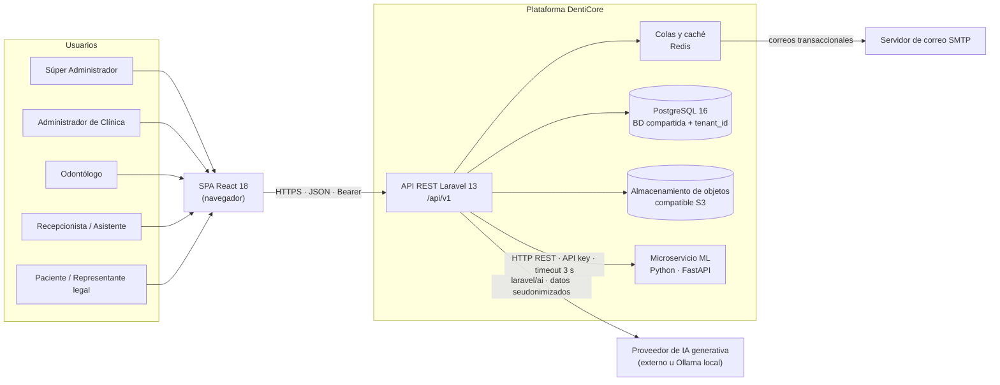
```mermaid
flowchart LR
    subgraph Usuarios
        SA[Súper Administrador]
        CA[Administrador de Clínica]
        OD[Odontólogo]
        RE[Recepcionista / Asistente]
        PA[Paciente / Representante legal]
    end

    SPA["SPA React 18<br/>(navegador)"]

    subgraph Plataforma DentiCore
        API["API REST Laravel 13<br/>/api/v1"]
        Q["Colas y caché<br/>Redis"]
        DB[("PostgreSQL 16<br/>BD compartida + tenant_id")]
        FS[("Almacenamiento de objetos<br/>compatible S3")]
        ML["Microservicio ML<br/>Python · FastAPI"]
    end

    LLM["Proveedor de IA generativa<br/>(externo u Ollama local)"]
    MAIL["Servidor de correo SMTP"]

    SA & CA & OD & RE & PA --> SPA
    SPA -- "HTTPS · JSON · Bearer" --> API
    API --> DB
    API --> Q
    API --> FS
    API -- "HTTP REST · API key · timeout 3 s" --> ML
    API -- "laravel/ai · datos seudonimizados" --> LLM
    Q -- "correos transaccionales" --> MAIL
```

**Interfaces externas.**

| Interfaz | Sistema | Protocolo | Dirección | Criticidad |
| :-- | :-- | :-- | :-- | :-- |
| IE-01 | Navegador del usuario (SPA) | HTTPS, JSON, token Bearer | Bidireccional | Crítica |
| IE-02 | Microservicio ML | HTTP REST, header `X-ML-Service-Key` | API → ML | No bloqueante (fallback) |
| IE-03 | Proveedor de IA generativa | API del proveedor vía `laravel/ai` | API → LLM | No bloqueante (fallback) |
| IE-04 | Servidor SMTP | SMTP con TLS | API → correo | No bloqueante (reintentos en cola) |
| IE-05 | Almacenamiento de objetos | API S3 | Bidireccional | Crítica para PDF y adjuntos |

### 2.2 Stack tecnológico

**Stack mandatorio (restricción no negociable).**

| Capa | Tecnología | Versión |
| :-- | :-- | :-- |
| Frontend | React (SPA) con React Router, Axios y TanStack Query | React 18.x · React Router 7.x |
| Backend | PHP + Laravel, API REST *stateless* | PHP 8.3 · **Laravel 13.x** |
| Autenticación | Laravel Sanctum, token Bearer | Versión compatible con Laravel 13 |
| Base de datos | PostgreSQL (`jsonb`, `uuid`, `enum`, `tstzrange`, extensión `btree_gist`) | 16.x |
| Microservicio ML | Python + FastAPI, desacoplado, consumido vía HTTP/REST | Python 3.12 |
| Multi-tenancy | BD compartida + columna `tenant_id` + Global Scopes de Eloquent | — |

**Componentes complementarios** (decididos en §4; no alteran el stack mandatorio).

| Componente | Tecnología | Decisión |
| :-- | :-- | :-- |
| Colas y caché | Redis 7 | DD-10 |
| IA generativa | Paquete oficial `laravel/ai` | DD-11 |
| Modelo de riesgo | scikit-learn + XGBoost + SHAP | DD-12 |
| Generación de PDF | `barryvdh/laravel-dompdf`, ejecutado en cola | DD-18 |
| Almacenamiento de archivos | Disco `s3` de Laravel (MinIO en desarrollo) | DD-18 |
| 2FA | TOTP (RFC 6238) | DD-15 |
| Pruebas backend | Pest / PHPUnit contra PostgreSQL de pruebas | — |
| Pruebas frontend | Vitest + React Testing Library; Playwright para flujos E2E | — |
| Pruebas de carga | k6 | — |

### 2.3 Actores

| ID | Actor | Tipo | Ámbito | Rol técnico | Descripción |
| :-- | :-- | :-- | :-- | :-- | :-- |
| ACT-01 | Súper Administrador | Humano | Plataforma (sin tenant) | `super_admin` | Da de alta y suspende clínicas, asigna planes, gestiona claves de cifrado, consulta auditoría y monitoreo de plataforma, registra incidentes de seguridad. No accede a datos clínicos. |
| ACT-02 | Administrador de Clínica | Humano | Un tenant | `clinic_admin` | Gestiona personal, horarios, catálogo de procedimientos, configuración de la clínica, reportes e indicadores. Puede ser designado Oficial de Datos Personales y atender solicitudes ARCO. |
| ACT-03 | Odontólogo | Humano | Un tenant | `dentist` | Registra hallazgos y odontogramas, elabora planes de tratamiento, valida sugerencias de IA, registra variables clínicas, solicita y consulta predicciones, atiende alertas y registra seguimiento. |
| ACT-04 | Recepcionista / Asistente Dental | Humano | Un tenant | `receptionist` | Registra pacientes y consentimientos, agenda citas, hace check-in, emite presupuestos desde planes, registra abonos y variables sociodemográficas. |
| ACT-05 | Paciente | Humano | Un tenant (registros propios) | `patient` | En el portal consulta su historia, presupuestos y saldo; acepta o rechaza presupuestos; agenda, confirma o cancela citas; responde encuestas; presenta solicitudes ARCO. |
| ACT-06 | Representante legal | Humano | Un tenant (registros de sus representados) | `patient` con vínculo de representación | Actúa en nombre de un paciente menor de 18 años o sin capacidad de ejercicio: firma consentimientos y usa el portal por él. |
| ACT-07 | Motor de Predicción de Riesgo (ML) | Sistema externo | Plataforma | Credencial de servicio | Recibe variables y devuelve probabilidad, nivel, confianza y explicación. No accede a la base de datos. |
| ACT-08 | Servicio de IA Generativa | Sistema externo | Plataforma | Credencial de proveedor | Recibe notas clínicas seudonimizadas y devuelve hallazgos o planes estructurados. |
| ACT-09 | Sistema DentiCore (procesos automáticos) | Sistema interno | Plataforma y tenants | Jobs y tareas programadas | Envía notificaciones, genera PDF, vence presupuestos, marca inasistencias, calcula indicadores, evalúa degradación, aplica bloqueos por retención. |
| ACT-10 | Servidor de correo | Sistema externo | Plataforma | — | Entrega correos transaccionales. |

> ACT-06 amplía el borrador: los modelos de riesgo de la base de conocimiento son pediátricos y la población de DentiCore incluye menores (DD-13).

### 2.4 Entorno operativo

| Aspecto | Valor |
| :-- | :-- |
| Navegadores soportados | Chrome, Edge y Firefox (2 últimas versiones estables); Safari (2 últimas versiones) solo para el portal del paciente. |
| Resolución mínima | Personal de clínica: 768 px de ancho (tablet vertical). Portal del paciente: 360 px de ancho (teléfono). |
| Idioma | Español (Perú), `es-PE`. |
| Zona horaria | `America/Lima` (UTC−05:00, sin horario de verano). Se almacena en UTC (`timestamptz`) y se presenta en la zona de la clínica. |
| Moneda | Sol peruano (PEN), 2 decimales. |
| Horario de uso principal | Lunes a sábado, 07:00–21:00 hora de Lima. |
| Conectividad | Conexión a internet de la clínica ≥ 5 Mbps de bajada. |

### 2.5 Restricciones

| ID | Restricción | Tipo |
| :-- | :-- | :-- |
| RES-01 | El stack de §2.2 (mandatorio) no puede sustituirse. | Tecnológica |
| RES-02 | La multi-tenancy es de base de datos compartida con columna `tenant_id`. No se usa una base de datos ni un esquema por clínica. | Tecnológica |
| RES-03 | El producto es exclusivamente web. No hay aplicación móvil nativa. | Tecnológica |
| RES-04 | El microservicio ML no accede a la base de datos de la plataforma; recibe las variables en cada solicitud. | Arquitectónica |
| RES-05 | El tratamiento de datos cumple REF-01, REF-02 y REF-03. | Legal |
| RES-06 | El odontograma cumple REF-04. | Legal |
| RES-07 | Desarrollo por 3 personas en un ciclo académico de 12 semanas. El alcance *Must* debe caber en ese plazo. | Operativa |
| RES-08 | No se usan datos reales de pacientes en desarrollo ni en pruebas. Se usan datos sintéticos o públicos anonimizados. | Operativa / Legal |
| RES-09 | No se emiten comprobantes de pago electrónicos SUNAT. | Legal / Alcance |

### 2.6 Supuestos y dependencias

| ID | Supuesto o dependencia | Impacto si no se cumple |
| :-- | :-- | :-- |
| SUP-01 | Cada clínica designa al menos un Administrador de Clínica al darse de alta. | No hay quien gestione personal ni atienda solicitudes ARCO. |
| SUP-02 | El personal recibe una inducción de 30 minutos como máximo antes de usar el sistema. | Aumenta el tiempo de registro del odontograma por encima de la meta de RNF. |
| SUP-03 | Existe un conjunto de datos sintético o público con las variables de §4 (DD-12) para entrenar y validar el modelo de riesgo. | El módulo M09 no puede entregarse; el resto del sistema no se ve afectado. |
| SUP-04 | La clínica que activa la IA generativa acepta el tratamiento de notas seudonimizadas por el proveedor configurado y lo informa en su consentimiento de datos. | La IA queda desactivada para esa clínica. |
| SUP-05 | Hay un servidor SMTP disponible con reputación de envío válida (SPF/DKIM configurados). | Las notificaciones por correo no llegan; las in-app siguen funcionando. |
| SUP-06 | El hosting de producción ofrece respaldos automáticos de PostgreSQL con recuperación a un punto en el tiempo (PITR) y retención ≥ 35 días. | No se cumple el RPO (DD-39). |
| SUP-07 | El cobro de la suscripción a las clínicas se gestiona fuera de DentiCore. | — |

---

## 3. Contexto de negocio y alcance

### 3.1 Problema

Las clínicas odontológicas pequeñas y medianas registran el odontograma en papel u hojas de cálculo. La información de una pieza dentaria se sobrescribe en cada visita, por lo que se pierde su historia. Los presupuestos se calculan de memoria o con listas de precios físicas, y distintos odontólogos cotizan montos distintos por el mismo procedimiento. El presupuesto se comunica de forma verbal y los pagos se anotan sin comprobante. Las citas se registran en una agenda física sin validar cruces. Las fichas en papel se pierden, se deterioran o son accesibles sin control. No existe un mecanismo para anticipar qué pacientes desarrollarán caries, lo que impide la atención preventiva. Además, estas prácticas no permiten demostrar el cumplimiento de la NTS N° 139, la NTS N° 188 ni la Ley N° 29733.

### 3.2 Necesidades del negocio

| ID | Necesidad | Origen / evidencia | Prioridad |
| :-- | :-- | :-- | :-- |
| NN-01 | Agendar citas sin cruces de horario para un mismo odontólogo. | F04 problema 1 (agenda física sin validación). | Alta |
| NN-02 | Disponer de la historia clínica completa del paciente al momento de atenderlo, sin búsqueda manual. | F04 problema 2 (demora en ubicar la ficha). | Alta |
| NN-03 | Conservar la evolución de cada pieza dentaria sin pérdida ni alteración de registros previos, con la nomenclatura oficial. | F04 problema 3; REF-04 (prohibición de enmendaduras, odontograma inicial y de evolución). | Alta |
| NN-04 | Cotizar el mismo procedimiento al mismo precio con independencia del odontólogo que atiende. | F04 problema 4 (inconsistencia entre presupuestos). | Alta |
| NN-05 | Entregar al paciente un presupuesto formal y registrar su decisión. | F04 problema 5 (presupuesto verbal). | Alta |
| NN-06 | Registrar los pagos del paciente con constancia y conocer su saldo. | F04 problema 6 (pago sin comprobante). | Media |
| NN-07 | Conservar la historia clínica durante el plazo legal con respaldo y control de acceso por rol. | F04 problema 7; REF-03 (5 + 15 años). | Alta |
| NN-08 | Mantener una sola ficha por paciente reutilizada en todo el proceso. | F04 problema 8 (duplicidad de datos). | Media |
| NN-09 | Identificar anticipadamente a los pacientes con mayor riesgo de caries para priorizar la prevención. | F01 problema; REF-15, REF-16. | Alta |
| NN-10 | Reducir el tiempo que el odontólogo dedica a transcribir notas clínicas a registros estructurados. | F06 bloque 3 (asistencia de IA). | Media |
| NN-11 | Garantizar que ninguna clínica acceda a datos de otra clínica en la plataforma compartida. | F01 observaciones; modelo SaaS. | Alta |
| NN-12 | Demostrar el cumplimiento de la protección de datos personales de salud. | REF-01, REF-02. | Alta |
| NN-13 | Reducir las inasistencias a citas. | F05 actividad 3 (confirmación de cita); práctica del mercado (recordatorios automáticos). | Media |
| NN-14 | Convertir los hallazgos en un plan de tratamiento ejecutable y conocer su avance. | Práctica del mercado (plan de tratamiento generado desde el odontograma). | Alta |
| NN-15 | Medir el desempeño operativo de la clínica y la satisfacción del paciente. | F06 RF-18, RF-19, RF-20. | Baja |
| NN-16 | Continuar la atención clínica aunque fallen los componentes de IA o ML. | F01 observación 7 (riesgo de disponibilidad del servicio ML). | Alta |
| NN-17 | Dar acceso al paciente, o a su representante, a su propia información. | F01 (portal del paciente); REF-03 (copia de la HC). | Media |
| NN-18 | Incorporar a los pacientes y la lista de precios que la clínica ya maneja sin volver a digitarlos. | Análisis de adopción (Fase 6): una clínica que migra desde papel u hojas de cálculo ya tiene pacientes y precios. | Media |

### 3.3 Objetivos del negocio

Cada objetivo es medible y se verifica en las pruebas de aceptación o en los indicadores del producto.

| ID | Objetivo | Indicador | Meta | Necesidades |
| :-- | :-- | :-- | :-- | :-- |
| OB-01 | Eliminar las citas solapadas. | Número de pares de citas activas de un mismo odontólogo con intervalos superpuestos. | 0 | NN-01 |
| OB-02 | Dar acceso inmediato a la historia clínica. | Tiempo desde el check-in hasta la visualización completa de la HC (p95). | ≤ 3 s | NN-02, NN-08 |
| OB-03 | Trazar cada pieza dentaria sin pérdida de información. | % de entradas de odontograma con pieza, superficie, código NTS 188, autor y fecha; número de entradas modificadas o eliminadas. | 100 %; 0 | NN-03 |
| OB-04 | Estandarizar los precios. | Diferencia entre el precio unitario de una línea de presupuesto y el precio del catálogo vigente al emitirlo, excluyendo descuentos registrados. | 0,00 PEN | NN-04 |
| OB-05 | Formalizar el presupuesto. | % de presupuestos emitidos con PDF disponible; % de presupuestos cerrados (aceptados, rechazados o vencidos) con decisión y fecha registradas. | 100 %; 100 % | NN-05 |
| OB-06 | Trazar los pagos. | % de abonos con recibo interno; diferencia entre el saldo calculado y la suma de abonos de un plan. | 100 %; 0,00 PEN | NN-06 |
| OB-07 | Conservar la HC durante el plazo legal. | Años de retención configurados; RPO y RTO medidos en simulacro de restauración. | ≥ 20 años; RPO ≤ 15 min; RTO ≤ 4 h | NN-07 |
| OB-08 | Anticipar el riesgo de caries. | AUC-ROC del modelo en el conjunto de validación; % de pacientes con variables completas que tienen predicción vigente (≤ 12 meses). | ≥ 0,75; ≥ 90 % | NN-09 |
| OB-09 | Reducir la carga de transcripción clínica. | Tasa de sugerencias de IA aceptadas o ajustadas sobre el total decidido; tiempo medio de registro de hallazgos con IA frente a sin IA. | Medido y reportado mensualmente; meta de referencia ≥ 50 % y reducción ≥ 30 % | NN-10 |
| OB-10 | Aislar a las clínicas. | Incidentes de acceso entre tenants detectados en pruebas automatizadas de aislamiento y en producción. | 0 | NN-11 |
| OB-11 | Cumplir la protección de datos. | % de pacientes con consentimiento de datos registrado antes de cualquier dato clínico; % de solicitudes ARCO respondidas en ≤ 10 días hábiles; % de incidentes notificados a la autoridad en ≤ 48 h. | 100 %; 100 %; 100 % | NN-12 |
| OB-12 | Reducir inasistencias. | Tasa de inasistencia mensual de la clínica frente a su línea base de los primeros 30 días de uso. | Reducción ≥ 20 % a los 3 meses | NN-13 |
| OB-13 | Dar seguimiento a los planes de tratamiento. | % de hallazgos patológicos (color rojo) vinculados a un procedimiento planificado o a una decisión de no tratar. | ≥ 95 % | NN-14 |
| OB-14 | Medir desempeño y satisfacción. | Disponibilidad del panel de indicadores; tasa de respuesta a encuestas CSAT. | Panel con datos del mes en curso; ≥ 20 % | NN-15 |
| OB-15 | Mantener la continuidad clínica. | Número de atenciones impedidas por fallos del servicio ML o de IA. | 0 | NN-16 |
| OB-16 | Dar autonomía al paciente. | Tiempo de entrega de una copia completa de la HC solicitada por el paciente. | ≤ 5 días (REF-03); meta interna: descarga inmediata desde el portal | NN-17 |

> La meta de OB-08 toma como referencia el AUC combinado de 0,79 del meta-análisis REF-15 y fija un umbral mínimo inferior, dado que el modelo se entrena con datos sintéticos o públicos (SUP-03). La meta de OB-11 para ARCO (10 días hábiles) es un plazo interno único, igual o más estricto que los plazos del Reglamento (REF-02).

### 3.4 Alcance incluido

| Módulo | Nombre | Prioridad | Funcionalidades incluidas | Necesidades |
| :-- | :-- | :-- | :-- | :-- |
| **M01** | Plataforma y clínicas | Must | Alta de clínica con su primer administrador y su clave de cifrado; plan de suscripción con límites; suspensión (solo lectura), reactivación y cancelación con ventana de exportación; configuración de la clínica (datos, IGV, vigencia de presupuestos, zona horaria). | NN-11 |
| **M02** | Identidad, acceso y seguridad | Must | Login con código de clínica, correo y contraseña; recuperación de contraseña; 2FA TOTP obligatorio para `super_admin` y `clinic_admin`; gestión de usuarios y roles de la clínica; expiración de sesión por inactividad; bloqueo por intentos fallidos; rotación de claves de cifrado. | NN-11, NN-12 |
| **M03** | Pacientes y consentimientos | Must | Ficha única del paciente (con DNI y contacto cifrados); antecedentes médicos estructurados; representante legal para menores; consentimiento de tratamiento de datos (Ley 29733) previo a cualquier dato clínico; búsqueda por nombre y DNI. *Could:* adjuntos (PDF, JPG, PNG). | NN-02, NN-07, NN-08, NN-12 |
| **M04** | Odontograma NTS 188 | Must | Odontograma inicial por paciente y clínica, cerrado e inmutable al finalizar la primera atención; odontograma de evolución *append-only*; catálogo cerrado de hallazgos NTS 188 con color; registro por pieza y superficie; dentición permanente, temporal y mixta; entradas de corrección; consulta del historial por pieza. | NN-03, NN-02 |
| **M05** | Plan de tratamiento y presupuestos | Must | Catálogo de procedimientos de la clínica; plan de tratamiento desde hallazgos; presupuesto derivado del plan con snapshot de precio, descuento por línea con tope por rol, indicador IGV y vigencia; estados borrador → emitido → aceptado / rechazado / vencido; PDF; registro de procedimientos realizados y avance del plan. | NN-04, NN-05, NN-14 |
| **M06** | Agenda y notificaciones | Must | Horario laboral y bloqueos por odontólogo; tipos de cita con duración; reserva sin solapamiento; confirmación, reprogramación y cancelación; check-in; marcado de inasistencia; notificaciones por correo e in-app (confirmación, recordatorio 24 h antes, presupuesto emitido, alertas). *Should:* autoagendamiento del paciente en el portal. | NN-01, NN-13 |
| **M07** | Pagos internos | Should | Registro de abonos (efectivo, tarjeta en POS, Yape/Plin, transferencia) contra un plan aceptado; recibo interno PDF no tributario; saldo por plan; anulación de abono con motivo (sin borrado). | NN-06 |
| **M08** | Asistencia de IA generativa | Should | Activación por clínica según plan; sugerencia de hallazgos estructurados desde una nota clínica; sugerencia de plan de tratamiento; seudonimización previa; decisión obligatoria del odontólogo (aceptar, ajustar, rechazar); registro de la decisión; fallback no bloqueante. | NN-10, NN-16 |
| **M09** | Predicción de riesgo de caries | Must | Registro de variables sociodemográficas, clínicas y conductuales (conjunto por grupo etario); predicción a 12 meses con probabilidad, nivel, confianza y explicación SHAP; alerta solo para riesgo alto; reconocimiento de la alerta; seguimiento clínico; Circuit Breaker y fallback. *Could:* reporte de distribución del riesgo por grupo socioeconómico (monitoreo de sesgo). | NN-09, NN-16 |
| **M10** | Portal del paciente | Should | Acceso del paciente o su representante a: odontograma (solo lectura), planes, presupuestos (aceptar o rechazar), saldo, citas, encuestas, descarga de la copia de la HC y presentación de solicitudes ARCO. | NN-17, NN-05 |
| **M11** | Cumplimiento y auditoría | Must | Bitácora de auditoría de accesos y acciones sobre datos personales; gestión de solicitudes ARCO con plazo; exportación de la HC en PDF; bloqueo por retención (sin borrado antes de 20 años); registro de incidentes de seguridad con control del plazo de 48 h. *Should:* reporte de cumplimiento de la plataforma. | NN-07, NN-12 |
| **M12** | Indicadores y encuestas | Could | Panel de la clínica (citas, inasistencias, aceptación de presupuestos, tiempo de ciclo, recaudación); encuesta CSAT/NPS enviada por enlace tras la cita. | NN-15 |
| **M13** | Observabilidad de la plataforma | Should | Métricas de latencia y errores por clínica; alertas de degradación cuando se superan umbrales; estado del microservicio ML y del proveedor de IA. | NN-11, NN-16 |

### 3.5 Alcance excluido

| ID | Exclusión | Justificación |
| :-- | :-- | :-- |
| OUT-01 | Facturación electrónica y contabilidad (SUNAT). | Sistema tributario especializado (RES-09). DentiCore solo emite recibos internos no tributarios. |
| OUT-02 | Pasarela de pago en línea y cobro automático de suscripciones. | Requiere contrato con adquirente y certificación PCI DSS. Los abonos se registran manualmente (M07) y la suscripción se cobra fuera del sistema (SUP-07). |
| OUT-03 | Gestión de inventario de insumos. | No forma parte del proceso de diagnóstico y presupuesto. |
| OUT-04 | Telemedicina y videoconsulta. | El proceso modelado es presencial. |
| OUT-05 | Aplicación móvil nativa (iOS/Android). | RES-03. El portal del paciente es responsivo desde 360 px. |
| OUT-06 | Validación clínica prospectiva de la exactitud del modelo de riesgo. | Requiere estudio clínico y comité de ética. Se valida integración, calibración y manejo de errores. |
| OUT-07 | Integración con aseguradoras, EPS y convenios. | Integraciones externas fuera del alcance académico. |
| OUT-08 | Marketing, CRM y campañas masivas. | Solo se envían mensajes transaccionales (confirmaciones, recordatorios). |
| OUT-09 | Notificaciones por WhatsApp y SMS. | Costo por mensaje y proceso de aprobación de plantillas. Se consideran para una versión posterior; el diseño de notificaciones admite nuevos canales. |
| OUT-10 | Periodontograma, ortodoncia y estética facial. | Módulos de especialidad; el núcleo es el odontograma general. |
| OUT-11 | Visor de imágenes radiográficas (DICOM). | Se limita a adjuntos simples (M03, *Could*). |
| OUT-12 | Firma digital con certificado (Ley N° 27269). | Se usa firma electrónica simple: aceptación con usuario autenticado, fecha, hora e IP registradas. |
| OUT-13 | Interoperabilidad con RENHICE u otros sistemas (HL7 FHIR). | Integración con el Estado fuera del alcance académico. |
| OUT-14 | Varias sedes dentro de una misma clínica. | Cada sede se registra como clínica independiente. |
| OUT-15 | Multimoneda. | Solo PEN. |
| OUT-16 | Recetas médicas. | No forma parte del proceso de diagnóstico y presupuesto. |

---

## 4. Registro de decisiones de diseño

Las decisiones resuelven vacíos o contradicciones de los borradores. Cada una indica la alternativa descartada y su fundamento. Se tratan como restricciones de diseño para las fases siguientes.

| ID | Tema | Decisión | Alternativa descartada | Fundamento |
| :-- | :-- | :-- | :-- | :-- |
| DD-01 | Versión del framework | Laravel 13.x (rama con soporte activo). | Laravel 11 (borrador). | Laravel 11 terminó su soporte de seguridad el 12-03-2026 y Composer bloquea su instalación por advisories sin parche (documentado en `technical_specs.md`). |
| DD-02 | Frontend | React 18 con React Router 7, Axios y TanStack Query. Los guardias de ruta por rol son solo de interfaz; la autorización real está en el backend. | React Router 6. | React Router 6 tiene CVEs sin parche en su rama (documentado en `technical_specs.md`). |
| DD-03 | Multi-tenancy | BD compartida con `tenant_id` en toda tabla de clínica. Global Scope que devuelve cero filas si no hay tenant resuelto (*deny-by-default*). `tenant_id` siempre se asigna en el servidor. La tabla `users` no usa Global Scope porque la autenticación ocurre antes de resolver el tenant; su aislamiento es explícito en los servicios. El login identifica la clínica por un código (`slug`) porque el correo es único por clínica, no global. | Base de datos por clínica; Global Scope que no filtra cuando falta el tenant. | Restricción del stack (RES-02). El comportamiento *deny-by-default* evita que un fallo de middleware exponga datos de todas las clínicas. |
| DD-04 | Cifrado | Clave AES-256 propia por clínica, cifrada con la clave maestra de la plataforma. Se cifran DNI, teléfono y dirección del paciente. La unicidad del DNI se controla con un índice ciego HMAC-SHA256 derivado de la clave de la clínica. La rotación recifra los datos afectados. | `UNIQUE` sobre la columna cifrada (borrador). | El cifrado con IV aleatorio produce un texto distinto para el mismo valor, por lo que un `UNIQUE` sobre el valor cifrado no detecta duplicados. |
| DD-05 | Odontograma | Conforme a REF-04: numeración FDI Dígito Dos (permanentes 11–48, temporales 51–85); catálogo cerrado de hallazgos con código, sigla y color (azul o rojo); registro por pieza y superficie. **Odontograma inicial**: se construye en la primera atención y se cierra al finalizarla; después es inmutable. **Odontograma de evolución**: *append-only*. Las correcciones son entradas nuevas que referencian la entrada corregida. El odontograma solo registra hallazgos observados; los procedimientos planificados viven en el plan de tratamiento. | Un único historial JSON por pieza que mezcla hallazgos y tratamientos, solo dentición permanente (borrador). | REF-04 exige odontograma inicial y de evolución, hallazgos observados (no el plan) y prohíbe enmendaduras. La población incluye niños (DD-13). |
| DD-06 | Flujo clínico–comercial | Cadena explícita: **hallazgo → plan de tratamiento → presupuesto → aceptación → procedimiento realizado**. Un procedimiento realizado genera una entrada en el odontograma de evolución y actualiza el avance del plan. | Presupuesto calculado directamente desde el odontograma (borrador). | Separa la responsabilidad clínica (hallazgo, REF-05) de la comercial (presupuesto). Es el flujo que ofrecen los productos de referencia del mercado. |
| DD-07 | Presupuesto | Moneda PEN con 2 decimales. Precio de catálogo con indicador por clínica "precio incluye IGV" (por defecto: sí, 18 %). Descuento por línea: el odontólogo y la recepción hasta el tope configurado por la clínica (por defecto 10 %); por encima, solo `clinic_admin`. Vigencia configurable (por defecto 30 días naturales). Estados: `borrador` (editable) → `emitido` (inmutable, con snapshot de precios) → `aceptado` / `rechazado` / `vencido`. Una corrección genera un presupuesto nuevo que referencia al anterior. | Presupuesto sin vigencia, sin descuentos ni impuestos (borrador). | Práctica común del mercado. Mantiene la regla de inmutabilidad del borrador y añade las variables comerciales que faltaban. |
| DD-08 | Pagos | Registro interno de abonos sin pasarela: medio de pago (efectivo, tarjeta en POS, Yape/Plin, transferencia), monto, fecha y referencia. Recibo interno PDF con la leyenda "Documento no válido para fines tributarios". Saldo = total del presupuesto aceptado − abonos vigentes. Un abono no se borra; se anula con motivo. | Solo un indicador `payment_confirmed` en la cita (borrador); pasarela en línea. | Resuelve la contradicción entre F05 (comprobante digital) y F09 (sin SUNAT). Una pasarela exige PCI DSS y contrato (OUT-02). |
| DD-09 | Agenda | Horario laboral semanal y bloqueos por odontólogo; tipos de cita con duración por defecto. La no superposición se garantiza en la base de datos con una restricción `EXCLUDE USING gist (tenant_id WITH =, dentist_id WITH =, tstzrange(inicio, fin) WITH &&)` sobre citas activas (extensión `btree_gist`), y en la aplicación con respuesta HTTP 409. Una cita se marca como inasistencia automáticamente 30 minutos después de su fin si no tiene check-in. | `UNIQUE(tenant_id, dentist_id, scheduled_at)` (borrador). | Un `UNIQUE` sobre la hora exacta no impide solapamientos parciales (09:00–09:30 frente a 09:15–09:45). |
| DD-10 | Notificaciones | Canales: correo (SMTP) e in-app. Envío asíncrono por colas Redis con 3 reintentos y espera exponencial. Eventos: cita creada o modificada, recordatorio 24 h antes, presupuesto emitido, alerta de riesgo alto, respuesta ARCO, recuperación de contraseña. El diseño admite canales adicionales sin cambiar los eventos. | WhatsApp y SMS en el MVP. | Costo por mensaje y aprobación de plantillas (OUT-09). |
| DD-11 | IA generativa | Paquete oficial `laravel/ai` con salida estructurada validada contra un esquema JSON que usa los códigos del catálogo NTS 188 y los procedimientos del catálogo de la clínica. Proveedor configurable a nivel de plataforma (proveedor externo u Ollama local). Antes de enviar, se eliminan o reemplazan nombre, DNI, teléfono, correo y dirección. La clínica activa la IA explícitamente, según su plan. Timeout de 15 s; ante error o timeout, el odontólogo sigue registrando de forma manual. Toda sugerencia nace en estado `pendiente` y solo tiene efecto al ser aceptada o ajustada. | Motor de IA no especificado (borrador); reutilizar el microservicio de riesgo. | El SDK oficial es compatible con Laravel 13, ofrece salida estructurada y varios proveedores. Separa la IA generativa (texto) del modelo predictivo (tabular), que tienen ciclos de vida distintos. |
| DD-12 | Modelo de riesgo | Microservicio FastAPI con clasificador XGBoost, calibración isotónica y explicación SHAP (global e individual). **Variable objetivo:** al menos una lesión de caries nueva en 12 meses (horizonte fijo). **Niveles:** bajo si p < 0,30; medio si 0,30 ≤ p < 0,60; alto si p ≥ 0,60. Los umbrales son parámetros de plataforma, versionados junto con el modelo, y no configurables por clínica. **Confianza:** probabilidad calibrada de la clase predicha; si es menor que 0,60 la interfaz muestra la leyenda "baja confianza". **Variables:** comunes (edad, experiencia de caries CPOD/ceod, índice de placa, consumo de azúcar entre comidas, uso de pasta fluorada, frecuencia de cepillado, frecuencia de visitas, lesiones activas); para menores de 18 años, además, nivel educativo y situación laboral del representante y estructura familiar; para adultos, nivel educativo y situación laboral propios. **Contrato:** síncrono, timeout 3 s, Circuit Breaker (se abre tras 5 fallos consecutivos y se reintenta a los 60 s). Cada predicción guarda la versión del modelo. El seguimiento clínico alimenta la recalibración. | Horizonte "definido por la clínica" (F06) y umbrales no definidos (borrador). | Las categorías siguen CAMBRA y la herramienta de la AAPD (REF-16). Las variables provienen de los modelos de la base de conocimiento (REF-15). Un horizonte y unos umbrales fijos hacen las predicciones comparables entre clínicas. |
| DD-13 | Población | Pacientes de todas las edades. Para menores de 18 años es obligatorio un representante legal, que firma el consentimiento y puede usar el portal. | Solo adultos (implícito en el SDD); solo niños (implícito en las variables). | Resuelve la contradicción entre las variables pediátricas del modelo y el ejemplo adulto del SDD. |
| DD-14 | Rol legal y retención | La clínica es la titular del banco de datos; DentiCore es el encargado del tratamiento. El consentimiento de datos se registra antes de cualquier dato clínico. Solicitudes ARCO con plazo interno de 10 días hábiles. La cancelación de datos clínicos se atiende con **bloqueo**, no con borrado, mientras dure la retención legal: 5 años desde la última atención más 15 años (REF-03). Copia de la HC en PDF descargable. Incidentes de seguridad registrados con control del plazo de notificación de 48 h (REF-02). | Sin gestión de consentimientos, ARCO ni incidentes (borrador). | Obligaciones de REF-01, REF-02 y REF-03. El bloqueo resuelve el conflicto entre el derecho de cancelación y el registro *append-only*. |
| DD-15 | Seguridad de acceso | Contraseñas con bcrypt (cost ≥ 12) y longitud mínima de 10 caracteres. 2FA TOTP obligatorio para `super_admin` y `clinic_admin`, opcional para el resto. Bloqueo temporal de 15 minutos tras 5 intentos fallidos. Expiración del token por inactividad a los 30 minutos (personal) y 15 minutos (portal). Recuperación de contraseña por enlace de un solo uso válido 60 minutos. Desactivar un usuario revoca sus tokens. | Solo login y logout (borrador). | Controles de OWASP ASVS nivel 2 (REF-13). |
| DD-16 | Planes de suscripción | Los planes son conjuntos de funciones y límites. `basic`: hasta 2 odontólogos, sin IA generativa ni predicción de riesgo. `pro`: hasta 10 odontólogos, con IA y predicción. `enterprise`: odontólogos ilimitados, con IA, predicción e indicadores avanzados (M12). Los precios son `[REQUIERE DEFINICIÓN]` (decisión comercial). Clínica `suspendida`: solo lectura. Clínica `cancelada`: 90 días para exportar sus datos; después, eliminación de la plataforma y entrega de la exportación a la clínica, que conserva la obligación de retención como titular. | Planes sin contenido definido (borrador). | Modelo de planes escalonados habitual en los productos del mercado. |
| DD-17 | Alta de clínicas | Alta por el Súper Administrador, que registra la clínica y su primer Administrador de Clínica en una sola transacción. No hay autoregistro. | Autoregistro con prueba gratuita. | No existe pasarela para cobrar la suscripción (OUT-02); el alta controlada permite verificar a la clínica antes de habilitarla. Ya implementado. |
| DD-18 | Documentos | PDF (presupuesto, recibo interno, copia de HC) generados en el servidor con `barryvdh/laravel-dompdf` mediante *jobs* en cola, almacenados en el disco `s3` con acceso por URL firmada de 10 minutos de validez. | Librería no definida (borrador). | Evita bloquear las solicitudes HTTP y evita exponer archivos con URLs públicas. |
| DD-19 | API | API REST versionada bajo `/api/v1`. Identificadores públicos UUID; los identificadores numéricos internos no se exponen. Errores en formato `application/problem+json` (RFC 9457). Límite de solicitudes: 60 por minuto por usuario y 5 intentos de login por minuto por IP. | Identificadores y formato de error no definidos. | Prácticas estándar de APIs REST. |
| DD-20 | Numeración de requisitos | IDs nuevos y consecutivos en este SRS. Tabla de correspondencia con F06, F07 y F08 en §15. | Mantener RF-01..29 del borrador. | El borrador asigna identificadores a funcionalidades mal delimitadas (por ejemplo, la agenda vinculada a RF-04 y RF-17). |
| DD-21 | Priorización | MoSCoW por módulo y por requisito. | Sin priorización. | RES-07: el alcance *Must* debe caber en 12 semanas. |
| DD-22 | Activación del primer administrador | Al registrar una clínica, su primer Administrador de Clínica recibe un correo de invitación con un enlace de un solo uso válido 72 horas, en el que define su contraseña y configura el segundo factor. El Súper Administrador nunca conoce ni define contraseñas de terceros. La clínica registra además razón social, RUC y dirección. | El Súper Administrador define la contraseña inicial (implementación actual). | Evita que un tercero conozca la contraseña (OWASP ASVS V2). Razón social, RUC y dirección son necesarios en el consentimiento (la clínica es titular del banco de datos) y en los documentos PDF. |
| DD-23 | Numeración de documentos | Presupuestos `P-000001` y recibos `R-000001`: correlativos por clínica, de 6 dígitos como mínimo, sin reinicio anual y sin reutilización. Se generan con una secuencia por clínica y tipo de documento bajo bloqueo de fila. | Numeración global o reinicio anual. | Un número por clínica es legible para el paciente y no revela el volumen de otras clínicas (RN-01). |
| DD-24 | Granularidad de la agenda | La disponibilidad ofrece inicios cada 15 minutos desde el inicio de cada franja del horario laboral. | Inicios libres al minuto. | Práctica habitual de las agendas clínicas; mantiene la agenda legible sin impedir duraciones en múltiplos de 5 (RN-47). |
| DD-25 | Dentición por defecto | Al abrir el odontograma, la vista inicial depende de la edad: menor de 6 años, temporal; de 6 a 12 años, mixta; 13 años o más, permanente. El odontólogo puede cambiarla siempre. | Vista única permanente. | Reduce la selección manual sin restringir el registro; la dentición real la determinan los hallazgos (por ejemplo, pieza ausente o pieza temporal retenida). |
| DD-26 | Días hábiles | Para los plazos ARCO, un día hábil es de lunes a viernes. El plazo se cuenta desde el día hábil siguiente a la recepción. No se descuentan feriados. | Calendario de feriados mantenido en la plataforma. | Ignorar feriados produce una fecha límite igual o anterior a la legal, por lo que el plazo interno sigue siendo conservador sin mantener un calendario. |
| DD-27 | Idempotencia de la predicción | Si se solicita una predicción con el mismo registro de variables y la misma versión de modelo dentro de los 60 segundos siguientes a una predicción exitosa, se devuelve la existente sin llamar al motor. | Llamar al motor en cada solicitud. | Evita predicciones duplicadas por doble clic o reintentos del cliente. |
| DD-28 | Plantilla de consentimiento | El texto del consentimiento es una plantilla de plataforma versionada, que se publica con el software y se completa automáticamente con los datos de la clínica y del titular. Cualquier cambio del texto incrementa la versión (RN-15). | Texto libre por clínica. | Garantiza que todas las clínicas informen las mismas finalidades con el contenido que exige la Ley N° 29733, y permite verificar con la huella SHA-256 qué texto aceptó el titular. |
| DD-29 | Dirección por clínica | Cada clínica tiene una dirección propia de la aplicación que incluye su código de acceso (por ejemplo, `/c/<codigo>`); el personal y los pacientes inician sesión en ella. El Súper Administrador usa una dirección de plataforma sin código. La API sigue recibiendo el código en la solicitud de inicio de sesión. | Pedir el código de clínica en el formulario. | El usuario no necesita recordar el código; es compatible con el contrato de API ya implementado. |
| DD-30 | Nota de atención y CIE-10 | Cada atención tiene una nota estructurada (motivo de consulta, enfermedad actual, examen extraoral, examen intraoral, indicaciones) y diagnósticos CIE-10 presuntivos o definitivos. El catálogo CIE-10 (OMS, versión en español) se publica con el software y la búsqueda prioriza el capítulo odontológico K00–K14. La nota se firma al cerrar la atención (usuario + número COP) y después solo admite adendas. | Una nota libre única, usada solo como entrada de la IA (borrador). | La NTS N° 139 exige diagnósticos codificados y contenido mínimo de la historia clínica (REF-03, REF-07). |
| DD-31 | Consentimiento informado de procedimientos | Plantillas por clínica, versionadas, asociadas a procedimientos del catálogo. El consentimiento se vincula al ítem del plan, se firma de forma presencial (confirmación con el documento del firmante en el dispositivo de la clínica o PDF firmado escaneado), guarda la huella SHA-256 del texto y puede revocarse antes del procedimiento. | Adjuntar un papel firmado sin estructura. | Ley General de Salud (REF-06). Un registro estructurado permite verificar RN-76 automáticamente. |
| DD-32 | Importación inicial | Archivos CSV o XLSX con plantilla descargable, máximo 5000 filas por archivo. Primero se ejecuta una validación sin escribir datos y se muestra el resultado por fila; la importación requiere confirmación explícita. Las filas rechazadas se descargan con su motivo. | Digitación manual o carga por el equipo de soporte. | Reduce la barrera de adopción (NN-18) sin saltarse las reglas de registro (RN-85). |
| DD-33 | Controles periódicos | Al cerrar la atención se define la fecha del próximo control. Valor propuesto: 3 meses si el riesgo vigente es alto, 6 si es medio, 12 si es bajo y 6 si no hay predicción. Recordatorio por correo 7 días antes. | Controles sin fecha. | Intervalos de control por nivel de riesgo de CAMBRA (REF-16); convierte la predicción en una acción preventiva (NN-09). |
| DD-34 | Lista de espera | Registra el interés del paciente y avisa a la recepción cuando se libera un horario compatible. No reserva automáticamente. | Reserva automática del primer horario libre. | Evita citas que el paciente no confirmó. |
| DD-35 | Presupuesto compartido | Enlace con token aleatorio de 256 bits (se guarda solo su hash), de solo lectura, revocable y válido hasta el vencimiento del presupuesto. La aceptación desde el enlace exige un código de 6 dígitos enviado al correo registrado del paciente. | Exigir cuenta de portal para ver o aceptar. | La mayoría de pacientes no crea una cuenta; el código mantiene la evidencia de la decisión (RN-36). |
| DD-36 | Recuperación del segundo factor | 10 códigos de recuperación de un solo uso al configurar el 2FA. El Administrador de Clínica restablece el 2FA de su personal y el Súper Administrador el de los Administradores de Clínica. | Sin recuperación. | Sin este mecanismo, un administrador que pierde su teléfono deja a la clínica sin administración. |
| DD-37 | Fusión de fichas | Solo el Administrador de Clínica. Irreversible. Reasigna todas las referencias a la ficha principal y deja la secundaria en solo lectura con un enlace a la principal. Las entradas de odontograma no cambian de contenido, solo de paciente, y la auditoría conserva el paciente original. | No fusionar. | Resuelve duplicados que RN-09 no detecta (misma persona con DNI y carné). |
| DD-38 | Catálogo base | Una clínica nueva recibe una plantilla de procedimientos frecuentes, inactivos y con precio S/ 0,00. | Catálogo vacío. | Acelera la configuración inicial sin imponer precios. |
| DD-39 | Recuperación ante desastres | PostgreSQL con respaldo continuo del registro de transacciones y recuperación a un punto en el tiempo (PITR): RPO ≤ 15 min. Respaldos completos diarios (35 días) y mensuales (12 meses), cifrados y en otra región. Simulacro trimestral. | Respaldo diario con RPO de 24 h (F07). | Perder un día borraría atenciones, presupuestos aceptados y pagos ya cobrados; PITR es una función estándar de PostgreSQL y de los servicios gestionados. |
| DD-40 | Aislamiento en la base de datos | Además del Global Scope (DD-03), políticas de seguridad por fila (RLS) de PostgreSQL por `tenant_id`, activadas con una variable de sesión que el middleware fija en cada transacción. El Súper Administrador usa un rol de base de datos distinto. | Solo el Global Scope. | Defensa en profundidad: un error en una consulta directa o en un trabajo en cola no expone datos de otra clínica (OB-10). |
| DD-41 | Efectos asíncronos | Patrón *transactional outbox*: notificaciones, PDF y eventos se registran en una tabla dentro de la misma transacción de negocio, y un despachador los envía a la cola Redis. | Encolar directamente en Redis durante la solicitud. | Sin outbox, una caída entre la confirmación y el encolado pierde notificaciones, o se notifican operaciones revertidas. |
| DD-42 | Alojamiento y transferencias | Proveedor de nube con certificación ISO/IEC 27001 (REF-21). Datos alojados en Perú si el proveedor ofrece una región allí, o en un país con protección equivalente (por ejemplo, Brasil). Contratos de encargo con los proveedores de nube, correo e IA. Registro de transferencias informado en el consentimiento y la política de privacidad. | Servidor propio o alojamiento sin certificación ni contrato. | Requisitos del DS N° 016-2024-JUS para transferencias internacionales y encargados del tratamiento (REF-02). |
| DD-43 | Medición del desempeño | Los umbrales de desempeño se verifican en el entorno de referencia, con el conjunto de datos y los perfiles de carga de §13.2, usando k6 y Lighthouse. Producción no puede tener menos capacidad que el entorno de referencia. | "Carga normal" sin definir (F07). | Un umbral sin condiciones de medición no es verificable. |
| DD-44 | Token en el navegador | Por la restricción de usar tokens Bearer (RES-01), la SPA guarda el token en `sessionStorage` (se borra al cerrar la pestaña), nunca en `localStorage`, y aplica una CSP estricta sin scripts de terceros. | `localStorage` sin CSP; cookies de sesión (contradice el stack). | Reduce la exposición ante XSS sin salir del stack mandatorio. |
| DD-45 | Idempotencia | Las operaciones de creación críticas aceptan la cabecera `Idempotency-Key` (UUID); la respuesta se conserva 24 h por usuario y clave. | Confiar en que el cliente no reintente. | Evita abonos, citas o presupuestos duplicados por reintentos de red o doble clic. |
| DD-46 | Evidencia inalterable | Cadena de hashes (SHA-256 de la entrada anterior + la actual) por paciente en el odontograma y por clínica en la bitácora, verificada a diario. Las evidencias de consentimientos, decisiones y cierres se sellan con HMAC de servidor. | Solo restricciones de base de datos. | Un administrador de base de datos puede deshabilitar una restricción; la cadena de hashes detecta cualquier alteración posterior (REF-03, REF-04). |

### 4.1 Impacto sobre lo ya implementado

El borrador `implementation_plan.md` registra las fases 0 a 3 completadas. Su compatibilidad con este SRS es:

| Elemento implementado | Estado frente al SRS |
| :-- | :-- |
| Laravel 13, React Router 7, Sanctum, prefijo `/api/v1` | Compatible (DD-01, DD-02, DD-19). |
| Tenants, `slug`, alta con primer administrador, Global Scope *deny-by-default* | Compatible (DD-03, DD-17). |
| Gestión de usuarios por clínica | Compatible. Falta 2FA, recuperación de contraseña y expiración por inactividad (DD-15). |
| Pacientes con DNI y teléfono cifrados, índice ciego, `medical_history` estructurado | Compatible (DD-04). Faltan representante legal (DD-13), consentimiento de datos (DD-14) y búsqueda. |
| Alta de clínica con contraseña del administrador definida por el Súper Administrador | Cambia: invitación por correo (DD-22) y nuevos datos obligatorios de la clínica (razón social, RUC, dirección). |
| Login con `tenant_slug` en el cuerpo de la solicitud | Compatible: el frontend lo toma de la dirección de la clínica (DD-29). |
| Cliente Axios con token Bearer (`src/api/client.js`) | Verificar: el token debe guardarse en `sessionStorage` (DD-44) y la SPA debe aplicar la CSP de §13. |
| Aislamiento solo con Global Scope | Compatible; se agrega RLS como segunda barrera (DD-40, *Should*). |
| Odontograma, presupuestos, citas, IA, riesgo | No implementados. Se construirán según este SRS (DD-05 a DD-12). |

---

## 5. Dominio del problema

Esta sección describe los conceptos del negocio, sus relaciones y sus ciclos de vida con independencia de la implementación. Los nombres de entidad son conceptuales; el esquema físico de base de datos se define en el documento de diseño (SDD), que debe respetar este modelo.

### 5.1 Áreas del dominio

| Área | Entidades | Módulos |
| :-- | :-- | :-- |
| Plataforma | Plan de suscripción, Clínica, Configuración de clínica, Clave de cifrado, Usuario, Incidente de seguridad, Alerta de desempeño | M01, M02, M11, M13 |
| Paciente | Paciente, Documento de identidad, Representación legal, Consentimiento, Solicitud ARCO, Adjunto | M03, M10, M11 |
| Clínico | Atención, Nota clínica, Catálogo de hallazgos NTS 188, Odontograma inicial, Entrada de odontograma, Sugerencia de IA | M04, M08 |
| Comercial | Catálogo de procedimientos, Plan de tratamiento, Ítem de plan, Presupuesto, Línea de presupuesto, Procedimiento realizado, Abono | M05, M07 |
| Agenda | Horario laboral, Bloqueo de agenda, Tipo de cita, Cita, Notificación | M06 |
| Riesgo | Registro de variables de riesgo, Versión de modelo, Predicción de riesgo, Alerta de riesgo, Seguimiento clínico | M09 |
| Transversal | Registro de auditoría, Encuesta de satisfacción | M11, M12 |

### 5.2 Modelo conceptual

#### 5.2.1 Plataforma, acceso y paciente

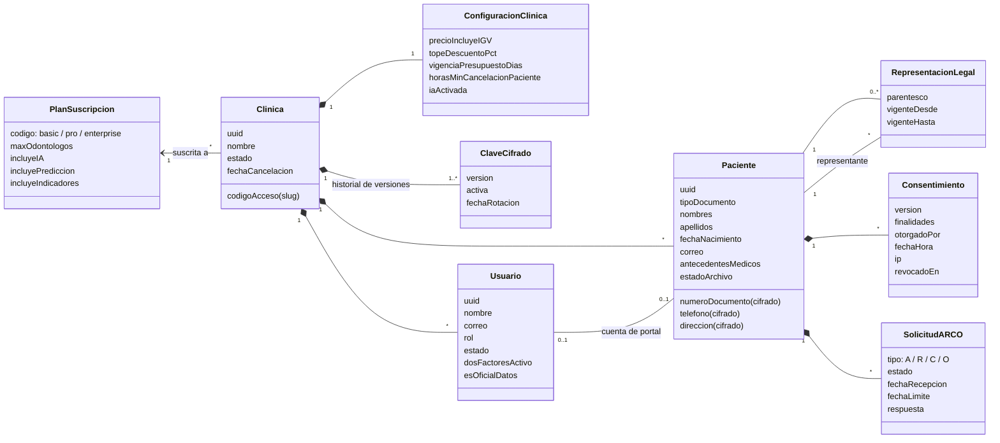
```mermaid
classDiagram
    direction LR
    class PlanSuscripcion {
        codigo: basic / pro / enterprise
        maxOdontologos
        incluyeIA
        incluyePrediccion
        incluyeIndicadores
    }
    class Clinica {
        uuid
        nombre
        codigoAcceso (slug)
        estado
        fechaCancelacion
    }
    class ConfiguracionClinica {
        precioIncluyeIGV
        topeDescuentoPct
        vigenciaPresupuestoDias
        horasMinCancelacionPaciente
        iaActivada
    }
    class ClaveCifrado {
        version
        activa
        fechaRotacion
    }
    class Usuario {
        uuid
        nombre
        correo
        rol
        estado
        dosFactoresActivo
        esOficialDatos
    }
    class Paciente {
        uuid
        tipoDocumento
        numeroDocumento (cifrado)
        nombres
        apellidos
        fechaNacimiento
        telefono (cifrado)
        correo
        direccion (cifrado)
        antecedentesMedicos
        estadoArchivo
    }
    class RepresentacionLegal {
        parentesco
        vigenteDesde
        vigenteHasta
    }
    class Consentimiento {
        version
        finalidades
        otorgadoPor
        fechaHora
        ip
        revocadoEn
    }
    class SolicitudARCO {
        tipo: A / R / C / O
        estado
        fechaRecepcion
        fechaLimite
        respuesta
    }

    PlanSuscripcion "1" <-- "*" Clinica : suscrita a
    Clinica "1" *-- "1" ConfiguracionClinica
    Clinica "1" *-- "1..*" ClaveCifrado : historial de versiones
    Clinica "1" *-- "*" Usuario
    Clinica "1" *-- "*" Paciente
    Paciente "1" -- "0..*" RepresentacionLegal
    RepresentacionLegal "*" -- "1" Paciente : representante
    Paciente "1" *-- "*" Consentimiento
    Paciente "1" *-- "*" SolicitudARCO
    Usuario "0..1" -- "0..1" Paciente : cuenta de portal
```

#### 5.2.2 Clínico y comercial

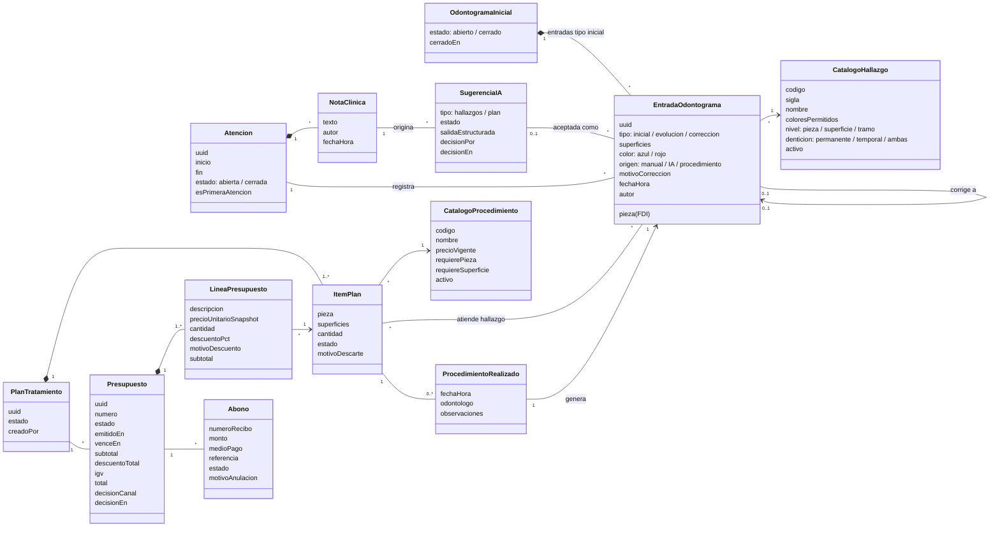
```mermaid
classDiagram
    direction LR
    class Atencion {
        uuid
        inicio
        fin
        estado: abierta / cerrada
        esPrimeraAtencion
    }
    class NotaClinica {
        texto
        autor
        fechaHora
    }
    class CatalogoHallazgo {
        codigo
        sigla
        nombre
        coloresPermitidos
        nivel: pieza / superficie / tramo
        denticion: permanente / temporal / ambas
        activo
    }
    class OdontogramaInicial {
        estado: abierto / cerrado
        cerradoEn
    }
    class EntradaOdontograma {
        uuid
        tipo: inicial / evolucion / correccion
        pieza (FDI)
        superficies
        color: azul / rojo
        origen: manual / IA / procedimiento
        motivoCorreccion
        fechaHora
        autor
    }
    class SugerenciaIA {
        tipo: hallazgos / plan
        estado
        salidaEstructurada
        decisionPor
        decisionEn
    }
    class CatalogoProcedimiento {
        codigo
        nombre
        precioVigente
        requierePieza
        requiereSuperficie
        activo
    }
    class PlanTratamiento {
        uuid
        estado
        creadoPor
    }
    class ItemPlan {
        pieza
        superficies
        cantidad
        estado
        motivoDescarte
    }
    class Presupuesto {
        uuid
        numero
        estado
        emitidoEn
        venceEn
        subtotal
        descuentoTotal
        igv
        total
        decisionCanal
        decisionEn
    }
    class LineaPresupuesto {
        descripcion
        precioUnitarioSnapshot
        cantidad
        descuentoPct
        motivoDescuento
        subtotal
    }
    class ProcedimientoRealizado {
        fechaHora
        odontologo
        observaciones
    }
    class Abono {
        numeroRecibo
        monto
        medioPago
        referencia
        estado
        motivoAnulacion
    }

    Atencion "1" *-- "*" NotaClinica
    Atencion "1" -- "*" EntradaOdontograma : registra
    OdontogramaInicial "1" *-- "*" EntradaOdontograma : entradas tipo inicial
    EntradaOdontograma "*" --> "1" CatalogoHallazgo
    EntradaOdontograma "0..1" --> "0..1" EntradaOdontograma : corrige a
    NotaClinica "1" -- "*" SugerenciaIA : origina
    SugerenciaIA "0..1" -- "*" EntradaOdontograma : aceptada como
    PlanTratamiento "1" *-- "1..*" ItemPlan
    ItemPlan "*" --> "1" CatalogoProcedimiento
    ItemPlan "*" -- "*" EntradaOdontograma : atiende hallazgo
    PlanTratamiento "1" -- "*" Presupuesto
    Presupuesto "1" *-- "1..*" LineaPresupuesto
    LineaPresupuesto "*" --> "1" ItemPlan
    ItemPlan "1" -- "0..*" ProcedimientoRealizado
    ProcedimientoRealizado "1" --> "1" EntradaOdontograma : genera
    Presupuesto "1" -- "*" Abono
```

> Todas las entidades de §5.2.2 pertenecen a un **Paciente** de una **Clínica** (relación omitida en el diagrama por claridad).

#### 5.2.3 Agenda, riesgo y transversales

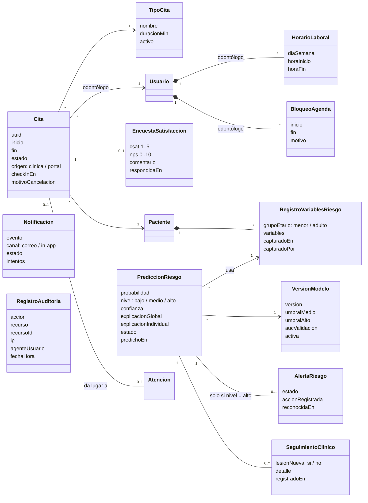
```mermaid
classDiagram
    direction LR
    class HorarioLaboral {
        diaSemana
        horaInicio
        horaFin
    }
    class BloqueoAgenda {
        inicio
        fin
        motivo
    }
    class TipoCita {
        nombre
        duracionMin
        activo
    }
    class Cita {
        uuid
        inicio
        fin
        estado
        origen: clinica / portal
        checkInEn
        motivoCancelacion
    }
    class Notificacion {
        evento
        canal: correo / in-app
        estado
        intentos
    }
    class RegistroVariablesRiesgo {
        grupoEtario: menor / adulto
        variables
        capturadoEn
        capturadoPor
    }
    class VersionModelo {
        version
        umbralMedio
        umbralAlto
        aucValidacion
        activa
    }
    class PrediccionRiesgo {
        probabilidad
        nivel: bajo / medio / alto
        confianza
        explicacionGlobal
        explicacionIndividual
        estado
        predichoEn
    }
    class AlertaRiesgo {
        estado
        accionRegistrada
        reconocidaEn
    }
    class SeguimientoClinico {
        lesionNueva: si / no
        detalle
        registradoEn
    }
    class RegistroAuditoria {
        accion
        recurso
        recursoId
        ip
        agenteUsuario
        fechaHora
    }
    class EncuestaSatisfaccion {
        csat 1..5
        nps 0..10
        comentario
        respondidaEn
    }

    Usuario "1" *-- "*" HorarioLaboral : odontólogo
    Usuario "1" *-- "*" BloqueoAgenda : odontólogo
    Cita "*" --> "1" Usuario : odontólogo
    Cita "*" --> "1" Paciente
    Cita "*" --> "1" TipoCita
    Cita "0..1" -- "0..1" Atencion : da lugar a
    Cita "1" -- "0..1" EncuestaSatisfaccion
    Paciente "1" *-- "*" RegistroVariablesRiesgo
    PrediccionRiesgo "*" --> "1" RegistroVariablesRiesgo : usa
    PrediccionRiesgo "*" --> "1" VersionModelo
    PrediccionRiesgo "1" -- "0..1" AlertaRiesgo : solo si nivel = alto
    PrediccionRiesgo "1" -- "0..*" SeguimientoClinico
```

### 5.3 Descripción de entidades clave

| Entidad | Definición de negocio | Identidad |
| :-- | :-- | :-- |
| Clínica | Organización suscrita; frontera de aislamiento de todos sus datos. | `uuid`; código de acceso único en la plataforma. |
| Usuario | Persona con credenciales. Pertenece a una sola clínica, salvo el Súper Administrador, que no pertenece a ninguna. | `uuid`; correo único por clínica. |
| Paciente | Persona atendida por una clínica. Una misma persona atendida en dos clínicas es dos pacientes distintos, sin vínculo entre ellos. | `uuid`; tipo + número de documento único por clínica. |
| Representación legal | Vínculo entre un paciente menor o sin capacidad de ejercicio y un representante registrado también como paciente o como persona de contacto. | Paciente representado + representante + vigencia. |
| Consentimiento | Manifestación expresa y registrada del titular (o su representante) que autoriza finalidades de tratamiento. Versionado: un cambio de texto exige un nuevo consentimiento. | `uuid`; versión del texto. |
| Atención | Episodio clínico de un paciente con un odontólogo en una fecha. Puede originarse en una cita o registrarse sin cita (urgencia). | `uuid`. |
| Catálogo de hallazgos | Lista de hallazgos de la NTS N° 188 con código, sigla, nombre, colores permitidos, nivel de registro y tipo de dentición. Es de plataforma: igual para todas las clínicas. | Código. |
| Odontograma inicial | Conjunto de entradas de tipo `inicial` registradas en la primera atención de un paciente en la clínica. Uno por paciente. | Paciente. |
| Entrada de odontograma | Unidad atómica e inmutable del historial dentario: un hallazgo en una pieza y, si aplica, en una o más superficies. | `uuid`. |
| Plan de tratamiento | Propuesta clínica ordenada de procedimientos para un paciente. Un paciente puede tener varios planes en el tiempo. | `uuid`. |
| Presupuesto | Documento económico que valoriza ítems de un plan con precios congelados. | `uuid`; número correlativo por clínica. |
| Abono | Pago registrado contra un presupuesto aceptado. | Número de recibo correlativo por clínica. |
| Cita | Intervalo reservado de un odontólogo para un paciente, semiabierto `[inicio, fin)`. | `uuid`. |
| Predicción de riesgo | Resultado inmutable de una ejecución del modelo para un paciente. | `uuid`. |
| Versión de modelo | Modelo entrenado y publicado con sus umbrales y métricas. Solo una versión está activa a la vez. | Número de versión semántica. |

### 5.4 Clasificación por mutabilidad

La mutabilidad es una propiedad de negocio, no solo técnica. Determina qué operaciones se permiten sobre cada entidad.

| Clase | Significado | Entidades |
| :-- | :-- | :-- |
| **Inmutable** | Tras crearse no se modifica ni se elimina. Solo se consulta. | Entrada de odontograma, Odontograma inicial cerrado, Presupuesto emitido y sus líneas, Predicción de riesgo, Consentimiento (su revocación se registra como fecha adicional, sin alterar el resto), Registro de auditoría, Procedimiento realizado |
| **Cambio de estado controlado** | Solo cambia su estado según su ciclo de vida (§5.5); sus datos de negocio no cambian. | Abono, Sugerencia de IA, Alerta de riesgo, Solicitud ARCO, Incidente de seguridad, Notificación |
| **Editable con auditoría** | Se modifica; cada cambio queda en la bitácora con valores anterior y nuevo. | Datos de identificación del paciente, Usuario, Configuración de clínica, Catálogo de procedimientos, Horario laboral, Tipo de cita, Plan de tratamiento en borrador, Presupuesto en borrador, Cita no iniciada |
| **Nunca eliminable antes de la retención** | No se elimina mientras dure la retención legal (RN-68). | Todo lo que forma parte de la historia clínica |

### 5.5 Ciclos de vida

#### 5.5.1 Odontograma inicial

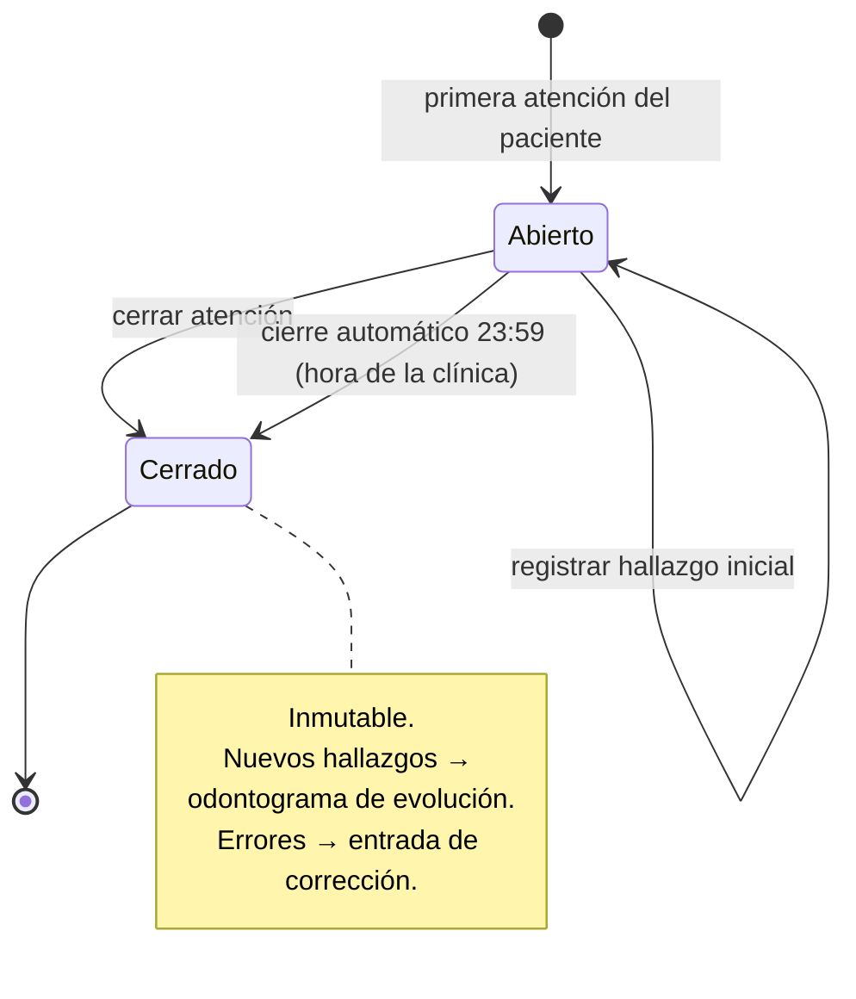
```mermaid
stateDiagram-v2
    [*] --> Abierto : primera atención del paciente
    Abierto --> Abierto : registrar hallazgo inicial
    Abierto --> Cerrado : cerrar atención
    Abierto --> Cerrado : cierre automático 23:59 (hora de la clínica)
    Cerrado --> [*]
    note right of Cerrado
        Inmutable.
        Nuevos hallazgos → odontograma de evolución.
        Errores → entrada de corrección.
    end note
```

#### 5.5.2 Plan de tratamiento e ítem de plan

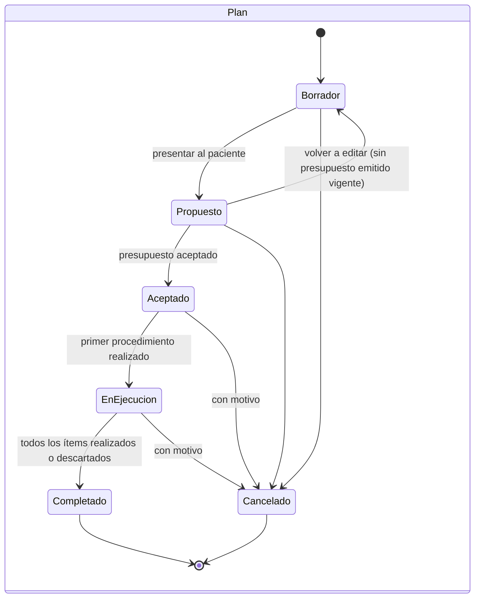
```mermaid
stateDiagram-v2
    state "Plan" as P {
        [*] --> Borrador
        Borrador --> Propuesto : presentar al paciente
        Propuesto --> Borrador : volver a editar (sin presupuesto emitido vigente)
        Propuesto --> Aceptado : presupuesto aceptado
        Aceptado --> EnEjecucion : primer procedimiento realizado
        EnEjecucion --> Completado : todos los ítems realizados o descartados
        Borrador --> Cancelado
        Propuesto --> Cancelado
        Aceptado --> Cancelado : con motivo
        EnEjecucion --> Cancelado : con motivo
        Completado --> [*]
        Cancelado --> [*]
    }
```

| Estado del ítem | Significado | Transiciones permitidas |
| :-- | :-- | :-- |
| `propuesto` | Incluido en el plan, aún sin aceptación. | → `aceptado`, → `descartado` |
| `aceptado` | Incluido en un presupuesto aceptado. | → `realizado`, → `descartado` (con motivo) |
| `realizado` | Existe al menos un procedimiento realizado que completa la cantidad planificada. | Estado final |
| `descartado` | Excluido del plan con motivo registrado. | Estado final |

#### 5.5.3 Presupuesto

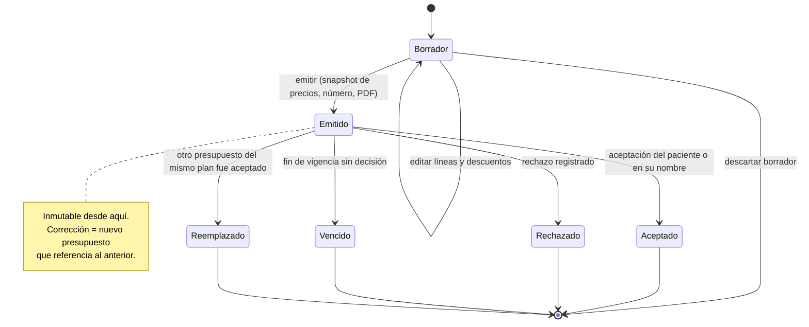
```mermaid
stateDiagram-v2
    [*] --> Borrador
    Borrador --> Borrador : editar líneas y descuentos
    Borrador --> Emitido : emitir (snapshot de precios, número, PDF)
    Borrador --> [*] : descartar borrador
    Emitido --> Aceptado : aceptación del paciente o en su nombre
    Emitido --> Rechazado : rechazo registrado
    Emitido --> Vencido : fin de vigencia sin decisión
    Emitido --> Reemplazado : otro presupuesto del mismo plan fue aceptado
    Aceptado --> [*]
    Rechazado --> [*]
    Vencido --> [*]
    Reemplazado --> [*]
    note right of Emitido
        Inmutable desde aquí.
        Corrección = nuevo presupuesto
        que referencia al anterior.
    end note
```

#### 5.5.4 Cita

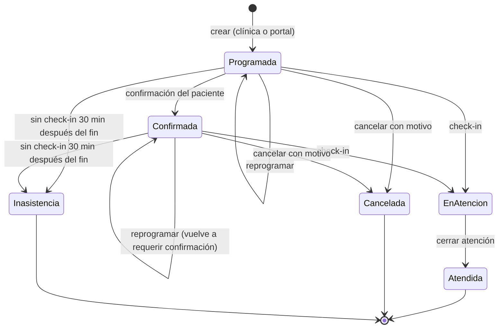
```mermaid
stateDiagram-v2
    [*] --> Programada : crear (clínica o portal)
    Programada --> Confirmada : confirmación del paciente
    Programada --> Programada : reprogramar
    Confirmada --> Confirmada : reprogramar (vuelve a requerir confirmación)
    Programada --> EnAtencion : check-in
    Confirmada --> EnAtencion : check-in
    EnAtencion --> Atendida : cerrar atención
    Programada --> Cancelada : cancelar con motivo
    Confirmada --> Cancelada : cancelar con motivo
    Programada --> Inasistencia : sin check-in 30 min después del fin
    Confirmada --> Inasistencia : sin check-in 30 min después del fin
    Atendida --> [*]
    Cancelada --> [*]
    Inasistencia --> [*]
```

> Estados **activos** (ocupan agenda): `Programada`, `Confirmada`, `EnAtencion`. Estados **terminales**: `Atendida`, `Cancelada`, `Inasistencia`.

#### 5.5.5 Sugerencia de IA

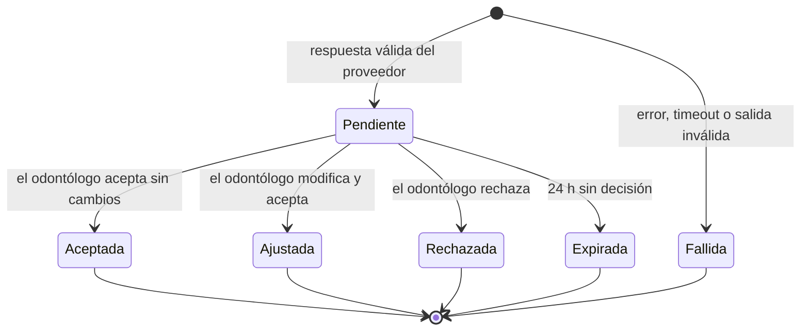
```mermaid
stateDiagram-v2
    [*] --> Pendiente : respuesta válida del proveedor
    [*] --> Fallida : error, timeout o salida inválida
    Pendiente --> Aceptada : el odontólogo acepta sin cambios
    Pendiente --> Ajustada : el odontólogo modifica y acepta
    Pendiente --> Rechazada : el odontólogo rechaza
    Pendiente --> Expirada : 24 h sin decisión
    Aceptada --> [*]
    Ajustada --> [*]
    Rechazada --> [*]
    Expirada --> [*]
    Fallida --> [*]
```

#### 5.5.6 Predicción y alerta de riesgo

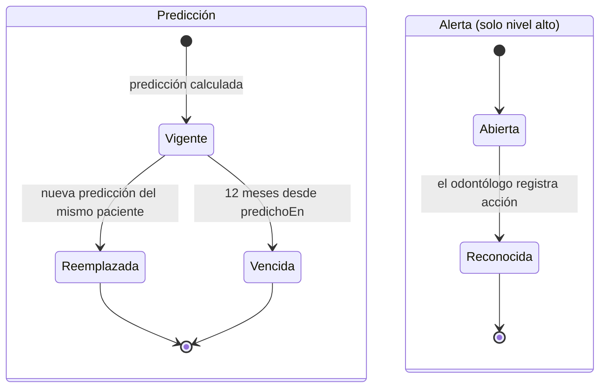
```mermaid
stateDiagram-v2
    state "Predicción" as PR {
        [*] --> Vigente : predicción calculada
        Vigente --> Reemplazada : nueva predicción del mismo paciente
        Vigente --> Vencida : 12 meses desde predichoEn
        Reemplazada --> [*]
        Vencida --> [*]
    }
    state "Alerta (solo nivel alto)" as AL {
        [*] --> Abierta
        Abierta --> Reconocida : el odontólogo registra acción
        Reconocida --> [*]
    }
```

#### 5.5.7 Otros ciclos de vida

| Entidad | Estados | Transiciones y disparadores |
| :-- | :-- | :-- |
| Clínica | `activa`, `suspendida`, `cancelada`, `eliminada` | activa ⇄ suspendida (Súper Administrador); activa/suspendida → cancelada (Súper Administrador); cancelada → eliminada (automático a los 90 días, tras generar la exportación final). |
| Usuario | `activo`, `bloqueado_temporal`, `inactivo` | activo → bloqueado_temporal (5 intentos fallidos) → activo (a los 15 min o por desbloqueo del administrador); activo ⇄ inactivo (Administrador de Clínica). |
| Paciente (archivo) | `activo`, `pasivo`, `bloqueado`, `apto_eliminacion` | activo → pasivo (5 años sin atención); pasivo → activo (nueva atención); activo/pasivo → bloqueado (cancelación ARCO aceptada); pasivo/bloqueado → apto_eliminacion (20 años desde la última atención). |
| Consentimiento | `vigente`, `revocado`, `sustituido` | vigente → revocado (titular o representante); vigente → sustituido (nuevo consentimiento con otra versión o finalidades). |
| Abono | `vigente`, `anulado` | vigente → anulado (Administrador de Clínica, con motivo). |
| Solicitud ARCO | `recibida`, `en_tramite`, `atendida`, `denegada` | recibida → en_tramite → atendida/denegada. `denegada` exige fundamento. |
| Incidente de seguridad | `registrado`, `notificado_autoridad`, `notificado_titulares`, `cerrado` | registrado → notificado_autoridad → (notificado_titulares si corresponde) → cerrado. |
| Notificación | `pendiente`, `enviada`, `fallida` | pendiente → enviada; pendiente → fallida tras 3 intentos. |

### 5.6 Extensiones del modelo de dominio (Fase 6)

El levantamiento de requisitos funcionales (§12.1) agregó o amplió estas entidades. Los diagramas de §5.2 se mantienen; esta tabla es la fuente de verdad de los cambios.

| Entidad | Cambio | Atributos principales | Relaciones | Mutabilidad (§5.4) |
| :-- | :-- | :-- | :-- | :-- |
| Usuario | Ampliada | colegiaturaCOP (odontólogo), especialidad, numeroRNE | 1–N Sesión; 1–N Código de recuperación | Editable con auditoría |
| Paciente | Ampliada | numeroHistoriaClinica, fechaFallecimiento, fusionadoEn | 0..1 → Paciente principal (si fue fusionado) | Editable con auditoría |
| Atención | Ampliada | inicioClinico, cierreIncompleto, firmadaPor, firmadaEn | 1–1 Nota de atención; 1–N Diagnóstico; 1–N Adenda | Cambio de estado controlado |
| Nota de atención | Reemplaza a Nota clínica | motivoConsulta, enfermedadActual, examenExtraoral, examenIntraoral, indicaciones, estado (borrador, firmada) | → Atención; 1–N Sugerencia de IA | Inmutable tras el cierre (RN-78) |
| Diagnóstico de atención | Nueva | códigoCIE10, tipo (presuntivo, definitivo), origen (nota, adenda) | → Atención; → Catálogo CIE-10 | Inmutable |
| Adenda | Nueva | texto, autor, fecha | → Atención; 0–N Diagnóstico | Inmutable |
| Catálogo CIE-10 | Nueva (plataforma) | código, descripción, capítulo, activo | — | Publicado con el software |
| Catálogo de procedimientos | Ampliada | categoría, hallazgoResultante, requiereConsentimientoInformado | → Catálogo de hallazgos; N–M Plantilla de CI; 1–N Historial de precio | Editable con auditoría |
| Historial de precio | Nueva | precio, vigenteDesde, usuario | → Catálogo de procedimientos | Inmutable |
| Plantilla de consentimiento informado | Nueva | título, texto con campos variables, versión, activa | N–M Catálogo de procedimientos | Cada edición crea una versión |
| Consentimiento informado | Nueva | versión de plantilla, firmante (titular o representante), canal (dispositivo, papel), odontólogo que informó, fechaHora, huella SHA-256, estado, motivoRevocación | → Ítem de plan | Inmutable salvo su estado |
| Control periódico | Nueva | fechaPrevista, origen (cierre de atención, alerta), estado | → Paciente; 0..1 → Cita | Cambio de estado controlado |
| Entrada de lista de espera | Nueva | odontólogoPreferido, tipoCita, desde, hasta, estado | → Paciente | Cambio de estado controlado |
| Importación | Nueva | tipo (pacientes, catálogo), archivo, filasVálidas, filasRechazadas, estado | → Usuario | Inmutable tras confirmar |
| Enlace compartido | Nueva | hashToken, venceEn, revocadoEn | → Presupuesto | Cambio de estado controlado |
| Consumo de IA | Nueva | clínica, mes, cantidad | → Clínica | Contador |

**Ciclos de vida nuevos.**

| Entidad | Estados | Transiciones |
| :-- | :-- | :-- |
| Consentimiento informado | `vigente`, `utilizado`, `revocado` | vigente → utilizado (se registra el procedimiento); vigente → revocado (antes del procedimiento, con motivo). |
| Control periódico | `pendiente`, `agendado`, `cumplido`, `vencido` | pendiente → agendado (se reserva la cita); agendado → cumplido (cita atendida); pendiente → vencido (pasa la fecha sin cita); agendado → pendiente (la cita se cancela). |
| Entrada de lista de espera | `activa`, `atendida`, `expirada`, `retirada` | activa → atendida (se reservó); activa → expirada (pasa la fecha "hasta"); activa → retirada (a pedido). |
| Atención | `abierta`, `cerrada`, `cerrada_incompleta` | abierta → cerrada (cierre con RN-77 cumplido); abierta → cerrada_incompleta (cierre automático sin RN-77); cerrada_incompleta → cerrada (adenda que completa motivo y diagnóstico). |
| Paciente (archivo) | se agrega `fusionado` | activo/pasivo → fusionado (CUS-88), estado final. |

---

## 6. Reglas de negocio

Las reglas de negocio son **inquebrantables**: ninguna funcionalidad, rol ni configuración puede violarlas. Cada regla indica su origen y cómo se verifica. Los requisitos funcionales (Fase 6) las implementan; los casos de prueba las verifican.

**Tipos de verificación:** **P** = prueba automatizada backend · **BD** = restricción de base de datos · **E2E** = prueba de extremo a extremo · **R** = revisión de configuración o documento.

### 6.1 Aislamiento multi-clínica y acceso

| ID | Regla | Origen | Verificación |
| :-- | :-- | :-- | :-- |
| RN-01 | Todo dato de clínica pertenece a exactamente una clínica. El sistema asigna la clínica a partir del usuario autenticado; cualquier identificador de clínica enviado por el cliente se ignora. | NN-11, DD-03 | P |
| RN-02 | Una consulta de datos de clínica ejecutada sin clínica resuelta devuelve cero registros. | NN-11, DD-03 | P |
| RN-03 | La solicitud de un recurso de otra clínica responde como si el recurso no existiera (HTTP 404), sin revelar su existencia. | NN-11 | P |
| RN-04 | Solo el Súper Administrador opera fuera del ámbito de una clínica, y solo sobre datos de plataforma (clínicas, planes, usuarios administradores, claves, métricas, incidentes, auditoría). El Súper Administrador no accede a datos clínicos ni de identificación de pacientes. | NN-11, NN-12 | P |
| RN-05 | Un usuario pertenece a una sola clínica. El correo es único dentro de la clínica. El Súper Administrador no pertenece a ninguna clínica y su correo es único entre los súper administradores. | DD-03 | P, BD |
| RN-06 | Todo permiso no concedido explícitamente a un rol está denegado. Los permisos por rol son los de la matriz de §9 (Fase 4). | NN-12, REF-13 | P |
| RN-07 | En una clínica `suspendida` todos sus usuarios solo pueden leer. En una clínica `cancelada` solo el Administrador de Clínica puede acceder, y únicamente para exportar datos, durante 90 días. | DD-16 | P |
| RN-08 | Una clínica no puede tener más odontólogos activos que el máximo de su plan. En los planes sin IA ni predicción, esas funciones no están disponibles. | DD-16 | P |

### 6.2 Pacientes y consentimiento

| ID | Regla | Origen | Verificación |
| :-- | :-- | :-- | :-- |
| RN-09 | La combinación tipo de documento (DNI, carné de extranjería, pasaporte o Carné de Permiso Temporal de Permanencia) + número es única por clínica. | NN-08, DD-04 | P, BD |
| RN-10 | No se registra ningún dato clínico (antecedentes, odontograma, notas, variables de riesgo, planes) de un paciente sin un consentimiento de datos vigente con la finalidad "atención odontológica". Sin él solo se permiten datos de identificación, contacto y citas. | NN-12, REF-01, DD-14 | P |
| RN-11 | El consentimiento declara finalidades separadas: (a) atención odontológica, obligatoria; (b) notificaciones; (c) asistencia de IA generativa; (d) predicción de riesgo; (e) encuestas. Cada finalidad opcional puede otorgarse o revocarse de forma independiente. | REF-01, DD-11, DD-14 | P |
| RN-12 | Un paciente es menor de edad si tiene menos de 18 años a la fecha de la operación, calculado desde su fecha de nacimiento. Un menor debe tener un representante legal vigente, que es quien otorga el consentimiento. | DD-13, REF-01 | P |
| RN-13 | Cuando el paciente cumple 18 años, la representación legal deja de otorgar acceso al portal y el paciente debe otorgar su propio consentimiento antes de registrar nuevos datos clínicos. | DD-13 | P |
| RN-14 | La revocación de una finalidad detiene de inmediato los tratamientos asociados. La revocación de la finalidad "atención odontológica" impide registrar nuevos datos clínicos, pero los existentes se conservan bloqueados durante la retención legal (RN-68). | REF-01, REF-03 | P |
| RN-15 | Un cambio en el texto del consentimiento genera una nueva versión. Los pacientes con una versión anterior deben otorgar la nueva en su siguiente atención; hasta entonces sigue vigente la anterior. | REF-01 | P |

### 6.3 Odontograma

| ID | Regla | Origen | Verificación |
| :-- | :-- | :-- | :-- |
| RN-16 | Solo se aceptan piezas del Sistema Dígito Dos: permanentes 11–18, 21–28, 31–38, 41–48; temporales 51–55, 61–65, 71–75, 81–85. | REF-04, REF-12 | P, BD |
| RN-17 | Solo se registran hallazgos del catálogo NTS 188 activo. Cada hallazgo define sus colores permitidos, su nivel de registro (pieza, superficie o tramo de piezas) y la dentición a la que aplica; un registro fuera de estas definiciones se rechaza. El color lo determina el estado seleccionado del hallazgo según el catálogo, no una elección libre. | REF-04, DD-05 | P |
| RN-18 | Superficies válidas: oclusal (O) solo en premolares y molares; incisal (I) solo en incisivos y caninos; palatina (P) solo en piezas superiores; lingual (L) solo en piezas inferiores; mesial (M), distal (D) y vestibular (V) en todas. | REF-04 | P |
| RN-19 | Solo un usuario con rol Odontólogo registra entradas de odontograma. El autor de la entrada es siempre el usuario autenticado. | REF-05 | P |
| RN-20 | Cada paciente tiene un único odontograma inicial en la clínica, registrado en su primera atención. Se cierra al cerrar esa atención o, si no se cierra, a las 23:59 del mismo día en la zona horaria de la clínica. Desde su cierre es inmutable. | REF-04, DD-05 | P |
| RN-21 | Tras el cierre del odontograma inicial, todo hallazgo nuevo se registra como entrada de evolución. | REF-04, DD-05 | P |
| RN-22 | Las entradas de odontograma no se modifican ni se eliminan. Toda operación de actualización o eliminación sobre ellas se rechaza. | NN-03, REF-04 | P, BD |
| RN-23 | Un error se corrige con una entrada de corrección que referencia la entrada corregida e incluye un motivo de al menos 10 caracteres. La entrada corregida se conserva y se presenta marcada como corregida. | REF-04, DD-05 | P |
| RN-24 | El estado vigente del odontograma es el resultado de aplicar, en orden cronológico de registro, las entradas iniciales y de evolución no corregidas. Es un cálculo; no reemplaza al historial. | NN-03 | P |
| RN-25 | El odontograma solo contiene hallazgos observados. Los procedimientos planificados se registran únicamente en el plan de tratamiento. | REF-04, DD-06 | R, P |

### 6.4 Plan de tratamiento y presupuesto

| ID | Regla | Origen | Verificación |
| :-- | :-- | :-- | :-- |
| RN-26 | Cada ítem de plan referencia un procedimiento del catálogo activo de la clínica. Si el procedimiento requiere pieza o superficie, el ítem debe indicarlas y cumplir RN-16 y RN-18. | NN-04, DD-06 | P |
| RN-27 | Todo hallazgo de color rojo sin corregir debe estar vinculado a un ítem de plan o marcado "no tratar" con motivo. Los que no cumplen se muestran como pendientes de decisión. | NN-14, OB-13 | P |
| RN-28 | Un presupuesto se crea desde un plan y contiene al menos una línea, cada una asociada a un ítem del plan en estado `propuesto`. | DD-06 | P |
| RN-29 | Cálculo de una línea: `subtotal = redondeo(precio_unitario × cantidad × (1 − descuento_pct / 100), 2)`, con redondeo aritmético (mitad hacia arriba). `total = Σ subtotales`. | NN-04, DD-07 | P |
| RN-30 | IGV con tasa de plataforma del 18 %. Si la clínica declara que sus precios incluyen IGV: `base = redondeo(total / 1,18, 2)` e `igv = total − base` (desglose informativo). Si no los incluye: `igv = redondeo(Σ subtotales × 0,18, 2)` y `total = Σ subtotales + igv`. | DD-07 | P |
| RN-31 | El descuento por línea está entre 0 % y 100 %. Odontólogo y Recepcionista pueden aplicar hasta el tope de la clínica; por encima, solo el Administrador de Clínica. Todo descuento mayor que 0 % exige motivo. | DD-07 | P |
| RN-32 | La emisión es atómica: si algún procedimiento del presupuesto no está activo en el catálogo, no se emite ninguna parte del presupuesto y se informa la lista de líneas inválidas. | NN-04 | P |
| RN-33 | Al emitir, el precio unitario vigente de cada procedimiento se copia en la línea (snapshot). Los cambios posteriores del catálogo no alteran presupuestos emitidos. | NN-04 | P |
| RN-34 | Un presupuesto emitido es inmutable: no cambian sus líneas, montos ni fechas de emisión y vencimiento. Una corrección se hace con un presupuesto nuevo que referencia al anterior. | NN-05 | P, BD |
| RN-35 | Un presupuesto emitido vence a las 23:59 (hora de la clínica) del día `fecha de emisión + vigencia`. Un presupuesto vencido no puede aceptarse. | DD-07 | P |
| RN-36 | La aceptación es total: comprende todas las líneas. Para aceptar un subconjunto se emite un presupuesto nuevo. La aceptación o el rechazo registran usuario, canal (portal, presencial), fecha, hora e IP. | NN-05, OUT-12 | P |
| RN-37 | Un plan tiene como máximo un presupuesto aceptado. Al aceptar uno, los demás presupuestos emitidos del mismo plan pasan a `reemplazado`, y los ítems incluidos pasan a `aceptado`. | DD-06 | P |
| RN-38 | Un procedimiento realizado se registra solo contra un ítem `aceptado`. Si se atiende una urgencia sin plan previo, el plan y el presupuesto se crean y aceptan en la misma atención antes de registrar el procedimiento. | DD-06 | P |
| RN-39 | Registrar un procedimiento realizado genera automáticamente una entrada de evolución en el odontograma con origen "procedimiento" y el hallazgo resultante definido para ese procedimiento en el catálogo. | DD-06, REF-04 | P |

### 6.5 Pagos

| ID | Regla | Origen | Verificación |
| :-- | :-- | :-- | :-- |
| RN-40 | Un abono se registra solo contra un presupuesto `aceptado`, con monto mayor que 0,00 PEN. | NN-06, DD-08 | P |
| RN-41 | La suma de abonos vigentes de un presupuesto no puede superar su total. Un abono que lo haría se rechaza. | NN-06 | P |
| RN-42 | Cada abono recibe un número de recibo correlativo por clínica que no se reutiliza, ni siquiera si el abono se anula. | NN-06 | P, BD |
| RN-43 | Un abono no se modifica ni se elimina. Solo el Administrador de Clínica puede anularlo, con motivo; el recibo anulado conserva su número y se presenta como anulado. | NN-06, DD-08 | P |
| RN-44 | `saldo = total del presupuesto aceptado − Σ abonos vigentes`. | NN-06 | P |
| RN-45 | Todo recibo interno lleva la leyenda "Documento no válido para fines tributarios". | RES-09, DD-08 | R, P |

### 6.6 Agenda

| ID | Regla | Origen | Verificación |
| :-- | :-- | :-- | :-- |
| RN-46 | Dos citas activas del mismo odontólogo en la misma clínica no pueden tener intervalos `[inicio, fin)` superpuestos. | NN-01, DD-09 | P, BD |
| RN-47 | Una cita debe estar completamente dentro del horario laboral del odontólogo, fuera de sus bloqueos, con duración entre 10 y 240 minutos y múltiplo de 5. | NN-01, DD-09 | P |
| RN-48 | No se crean citas con inicio en el pasado. El paciente solo puede autoagendar con al menos 2 horas de anticipación y tener como máximo 2 citas activas autoagendadas. | DD-09 | P |
| RN-49 | El paciente puede cancelar o reprogramar desde el portal hasta N horas antes del inicio (N configurable por clínica; por defecto 24). Después solo la clínica puede hacerlo. | DD-09 | P |
| RN-50 | El check-in solo es posible el día de la cita, desde 60 minutos antes del inicio hasta el fin de la cita. | DD-09 | P |
| RN-51 | Una cita activa sin check-in pasa a `inasistencia` 30 minutos después de su fin. | DD-09, NN-13 | P |
| RN-52 | Los recordatorios por correo se envían 24 horas antes del inicio solo si el paciente otorgó la finalidad "notificaciones" y tiene un correo registrado. | DD-10, RN-11 | P |
| RN-74 | Un paciente no puede tener dos citas activas con intervalos superpuestos en la misma clínica, aunque sean con odontólogos distintos. | NN-01 | P |

### 6.7 Asistencia de IA generativa

| ID | Regla | Origen | Verificación |
| :-- | :-- | :-- | :-- |
| RN-53 | La IA solo está disponible si el plan de la clínica la incluye, la clínica la activó y el paciente otorgó la finalidad "asistencia de IA". | DD-11, DD-16, RN-11 | P |
| RN-54 | Antes de enviar una nota al proveedor se eliminan nombres, números de documento, teléfonos, correos, direcciones y fechas de nacimiento. Solo se envían la edad en años, la dentición y el texto clínico seudonimizado. | NN-12, DD-11 | P |
| RN-55 | Una sugerencia no tiene efecto clínico hasta que un odontólogo la acepta o la ajusta. Solo un odontólogo puede decidir. Las entradas y los ítems creados desde una sugerencia registran su origen y la referencia a la sugerencia. | NN-10, REF-05 | P |
| RN-56 | La salida del proveedor se valida contra el catálogo NTS 188, el catálogo de procedimientos y las reglas RN-16 a RN-18. Los elementos no válidos se descartan y se informan; si no queda ninguno válido, la sugerencia queda `fallida`. | DD-11 | P |
| RN-57 | Un error, una salida inválida o un tiempo de respuesta mayor que 15 s del proveedor no impide el registro manual. La sugerencia queda `fallida`. | NN-16, DD-11 | P |

### 6.8 Predicción de riesgo

| ID | Regla | Origen | Verificación |
| :-- | :-- | :-- | :-- |
| RN-58 | Una predicción solo se solicita si: (a) el plan la incluye; (b) el paciente otorgó la finalidad "predicción de riesgo"; (c) existe un registro de variables completo para su grupo etario (menor o adulto) capturado en los últimos 6 meses. Si falta alguna condición, no se invoca al modelo y se informa qué falta. | NN-09, DD-12 | P |
| RN-59 | El nivel se asigna con los umbrales de la versión de modelo usada: bajo si `p < umbral_medio`; medio si `umbral_medio ≤ p < umbral_alto`; alto si `p ≥ umbral_alto`. Valores iniciales: 0,30 y 0,60. La predicción guarda probabilidad, nivel, confianza, explicación, versión y umbrales aplicados. | DD-12 | P |
| RN-60 | Una predicción es inmutable. Está vigente 12 meses desde su cálculo o hasta que otra predicción del mismo paciente la reemplaza. | DD-12 | P |
| RN-61 | Se crea una alerta si y solo si el nivel es `alto`: exactamente una por predicción, dirigida al odontólogo que solicitó la predicción. Una predicción `bajo` o `medio` no crea alerta. | NN-09, F08 `<<extend>>` | P, BD |
| RN-62 | La explicación existe solo como parte de una predicción calculada; no puede solicitarse de forma independiente. | F08 `<<include>>` | P |
| RN-63 | Toda presentación de una predicción muestra su confianza y la leyenda "Herramienta de apoyo; no constituye diagnóstico". Si la confianza es menor que 0,60, se añade la leyenda "Baja confianza". | DD-12 | E2E |
| RN-64 | Ante un tiempo de respuesta mayor que 3 s, un error del modelo o el Circuit Breaker abierto, no se guarda ninguna predicción, se informa "Predicción no disponible" y la atención continúa sin restricción. El fallo queda registrado. | NN-16, DD-12 | P |
| RN-65 | Una alerta pasa a `reconocida` solo cuando el odontólogo registra una acción: plan preventivo, cita de control o nota justificando que no se actúa. | NN-09 | P |
| RN-66 | Un seguimiento clínico se vincula a una predicción y registra si hubo al menos una lesión nueva. Solo los seguimientos registrados entre 9 y 15 meses después de la predicción se usan para evaluar y recalibrar el modelo. | DD-12 | P |

### 6.9 Cumplimiento, retención y auditoría

| ID | Regla | Origen | Verificación |
| :-- | :-- | :-- | :-- |
| RN-67 | Se registra en la bitácora de auditoría: inicio de sesión (exitoso y fallido), cierre de sesión, lectura de la historia clínica de un paciente, toda creación, modificación o cambio de estado de datos personales o clínicos, cambios de roles y permisos, exportaciones y descargas de documentos. Cada registro contiene usuario, clínica, acción, tipo y UUID del recurso, fecha y hora, IP y agente de usuario, sin datos clínicos en claro. La bitácora es inmutable y se conserva al menos 5 años. | NN-12, REF-02 | P, BD |
| RN-68 | Retención de la historia clínica: un paciente sin atenciones durante 5 años pasa a archivo `pasivo` (solo lectura, excluido de los listados por defecto). Ningún dato clínico se elimina antes de 20 años desde la última atención. Cumplido ese plazo, el paciente pasa a `apto_eliminacion` y solo el Administrador de Clínica puede ordenar su eliminación; se conserva un resumen mínimo (identificación, fechas de primera y última atención). | NN-07, REF-03 | P |
| RN-69 | Las solicitudes ARCO tienen un plazo interno de respuesta de 10 días hábiles desde su recepción. Acceso: se entrega la copia de la HC. Rectificación: los datos de identificación se editan con auditoría; los datos clínicos se rectifican con una entrada de corrección. Cancelación: los datos clínicos se bloquean y los datos de finalidades opcionales se eliminan. Oposición: se revocan las finalidades opcionales indicadas. | REF-01, REF-02, DD-14 | P |
| RN-70 | El paciente o su representante pueden descargar desde el portal, en cualquier momento, una copia PDF de su historia clínica. Una solicitud presencial se atiende en un máximo de 5 días. | REF-03, NN-17 | P |
| RN-71 | Un incidente de seguridad registrado muestra el plazo restante de 48 horas para notificar a la autoridad. El sistema alerta al Súper Administrador y al Oficial de Datos Personales de la clínica afectada a las 24 y a las 40 horas si aún no está marcado como notificado. | REF-02, DD-14 | P |
| RN-72 | Solo el Administrador de Clínica puede exportar datos de pacientes de forma masiva. Toda exportación queda auditada. | NN-12 | P |
| RN-73 | Se envía como máximo una encuesta de satisfacción por cita atendida, solo si el paciente otorgó la finalidad "encuestas". El enlace es válido 7 días y solo admite una respuesta. | NN-15, RN-11 | P |
### 6.10 Reglas incorporadas en la Fase 6

| ID | Regla | Origen | Verificación |
| :-- | :-- | :-- | :-- |
| RN-75 | Un usuario con rol Odontólogo debe tener registrado su número de colegiatura del Colegio Odontológico del Perú para registrar datos clínicos. El número figura en todo documento clínico que firma. | REF-04, REF-05 | P |
| RN-76 | Un procedimiento marcado en el catálogo como "requiere consentimiento informado" solo puede registrarse como realizado si el ítem del plan tiene un consentimiento informado firmado por el paciente o su representante, no revocado y anterior al procedimiento. | REF-06, DD-31 | P |
| RN-77 | Una atención solo se cierra si registra motivo de consulta y al menos un diagnóstico CIE-10. Si el cierre automático de RN-20 alcanza una atención sin ellos, esta queda `cerrada_incompleta` hasta que el odontólogo los agregue mediante una adenda. | REF-03, REF-07, DD-30 | P |
| RN-78 | Al cerrarse una atención, su nota y sus diagnósticos son inmutables. La información posterior se agrega como adenda, con autor y fecha. | REF-03, DD-30 | P, BD |
| RN-79 | El número de historia clínica es el número de DNI del paciente; para otros documentos, el tipo seguido del número. Es único por clínica y no cambia. | REF-03 | P |
| RN-80 | A un paciente con fecha de fallecimiento registrada no se le envían notificaciones ni encuestas, no se le reservan citas y se desactiva su cuenta de portal. Su historia clínica sigue la retención de RN-68. | REF-03, NN-12 | P |
| RN-81 | El titular o su representante puede obtener sus datos personales y clínicos en un formato estructurado y legible por máquina (JSON con esquema documentado). La solicitud sigue el plazo de RN-69. | REF-02 | P |
| RN-82 | No se puede crear un bloqueo de agenda ni reducir un horario laboral sobre citas activas sin reprogramar o cancelar cada cita afectada en la misma operación. | NN-01, RN-46 | P |
| RN-83 | Cada plan define una cuota mensual de sugerencias de IA por clínica `[REQUIERE DEFINICIÓN]` (PQ-02). Al agotarse, la IA deja de estar disponible hasta el primer día del mes siguiente; el registro manual no se ve afectado. | DD-16, NN-16 | P |
| RN-84 | Solo una versión del modelo de riesgo puede estar activa. Solo se activa una versión con AUC-ROC de validación ≥ 0,75 y puntuación de Brier informada. | OB-08, DD-12 | P |
| RN-85 | Cada fila importada cumple las mismas validaciones que el registro manual. Las filas inválidas o duplicadas (RN-09) no se importan y se informan. Los pacientes importados solo incluyen datos de identificación y contacto hasta que otorguen su consentimiento (RN-10). | NN-18, RN-09, RN-10, DD-32 | P |

---

## 7. Proceso de negocio

Esta sección describe el flujo de valor de la clínica antes (AS-IS) y después (TO-BE) de DentiCore. El proceso central es el mismo de los Formatos 02–05: **diagnóstico odontológico y elaboración del presupuesto de tratamiento**. El TO-BE lo amplía hasta la ejecución del tratamiento y el seguimiento preventivo, porque el valor para el paciente (y la mayoría de los problemas detectados) no termina en el presupuesto.

> **Notación.** Los diagramas usan carriles representados con subgrafos Mermaid. Cada actividad tiene un identificador (`AS-xx` o `A-xx`) que enlaza el diagrama con su tabla. El modelo BPMN 2.0 formal para los entregables del curso se construye en la herramienta gráfica del equipo a partir de las tablas de §7.1.2 y §7.2.4, que son la fuente de verdad.

### 7.1 Proceso actual (AS-IS)

#### 7.1.1 Diagrama

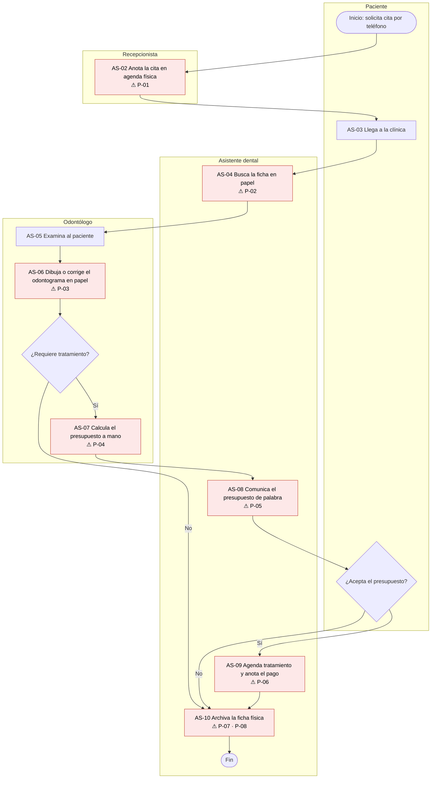
```mermaid
flowchart TB
    subgraph PAC["Paciente"]
        AS01(["Inicio: solicita cita por teléfono"])
        AS03["AS-03 Llega a la clínica"]
        G2{"¿Acepta el presupuesto?"}
    end
    subgraph REC["Recepcionista"]
        AS02["AS-02 Anota la cita en agenda física<br/>⚠ P-01"]
    end
    subgraph ASI["Asistente dental"]
        AS04["AS-04 Busca la ficha en papel<br/>⚠ P-02"]
        AS08["AS-08 Comunica el presupuesto de palabra<br/>⚠ P-05"]
        AS09["AS-09 Agenda tratamiento y anota el pago<br/>⚠ P-06"]
        AS10["AS-10 Archiva la ficha física<br/>⚠ P-07 · P-08"]
        FIN(["Fin"])
    end
    subgraph ODO["Odontólogo"]
        AS05["AS-05 Examina al paciente"]
        AS06["AS-06 Dibuja o corrige el odontograma en papel<br/>⚠ P-03"]
        G1{"¿Requiere tratamiento?"}
        AS07["AS-07 Calcula el presupuesto a mano<br/>⚠ P-04"]
    end

    AS01 --> AS02 --> AS03 --> AS04 --> AS05 --> AS06 --> G1
    G1 -- No --> AS10
    G1 -- Sí --> AS07 --> AS08 --> G2
    G2 -- No --> AS10
    G2 -- Sí --> AS09 --> AS10 --> FIN

    classDef problema fill:#fde8e8,stroke:#c0392b,color:#000
    class AS02,AS04,AS06,AS07,AS08,AS09,AS10 problema
```

#### 7.1.2 Actividades y problemas

| ID | Actividad AS-IS | Actor | Problema (F04) | Necesidad |
| :-- | :-- | :-- | :-- | :-- |
| AS-01 | Solicita cita por teléfono | Paciente | — | — |
| AS-02 | Anota la cita en agenda física, sin validar disponibilidad | Recepcionista | P-01 Doble reserva posible | NN-01 |
| AS-03 | Llega a la clínica | Paciente | — | — |
| AS-04 | Busca la ficha en el archivador | Asistente dental | P-02 Demora en ubicar la ficha | NN-02 |
| AS-05 | Examina al paciente | Odontólogo | — | — |
| AS-06 | Dibuja o corrige el odontograma sobre el mismo papel | Odontólogo | P-03 Se pierde el estado anterior de cada pieza; nomenclatura no controlada | NN-03 |
| AS-07 | Calcula el presupuesto con lista física o de memoria | Odontólogo | P-04 Precios distintos según el odontólogo | NN-04 |
| AS-08 | Comunica el presupuesto de palabra | Asistente dental | P-05 Sin constancia de lo ofrecido ni de la decisión | NN-05 |
| AS-09 | Agenda el tratamiento y anota el pago a mano | Asistente dental | P-06 Pago sin comprobante ni saldo | NN-06 |
| AS-10 | Archiva la ficha física | Asistente dental | P-07 Pérdida o deterioro, acceso sin control · P-08 Datos repetidos en agenda, ficha y registro de pagos | NN-07, NN-08 |

**Problemas transversales no visibles en el diagrama AS-IS:**

| ID | Problema | Necesidad |
| :-- | :-- | :-- |
| P-09 | No existe forma de anticipar qué pacientes desarrollarán caries. | NN-09 |
| P-10 | El odontólogo transcribe a mano lo que observa; no hay registro estructurado reutilizable. | NN-10 |
| P-11 | No hay recordatorio de citas; las inasistencias no se miden. | NN-13 |
| P-12 | Lo presupuestado no se convierte en un plan con avance medible; no se sabe qué quedó pendiente. | NN-14 |
| P-13 | No hay registro de consentimiento ni de accesos; la clínica no puede demostrar que cumple la Ley N° 29733. | NN-12 |
| P-14 | El paciente no puede consultar su información sin acudir a la clínica. | NN-17 |

### 7.2 Proceso mejorado (TO-BE)

#### 7.2.1 Cadena de valor

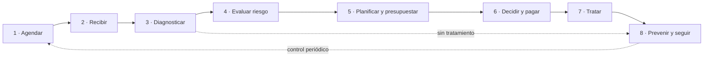
```mermaid
flowchart LR
    E1["1 · Agendar"] --> E2["2 · Recibir"]
    E2 --> E3["3 · Diagnosticar"]
    E3 --> E4["4 · Evaluar riesgo"]
    E4 --> E5["5 · Planificar y presupuestar"]
    E5 --> E6["6 · Decidir y pagar"]
    E6 --> E7["7 · Tratar"]
    E7 --> E8["8 · Prevenir y seguir"]
    E8 -. "control periódico" .-> E1
    E3 -. "sin tratamiento" .-> E8
```

| Etapa | Qué obtiene la clínica o el paciente | Actividades | CUN |
| :-- | :-- | :-- | :-- |
| 1 · Agendar | Cita sin cruces, confirmada y recordada. | A-01 a A-04 | CUN-03 |
| 2 · Recibir | Paciente identificado, con consentimiento vigente y su historia disponible. | A-05 a A-08 | CUN-04 |
| 3 · Diagnosticar | Hallazgos estructurados según la NTS N° 188, con apoyo opcional de IA. | A-09 a A-13 | CUN-05 |
| 4 · Evaluar riesgo | Nivel de riesgo explicado y alerta cuando es alto. | A-14 a A-17 | CUN-06 |
| 5 · Planificar y presupuestar | Plan de tratamiento y presupuesto formal con precios de catálogo. | A-18 a A-21 | CUN-07 |
| 6 · Decidir y pagar | Decisión registrada, abonos con recibo y saldo conocido. | A-22 a A-25 | CUN-08, CUN-09 |
| 7 · Tratar | Procedimientos realizados reflejados en el odontograma y en el avance del plan. | A-26 a A-29 | CUN-10 |
| 8 · Prevenir y seguir | Controles programados y resultado real contrastado con la predicción. | A-30 a A-33 | CUN-11 |

#### 7.2.2 Diagrama TO-BE — Etapas 1 a 6 (de la cita al presupuesto aceptado)

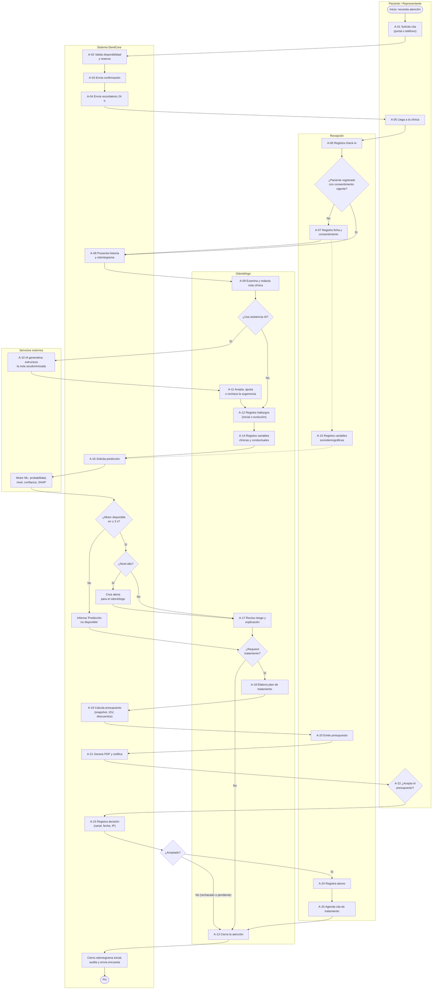
```mermaid
flowchart TB
    subgraph PAC["Paciente / Representante"]
        I(["Inicio: necesita atención"])
        A01["A-01 Solicita cita<br/>(portal o teléfono)"]
        A05["A-05 Llega a la clínica"]
        A22{"A-22 ¿Acepta el<br/>presupuesto?"}
    end
    subgraph REC["Recepción"]
        A06["A-06 Registra check-in"]
        G1{"¿Paciente registrado<br/>con consentimiento vigente?"}
        A07["A-07 Registra ficha y<br/>consentimiento"]
        A15["A-15 Registra variables<br/>sociodemográficas"]
        A20["A-20 Emite presupuesto"]
        A24["A-24 Registra abono"]
        A25["A-25 Agenda cita de tratamiento"]
    end
    subgraph ODO["Odontólogo"]
        A09["A-09 Examina y redacta nota clínica"]
        G2{"¿Usa asistencia IA?"}
        A11["A-11 Acepta, ajusta<br/>o rechaza la sugerencia"]
        A12["A-12 Registra hallazgos<br/>(inicial o evolución)"]
        A14["A-14 Registra variables<br/>clínicas y conductuales"]
        A17["A-17 Revisa riesgo y<br/>explicación"]
        G3{"¿Requiere<br/>tratamiento?"}
        A18["A-18 Elabora plan de tratamiento"]
        A13["A-13 Cierra la atención"]
    end
    subgraph SIS["Sistema DentiCore"]
        A02["A-02 Valida disponibilidad<br/>y reserva"]
        A03["A-03 Envía confirmación"]
        A04["A-04 Envía recordatorio 24 h"]
        A08["A-08 Presenta historia<br/>y odontograma"]
        A16["A-16 Solicita predicción"]
        GML{"¿Motor disponible<br/>en ≤ 3 s?"}
        ND["Informa 'Predicción<br/>no disponible'"]
        GAL{"¿Nivel alto?"}
        ALR["Crea alerta<br/>para el odontólogo"]
        A19["A-19 Calcula presupuesto<br/>(snapshot, IGV, descuentos)"]
        A21["A-21 Genera PDF y notifica"]
        A23["A-23 Registra decisión<br/>(canal, fecha, IP)"]
        CIE["Cierra odontograma inicial,<br/>audita y envía encuesta"]
        F(["Fin"])
    end
    subgraph EXT["Servicios externos"]
        A10["A-10 IA generativa: estructura<br/>la nota seudonimizada"]
        ML["Motor ML: probabilidad,<br/>nivel, confianza, SHAP"]
    end

    I --> A01 --> A02 --> A03 --> A04 --> A05 --> A06 --> G1
    G1 -- No --> A07 --> A08
    G1 -- Sí --> A08
    A08 --> A09 --> G2
    G2 -- Sí --> A10 --> A11 --> A12
    G2 -- No --> A12
    A12 --> A14
    A07 -.-> A15 -.-> A16
    A14 --> A16 --> ML --> GML
    GML -- No --> ND --> G3
    GML -- Sí --> GAL
    GAL -- Sí --> ALR --> A17
    GAL -- No --> A17
    A17 --> G3
    G3 -- No --> A13
    G3 -- Sí --> A18 --> A19 --> A20 --> A21 --> A22
    A22 --> A23 --> G4{"¿Aceptado?"}
    G4 -- Sí --> A24 --> A25 --> A13
    G4 -- "No (rechazado o pendiente)" --> A13
    A13 --> CIE --> F
```

> Un presupuesto no decidido durante la atención puede aceptarse después desde el portal (CUN-08) mientras esté vigente (RN-35).

#### 7.2.3 Diagrama TO-BE — Etapas 7 y 8 (tratamiento y prevención)

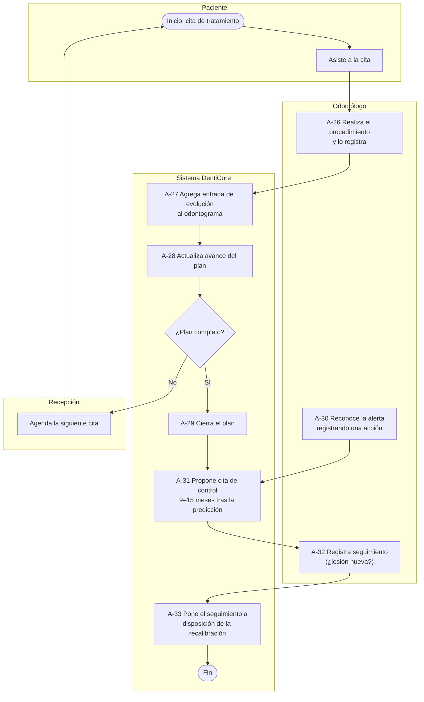
```mermaid
flowchart TB
    subgraph PAC["Paciente"]
        B1(["Inicio: cita de tratamiento"])
        B2["Asiste a la cita"]
    end
    subgraph ODO["Odontólogo"]
        A26["A-26 Realiza el procedimiento<br/>y lo registra"]
        A30["A-30 Reconoce la alerta<br/>registrando una acción"]
        A32["A-32 Registra seguimiento<br/>(¿lesión nueva?)"]
    end
    subgraph SIS["Sistema DentiCore"]
        A27["A-27 Agrega entrada de evolución<br/>al odontograma"]
        A28["A-28 Actualiza avance del plan"]
        G1{"¿Plan completo?"}
        A29["A-29 Cierra el plan"]
        A31["A-31 Propone cita de control<br/>9–15 meses tras la predicción"]
        A33["A-33 Pone el seguimiento a<br/>disposición de la recalibración"]
        F(["Fin"])
    end
    subgraph REC["Recepción"]
        NXT["Agenda la siguiente cita"]
    end

    B1 --> B2 --> A26 --> A27 --> A28 --> G1
    G1 -- No --> NXT --> B1
    G1 -- Sí --> A29 --> A31
    A30 --> A31
    A31 --> A32 --> A33 --> F
```

#### 7.2.4 Actividades TO-BE

**Tipo:** **M** = manual (fuera del sistema) · **U** = usuario en el sistema · **A** = automática del sistema · **X** = servicio externo.

| ID | Actividad | Actor | Tipo | Salida | RN | Resuelve |
| :-- | :-- | :-- | :-- | :-- | :-- | :-- |
| A-01 | Solicitar cita por el portal o por teléfono | Paciente / Recepción | U | Solicitud de cita | RN-48 | — |
| A-02 | Validar horario laboral, bloqueos y solapamientos; reservar | Sistema | A | Cita `programada` | RN-46, RN-47 | P-01 |
| A-03 | Enviar confirmación de la cita | Sistema | A | Notificación | RN-52 | P-11 |
| A-04 | Enviar recordatorio 24 h antes | Sistema | A | Notificación | RN-52 | P-11 |
| A-05 | Llegar a la clínica | Paciente | M | — | — | — |
| A-06 | Registrar check-in | Recepción | U | Cita `en_atencion`, atención abierta | RN-50 | — |
| A-07 | Registrar ficha, representante (si es menor) y consentimiento | Recepción | U | Paciente, consentimiento | RN-09 a RN-15 | P-08, P-13 |
| A-08 | Presentar historia clínica y odontograma vigente | Sistema | A | Vista de la HC | RN-24, RN-67 | P-02 |
| A-09 | Examinar y redactar la nota clínica | Odontólogo | M + U | Nota clínica | RN-19 | — |
| A-10 | Estructurar la nota seudonimizada en hallazgos sugeridos | Servicio IA | X | Sugerencia `pendiente` o `fallida` | RN-53, RN-54, RN-56, RN-57 | P-10 |
| A-11 | Aceptar, ajustar o rechazar la sugerencia | Odontólogo | U | Decisión registrada | RN-55 | P-10 |
| A-12 | Registrar hallazgos en odontograma inicial o de evolución | Odontólogo | U | Entradas de odontograma | RN-16 a RN-25 | P-03 |
| A-13 | Cerrar la atención | Odontólogo | U | Atención `cerrada`; odontograma inicial cerrado | RN-20 | P-03 |
| A-14 | Registrar variables clínicas y conductuales | Odontólogo | U | Registro de variables | RN-58 | P-09 |
| A-15 | Registrar variables sociodemográficas | Recepción | U | Registro de variables | RN-58 | P-09 |
| A-16 | Solicitar la predicción al motor ML | Sistema | A | Predicción o "no disponible" | RN-58, RN-59, RN-64 | P-09 |
| A-17 | Revisar nivel, confianza y explicación | Odontólogo | U | — | RN-62, RN-63 | P-09 |
| A-18 | Elaborar el plan de tratamiento desde los hallazgos | Odontólogo | U | Plan `borrador` → `propuesto` | RN-26, RN-27 | P-12 |
| A-19 | Calcular el presupuesto | Sistema | A | Presupuesto calculado | RN-28 a RN-31 | P-04 |
| A-20 | Emitir el presupuesto | Recepción / Odontólogo | U | Presupuesto `emitido` | RN-32 a RN-35 | P-04, P-05 |
| A-21 | Generar el PDF y notificar al paciente | Sistema | A | PDF, notificación | RN-52 | P-05 |
| A-22 | Decidir sobre el presupuesto | Paciente | M / U | Decisión | RN-35, RN-36 | P-05 |
| A-23 | Registrar la decisión | Sistema | A | Presupuesto `aceptado` / `rechazado`; ítems `aceptado` | RN-36, RN-37 | P-05 |
| A-24 | Registrar abono y emitir recibo interno | Recepción | U | Abono, recibo PDF, saldo | RN-40 a RN-45 | P-06 |
| A-25 | Agendar la cita de tratamiento | Recepción | U | Cita | RN-46, RN-47 | P-01 |
| A-26 | Realizar y registrar el procedimiento | Odontólogo | M + U | Procedimiento realizado | RN-38 | P-12 |
| A-27 | Agregar la entrada de evolución resultante | Sistema | A | Entrada de odontograma (origen "procedimiento") | RN-39 | P-03 |
| A-28 | Actualizar el avance del plan | Sistema | A | Ítems `realizado`, plan `en_ejecucion` | RN-38 | P-12 |
| A-29 | Cerrar el plan | Sistema | A | Plan `completado` | — | P-12 |
| A-30 | Reconocer la alerta de riesgo alto | Odontólogo | U | Alerta `reconocida` | RN-65 | P-09 |
| A-31 | Proponer la cita de control preventivo | Sistema | A | Sugerencia de cita | RN-66 | P-09 |
| A-32 | Registrar el seguimiento clínico | Odontólogo | U | Seguimiento | RN-66 | P-09 |
| A-33 | Poner los seguimientos a disposición de la evaluación del modelo | Sistema | A | Conjunto de evaluación | RN-66 | P-09 |

Actividades automáticas transversales, ejecutadas en todas las etapas: registro de auditoría (RN-67), marcado de inasistencias (RN-51), vencimiento de presupuestos (RN-35) y envío de encuestas (RN-73).

#### 7.2.5 Variantes y excepciones del proceso

| ID | Situación | Tratamiento en el TO-BE | RN |
| :-- | :-- | :-- | :-- |
| EX-01 | Paciente sin consentimiento vigente | Solo se registran identificación, contacto y cita. No se abre el registro clínico hasta obtener el consentimiento. | RN-10 |
| EX-02 | Paciente menor de 18 años | Se exige un representante legal vigente, que otorga el consentimiento y decide sobre el presupuesto. | RN-12 |
| EX-03 | Urgencia sin cita | Se registra la atención sin cita. Si hay procedimiento, el plan y el presupuesto se crean y aceptan en la misma atención. | RN-38 |
| EX-04 | Servicio de IA caído o con salida inválida | La sugerencia queda `fallida` y el odontólogo registra manualmente. | RN-57 |
| EX-05 | Motor ML caído, lento o con Circuit Breaker abierto | Se informa "Predicción no disponible" y la atención continúa. | RN-64 |
| EX-06 | Variables de riesgo incompletas o de más de 6 meses | No se invoca al motor; el sistema indica qué falta. | RN-58 |
| EX-07 | El paciente se lleva el presupuesto para decidir después | Queda `emitido`; puede aceptarse desde el portal o de forma presencial hasta su vencimiento. | RN-35 |
| EX-08 | Presupuesto con error | Se emite un presupuesto nuevo que referencia al anterior. | RN-34 |
| EX-09 | Hallazgo registrado por error | Se registra una entrada de corrección con motivo. | RN-23 |
| EX-10 | El paciente no llega | La cita pasa a `inasistencia` 30 minutos después de su fin. | RN-51 |
| EX-11 | La clínica está suspendida | Solo lectura; no puede ejecutarse ninguna actividad que registre datos. | RN-07 |

#### 7.2.6 Indicadores del proceso

| Indicador | Definición | Momento de medición | OB |
| :-- | :-- | :-- | :-- |
| Tiempo de ciclo de presupuesto | Tiempo entre el check-in (A-06) y la emisión del presupuesto (A-20) de la misma atención. | Por atención | OB-14 |
| Tasa de aceptación | Presupuestos aceptados ÷ presupuestos cerrados (aceptados + rechazados + vencidos) en el mes. | Mensual | OB-05, OB-14 |
| Tasa de inasistencia | Citas en `inasistencia` ÷ citas cuyo fin ocurrió en el mes. | Mensual | OB-12 |
| Hallazgos sin decisión | Hallazgos rojos no corregidos sin ítem de plan ni marca "no tratar". | Diario | OB-13 |
| Cobertura de predicción | Pacientes con variables completas y predicción vigente ÷ pacientes con variables completas. | Mensual | OB-08 |
| Continuidad clínica | Atenciones cerradas mientras el motor ML o la IA estaban no disponibles, sin incidencia de bloqueo. | Por evento | OB-15 |

### 7.3 Comparación AS-IS → TO-BE

| Problema | AS-IS | TO-BE | Actividades | Verificación (OB) |
| :-- | :-- | :-- | :-- | :-- |
| P-01 | Agenda física sin control de cruces | Reserva validada contra horario, bloqueos y solapamientos, con restricción en base de datos | A-02, A-25 | OB-01 |
| P-02 | Búsqueda manual de la ficha | Historia clínica presentada al hacer check-in | A-08 | OB-02 |
| P-03 | Odontograma corregido sobre el mismo papel | Odontograma inicial inmutable + evolución *append-only* con nomenclatura NTS 188 | A-12, A-13, A-27 | OB-03 |
| P-04 | Precio según el odontólogo | Cálculo desde el catálogo con snapshot | A-19, A-20 | OB-04 |
| P-05 | Presupuesto verbal | PDF formal, notificación y decisión registrada | A-20 a A-23 | OB-05 |
| P-06 | Pago anotado a mano | Abono con recibo correlativo y saldo | A-24 | OB-06 |
| P-07 | Ficha física expuesta | Historia digital con respaldo, control de acceso y retención de 20 años | A-08, A-13 | OB-07 |
| P-08 | Datos repetidos en varios papeles | Ficha única por paciente y documento | A-07 | OB-02 |
| P-09 | Sin anticipación del riesgo | Predicción explicada, alerta y seguimiento | A-14 a A-17, A-30 a A-33 | OB-08 |
| P-10 | Transcripción manual | Estructuración asistida por IA con validación | A-10, A-11 | OB-09 |
| P-11 | Sin recordatorios | Confirmación y recordatorio automáticos | A-03, A-04 | OB-12 |
| P-12 | Presupuesto sin seguimiento | Plan con avance por ítem | A-18, A-26 a A-29 | OB-13 |
| P-13 | Sin evidencia de cumplimiento | Consentimiento por finalidad y bitácora de auditoría | A-07, transversal | OB-11 |
| P-14 | Información solo en la clínica | Portal del paciente | A-01, A-22 | OB-16 |

### 7.4 Procesos de soporte

Además del proceso central, DentiCore soporta cuatro procesos de la clínica y de la plataforma. Se describen como casos de uso del negocio en §8 y no requieren diagrama propio.

| Proceso | Disparador | Resultado | CUN |
| :-- | :-- | :-- | :-- |
| Incorporación de una clínica | Contrato comercial firmado | Clínica operativa con su administrador | CUN-01, CUN-02, CUN-17 |
| Atención de derechos del titular | Solicitud ARCO del paciente | Respuesta en ≤ 10 días hábiles | CUN-13 |
| Gestión de incidentes de seguridad | Detección de una vulneración | Notificación a la autoridad en ≤ 48 h | CUN-14 |
| Conservación de historias clínicas | Paso del tiempo | HC en el archivo que corresponde; eliminación solo tras 20 años | CUN-15 |

---

## 8. Casos de uso del negocio

Un caso de uso del negocio (CUN) describe un resultado de valor que la organización (la clínica, apoyada por la plataforma) entrega a un **actor de negocio**. Lo ejecutan **trabajadores de negocio** con apoyo de sistemas. Los CUN no describen pantallas; son el puente entre el proceso (§7) y los casos de uso del sistema (§9, Fase 4).

### 8.1 Actores y trabajadores de negocio

| Tipo | Nombre | Relación con los actores del sistema (§2.3) |
| :-- | :-- | :-- |
| Actor de negocio | Paciente | ACT-05 |
| Actor de negocio | Representante legal | ACT-06 |
| Actor de negocio | Clínica suscriptora (dueño o gerencia) | Se materializa en ACT-02 dentro del sistema |
| Actor de negocio | Autoridad Nacional de Protección de Datos Personales (ANPDP) | Externo; no usa el sistema |
| Actor de negocio | Autoridad sanitaria (MINSA / DIRESA) | Externo; no usa el sistema |
| Trabajador de negocio | Operador de la plataforma | ACT-01 |
| Trabajador de negocio | Administrador de clínica / Oficial de Datos Personales | ACT-02 |
| Trabajador de negocio | Odontólogo | ACT-03 |
| Trabajador de negocio | Recepcionista / Asistente dental | ACT-04 |
| Sistema de apoyo | DentiCore, Motor ML, Servicio de IA, Servidor de correo | ACT-07 a ACT-10 |

### 8.2 Catálogo

| ID | Caso de uso del negocio | Actor de negocio | Trabajadores | Resultado de valor | Módulos | Prioridad |
| :-- | :-- | :-- | :-- | :-- | :-- | :-- |
| CUN-01 | Incorporar una clínica a la plataforma | Clínica suscriptora | Operador de plataforma | Clínica aislada y operativa con su administrador | M01, M02 | Must |
| CUN-02 | Gestionar el equipo de la clínica | Clínica suscriptora | Administrador de clínica | Personal con el acceso exacto que su rol necesita | M02 | Must |
| CUN-03 | Reservar y gestionar una cita | Paciente | Recepcionista | Cita sin cruces, confirmada y recordada | M06, M10 | Must |
| CUN-04 | Registrar al paciente y su consentimiento | Paciente, Representante | Recepcionista | Ficha única y tratamiento de datos autorizado | M03 | Must |
| CUN-05 | Diagnosticar y registrar el odontograma | Paciente | Odontólogo | Estado dentario trazable conforme a la NTS N° 188 | M04, M08 | Must |
| CUN-06 | Evaluar el riesgo de caries | Paciente | Odontólogo, Recepcionista | Nivel de riesgo explicado y alerta si es alto | M09 | Must |
| CUN-07 | Elaborar plan de tratamiento y presupuesto | Paciente | Odontólogo, Recepcionista | Presupuesto formal con precios estandarizados | M05, M08 | Must |
| CUN-08 | Decidir sobre el presupuesto | Paciente, Representante | Recepcionista | Decisión registrada con evidencia | M05, M10 | Must |
| CUN-09 | Pagar el tratamiento | Paciente | Recepcionista, Administrador de clínica | Abono con recibo y saldo actualizado | M07 | Should |
| CUN-10 | Ejecutar el tratamiento | Paciente | Odontólogo | Procedimientos reflejados en odontograma y plan | M04, M05 | Must |
| CUN-11 | Dar seguimiento preventivo | Paciente | Odontólogo | Acción preventiva y resultado real registrado | M09, M06 | Should |
| CUN-12 | Consultar la propia historia clínica | Paciente, Representante | — (autoservicio) | Acceso a su información y copia descargable | M10, M11 | Should |
| CUN-13 | Ejercer derechos sobre los datos personales | Paciente, Representante | Oficial de Datos Personales | Solicitud ARCO atendida en plazo | M11, M10 | Must |
| CUN-14 | Gestionar un incidente de seguridad | ANPDP, Paciente | Operador de plataforma, Oficial de Datos Personales | Incidente documentado y notificado en ≤ 48 h | M11 | Should |
| CUN-15 | Conservar y archivar historias clínicas | Autoridad sanitaria | Administrador de clínica | Retención conforme a la NTS N° 139 | M11 | Must |
| CUN-16 | Medir el desempeño y la satisfacción | Clínica suscriptora, Paciente | Administrador de clínica | Indicadores del mes y opinión del paciente | M12 | Could |
| CUN-17 | Configurar la oferta de servicios de la clínica | Clínica suscriptora | Administrador de clínica | Catálogo, precios, horarios y parámetros vigentes | M01, M05, M06 | Must |
| CUN-18 | Supervisar la operación de la plataforma | Clínica suscriptora | Operador de plataforma | Degradaciones detectadas y atendidas | M13 | Should |

### 8.3 Diagrama

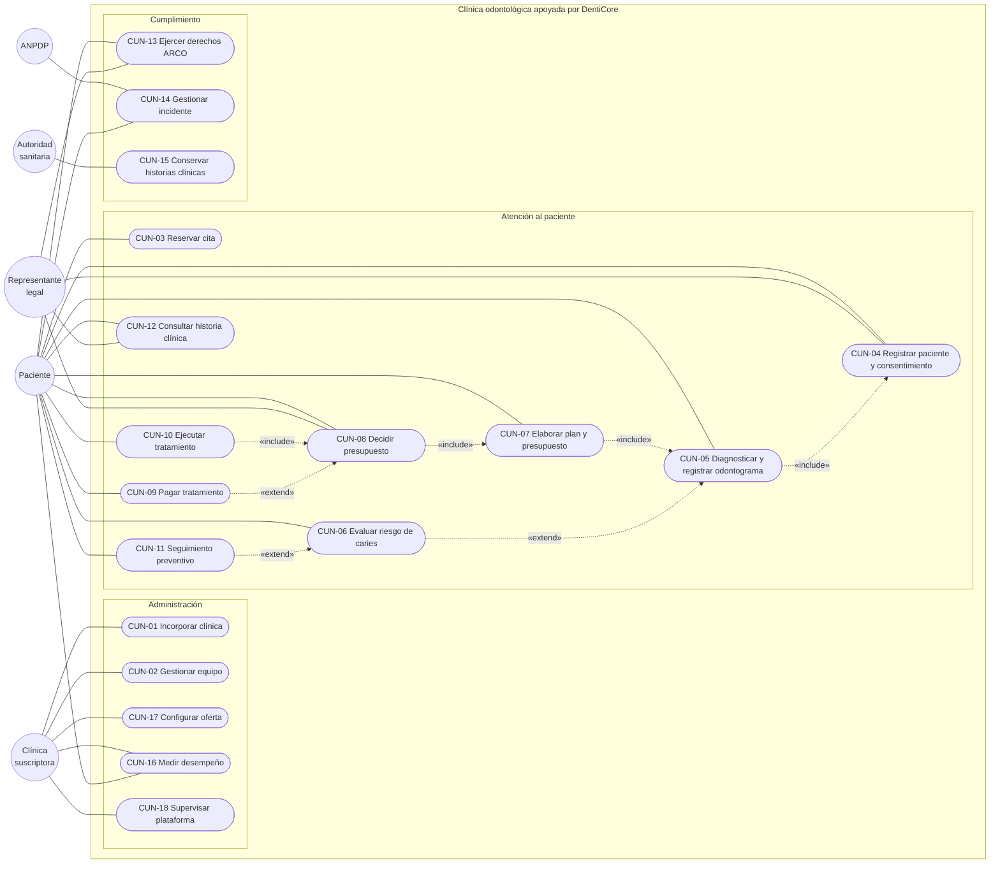
```mermaid
flowchart LR
    PAC(("Paciente"))
    REP(("Representante<br/>legal"))
    CLI(("Clínica<br/>suscriptora"))
    ANP(("ANPDP"))
    AUT(("Autoridad<br/>sanitaria"))

    subgraph NEG["Clínica odontológica apoyada por DentiCore"]
        direction TB
        subgraph ADM["Administración"]
            CUN01(["CUN-01 Incorporar clínica"])
            CUN02(["CUN-02 Gestionar equipo"])
            CUN17(["CUN-17 Configurar oferta"])
            CUN16(["CUN-16 Medir desempeño"])
            CUN18(["CUN-18 Supervisar plataforma"])
        end
        subgraph ATN["Atención al paciente"]
            CUN03(["CUN-03 Reservar cita"])
            CUN04(["CUN-04 Registrar paciente y consentimiento"])
            CUN05(["CUN-05 Diagnosticar y registrar odontograma"])
            CUN06(["CUN-06 Evaluar riesgo de caries"])
            CUN07(["CUN-07 Elaborar plan y presupuesto"])
            CUN08(["CUN-08 Decidir presupuesto"])
            CUN09(["CUN-09 Pagar tratamiento"])
            CUN10(["CUN-10 Ejecutar tratamiento"])
            CUN11(["CUN-11 Seguimiento preventivo"])
            CUN12(["CUN-12 Consultar historia clínica"])
        end
        subgraph CMP["Cumplimiento"]
            CUN13(["CUN-13 Ejercer derechos ARCO"])
            CUN14(["CUN-14 Gestionar incidente"])
            CUN15(["CUN-15 Conservar historias clínicas"])
        end
    end

    CLI --- CUN01 & CUN02 & CUN17 & CUN16 & CUN18
    PAC --- CUN03 & CUN04 & CUN05 & CUN06 & CUN07 & CUN08 & CUN09 & CUN10 & CUN11 & CUN12 & CUN13 & CUN16
    REP --- CUN04 & CUN08 & CUN12 & CUN13
    ANP --- CUN14
    PAC --- CUN14
    AUT --- CUN15

    CUN05 -. "«include»" .-> CUN04
    CUN07 -. "«include»" .-> CUN05
    CUN08 -. "«include»" .-> CUN07
    CUN10 -. "«include»" .-> CUN08
    CUN09 -. "«extend»" .-> CUN08
    CUN06 -. "«extend»" .-> CUN05
    CUN11 -. "«extend»" .-> CUN06
```

> `«include»`: el caso base siempre requiere el incluido (no se diagnostica sin paciente con consentimiento; no se presupuesta sin diagnóstico; no se trata sin presupuesto aceptado). `«extend»`: el caso extensor ocurre solo si se cumple una condición (el pago, solo si hay presupuesto aceptado y el paciente abona; la evaluación de riesgo, solo si el plan la incluye y hay consentimiento; el seguimiento, solo tras una predicción).

### 8.4 Especificación

#### CUN-01 — Incorporar una clínica a la plataforma

| Campo | Contenido |
| :-- | :-- |
| Objetivo | Que una clínica que contrató el servicio empiece a operar con sus datos aislados. |
| Disparador | Contrato comercial firmado con la clínica. |
| Flujo | 1. El operador de plataforma registra la clínica, su código de acceso, su plan y los datos de su primer administrador. 2. DentiCore crea la clínica, su clave de cifrado y el administrador en una sola operación. 3. El administrador recibe sus credenciales, activa 2FA y completa la configuración inicial (CUN-17). |
| Variantes | La clínica deja de pagar: el operador la suspende (solo lectura). La clínica termina el contrato: se cancela y dispone de 90 días para exportar sus datos. |
| Resultado | Clínica `activa`, aislada de las demás. |
| NN / RN | NN-11 · RN-01 a RN-08 |

#### CUN-02 — Gestionar el equipo de la clínica

| Campo | Contenido |
| :-- | :-- |
| Objetivo | Que cada integrante del personal acceda solo a lo que su rol necesita. |
| Disparador | Ingreso, cambio de función o salida de un integrante del personal. |
| Flujo | 1. El administrador registra al usuario con su rol. 2. Si es odontólogo, registra su horario laboral. 3. Ante una salida, desactiva al usuario y el sistema revoca sus sesiones. 4. Designa al Oficial de Datos Personales. |
| Variantes | Se alcanza el máximo de odontólogos del plan: no se puede registrar otro hasta cambiar de plan o desactivar uno. |
| Resultado | Equipo registrado con permisos mínimos por rol. |
| NN / RN | NN-11, NN-12 · RN-05, RN-06, RN-08 |

#### CUN-03 — Reservar y gestionar una cita

| Campo | Contenido |
| :-- | :-- |
| Objetivo | Que el paciente obtenga una cita que no choca con otra y la recuerde. |
| Disparador | El paciente necesita atención o un control. |
| Flujo | 1. El paciente reserva desde el portal o la recepcionista reserva por él. 2. DentiCore ofrece solo intervalos libres dentro del horario del odontólogo. 3. Se confirma la reserva y se notifica. 4. 24 h antes se envía un recordatorio; el paciente confirma, reprograma o cancela. |
| Variantes | Cancelación fuera del plazo del portal: solo la clínica puede hacerla. El paciente no llega: inasistencia. |
| Resultado | Cita `confirmada` o gestionada, sin solapamientos. |
| NN / RN | NN-01, NN-13, NN-17 · RN-46 a RN-52 |

#### CUN-04 — Registrar al paciente y su consentimiento

| Campo | Contenido |
| :-- | :-- |
| Objetivo | Que la clínica tenga una sola ficha por paciente y autorización para tratar sus datos. |
| Disparador | Primera atención del paciente en la clínica o consentimiento desactualizado. |
| Flujo | 1. La recepcionista busca al paciente por documento. 2. Si no existe, registra su ficha. 3. Si es menor, registra a su representante legal. 4. El paciente o su representante otorga el consentimiento por finalidades. |
| Variantes | Documento ya registrado: se usa la ficha existente. El paciente no consiente la atención odontológica: no se abre el registro clínico. |
| Resultado | Paciente con ficha única y consentimiento vigente. |
| NN / RN | NN-08, NN-12 · RN-09 a RN-15 |

#### CUN-05 — Diagnosticar y registrar el odontograma

| Campo | Contenido |
| :-- | :-- |
| Objetivo | Que el estado de cada pieza dentaria quede registrado con la nomenclatura oficial y sin perder lo anterior. |
| Disparador | Check-in del paciente o atención de urgencia. |
| Flujo | 1. El odontólogo revisa la historia clínica. 2. Examina y redacta su nota. 3. Opcionalmente, obtiene una sugerencia de IA y la valida. 4. Registra los hallazgos: en el odontograma inicial si es la primera atención, o en el de evolución. 5. Cierra la atención. |
| Variantes | IA no disponible: registro manual. Error en un hallazgo: entrada de corrección. |
| Resultado | Odontograma actualizado y trazable; odontograma inicial cerrado tras la primera atención. |
| NN / RN | NN-02, NN-03, NN-10, NN-16 · RN-16 a RN-25, RN-53 a RN-57 |

#### CUN-06 — Evaluar el riesgo de caries

| Campo | Contenido |
| :-- | :-- |
| Objetivo | Que el odontólogo sepa, con explicación, qué tan probable es que el paciente desarrolle caries en 12 meses. |
| Disparador | Atención de un paciente cuya clínica tiene la predicción en su plan y que consintió esta finalidad. |
| Flujo | 1. La recepcionista registra las variables sociodemográficas y el odontólogo las clínicas y conductuales. 2. DentiCore solicita la predicción. 3. El odontólogo revisa nivel, confianza y factores. 4. Si el nivel es alto, recibe una alerta. |
| Variantes | Variables incompletas: se indica qué falta. Motor no disponible: la atención continúa sin predicción. |
| Resultado | Predicción vigente y, si corresponde, alerta abierta. |
| NN / RN | NN-09, NN-16 · RN-58 a RN-64 |

#### CUN-07 — Elaborar plan de tratamiento y presupuesto

| Campo | Contenido |
| :-- | :-- |
| Objetivo | Que el paciente reciba una propuesta de tratamiento con un precio que no depende de quién lo atiende. |
| Disparador | El diagnóstico registra hallazgos que requieren tratamiento. |
| Flujo | 1. El odontólogo convierte los hallazgos en ítems de un plan (opcionalmente con sugerencia de IA). 2. Presenta el plan al paciente. 3. La recepción o el odontólogo emite el presupuesto; DentiCore aplica precios del catálogo, descuentos permitidos e IGV. 4. El paciente recibe el PDF. |
| Variantes | Procedimiento inactivo en el catálogo: no se emite nada y se indica qué corregir. Descuento sobre el tope: requiere al administrador. |
| Resultado | Plan `propuesto` y presupuesto `emitido`. |
| NN / RN | NN-04, NN-05, NN-10, NN-14 · RN-26 a RN-35 |

#### CUN-08 — Decidir sobre el presupuesto

| Campo | Contenido |
| :-- | :-- |
| Objetivo | Que la decisión del paciente quede registrada con evidencia. |
| Disparador | Presupuesto emitido y vigente. |
| Flujo | 1. El paciente o su representante revisa el presupuesto. 2. Lo acepta o rechaza en la clínica o desde el portal. 3. DentiCore registra la decisión con canal, fecha, hora e IP y actualiza el plan. |
| Variantes | El paciente quiere solo parte del tratamiento: se emite un presupuesto nuevo con esas líneas. Sin decisión al vencer: `vencido`. |
| Resultado | Presupuesto `aceptado`, `rechazado` o `vencido`. |
| NN / RN | NN-05, NN-17 · RN-35 a RN-37 |

#### CUN-09 — Pagar el tratamiento

| Campo | Contenido |
| :-- | :-- |
| Objetivo | Que cada pago tenga constancia y el paciente conozca su saldo. |
| Disparador | El paciente abona sobre un presupuesto aceptado. |
| Flujo | 1. La recepcionista registra monto y medio de pago. 2. DentiCore valida que no supere el saldo, numera el recibo y lo genera en PDF. 3. El saldo queda actualizado. |
| Variantes | Abono registrado por error: el administrador lo anula con motivo; el número de recibo no se reutiliza. |
| Resultado | Abono `vigente`, recibo interno y saldo. |
| NN / RN | NN-06 · RN-40 a RN-45 |

#### CUN-10 — Ejecutar el tratamiento

| Campo | Contenido |
| :-- | :-- |
| Objetivo | Que lo realizado quede reflejado en la historia y se sepa qué falta. |
| Disparador | Cita de tratamiento con plan aceptado. |
| Flujo | 1. El odontólogo realiza el procedimiento y lo registra contra el ítem del plan. 2. DentiCore agrega la entrada de evolución al odontograma y actualiza el avance. 3. Si quedan ítems, se agenda la siguiente cita; si no, el plan se completa. |
| Variantes | Se decide no realizar un ítem: se descarta con motivo. |
| Resultado | Plan `en_ejecucion` o `completado`; odontograma actualizado. |
| NN / RN | NN-03, NN-14 · RN-38, RN-39 |

#### CUN-11 — Dar seguimiento preventivo

| Campo | Contenido |
| :-- | :-- |
| Objetivo | Que el riesgo alto se traduzca en una acción preventiva y que el resultado real mejore el modelo. |
| Disparador | Alerta de riesgo alto o predicción con 9 meses de antigüedad. |
| Flujo | 1. El odontólogo reconoce la alerta registrando la acción (plan preventivo, cita de control o justificación). 2. En el control, registra si apareció una lesión nueva. 3. El seguimiento queda disponible para evaluar el modelo. |
| Variantes | El paciente no acude al control: la predicción vence sin seguimiento y no se usa para evaluar. |
| Resultado | Alerta `reconocida` y seguimiento registrado. |
| NN / RN | NN-09 · RN-65, RN-66 |

#### CUN-12 — Consultar la propia historia clínica

| Campo | Contenido |
| :-- | :-- |
| Objetivo | Que el paciente acceda a su información sin acudir a la clínica. |
| Disparador | El paciente o su representante entra al portal. |
| Flujo | 1. Se autentica. 2. Consulta odontograma, planes, presupuestos, saldo y citas. 3. Descarga la copia de su historia clínica en PDF. |
| Variantes | El paciente cumple 18 años: el representante pierde el acceso. |
| Resultado | Información consultada; descarga auditada. |
| NN / RN | NN-17 · RN-13, RN-67, RN-70 |

#### CUN-13 — Ejercer derechos sobre los datos personales

| Campo | Contenido |
| :-- | :-- |
| Objetivo | Que la clínica atienda los derechos de acceso, rectificación, cancelación y oposición dentro del plazo. |
| Disparador | Solicitud del titular o su representante, presencial o desde el portal. |
| Flujo | 1. Se registra la solicitud; DentiCore calcula la fecha límite. 2. El Oficial de Datos Personales la evalúa. 3. Ejecuta la acción que corresponde (entrega de copia, corrección, bloqueo, revocación de finalidades). 4. Responde al titular. |
| Variantes | Cancelación de datos clínicos: se bloquean, no se eliminan, por la retención legal. Solicitud improcedente: se deniega con fundamento. |
| Resultado | Solicitud `atendida` o `denegada` en ≤ 10 días hábiles. |
| NN / RN | NN-12, NN-17 · RN-14, RN-69 |

#### CUN-14 — Gestionar un incidente de seguridad

| Campo | Contenido |
| :-- | :-- |
| Objetivo | Cumplir la obligación de notificar vulneraciones de datos personales. |
| Disparador | Detección de una destrucción, pérdida, alteración o exposición no autorizada de datos. |
| Flujo | 1. El operador de plataforma registra el incidente y las clínicas afectadas. 2. DentiCore controla el plazo de 48 h y alerta a las 24 y 40 h. 3. Se notifica a la autoridad y, si corresponde, a los titulares. 4. Se documentan medidas y se cierra. |
| Variantes | Incidente sin afectación a titulares: se notifica solo a la autoridad. |
| Resultado | Incidente documentado y notificado dentro del plazo. |
| NN / RN | NN-12 · RN-71 |

#### CUN-15 — Conservar y archivar historias clínicas

| Campo | Contenido |
| :-- | :-- |
| Objetivo | Conservar la historia clínica durante el plazo que exige la norma sanitaria. |
| Disparador | Paso del tiempo desde la última atención. |
| Flujo | 1. A los 5 años sin atención, el paciente pasa a archivo pasivo. 2. A los 20 años, pasa a apto para eliminación. 3. El administrador decide la eliminación; se conserva un resumen mínimo. |
| Variantes | Nueva atención de un paciente pasivo: vuelve a activo. |
| Resultado | Historias en el archivo correspondiente; ninguna eliminada antes de plazo. |
| NN / RN | NN-07 · RN-68 |

#### CUN-16 — Medir el desempeño y la satisfacción

| Campo | Contenido |
| :-- | :-- |
| Objetivo | Que la clínica conozca su operación y la opinión de sus pacientes. |
| Disparador | Consulta del administrador; cita atendida (encuesta). |
| Flujo | 1. Tras una cita atendida, el paciente recibe una encuesta CSAT/NPS. 2. El administrador consulta el panel con los indicadores de §7.2.6. |
| Variantes | El paciente no consintió encuestas: no se envían. |
| Resultado | Indicadores del periodo y respuestas registradas. |
| NN / RN | NN-15 · RN-73 |

#### CUN-17 — Configurar la oferta de servicios de la clínica

| Campo | Contenido |
| :-- | :-- |
| Objetivo | Que precios, horarios y parámetros comerciales sean los mismos para todo el personal. |
| Disparador | Incorporación de la clínica o cambio de precios u horarios. |
| Flujo | 1. El administrador registra el catálogo de procedimientos y sus precios. 2. Define tipos de cita, horarios y bloqueos. 3. Configura IGV, tope de descuento, vigencia de presupuestos, plazo de cancelación y activación de IA. |
| Variantes | Un procedimiento deja de ofrecerse: se desactiva; los presupuestos emitidos no cambian. |
| Resultado | Configuración vigente para toda la clínica. |
| NN / RN | NN-04, NN-01 · RN-31, RN-33, RN-47, RN-49, RN-53 |

#### CUN-18 — Supervisar la operación de la plataforma

| Campo | Contenido |
| :-- | :-- |
| Objetivo | Detectar degradaciones antes de que afecten la atención. |
| Disparador | Una métrica supera su umbral o el motor ML o la IA dejan de responder. |
| Flujo | 1. DentiCore registra latencia, errores y estado de los servicios externos. 2. Genera una alerta de desempeño. 3. El operador la atiende. El administrador de clínica ve las alertas de su clínica. |
| Variantes | Falla del motor ML o de la IA: la atención sigue según EX-04 y EX-05. |
| Resultado | Alertas registradas y atendidas. |
| NN / RN | NN-11, NN-16 · RN-57, RN-64 |

### 8.5 Cobertura de necesidades

Toda necesidad está atendida por al menos un CUN y todo CUN atiende al menos una necesidad.

| Necesidad | CUN |
| :-- | :-- |
| NN-01 Citas sin cruces | CUN-03, CUN-17 |
| NN-02 Historia disponible al atender | CUN-05 |
| NN-03 Evolución dentaria trazable | CUN-05, CUN-10 |
| NN-04 Precio estandarizado | CUN-07, CUN-17 |
| NN-05 Presupuesto formal y decisión | CUN-07, CUN-08 |
| NN-06 Pagos con constancia | CUN-09 |
| NN-07 Conservación legal | CUN-15 |
| NN-08 Ficha única | CUN-04 |
| NN-09 Anticipar riesgo | CUN-06, CUN-11 |
| NN-10 Menos transcripción | CUN-05, CUN-07 |
| NN-11 Aislamiento entre clínicas | CUN-01, CUN-02, CUN-18 |
| NN-12 Protección de datos | CUN-02, CUN-04, CUN-13, CUN-14 |
| NN-13 Menos inasistencias | CUN-03 |
| NN-14 Plan ejecutable | CUN-07, CUN-10 |
| NN-15 Desempeño y satisfacción | CUN-16 |
| NN-16 Continuidad sin IA ni ML | CUN-05, CUN-06, CUN-18 |
| NN-17 Acceso del paciente | CUN-03, CUN-08, CUN-12, CUN-13 |
| NN-18 Incorporar datos existentes | CUN-01, CUN-17 |

---

## 9. Casos de uso del sistema

Un caso de uso del sistema (CUS) es una interacción completa entre un actor y DentiCore que produce un resultado observable. Esta sección lista todos los CUS, sus actores, su origen y los permisos por rol. La especificación detallada de los CUS marcados con ★ (críticos) se desarrolla en §11 (Fase 5).

### 9.1 Convenciones

| Abreviatura | Actor (§2.3) |
| :-- | :-- |
| SA | ACT-01 Súper Administrador |
| CA | ACT-02 Administrador de Clínica (incluye su designación como Oficial de Datos Personales) |
| OD | ACT-03 Odontólogo |
| RE | ACT-04 Recepcionista / Asistente Dental |
| PA | ACT-05 Paciente y ACT-06 Representante legal (portal) |
| USR | Cualquier usuario humano autenticado (SA, CA, OD, RE, PA) |
| ML | ACT-07 Motor de Predicción de Riesgo |
| IA | ACT-08 Servicio de IA Generativa |
| SIS | ACT-09 Sistema DentiCore (proceso automático o programado) |
| MAIL | ACT-10 Servidor de correo |

**Criterios del catálogo.**
- Cada CUS se origina en al menos un CUN (§8) y aplica al menos una regla de negocio (§6). La columna *NN* indica la necesidad atendida.
- La prioridad de un CUS no supera la de su módulo, salvo que una regla legal lo exija (CUS-62, CUS-63 y CUS-64 son *Must* aunque el portal sea *Should*, porque los derechos del titular se atienden también de forma presencial).
- El módulo M10 (Portal del paciente) no tiene CUS propios: el portal es el canal por el que el actor PA ejecuta los CUS en los que participa (ver §9.5).
- Todo CUS que consulta la historia clínica o crea, modifica o cambia el estado de datos personales o clínicos incluye CUS-65 *Registrar evento de auditoría* (RN-67). Esta inclusión no se repite en cada fila ni en los diagramas.

### 9.2 Catálogo

#### M01 — Plataforma y clínicas

| ID | Caso de uso | Actor principal | Actores secundarios | CUN | Reglas de negocio | NN | Prioridad |
| :-- | :-- | :-- | :-- | :-- | :-- | :-- | :-- |
| CUS-01 ★ | Registrar clínica | Súper Administrador | — | CUN-01 | RN-01, RN-04, RN-05 | NN-11 | Must |
| CUS-02 | Cambiar el estado de una clínica | Súper Administrador | Sistema DentiCore | CUN-01 | RN-04, RN-07 | NN-11 | Must |
| CUS-03 | Cambiar el plan de suscripción | Súper Administrador | — | CUN-01 | RN-04, RN-08 | NN-11 | Must |
| CUS-04 | Configurar parámetros de la clínica | Administrador de Clínica | — | CUN-17 | RN-31, RN-35, RN-49, RN-53 | NN-01, NN-04 | Must |
| CUS-05 | Exportar datos de la clínica | Administrador de Clínica | Sistema DentiCore | CUN-01, CUN-15 | RN-07, RN-72 | NN-07, NN-12 | Should |
| CUS-84 | Importar pacientes y catálogo de procedimientos | Administrador de Clínica | Sistema DentiCore | CUN-01, CUN-17 | RN-09, RN-10, RN-85 | NN-18, NN-08 | Should |

#### M02 — Identidad, acceso y seguridad

| ID | Caso de uso | Actor principal | Actores secundarios | CUN | Reglas de negocio | NN | Prioridad |
| :-- | :-- | :-- | :-- | :-- | :-- | :-- | :-- |
| CUS-06 ★ | Iniciar sesión | Usuario (todos los roles) | — | CUN-02 | RN-01, RN-02, RN-05, RN-07, RN-67 | NN-11, NN-12 | Must |
| CUS-07 | Verificar segundo factor (TOTP) | Usuario (todos los roles) | — | CUN-02 | RN-06 | NN-12 | Must |
| CUS-08 | Configurar segundo factor | Usuario (todos los roles) | — | CUN-02 | RN-06, RN-67 | NN-12 | Must |
| CUS-09 | Recuperar contraseña | Usuario (todos los roles) | Servidor de correo | CUN-02 | RN-67 | NN-12 | Must |
| CUS-10 | Cerrar sesión | Usuario (todos los roles) | — | CUN-02 | RN-67 | NN-12 | Must |
| CUS-11 | Gestionar usuarios de la clínica | Administrador de Clínica | Servidor de correo | CUN-02 | RN-05, RN-06, RN-08, RN-67, RN-75 | NN-11, NN-12 | Must |
| CUS-12 | Rotar la clave de cifrado de una clínica | Súper Administrador | Sistema DentiCore | CUN-01 | RN-04, RN-67 | NN-12 | Should |
| CUS-78 | Gestionar perfil y sesiones propias | Usuario (todos los roles) | Servidor de correo | CUN-02 | RN-06, RN-67 | NN-12 | Must |
| CUS-79 | Restablecer el acceso de un usuario | Administrador de Clínica | Súper Administrador, Servidor de correo | CUN-02 | RN-04, RN-06, RN-67 | NN-12 | Must |

#### M03 — Pacientes y consentimientos

| ID | Caso de uso | Actor principal | Actores secundarios | CUN | Reglas de negocio | NN | Prioridad |
| :-- | :-- | :-- | :-- | :-- | :-- | :-- | :-- |
| CUS-13 | Buscar paciente | Recepcionista | Odontólogo, Administrador de Clínica | CUN-04 | RN-01 a RN-03, RN-68 | NN-02, NN-08 | Must |
| CUS-14 ★ | Registrar paciente | Recepcionista | Odontólogo, Administrador de Clínica | CUN-04 | RN-09, RN-10, RN-12, RN-79 | NN-08 | Must |
| CUS-15 | Actualizar datos de identificación del paciente | Recepcionista | Administrador de Clínica | CUN-04, CUN-13 | RN-09, RN-67, RN-69, RN-80 | NN-08 | Must |
| CUS-16 | Registrar representante legal | Recepcionista | Administrador de Clínica | CUN-04 | RN-12, RN-13 | NN-12 | Must |
| CUS-17 ★ | Registrar consentimiento de datos | Recepcionista | Paciente / Representante, Administrador de Clínica | CUN-04 | RN-10, RN-11, RN-12, RN-15 | NN-12 | Must |
| CUS-18 | Revocar una finalidad del consentimiento | Paciente / Representante | Recepcionista, Administrador de Clínica | CUN-04, CUN-13 | RN-11, RN-14 | NN-12 | Must |
| CUS-19 | Vincular cuenta de portal | Recepcionista | Administrador de Clínica, Servidor de correo | CUN-12 | RN-05, RN-12, RN-13 | NN-17 | Should |
| CUS-20 | Adjuntar documento al paciente | Odontólogo | Recepcionista | CUN-05 | RN-10, RN-67 | NN-02 | Could |
| CUS-82 | Gestionar plantillas de consentimiento informado | Administrador de Clínica | — | CUN-17 | RN-76 | NN-12 | Must |
| CUS-83 | Registrar consentimiento informado de procedimiento | Odontólogo | Recepcionista, Administrador de Clínica | CUN-10 | RN-12, RN-76 | NN-12, NN-14 | Must |
| CUS-88 | Fusionar fichas duplicadas | Administrador de Clínica | — | CUN-04 | RN-09, RN-22, RN-67 | NN-08 | Could |

#### M04 — Odontograma NTS 188

| ID | Caso de uso | Actor principal | Actores secundarios | CUN | Reglas de negocio | NN | Prioridad |
| :-- | :-- | :-- | :-- | :-- | :-- | :-- | :-- |
| CUS-21 | Consultar historia clínica y odontograma | Odontólogo | Administrador de Clínica, Recepcionista, Paciente / Representante | CUN-05, CUN-12 | RN-03, RN-24, RN-67 | NN-02 | Must |
| CUS-22 ★ | Registrar hallazgos en el odontograma | Odontólogo | — | CUN-05 | RN-10, RN-16 a RN-21, RN-25, RN-75 | NN-03 | Must |
| CUS-23 ★ | Registrar corrección de un hallazgo | Odontólogo | — | CUN-05, CUN-13 | RN-22, RN-23 | NN-03 | Must |
| CUS-24 | Consultar historial de una pieza dentaria | Odontólogo | Administrador de Clínica, Recepcionista, Paciente / Representante | CUN-05, CUN-12 | RN-22, RN-24 | NN-03 | Must |
| CUS-25 | Abrir atención | Odontólogo | Recepcionista | CUN-05 | RN-07, RN-10, RN-38 | NN-02 | Must |
| CUS-26 | Cerrar atención | Odontólogo | Sistema DentiCore | CUN-05 | RN-20, RN-77, RN-78 | NN-03 | Must |
| CUS-27 | Cerrar atenciones y odontogramas iniciales pendientes | Sistema DentiCore | — | CUN-05 | RN-20, RN-77 | NN-03 | Must |
| CUS-80 | Registrar nota de atención y diagnósticos CIE-10 | Odontólogo | — | CUN-05 | RN-10, RN-19, RN-75, RN-77 | NN-02, NN-03 | Must |
| CUS-81 | Registrar adenda a una atención cerrada | Odontólogo | — | CUN-05 | RN-77, RN-78 | NN-03 | Must |

#### M08 — Asistencia de IA generativa

| ID | Caso de uso | Actor principal | Actores secundarios | CUN | Reglas de negocio | NN | Prioridad |
| :-- | :-- | :-- | :-- | :-- | :-- | :-- | :-- |
| CUS-28 ★ | Obtener sugerencia de hallazgos por IA | Odontólogo | Servicio de IA | CUN-05 | RN-53, RN-54, RN-56, RN-57, RN-83 | NN-10, NN-16 | Should |
| CUS-29 | Obtener sugerencia de plan por IA | Odontólogo | Servicio de IA | CUN-07 | RN-53, RN-54, RN-56, RN-57, RN-83 | NN-10 | Should |
| CUS-30 ★ | Decidir sobre una sugerencia de IA | Odontólogo | — | CUN-05, CUN-07 | RN-17, RN-26, RN-55 | NN-10 | Should |
| CUS-31 | Expirar sugerencias sin decisión | Sistema DentiCore | — | CUN-05 | RN-55 | NN-10 | Should |

#### M05 — Plan de tratamiento y presupuestos

| ID | Caso de uso | Actor principal | Actores secundarios | CUN | Reglas de negocio | NN | Prioridad |
| :-- | :-- | :-- | :-- | :-- | :-- | :-- | :-- |
| CUS-32 | Gestionar catálogo de procedimientos | Administrador de Clínica | — | CUN-17 | RN-26, RN-33, RN-39 | NN-04 | Must |
| CUS-33 | Elaborar plan de tratamiento | Odontólogo | — | CUN-07 | RN-10, RN-26, RN-27 | NN-14 | Must |
| CUS-34 | Registrar decisión de no tratar un hallazgo | Odontólogo | — | CUN-07 | RN-27 | NN-14 | Must |
| CUS-35 ★ | Emitir presupuesto | Recepcionista | Odontólogo, Administrador de Clínica | CUN-07 | RN-28 a RN-35 | NN-04, NN-05 | Must |
| CUS-36 | Consultar presupuesto y descargar PDF | Recepcionista | Odontólogo, Administrador de Clínica, Paciente / Representante | CUN-07, CUN-08, CUN-12 | RN-34, RN-67 | NN-05, NN-17 | Must |
| CUS-37 ★ | Registrar decisión sobre el presupuesto | Paciente / Representante | Recepcionista, Administrador de Clínica | CUN-08 | RN-35 a RN-37 | NN-05 | Must |
| CUS-38 | Vencer presupuestos | Sistema DentiCore | — | CUN-08 | RN-35 | NN-05 | Must |
| CUS-39 ★ | Registrar procedimiento realizado | Odontólogo | Sistema DentiCore | CUN-10 | RN-38, RN-39, RN-76 | NN-03, NN-14 | Must |
| CUS-40 | Descartar ítem o cancelar plan | Odontólogo | Administrador de Clínica | CUN-10 | RN-27, RN-37 | NN-14 | Must |
| CUS-89 | Compartir presupuesto por enlace firmado | Recepcionista | Administrador de Clínica, Odontólogo, Paciente / Representante, Servidor de correo | CUN-08 | RN-35, RN-36 | NN-05, NN-17 | Could |

#### M07 — Pagos internos

| ID | Caso de uso | Actor principal | Actores secundarios | CUN | Reglas de negocio | NN | Prioridad |
| :-- | :-- | :-- | :-- | :-- | :-- | :-- | :-- |
| CUS-41 ★ | Registrar abono | Recepcionista | Administrador de Clínica | CUN-09 | RN-40 a RN-42, RN-44, RN-45 | NN-06 | Should |
| CUS-42 | Anular abono | Administrador de Clínica | — | CUN-09 | RN-42, RN-43 | NN-06 | Should |
| CUS-43 | Consultar estado de cuenta | Recepcionista | Administrador de Clínica, Paciente / Representante | CUN-09, CUN-12 | RN-44 | NN-06, NN-17 | Should |
| CUS-87 | Consultar caja y cuentas por cobrar | Administrador de Clínica | Recepcionista | CUN-09, CUN-16 | RN-43, RN-44 | NN-06, NN-15 | Should |

#### M06 — Agenda y notificaciones

| ID | Caso de uso | Actor principal | Actores secundarios | CUN | Reglas de negocio | NN | Prioridad |
| :-- | :-- | :-- | :-- | :-- | :-- | :-- | :-- |
| CUS-44 | Configurar horario laboral y bloqueos | Administrador de Clínica | Odontólogo | CUN-17 | RN-47, RN-82 | NN-01 | Must |
| CUS-45 | Gestionar tipos de cita | Administrador de Clínica | — | CUN-17 | RN-47 | NN-01 | Must |
| CUS-46 | Consultar disponibilidad | Recepcionista | Administrador de Clínica, Odontólogo, Paciente / Representante | CUN-03 | RN-46 a RN-48 | NN-01 | Must |
| CUS-47 ★ | Reservar cita | Recepcionista | Administrador de Clínica, Paciente / Representante | CUN-03 | RN-46 a RN-48, RN-52, RN-80 | NN-01 | Must |
| CUS-48 | Reprogramar o cancelar cita | Recepcionista | Administrador de Clínica, Paciente / Representante | CUN-03 | RN-46, RN-47, RN-49 | NN-01, NN-13 | Must |
| CUS-49 | Confirmar cita | Paciente / Representante | Recepcionista, Administrador de Clínica | CUN-03 | RN-52 | NN-13 | Must |
| CUS-50 | Registrar check-in | Recepcionista | Administrador de Clínica | CUN-03, CUN-04 | RN-10, RN-50 | NN-02 | Must |
| CUS-51 | Marcar inasistencias | Sistema DentiCore | — | CUN-03 | RN-51 | NN-13 | Must |
| CUS-52 | Enviar notificaciones | Sistema DentiCore | Servidor de correo | CUN-03, CUN-06, CUN-07 | RN-11, RN-52, RN-80 | NN-05, NN-13 | Must |
| CUS-53 | Consultar notificaciones in-app | Usuario (todos los roles) | — | CUN-03 | RN-01, RN-06 | NN-13 | Must |
| CUS-77 | Consultar agenda y sala de espera | Recepcionista | Administrador de Clínica, Odontólogo, Paciente / Representante | CUN-03 | RN-46, RN-50, RN-51 | NN-01, NN-02 | Must |
| CUS-85 | Gestionar controles periódicos | Recepcionista | Odontólogo, Administrador de Clínica, Sistema DentiCore, Servidor de correo | CUN-11, CUN-03 | RN-11, RN-52, RN-80 | NN-09, NN-13 | Should |
| CUS-86 | Gestionar lista de espera | Recepcionista | Administrador de Clínica | CUN-03 | RN-46, RN-74 | NN-01, NN-13 | Could |

#### M09 — Predicción de riesgo de caries

| ID | Caso de uso | Actor principal | Actores secundarios | CUN | Reglas de negocio | NN | Prioridad |
| :-- | :-- | :-- | :-- | :-- | :-- | :-- | :-- |
| CUS-54 | Registrar variables de riesgo | Odontólogo | Recepcionista | CUN-06 | RN-10 a RN-12, RN-58 | NN-09 | Must |
| CUS-55 ★ | Calcular riesgo de caries | Odontólogo | Motor ML | CUN-06 | RN-58 a RN-60, RN-64 | NN-09, NN-16 | Must |
| CUS-56 | Presentar explicación de la predicción | Odontólogo | Administrador de Clínica | CUN-06 | RN-62, RN-63 | NN-09 | Must |
| CUS-57 | Generar alerta de riesgo alto | Sistema DentiCore | — | CUN-06 | RN-61 | NN-09 | Must |
| CUS-58 | Reconocer alerta de riesgo | Odontólogo | — | CUN-11 | RN-65 | NN-09 | Must |
| CUS-59 | Registrar seguimiento clínico | Odontólogo | — | CUN-11 | RN-66 | NN-09 | Should |
| CUS-60 | Consultar distribución del riesgo | Administrador de Clínica | — | CUN-06, CUN-16 | RN-01, RN-59 | NN-09 | Could |
| CUS-61 | Publicar versión del modelo de riesgo | Súper Administrador | Motor ML | CUN-18 | RN-04, RN-59, RN-84 | NN-09 | Should |

#### M11 — Cumplimiento y auditoría

| ID | Caso de uso | Actor principal | Actores secundarios | CUN | Reglas de negocio | NN | Prioridad |
| :-- | :-- | :-- | :-- | :-- | :-- | :-- | :-- |
| CUS-62 | Generar copia de la historia clínica | Paciente / Representante | Administrador de Clínica, Recepcionista, Odontólogo | CUN-12, CUN-13 | RN-67, RN-70, RN-81 | NN-12, NN-17 | Must |
| CUS-63 | Registrar solicitud ARCO | Paciente / Representante | Recepcionista, Administrador de Clínica | CUN-13 | RN-69, RN-81 | NN-12 | Must |
| CUS-64 ★ | Atender solicitud ARCO | Administrador de Clínica | — | CUN-13 | RN-14, RN-23, RN-68, RN-69 | NN-12 | Must |
| CUS-65 | Registrar evento de auditoría | Sistema DentiCore | — | CUN-13, CUN-14 | RN-67 | NN-12 | Must |
| CUS-66 | Consultar bitácora de auditoría | Súper Administrador | Administrador de Clínica | CUN-14 | RN-04, RN-67 | NN-12 | Must |
| CUS-67 | Registrar incidente de seguridad | Súper Administrador | — | CUN-14 | RN-71 | NN-12 | Should |
| CUS-68 | Controlar plazo y notificaciones del incidente | Sistema DentiCore | Súper Administrador, Administrador de Clínica | CUN-14 | RN-71 | NN-12 | Should |
| CUS-69 | Aplicar política de retención | Sistema DentiCore | — | CUN-15 | RN-68 | NN-07 | Must |
| CUS-70 | Eliminar historia clínica con retención cumplida | Administrador de Clínica | — | CUN-15 | RN-68, RN-72 | NN-07 | Should |
| CUS-71 | Generar reporte de cumplimiento | Súper Administrador | — | CUN-14 | RN-04, RN-67, RN-71 | NN-12 | Should |

#### M12 — Indicadores y encuestas

| ID | Caso de uso | Actor principal | Actores secundarios | CUN | Reglas de negocio | NN | Prioridad |
| :-- | :-- | :-- | :-- | :-- | :-- | :-- | :-- |
| CUS-72 | Enviar encuesta de satisfacción | Sistema DentiCore | Servidor de correo | CUN-16 | RN-11, RN-73, RN-80 | NN-15 | Could |
| CUS-73 | Responder encuesta de satisfacción | Paciente / Representante | — | CUN-16 | RN-73 | NN-15 | Could |
| CUS-74 | Consultar panel de indicadores | Administrador de Clínica | — | CUN-16 | RN-01 | NN-15 | Could |

#### M13 — Observabilidad de la plataforma

| ID | Caso de uso | Actor principal | Actores secundarios | CUN | Reglas de negocio | NN | Prioridad |
| :-- | :-- | :-- | :-- | :-- | :-- | :-- | :-- |
| CUS-75 | Monitorear desempeño y servicios externos | Sistema DentiCore | Motor ML, Servicio de IA | CUN-18 | RN-57, RN-64 | NN-11, NN-16 | Should |
| CUS-76 | Consultar alertas de desempeño | Súper Administrador | Administrador de Clínica | CUN-18 | RN-04 | NN-16 | Should |

**Resumen:** 89 casos de uso · 15 críticos (★) · Must 60 · Should 21 · Could 8. Los casos CUS-77 a CUS-89 se incorporaron en la Fase 6 al completar los requisitos funcionales (§12.1).

### 9.3 Matriz de permisos por rol

✅ permitido · ⚠️ permitido con la condición indicada · ❌ denegado (RN-06) · ⚙️ ejecutado solo por el sistema; ningún rol lo invoca.

Esta matriz es normativa: la autorización del backend debe implementarla exactamente y las pruebas de autorización (Fase 7, RNF de seguridad) deben cubrir cada celda ❌ de los CUS *Must*.

| CUS | SA | CA | OD | RE | PA | Condición |
| :-- | :-: | :-: | :-: | :-: | :-: | :-- |
| CUS-01 Registrar clínica | ✅ | ❌ | ❌ | ❌ | ❌ | — |
| CUS-02 Cambiar el estado de una clínica | ✅ | ❌ | ❌ | ❌ | ❌ | — |
| CUS-03 Cambiar el plan de suscripción | ✅ | ❌ | ❌ | ❌ | ❌ | — |
| CUS-04 Configurar parámetros de la clínica | ❌ | ✅ | ❌ | ❌ | ❌ | — |
| CUS-05 Exportar datos de la clínica | ❌ | ✅ | ❌ | ❌ | ❌ | Solo con la clínica activa, suspendida o dentro de los 90 días posteriores a la cancelación. |
| CUS-06 Iniciar sesión | ✅ | ✅ | ✅ | ✅ | ✅ | — |
| CUS-07 Verificar segundo factor (TOTP) | ✅ | ✅ | ✅ | ✅ | ✅ | Obligatorio para SA y CA; para el resto, solo si lo activó. |
| CUS-08 Configurar segundo factor | ✅ | ✅ | ✅ | ✅ | ✅ | — |
| CUS-09 Recuperar contraseña | ✅ | ✅ | ✅ | ✅ | ✅ | — |
| CUS-10 Cerrar sesión | ✅ | ✅ | ✅ | ✅ | ✅ | — |
| CUS-11 Gestionar usuarios de la clínica | ❌ | ✅ | ❌ | ❌ | ❌ | — |
| CUS-12 Rotar la clave de cifrado de una clínica | ✅ | ❌ | ❌ | ❌ | ❌ | — |
| CUS-13 Buscar paciente | ❌ | ✅ | ✅ | ✅ | ❌ | — |
| CUS-14 Registrar paciente | ❌ | ✅ | ✅ | ✅ | ❌ | — |
| CUS-15 Actualizar datos de identificación del paciente | ❌ | ✅ | ❌ | ✅ | ❌ | — |
| CUS-16 Registrar representante legal | ❌ | ✅ | ❌ | ✅ | ❌ | — |
| CUS-17 Registrar consentimiento de datos | ❌ | ✅ | ✅ | ✅ | ⚠️ | PA: solo otorga una nueva versión o finalidades propias desde el portal. |
| CUS-18 Revocar una finalidad del consentimiento | ❌ | ✅ | ❌ | ✅ | ⚠️ | PA: solo sobre su propio consentimiento o el de su representado. |
| CUS-19 Vincular cuenta de portal | ❌ | ✅ | ❌ | ✅ | ❌ | — |
| CUS-20 Adjuntar documento al paciente | ❌ | ✅ | ✅ | ✅ | ❌ | — |
| CUS-21 Consultar historia clínica y odontograma | ❌ | ✅ | ✅ | ⚠️ | ⚠️ | RE: identificación, contacto, citas y odontograma en lectura, sin notas clínicas. PA: solo su historia o la de su representado, sin notas clínicas. |
| CUS-22 Registrar hallazgos en el odontograma | ❌ | ❌ | ✅ | ❌ | ❌ | — |
| CUS-23 Registrar corrección de un hallazgo | ❌ | ❌ | ✅ | ❌ | ❌ | — |
| CUS-24 Consultar historial de una pieza dentaria | ❌ | ✅ | ✅ | ⚠️ | ⚠️ | RE: lectura. PA: solo sus piezas o las de su representado. |
| CUS-25 Abrir atención | ❌ | ❌ | ✅ | ⚠️ | ❌ | RE: solo mediante check-in (CUS-50). |
| CUS-26 Cerrar atención | ❌ | ❌ | ✅ | ❌ | ❌ | — |
| CUS-27 Cerrar atenciones y odontogramas iniciales pendientes | ⚙️ | ⚙️ | ⚙️ | ⚙️ | ⚙️ | Proceso automático. |
| CUS-28 Obtener sugerencia de hallazgos por IA | ❌ | ❌ | ✅ | ❌ | ❌ | — |
| CUS-29 Obtener sugerencia de plan por IA | ❌ | ❌ | ✅ | ❌ | ❌ | — |
| CUS-30 Decidir sobre una sugerencia de IA | ❌ | ❌ | ✅ | ❌ | ❌ | — |
| CUS-31 Expirar sugerencias sin decisión | ⚙️ | ⚙️ | ⚙️ | ⚙️ | ⚙️ | Proceso automático. |
| CUS-32 Gestionar catálogo de procedimientos | ❌ | ✅ | ❌ | ❌ | ❌ | — |
| CUS-33 Elaborar plan de tratamiento | ❌ | ❌ | ✅ | ❌ | ❌ | — |
| CUS-34 Registrar decisión de no tratar un hallazgo | ❌ | ❌ | ✅ | ❌ | ❌ | — |
| CUS-35 Emitir presupuesto | ❌ | ✅ | ✅ | ✅ | ❌ | Descuentos sobre el tope de la clínica: solo CA (RN-31). |
| CUS-36 Consultar presupuesto y descargar PDF | ❌ | ✅ | ✅ | ✅ | ⚠️ | PA: solo sus presupuestos o los de su representado. |
| CUS-37 Registrar decisión sobre el presupuesto | ❌ | ✅ | ❌ | ✅ | ⚠️ | PA: solo sus presupuestos o los de su representado, desde el portal. |
| CUS-38 Vencer presupuestos | ⚙️ | ⚙️ | ⚙️ | ⚙️ | ⚙️ | Proceso automático. |
| CUS-39 Registrar procedimiento realizado | ❌ | ❌ | ✅ | ❌ | ❌ | — |
| CUS-40 Descartar ítem o cancelar plan | ❌ | ✅ | ✅ | ❌ | ❌ | — |
| CUS-41 Registrar abono | ❌ | ✅ | ❌ | ✅ | ❌ | — |
| CUS-42 Anular abono | ❌ | ✅ | ❌ | ❌ | ❌ | — |
| CUS-43 Consultar estado de cuenta | ❌ | ✅ | ❌ | ✅ | ⚠️ | PA: solo su estado de cuenta o el de su representado. |
| CUS-44 Configurar horario laboral y bloqueos | ❌ | ✅ | ⚠️ | ❌ | ❌ | OD: solo sus propios bloqueos. |
| CUS-45 Gestionar tipos de cita | ❌ | ✅ | ❌ | ❌ | ❌ | — |
| CUS-46 Consultar disponibilidad | ❌ | ✅ | ✅ | ✅ | ⚠️ | PA: solo tipos de cita habilitados para autoagendamiento. |
| CUS-47 Reservar cita | ❌ | ✅ | ❌ | ✅ | ⚠️ | PA: autoagendamiento con los límites de RN-48. |
| CUS-48 Reprogramar o cancelar cita | ❌ | ✅ | ❌ | ✅ | ⚠️ | PA: solo sus citas y dentro del plazo de RN-49. |
| CUS-49 Confirmar cita | ❌ | ✅ | ❌ | ✅ | ⚠️ | PA: solo sus citas. |
| CUS-50 Registrar check-in | ❌ | ✅ | ❌ | ✅ | ❌ | — |
| CUS-51 Marcar inasistencias | ⚙️ | ⚙️ | ⚙️ | ⚙️ | ⚙️ | Proceso automático. |
| CUS-52 Enviar notificaciones | ⚙️ | ⚙️ | ⚙️ | ⚙️ | ⚙️ | Proceso automático. |
| CUS-53 Consultar notificaciones in-app | ✅ | ✅ | ✅ | ✅ | ✅ | Cada usuario ve solo sus notificaciones. |
| CUS-54 Registrar variables de riesgo | ❌ | ❌ | ⚠️ | ⚠️ | ❌ | OD: variables clínicas y conductuales. RE: variables sociodemográficas. |
| CUS-55 Calcular riesgo de caries | ❌ | ❌ | ✅ | ❌ | ❌ | — |
| CUS-56 Presentar explicación de la predicción | ❌ | ⚠️ | ✅ | ❌ | ❌ | CA: solo nivel, confianza y explicación global; no la explicación individual. |
| CUS-57 Generar alerta de riesgo alto | ⚙️ | ⚙️ | ⚙️ | ⚙️ | ⚙️ | Proceso automático. |
| CUS-58 Reconocer alerta de riesgo | ❌ | ❌ | ⚠️ | ❌ | ❌ | OD: solo alertas dirigidas a él. |
| CUS-59 Registrar seguimiento clínico | ❌ | ❌ | ✅ | ❌ | ❌ | — |
| CUS-60 Consultar distribución del riesgo | ❌ | ✅ | ❌ | ❌ | ❌ | — |
| CUS-61 Publicar versión del modelo de riesgo | ✅ | ❌ | ❌ | ❌ | ❌ | — |
| CUS-62 Generar copia de la historia clínica | ❌ | ✅ | ✅ | ✅ | ⚠️ | PA: solo su historia o la de su representado. |
| CUS-63 Registrar solicitud ARCO | ❌ | ✅ | ❌ | ✅ | ⚠️ | PA: solo como titular o representante. |
| CUS-64 Atender solicitud ARCO | ❌ | ⚠️ | ❌ | ❌ | ❌ | CA: solo si está designado Oficial de Datos Personales. |
| CUS-65 Registrar evento de auditoría | ⚙️ | ⚙️ | ⚙️ | ⚙️ | ⚙️ | Proceso automático. |
| CUS-66 Consultar bitácora de auditoría | ✅ | ⚠️ | ❌ | ❌ | ❌ | SA: eventos de plataforma y metadatos de todas las clínicas, sin datos clínicos. CA: solo su clínica. |
| CUS-67 Registrar incidente de seguridad | ✅ | ❌ | ❌ | ❌ | ❌ | — |
| CUS-68 Controlar plazo y notificaciones del incidente | ✅ | ⚠️ | ❌ | ❌ | ❌ | CA: solo si es Oficial de Datos Personales de una clínica afectada; registra la notificación a los titulares. |
| CUS-69 Aplicar política de retención | ⚙️ | ⚙️ | ⚙️ | ⚙️ | ⚙️ | Proceso automático. |
| CUS-70 Eliminar historia clínica con retención cumplida | ❌ | ✅ | ❌ | ❌ | ❌ | — |
| CUS-71 Generar reporte de cumplimiento | ✅ | ❌ | ❌ | ❌ | ❌ | — |
| CUS-72 Enviar encuesta de satisfacción | ⚙️ | ⚙️ | ⚙️ | ⚙️ | ⚙️ | Proceso automático. |
| CUS-73 Responder encuesta de satisfacción | ❌ | ❌ | ❌ | ❌ | ⚠️ | PA: una respuesta por cita atendida, con enlace vigente. |
| CUS-74 Consultar panel de indicadores | ❌ | ✅ | ❌ | ❌ | ❌ | — |
| CUS-75 Monitorear desempeño y servicios externos | ⚙️ | ⚙️ | ⚙️ | ⚙️ | ⚙️ | Proceso automático. |
| CUS-76 Consultar alertas de desempeño | ✅ | ⚠️ | ❌ | ❌ | ❌ | CA: solo alertas de su clínica. |
| CUS-77 Consultar agenda y sala de espera | ❌ | ✅ | ✅ | ✅ | ⚠️ | OD: lectura de todas las agendas; gestiona solo su atención. PA: solo sus citas y las de sus representados. |
| CUS-78 Gestionar perfil y sesiones propias | ✅ | ✅ | ✅ | ✅ | ✅ | Cada usuario solo sobre su propia cuenta. |
| CUS-79 Restablecer el acceso de un usuario | ⚠️ | ⚠️ | ❌ | ❌ | ❌ | SA: solo usuarios Administrador de Clínica. CA: solo usuarios de su clínica. |
| CUS-80 Registrar nota de atención y diagnósticos CIE-10 | ❌ | ❌ | ✅ | ❌ | ❌ | OD: solo en atenciones a su cargo. |
| CUS-81 Registrar adenda a una atención cerrada | ❌ | ❌ | ✅ | ❌ | ❌ | — |
| CUS-82 Gestionar plantillas de consentimiento informado | ❌ | ✅ | ❌ | ❌ | ❌ | — |
| CUS-83 Registrar consentimiento informado de procedimiento | ❌ | ✅ | ✅ | ✅ | ❌ | El firmante es el paciente o su representante, de forma presencial; el personal registra la firma. |
| CUS-84 Importar pacientes y catálogo de procedimientos | ❌ | ✅ | ❌ | ❌ | ❌ | — |
| CUS-85 Gestionar controles periódicos | ❌ | ✅ | ✅ | ✅ | ❌ | OD: define la fecha del próximo control. RE: gestiona la lista de controles vencidos. |
| CUS-86 Gestionar lista de espera | ❌ | ✅ | ❌ | ✅ | ❌ | — |
| CUS-87 Consultar caja y cuentas por cobrar | ❌ | ✅ | ❌ | ⚠️ | ❌ | RE: solo la caja del día en curso y los abonos que registró. |
| CUS-88 Fusionar fichas duplicadas | ❌ | ✅ | ❌ | ❌ | ❌ | — |
| CUS-89 Compartir presupuesto por enlace firmado | ❌ | ✅ | ✅ | ✅ | ⚠️ | PA: acceso de lectura por el enlace y aceptación con código de un solo uso. |

### 9.4 Relaciones entre casos de uso

| Caso base | Relación | Caso relacionado | Condición o motivo | RN |
| :-- | :-- | :-- | :-- | :-- |
| CUS-06 Iniciar sesión | «extend» ← | CUS-07 Verificar segundo factor | El rol es SA o CA, o el usuario activó el segundo factor. | RN-06 |
| CUS-14 Registrar paciente | «include» | CUS-13 Buscar paciente | Siempre se busca por documento antes de crear, para no duplicar la ficha. | RN-09 |
| CUS-14 Registrar paciente | «extend» ← | CUS-16 Registrar representante legal | El paciente es menor de 18 años. | RN-12 |
| CUS-14 Registrar paciente | «extend» ← | CUS-17 Registrar consentimiento | El titular otorga el consentimiento en el mismo registro. | RN-10 |
| CUS-50 Registrar check-in | «include» | CUS-25 Abrir atención | Todo check-in abre la atención del día. | RN-50 |
| CUS-22 Registrar hallazgos | «extend» ← | CUS-28 Obtener sugerencia de hallazgos por IA | La IA está disponible (RN-53) y el odontólogo la solicita. | RN-53 |
| CUS-33 Elaborar plan | «extend» ← | CUS-29 Obtener sugerencia de plan por IA | La IA está disponible (RN-53) y el odontólogo la solicita. | RN-53 |
| CUS-28 / CUS-29 | «precede» | CUS-30 Decidir sobre una sugerencia | Una sugerencia `pendiente` solo produce efecto a través de CUS-30. | RN-55 |
| CUS-26 Cerrar atención | «extend» ← | CUS-72 Enviar encuesta | La atención provenía de una cita y el paciente otorgó la finalidad "encuestas". | RN-73 |
| CUS-35 Emitir presupuesto | «include» | CUS-52 Enviar notificaciones | Se notifica el presupuesto emitido (si el paciente otorgó "notificaciones"). | RN-52 |
| CUS-37 Registrar decisión | «extend» ← | CUS-41 Registrar abono | El presupuesto quedó `aceptado` y el paciente abona en ese momento. | RN-40 |
| CUS-47 Reservar cita | «include» | CUS-46 Consultar disponibilidad | Solo se ofrecen intervalos libres. | RN-46, RN-47 |
| CUS-47 Reservar cita | «include» | CUS-52 Enviar notificaciones | Confirmación de la reserva. | RN-52 |
| CUS-48 Reprogramar o cancelar | «include» | CUS-46 Consultar disponibilidad | Solo al reprogramar. | RN-46 |
| CUS-48 Reprogramar o cancelar | «include» | CUS-52 Enviar notificaciones | Aviso del cambio. | RN-52 |
| CUS-55 Calcular riesgo | «include» | CUS-56 Presentar explicación | Toda predicción calculada se presenta con su explicación y confianza; no existe explicación sin predicción. | RN-62, RN-63 |
| CUS-55 Calcular riesgo | «extend» ← | CUS-57 Generar alerta de riesgo alto | El nivel calculado es `alto`. | RN-61 |
| CUS-58 Reconocer alerta | «extend» ← | CUS-33 Elaborar plan | La acción registrada es un plan preventivo. | RN-65 |
| CUS-58 Reconocer alerta | «extend» ← | CUS-47 Reservar cita | La acción registrada es una cita de control. | RN-65 |
| CUS-64 Atender solicitud ARCO | «extend» ← | CUS-62 Generar copia de la HC | Solicitud de acceso. | RN-69, RN-70 |
| CUS-64 Atender solicitud ARCO | «extend» ← | CUS-15 Actualizar identificación | Rectificación de datos de identificación. | RN-69 |
| CUS-64 Atender solicitud ARCO | «extend» ← | CUS-23 Registrar corrección | Rectificación de datos clínicos (la realiza un odontólogo). | RN-23, RN-69 |
| CUS-64 Atender solicitud ARCO | «extend» ← | CUS-18 Revocar finalidad | Oposición o cancelación de finalidades opcionales. | RN-14, RN-69 |
| CUS-67 Registrar incidente | «include» | CUS-68 Controlar plazo del incidente | Todo incidente inicia el control de 48 h. | RN-71 |
| CUS-80 Registrar nota de atención | «precede» | CUS-26 Cerrar atención | El cierre exige motivo de consulta y diagnóstico CIE-10. | RN-77 |
| CUS-83 Registrar consentimiento informado | «precede» | CUS-39 Registrar procedimiento realizado | Solo si el procedimiento requiere consentimiento informado. | RN-76 |
| CUS-44 Horario laboral y bloqueos | «include» | CUS-48 Reprogramar o cancelar | El bloqueo o la reducción del horario afecta citas activas. | RN-82 |
| CUS-26 Cerrar atención | «extend» ← | CUS-85 Gestionar controles periódicos | El odontólogo define la fecha del próximo control. | DD-33 |
| CUS-37 Registrar decisión | «extend» ← | CUS-89 Compartir presupuesto por enlace | La decisión se toma desde el enlace compartido. | RN-36, DD-35 |
| Todos los CUS con datos personales o clínicos | «include» | CUS-65 Registrar evento de auditoría | Ver §9.1. | RN-67 |

> «precede» no es una relación UML estándar; se usa para documentar que un caso es condición obligatoria de otro (CUS-30 para que una sugerencia produzca efecto; CUS-80 para cerrar una atención; CUS-83 para registrar ciertos procedimientos).

### 9.5 Casos de uso por canal del paciente (M10)

| Función del portal | CUS |
| :-- | :-- |
| Ver odontograma, planes e historial | CUS-21, CUS-24 |
| Ver y decidir presupuestos | CUS-36, CUS-37 |
| Ver saldo | CUS-43 |
| Reservar, confirmar, reprogramar o cancelar citas | CUS-46 a CUS-49 |
| Descargar copia de la historia clínica | CUS-62 |
| Otorgar o revocar finalidades | CUS-17, CUS-18 |
| Presentar solicitud ARCO | CUS-63 |
| Responder encuesta | CUS-73 |
| Ver notificaciones | CUS-53 |
| Consultar sus citas | CUS-77 |
| Aceptar un presupuesto desde un enlace, sin cuenta | CUS-89 |
| Obtener sus datos en formato estructurado (portabilidad) | CUS-62 |

### 9.6 Cobertura de casos de uso del negocio

| CUN | CUS que lo realizan |
| :-- | :-- |
| CUN-01 Incorporar clínica | CUS-01 a CUS-03, CUS-05, CUS-12, CUS-84 |
| CUN-02 Gestionar equipo | CUS-06 a CUS-11, CUS-78, CUS-79 |
| CUN-03 Reservar y gestionar cita | CUS-46 a CUS-53, CUS-77, CUS-85, CUS-86 |
| CUN-04 Registrar paciente y consentimiento | CUS-13 a CUS-18, CUS-50, CUS-88 |
| CUN-05 Diagnosticar y registrar odontograma | CUS-20 a CUS-28, CUS-30, CUS-31, CUS-80, CUS-81 |
| CUN-06 Evaluar riesgo | CUS-52, CUS-54 a CUS-57, CUS-60 |
| CUN-07 Plan y presupuesto | CUS-29, CUS-30, CUS-33 a CUS-36, CUS-52 |
| CUN-08 Decidir presupuesto | CUS-36 a CUS-38, CUS-89 |
| CUN-09 Pagar tratamiento | CUS-41 a CUS-43, CUS-87 |
| CUN-10 Ejecutar tratamiento | CUS-39, CUS-40, CUS-83 |
| CUN-11 Seguimiento preventivo | CUS-58, CUS-59, CUS-85 |
| CUN-12 Consultar HC propia | CUS-19, CUS-21, CUS-24, CUS-36, CUS-43, CUS-62 |
| CUN-13 Derechos ARCO | CUS-15, CUS-18, CUS-23, CUS-62 a CUS-65 |
| CUN-14 Incidente de seguridad | CUS-65 a CUS-68, CUS-71 |
| CUN-15 Conservar HC | CUS-05, CUS-69, CUS-70 |
| CUN-16 Medir desempeño | CUS-60, CUS-72 a CUS-74, CUS-87 |
| CUN-17 Configurar oferta | CUS-04, CUS-32, CUS-44, CUS-45, CUS-82, CUS-84 |
| CUN-18 Supervisar plataforma | CUS-61, CUS-75, CUS-76 |

---

## 10. Diagramas de casos de uso del sistema

Por su tamaño (89 casos de uso), el modelo se presenta en una vista general por módulos y cinco diagramas por área. Convenciones: actor = círculo; caso de uso = óvalo; `---` = asociación actor–caso; `-.->` etiquetada = «include» (del caso base al incluido) o «extend» (del caso extensor al base). Los casos de otras áreas que participan en una relación se muestran con borde discontinuo. Los casos ★ son críticos.

### 10.1 Vista general

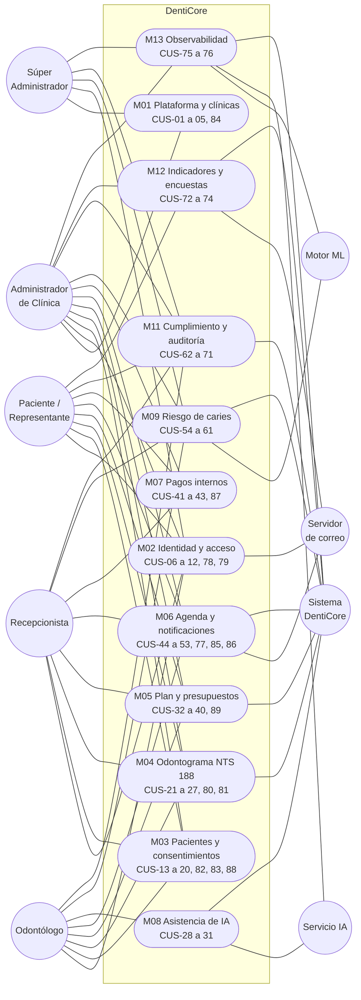
```mermaid
flowchart LR
    SA(("Súper<br/>Administrador"))
    CA(("Administrador<br/>de Clínica"))
    OD(("Odontólogo"))
    RE(("Recepcionista"))
    PA(("Paciente /<br/>Representante"))
    ML(("Motor ML"))
    IA(("Servicio IA"))
    SIS(("Sistema<br/>DentiCore"))
    MAIL(("Servidor<br/>de correo"))

    subgraph DC["DentiCore"]
        M01(["M01 Plataforma y clínicas<br/>CUS-01 a 05, 84"])
        M02(["M02 Identidad y acceso<br/>CUS-06 a 12, 78, 79"])
        M03(["M03 Pacientes y consentimientos<br/>CUS-13 a 20, 82, 83, 88"])
        M04(["M04 Odontograma NTS 188<br/>CUS-21 a 27, 80, 81"])
        M08(["M08 Asistencia de IA<br/>CUS-28 a 31"])
        M05(["M05 Plan y presupuestos<br/>CUS-32 a 40, 89"])
        M07(["M07 Pagos internos<br/>CUS-41 a 43, 87"])
        M06(["M06 Agenda y notificaciones<br/>CUS-44 a 53, 77, 85, 86"])
        M09(["M09 Riesgo de caries<br/>CUS-54 a 61"])
        M11(["M11 Cumplimiento y auditoría<br/>CUS-62 a 71"])
        M12(["M12 Indicadores y encuestas<br/>CUS-72 a 74"])
        M13(["M13 Observabilidad<br/>CUS-75 a 76"])
    end

    SA --- M01 & M02 & M09 & M11 & M13
    CA --- M01 & M02 & M03 & M04 & M05 & M06 & M07 & M09 & M11 & M12 & M13
    OD --- M02 & M03 & M04 & M05 & M06 & M08 & M09 & M11
    RE --- M02 & M03 & M04 & M05 & M06 & M07 & M09 & M11
    PA --- M02 & M03 & M04 & M05 & M06 & M07 & M11 & M12
    M08 --- IA
    M09 --- ML
    M13 --- ML & IA
    M06 --- MAIL
    M12 --- MAIL
    M02 --- MAIL
    M04 & M05 & M06 & M08 & M09 & M11 & M12 & M13 --- SIS
```

### 10.2 Plataforma, acceso, cumplimiento y observabilidad (M01, M02, M11, M13)

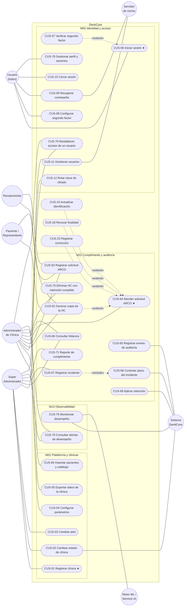
```mermaid
flowchart LR
    SA(("Súper<br/>Administrador"))
    CA(("Administrador<br/>de Clínica"))
    USR(("Usuario<br/>(todos)"))
    PA(("Paciente /<br/>Representante"))
    RE(("Recepcionista"))

    subgraph DC["DentiCore"]
        direction TB
        subgraph M01["M01 Plataforma y clínicas"]
            C01(["CUS-01 Registrar clínica ★"])
            C02(["CUS-02 Cambiar estado de clínica"])
            C03(["CUS-03 Cambiar plan"])
            C04(["CUS-04 Configurar parámetros"])
            C05(["CUS-05 Exportar datos de la clínica"])
            C84(["CUS-84 Importar pacientes y catálogo"])
        end
        subgraph M02["M02 Identidad y acceso"]
            C06(["CUS-06 Iniciar sesión ★"])
            C07(["CUS-07 Verificar segundo factor"])
            C08(["CUS-08 Configurar segundo factor"])
            C09(["CUS-09 Recuperar contraseña"])
            C10(["CUS-10 Cerrar sesión"])
            C11(["CUS-11 Gestionar usuarios"])
            C12(["CUS-12 Rotar clave de cifrado"])
            C78(["CUS-78 Gestionar perfil y sesiones"])
            C79(["CUS-79 Restablecer acceso de un usuario"])
        end
        subgraph M11["M11 Cumplimiento y auditoría"]
            C62(["CUS-62 Generar copia de la HC"])
            C63(["CUS-63 Registrar solicitud ARCO"])
            C64(["CUS-64 Atender solicitud ARCO ★"])
            C65(["CUS-65 Registrar evento de auditoría"])
            C66(["CUS-66 Consultar bitácora"])
            C67(["CUS-67 Registrar incidente"])
            C68(["CUS-68 Controlar plazo del incidente"])
            C69(["CUS-69 Aplicar retención"])
            C70(["CUS-70 Eliminar HC con retención cumplida"])
            C71(["CUS-71 Reporte de cumplimiento"])
        end
        subgraph M13["M13 Observabilidad"]
            C75(["CUS-75 Monitorear desempeño"])
            C76(["CUS-76 Consultar alertas de desempeño"])
        end
        X15(["CUS-15 Actualizar identificación"])
        X18(["CUS-18 Revocar finalidad"])
        X23(["CUS-23 Registrar corrección"])
    end

    SIS(("Sistema<br/>DentiCore"))
    MAIL(("Servidor<br/>de correo"))
    EXT(("Motor ML /<br/>Servicio IA"))

    SA --- C01 & C02 & C03 & C12 & C66 & C67 & C71 & C76
    CA --- C04 & C05 & C11 & C62 & C63 & C64 & C66 & C70 & C76
    USR --- C06 & C08 & C09 & C10
    PA --- C62 & C63
    RE --- C62 & C63
    CA --- C84 & C79
    SA --- C79
    USR --- C78
    C02 & C65 & C68 & C69 & C75 --- SIS
    C09 & C11 --- MAIL
    C75 --- EXT

    C07 -. "«extend»" .-> C06
    C67 -. "«include»" .-> C68
    C62 -. "«extend»" .-> C64
    X15 -. "«extend»" .-> C64
    X23 -. "«extend»" .-> C64
    X18 -. "«extend»" .-> C64

    classDef externo stroke-dasharray: 5 5
    class X15,X18,X23 externo
```

### 10.3 Pacientes, odontograma e IA (M03, M04, M08)

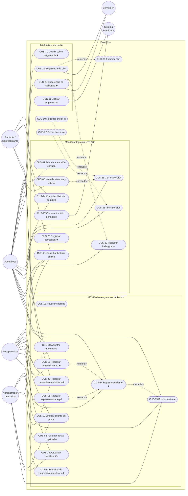
```mermaid
flowchart LR
    RE(("Recepcionista"))
    CA(("Administrador<br/>de Clínica"))
    OD(("Odontólogo"))
    PA(("Paciente /<br/>Representante"))

    subgraph DC["DentiCore"]
        direction TB
        subgraph M03["M03 Pacientes y consentimientos"]
            C13(["CUS-13 Buscar paciente"])
            C14(["CUS-14 Registrar paciente ★"])
            C15(["CUS-15 Actualizar identificación"])
            C16(["CUS-16 Registrar representante legal"])
            C17(["CUS-17 Registrar consentimiento ★"])
            C18(["CUS-18 Revocar finalidad"])
            C19(["CUS-19 Vincular cuenta de portal"])
            C20(["CUS-20 Adjuntar documento"])
            C82(["CUS-82 Plantillas de consentimiento informado"])
            C83(["CUS-83 Registrar consentimiento informado"])
            C88(["CUS-88 Fusionar fichas duplicadas"])
        end
        subgraph M04["M04 Odontograma NTS 188"]
            C21(["CUS-21 Consultar historia clínica"])
            C22(["CUS-22 Registrar hallazgos ★"])
            C23(["CUS-23 Registrar corrección ★"])
            C24(["CUS-24 Consultar historial de pieza"])
            C25(["CUS-25 Abrir atención"])
            C26(["CUS-26 Cerrar atención"])
            C27(["CUS-27 Cierre automático pendiente"])
            C80(["CUS-80 Nota de atención y CIE-10"])
            C81(["CUS-81 Adenda a atención cerrada"])
        end
        subgraph M08["M08 Asistencia de IA"]
            C28(["CUS-28 Sugerencia de hallazgos ★"])
            C29(["CUS-29 Sugerencia de plan"])
            C30(["CUS-30 Decidir sobre sugerencia ★"])
            C31(["CUS-31 Expirar sugerencias"])
        end
        X33(["CUS-33 Elaborar plan"])
        X50(["CUS-50 Registrar check-in"])
        X72(["CUS-72 Enviar encuesta"])
    end

    IA(("Servicio IA"))
    SIS(("Sistema<br/>DentiCore"))

    RE --- C13 & C14 & C15 & C16 & C17 & C19 & C20 & C21
    CA --- C13 & C15 & C19 & C21
    OD --- C13 & C14 & C20 & C21 & C22 & C23 & C24 & C25 & C26 & C28 & C29 & C30
    PA --- C17 & C18 & C21 & C24
    OD --- C80 & C81 & C83
    CA --- C82 & C83 & C88
    RE --- C83
    C80 -. "«precede»" .-> C26
    C28 & C29 --- IA
    C27 & C31 --- SIS

    C14 -. "«include»" .-> C13
    C16 -. "«extend»" .-> C14
    C17 -. "«extend»" .-> C14
    X50 -. "«include»" .-> C25
    C28 -. "«extend»" .-> C22
    C29 -. "«extend»" .-> X33
    X72 -. "«extend»" .-> C26

    classDef externo stroke-dasharray: 5 5
    class X33,X50,X72 externo
```

### 10.4 Plan de tratamiento, presupuesto y pagos (M05, M07)

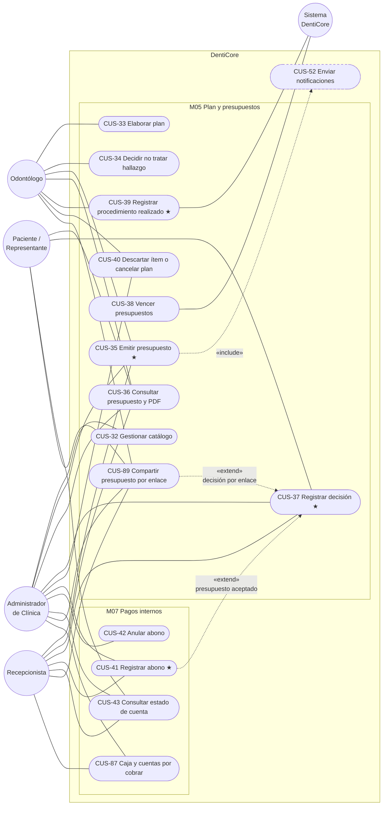
```mermaid
flowchart LR
    CA(("Administrador<br/>de Clínica"))
    OD(("Odontólogo"))
    RE(("Recepcionista"))
    PA(("Paciente /<br/>Representante"))

    subgraph DC["DentiCore"]
        direction TB
        subgraph M05["M05 Plan y presupuestos"]
            C32(["CUS-32 Gestionar catálogo"])
            C33(["CUS-33 Elaborar plan"])
            C34(["CUS-34 Decidir no tratar hallazgo"])
            C35(["CUS-35 Emitir presupuesto ★"])
            C36(["CUS-36 Consultar presupuesto y PDF"])
            C37(["CUS-37 Registrar decisión ★"])
            C38(["CUS-38 Vencer presupuestos"])
            C39(["CUS-39 Registrar procedimiento realizado ★"])
            C40(["CUS-40 Descartar ítem o cancelar plan"])
            C89(["CUS-89 Compartir presupuesto por enlace"])
        end
        subgraph M07["M07 Pagos internos"]
            C41(["CUS-41 Registrar abono ★"])
            C42(["CUS-42 Anular abono"])
            C43(["CUS-43 Consultar estado de cuenta"])
            C87(["CUS-87 Caja y cuentas por cobrar"])
        end
        X52(["CUS-52 Enviar notificaciones"])
    end

    SIS(("Sistema<br/>DentiCore"))

    OD --- C33 & C34 & C35 & C36 & C39 & C40
    RE --- C35 & C36 & C37 & C41 & C43
    CA --- C32 & C35 & C36 & C37 & C40 & C41 & C42 & C43
    PA --- C36 & C37 & C43
    RE --- C89 & C87
    CA --- C89 & C87
    OD --- C89
    PA --- C89
    C89 -. "«extend»<br/>decisión por enlace" .-> C37
    C38 & C39 --- SIS

    C35 -. "«include»" .-> X52
    C41 -. "«extend»<br/>presupuesto aceptado" .-> C37

    classDef externo stroke-dasharray: 5 5
    class X52 externo
```

### 10.5 Agenda y notificaciones (M06)

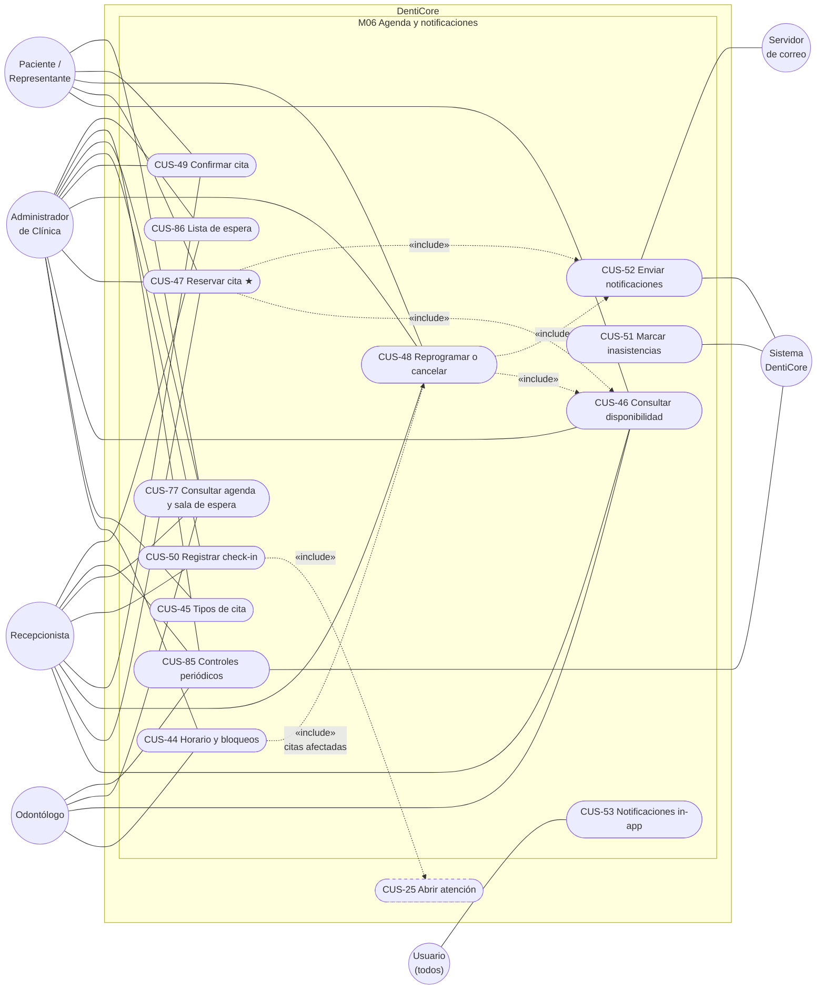
```mermaid
flowchart LR
    CA(("Administrador<br/>de Clínica"))
    OD(("Odontólogo"))
    RE(("Recepcionista"))
    PA(("Paciente /<br/>Representante"))
    USR(("Usuario<br/>(todos)"))

    subgraph DC["DentiCore"]
        direction TB
        subgraph M06["M06 Agenda y notificaciones"]
            C44(["CUS-44 Horario y bloqueos"])
            C45(["CUS-45 Tipos de cita"])
            C46(["CUS-46 Consultar disponibilidad"])
            C47(["CUS-47 Reservar cita ★"])
            C48(["CUS-48 Reprogramar o cancelar"])
            C49(["CUS-49 Confirmar cita"])
            C50(["CUS-50 Registrar check-in"])
            C51(["CUS-51 Marcar inasistencias"])
            C52(["CUS-52 Enviar notificaciones"])
            C53(["CUS-53 Notificaciones in-app"])
            C77(["CUS-77 Consultar agenda y sala de espera"])
            C85(["CUS-85 Controles periódicos"])
            C86(["CUS-86 Lista de espera"])
        end
        X25(["CUS-25 Abrir atención"])
    end

    SIS(("Sistema<br/>DentiCore"))
    MAIL(("Servidor<br/>de correo"))

    CA --- C44 & C45 & C46 & C47 & C48 & C49 & C50
    OD --- C44 & C46
    RE --- C46 & C47 & C48 & C49 & C50
    PA --- C46 & C47 & C48 & C49
    USR --- C53
    RE --- C77 & C85 & C86
    CA --- C77 & C85 & C86
    OD --- C77 & C85
    PA --- C77
    C85 --- SIS
    C44 -. "«include»<br/>citas afectadas" .-> C48
    C51 & C52 --- SIS
    C52 --- MAIL

    C47 -. "«include»" .-> C46
    C47 -. "«include»" .-> C52
    C48 -. "«include»" .-> C46
    C48 -. "«include»" .-> C52
    C50 -. "«include»" .-> X25

    classDef externo stroke-dasharray: 5 5
    class X25 externo
```

### 10.6 Riesgo de caries, indicadores y encuestas (M09, M12)

```mermaid
flowchart LR
    OD(("Odontólogo"))
    RE(("Recepcionista"))
    CA(("Administrador<br/>de Clínica"))
    SA(("Súper<br/>Administrador"))
    PA(("Paciente /<br/>Representante"))

    subgraph DC["DentiCore"]
        direction TB
        subgraph M09["M09 Predicción de riesgo de caries"]
            C54(["CUS-54 Registrar variables de riesgo"])
            C55(["CUS-55 Calcular riesgo de caries ★"])
            C56(["CUS-56 Presentar explicación"])
            C57(["CUS-57 Generar alerta de riesgo alto"])
            C58(["CUS-58 Reconocer alerta"])
            C59(["CUS-59 Registrar seguimiento clínico"])
            C60(["CUS-60 Distribución del riesgo"])
            C61(["CUS-61 Publicar versión del modelo"])
        end
        subgraph M12["M12 Indicadores y encuestas"]
            C72(["CUS-72 Enviar encuesta"])
            C73(["CUS-73 Responder encuesta"])
            C74(["CUS-74 Panel de indicadores"])
        end
        X33(["CUS-33 Elaborar plan"])
        X47(["CUS-47 Reservar cita"])
    end

    ML(("Motor ML"))
    SIS(("Sistema<br/>DentiCore"))
    MAIL(("Servidor<br/>de correo"))

    OD --- C54 & C55 & C56 & C58 & C59
    RE --- C54
    CA --- C56 & C60 & C74
    SA --- C61
    PA --- C73
    C55 & C61 --- ML
    C57 & C72 --- SIS
    C72 --- MAIL

    C55 -. "«include»" .-> C56
    C57 -. "«extend»<br/>nivel = alto" .-> C55
    X33 -. "«extend»<br/>plan preventivo" .-> C58
    X47 -. "«extend»<br/>cita de control" .-> C58

    classDef externo stroke-dasharray: 5 5
    class X33,X47 externo
```

---

## 11. Especificación de casos de uso críticos

Esta sección especifica los 15 casos de uso marcados con ★ en §9.2. Se consideran críticos porque implementan un diferenciador del producto, una obligación legal o una regla de integridad cuyo incumplimiento no se puede revertir (aislamiento, inmutabilidad, cálculo económico o consentimiento). Los demás CUS se especifican directamente como requisitos funcionales en §12 (Fase 6).

### 11.0 Plantilla y convenciones

| Elemento | Contenido |
| :-- | :-- |
| Encabezado | Módulo, prioridad, actores, origen (CUN y NN) y reglas de negocio aplicadas. |
| Disparador | Evento que inicia el caso. |
| Precondiciones | Condiciones que deben cumplirse antes del paso 1. Si no se cumplen, el caso no se inicia. |
| Flujo principal | Pasos numerados. **A** = acción del actor; **S** = respuesta del sistema. |
| Flujos alternativos (FA) | Caminos válidos distintos del principal. Indican el paso donde se bifurcan y dónde se reincorporan. |
| Flujos de excepción (FE) | Errores o condiciones que impiden el resultado. Indican el código HTTP de la API (DD-19) y el estado resultante. |
| Postcondiciones | Estado garantizado al terminar con éxito y, cuando aplica, ante un fallo. |
| Datos | Campos de entrada con sus validaciones. |
| Criterios de aceptación | Escenarios Dado / Cuando / Entonces verificables por prueba automatizada. Identificador `CA-<CUS>.<n>`. |

**Convenciones comunes a todos los casos.**
- Toda operación se ejecuta en el contexto de la clínica del usuario autenticado (RN-01, RN-02). Un recurso de otra clínica responde **404** (RN-03).
- Un actor sin permiso según §9.3 recibe **403** (RN-06).
- Un error de validación responde **422** con la lista de campos y mensajes en español, en formato `application/problem+json`.
- En una clínica `suspendida`, toda operación de escritura responde **403** con el motivo "Clínica suspendida: solo lectura" (RN-07).
- Toda escritura se ejecuta en una transacción de base de datos: o se aplican todos sus efectos o ninguno.
- Toda operación sobre datos personales o clínicos incluye CUS-65 (RN-67).
- Las fechas y horas se registran con la hora del servidor en UTC y se presentan en la zona horaria de la clínica.

---

### 11.1 CUS-01 — Registrar clínica

| Campo | Valor |
| :-- | :-- |
| Módulo / Prioridad | M01 · Must |
| Actor principal | Súper Administrador |
| Actores secundarios | Servidor de correo |
| Origen | CUN-01 · NN-11 |
| Reglas | RN-01, RN-04, RN-05, DD-03, DD-16, DD-17, DD-22 |

**Disparador.** Se firmó el contrato con una clínica nueva.

**Precondiciones.**
1. El Súper Administrador está autenticado con segundo factor verificado.

**Flujo principal.**
1. **A** Selecciona "Registrar clínica".
2. **S** Presenta el formulario con los planes disponibles y sus límites.
3. **A** Ingresa los datos de la clínica y de su primer Administrador de Clínica, y confirma.
4. **S** Valida los datos (ver *Datos*).
5. **S** En una sola transacción crea:
   - la clínica en estado `activa`, con el plan elegido;
   - su configuración con los valores por defecto: precios con IGV incluido, tope de descuento 10 %, vigencia de presupuesto 30 días, cancelación desde el portal hasta 24 h antes, IA desactivada, zona horaria `America/Lima`;
   - su clave de cifrado versión 1, cifrada con la clave maestra;
   - el usuario Administrador de Clínica en estado `pendiente_activacion`, marcado como Oficial de Datos Personales.
6. **S** Envía al administrador un correo de invitación con un enlace de activación de un solo uso válido 72 horas.
7. **S** Muestra la clínica creada, su código de acceso y la dirección del portal de la clínica.

**Flujos alternativos.**
- **FA-1 Reenviar invitación** (desde el paso 7 o en cualquier momento posterior): el Súper Administrador solicita reenviar la invitación de un administrador en `pendiente_activacion`. El sistema invalida el enlace anterior y envía uno nuevo válido 72 horas.
- **FA-2 Activación de la cuenta** (fuera de este caso, por el administrador invitado): abre el enlace, define su contraseña según DD-15, configura el segundo factor (CUS-08) y queda `activo`.

**Flujos de excepción.**
- **FE-1 Código de acceso duplicado o inválido** (paso 4): **422**. No se crea nada.
- **FE-2 Datos del administrador inválidos** (paso 4): **422**. No se crea nada.
- **FE-3 Fallo al generar o cifrar la clave** (paso 5): se revierte la transacción completa; **500**. No queda ninguna clínica parcial.
- **FE-4 Fallo del envío de correo** (paso 6): la clínica queda creada; el correo se reintenta según DD-10. Si los 3 reintentos fallan, el sistema lo indica y el Súper Administrador puede usar FA-1.
- **FE-5 Enlace vencido o ya usado** (FA-2): el enlace responde "Invitación vencida"; se requiere FA-1.

**Postcondiciones.**
- Éxito: existe una clínica `activa` con configuración por defecto, una clave de cifrado activa y un administrador pendiente de activación. Ningún dato de la clínica es visible desde otra clínica.
- Fallo: no existe ningún registro parcial.

**Datos.**

| Campo | Obligatorio | Validación |
| :-- | :-: | :-- |
| Nombre comercial | Sí | 3–150 caracteres. |
| Razón social | Sí | 3–200 caracteres. |
| RUC | Sí | 11 dígitos numéricos que comienzan en 10 o 20; dígito verificador válido (módulo 11); único en la plataforma. |
| Código de acceso | Sí | 3–50 caracteres `[a-z0-9-]`, sin guion al inicio ni al final; único en la plataforma; no modificable después. |
| Dirección | Sí | 5–200 caracteres. |
| Plan | Sí | `basic`, `pro` o `enterprise`. |
| Nombre del administrador | Sí | 3–150 caracteres. |
| Correo del administrador | Sí | Formato RFC 5322; máximo 180 caracteres. |

**Criterios de aceptación.**
- **CA-01.1** Dado un Súper Administrador autenticado, cuando registra una clínica con datos válidos, entonces se crean la clínica `activa`, su configuración por defecto, su clave versión 1 y un administrador `pendiente_activacion`, y se encola un correo de invitación.
- **CA-01.2** Dado un código de acceso ya existente, cuando se intenta registrar otra clínica con él, entonces la respuesta es 422 y el número de clínicas no cambia.
- **CA-01.3** Dado un fallo simulado al crear la clave de cifrado, cuando se registra una clínica, entonces no existe la clínica ni su administrador.
- **CA-01.4** Dado un usuario con rol distinto de `super_admin`, cuando invoca el registro de clínica, entonces la respuesta es 403.
- **CA-01.5** Dado un enlace de activación emitido hace más de 72 horas, cuando el administrador lo abre, entonces no puede definir su contraseña.

---

### 11.2 CUS-06 — Iniciar sesión

| Campo | Valor |
| :-- | :-- |
| Módulo / Prioridad | M02 · Must |
| Actor principal | Usuario (todos los roles) |
| Actores secundarios | — |
| Origen | CUN-02 · NN-11, NN-12 |
| Reglas | RN-01, RN-02, RN-05, RN-07, RN-67, DD-03, DD-15, DD-19, DD-29 |

**Disparador.** El usuario abre la aplicación sin una sesión vigente.

**Precondiciones.** Ninguna.

**Flujo principal.**
1. **A** Accede a la dirección de su clínica (el código de acceso va en la URL, DD-29) o a la dirección de administración de la plataforma (Súper Administrador).
2. **S** Presenta el formulario con el nombre de la clínica o, en la dirección de plataforma, sin clínica.
3. **A** Ingresa correo y contraseña.
4. **S** Verifica que la IP no superó 5 intentos en el último minuto.
5. **S** Resuelve la clínica por su código y verifica su estado (FA-2, FE-4).
6. **S** Busca al usuario por correo dentro de esa clínica (o entre los súper administradores) y verifica que esté `activo` y no `bloqueado_temporal`.
7. **S** Verifica la contraseña contra su hash bcrypt.
8. **S** Pone en cero el contador de intentos fallidos del usuario.
9. **S** Si el rol exige segundo factor o el usuario lo activó, ejecuta CUS-07 (extensión). Si el rol lo exige y el usuario aún no lo configuró, lo dirige a CUS-08 antes de permitir cualquier otra acción.
10. **S** Emite un token de acceso con vencimiento por inactividad: 30 minutos para el personal y 15 minutos para el portal (DD-15).
11. **S** Registra el inicio de sesión exitoso en la auditoría.
12. **S** Devuelve el perfil: nombre, rol, clínica, funciones habilitadas por el plan y, para pacientes, los UUID de su ficha y de las fichas que representa.

**Flujos alternativos.**
- **FA-1 Súper Administrador** (paso 5): no hay clínica que resolver; el paso 6 busca solo entre usuarios sin clínica.
- **FA-2 Clínica suspendida** (paso 5): el inicio de sesión continúa; el perfil indica "solo lectura" (RN-07).
- **FA-3 Clínica cancelada, dentro de 90 días** (paso 5): solo un Administrador de Clínica puede continuar, con acceso exclusivo a CUS-05.

**Flujos de excepción.**
- **FE-1 Credenciales inválidas, usuario inexistente o inactivo** (pasos 6–7): **401** con el mensaje único "Credenciales inválidas", sin indicar cuál dato falló. Si el usuario existe, su contador de intentos aumenta en 1.
- **FE-2 Quinto intento fallido consecutivo** (paso 7): el usuario pasa a `bloqueado_temporal` durante 15 minutos; la respuesta sigue siendo "Credenciales inválidas". Se registra en la auditoría.
- **FE-3 Límite por IP** (paso 4): **429** con el encabezado `Retry-After`.
- **FE-4 Clínica inexistente, eliminada o cancelada y el usuario no es su administrador** (paso 5): **401** "Credenciales inválidas".
- **FE-5 Segundo factor incorrecto** (paso 9): ver CUS-07; cuenta como intento fallido.

**Postcondiciones.**
- Éxito: el usuario tiene un token vigente limitado a su clínica y su rol. La auditoría registra el inicio.
- Fallo: no se emite token; el intento fallido queda en la auditoría.

**Datos.**

| Campo | Obligatorio | Validación |
| :-- | :-: | :-- |
| Código de acceso | Sí, salvo Súper Administrador | Tomado de la URL. |
| Correo | Sí | Formato RFC 5322. |
| Contraseña | Sí | 1–128 caracteres (la política de longitud mínima se aplica al definirla, no al iniciar sesión). |

**Criterios de aceptación.**
- **CA-06.1** Dados dos usuarios con el mismo correo en dos clínicas distintas, cuando cada uno inicia sesión con el código de su clínica, entonces cada token solo da acceso a los datos de su propia clínica.
- **CA-06.2** Dado un usuario activo, cuando falla la contraseña 5 veces seguidas, entonces el sexto intento con la contraseña correcta dentro de los 15 minutos siguientes es rechazado.
- **CA-06.3** Dado un correo inexistente y una contraseña incorrecta de un usuario existente, cuando se intentan, entonces ambas respuestas tienen el mismo código y el mismo mensaje.
- **CA-06.4** Dado un Administrador de Clínica sin segundo factor configurado, cuando inicia sesión, entonces solo puede acceder a la configuración del segundo factor.
- **CA-06.5** Dado un token del personal sin actividad durante 30 minutos, cuando se usa, entonces la respuesta es 401.
- **CA-06.6** Dada una clínica suspendida, cuando un odontólogo inicia sesión e intenta registrar un hallazgo, entonces la respuesta es 403.

---

### 11.3 CUS-14 — Registrar paciente

| Campo | Valor |
| :-- | :-- |
| Módulo / Prioridad | M03 · Must |
| Actor principal | Recepcionista |
| Actores secundarios | Odontólogo, Administrador de Clínica |
| Origen | CUN-04 · NN-08 |
| Reglas | RN-09, RN-10, RN-12, DD-04, DD-13 |

**Disparador.** Una persona que no tiene ficha en la clínica solicita atención o una cita.

**Precondiciones.**
1. El actor está autenticado y la clínica está `activa`.

**Flujo principal.**
1. **A** Ingresa tipo y número de documento (CUS-13, inclusión).
2. **S** Calcula el índice ciego del documento y busca una ficha existente en la clínica. No la encuentra.
3. **S** Presenta el formulario de registro con el documento ya cargado.
4. **A** Ingresa los datos de identificación y contacto, y confirma.
5. **S** Valida los datos y calcula la edad a la fecha actual.
6. **S** Si el paciente es menor de 18 años, exige el representante legal antes de guardar (FA-2).
7. **S** Cifra documento, teléfono y dirección con la clave de la clínica y guarda la ficha en estado de archivo `activo`.
8. **S** Ofrece registrar el consentimiento en ese momento (FA-3). Hasta que exista uno vigente, la ficha muestra "Sin consentimiento: solo datos de identificación y citas" y los campos clínicos están deshabilitados (RN-10).

**Flujos alternativos.**
- **FA-1 El documento ya existe** (paso 2): el sistema muestra la ficha existente y no permite crear otra. Si la ficha está en archivo `pasivo`, lo indica; pasará a `activo` con la siguiente atención (RN-68).
- **FA-2 Paciente menor de edad** (paso 6): se ejecuta CUS-16 en el mismo flujo para registrar al representante; luego continúa en el paso 7.
- **FA-3 Consentimiento en el mismo registro** (paso 8): se ejecuta CUS-17. Si se otorga la finalidad "atención odontológica", se habilita el registro de antecedentes médicos.

**Flujos de excepción.**
- **FE-1 Datos inválidos** (paso 5): **422**.
- **FE-2 Registro concurrente del mismo documento** (paso 7): la restricción de unicidad rechaza el segundo registro; **422** "El documento ya está registrado"; se muestra la ficha existente.
- **FE-3 Menor sin representante** (paso 6): no se guarda la ficha.

**Postcondiciones.**
- Éxito: existe una única ficha para ese documento en la clínica, con los datos sensibles cifrados, y, si es menor, un representante legal vigente.
- Fallo: no existe ficha parcial.

**Datos.**

| Campo | Obligatorio | Validación |
| :-- | :-: | :-- |
| Tipo de documento | Sí | DNI, carné de extranjería, pasaporte o Carné de Permiso Temporal de Permanencia (CPP). |
| Número de documento | Sí | DNI: 8 dígitos. Carné de extranjería y CPP: 9–12 caracteres alfanuméricos. Pasaporte: 6–12 caracteres alfanuméricos. Se eliminan espacios al inicio y al final y se convierte a mayúsculas. |
| Nombres / Apellidos | Sí | 1–100 caracteres cada uno. |
| Fecha de nacimiento | Sí | No posterior a hoy; edad resultante ≤ 120 años. |
| Sexo | Sí | Femenino o masculino (contenido mínimo de la HC, REF-03). |
| Teléfono | Sí | Celular peruano de 9 dígitos que comienza en 9, o número internacional en formato E.164. |
| Correo | No | RFC 5322; máximo 180 caracteres. Obligatorio si el paciente tendrá cuenta de portal. |
| Dirección | No | 5–200 caracteres. |
| Antecedentes médicos | No | Solo con consentimiento vigente. Estructura: alergias, enfermedades, medicamentos (listas de hasta 30 elementos de ≤ 150 caracteres) y observaciones (≤ 2000 caracteres). |

**Criterios de aceptación.**
- **CA-14.1** Dado un DNI ya registrado en la clínica, cuando se intenta registrar otra ficha con él, entonces se muestra la ficha existente y el número de pacientes no cambia.
- **CA-14.2** Dado el mismo DNI registrado en otra clínica, cuando se registra en la clínica actual, entonces el registro se completa y ninguna de las dos clínicas ve la ficha de la otra.
- **CA-14.3** Dado un paciente registrado, cuando se lee directamente la fila en la base de datos, entonces el documento, el teléfono y la dirección no aparecen en texto plano.
- **CA-14.4** Dada una fecha de nacimiento que da 12 años, cuando se intenta guardar sin representante, entonces la ficha no se guarda.
- **CA-14.5** Dado un paciente sin consentimiento, cuando se intenta guardar antecedentes médicos, entonces la respuesta es 422 con el motivo RN-10.

---

### 11.4 CUS-17 — Registrar consentimiento de datos

| Campo | Valor |
| :-- | :-- |
| Módulo / Prioridad | M03 · Must |
| Actor principal | Recepcionista |
| Actores secundarios | Paciente / Representante (portal), Administrador de Clínica |
| Origen | CUN-04 · NN-12 |
| Reglas | RN-10, RN-11, RN-12, RN-15, DD-14, DD-28 |

**Disparador.** Paciente sin consentimiento vigente, nueva versión del texto o solicitud del titular de otorgar una finalidad adicional.

**Precondiciones.**
1. El paciente existe en la clínica.
2. Si es menor de 18 años, tiene un representante legal vigente.

**Flujo principal.**
1. **A** Selecciona "Registrar consentimiento" en la ficha del paciente.
2. **S** Genera el texto de la versión vigente de la plantilla de plataforma completado con los datos de la clínica (razón social, RUC, dirección, contacto del Oficial de Datos Personales) y del titular (DD-28).
3. **S** Muestra las finalidades con casillas: (a) atención odontológica, obligatoria; (b) notificaciones; (c) asistencia de IA generativa; (d) predicción de riesgo; (e) encuestas. Las casillas opcionales aparecen **sin marcar**. Las finalidades (c) y (d) solo aparecen si el plan las incluye y, para (c), si la clínica activó la IA.
4. **A** El titular (o su representante) lee el texto en el dispositivo de la clínica, marca las finalidades que otorga y confirma escribiendo su número de documento.
5. **S** Verifica que la finalidad (a) esté marcada y que el documento escrito coincida con el del titular o del representante vigente.
6. **S** Registra el consentimiento con: versión, finalidades otorgadas, quién lo otorga (titular o representante), canal (`presencial`), fecha y hora, IP, usuario que asistió y huella SHA-256 del texto presentado.
7. **S** Si había un consentimiento vigente, lo marca `sustituido`.
8. **S** Genera la constancia PDF y la deja disponible para descarga e impresión; si hay correo registrado, la envía.

**Flujos alternativos.**
- **FA-1 Desde el portal** (pasos 1–4): el paciente o representante autenticado revisa y otorga una nueva versión o finalidades adicionales; la confirmación es la propia sesión autenticada más una casilla "He leído y acepto". El canal registrado es `portal`.
- **FA-2 Formulario en papel** (paso 4): si el titular firma el texto impreso, el actor adjunta el documento escaneado (PDF o imagen, ≤ 10 MB) y marca las finalidades tal como figuran firmadas. El canal registrado es `papel`.

**Flujos de excepción.**
- **FE-1 El titular no otorga la finalidad (a)** (paso 5): no se registra consentimiento; la ficha queda solo con identificación y citas (RN-10).
- **FE-2 Documento de confirmación no coincide** (paso 5): **422**; no se registra.
- **FE-3 Menor sin representante vigente** (precondición): no se puede iniciar.

**Postcondiciones.**
- Éxito: el paciente tiene exactamente un consentimiento `vigente`, con la versión actual de la plantilla. Los consentimientos anteriores se conservan como `sustituido`.
- Fallo: el estado del consentimiento del paciente no cambia.

**Criterios de aceptación.**
- **CA-17.1** Dado el formulario de consentimiento, cuando se presenta, entonces todas las finalidades opcionales aparecen sin marcar.
- **CA-17.2** Dado un consentimiento sin la finalidad (a), cuando se confirma, entonces no se registra y el odontograma del paciente sigue bloqueado.
- **CA-17.3** Dado un paciente de 15 años, cuando se registra el consentimiento, entonces queda registrado como otorgado por el representante.
- **CA-17.4** Dado un consentimiento vigente, cuando se registra uno nuevo, entonces el anterior pasa a `sustituido` y sus datos originales no cambian.
- **CA-17.5** Dada una clínica con plan `basic`, cuando se presenta el formulario, entonces no aparecen las finalidades (c) ni (d).

---

### 11.5 CUS-22 — Registrar hallazgos en el odontograma

| Campo | Valor |
| :-- | :-- |
| Módulo / Prioridad | M04 · Must |
| Actor principal | Odontólogo |
| Actores secundarios | — |
| Origen | CUN-05 · NN-03 |
| Reglas | RN-10, RN-16 a RN-22, RN-24, RN-25, DD-05, DD-25 |

**Disparador.** Durante una atención, el odontólogo observa un hallazgo.

**Precondiciones.**
1. El odontólogo está autenticado, tiene número de colegiatura COP registrado (RN-75) y la clínica está `activa`.
2. Existe una atención `abierta` del paciente a cargo de ese odontólogo (CUS-25).
3. El paciente tiene consentimiento vigente con la finalidad "atención odontológica" (RN-10).

**Flujo principal.**
1. **A** Abre el odontograma desde la atención.
2. **S** Determina el modo: **inicial** si el paciente no tiene odontograma inicial cerrado en la clínica; **evolución** en caso contrario (RN-20, RN-21).
3. **S** Presenta el odontograma con la dentición por defecto según la edad (DD-25) y el estado vigente calculado (RN-24). Las entradas corregidas no forman parte del estado vigente.
4. **A** Selecciona una pieza (o un tramo de piezas) y, si el hallazgo es de superficie, una o más superficies.
5. **S** Muestra solo los hallazgos del catálogo aplicables a ese nivel y a esa dentición.
6. **A** Selecciona el hallazgo, su estado (que determina el color) y, opcionalmente, una nota de hasta 500 caracteres. Confirma.
7. **S** Valida pieza (RN-16), hallazgo y estado (RN-17) y superficies (RN-18).
8. **S** Guarda la entrada de tipo `inicial` o `evolucion`, con origen `manual`, autor = usuario autenticado, fecha y hora del servidor y referencia a la atención.
9. **S** Actualiza la presentación del estado vigente y el listado cronológico. El actor puede repetir desde el paso 4.

**Flujos alternativos.**
- **FA-1 Cambio de dentición** (paso 3): el odontólogo cambia la vista a permanente, temporal o mixta; el catálogo del paso 5 se filtra en consecuencia.
- **FA-2 Desde una sugerencia de IA** (paso 4): las entradas se crean mediante CUS-30 con origen `IA` y referencia a la sugerencia; las validaciones del paso 7 son las mismas.
- **FA-3 Hallazgo de tramo** (paso 4): para hallazgos como prótesis fija o aparato de ortodoncia, el odontólogo selecciona la pieza inicial y la final del mismo arco; la entrada registra el rango.

**Flujos de excepción.**
- **FE-1 Pieza, superficie o hallazgo inválidos** (paso 7): **422** con el motivo (por ejemplo, "La superficie oclusal no aplica a incisivos"). No se guarda nada.
- **FE-2 Atención cerrada** (paso 8): **409** "La atención está cerrada; abra una nueva atención".
- **FE-3 Usuario sin rol odontólogo** (cualquier paso): **403** (RN-19).
- **FE-4 Solicitud de modificación o eliminación de una entrada** (cualquier momento): la API no ofrece esas operaciones; si se intentan directamente sobre la base de datos, la restricción lo impide (RN-22). El camino válido es CUS-23.

**Postcondiciones.**
- Éxito: cada hallazgo confirmado es una entrada inmutable nueva; ninguna entrada anterior cambia; el estado vigente refleja la nueva entrada.
- Registros simultáneos de dos sesiones sobre el mismo paciente se conservan ambos, ordenados por la hora de registro del servidor.

**Criterios de aceptación.**
- **CA-22.1** Dado un paciente con 3 entradas, cuando se registra un hallazgo, entonces existen 4 entradas y las 3 anteriores son idénticas a su estado previo.
- **CA-22.2** Dado un odontograma inicial cerrado, cuando se registra un hallazgo, entonces la entrada es de tipo `evolucion`.
- **CA-22.3** Dada la pieza 19 o la superficie oclusal en la pieza 11, cuando se registra, entonces la respuesta es 422.
- **CA-22.4** Dado un usuario recepcionista, cuando intenta registrar un hallazgo, entonces la respuesta es 403.
- **CA-22.5** Dada una sentencia `UPDATE` o `DELETE` ejecutada directamente sobre una entrada, entonces la base de datos la rechaza.
- **CA-22.6** Dado un paciente sin consentimiento vigente, cuando se intenta registrar un hallazgo, entonces la respuesta es 422 con el motivo RN-10.

---

### 11.6 CUS-23 — Registrar corrección de un hallazgo

| Campo | Valor |
| :-- | :-- |
| Módulo / Prioridad | M04 · Must |
| Actor principal | Odontólogo |
| Actores secundarios | — |
| Origen | CUN-05, CUN-13 · NN-03 |
| Reglas | RN-16 a RN-19, RN-22, RN-23, RN-24 |

**Disparador.** Un odontólogo detecta un error en una entrada o atiende una rectificación de datos clínicos (CUS-64).

**Precondiciones.**
1. El odontólogo está autenticado y la clínica está `activa`.
2. La entrada a corregir existe y no ha sido corregida antes.

**Flujo principal.**
1. **A** Selecciona la entrada en el historial y elige "Corregir".
2. **S** Muestra el detalle de la entrada: pieza, superficies, hallazgo, estado, autor, fecha y origen.
3. **A** Elige el tipo de corrección: **anulación** (la entrada no debió registrarse) o **reemplazo** (se registra el dato correcto). Si es reemplazo, ingresa los datos correctos. Ingresa el motivo y confirma.
4. **S** Valida el motivo y, si es reemplazo, los nuevos datos con las mismas reglas de CUS-22 (RN-16 a RN-18).
5. **S** Guarda una entrada de tipo `correccion` que referencia a la corregida, con autor, fecha, motivo y, si corresponde, los datos de reemplazo.
6. **S** Recalcula el estado vigente excluyendo la entrada corregida (e incluyendo el reemplazo).
7. **S** Muestra la entrada original tachada con la etiqueta "Corregida", un enlace a su corrección, y la corrección con su motivo.

**Flujos alternativos.**
- **FA-1 Corrección de una corrección** (paso 1): si la corrección también es errónea, se corrige ella misma; la cadena completa se conserva.
- **FA-2 Entrada de origen `procedimiento`** (paso 2): el sistema advierte que la corrección solo afecta al odontograma y no al procedimiento realizado ni al avance del plan.
- **FA-3 Entrada de otro odontólogo** (paso 2): se permite; el sistema muestra "Corrige una entrada registrada por <nombre>" y ambos autores quedan registrados.

**Flujos de excepción.**
- **FE-1 Motivo con menos de 10 caracteres** (paso 4): **422**.
- **FE-2 La entrada ya fue corregida** (paso 5): **409** "Esta entrada ya tiene una corrección; corrija la corrección".
- **FE-3 Datos de reemplazo inválidos** (paso 4): **422**; no se guarda nada.

**Postcondiciones.**
- Éxito: la entrada original sigue existiendo sin cambios; existe una corrección que la referencia; el estado vigente ya no la considera.

**Datos.**

| Campo | Obligatorio | Validación |
| :-- | :-: | :-- |
| Tipo | Sí | Anulación o reemplazo. |
| Motivo | Sí | 10–500 caracteres. |
| Datos de reemplazo | Solo en reemplazo | Mismas validaciones que CUS-22. |

**Criterios de aceptación.**
- **CA-23.1** Dada una entrada corregida, cuando se consulta el historial, entonces la entrada original aparece con sus datos originales y marcada como corregida.
- **CA-23.2** Dada una anulación, cuando se calcula el estado vigente, entonces la entrada anulada no influye en él.
- **CA-23.3** Dada una entrada ya corregida, cuando se intenta corregirla otra vez, entonces la respuesta es 409.
- **CA-23.4** Dado un motivo de 9 caracteres, cuando se confirma, entonces la respuesta es 422.

---

### 11.7 CUS-28 — Obtener sugerencia de hallazgos por IA

| Campo | Valor |
| :-- | :-- |
| Módulo / Prioridad | M08 · Should |
| Actor principal | Odontólogo |
| Actores secundarios | Servicio de IA generativa |
| Origen | CUN-05 · NN-10, NN-16 |
| Reglas | RN-53, RN-54, RN-56, RN-57, DD-11 |

**Disparador.** El odontólogo quiere convertir su nota clínica en hallazgos estructurados.

**Precondiciones.**
1. Se cumplen las precondiciones de CUS-22.
2. La IA está disponible para el paciente (RN-53): plan, activación de la clínica y finalidad (c) otorgada.

**Flujo principal.**
1. **A** Redacta o pega la nota clínica en la atención y selecciona "Sugerir hallazgos".
2. **S** Guarda la nota clínica en la atención.
3. **S** Seudonimiza la nota (RN-54): reemplaza por marcadores los nombres del paciente y de su representante, números de documento, teléfonos, correos, direcciones y fechas de nacimiento.
4. **S** Envía al proveedor configurado: la nota seudonimizada, la edad en años, la dentición y el esquema de salida con los códigos del catálogo NTS 188 permitidos. Espera como máximo 15 segundos, mostrando un indicador de progreso con opción de cancelar.
5. **S** Recibe una lista de elementos: pieza, superficies, código de hallazgo, estado y el fragmento de la nota que lo sustenta.
6. **S** Valida cada elemento (RN-56) y los separa en válidos y descartados con su motivo.
7. **S** Guarda la sugerencia en estado `pendiente` con la nota seudonimizada enviada, los elementos válidos, los descartados, el proveedor, el modelo y el tiempo de respuesta.
8. **S** Presenta los elementos válidos junto al odontograma, cada uno con su fragmento de nota, y los descartados en una sección aparte. El caso continúa en CUS-30.

**Flujos alternativos.**
- **FA-1 Algunos elementos descartados** (paso 6): se presentan con su motivo (por ejemplo, "pieza 19 inexistente"); no pueden aceptarse.

**Flujos de excepción.**
- **FE-1 IA no disponible para el paciente** (precondición 2): la opción "Sugerir hallazgos" no se muestra; si se invoca por la API, **403** con la condición que falta.
- **FE-2 Error del proveedor, respuesta que no cumple el esquema o tiempo mayor de 15 s** (pasos 4–5): la sugerencia se guarda como `fallida` con el motivo; se muestra "Sugerencia no disponible. Continúe con el registro manual." La atención no se interrumpe (RN-57).
- **FE-3 Ningún elemento válido** (paso 6): la sugerencia queda `fallida` con el motivo "sin elementos válidos".
- **FE-4 El odontólogo cancela la espera** (paso 4): la sugerencia queda `fallida` con el motivo "cancelada por el usuario"; una respuesta tardía se descarta.
- **FE-5 Nota vacía o con menos de 20 caracteres** (paso 1): **422**.

**Postcondiciones.**
- Éxito: existe una sugerencia `pendiente` sin efecto sobre el odontograma.
- Fallo: existe una sugerencia `fallida`; el odontograma no cambió y el odontólogo puede registrar manualmente.
- En ningún caso se envía al proveedor un dato identificativo de la lista de RN-54.

**Criterios de aceptación.**
- **CA-28.1** Dada una nota que contiene el nombre y el DNI del paciente, cuando se envía al proveedor, entonces el texto enviado no contiene ni el nombre ni el DNI.
- **CA-28.2** Dado un proveedor simulado que responde en 16 s, cuando se solicita la sugerencia, entonces queda `fallida` y el odontólogo puede registrar hallazgos manualmente.
- **CA-28.3** Dada una respuesta con la pieza 19, cuando se valida, entonces ese elemento aparece como descartado y los demás como válidos.
- **CA-28.4** Dada una sugerencia `pendiente`, cuando se consulta el odontograma, entonces no contiene ninguna entrada de origen `IA` derivada de ella.
- **CA-28.5** Dado un paciente que no otorgó la finalidad (c), cuando se solicita la sugerencia, entonces la respuesta es 403 y no se llama al proveedor.

---

### 11.8 CUS-30 — Decidir sobre una sugerencia de IA

| Campo | Valor |
| :-- | :-- |
| Módulo / Prioridad | M08 · Should |
| Actor principal | Odontólogo |
| Actores secundarios | — |
| Origen | CUN-05, CUN-07 · NN-10 |
| Reglas | RN-17, RN-26, RN-55, RN-56 |

**Disparador.** Existe una sugerencia `pendiente` de hallazgos (CUS-28) o de plan (CUS-29).

**Precondiciones.**
1. La sugerencia está `pendiente` (no han pasado 24 horas desde su creación).
2. Para sugerencias de hallazgos, la atención de origen sigue `abierta`.

**Flujo principal.**
1. **A** Revisa cada elemento válido y marca para cada uno: **aceptar**, **modificar** (edita pieza, superficies, hallazgo, estado o, en planes, procedimiento y cantidad) o **descartar**.
2. **A** Confirma la decisión.
3. **S** Valida los elementos aceptados y modificados con las reglas de CUS-22 (hallazgos) o CUS-33 (plan).
4. **S** Determina el estado de la sugerencia:
   - `aceptada` si todos los elementos se aceptaron sin cambios;
   - `rechazada` si todos se descartaron;
   - `ajustada` en cualquier otro caso.
5. **S** En una sola transacción:
   - para hallazgos: crea una entrada de odontograma por cada elemento aceptado o modificado, con origen `IA` y referencia a la sugerencia;
   - para planes: agrega un ítem `propuesto` al plan en borrador por cada elemento aceptado o modificado;
   - guarda la decisión, el odontólogo, la fecha y, por elemento, la acción tomada y los valores originales y finales.
6. **S** Actualiza el odontograma o el plan en pantalla.

**Flujos alternativos.**
- **FA-1 Rechazo de todos los elementos** (paso 1): el odontólogo selecciona "Rechazar todo"; el sistema continúa en el paso 4 con estado `rechazada`.

**Flujos de excepción.**
- **FE-1 Sugerencia no pendiente** (paso 3): **409** "La sugerencia ya fue decidida o expiró".
- **FE-2 Un elemento modificado es inválido** (paso 3): **422** con el elemento y el motivo; no se aplica ningún elemento.
- **FE-3 Atención cerrada** (precondición 2): solo se permite "Rechazar todo".

**Postcondiciones.**
- Éxito: la sugerencia deja de estar `pendiente`; los elementos aceptados o modificados existen como entradas u ítems con origen `IA`; la decisión por elemento queda disponible para el indicador OB-09.

**Criterios de aceptación.**
- **CA-30.1** Dada una sugerencia de 3 elementos, cuando se aceptan 2 y se descarta 1, entonces el estado es `ajustada` y se crean exactamente 2 entradas con origen `IA`.
- **CA-30.2** Dada una sugerencia con un elemento modificado a la pieza 19, cuando se confirma, entonces la respuesta es 422 y no se crea ninguna entrada.
- **CA-30.3** Dada una sugerencia creada hace 25 horas, cuando se intenta decidir, entonces la respuesta es 409.
- **CA-30.4** Dada una sugerencia rechazada, cuando se consulta, entonces conserva todos sus elementos y la decisión registrada.

---

### 11.9 CUS-35 — Emitir presupuesto

| Campo | Valor |
| :-- | :-- |
| Módulo / Prioridad | M05 · Must |
| Actor principal | Recepcionista |
| Actores secundarios | Odontólogo, Administrador de Clínica |
| Origen | CUN-07 · NN-04, NN-05 |
| Reglas | RN-28 a RN-35, RN-52, DD-07, DD-18, DD-23 |

**Disparador.** Un plan de tratamiento está `propuesto` y el paciente necesita conocer su costo.

**Precondiciones.**
1. El plan está en estado `propuesto` y tiene al menos un ítem `propuesto`.
2. La clínica está `activa`.

**Flujo principal.**
1. **A** Abre el plan y selecciona "Nuevo presupuesto".
2. **S** Crea un presupuesto `borrador` con una línea por cada ítem `propuesto`: descripción, pieza y superficies, cantidad y precio unitario vigente del catálogo.
3. **A** Opcionalmente excluye líneas (debe quedar al menos una) y registra descuentos por línea con su motivo.
4. **S** Recalcula y muestra, por línea, el subtotal (RN-29) y, en total, la suma de subtotales, el descuento total, la base imponible, el IGV y el total (RN-30).
5. **A** Selecciona "Emitir".
6. **S** Si algún precio del catálogo cambió desde que se creó el borrador, muestra las diferencias y pide confirmación.
7. **S** En una sola transacción:
   - verifica que todos los procedimientos estén activos (RN-32);
   - copia el precio vigente en cada línea (RN-33) y recalcula;
   - asigna el número correlativo de la clínica (DD-23);
   - fija la fecha de emisión y la de vencimiento (RN-35);
   - cambia el estado a `emitido`.
8. **S** Si la emisión ocurre dentro de una atención, registra el tiempo de ciclo desde el check-in.
9. **S** Encola la generación del PDF (DD-18) y la notificación al paciente (CUS-52), si otorgó la finalidad "notificaciones".
10. **S** Muestra el presupuesto emitido con el indicador "PDF en generación" hasta que el archivo esté disponible.

**Flujos alternativos.**
- **FA-1 Guardar borrador** (paso 5): el actor guarda el borrador sin emitir; puede retomarlo y editarlo. Un borrador no tiene número ni vencimiento.
- **FA-2 Corregir un presupuesto emitido** (paso 1): desde un presupuesto emitido, el actor selecciona "Corregir"; el sistema crea un borrador con las mismas líneas y una referencia al presupuesto original, que permanece `emitido` hasta que otro presupuesto del plan sea aceptado (RN-37).
- **FA-3 Descuento sobre el tope por el Administrador** (paso 3): el Administrador de Clínica puede registrar descuentos superiores al tope de la clínica.

**Flujos de excepción.**
- **FE-1 Procedimiento inactivo** (paso 7): **422** con la lista de líneas afectadas; no se emite ninguna parte y el borrador se conserva.
- **FE-2 Descuento sobre el tope por Recepcionista u Odontólogo** (paso 3): **403** en esa línea; el resto del borrador no cambia (RN-31).
- **FE-3 Descuento sin motivo** (paso 3): **422**.
- **FE-4 Fallo en la generación del PDF** (paso 9): el presupuesto sigue `emitido`; el PDF se reintenta 3 veces; si falla, se alerta en la observabilidad (CUS-75) y el actor puede solicitar la regeneración.
- **FE-5 Intento de modificar un presupuesto emitido** (cualquier momento): **409** "El presupuesto emitido no se puede modificar; use Corregir" (RN-34).

**Postcondiciones.**
- Éxito: existe un presupuesto `emitido`, numerado, con precios congelados y fecha de vencimiento; el plan y sus ítems no cambian de estado hasta la decisión (CUS-37).
- Fallo: el borrador sigue existiendo sin cambios.

**Datos.**

| Campo | Obligatorio | Validación |
| :-- | :-: | :-- |
| Líneas incluidas | Sí | ≥ 1 línea, cada una de un ítem `propuesto` del plan. |
| Cantidad | Sí | Entero 1–32; se toma del ítem y no se edita en el presupuesto. |
| Descuento por línea | No | 0,00–100,00 %; ≤ tope de la clínica salvo Administrador. |
| Motivo de descuento | Si descuento > 0 | 5–200 caracteres. |

**Criterios de aceptación.**
- **CA-35.1** Dadas dos líneas de S/ 150,00 × 1 y S/ 80,00 × 2 con 10 % de descuento en la segunda y precios con IGV incluido, cuando se emite, entonces el total es S/ 294,00, la base S/ 249,15 y el IGV S/ 44,85.
- **CA-35.2** Dado un presupuesto emitido, cuando se cambia el precio del procedimiento en el catálogo, entonces el total del presupuesto no cambia.
- **CA-35.3** Dado un borrador con un procedimiento desactivado, cuando se emite, entonces la respuesta es 422 y no existe presupuesto emitido.
- **CA-35.4** Dado un recepcionista y un tope de 10 %, cuando registra 15 % de descuento, entonces la respuesta es 403.
- **CA-35.5** Dados dos presupuestos emitidos consecutivamente en la clínica, entonces sus números son consecutivos y distintos.
- **CA-35.6** Dado un presupuesto emitido, cuando se intenta editar una línea, entonces la respuesta es 409.

---

### 11.10 CUS-37 — Registrar decisión sobre el presupuesto

| Campo | Valor |
| :-- | :-- |
| Módulo / Prioridad | M05 · Must |
| Actor principal | Paciente / Representante (portal) |
| Actores secundarios | Recepcionista, Administrador de Clínica (presencial) |
| Origen | CUN-08 · NN-05 |
| Reglas | RN-12, RN-35, RN-36, RN-37, OUT-12 |

**Disparador.** El paciente decide aceptar o rechazar un presupuesto emitido.

**Precondiciones.**
1. El presupuesto está `emitido` y no ha vencido.
2. En el portal, el usuario es el paciente titular o su representante vigente. Si el paciente es menor, decide el representante.

**Flujo principal (portal).**
1. **A** Abre el presupuesto y revisa sus líneas y el PDF.
2. **A** Selecciona "Aceptar", marca la casilla "He leído el presupuesto N° <número> por S/ <total> y lo acepto en su totalidad" y confirma.
3. **S** Verifica, dentro de una transacción con bloqueo del presupuesto, que siga `emitido` y no vencido a la hora actual de la clínica.
4. **S** Cambia el presupuesto a `aceptado` y registra: canal `portal`, usuario, quién decide (titular o representante), fecha y hora, IP y agente de usuario.
5. **S** Pasa a `aceptado` los ítems incluidos y el plan (RN-37).
6. **S** Pasa a `reemplazado` los demás presupuestos `emitidos` del mismo plan.
7. **S** Notifica en la aplicación al odontólogo del plan y a la recepción.
8. **S** Muestra la confirmación y el saldo por pagar.

**Flujos alternativos.**
- **FA-1 Rechazo** (paso 2): el actor selecciona "Rechazar" y, opcionalmente, un motivo: precio, segunda opinión, momento no oportuno u otro (≤ 200 caracteres). El presupuesto pasa a `rechazado`; el plan sigue `propuesto`.
- **FA-2 Decisión presencial** (pasos 1–2): la recepcionista o el administrador registra la decisión indicando quién decidió (titular o representante, con su número de documento). El canal registrado es `presencial`. Puede adjuntar el PDF firmado (≤ 10 MB).
- **FA-3 Abono inmediato** (después del paso 8, presencial): si el presupuesto quedó `aceptado`, el actor puede continuar con CUS-41.

**Flujos de excepción.**
- **FE-1 Presupuesto vencido** (paso 3): **409** "El presupuesto venció el <fecha>". El estado pasa a `vencido` si aún no lo estaba.
- **FE-2 Ya decidido** (paso 3): **409** "El presupuesto ya fue <aceptado / rechazado / reemplazado>".
- **FE-3 Decisiones simultáneas** (paso 3): la primera transacción confirmada prevalece; la segunda recibe FE-2.
- **FE-4 Presupuesto de otro paciente** (paso 1, portal): **404**.
- **FE-5 Paciente menor que intenta decidir** (paso 2): **403** "La decisión corresponde al representante legal".

**Postcondiciones.**
- Éxito (aceptación): el presupuesto está `aceptado` con evidencia de la decisión; el plan tiene exactamente un presupuesto aceptado; sus ítems incluidos están `aceptado`.
- Éxito (rechazo): el presupuesto está `rechazado`; el plan sigue `propuesto`.

**Criterios de aceptación.**
- **CA-37.1** Dado un plan con dos presupuestos emitidos, cuando se acepta uno, entonces el otro queda `reemplazado`.
- **CA-37.2** Dado un presupuesto que venció ayer a las 23:59, cuando se intenta aceptar hoy, entonces la respuesta es 409.
- **CA-37.3** Dada una aceptación desde el portal, cuando se consulta el presupuesto, entonces muestra canal, usuario, fecha, hora e IP de la decisión.
- **CA-37.4** Dadas dos aceptaciones simultáneas del mismo presupuesto, entonces solo una tiene éxito.
- **CA-37.5** Dado un paciente autenticado, cuando intenta aceptar un presupuesto de otro paciente de la misma clínica, entonces la respuesta es 404.

---

### 11.11 CUS-39 — Registrar procedimiento realizado

| Campo | Valor |
| :-- | :-- |
| Módulo / Prioridad | M05 · Must |
| Actor principal | Odontólogo |
| Actores secundarios | Sistema DentiCore |
| Origen | CUN-10 · NN-03, NN-14 |
| Reglas | RN-19, RN-38, RN-39, RN-76 |

**Disparador.** El odontólogo termina un procedimiento durante una atención.

**Precondiciones.**
1. Existe una atención `abierta` del paciente a cargo del odontólogo.
2. El ítem del plan está `aceptado` y tiene cantidad pendiente (planificada − realizada > 0), salvo en FA-1.

**Flujo principal.**
1. **A** Abre el plan del paciente y selecciona el ítem.
2. **S** Muestra procedimiento, pieza, superficies, cantidad planificada y pendiente.
3. **A** Indica la cantidad realizada (por defecto 1), observaciones opcionales (≤ 1000 caracteres) y confirma.
4. **S** Verifica que la cantidad no supere la pendiente y que la pieza no figure como ausente en el estado vigente del odontograma.
5. **S** En una sola transacción:
   - registra el procedimiento realizado con odontólogo, atención, fecha y hora;
   - si el procedimiento del catálogo define un hallazgo resultante, crea una entrada de evolución con ese hallazgo, origen `procedimiento` y referencia al procedimiento (RN-39);
   - si se completó la cantidad, pasa el ítem a `realizado`;
   - si el plan estaba `aceptado`, lo pasa a `en_ejecucion`; si todos sus ítems están `realizado` o `descartado`, lo pasa a `completado`.
6. **S** Muestra el odontograma y el avance del plan actualizados.

**Flujos alternativos.**
- **FA-1 Urgencia sin plan** (paso 1): el sistema ofrece el flujo "Procedimiento de urgencia", que encadena en la misma atención CUS-33 (plan con el ítem), CUS-35 (presupuesto) y CUS-37 (aceptación presencial) antes de continuar en el paso 3 (RN-38).
- **FA-2 Procedimiento sin hallazgo resultante** (paso 5): para procedimientos que no modifican una pieza (por ejemplo, profilaxis), no se crea entrada de odontograma.

**Flujos de excepción.**
- **FE-1 Ítem no aceptado** (precondición 2): **409** "El ítem no pertenece a un presupuesto aceptado".
- **FE-2 Cantidad mayor que la pendiente** (paso 4): **422**.
- **FE-3 Pieza ausente** (paso 4): **422** "La pieza figura como ausente en el odontograma; corrija el odontograma si corresponde".
- **FE-4 Atención cerrada** (paso 5): **409**.
- **FE-5 Falta consentimiento informado** (paso 4): si el procedimiento lo requiere y el ítem no tiene un consentimiento informado vigente, **422** "Registre el consentimiento informado antes del procedimiento" (RN-76).

**Postcondiciones.**
- Éxito: existe el procedimiento realizado; el odontograma tiene una entrada nueva si corresponde; el avance del plan es coherente con los procedimientos registrados.

**Criterios de aceptación.**
- **CA-39.1** Dado un ítem aceptado de restauración en la pieza 36, cuando se registra como realizado, entonces existe una entrada de evolución en la pieza 36 con origen `procedimiento` y el ítem queda `realizado`.
- **CA-39.2** Dado el último ítem pendiente de un plan, cuando se registra, entonces el plan queda `completado`.
- **CA-39.3** Dado un ítem `propuesto`, cuando se intenta registrar, entonces la respuesta es 409.
- **CA-39.4** Dado un ítem con cantidad 2 y 1 realizada, cuando se registran 2, entonces la respuesta es 422.

---

### 11.12 CUS-41 — Registrar abono

| Campo | Valor |
| :-- | :-- |
| Módulo / Prioridad | M07 · Should |
| Actor principal | Recepcionista |
| Actores secundarios | Administrador de Clínica |
| Origen | CUN-09 · NN-06 |
| Reglas | RN-40, RN-41, RN-42, RN-44, RN-45, DD-08, DD-23 |

**Disparador.** El paciente paga total o parcialmente un presupuesto aceptado.

**Precondiciones.**
1. El presupuesto está `aceptado` y su saldo es mayor que S/ 0,00.
2. La clínica está `activa`.

**Flujo principal.**
1. **A** Abre el estado de cuenta del paciente y selecciona "Registrar abono" sobre un presupuesto aceptado.
2. **S** Muestra total, abonos vigentes y saldo.
3. **A** Ingresa monto, medio de pago, referencia de la operación (si aplica) y fecha de la operación. Confirma.
4. **S** Bloquea el presupuesto dentro de una transacción y recalcula el saldo con los abonos vigentes.
5. **S** Verifica que el monto no supere el saldo (RN-41).
6. **S** Asigna el siguiente número de recibo de la clínica (RN-42, DD-23) y guarda el abono `vigente`.
7. **S** Recalcula y muestra el saldo (RN-44).
8. **S** Encola el recibo interno en PDF con la leyenda "Documento no válido para fines tributarios" (RN-45) y, si el paciente tiene correo y otorgó la finalidad "notificaciones", su envío.

**Flujos de excepción.**
- **FE-1 Monto mayor que el saldo** (paso 5): **422** "El monto supera el saldo de S/ <saldo>".
- **FE-2 Presupuesto no aceptado** (precondición 1): **409**.
- **FE-3 Abonos simultáneos** (paso 4): el bloqueo serializa las operaciones; la segunda se valida con el saldo ya actualizado y puede recibir FE-1.
- **FE-4 Datos inválidos** (paso 3): **422**.

**Postcondiciones.**
- Éxito: existe un abono `vigente` con número único; la suma de abonos vigentes no supera el total; el saldo mostrado es igual a total − abonos vigentes.

**Datos.**

| Campo | Obligatorio | Validación |
| :-- | :-: | :-- |
| Monto | Sí | > 0,00 y ≤ saldo; 2 decimales. |
| Medio de pago | Sí | Efectivo, tarjeta (POS), Yape, Plin o transferencia. |
| Referencia | Si el medio no es efectivo | 3–50 caracteres (número de operación o voucher). |
| Fecha de la operación | Sí | No posterior a hoy ni anterior a la fecha de aceptación del presupuesto. Por defecto, hoy. |

**Criterios de aceptación.**
- **CA-41.1** Dado un presupuesto aceptado de S/ 294,00 sin abonos, cuando se registra un abono de S/ 100,00, entonces el saldo es S/ 194,00 y el recibo tiene el siguiente número correlativo.
- **CA-41.2** Dado un saldo de S/ 194,00, cuando se intenta abonar S/ 194,01, entonces la respuesta es 422.
- **CA-41.3** Dados dos abonos simultáneos de S/ 150,00 sobre un saldo de S/ 194,00, entonces solo uno se registra.
- **CA-41.4** Dado un abono por transferencia sin referencia, cuando se confirma, entonces la respuesta es 422.
- **CA-41.5** Dado un recibo generado, cuando se abre el PDF, entonces contiene la leyenda "Documento no válido para fines tributarios".

---

### 11.13 CUS-47 — Reservar cita

| Campo | Valor |
| :-- | :-- |
| Módulo / Prioridad | M06 · Must |
| Actor principal | Recepcionista |
| Actores secundarios | Administrador de Clínica, Paciente / Representante (portal) |
| Origen | CUN-03 · NN-01 |
| Reglas | RN-46, RN-47, RN-48, RN-52, RN-74, DD-09, DD-24 |

**Disparador.** Un paciente necesita una cita.

**Precondiciones.**
1. El paciente existe en la clínica. En el portal, el usuario es el paciente o su representante.
2. Existe al menos un odontólogo activo con horario laboral y un tipo de cita activo.
3. La clínica está `activa`.

**Flujo principal.**
1. **A** Selecciona el paciente, el tipo de cita, el odontólogo (o "cualquiera") y una fecha.
2. **S** Calcula la disponibilidad (CUS-46): inicios posibles cada 15 minutos (DD-24) dentro del horario laboral, cuyo intervalo `[inicio, inicio + duración)` no se superpone con bloqueos ni con citas activas del odontólogo ni del paciente, y cuyo inicio es posterior a la hora actual.
3. **S** Presenta los inicios disponibles agrupados por odontólogo.
4. **A** Elige un inicio, ingresa opcionalmente el motivo (≤ 250 caracteres) y confirma.
5. **S** En una sola transacción revalida RN-46, RN-47, RN-48 y RN-74 y guarda la cita en estado `programada` con su origen (`clinica` o `portal`).
6. **S** Encola la confirmación al paciente (CUS-52): fecha, hora, odontólogo, dirección de la clínica y enlaces para confirmar, reprogramar o cancelar.
7. **S** Muestra la cita en la agenda.

**Flujos alternativos.**
- **FA-1 Autoagendamiento desde el portal** (paso 1): solo aparecen los tipos de cita habilitados para el portal; el sistema aplica la anticipación mínima de 2 horas y el máximo de 2 citas activas autoagendadas (RN-48).
- **FA-2 Duración distinta a la del tipo** (paso 4, solo personal): el actor puede ajustar la duración entre 10 y 240 minutos en múltiplos de 5 (RN-47); la disponibilidad se recalcula.
- **FA-3 Cita de control desde una alerta** (paso 1): cuando se invoca desde CUS-58, el paciente y el odontólogo vienen precargados y la cita queda vinculada a la alerta.

**Flujos de excepción.**
- **FE-1 El horario fue tomado entre la consulta y la confirmación** (paso 5): la restricción de exclusión de la base de datos rechaza la inserción; **409** "El horario ya no está disponible"; se recalcula la disponibilidad.
- **FE-2 Fuera del horario laboral o sobre un bloqueo** (paso 5): **422**.
- **FE-3 Inicio en el pasado o autoagendamiento con menos de 2 horas** (paso 5): **422**.
- **FE-4 Límite de citas autoagendadas alcanzado** (paso 5): **422** "Ya tiene 2 citas activas reservadas por el portal".
- **FE-5 El paciente ya tiene otra cita en ese intervalo** (paso 5): **409** (RN-74).

**Postcondiciones.**
- Éxito: existe una cita `programada` que no se superpone con ninguna otra cita activa del odontólogo ni del paciente.

**Criterios de aceptación.**
- **CA-47.1** Dada una cita 09:00–09:30, cuando se intenta reservar 09:15–09:45 con el mismo odontólogo, entonces la respuesta es 409.
- **CA-47.2** Dadas dos reservas simultáneas del mismo intervalo, entonces solo una se guarda.
- **CA-47.3** Dado un horario laboral 09:00–13:00, cuando se intenta reservar 12:45–13:15, entonces la respuesta es 422.
- **CA-47.4** Dado un paciente en el portal a las 10:00, cuando intenta reservar a las 11:30 del mismo día, entonces la respuesta es 422.
- **CA-47.5** Dada una cita cancelada 09:00–09:30, cuando se reserva otra 09:00–09:30 con el mismo odontólogo, entonces se guarda.
- **CA-47.6** Dada una cita reservada, entonces se encola exactamente una notificación de confirmación si el paciente otorgó la finalidad "notificaciones", y ninguna si no la otorgó.

---

### 11.14 CUS-55 — Calcular riesgo de caries

| Campo | Valor |
| :-- | :-- |
| Módulo / Prioridad | M09 · Must |
| Actor principal | Odontólogo |
| Actores secundarios | Motor de Predicción de Riesgo (ML) |
| Origen | CUN-06 · NN-09, NN-16 |
| Reglas | RN-58, RN-59, RN-60, RN-61, RN-62, RN-63, RN-64, DD-12, DD-27 |

**Disparador.** El odontólogo quiere conocer el riesgo de caries del paciente.

**Precondiciones.**
1. Existe una versión de modelo `activa`.
2. El odontólogo está autenticado.

**Flujo principal.**
1. **A** Abre la sección "Riesgo" del paciente y selecciona "Calcular riesgo".
2. **S** Verifica las condiciones de RN-58 (plan, finalidad (d), registro de variables completo para el grupo etario y capturado hace ≤ 6 meses).
3. **S** Verifica que el Circuit Breaker del motor esté cerrado o semiabierto.
4. **S** Construye la solicitud con una referencia aleatoria de un solo uso (no el UUID del paciente), el grupo etario, las variables del registro y la versión de modelo activa. No incluye ningún dato de identificación (RES-04).
5. **S** Envía la solicitud al motor con la credencial de servicio y un tiempo máximo de 3 segundos.
6. **S** Recibe probabilidad, confianza, explicación global, explicación individual y versión del modelo.
7. **S** Valida la respuesta: versión igual a la activa; probabilidad y confianza entre 0 y 1; explicación individual con una contribución para cada variable enviada.
8. **S** Asigna el nivel con los umbrales de esa versión (RN-59).
9. **S** Guarda la predicción `vigente` con probabilidad, nivel, confianza, explicaciones, versión, umbrales aplicados, referencia al registro de variables y odontólogo solicitante. Pasa a `reemplazada` la predicción vigente anterior del paciente, si existía.
10. **S** Presenta la predicción con su explicación (CUS-56, inclusión): nivel, probabilidad, confianza, factores que más aumentan y más reducen el riesgo, la leyenda "Herramienta de apoyo; no constituye diagnóstico" y, si la confianza es menor que 0,60, "Baja confianza" (RN-63).
11. **S** Si el nivel es `alto`, ejecuta CUS-57: crea una alerta dirigida al odontólogo solicitante (RN-61).
12. **S** Registra la latencia de la llamada para la observabilidad (CUS-75).

**Flujos alternativos.**
- **FA-1 Solicitud repetida** (paso 1): si en los últimos 60 segundos ya se calculó una predicción con el mismo registro de variables y la misma versión de modelo, el sistema presenta esa predicción sin llamar al motor (DD-27).

**Flujos de excepción.**
- **FE-1 Faltan condiciones** (paso 2): no se llama al motor; **422** con la lista exacta de lo que falta (por ejemplo, "Falta: frecuencia de cepillado; variables capturadas hace más de 6 meses").
- **FE-2 Circuit Breaker abierto** (paso 3): no se llama al motor; se informa "Predicción no disponible" de inmediato.
- **FE-3 Tiempo mayor de 3 s, error del motor o respuesta inválida** (pasos 5–7): no se guarda ninguna predicción; se informa "Predicción no disponible"; se registra el fallo y se actualiza el contador del Circuit Breaker (RN-64). La atención continúa sin restricción.
- **FE-4 No hay versión de modelo activa** (precondición 1): se informa "Predicción no disponible" y se genera una alerta de desempeño.

**Postcondiciones.**
- Éxito: el paciente tiene exactamente una predicción `vigente`; si el nivel es `alto`, existe exactamente una alerta asociada.
- Fallo: no existe predicción nueva; la predicción vigente anterior, si la había, sigue vigente; la atención no se bloquea.

**Criterios de aceptación.**
- **CA-55.1** Dada una probabilidad de 0,60 con umbrales 0,30 y 0,60, cuando se calcula, entonces el nivel es `alto` y se crea una alerta.
- **CA-55.2** Dada una probabilidad de 0,59, cuando se calcula, entonces el nivel es `medio` y no se crea alerta.
- **CA-55.3** Dado un motor simulado que responde en 4 s, cuando se calcula, entonces no se guarda predicción, se informa "Predicción no disponible" y el odontólogo puede seguir registrando hallazgos.
- **CA-55.4** Dado un registro de variables sin frecuencia de cepillado, cuando se solicita, entonces no se realiza ninguna llamada al motor.
- **CA-55.5** Dados 5 fallos consecutivos del motor, cuando se solicita otra predicción, entonces la respuesta "Predicción no disponible" se da sin llamar al motor.
- **CA-55.6** Dada la solicitud enviada al motor, entonces no contiene nombre, documento, UUID del paciente ni fecha de nacimiento.
- **CA-55.7** Dada una predicción con confianza 0,55, cuando se presenta, entonces muestra las leyendas "Herramienta de apoyo; no constituye diagnóstico" y "Baja confianza".

---

### 11.15 CUS-64 — Atender solicitud ARCO

| Campo | Valor |
| :-- | :-- |
| Módulo / Prioridad | M11 · Must |
| Actor principal | Administrador de Clínica designado Oficial de Datos Personales |
| Actores secundarios | Odontólogo (rectificación clínica), Servidor de correo |
| Origen | CUN-13 · NN-12 |
| Reglas | RN-14, RN-23, RN-68, RN-69, RN-70, DD-14, DD-26 |

**Disparador.** Existe una solicitud ARCO `recibida` (CUS-63).

**Precondiciones.**
1. El actor está designado como Oficial de Datos Personales de la clínica.
2. La identidad del solicitante fue verificada al registrar la solicitud: sesión autenticada en el portal, o documento de identidad revisado por el personal en la clínica.

**Flujo principal.**
1. **A** Abre la bandeja de solicitudes, ordenada por fecha límite.
2. **S** Muestra cada solicitud con tipo, titular, fecha de recepción, fecha límite y días hábiles restantes (DD-26).
3. **A** Abre una solicitud y la pasa a `en_tramite`.
4. **S** Presenta las acciones que corresponden al tipo:
   - **Acceso:** generar la copia de la historia clínica (CUS-62) y adjuntarla a la respuesta.
   - **Rectificación:** datos de identificación → CUS-15; datos clínicos → asignar la corrección a un odontólogo de la clínica, que la ejecuta con CUS-23 y la solicitud queda vinculada a esa corrección.
   - **Cancelación:** mostrar qué datos se **bloquean** (historia clínica, por la retención de RN-68) y cuáles se **eliminan** (datos tratados solo para finalidades opcionales: variables sociodemográficas de riesgo y respuestas de encuestas).
   - **Oposición:** revocar las finalidades opcionales indicadas (CUS-18).
5. **A** Ejecuta la acción y redacta la respuesta al titular.
6. **A** Resuelve la solicitud como `atendida` o `denegada`.
7. **S** Registra la fecha de resolución y si se resolvió dentro del plazo.
8. **S** Envía la respuesta al titular por correo y la deja visible en el portal.

**Flujos alternativos.**
- **FA-1 Cancelación aceptada** (paso 5): el paciente pasa a estado de archivo `bloqueado`: sus datos clínicos solo pueden consultarse para atender requerimientos legales y exportar la historia clínica; no se pueden registrar nuevos datos clínicos, calcular predicciones, enviar notificaciones ni encuestas. Se desactiva su cuenta de portal.
- **FA-2 Recordatorio de plazo** (automático): si faltan 2 días hábiles para la fecha límite y la solicitud no está resuelta, el sistema notifica al Oficial de Datos Personales y a todos los administradores de la clínica.

**Flujos de excepción.**
- **FE-1 Actor no designado Oficial de Datos Personales** (paso 1): **403**.
- **FE-2 Denegación sin fundamento** (paso 6): **422**; el fundamento es obligatorio (≥ 20 caracteres).
- **FE-3 Respuesta después de la fecha límite** (paso 7): se permite; la solicitud queda marcada "fuera de plazo" y cuenta en el indicador de OB-11.
- **FE-4 Solicitud de cancelación de datos clínicos durante la retención** (paso 4): el sistema no ofrece eliminarlos; solo bloquearlos (RN-68).

**Postcondiciones.**
- Éxito: la solicitud está `atendida` o `denegada`, con respuesta, fecha de resolución e indicador de plazo; la acción ejecutada es trazable en la auditoría.

**Datos.**

| Campo | Obligatorio | Validación |
| :-- | :-: | :-- |
| Respuesta al titular | Sí | 20–5000 caracteres. |
| Fundamento de denegación | Si se deniega | 20–2000 caracteres. |

**Criterios de aceptación.**
- **CA-64.1** Dada una solicitud recibida un lunes, cuando se consulta, entonces su fecha límite es el lunes de dos semanas después (10 días hábiles, de lunes a viernes).
- **CA-64.2** Dada una cancelación aceptada, cuando se consulta la base de datos, entonces las entradas del odontograma siguen existiendo y el paciente está `bloqueado`.
- **CA-64.3** Dado un paciente `bloqueado`, cuando un odontólogo intenta registrar un hallazgo, entonces la respuesta es 422.
- **CA-64.4** Dado un administrador no designado Oficial de Datos Personales, cuando abre la bandeja, entonces la respuesta es 403.
- **CA-64.5** Dada una solicitud a 2 días hábiles de su fecha límite sin resolver, entonces se notifica al Oficial y a los administradores.

---

### 11.16 Cobertura de criterios de aceptación

| CUS | Criterios | Reglas verificadas |
| :-- | :-: | :-- |
| CUS-01 | 5 | RN-04, RN-05; DD-22 |
| CUS-06 | 6 | RN-01, RN-05, RN-07; DD-15 |
| CUS-14 | 5 | RN-01, RN-09, RN-10, RN-12; DD-04 |
| CUS-17 | 5 | RN-10, RN-11, RN-12, RN-15 |
| CUS-22 | 6 | RN-10, RN-16, RN-18, RN-19, RN-21, RN-22 |
| CUS-23 | 4 | RN-22, RN-23, RN-24 |
| CUS-28 | 5 | RN-53, RN-54, RN-55, RN-56, RN-57 |
| CUS-30 | 4 | RN-55, RN-56 |
| CUS-35 | 6 | RN-29 a RN-34, DD-23 |
| CUS-37 | 5 | RN-03, RN-35, RN-36, RN-37 |
| CUS-39 | 4 | RN-38, RN-39 |
| CUS-41 | 5 | RN-41, RN-42, RN-44, RN-45 |
| CUS-47 | 6 | RN-46, RN-47, RN-48, RN-52 |
| CUS-55 | 7 | RN-58, RN-59, RN-61, RN-63, RN-64, RES-04 |
| CUS-64 | 5 | RN-68, RN-69, DD-26 |
| **Total** | **78** | |

---

## 12. Requisitos funcionales

Esta sección lista todos los requisitos funcionales de DentiCore. Cada requisito es una capacidad observable del sistema, redactada con el verbo normativo de su prioridad (§1.3), vinculada al menos a una regla o necesidad de negocio y verificable por el criterio indicado.

### 12.1 Alcance del levantamiento

Los requisitos se obtuvieron de cuatro fuentes. La columna **Fuente** indica cuál motivó cada requisito:

| Fuente | Significado | Cómo se obtuvo |
| :-- | :-- | :-- |
| **D** — Declarado | Lo que el cliente pidió. | Formatos 01–09, SDD y especificaciones del proyecto, formalizados en los casos de uso. |
| **N** — Normativa | Lo que la ley exige aunque nadie lo haya pedido. | NTS N° 139, NTS N° 188, Ley N° 29733 y su reglamento, Ley General de Salud, Ley del Trabajo del Cirujano Dentista. |
| **M** — Mercado | Lo que una clínica espera de un producto de este tipo. | Funciones comunes de los productos de referencia en Perú y Latinoamérica. |
| **A** — Análisis | Lo que el producto necesita para funcionar sin errores ni riesgos. | Integridad de datos, seguridad, concurrencia, operación y recuperación. |

Al completar el levantamiento aparecieron necesidades sin caso de uso en la Fase 4. Se agregaron como **CUS-77 a CUS-89** (§9.2), con las reglas **RN-75 a RN-85** (§6.10), las decisiones **DD-30 a DD-38** (§4), la necesidad **NN-18** (§3.2) y la extensión del modelo de dominio (§5.6):

| Hallazgo del levantamiento | Por qué es necesario | Resultado |
| :-- | :-- | :-- |
| La historia clínica exige diagnóstico codificado CIE-10 y firma del profesional. | NTS N° 139 (REF-03); el borrador solo tenía una nota libre para la IA. | CUS-80, CUS-81; RN-77, RN-78; DD-30 |
| Los procedimientos con riesgo requieren consentimiento informado escrito, distinto del consentimiento de datos. | Ley General de Salud (REF-06); forma parte de la historia clínica. | CUS-82, CUS-83; RN-76; DD-31 |
| El odontograma y los documentos clínicos deben identificar al cirujano dentista responsable. | Ley N° 27878 y NTS N° 188 (REF-04, REF-05). | RN-75 (número COP obligatorio) |
| El reglamento vigente reconoce el derecho de portabilidad. | DS N° 016-2024-JUS (REF-02). | RN-81; exportación JSON en CUS-62 |
| La historia clínica se identifica por el número de documento. | NTS N° 139 (REF-03). | RN-79 |
| Una clínica que se incorpora ya tiene pacientes y lista de precios. | Sin importación, la adopción exige redigitar todo. | NN-18, CUS-84, RN-85, DD-32 |
| La recepción y el odontólogo trabajan sobre la agenda del día, no sobre la disponibilidad. | No existía un caso para consultar la agenda. | CUS-77 |
| Un usuario pierde su teléfono o queda bloqueado. | Sin recuperación, un administrador sin 2FA bloquea la clínica. | CUS-78, CUS-79; DD-36 |
| Un odontólogo se ausenta y tiene citas agendadas. | Un bloqueo no puede dejar citas huérfanas. | RN-82 |
| La prevención requiere controles periódicos según el riesgo. | Convierte la predicción en citas (NN-09). | CUS-85; DD-33 |
| La clínica debe cuadrar su caja y conocer lo que le deben. | El módulo de pagos solo registraba abonos. | CUS-87 |
| Hay fichas duplicadas con documentos distintos (DNI y carné). | La unicidad por documento no detecta a la misma persona. | CUS-88; DD-37 |
| El paciente decide fuera de la clínica y sin cuenta de portal. | La mayoría de pacientes no crea una cuenta. | CUS-89; DD-35 |
| El paciente puede fallecer. | Hay que detener recordatorios y encuestas sin borrar la historia. | RN-80 |
| El costo de la IA crece con el uso. | Sin tope por plan, el costo no es predecible. | RN-83 (cuota `[REQUIERE DEFINICIÓN]`, PQ-02) |
| Un modelo mal entrenado podría activarse. | La predicción debe cumplir un mínimo de calidad. | RN-84 |

### 12.2 Convenciones de la tabla

- **Actor:** abreviaturas de §9.1. `SIS` = comportamiento automático.
- **CUS:** caso(s) de uso que el requisito realiza; `Todos` = requisito transversal.
- **Origen:** reglas (RN), necesidades (NN), decisiones (DD), restricciones (RES) u objetivos (OB) que lo motivan. Cada requisito tiene al menos una RN o NN.
- **Verificación:** criterio de aceptación de §11 (`CA-xx.x`) o prueba que demuestra su cumplimiento.

### 12.3 Requisitos transversales

| ID | Requisito | Actor | CUS | Origen | Fuente | Prioridad | Verificación |
| :-- | :-- | :-- | :-- | :-- | :-: | :-- | :-- |
| RF-001 | El sistema debe asignar la clínica del usuario autenticado a toda lectura y escritura de datos de clínica e ignorar cualquier identificador de clínica enviado por el cliente. | SIS | Todos | RN-01 | D | Must | Prueba por endpoint de escritura con `tenant_id` inyectado: el registro queda en la clínica de la sesión (CA-06.1). |
| RF-002 | El sistema debe devolver cero registros en cualquier consulta de datos de clínica ejecutada sin clínica resuelta. | SIS | Todos | RN-02 | A | Must | Prueba unitaria del Global Scope sin clínica en contexto: 0 filas. |
| RF-003 | El sistema debe responder 404 a toda solicitud de un recurso que pertenece a otra clínica o, en el portal, a otro paciente. | SIS | Todos | RN-03 | A | Must | CA-37.5; prueba por recurso con UUID de otra clínica. |
| RF-004 | El sistema debe autorizar cada operación según la matriz de §9.3 y denegar toda operación no permitida explícitamente (403). | SIS | Todos | RN-06 | D | Must | Una prueba automatizada por cada celda ❌ de los CUS *Must*. |
| RF-005 | El sistema no debe permitir al Súper Administrador consultar datos clínicos ni de identificación de pacientes por ninguna ruta de la API. | SA | Todos | RN-04 | A | Must | Prueba: token `super_admin` contra todas las rutas de pacientes y HC → 403. |
| RF-006 | El sistema debe rechazar con 403 toda escritura de usuarios de una clínica `suspendida`, permitiendo las lecturas. | USR | Todos | RN-07 | D | Must | CA-06.6. |
| RF-007 | El sistema debe exponer en la API solo identificadores públicos UUID y nunca los identificadores numéricos internos. | SIS | Todos | NN-11, DD-19 | A | Must | Inspección automatizada de respuestas: ningún campo `id` numérico. |
| RF-008 | El sistema debe devolver los errores en formato `application/problem+json`, con mensaje en español y, en errores de validación (422), la lista de campos con su motivo. | SIS | Todos | NN-11, DD-19 | A | Must | Prueba de contrato de errores 401, 403, 404, 409, 422 y 429. |
| RF-009 | El sistema debe almacenar fechas y horas en UTC y presentarlas en la zona horaria de la clínica, con formato `dd/mm/aaaa`, hora de 24 h y montos `S/ 1,234.56` (convención es-PE de CLDR). | SIS | Todos | NN-02, NN-05 | A | Must | Prueba de presentación con zona `America/Lima`. |
| RF-010 | El sistema debe paginar todo listado (20 elementos por defecto, máximo 100) e indicar el total de resultados. | USR | Todos | NN-02 | A | Must | Prueba: `per_page=101` → 422; respuesta incluye total. |
| RF-011 | El sistema debe resolver las operaciones concurrentes que cambian estado (decisión de presupuesto, abonos, reservas, correcciones) mediante bloqueos o restricciones de base de datos, de modo que la segunda operación incompatible reciba 409 o 422 sin dejar datos inconsistentes. | SIS | Todos | RN-37, RN-41, RN-46 | A | Must | CA-37.4, CA-41.3, CA-47.2. |
| RF-012 | El sistema debe ejecutar cada escritura de un caso de uso en una transacción que aplique todos sus efectos o ninguno. | SIS | Todos | RN-32, NN-11 | A | Must | CA-01.3, CA-30.2. |

### 12.4 M01 — Plataforma y clínicas

| ID | Requisito | Actor | CUS | Origen | Fuente | Prioridad | Verificación |
| :-- | :-- | :-- | :-- | :-- | :-: | :-- | :-- |
| RF-013 | El sistema debe permitir registrar una clínica con nombre comercial, razón social, RUC, código de acceso, dirección, plan y datos de su primer administrador, con las validaciones de §11.1. | SA | CUS-01 | NN-11, DD-22 | D | Must | CA-01.1, CA-01.2. |
| RF-014 | El sistema debe validar el RUC: 11 dígitos, prefijo 10 o 20, dígito verificador módulo 11 y unicidad en la plataforma. | SA | CUS-01 | NN-11, DD-22 | A | Must | Prueba con RUC válido, dígito verificador inválido y duplicado. |
| RF-015 | El sistema debe crear en una sola transacción la clínica, su configuración por defecto, su clave de cifrado versión 1 y su primer Administrador de Clínica (designado Oficial de Datos Personales). | SIS | CUS-01 | RN-01, DD-03, DD-04 | D | Must | CA-01.3. |
| RF-016 | El sistema debe enviar al primer administrador una invitación con enlace de un solo uso válido 72 horas y permitir al Súper Administrador reenviarla, invalidando el enlace anterior. | SA | CUS-01 | NN-12, DD-22 | A | Must | CA-01.5; prueba de invalidación del enlace anterior. |
| RF-017 | El sistema debería inicializar el catálogo de procedimientos de una clínica nueva con una plantilla base de procedimientos frecuentes, inactivos y con precio S/ 0,00, para que el administrador los revise y active. | SIS | CUS-01, CUS-32 | NN-04, DD-38 | M | Should | Prueba: clínica nueva tiene la plantilla base con todos los ítems inactivos. |
| RF-018 | El sistema debe listar las clínicas con nombre, código, plan, estado, número de odontólogos activos y fecha de alta, con búsqueda por nombre, RUC o código y filtros por estado y plan. | SA | CUS-01, CUS-02 | NN-11 | D | Must | Prueba de búsqueda y filtros. |
| RF-019 | El sistema debe permitir suspender y reactivar una clínica registrando el motivo y notificar por correo a sus administradores. | SA | CUS-02 | RN-07 | D | Must | Prueba: tras suspender, escrituras → 403; tras reactivar → permitidas. |
| RF-020 | El sistema debe permitir cancelar una clínica registrando el motivo y, durante los 90 días siguientes, permitir el acceso solo a sus Administradores de Clínica y únicamente para exportar datos. | SA | CUS-02, CUS-05 | RN-07, DD-16 | D | Must | Prueba de acceso por rol en clínica cancelada. |
| RF-021 | El sistema debería eliminar los datos de una clínica cancelada el día 91, después de generar y poner a disposición su exportación final, registrando la eliminación en la bitácora de plataforma. | SIS | CUS-02 | DD-16, RN-67 | A | Should | Prueba con reloj simulado: día 90 datos presentes; día 91 eliminados y exportación disponible. |
| RF-022 | El sistema debe permitir cambiar el plan de una clínica y rechazar el cambio si el nuevo máximo de odontólogos es menor que los activos, indicando cuántos deben desactivarse. | SA | CUS-03 | RN-08 | D | Must | Prueba: 3 odontólogos activos, cambio a `basic` → rechazado con cantidad 1. |
| RF-023 | El sistema debe deshabilitar la IA generativa y la predicción de riesgo desde el cambio a un plan que no las incluye, conservando en solo lectura las sugerencias y predicciones existentes. | SIS | CUS-03 | RN-08 | A | Must | Prueba: tras bajar a `basic`, `POST` de predicción → 403; historial visible. |
| RF-024 | El sistema debe permitir configurar los datos de la clínica que aparecen en documentos y en el portal: nombre comercial, dirección, teléfono, correo de contacto, logotipo (PNG o JPG ≤ 1 MB) y condiciones del presupuesto (≤ 2000 caracteres). | CA | CUS-04 | NN-05 | M | Must | Prueba: el PDF del presupuesto muestra logotipo y condiciones configurados. |
| RF-025 | El sistema debe permitir configurar si los precios incluyen IGV, el tope de descuento (0–100 %) y la vigencia de los presupuestos (1–180 días); los cambios aplican solo a presupuestos emitidos después. | CA | CUS-04 | RN-30, RN-31, RN-35 | D | Must | Prueba: cambio de vigencia no altera el vencimiento de emitidos. |
| RF-026 | El sistema debe permitir configurar el plazo de cancelación desde el portal (0–72 h) y habilitar o no el autoagendamiento. | CA | CUS-04 | RN-48, RN-49 | M | Must | Prueba de RN-49 con plazos 0 y 72 h. |
| RF-027 | El sistema debería permitir activar o desactivar la IA generativa de la clínica solo si su plan la incluye, mostrando antes el aviso de tratamiento de datos por el proveedor configurado. | CA | CUS-04 | RN-53, SUP-04 | D | Should | Prueba: plan `basic` → opción no disponible. |
| RF-028 | El sistema debería exportar todos los datos de la clínica en un archivo ZIP con un CSV por entidad y el PDF de cada historia clínica, generado en segundo plano y descargable mediante URL firmada válida 10 minutos. | CA | CUS-05 | RN-72, DD-18 | A | Should | Prueba: la exportación contiene todas las entidades; la URL expira a los 10 min. |
| RF-029 | El sistema debería importar pacientes desde un archivo CSV o XLSX basado en una plantilla descargable, con una validación previa que muestre filas válidas, inválidas (con motivo) y duplicadas antes de confirmar. | CA | CUS-84 | NN-18, RN-85, DD-32 | M | Should | Prueba con archivo de 10 filas: 7 válidas, 2 inválidas, 1 duplicada; solo se importan 7 tras confirmar. |
| RF-030 | El sistema debería importar solo datos de identificación y contacto de pacientes; los antecedentes médicos y demás datos clínicos requieren el consentimiento posterior del titular. | SIS | CUS-84 | RN-10, RN-85 | N | Should | Prueba: columna de antecedentes en el archivo → rechazada con motivo RN-10. |
| RF-031 | El sistema debería importar el catálogo de procedimientos desde CSV o XLSX con código, nombre, categoría, precio y atributos, aplicando las validaciones del catálogo. | CA | CUS-84 | NN-18, RN-26 | M | Should | Prueba de importación con código duplicado → fila rechazada. |

### 12.5 M02 — Identidad, acceso y seguridad

| ID | Requisito | Actor | CUS | Origen | Fuente | Prioridad | Verificación |
| :-- | :-- | :-- | :-- | :-- | :-: | :-- | :-- |
| RF-032 | El sistema debe autenticar al personal y a los pacientes con el código de la clínica (tomado de la dirección de la clínica), correo y contraseña, y al Súper Administrador sin código de clínica. | USR | CUS-06 | RN-05, DD-29 | D | Must | CA-06.1. |
| RF-033 | El sistema debe responder con el mismo código y el mismo mensaje "Credenciales inválidas" ante clínica inexistente, usuario inexistente o inactivo y contraseña incorrecta. | USR | CUS-06 | NN-12 | A | Must | CA-06.3. |
| RF-034 | El sistema debe bloquear temporalmente a un usuario durante 15 minutos tras 5 intentos fallidos consecutivos y avisarle por correo. | SIS | CUS-06 | NN-12, DD-15 | A | Must | CA-06.2. |
| RF-035 | El sistema debe limitar a 5 los intentos de inicio de sesión por minuto desde una misma IP, respondiendo 429 con `Retry-After`. | SIS | CUS-06 | NN-12, DD-19 | A | Must | Prueba: sexto intento en 60 s → 429. |
| RF-036 | El sistema debe invalidar un token tras 30 minutos de inactividad (personal) o 15 minutos (portal), y en todo caso 12 horas después de emitido. | SIS | CUS-06 | NN-12, DD-15 | A | Must | CA-06.5; prueba de vencimiento absoluto. |
| RF-037 | El sistema debe exigir un segundo factor TOTP (RFC 6238, 6 dígitos, periodo de 30 s, tolerancia de ±1 periodo) a Súper Administradores, Administradores de Clínica y a cualquier usuario que lo haya activado. | USR | CUS-07 | NN-12, DD-15 | A | Must | CA-06.4; prueba con código del periodo anterior (aceptado) y de hace 2 periodos (rechazado). |
| RF-038 | El sistema debe permitir configurar el segundo factor mediante código QR, verificando un primer código, y generar 10 códigos de recuperación de un solo uso que se muestran una sola vez. | USR | CUS-08 | NN-12, DD-36 | A | Must | Prueba: un código de recuperación funciona una vez y falla la segunda. |
| RF-039 | El sistema debe permitir recuperar la contraseña mediante un enlace de un solo uso válido 60 minutos, con la misma respuesta exista o no el correo. | USR | CUS-09 | NN-12, DD-15 | A | Must | Prueba de enlace vencido y de respuesta idéntica para correo inexistente. |
| RF-040 | El sistema debe exigir contraseñas de 10 a 128 caracteres, rechazar las incluidas en una lista de al menos 10 000 contraseñas comunes y las que contengan el correo o el nombre del usuario, e impedir reutilizar las 5 últimas. | USR | CUS-08, CUS-09, CUS-78 | NN-12, DD-15 | A | Must | Prueba con contraseña común, con el correo y con una de las 5 últimas. |
| RF-041 | El sistema debe revocar el token en el servidor al cerrar sesión. | USR | CUS-10 | NN-12 | A | Must | Prueba: token usado tras cierre → 401. |
| RF-042 | El sistema debe permitir al Administrador de Clínica crear usuarios (nombre, correo, rol), editarlos, desactivarlos y reactivarlos; al crearlos, envía una invitación de activación válida 72 horas. | CA | CUS-11 | RN-05, DD-22 | D | Must | Prueba de alta, edición, desactivación y reactivación. |
| RF-043 | El sistema debe exigir el número de colegiatura del Colegio Odontológico del Perú (COP) a todo usuario con rol odontólogo, y permitir registrar su especialidad y número de Registro Nacional de Especialista (RNE). | CA | CUS-11 | RN-75, REF-05 | N | Must | Prueba: alta de odontólogo sin COP → 422. |
| RF-044 | El sistema debe revocar todas las sesiones de un usuario en el momento en que se lo desactiva. | CA | CUS-11 | NN-12 | A | Must | Prueba: siguiente solicitud con su token → 401. |
| RF-045 | El sistema no debe permitir desactivar ni quitar el rol al último Administrador de Clínica activo ni al último Oficial de Datos Personales de una clínica. | CA | CUS-11 | NN-12, REF-02 | A | Must | Prueba con un único administrador → 422. |
| RF-046 | El sistema debe impedir crear o reactivar odontólogos por encima del máximo del plan de la clínica. | CA | CUS-11 | RN-08 | D | Must | Prueba en el límite del plan. |
| RF-047 | El sistema debe permitir designar uno o más Administradores de Clínica como Oficial de Datos Personales y publicar su contacto en el consentimiento y en el portal. | CA | CUS-11 | NN-12, REF-02 | N | Must | Prueba: el texto del consentimiento incluye el contacto del Oficial. |
| RF-048 | El sistema debería rotar la clave de cifrado de una clínica generando una nueva versión, recifrando en segundo plano todos los campos cifrados y recalculando los índices ciegos sin interrumpir la operación, y desactivar la versión anterior al terminar. | SA | CUS-12 | NN-12, DD-04 | D | Should | Prueba: tras la rotación, los datos se leen correctamente y el DNI sigue siendo único. |
| RF-049 | El sistema debe permitir a cada usuario consultar su perfil, cambiar su nombre y cambiar su contraseña indicando la contraseña actual. | USR | CUS-78 | NN-12 | A | Must | Prueba con contraseña actual incorrecta → 422. |
| RF-050 | El sistema debería listar las sesiones activas del usuario (dispositivo, IP, último uso) y permitirle cerrar una o todas excepto la actual. | USR | CUS-78 | NN-12 | A | Should | Prueba: sesión cerrada remotamente → 401. |
| RF-051 | El sistema debe permitir regenerar los códigos de recuperación, y desactivar el segundo factor solo en los roles donde es opcional, exigiendo un código TOTP válido. | USR | CUS-78 | NN-12, DD-36 | A | Must | Prueba: Administrador de Clínica no puede desactivar el 2FA. |
| RF-052 | El sistema debe permitir al Administrador de Clínica desbloquear usuarios de su clínica y restablecer su segundo factor, y al Súper Administrador hacerlo solo con usuarios Administrador de Clínica; el afectado configura de nuevo el segundo factor en su siguiente inicio de sesión. | CA | CUS-79 | RN-04, DD-36 | A | Must | Prueba: Súper Administrador sobre un odontólogo → 403. |
| RF-053 | El sistema debería avisar por correo al usuario cuando cambia su contraseña, se restablece su segundo factor o inicia sesión desde un dispositivo no usado antes. | SIS | CUS-78, CUS-79 | NN-12 | A | Should | Prueba: correo encolado en cada evento. |

### 12.6 M03 — Pacientes y consentimientos

| ID | Requisito | Actor | CUS | Origen | Fuente | Prioridad | Verificación |
| :-- | :-- | :-- | :-- | :-- | :-: | :-- | :-- |
| RF-054 | El sistema debe buscar pacientes por número de documento (coincidencia exacta mediante índice ciego) y por nombres o apellidos (coincidencia parcial, sin distinguir mayúsculas ni tildes), excluyendo por defecto los pacientes en archivo pasivo, bloqueados o fusionados, con un filtro para incluirlos. | RE | CUS-13 | NN-02, RN-68 | D | Must | Prueba: "perez" encuentra "Pérez"; paciente pasivo aparece solo con el filtro. |
| RF-055 | El sistema debe registrar pacientes con los datos y validaciones de §11.3, admitiendo como documentos DNI, carné de extranjería, pasaporte y Carné de Permiso Temporal de Permanencia (CPP). | RE | CUS-14 | RN-09 | D | Must | CA-14.1, CA-14.2. |
| RF-056 | El sistema debe buscar el documento antes de crear una ficha y mostrar la ficha existente en lugar de crear un duplicado. | RE | CUS-14 | RN-09 | D | Must | CA-14.1. |
| RF-057 | El sistema debe cifrar documento, teléfono y dirección del paciente con la clave de su clínica y mantener un índice ciego HMAC-SHA256 del documento para búsqueda y unicidad. | SIS | CUS-14 | NN-12, DD-04 | D | Must | CA-14.3. |
| RF-058 | El sistema debe asignar a cada paciente un número de historia clínica igual a su número de DNI; para otros documentos, el prefijo del tipo seguido del número (por ejemplo, `CE-001234567`). | SIS | CUS-14 | RN-79, REF-03 | N | Must | Prueba por tipo de documento. |
| RF-059 | El sistema debe calcular la edad del paciente en cada operación y exigir un representante legal vigente a los menores de 18 años. | SIS | CUS-14, CUS-16 | RN-12 | N | Must | CA-14.4. |
| RF-060 | El sistema debe registrar al representante legal con tipo y número de documento, nombres, parentesco (madre, padre, tutor, curador u otro), teléfono, correo y vigencia; una misma persona puede representar a varios pacientes. | RE | CUS-16 | RN-12 | N | Must | Prueba: un representante con dos hijos. |
| RF-061 | El sistema debe terminar automáticamente la representación el día en que el paciente cumple 18 años, retirar el acceso del representante al portal para ese paciente y exigir un consentimiento propio antes de registrar nuevos datos clínicos. | SIS | CUS-16 | RN-13 | N | Must | Prueba con reloj simulado en el cumpleaños 18. |
| RF-062 | El sistema debe permitir actualizar los datos de identificación y contacto del paciente, conservando cifradas las versiones anteriores y registrando en la auditoría qué campos cambiaron, quién y cuándo. | RE | CUS-15 | RN-67, RN-69 | N | Must | Prueba: la auditoría registra los nombres de campo y no los valores en claro. |
| RF-063 | El sistema debería permitir registrar la fecha de fallecimiento de un paciente y, desde ese momento, aplicar RN-80. | RE | CUS-15 | RN-80 | A | Should | Prueba: paciente fallecido → sin notificaciones, sin reservas, portal desactivado. |
| RF-064 | El sistema debe registrar los antecedentes médicos estructurados solo con consentimiento vigente y mostrar las alergias registradas como aviso permanente en la ficha, la atención y el plan de tratamiento. | RE | CUS-14, CUS-21 | RN-10 | A | Must | CA-14.5; prueba de visibilidad del aviso de alergias. |
| RF-065 | El sistema debe registrar el consentimiento de datos según §11.4: finalidades separadas, casillas opcionales sin marcar, confirmación con el documento del firmante y huella SHA-256 del texto presentado. | RE | CUS-17 | RN-10, RN-11, RN-15, REF-01 | N | Must | CA-17.1 a CA-17.5. |
| RF-066 | El sistema debe generar la constancia PDF de cada consentimiento de datos y enviarla por correo cuando el titular tiene uno registrado. | SIS | CUS-17 | REF-01, RN-11 | N | Must | Prueba: constancia disponible y correo encolado. |
| RF-067 | El sistema debe marcar en la ficha y en el check-in a los pacientes cuyo consentimiento corresponde a una versión anterior de la plantilla. | SIS | CUS-17, CUS-50 | RN-15 | N | Must | Prueba tras publicar una versión nueva de la plantilla. |
| RF-068 | El sistema debe permitir revocar una o más finalidades opcionales, desde la clínica o el portal, con efecto inmediato sobre notificaciones, IA, predicción y encuestas. | PA | CUS-18 | RN-14 | N | Must | Prueba: tras revocar (b), no se encola el recordatorio de la cita. |
| RF-069 | El sistema debe dejar en solo lectura los datos clínicos de un paciente que revoca la finalidad de atención odontológica. | SIS | CUS-18 | RN-14 | N | Must | Prueba: hallazgo tras la revocación → 422. |
| RF-070 | El sistema debería vincular una cuenta de portal al paciente o a su representante mediante invitación por correo, sin autoregistro; una cuenta de representante accede a todos sus representados vigentes. | RE | CUS-19 | RN-12, RN-13 | M | Should | Prueba: representante con dos hijos ve ambos en el selector. |
| RF-071 | El sistema podría adjuntar documentos a la ficha (PDF, JPG o PNG, ≤ 10 MB cada uno) con tipo (radiografía, consentimiento firmado, informe externo, otro) y descripción; un adjunto no se elimina, solo se anula con motivo. | OD | CUS-20 | RN-10, RN-68 | M | Could | Prueba: archivo de 11 MB → 422; anulado sigue listado. |
| RF-072 | El sistema debe permitir gestionar plantillas de consentimiento informado por procedimiento: título, texto con campos variables (paciente, procedimiento, pieza, riesgos, alternativas, odontólogo), versión y procedimientos del catálogo asociados. | CA | CUS-82 | RN-76, REF-06 | N | Must | Prueba: editar una plantilla crea una versión nueva. |
| RF-073 | El sistema debe generar el consentimiento informado de un ítem del plan con la plantilla vigente y registrar su firma presencial (confirmación con el documento del firmante en el dispositivo de la clínica o PDF firmado escaneado), la fecha y hora, el odontólogo que informó y la huella SHA-256; el registro es inmutable. | OD | CUS-83 | RN-12, RN-76, REF-06 | N | Must | Prueba: consentimiento firmado no admite modificación. |
| RF-074 | El sistema debe permitir al paciente o a su representante revocar un consentimiento informado antes de que se realice el procedimiento, registrando el motivo. | OD | CUS-83 | RN-76, REF-06 | N | Must | Prueba: tras revocar, el registro del procedimiento → 422. |
| RF-075 | El sistema podría fusionar dos fichas del mismo paciente: el administrador elige la ficha principal, el sistema reasigna todas las atenciones, entradas, planes, presupuestos, abonos, citas y consentimientos, marca la otra como `fusionada` (solo lectura, con enlace a la principal) y registra la operación en la auditoría. | CA | CUS-88 | RN-09, RN-22, DD-37 | M | Could | Prueba: el recuento de registros de la principal es la suma de ambas. |

### 12.7 M04 — Odontograma NTS 188

| ID | Requisito | Actor | CUS | Origen | Fuente | Prioridad | Verificación |
| :-- | :-- | :-- | :-- | :-- | :-: | :-- | :-- |
| RF-076 | El sistema debe presentar la historia clínica en secciones: resumen (alergias, riesgo vigente, saldo, próximas citas, alertas abiertas), odontograma, atenciones, planes y presupuestos, riesgo, documentos y consentimientos. | OD | CUS-21 | NN-02 | M | Must | Prueba de navegación por rol según §9.3. |
| RF-077 | El sistema debe dibujar el odontograma con el gráfico de la NTS N° 188: 32 piezas permanentes y 20 temporales, con sus superficies, siglas y colores azul o rojo según el catálogo de hallazgos. | OD | CUS-21, CUS-22 | RN-17, REF-04 | N | Must | Revisión visual contra el anexo gráfico de la NTS N° 188. |
| RF-078 | El sistema debe cargar el catálogo de hallazgos de la NTS N° 188 con el software, versionado; los hallazgos retirados de una versión se desactivan y nunca se eliminan. | SIS | CUS-22 | RN-17, REF-04 | N | Must | Prueba: hallazgo desactivado no se ofrece y sigue visible en entradas antiguas. |
| RF-079 | El sistema debe mostrar por separado el odontograma inicial y el estado vigente del odontograma. | OD | CUS-21 | RN-20, RN-24, REF-04 | N | Must | Prueba: tras registrar evolución, el inicial no cambia. |
| RF-080 | El sistema debería permitir comparar el estado del odontograma en dos fechas cualesquiera, resaltando las piezas con cambios. | OD | CUS-21, CUS-24 | RN-24 | M | Should | Prueba con entradas en fechas distintas. |
| RF-081 | El sistema debe mostrar el historial cronológico de una pieza con todas sus entradas y correcciones, autor con su número COP, fecha, origen y procedimiento relacionado. | OD | CUS-24 | RN-22, RN-75 | N | Must | CA-23.1. |
| RF-082 | El sistema debe abrir una atención al registrar el check-in o, sin cita, directamente por el odontólogo; un paciente no puede tener más de una atención abierta con el mismo odontólogo. | OD | CUS-25 | RN-38, RN-10 | D | Must | Prueba: segunda apertura → 409. |
| RF-083 | El sistema debería registrar la hora de inicio clínico cuando el odontólogo abre por primera vez la atención, para medir el tiempo de espera. | SIS | CUS-25 | NN-15 | D | Should | Prueba: tiempo de espera = inicio clínico − check-in. |
| RF-084 | El sistema debe registrar la nota de atención estructurada: motivo de consulta, enfermedad actual, examen extraoral, examen intraoral, diagnósticos CIE-10 (presuntivo o definitivo) e indicaciones. | OD | CUS-80 | RN-77, REF-03, REF-07 | N | Must | Prueba de guardado de cada sección. |
| RF-085 | El sistema debe buscar diagnósticos CIE-10 por código o texto, mostrando primero el capítulo odontológico K00–K14. | OD | CUS-80 | RN-77, REF-07, DD-30 | N | Must | Prueba: "caries" devuelve K02.x en las primeras posiciones. |
| RF-086 | El sistema debería guardar automáticamente la nota de una atención abierta cada 30 segundos y al cambiar de sección. | SIS | CUS-80 | NN-02 | A | Should | Prueba: cierre abrupto del navegador conserva lo escrito hasta 30 s antes. |
| RF-087 | El sistema debe registrar hallazgos en el odontograma inicial o de evolución según §11.5. | OD | CUS-22 | RN-16, RN-17, RN-18, RN-19, RN-20, RN-21 | D | Must | CA-22.1, CA-22.2. |
| RF-088 | El sistema debe validar piezas del Sistema Dígito Dos, superficies según el tipo de pieza y hallazgos según su nivel y dentición. | SIS | CUS-22 | RN-16, RN-17, RN-18 | N | Must | CA-22.3. |
| RF-089 | El sistema debe impedir a nivel de base de datos la modificación y eliminación de entradas del odontograma. | SIS | CUS-22 | RN-22 | D | Must | CA-22.5. |
| RF-090 | El sistema debe impedir registrar datos clínicos a un odontólogo sin número COP registrado. | OD | CUS-22, CUS-80 | RN-75 | N | Must | Prueba: odontólogo sin COP → 422. |
| RF-091 | El sistema debe registrar solo hallazgos observados en el odontograma; los procedimientos planificados se registran en el plan de tratamiento. | OD | CUS-22 | RN-25, REF-04 | N | Must | Revisión: la API de odontograma no acepta procedimientos del catálogo. |
| RF-092 | El sistema debería proponer la dentición del odontograma según la edad del paciente y permitir cambiarla. | OD | CUS-22 | NN-03, DD-25 | A | Should | Prueba con pacientes de 4, 9 y 20 años. |
| RF-093 | El sistema debe registrar correcciones de hallazgos según §11.6 y excluir las entradas corregidas del estado vigente. | OD | CUS-23 | RN-23, RN-24 | N | Must | CA-23.1 a CA-23.4. |
| RF-094 | El sistema debe cerrar la atención solo si tiene motivo de consulta y al menos un diagnóstico CIE-10; al cerrarla, fija la nota como inmutable, cierra el odontograma inicial si corresponde y registra la firma (usuario y número COP) con fecha y hora. | OD | CUS-26 | RN-20, RN-77, RN-78 | N | Must | Prueba: cierre sin diagnóstico → 422; tras cierre, editar la nota → 409. |
| RF-095 | El sistema debería pedir al cerrar la atención la fecha del próximo control, proponiendo 3, 6 o 12 meses según el nivel de riesgo vigente (alto, medio o bajo) y 6 meses si no hay predicción. | OD | CUS-26, CUS-85 | NN-09, DD-33 | M | Should | Prueba por nivel de riesgo. |
| RF-096 | El sistema debe cerrar a las 23:59 (hora de la clínica) las atenciones abiertas; las que no cumplen RN-77 quedan con "cierre incompleto" y se notifican al odontólogo para completarlas mediante adenda. | SIS | CUS-27 | RN-20, RN-77 | N | Must | Prueba con reloj simulado. |
| RF-097 | El sistema debe permitir registrar adendas a una atención cerrada (texto ≤ 2000 caracteres y diagnósticos adicionales), con autor y fecha, sin modificar la nota original. | OD | CUS-81 | RN-78, REF-03 | N | Must | Prueba: la nota original no cambia tras la adenda. |
| RF-098 | El sistema debería generar en PDF la ficha odontoestomatológica de una atención con el odontograma NTS 188, la nota, los diagnósticos, las adendas y la firma del odontólogo (nombre y número COP). | OD | CUS-21, CUS-62 | REF-03, REF-04, RN-75 | N | Should | Revisión del PDF generado. |

### 12.8 M08 — Asistencia de IA generativa

| ID | Requisito | Actor | CUS | Origen | Fuente | Prioridad | Verificación |
| :-- | :-- | :-- | :-- | :-- | :-: | :-- | :-- |
| RF-099 | El sistema debería obtener sugerencias de hallazgos desde la nota clínica según §11.7, con tiempo máximo de 15 s y opción de cancelar. | OD | CUS-28 | RN-53, RN-57, DD-11 | D | Should | CA-28.2. |
| RF-100 | El sistema debería seudonimizar la nota antes de enviarla al proveedor, eliminando los datos de RN-54, y guardar el texto enviado. | SIS | CUS-28, CUS-29 | RN-54, REF-01 | N | Should | CA-28.1. |
| RF-101 | El sistema debería validar la salida del proveedor contra un esquema JSON y contra los catálogos, separando elementos válidos y descartados con su motivo. | SIS | CUS-28, CUS-29 | RN-56 | A | Should | CA-28.3. |
| RF-102 | El sistema debería mostrar junto a cada elemento sugerido el fragmento de la nota que lo sustenta. | OD | CUS-28 | RN-55 | A | Should | Prueba: cada elemento tiene fragmento no vacío. |
| RF-103 | El sistema debería obtener sugerencias de plan de tratamiento a partir de los hallazgos rojos vigentes sin plan, usando solo procedimientos activos del catálogo de la clínica. | OD | CUS-29 | RN-53, RN-26 | D | Should | Prueba: procedimiento inexistente en la respuesta → descartado. |
| RF-104 | El sistema debería permitir decidir por elemento (aceptar, modificar, descartar) y aplicar la decisión de forma atómica según §11.8. | OD | CUS-30 | RN-55 | D | Should | CA-30.1 a CA-30.4. |
| RF-105 | El sistema debería expirar las sugerencias pendientes 24 horas después de su creación. | SIS | CUS-31 | RN-55 | A | Should | Prueba con reloj simulado. |
| RF-106 | El sistema debería contar las sugerencias solicitadas por clínica y mes, aplicar la cuota del plan y avisar al administrador al alcanzar el 80 %. | SIS | CUS-28, CUS-29 | RN-83 | A | Should | Prueba: cuota agotada → IA no disponible; registro manual permitido. |

### 12.9 M05 — Plan de tratamiento y presupuestos

| ID | Requisito | Actor | CUS | Origen | Fuente | Prioridad | Verificación |
| :-- | :-- | :-- | :-- | :-- | :-: | :-- | :-- |
| RF-107 | El sistema debe gestionar el catálogo de procedimientos: código único por clínica, nombre, categoría, precio (0,00–99 999,99), requiere pieza, requiere superficie, hallazgo resultante NTS 188, requiere consentimiento informado y estado activo. | CA | CUS-32 | RN-26, RN-39, RN-76 | D | Must | Prueba de alta con código duplicado → 422. |
| RF-108 | El sistema debería conservar el historial de precios de cada procedimiento (precio, vigente desde, usuario). | SIS | CUS-32 | RN-33 | A | Should | Prueba: tres cambios de precio generan tres registros. |
| RF-109 | El sistema debe impedir eliminar procedimientos usados en planes o presupuestos; solo pueden desactivarse. | CA | CUS-32 | RN-33 | A | Must | Prueba: eliminar procedimiento usado → 409. |
| RF-110 | El sistema debe permitir elaborar un plan de tratamiento con título e ítems ordenados, cada uno con procedimiento, pieza y superficies, cantidad (1–32), número de sesión opcional, hallazgos que atiende y observaciones. | OD | CUS-33 | RN-26 | D | Must | Prueba de validación de pieza requerida. |
| RF-111 | El sistema debe permitir crear ítems del plan directamente desde uno o varios hallazgos rojos seleccionados en el odontograma. | OD | CUS-33 | RN-27 | M | Must | Prueba: el ítem queda vinculado al hallazgo. |
| RF-112 | El sistema debe listar los hallazgos rojos vigentes sin ítem de plan ni decisión de no tratar como "pendientes de decisión". | OD | CUS-34 | RN-27 | A | Must | Prueba: al vincular o marcar "no tratar", sale de la lista. |
| RF-113 | El sistema debe permitir marcar un hallazgo como "no tratar" con motivo de al menos 10 caracteres. | OD | CUS-34 | RN-27 | A | Must | Prueba: motivo de 9 caracteres → 422. |
| RF-114 | El sistema debe controlar los estados del plan y de sus ítems según §5.5.2 y rechazar transiciones no definidas (409). | SIS | CUS-33, CUS-40 | RN-37, RN-38 | A | Must | Prueba de transición `completado` → `borrador` → 409. |
| RF-115 | El sistema debe crear, editar y emitir presupuestos según §11.9, calculando líneas, descuentos, base, IGV y total con RN-29 y RN-30. | RE | CUS-35 | RN-28, RN-29, RN-30, RN-31 | D | Must | CA-35.1, CA-35.4. |
| RF-116 | El sistema debe emitir el presupuesto de forma atómica: validar el catálogo activo, congelar precios, asignar número correlativo `P-` y fijar el vencimiento. | SIS | CUS-35 | RN-32, RN-33, RN-35, DD-23 | D | Must | CA-35.2, CA-35.3, CA-35.5. |
| RF-117 | El sistema debería mostrar las diferencias de precio entre el borrador y el catálogo vigente antes de emitir. | RE | CUS-35 | RN-33 | A | Should | Prueba: cambio de precio tras crear el borrador → aviso. |
| RF-118 | El sistema debe generar el PDF del presupuesto con logotipo y datos de la clínica, número, fechas de emisión y vencimiento, paciente y número de HC, odontólogo con COP, líneas (pieza, cantidad, precio, descuento, subtotal), base, IGV, total y condiciones de la clínica. | SIS | CUS-35, CUS-36 | NN-05, DD-18, RN-75 | M | Must | Revisión del PDF contra la lista de campos. |
| RF-119 | El sistema debe permitir corregir un presupuesto emitido creando uno nuevo con referencia al original. | RE | CUS-35 | RN-34 | D | Must | Prueba: el original permanece sin cambios. |
| RF-120 | El sistema debe rechazar toda modificación de un presupuesto emitido, en la API (409) y en la base de datos. | SIS | CUS-35 | RN-34 | D | Must | CA-35.6. |
| RF-121 | El sistema debe listar los presupuestos de un paciente con número, estado, total, saldo y vencimiento, y permitir descargar su PDF mediante URL firmada válida 10 minutos. | RE | CUS-36 | NN-05, DD-18 | D | Must | Prueba de expiración de la URL. |
| RF-122 | El sistema debe registrar la aceptación o el rechazo de un presupuesto según §11.10, con canal, usuario, firmante, fecha, hora e IP. | PA | CUS-37 | RN-36, OUT-12 | D | Must | CA-37.2, CA-37.3. |
| RF-123 | El sistema debe, al aceptar un presupuesto, pasar a `reemplazado` los demás emitidos del plan y a `aceptado` sus ítems y el plan. | SIS | CUS-37 | RN-37 | D | Must | CA-37.1. |
| RF-124 | El sistema debe vencer los presupuestos emitidos a las 23:59 (hora de la clínica) de su fecha de vencimiento. | SIS | CUS-38 | RN-35 | D | Must | Prueba con reloj simulado. |
| RF-125 | El sistema debería avisar al paciente 3 días antes del vencimiento de un presupuesto emitido y listar para recepción los que vencen en los 7 días siguientes. | SIS | CUS-38, CUS-52 | RN-35, RN-11 | M | Should | Prueba: aviso solo con finalidad (b) otorgada. |
| RF-126 | El sistema debe registrar procedimientos realizados según §11.11 y generar la entrada de evolución correspondiente. | OD | CUS-39 | RN-38, RN-39 | D | Must | CA-39.1 a CA-39.4. |
| RF-127 | El sistema debe impedir registrar como realizado un procedimiento que requiere consentimiento informado si el ítem no tiene uno firmado y no revocado. | OD | CUS-39 | RN-76, REF-06 | N | Must | Prueba: sin consentimiento → 422; con consentimiento → registrado. |
| RF-128 | El sistema debe ofrecer el flujo "Procedimiento de urgencia" que crea el plan, emite el presupuesto y registra su aceptación presencial en la misma atención antes de registrar el procedimiento. | OD | CUS-39 | RN-38 | A | Must | Prueba del flujo completo en una atención. |
| RF-129 | El sistema debe permitir descartar ítems y cancelar planes con motivo; al cancelar un plan con presupuesto aceptado, mostrar el valor de lo realizado, los abonos vigentes y la diferencia. | OD | CUS-40 | RN-27, RN-44 | A | Must | Prueba con abonos mayores que lo realizado. |
| RF-130 | El sistema debe mostrar el avance del plan: ítems realizados sobre total y monto realizado sobre monto aceptado. | OD | CUS-39, CUS-43 | NN-14 | M | Must | Prueba tras cada procedimiento. |
| RF-131 | El sistema podría compartir un presupuesto mediante un enlace de solo lectura, firmado, revocable y válido hasta su vencimiento. | RE | CUS-89 | RN-35, DD-35 | M | Could | Prueba: enlace revocado o vencido → 404. |
| RF-132 | El sistema podría permitir aceptar el presupuesto desde el enlace compartido con un código de 6 dígitos enviado al correo registrado del paciente, válido 10 minutos, registrando la misma evidencia que CUS-37. | PA | CUS-89 | RN-36, DD-35 | M | Could | Prueba: código vencido → 422. |

### 12.10 M07 — Pagos internos

| ID | Requisito | Actor | CUS | Origen | Fuente | Prioridad | Verificación |
| :-- | :-- | :-- | :-- | :-- | :-: | :-- | :-- |
| RF-133 | El sistema debería registrar abonos según §11.12 (monto, medio de pago, referencia y fecha de la operación). | RE | CUS-41 | RN-40, RN-41 | D | Should | CA-41.1, CA-41.2, CA-41.4. |
| RF-134 | El sistema debería serializar los abonos de un mismo presupuesto y rechazar los que superen el saldo. | SIS | CUS-41 | RN-41 | A | Should | CA-41.3. |
| RF-135 | El sistema debería numerar los recibos con el correlativo `R-` de la clínica, sin reutilizar números. | SIS | CUS-41 | RN-42, DD-23 | A | Should | Prueba: número de abono anulado no se reutiliza. |
| RF-136 | El sistema debería generar el recibo interno en PDF con la leyenda "Documento no válido para fines tributarios", datos de la clínica y del paciente, monto en números y letras, medio, referencia, saldo resultante y usuario que registró. | SIS | CUS-41 | RN-45 | N | Should | CA-41.5. |
| RF-137 | El sistema debería permitir al Administrador de Clínica anular un abono con motivo de al menos 10 caracteres; el recibo se muestra como ANULADO y el saldo se recalcula. | CA | CUS-42 | RN-43 | A | Should | Prueba de saldo tras anulación. |
| RF-138 | El sistema debería mostrar el estado de cuenta del paciente: presupuestos aceptados, abonos vigentes y anulados, saldo por presupuesto y saldo total. | RE | CUS-43 | RN-44 | D | Should | Prueba: saldo = total − abonos vigentes. |
| RF-139 | El sistema debería generar el reporte de caja por rango de fechas con totales por medio de pago y por usuario, y anulaciones; la recepción solo ve el día en curso y sus propios registros. | CA | CUS-87 | RN-43, RN-44 | M | Should | Prueba de totales contra abonos registrados. |
| RF-140 | El sistema debería generar el reporte de cuentas por cobrar: presupuestos aceptados con saldo mayor que cero, agrupados por antigüedad desde la aceptación (0–30, 31–60, 61–90 y más de 90 días). | CA | CUS-87 | RN-44 | M | Should | Prueba de clasificación por antigüedad. |
| RF-141 | El sistema podría exportar los reportes de caja y de cuentas por cobrar a CSV y XLSX. | CA | CUS-87 | NN-06 | M | Could | Prueba: los totales del archivo coinciden con el reporte. |

### 12.11 M06 — Agenda y notificaciones

| ID | Requisito | Actor | CUS | Origen | Fuente | Prioridad | Verificación |
| :-- | :-- | :-- | :-- | :-- | :-: | :-- | :-- |
| RF-142 | El sistema debe permitir configurar el horario laboral semanal de cada odontólogo con una o más franjas por día sin solapamiento entre ellas, vigente desde una fecha. | CA | CUS-44 | RN-47 | D | Must | Prueba: franjas 09:00–13:00 y 12:00–15:00 → 422. |
| RF-143 | El sistema debe permitir registrar bloqueos de un odontólogo (vacaciones, capacitación) y bloqueos de toda la clínica (feriados, cierre), con motivo. | CA | CUS-44 | RN-47 | M | Must | Prueba: bloqueo de clínica impide reservar con cualquier odontólogo. |
| RF-144 | El sistema debe, al crear un bloqueo o reducir un horario que afecta citas activas, listar las citas afectadas y exigir reprogramar o cancelar cada una en la misma operación, notificando a los pacientes. | CA | CUS-44, CUS-48 | RN-82 | A | Must | Prueba: bloqueo sobre 2 citas sin decidirlas → 422. |
| RF-145 | El sistema debe permitir gestionar tipos de cita con nombre, duración por defecto (10–240 minutos, múltiplo de 5), color, visibilidad en el portal y estado activo. | CA | CUS-45 | RN-47 | D | Must | Prueba: duración de 12 minutos → 422. |
| RF-146 | El sistema debe calcular la disponibilidad según §11.13 (inicios cada 15 minutos, horario, bloqueos, citas activas del odontólogo y del paciente, solo futuro). | SIS | CUS-46 | RN-46, RN-47, RN-48, RN-74, DD-24 | D | Must | CA-47.3. |
| RF-147 | El sistema debe reservar citas según §11.13, garantizando la no superposición con una restricción de exclusión en la base de datos. | RE | CUS-47 | RN-46, RN-74, DD-09 | D | Must | CA-47.1, CA-47.2, CA-47.5. |
| RF-148 | El sistema debería permitir el autoagendamiento desde el portal con los límites de RN-48 y solo con los tipos de cita habilitados. | PA | CUS-47 | RN-48 | M | Should | CA-47.4. |
| RF-149 | El sistema debe permitir reprogramar y cancelar citas con motivo de cancelación (paciente, clínica, otro), aplicando RN-49 en el portal y notificando al paciente. | RE | CUS-48 | RN-49, RN-52 | D | Must | Prueba: cancelación desde portal a 23 h con plazo de 24 h → 422. |
| RF-150 | El sistema debe permitir confirmar una cita desde el enlace del correo (token firmado de un solo uso, válido hasta el inicio de la cita, sin iniciar sesión), desde el portal o registrando la confirmación telefónica. | PA | CUS-49 | RN-52 | M | Must | Prueba: enlace usado dos veces → segunda sin efecto. |
| RF-151 | El sistema debe registrar el check-in dentro de la ventana de RN-50, abrir la atención y avisar si falta consentimiento o existe una versión nueva. | RE | CUS-50 | RN-50, RN-10, RN-15 | D | Must | Prueba: check-in 61 minutos antes → 422. |
| RF-152 | El sistema debe marcar como inasistencia las citas activas sin check-in 30 minutos después de su fin. | SIS | CUS-51 | RN-51 | D | Must | Prueba con reloj simulado. |
| RF-153 | El sistema debe mostrar la agenda en vistas de día, semana y lista, filtrable por odontólogo, con el estado de cada cita, y una vista de sala de espera con los pacientes con check-in y su tiempo de espera. | RE | CUS-77 | RN-50, NN-01 | M | Must | Prueba de filtros y estados. |
| RF-154 | El sistema debería mostrar un panel de inicio por rol: odontólogo (citas del día, alertas abiertas, sugerencias pendientes, atenciones con cierre incompleto); recepción (citas del día por estado, presupuestos por vencer, controles vencidos); administrador (indicadores del día). | USR | CUS-77, CUS-53 | NN-02, NN-13 | M | Should | Prueba de contenido por rol. |
| RF-155 | El sistema debe enviar por correo y en la aplicación las notificaciones de DD-10, con 3 reintentos y espera exponencial, usando el nombre y el logotipo de la clínica e incluyendo un enlace para gestionar las preferencias del paciente. | SIS | CUS-52 | RN-11, RN-52, DD-10 | D | Must | Prueba con SMTP simulado que falla 2 veces y luego acepta. |
| RF-156 | El sistema debe enviar el recordatorio 24 horas antes de la cita con enlaces para confirmar, reprogramar o cancelar. | SIS | CUS-52 | RN-52 | D | Must | Prueba: una sola notificación por cita. |
| RF-157 | El sistema debería registrar el estado de cada notificación (pendiente, enviada, fallida) y permitir a la clínica reenviar manualmente las fallidas. | RE | CUS-52 | NN-13 | A | Should | Prueba de reenvío. |
| RF-158 | El sistema debe ofrecer a cada usuario una bandeja de notificaciones en la aplicación con contador de no leídas, marcado como leída y conservación de 90 días. | USR | CUS-53 | NN-13 | M | Must | Prueba: notificación de 91 días no aparece. |
| RF-159 | El sistema debería registrar la fecha de próximo control de cada paciente, enviar un recordatorio 7 días antes y listar para recepción los pacientes con control vencido y sin cita futura. | RE | CUS-85 | NN-09, NN-13, DD-33 | M | Should | Prueba: paciente con control vencido y cita futura no aparece. |
| RF-160 | El sistema podría registrar pacientes en lista de espera (odontólogo preferido, tipo de cita, rango de fechas) y avisar a recepción cuando se libera un horario compatible. | RE | CUS-86 | NN-01, DD-34 | M | Could | Prueba: cancelar una cita genera el aviso de coincidencia. |

### 12.12 M09 — Predicción de riesgo de caries

| ID | Requisito | Actor | CUS | Origen | Fuente | Prioridad | Verificación |
| :-- | :-- | :-- | :-- | :-- | :-: | :-- | :-- |
| RF-161 | El sistema debe registrar las variables de riesgo con el formulario del grupo etario (DD-12), con estos dominios: CPOD 0–32 y ceod 0–20; índice de placa 0–100 %; consumo de azúcar entre comidas (0, 1, 2, 3, ≥ 4 veces al día); pasta fluorada (sí/no); cepillado diario (0, 1, 2, ≥ 3); visitas al odontólogo (< 1, 1, ≥ 2 al año); lesiones activas 0–32; nivel educativo (sin estudios, primaria, secundaria, técnica, universitaria); situación laboral (formal, informal, desempleado, otra); estructura familiar (biparental, monoparental, extendida, otra). | OD | CUS-54 | RN-58, DD-12 | D | Must | Prueba de dominios y de formulario por grupo etario. |
| RF-162 | El sistema debe asignar el registro de variables por responsable: la recepción registra las sociodemográficas y el odontólogo las clínicas y conductuales. | RE | CUS-54 | RN-58 | D | Must | Prueba de permisos por campo. |
| RF-163 | El sistema debería precargar CPOD o ceod y lesiones activas desde el estado vigente del odontograma, editables por el odontólogo. | SIS | CUS-54 | RN-24, RN-58 | A | Should | Prueba con odontograma de 3 caries y 2 obturaciones. |
| RF-164 | El sistema debe versionar los registros de variables y no permitir modificar uno usado por una predicción. | SIS | CUS-54 | RN-60 | A | Must | Prueba: edición → crea registro nuevo. |
| RF-165 | El sistema debe calcular el riesgo de caries según §11.14. | OD | CUS-55 | RN-58, RN-59, RN-60, RN-61, RN-64 | D | Must | CA-55.1 a CA-55.4. |
| RF-166 | El sistema debe aplicar un Circuit Breaker al motor ML: se abre tras 5 fallos consecutivos, pasa a semiabierto a los 60 s y se cierra tras una respuesta exitosa. | SIS | CUS-55 | RN-64, DD-12 | D | Must | CA-55.5. |
| RF-167 | El sistema debe enviar al motor ML solo una referencia aleatoria de un solo uso, el grupo etario, las variables y la versión de modelo. | SIS | CUS-55 | RES-04, RN-54, NN-12 | A | Must | CA-55.6. |
| RF-168 | El sistema debe presentar cada predicción con nivel, probabilidad en porcentaje, confianza, los 3 factores que más aumentan y los 3 que más reducen el riesgo, la explicación global y las leyendas de RN-63. | OD | CUS-56 | RN-62, RN-63 | D | Must | CA-55.7. |
| RF-169 | El sistema debería mostrar el historial de predicciones del paciente con la evolución de su nivel en el tiempo. | OD | CUS-56, CUS-21 | RN-60 | M | Should | Prueba con 3 predicciones. |
| RF-170 | El sistema debe crear una alerta solo para predicciones de nivel alto, dirigida al odontólogo solicitante, y notificarla en la aplicación y por correo. | SIS | CUS-57 | RN-61 | D | Must | CA-55.1, CA-55.2. |
| RF-171 | El sistema debe permitir reconocer una alerta solo registrando una acción: plan preventivo (CUS-33), cita de control (CUS-47) o justificación de al menos 20 caracteres. | OD | CUS-58 | RN-65 | D | Must | Prueba: reconocer sin acción → 422. |
| RF-172 | El sistema debería listar las alertas abiertas del odontólogo ordenadas por antigüedad, con los días que llevan abiertas. | OD | CUS-58 | RN-65 | A | Should | Prueba de orden. |
| RF-173 | El sistema debería registrar el seguimiento clínico vinculado a una predicción (lesión nueva sí o no, piezas y detalle) e indicar si está dentro de la ventana de 9 a 15 meses. | OD | CUS-59 | RN-66 | D | Should | Prueba en los límites de la ventana. |
| RF-174 | El sistema podría generar el reporte de distribución del riesgo por nivel, grupo etario, nivel educativo y situación laboral, ocultando las celdas con menos de 5 pacientes. | CA | CUS-60 | RN-59, NN-12 | D | Could | Prueba: celda con 4 pacientes se muestra como "< 5". |
| RF-175 | El sistema debería permitir registrar versiones del modelo (versión, fecha de entrenamiento, descripción del conjunto de datos, AUC, Brier, umbrales) y activar una sola, siempre que cumpla RN-84. | SA | CUS-61 | RN-84, RN-59 | A | Should | Prueba: activar versión con AUC 0,74 → 422. |
| RF-176 | El sistema podría mostrar el desempeño real del modelo activo con los seguimientos en ventana: número de casos, AUC observado y calibración por decil. | SA | CUS-61 | RN-66, OB-08 | D | Could | Prueba con conjunto de seguimientos simulado. |

### 12.13 M10 — Portal del paciente

| ID | Requisito | Actor | CUS | Origen | Fuente | Prioridad | Verificación |
| :-- | :-- | :-- | :-- | :-- | :-: | :-- | :-- |
| RF-177 | El sistema debería permitir a un representante con varios representados elegir en el portal a qué paciente consultar. | PA | CUS-21, CUS-19 | RN-12, NN-17 | M | Should | Prueba con dos representados. |
| RF-178 | El sistema debería mostrar en el portal los datos de contacto de la clínica, su dirección y el contacto del Oficial de Datos Personales. | PA | CUS-21 | NN-17, REF-02 | N | Should | Revisión de la página de inicio del portal. |
| RF-179 | El sistema debería mostrar en el portal, sin notas clínicas, el odontograma vigente, los planes, los presupuestos, el saldo y las citas del paciente. | PA | CUS-21, CUS-36, CUS-43 | NN-17, RN-06 | M | Should | Prueba: la respuesta del portal no contiene la nota de atención. |

### 12.14 M11 — Cumplimiento y auditoría

| ID | Requisito | Actor | CUS | Origen | Fuente | Prioridad | Verificación |
| :-- | :-- | :-- | :-- | :-- | :-: | :-- | :-- |
| RF-180 | El sistema debe generar la copia completa de la historia clínica en PDF: ficha, consentimientos, odontograma inicial y vigente con gráfico NTS 188, historial por pieza, atenciones con notas, diagnósticos y adendas, planes, presupuestos, procedimientos y predicciones. | PA | CUS-62 | RN-70, REF-03 | N | Must | Revisión del PDF contra la lista de secciones. |
| RF-181 | El sistema debería exportar los datos del paciente en JSON estructurado, con un esquema documentado, para ejercer el derecho de portabilidad. | PA | CUS-62 | RN-81, REF-02 | N | Should | Validación del archivo contra el esquema JSON publicado. |
| RF-182 | El sistema debe registrar solicitudes de acceso, rectificación, cancelación, oposición y portabilidad con titular o representante, forma de verificación de identidad, descripción y adjuntos, y calcular la fecha límite según DD-26. | RE | CUS-63 | RN-69, RN-81, DD-26 | N | Must | CA-64.1. |
| RF-183 | El sistema debe permitir atender solicitudes según §11.15 y notificar la respuesta al titular por correo y en el portal. | CA | CUS-64 | RN-69 | N | Must | CA-64.4. |
| RF-184 | El sistema debe aplicar la cancelación aceptada: paciente `bloqueado`, eliminación de los datos tratados solo para finalidades opcionales y desactivación de su cuenta de portal. | SIS | CUS-64 | RN-68, RN-69 | N | Must | CA-64.2, CA-64.3. |
| RF-185 | El sistema debe avisar al Oficial de Datos Personales y a los administradores cuando falten 2 días hábiles para la fecha límite de una solicitud sin resolver. | SIS | CUS-64 | RN-69, DD-26 | A | Must | CA-64.5. |
| RF-186 | El sistema debe registrar los eventos de auditoría de RN-67 en un registro que no admite modificación ni eliminación y conservarlos al menos 5 años. | SIS | CUS-65 | RN-67 | D | Must | Prueba: `UPDATE` sobre la bitácora → rechazado. |
| RF-187 | El sistema debe permitir consultar la bitácora con filtros por fecha, usuario, acción y recurso, y exportarla a CSV; el Súper Administrador ve metadatos sin datos clínicos y el Administrador de Clínica solo su clínica. | SA | CUS-66 | RN-04, RN-67 | D | Must | Prueba de alcance por rol. |
| RF-188 | El sistema debería registrar incidentes de seguridad con fecha y hora de detección, descripción, tipo, clínicas afectadas, categorías de datos, número estimado de titulares y medidas adoptadas. | SA | CUS-67 | RN-71, REF-02 | N | Should | Prueba de registro completo. |
| RF-189 | El sistema debería controlar el plazo de 48 horas de cada incidente, alertar a las 24 y 40 horas, y registrar la fecha y el número de expediente de la notificación a la autoridad y la notificación a los titulares. | SIS | CUS-68 | RN-71, REF-02 | N | Should | Prueba con reloj simulado. |
| RF-190 | El sistema debe ejecutar diariamente la política de retención: archivo pasivo a los 5 años sin atención, retorno a activo con una nueva atención y estado apto para eliminación a los 20 años. | SIS | CUS-69 | RN-68, REF-03 | N | Must | Prueba con reloj simulado en los límites. |
| RF-191 | El sistema debería permitir al Administrador de Clínica eliminar historias clínicas aptas para eliminación, con doble confirmación, conservando el resumen mínimo y registrando la operación. | CA | CUS-70 | RN-68, RN-72 | N | Should | Prueba: paciente con 19 años de antigüedad → no disponible. |
| RF-192 | El sistema debería generar el reporte de cumplimiento por clínica: porcentaje de pacientes con consentimiento vigente, solicitudes ARCO resueltas en plazo, incidentes notificados en plazo, administradores sin segundo factor y clínicas sin Oficial de Datos Personales. | SA | CUS-71 | RN-67, RN-71, OB-11 | D | Should | Prueba de cálculo de cada indicador. |

### 12.15 M12 — Indicadores y encuestas

| ID | Requisito | Actor | CUS | Origen | Fuente | Prioridad | Verificación |
| :-- | :-- | :-- | :-- | :-- | :-: | :-- | :-- |
| RF-193 | El sistema podría enviar una encuesta 2 horas después de una cita atendida, con enlace de un solo uso válido 7 días. | SIS | CUS-72 | RN-73 | D | Could | Prueba: segundo envío de la misma cita → no se envía. |
| RF-194 | El sistema podría registrar en la encuesta: satisfacción con la atención (1–5), NPS (0–10), claridad del presupuesto (1–5, solo si hubo presupuesto), valoración de la historia digital (1–5) y comentario (≤ 500 caracteres). | PA | CUS-73 | RN-73, NN-15 | D | Could | Prueba de rangos. |
| RF-195 | El sistema podría mostrar el panel de indicadores de §7.2.6 y además citas por estado, tiempo de espera, recaudación, procedimientos por odontólogo, adopción de la IA por odontólogo (aceptadas, ajustadas, rechazadas), CSAT y NPS, filtrable por rango de fechas y odontólogo, con exportación a CSV. | CA | CUS-74 | NN-15, OB-09, OB-14 | D | Could | Prueba de cada indicador con datos conocidos. |
| RF-196 | El sistema podría identificar el cuello de botella del proceso mostrando el tiempo medio de cada tramo: check-in → inicio clínico → cierre de atención → emisión del presupuesto → decisión. | CA | CUS-74 | NN-15 | D | Could | Prueba con tiempos simulados. |

### 12.16 M13 — Observabilidad de la plataforma

| ID | Requisito | Actor | CUS | Origen | Fuente | Prioridad | Verificación |
| :-- | :-- | :-- | :-- | :-- | :-: | :-- | :-- |
| RF-197 | El sistema debería registrar por solicitud la ruta, la clínica, la latencia y el código de respuesta, y por servicio externo la latencia, los errores y el estado del Circuit Breaker. | SIS | CUS-75 | NN-16, NN-11 | D | Should | Prueba: cada solicitud genera su métrica. |
| RF-198 | El sistema debería generar alertas de desempeño cuando: el p95 de una ruta supera su objetivo de §13 durante 5 minutos; los errores 5xx superan el 1 % en 5 minutos; el Circuit Breaker del motor ML se abre; más del 20 % de las solicitudes a la IA fallan en 15 minutos; o un trabajo de la cola espera más de 10 minutos. | SIS | CUS-75 | NN-16, RN-57, RN-64 | D | Should | Prueba por condición. |
| RF-199 | El sistema debería alertar cuando una sola clínica genere más del 50 % de las solicitudes de la plataforma durante 5 minutos (contención entre clínicas). | SIS | CUS-75 | NN-11 | D | Should | Prueba de carga dirigida a una clínica. |
| RF-200 | El sistema debería permitir consultar las alertas de desempeño y el estado de los servicios; el Administrador de Clínica ve solo las de su clínica. | SA | CUS-76 | RN-04 | D | Should | Prueba de alcance por rol. |
| RF-201 | El sistema debería exponer un endpoint de salud que informe el estado de la base de datos, Redis, la cola, el motor ML y el proveedor de IA, sin datos de clínicas. | SIS | CUS-75 | NN-16 | A | Should | Prueba con Redis detenido → estado degradado. |

### 12.17 Resumen

| Módulo | Total | Must | Should | Could | D | N | M | A |
| :-- | :-: | :-: | :-: | :-: | :-: | :-: | :-: | :-: |
| T Requisitos transversales | 12 | 12 | 0 | 0 | 3 | 0 | 0 | 9 |
| M01 Plataforma y clínicas | 19 | 12 | 7 | 0 | 8 | 1 | 5 | 5 |
| M02 Identidad, acceso y seguridad | 22 | 19 | 3 | 0 | 4 | 2 | 0 | 16 |
| M03 Pacientes y consentimientos | 22 | 18 | 2 | 2 | 4 | 13 | 3 | 2 |
| M04 Odontograma NTS 188 | 23 | 17 | 6 | 0 | 4 | 14 | 3 | 2 |
| M08 Asistencia de IA generativa | 8 | 0 | 8 | 0 | 3 | 1 | 0 | 4 |
| M05 Plan de tratamiento y presupuestos | 26 | 21 | 3 | 2 | 11 | 1 | 6 | 8 |
| M07 Pagos internos | 9 | 0 | 8 | 1 | 2 | 1 | 3 | 3 |
| M06 Agenda y notificaciones | 19 | 14 | 4 | 1 | 9 | 0 | 8 | 2 |
| M09 Predicción de riesgo de caries | 16 | 9 | 5 | 2 | 10 | 0 | 1 | 5 |
| M10 Portal del paciente | 3 | 0 | 3 | 0 | 0 | 1 | 2 | 0 |
| M11 Cumplimiento y auditoría | 13 | 8 | 5 | 0 | 3 | 9 | 0 | 1 |
| M12 Indicadores y encuestas | 4 | 0 | 0 | 4 | 4 | 0 | 0 | 0 |
| M13 Observabilidad de la plataforma | 5 | 0 | 5 | 0 | 4 | 0 | 0 | 1 |
| **Total** | **201** | **130** | **59** | **12** | **69** | **43** | **31** | **58** |

De los 201 requisitos, **69** formalizan lo que el cliente declaró y **132** (66 %) cubren lo que la clínica necesita aunque no lo pidió: 43 por obligación legal, 31 por expectativa del mercado y 58 por integridad, seguridad u operación.

### 12.18 Lo declarado frente a lo necesario: requisitos del Formato 06

Correspondencia de los 29 requisitos funcionales del Formato 06 con este SRS. La columna *Tratamiento* indica si se conserva tal como se pidió, si se reformula porque lo pedido no era exactamente lo necesario, o si se integra en otro requisito.

| F06 | Requisito declarado | Tratamiento | Requisitos del SRS |
| :-- | :-- | :-- | :-- |
| RF-01 | Registro y aislamiento de clínicas | Se conserva y amplía (RUC, invitación, estados, cambio de plan). | RF-001, RF-013, RF-015, RF-019 |
| RF-02 | Cifrado de información clínica y de pago | Se conserva; el cifrado en tránsito y en reposo se mide como RNF (§13). | RF-057 |
| RF-03 | Claves de cifrado por clínica | Se conserva. | RF-048 |
| RF-04 | Autenticación basada en roles | Se amplía: 2FA, bloqueo, recuperación, sesiones. | RF-032, RF-037, RF-039 |
| RF-05 | Mínimo privilegio | Se conserva como matriz normativa de permisos (§9.3). | RF-004 |
| RF-06 | Auditoría de accesos | Se conserva y amplía a toda acción sobre datos personales. | RF-186, RF-187 |
| RF-07 | Reporte de cumplimiento normativo | Se reformula: indicadores verificables en lugar de un reporte genérico. | RF-192 |
| RF-08 | Alerta de degradación entre clínicas | Se conserva con umbrales explícitos. | RF-198, RF-199 |
| RF-09 | Registro de la ficha clínica | Se amplía: representante legal, número de HC, consentimiento previo, nota estructurada. | RF-055, RF-058, RF-084 |
| RF-10 | Extracción de diagnóstico desde notas | Se reformula: la IA propone hallazgos NTS 188 (no "estadio, grado, extensión"), porque el odontograma legal usa esa nomenclatura. | RF-099, RF-100 |
| RF-11 | Validación del diagnóstico extraído | Se conserva. | RF-104 |
| RF-12 | Historial evolutivo del odontograma | Se reformula: odontograma inicial inmutable + evolución *append-only* conforme a NTS 188. | RF-079, RF-081 |
| RF-13 | Encuesta de percepción del historial digital | Se integra en la encuesta única post-cita. | RF-194 |
| RF-14 | Sugerencia de diagnóstico y tratamiento por IA | Se divide en sugerencia de hallazgos y sugerencia de plan. | RF-099, RF-103 |
| RF-15 | Registro de la decisión del odontólogo | Se conserva, con detalle por elemento. | RF-104 |
| RF-16 | Medición de adopción del módulo de IA | Se reformula: indicador del panel en lugar de un módulo de encuestas sobre la IA. | RF-195 |
| RF-17 | Generación estandarizada de presupuestos | Se amplía: plan de tratamiento previo, descuentos, IGV, vigencia, PDF, corrección. | RF-115, RF-116 |
| RF-18 | Tiempo de ciclo del proceso | Se conserva como indicador. | RF-083, RF-195 |
| RF-19 | Cuellos de botella | Se conserva como indicador por tramo. | RF-196 |
| RF-20 | Satisfacción con el presupuesto | Se integra en la encuesta única post-cita. | RF-194 |
| RF-21 | Variables sociodemográficas | Se reformula: se excluye el ingreso familiar (dato financiero difícil de obtener y sensible); se usan nivel educativo y situación laboral, predictores reportados en la base de conocimiento. | RF-161 |
| RF-22 | Variables clínicas | Se reformula: CPOD/ceod, índice de placa y lesiones activas, precargados desde el odontograma. | RF-161, RF-163 |
| RF-23 | Variables conductuales | Se conserva y amplía (frecuencia de cepillado). | RF-161 |
| RF-24 | Cálculo del nivel de riesgo | Se conserva con umbrales, contrato y resiliencia definidos. | RF-165, RF-166 |
| RF-25 | Explicabilidad | Se conserva. | RF-168 |
| RF-26 | Indicador de confiabilidad | Se conserva con leyenda de baja confianza. | RF-168 |
| RF-27 | Alertas de riesgo alto | Se amplía: la alerta exige una acción para cerrarse. | RF-170, RF-171 |
| RF-28 | Seguimiento clínico posterior | Se amplía con ventana de evaluación y desempeño real del modelo. | RF-173, RF-176 |
| RF-29 | Distribución del riesgo por grupo socioeconómico | Se conserva con protección de celdas pequeñas. | RF-174 |

### 12.19 Requisitos evaluados y no incluidos

| Candidato | Decisión | Motivo |
| :-- | :-- | :-- |
| Facturación electrónica SUNAT | Excluido (OUT-01) | Sistema tributario especializado; se emite recibo interno. |
| Pasarela de pago en línea | Excluido (OUT-02) | Requiere adquirente y PCI DSS. |
| Cronograma de cuotas (financiamiento) | Postergado | Útil para ortodoncia; requiere definir la política de cobro de la clínica. Se registra como PQ-03. |
| Devoluciones de dinero | Postergado | Requiere política contable de la clínica (PQ-03). Los errores se corrigen con la anulación de abonos. |
| Recordatorios por WhatsApp o SMS | Excluido (OUT-09) | Costo por mensaje; el diseño de notificaciones admite el canal. |
| Suplantación de usuarios por soporte | Rechazado | Viola RN-04: el Súper Administrador no accede a datos clínicos. |
| Firma digital con certificado | Excluido (OUT-12) | Se usa firma electrónica simple con evidencia; el certificado exige infraestructura oficial. |
| Recetas | Excluido (OUT-16) | Fuera del proceso de diagnóstico y presupuesto. |
| Periodontograma y ortodoncia | Excluido (OUT-10) | Módulos de especialidad. |
| Comisiones por odontólogo | Excluido | Gestión de remuneraciones fuera del proceso; el panel ya muestra producción por odontólogo. |
| Sincronización con calendarios externos | Excluido | Integración externa sin necesidad identificada en el proceso. |
| Campañas y saludos de cumpleaños | Excluido (OUT-08) | Marketing; solo se envían mensajes transaccionales. |
| Frases o plantillas de texto clínico | Excluido | Mejora de productividad sin necesidad ni regla asociada; la IA cubre la estructuración de notas. |

---

## 13. Requisitos no funcionales

Esta sección especifica los atributos de calidad de DentiCore. Cada requisito es medible: indica la métrica, el umbral de aceptación, las condiciones en que se mide (§13.2) y el método con el que se verifica. Ningún requisito usa los términos prohibidos de §1.3.

### 13.1 Alcance del levantamiento

La clasificación sigue las nueve características de calidad de producto de ISO/IEC 25010:2023 (REF-11), incluida **Protección** (*safety*), incorporada en esa edición y pertinente en un sistema de apoyo clínico. Se agregan cuatro categorías que el modelo de producto no cubre y que un sistema de salud necesita: cumplimiento normativo y privacidad, calidad de los componentes de IA y ML, operación y soporte, y localización, datos y documentación.

La columna **Fuente** usa la misma leyenda que §12.1: **D** declarado por el cliente, **N** exigido por normativa, **M** esperado por el mercado y **A** necesario según el análisis (integridad, seguridad, operación).

El levantamiento agregó al documento: las decisiones **DD-39 a DD-46** (§4), las referencias **REF-08, REF-09 y REF-17 a REF-24** (§1.5) y la pregunta **PQ-04** (§16). Además, fortalece el objetivo **OB-07** (§3.3) y el supuesto **SUP-06** (§2.6).

### 13.2 Condiciones de medición

Un requisito de desempeño sin condiciones de medición no es verificable. Todos los umbrales de tiempo y capacidad de §13 se miden en estas condiciones, salvo que el requisito indique otras.

#### 13.2.1 Entorno de referencia (ER)

El entorno de staging tiene como mínimo esta capacidad, y producción no puede tener menos (DD-43).

| Componente | Capacidad mínima |
| :-- | :-- |
| API Laravel 13 (PHP 8.3 con OPcache) | 2 instancias de 2 vCPU y 4 GB de RAM detrás de un balanceador |
| Workers de colas | 1 instancia de 2 vCPU y 2 GB de RAM |
| PostgreSQL 16 | 4 vCPU, 16 GB de RAM, almacenamiento SSD de ≥ 3 000 IOPS |
| Redis 7 | 1 GB de memoria |
| Motor ML (FastAPI) | 1 instancia de 2 vCPU y 2 GB de RAM |
| Generador de carga | En la misma región; latencia de red con el balanceador ≤ 5 ms |

#### 13.2.2 Conjunto de datos de referencia (CDR)

Datos sintéticos generados con una semilla reproducible (RES-08).

| Elemento | Volumen |
| :-- | :-- |
| Clínicas | 50: 49 con 2 000 pacientes y 1 con 20 000 pacientes (118 000 pacientes) |
| Personal por clínica | 1 administrador, 3 odontólogos y 2 recepcionistas (la clínica grande: 10 odontólogos) |
| Por paciente, en promedio | 8 atenciones, 25 entradas de odontograma, 10 citas, 2 presupuestos de 4 líneas, 1,5 abonos, 1 registro de variables y 1 predicción |
| Totales aproximados | 944 000 atenciones, 2 950 000 entradas de odontograma, 1 180 000 citas, 236 000 presupuestos |
| Bitácora de auditoría | 12 meses de eventos generados por los perfiles de carga |

#### 13.2.3 Perfiles de carga

| ID | Perfil | Definición |
| :-- | :-- | :-- |
| PC-N | Normal | 20 clínicas con 10 usuarios concurrentes cada una (200 usuarios virtuales), tiempo de reflexión de 10–20 s. Mezcla: 40 % lectura de HC y agenda, 20 % búsquedas, 15 % registro clínico, 10 % citas, 10 % presupuestos y abonos, 5 % otras. 30 min de medición tras 5 min de calentamiento. |
| PC-P | Pico por clínica | PC-N más 1 clínica con 50 usuarios concurrentes con la misma mezcla. |
| PC-C | Capacidad | Incremento de 100 usuarios concurrentes cada 5 min hasta 1 000 o hasta superar el p95 objetivo. |
| PC-R | Resistencia | PC-N sostenido durante 8 h (una jornada clínica). |
| PC-E | Concurrencia sobre un recurso | 50 solicitudes simultáneas sobre el mismo horario de cita o el mismo presupuesto. |

#### 13.2.4 Definiciones de medición

| Término | Definición |
| :-- | :-- |
| Tiempo de respuesta de la API | Tiempo desde que la solicitud llega al balanceador hasta que sale el último byte de la respuesta. Excluye la red del cliente. |
| Percentil (p95, p99) | Calculado sobre todas las solicitudes de la operación durante el periodo estable de la prueba, con ≥ 1 000 muestras por operación. |
| Tiempo percibido | Medido en el navegador con Lighthouse o Playwright en los perfiles indicados en cada requisito. |
| Disponibilidad | (Minutos del mes − minutos de indisponibilidad no planificada) ÷ minutos del mes. Un minuto es indisponible si fallan 2 comprobaciones consecutivas desde 2 ubicaciones (estado de salud e inicio de sesión de prueba). |
| Severidad de defectos | **Crítica:** fuga de datos, pérdida de datos o plataforma inutilizable. **Alta:** una función *Must* no se puede completar. **Media:** hay alternativa. **Baja:** cosmética. |
| Carga normal | PC-N. Reemplaza la expresión "carga normal" de los borradores, que no era verificable. |

### 13.3 Convenciones de la tabla

- **Requisito:** atributo de calidad, con el verbo normativo de su prioridad (§1.3).
- **Métrica y criterio:** umbral cuantificable que debe cumplirse para aceptar el requisito.
- **Verificación:** método con el que se demuestra; se ejecuta en cada versión salvo que se indique otra frecuencia.
- **Origen:** necesidades (NN), reglas (RN), objetivos (OB), decisiones (DD), restricciones (RES), supuestos (SUP) o referencias (REF) que lo motivan. Cada requisito tiene al menos una NN, RN u OB.

### 13.4 Adecuación funcional (ISO/IEC 25010)

| ID | Subcaracterística | Requisito | Métrica y criterio | Verificación | Origen | Fuente | Prioridad |
| :-- | :-- | :-- | :-- | :-- | :-- | :-: | :-- |
| RNF-001 | Corrección funcional | El sistema debe calcular todos los importes con aritmética decimal exacta, sin coma flotante, y almacenarlos como `numeric(12,2)`. | 0 diferencias frente a una implementación de referencia en ≥ 10 000 casos generados al azar (1–20 líneas; precios 0,00–99 999,99; descuentos 0–100 %; con y sin IGV). | Prueba basada en propiedades en CI. | RN-29, RN-30, RN-44, OB-04 | A | Must |
| RNF-002 | Corrección funcional | El sistema debe calcular sin error las fechas y plazos de negocio: vencimientos, ventana de check-in, inasistencias, días hábiles, edad y retención. | 0 fallos en la batería de casos límite: fin de mes, 29 de febrero, cambio de año, medianoche en `America/Lima`, cumpleaños 18 el mismo día. | Pruebas con reloj simulado. | RN-12, RN-35, RN-50, RN-51, RN-68, DD-26 | A | Must |
| RNF-003 | Corrección funcional | El sistema debe validar correctamente todas las combinaciones de pieza y superficie del Sistema Dígito Dos. | 100 % de las 52 piezas × 7 superficies (364 combinaciones) coinciden con la tabla de RN-16 y RN-18. | Prueba exhaustiva parametrizada. | RN-16, RN-18 | N | Must |
| RNF-004 | Corrección funcional | El sistema debe dibujar cada hallazgo del catálogo con la sigla, el color y la posición del anexo gráfico de la NTS N° 188. | 100 % de los hallazgos del catálogo verificados; revisión firmada por un cirujano dentista colegiado antes de cada versión que cambie el catálogo o el gráfico. | Regresión visual automatizada + revisión clínica. | RN-17, REF-04 | N | Must |
| RNF-005 | Completitud funcional | El sistema debe implementar y probar todos los requisitos funcionales *Must* y todos los criterios de aceptación de §11. | 100 % de los RF *Must* con ≥ 1 prueba automatizada que cita su ID; 100 % de los 78 CA de §11 automatizados. | Informe de trazabilidad RF → prueba generado en CI. | NN-01 a NN-18 | A | Must |

### 13.5 Eficiencia de desempeño (ISO/IEC 25010)

| ID | Subcaracterística | Requisito | Métrica y criterio | Verificación | Origen | Fuente | Prioridad |
| :-- | :-- | :-- | :-- | :-- | :-- | :-: | :-- |
| RNF-006 | Comportamiento temporal | El sistema debe responder las lecturas de un recurso (ficha, presupuesto, cita, usuario) dentro del objetivo. | p95 ≤ 300 ms y p99 ≤ 800 ms bajo PC-N. | Prueba de carga (k6) en ER con CDR. | NN-02 | A | Must |
| RNF-007 | Comportamiento temporal | El sistema debe responder los listados y búsquedas paginados, incluida la búsqueda de pacientes en una clínica de 20 000 pacientes, dentro del objetivo. | p95 ≤ 500 ms bajo PC-N. | Prueba de carga en ER con CDR. | NN-02, NN-08 | A | Must |
| RNF-008 | Comportamiento temporal | El sistema debe completar las escrituras simples (registrar paciente, hallazgo, corrección, abono, check-in) dentro del objetivo. | p95 ≤ 600 ms bajo PC-N. | Prueba de carga en ER con CDR. | NN-03, NN-06 | A | Must |
| RNF-009 | Comportamiento temporal | El sistema debe completar el inicio de sesión, incluido el cálculo bcrypt, dentro del objetivo. | p95 ≤ 1 s bajo PC-N. | Prueba de carga. | NN-12 | A | Must |
| RNF-010 | Comportamiento temporal | El sistema debe presentar la historia clínica completa (resumen y odontograma con hasta 500 entradas) dentro del objetivo. | API: p95 ≤ 1 s. Desde el check-in hasta la historia visible en el navegador: p95 ≤ 3 s. | Prueba de carga + medición E2E con Playwright. | OB-02, NN-02 | D | Must |
| RNF-011 | Comportamiento temporal | El sistema debe recalcular y emitir presupuestos dentro del objetivo. | Recalcular un borrador de hasta 50 líneas: p95 ≤ 500 ms. Emitir (validación, snapshot, numeración, transacción): p95 ≤ 2 s bajo PC-N. | Prueba de carga. | NN-04, NN-05, RN-32 | D | Must |
| RNF-012 | Comportamiento temporal | El sistema debe tener disponibles los documentos PDF dentro del objetivo. | Presupuesto y recibo: p95 ≤ 30 s desde la emisión. Copia de HC con hasta 100 atenciones: p95 ≤ 60 s. | Prueba de carga con cola activa. | NN-05, RN-70 | M | Must |
| RNF-013 | Comportamiento temporal | El sistema debe resolver la predicción de riesgo dentro del objetivo, tanto con el motor disponible como sin él. | Motor ML: p95 ≤ 1 s en su endpoint. CUS-55 completo: p95 ≤ 3 s con el motor disponible. "No disponible": ≤ 3,3 s tras el corte de 3 s y ≤ 300 ms con el Circuit Breaker abierto. | Prueba de carga + prueba de caos. | NN-09, NN-16, RN-64 | D | Must |
| RNF-014 | Comportamiento temporal | El sistema debería resolver las sugerencias de IA dentro del objetivo. | Corte a los 15 s (100 %). Mediana ≤ 8 s con el proveedor configurado, medida mensualmente. | Monitoreo en producción + prueba con proveedor simulado. | RN-57, DD-11 | A | Should |
| RNF-015 | Comportamiento temporal | El sistema debe calcular la disponibilidad de agenda dentro del objetivo. | Un odontólogo y un día: p95 ≤ 500 ms. Hasta 10 odontólogos y una semana: p95 ≤ 1,5 s. | Prueba de carga. | NN-01, RN-46 | A | Must |
| RNF-016 | Comportamiento temporal | El sistema debe confirmar una reserva de cita dentro del objetivo. | p95 ≤ 800 ms bajo PC-N, incluida la restricción de exclusión. | Prueba de carga. | NN-01, RN-46 | A | Must |
| RNF-017 | Comportamiento temporal | El sistema debería generar los reportes de caja y cuentas por cobrar dentro del objetivo. | Un año de datos de una clínica de 20 000 pacientes: p95 ≤ 2 s. | Prueba de carga. | NN-06 | M | Should |
| RNF-018 | Comportamiento temporal | El sistema podría generar el panel de indicadores dentro del objetivo. | 12 meses de datos de una clínica de 20 000 pacientes: p95 ≤ 3 s. | Prueba de carga. | NN-15 | M | Could |
| RNF-019 | Comportamiento temporal | El sistema debe entregar las notificaciones dentro de su ventana. | Confirmación de cita entregada al servidor SMTP ≤ 2 min después de la reserva (p95). Recordatorio enviado entre 24 h y 23 h 30 min antes del inicio (100 %). | Prueba con SMTP simulado y reloj simulado. | NN-13, RN-52 | D | Must |
| RNF-020 | Comportamiento temporal | El sistema debe ejecutar las tareas programadas dentro de su ventana. | Inasistencias marcadas entre 30 y 35 min después del fin de la cita (ejecución cada 5 min). Vencimiento de presupuestos y cierre automático de atenciones terminados ≤ 5 min después de las 23:59. Retención diaria ≤ 30 min. | Pruebas con reloj simulado + monitoreo. | RN-20, RN-35, RN-51, RN-68 | A | Must |
| RNF-021 | Comportamiento temporal | El sistema debería completar las importaciones dentro del objetivo. | Validación previa de 5 000 filas ≤ 60 s. Importación confirmada de 5 000 filas ≤ 5 min. | Prueba con archivo sintético. | NN-18, DD-32 | M | Should |
| RNF-022 | Comportamiento temporal | El sistema debería completar la exportación de una clínica dentro del objetivo. | 5 000 pacientes ≤ 60 min; 20 000 pacientes ≤ 4 h. | Prueba con CDR. | NN-07, RN-72 | A | Should |
| RNF-023 | Comportamiento temporal | El sistema debería completar la rotación de la clave de una clínica sin degradar la operación. | 20 000 pacientes recifrados ≤ 30 min; durante el proceso, p95 de las demás operaciones ≤ 1,5 × su objetivo. | Prueba de carga concurrente con la rotación. | NN-12, DD-04 | A | Should |
| RNF-024 | Comportamiento temporal | El sistema debería registrar los eventos de auditoría sin penalizar la operación. | Sobrecosto de la auditoría ≤ 20 ms en el p95 de la operación que la genera. | Prueba de carga con y sin auditoría. | RN-67 | A | Should |
| RNF-025 | Comportamiento temporal | La aplicación del personal debería cargar e interactuar dentro de los umbrales de Core Web Vitals. | Agenda, HC y presupuesto en perfil de escritorio de Lighthouse: LCP ≤ 2,5 s, INP ≤ 200 ms, CLS ≤ 0,1. | Lighthouse CI en cada versión. | NN-02, REF-17 | M | Should |
| RNF-026 | Comportamiento temporal | El portal del paciente debería cargar dentro del objetivo en teléfonos. | Perfil móvil por defecto de Lighthouse: LCP ≤ 4,0 s y puntuación de rendimiento ≥ 70. | Lighthouse CI. | NN-17, REF-17 | M | Should |
| RNF-027 | Comportamiento temporal | La interfaz del odontograma debería responder a la selección de una pieza sin esperar al servidor. | Del clic en la pieza a la apertura del selector de hallazgos ≤ 100 ms. | Medición con Playwright (trazas de rendimiento). | NN-03 | A | Should |
| RNF-028 | Utilización de recursos | La SPA debería limitar el tamaño de descarga inicial. | JavaScript inicial ≤ 300 KB comprimido; los módulos restantes se cargan bajo demanda. | Presupuesto de tamaño en el build (CI). | NN-02 | A | Should |
| RNF-029 | Utilización de recursos | El sistema debería operar bajo carga normal sin saturar sus recursos ni perder memoria. | Bajo PC-N: CPU media de la API ≤ 60 %, memoria ≤ 70 %, CPU de PostgreSQL ≤ 60 %. En PC-R (8 h): crecimiento de memoria ≤ 10 %. | Prueba de carga y de resistencia con monitoreo. | NN-11, NN-16 | A | Should |
| RNF-030 | Utilización de recursos | El sistema debería usar la base de datos con índices adecuados. | Uso del pool de conexiones ≤ 80 % bajo PC-P. Ninguna consulta de listados o búsquedas recorre secuencialmente tablas de más de 10 000 filas. | Prueba de carga + revisión de `EXPLAIN` en CI. | NN-02 | A | Should |
| RNF-031 | Utilización de recursos | El sistema debería generar documentos de tamaño acotado. | Presupuesto ≤ 300 KB; recibo ≤ 150 KB; copia de HC ≤ 5 MB por cada 100 atenciones (sin adjuntos). | Prueba automatizada sobre los PDF generados. | NN-05, NN-07 | A | Should |
| RNF-032 | Utilización de recursos | El sistema debería comprimir y acotar las respuestas de la API. | Respuestas > 1 KB comprimidas con gzip o Brotli; respuestas de listados ≤ 200 KB. | Prueba de contrato. | NN-02 | A | Should |
| RNF-033 | Utilización de recursos | El sistema debería acotar el consumo de la IA generativa por sugerencia. | Entrada + salida ≤ 6 000 tokens por sugerencia. | Registro de consumo (RF) + prueba con notas de 5 000 caracteres. | RN-83, DD-11 | A | Should |
| RNF-034 | Utilización de recursos | El motor ML debería operar con recursos acotados. | ≤ 1 GB de memoria por instancia; carga del modelo al arrancar ≤ 30 s. | Monitoreo del contenedor. | NN-09, RES-04 | A | Should |
| RNF-035 | Capacidad | El sistema debe soportar la carga pico de una clínica sin degradar su servicio. | 50 usuarios concurrentes en una clínica (PC-P): el p95 y la media aumentan ≤ 20 % respecto de PC-N. | Prueba de carga PC-N vs PC-P. | NN-11, OB-02 | D | Must |
| RNF-036 | Capacidad | La plataforma debería soportar la carga de capacidad y documentar su punto de saturación. | PC-C hasta 500 usuarios concurrentes con p95 ≤ 1,5 × objetivos y errores < 0,1 %; se informa la carga a la que se supera el p95 objetivo. | Prueba de capacidad escalonada. | NN-11 | A | Should |
| RNF-037 | Capacidad | El sistema debe cumplir sus objetivos de tiempo con el volumen de datos de referencia. | Los objetivos de esta sección se cumplen con el CDR, incluida una clínica de 20 000 pacientes, 500 000 entradas de odontograma y 200 000 citas. | Prueba de carga con CDR. | NN-02, NN-07 | A | Must |
| RNF-038 | Capacidad | El sistema debe mantener la integridad bajo concurrencia sobre un mismo recurso. | PC-E: 50 reservas simultáneas del mismo horario → 1 éxito, 49 respuestas 409, 0 errores 5xx. 20 abonos simultáneos → la suma nunca supera el total. | Prueba de concurrencia. | RN-41, RN-46 | A | Must |
| RNF-039 | Capacidad | El sistema debería procesar notificaciones al ritmo de la plataforma. | ≥ 300 notificaciones por minuto con retraso ≤ 2 min. | Prueba de carga de colas. | NN-13 | A | Should |
| RNF-040 | Capacidad | El motor ML debería sostener el volumen de predicciones de la plataforma. | ≥ 10 predicciones por segundo sostenidas con p95 ≤ 1 s. | Prueba de carga del motor. | NN-09 | A | Should |
| RNF-041 | Capacidad | El sistema debería conservar 20 años de historia sin degradar sus tiempos. | La bitácora de auditoría y las entradas históricas se particionan por año; con 20 particiones simuladas, los objetivos de lectura se mantienen. | Prueba de carga con datos históricos simulados. | RN-67, RN-68 | A | Should |

### 13.6 Compatibilidad (ISO/IEC 25010)

| ID | Subcaracterística | Requisito | Métrica y criterio | Verificación | Origen | Fuente | Prioridad |
| :-- | :-- | :-- | :-- | :-- | :-- | :-: | :-- |
| RNF-042 | Coexistencia | El sistema debe impedir que una clínica degrade el servicio de las demás. | Límite de 1 200 solicitudes por minuto por clínica (configurable por plan); al superarlo, solo esa clínica recibe 429 y el p95 de las demás varía ≤ 10 %. | Prueba de carga dirigida a una clínica. | NN-11 | A | Must |
| RNF-043 | Coexistencia | El sistema debería aislar los trabajos pesados de los trabajos urgentes. | Exportaciones, importaciones, rotaciones y PDF en colas separadas de las notificaciones; máximo 2 trabajos pesados simultáneos por clínica. | Revisión de configuración + prueba de colas. | NN-11, NN-13 | A | Should |
| RNF-044 | Interoperabilidad | El sistema debe documentar su API con un contrato verificable. | OpenAPI 3.1 con el 100 % de los endpoints, esquemas de petición, respuesta y errores; la especificación se valida en CI contra las respuestas reales. | Prueba de contrato en CI. | NN-11, REF-18 | A | Must |
| RNF-045 | Interoperabilidad | El sistema debe versionar el contrato con el motor ML. | Endpoint versionado (`/v1/predict`); una respuesta con otra versión de contrato se descarta; los cambios incompatibles exigen una versión nueva. | Prueba de contrato entre servicios. | RES-04, DD-12, NN-16 | A | Must |
| RNF-046 | Interoperabilidad | El sistema debe usar formatos de intercambio sin ambigüedad. | API: fechas ISO 8601 con zona horaria; importes como cadena decimal de 2 decimales; UTF-8. | Prueba de contrato. | NN-05 | A | Must |
| RNF-047 | Interoperabilidad | El sistema debería intercambiar archivos compatibles con las hojas de cálculo usadas en Perú. | Exportación CSV en UTF-8 con BOM y separador punto y coma, y XLSX. La importación acepta coma o punto y coma y codificación UTF-8 o Windows-1252. | Prueba de apertura en Excel (es-PE), LibreOffice y Google Sheets. | NN-18, NN-06 | M | Should |
| RNF-048 | Interoperabilidad | El sistema debería publicar el esquema de la exportación estructurada del paciente. | Esquema JSON Schema 2020-12 publicado; el 100 % de las exportaciones lo cumple. | Validación del esquema en CI. | RN-81 | N | Should |
| RNF-049 | Interoperabilidad | El sistema debe enviar correos compatibles y autenticados. | Versión HTML y texto plano; visualización correcta en Gmail, Outlook y Apple Mail (web y móvil); dominio con SPF, DKIM y DMARC. | Prueba de visualización multicliente + verificación DNS. | NN-13, RN-52 | A | Must |
| RNF-050 | Interoperabilidad | El sistema podría adjuntar la cita en formato de calendario. | La confirmación incluye un archivo iCalendar (RFC 5545) con fecha, hora, duración, clínica y dirección, que se importa sin errores en Google Calendar, Outlook y Apple Calendar. | Prueba manual en los tres calendarios. | NN-13, REF-24 | M | Could |
| RNF-051 | Interoperabilidad | El sistema debe funcionar en los navegadores del personal y de los pacientes. | Personal: Chrome, Edge y Firefox (2 últimas versiones estables). Portal: además Safari (2 últimas) y Chrome para Android. 0 defectos de severidad alta en la matriz E2E. | Pruebas E2E con Playwright en cada navegador. | NN-02, NN-17 | D | Must |
| RNF-052 | Interoperabilidad | El sistema debe adaptarse a los tamaños de pantalla de uso. | Personal: 768–1920 px, incluida tablet táctil. Portal: desde 360 px. Sin desplazamiento horizontal. | Pruebas E2E en 360, 768, 1280 y 1920 px. | NN-02, NN-17 | D | Must |
| RNF-053 | Interoperabilidad | El sistema debería generar documentos imprimibles. | PDF en A4 con márgenes ≥ 15 mm; legibles impresos en blanco y negro (los colores del odontograma van acompañados de su sigla). | Revisión de impresión. | NN-05, REF-04 | M | Should |

### 13.7 Capacidad de interacción (ISO/IEC 25010)

| ID | Subcaracterística | Requisito | Métrica y criterio | Verificación | Origen | Fuente | Prioridad |
| :-- | :-- | :-- | :-- | :-- | :-- | :-: | :-- |
| RNF-054 | Capacidad de aprendizaje | Un odontólogo nuevo debe poder registrar un hallazgo tras una inducción breve. | Tras ≤ 30 min de inducción, registrar un hallazgo en pieza y superficie: mediana ≤ 60 s y ≥ 4 de 5 participantes sin ayuda (≥ 5 odontólogos o estudiantes de odontología de últimos ciclos). | Prueba de usabilidad moderada. | NN-03, SUP-02 | D | Must |
| RNF-055 | Capacidad de aprendizaje | La recepción debería poder operar la agenda y el registro tras una inducción breve. | Tras ≤ 30 min de inducción: reservar una cita a un paciente existente en mediana ≤ 60 s; registrar un paciente nuevo con consentimiento en mediana ≤ 4 min. | Prueba de usabilidad con ≥ 5 participantes. | NN-01, NN-08, SUP-02 | A | Should |
| RNF-056 | Operabilidad | El sistema debería resolver las tareas frecuentes con pocos pasos. | Máximo de acciones: check-in desde la agenda ≤ 2; abrir la HC desde la agenda ≤ 1; emitir un presupuesto desde un plan propuesto ≤ 4; registrar un abono desde la HC ≤ 4; reprogramar una cita ≤ 4. | Inspección con guion de tareas. | NN-01, NN-02, NN-05 | M | Should |
| RNF-057 | Operabilidad | El sistema debería obtener una valoración de usabilidad aceptable por rol. | SUS ≥ 70 para odontólogo, recepción y administrador (≥ 5 participantes por rol); portal ≥ 68. | Cuestionario SUS tras pruebas de usabilidad. | NN-02, NN-17, REF-20 | M | Should |
| RNF-058 | Operabilidad | La aplicación del personal debería poder operarse sin ratón. | 100 % de las funciones operables con teclado, incluido el odontograma (pieza por número, superficie por letra); atajos para buscar paciente y guardar. | Prueba manual con guion de teclado. | NN-03, REF-14 | A | Should |
| RNF-059 | Inclusividad | El portal del paciente debe cumplir WCAG 2.1 nivel AA. | 0 incumplimientos A y AA en axe-core en todas las pantallas del portal; revisión manual con NVDA y VoiceOver; zoom 200 % sin pérdida de contenido. | Auditoría automática en CI + revisión manual. | NN-17, REF-14 | M | Must |
| RNF-060 | Inclusividad | La aplicación del personal debería cumplir WCAG 2.1 nivel AA. | 0 incumplimientos A y AA en axe-core; contraste ≥ 4,5:1 en texto y ≥ 3:1 en componentes. | Auditoría automática en CI + revisión de 10 pantallas principales. | NN-02, REF-14 | M | Should |
| RNF-061 | Inclusividad | El sistema debe comunicar estados y hallazgos sin depender solo del color. | 100 % de los estados y hallazgos con color muestran además texto, sigla o ícono (sigla NTS 188 en el odontograma). | Inspección de pantallas + axe-core. | RN-17, REF-04, REF-14 | N | Must |
| RNF-062 | Inclusividad | El portal debería ser legible para personas mayores y con baja experiencia digital. | Texto base ≥ 16 px; objetivos táctiles ≥ 44 × 44 px; instrucciones en frases de ≤ 20 palabras. | Inspección + prueba con ≥ 3 pacientes mayores de 60 años. | NN-17 | A | Should |
| RNF-063 | Protección contra errores del usuario | El sistema debe pedir confirmación antes de las acciones irreversibles. | Emitir presupuesto, cerrar atención, anular abono, cancelar plan, revocar consentimiento, fusionar fichas y eliminar HC muestran un diálogo con sus efectos; fusionar y eliminar exigen escribir el número de HC. | Pruebas E2E. | RN-34, RN-43, RN-78, RN-68 | A | Must |
| RNF-064 | Protección contra errores del usuario | El sistema debe indicar y conservar los errores de validación junto al campo. | Mensaje en español junto al campo con el valor esperado; lo ingresado se conserva tras un error del servidor; las validaciones del cliente usan las mismas reglas que las del servidor. | Pruebas E2E y de componentes. | NN-02, NN-08 | A | Must |
| RNF-065 | Protección contra errores del usuario | El sistema debe evitar la pérdida de trabajo por abandono o vencimiento de sesión. | Aviso al abandonar un formulario con cambios; aviso 2 min antes del vencimiento por inactividad con opción de continuar. | Pruebas E2E con reloj simulado. | NN-02, DD-15 | A | Must |
| RNF-066 | Participación del usuario | El sistema debería informar el progreso y el resultado de cada operación. | Operación > 1 s: indicador de progreso. > 10 s: progreso y opción de cancelar si es cancelable. Resultado visible ≤ 1 s después de la respuesta. | Pruebas E2E. | NN-10, NN-16 | A | Should |
| RNF-067 | Participación del usuario | El sistema podría mantener una identidad visual consistente. | Todas las pantallas usan la misma biblioteca de componentes; 0 desviaciones abiertas en la lista de verificación de consistencia al liberar. | Revisión de diseño. | NN-02 | M | Could |
| RNF-068 | Autodescripción | El sistema debería explicar sus elementos en la propia pantalla. | 100 % de los íconos con etiqueta o descripción emergente; leyenda de siglas y colores del odontograma accesible desde la vista. | Inspección. | NN-03, REF-04 | N | Should |
| RNF-069 | Asistencia al usuario | El sistema debería ofrecer ayuda en línea por rol. | Ayuda contextual por pantalla y manual en línea por rol en español, actualizado en cada versión; lista guiada de configuración inicial para clínicas nuevas. | Revisión de documentación en cada versión. | NN-18, SUP-02 | M | Should |

### 13.8 Fiabilidad (ISO/IEC 25010)

| ID | Subcaracterística | Requisito | Métrica y criterio | Verificación | Origen | Fuente | Prioridad |
| :-- | :-- | :-- | :-- | :-- | :-- | :-: | :-- |
| RNF-070 | Disponibilidad | La plataforma debe estar disponible al menos el 99,5 % del mes. | Disponibilidad mensual ≥ 99,5 % (≤ 3,6 h de indisponibilidad no planificada), medida con monitoreo sintético cada minuto desde 2 ubicaciones (salud + inicio de sesión de prueba). | Monitoreo en producción; informe mensual. | NN-16, OB-15 | D | Must |
| RNF-071 | Disponibilidad | El sistema debe programar el mantenimiento fuera del horario clínico. | Mantenimiento planificado solo fuera de lunes a sábado 07:00–21:00, anunciado ≥ 48 h antes con aviso en la aplicación; ≤ 4 h al mes. | Registro de mantenimientos. | NN-16 | A | Must |
| RNF-072 | Disponibilidad | El sistema debería desplegar versiones sin interrupción. | Un despliegue bajo PC-N no genera errores 5xx ni cierra sesiones. | Prueba de despliegue con carga. | NN-16 | A | Should |
| RNF-073 | Ausencia de fallos | El sistema debe mantener una tasa de fallos mínima en producción. | Respuestas 5xx < 0,1 % de las solicitudes semanales; 0 defectos abiertos de severidad crítica o alta al liberar. | Monitoreo + registro de defectos. | NN-16 | A | Must |
| RNF-074 | Tolerancia a fallos | El sistema debe continuar la atención con el motor ML caído. | Con el motor detenido: 100 % de los CUS distintos de CUS-55 funcionan sin errores; CUS-55 responde "Predicción no disponible". | Prueba de caos en staging. | RN-64, NN-16 | D | Must |
| RNF-075 | Tolerancia a fallos | El sistema debería continuar la atención con el proveedor de IA caído. | Con el proveedor inaccesible: registro manual sin errores; CUS-28 y CUS-29 terminan en `fallida`. | Prueba de caos con proveedor simulado. | RN-57, NN-16 | D | Should |
| RNF-076 | Tolerancia a fallos | El sistema debe continuar operando con el servidor de correo caído. | Las operaciones que notifican se completan; las notificaciones quedan pendientes y se envían al recuperarse, sin duplicados. | Prueba de caos con SMTP detenido. | NN-13, NN-16 | A | Must |
| RNF-077 | Tolerancia a fallos | El sistema debería continuar operando con Redis caído. | Operaciones clínicas disponibles con p95 ≤ 2 × objetivo; los trabajos se conservan y se despachan al recuperarse. | Prueba de caos con Redis detenido. | NN-16, DD-41 | A | Should |
| RNF-078 | Tolerancia a fallos | El sistema debe garantizar que los efectos asíncronos correspondan exactamente a las transacciones confirmadas. | 0 notificaciones, PDF o eventos perdidos de transacciones confirmadas y 0 emitidos por transacciones revertidas (outbox transaccional). | Prueba con fallos inyectados entre la transacción y la cola. | NN-05, NN-13, DD-41 | A | Must |
| RNF-079 | Tolerancia a fallos | El sistema debe tolerar reintentos sin duplicar operaciones críticas. | Registrar abono, reservar cita, emitir presupuesto, registrar decisión y registrar procedimiento aceptan una clave de idempotencia; repetir con la misma clave en 24 h devuelve el resultado original. | Prueba automatizada de reintento. | RN-41, RN-42, RN-46, DD-45 | A | Must |
| RNF-080 | Tolerancia a fallos | La SPA debería reintentar automáticamente solo las operaciones que no producen duplicados. | Lecturas: hasta 2 reintentos con espera exponencial. Escrituras: solo con clave de idempotencia. | Prueba de componentes con red simulada. | NN-16, DD-45 | A | Should |
| RNF-081 | Recuperabilidad | El sistema debe limitar la pérdida de datos ante un desastre. | RPO ≤ 15 min mediante respaldo continuo y recuperación a un punto en el tiempo (PITR). | Simulacro de restauración. | OB-07, NN-07, DD-39 | A | Must |
| RNF-082 | Recuperabilidad | El sistema debe restaurar el servicio dentro del objetivo. | RTO ≤ 4 h para restaurar la plataforma completa en otra zona de disponibilidad. | Simulacro de restauración. | OB-07, NN-07 | D | Must |
| RNF-083 | Recuperabilidad | El sistema debe mantener respaldos cifrados y separados. | Respaldos completos diarios retenidos 35 días y mensuales retenidos 12 meses, cifrados con AES-256, en una región distinta de la principal. | Revisión de configuración + restauración de prueba. | NN-07, DD-39 | A | Must |
| RNF-084 | Recuperabilidad | El sistema debe probar periódicamente su recuperación. | Simulacro trimestral con evidencia: tiempo medido, integridad verificada con conteos y sumas de control, resultado dentro del RPO y el RTO. | Informe del simulacro. | OB-07, NN-07 | A | Must |
| RNF-085 | Recuperabilidad | El sistema debería restaurar los datos de una sola clínica. | Restaurar una clínica a un punto en el tiempo sin afectar a las demás ≤ 8 h. | Simulacro de restauración parcial. | NN-07, NN-11 | A | Should |
| RNF-086 | Recuperabilidad | El sistema debe conservar los archivos con versionado y réplica. | Almacenamiento de objetos con versionado y réplica en otra región; durabilidad declarada por el proveedor ≥ 99,999999999 %. | Revisión de configuración. | NN-07, RN-68 | A | Must |
| RNF-087 | Recuperabilidad | El sistema debe recuperar las tareas programadas no ejecutadas. | Tras una caída, cada tarea procesa todo lo pendiente (vencimientos, inasistencias, cierres, retención) sin duplicar efectos. | Prueba con reloj simulado y ejecución omitida. | RN-20, RN-35, RN-51, RN-68 | A | Must |
| RNF-088 | Ausencia de fallos | El sistema debe mantener los relojes sincronizados. | Servidores sincronizados por NTP con desviación ≤ 1 s. | Monitoreo de desviación. | RN-67, RN-35 | A | Must |
| RNF-089 | Ausencia de fallos | El sistema debería verificar a diario sus invariantes de datos. | Tarea diaria que comprueba: abonos ≤ total, sin citas superpuestas, cadena de hashes del odontograma y de la bitácora íntegra; cualquier violación genera alerta. | Prueba con datos manipulados deliberadamente. | RN-22, RN-41, RN-46, RN-67, DD-46 | A | Should |

### 13.9 Seguridad (*security*) (ISO/IEC 25010)

| ID | Subcaracterística | Requisito | Métrica y criterio | Verificación | Origen | Fuente | Prioridad |
| :-- | :-- | :-- | :-- | :-- | :-- | :-: | :-- |
| RNF-090 | Confidencialidad | El sistema debe cifrar todo el tráfico. | TLS ≥ 1.2 (preferente 1.3) en tráfico externo y entre servicios; HSTS con `max-age` ≥ 1 año e `includeSubDomains`; calificación ≥ A en SSL Labs. | Escaneo SSL Labs + revisión de configuración. | NN-12, REF-01 | D | Must |
| RNF-091 | Confidencialidad | El sistema debe cifrar los datos en reposo. | Campos sensibles con AES-256 y clave por clínica (DD-04); además, volúmenes de base de datos, respaldos y almacenamiento de objetos cifrados con AES-256. | CA-14.3 + revisión de configuración. | NN-12, DD-04 | D | Must |
| RNF-092 | Confidencialidad | El sistema debe proteger la clave maestra y las claves por clínica. | Clave maestra en un gestor de secretos, nunca en el repositorio ni en la imagen; acceso solo del proceso de producción; claves nunca registradas en logs; procedimiento de rotación documentado. | Revisión + escaneo de secretos. | NN-12, DD-04, REF-08 | A | Must |
| RNF-093 | Confidencialidad | El sistema debe almacenar las contraseñas con un hash resistente. | bcrypt con costo ≥ 12. | Prueba automatizada sobre el hash almacenado. | NN-12, REF-19 | D | Must |
| RNF-094 | Autenticidad | El sistema debe proteger los tokens de acceso. | Entropía ≥ 128 bits; en el servidor se guarda solo su hash; en la SPA se guardan en `sessionStorage` (nunca `localStorage`) y se eliminan al cerrar sesión. | Revisión de código + prueba. | NN-12, DD-44 | A | Must |
| RNF-095 | Resistencia | El sistema debe enviar cabeceras de seguridad. | CSP sin `unsafe-inline` ni `unsafe-eval`; `frame-ancestors 'none'`; `X-Content-Type-Options: nosniff`; `Referrer-Policy: strict-origin-when-cross-origin`; `Permissions-Policy` restrictiva. | Escaneo automático (OWASP ZAP) en cada versión. | NN-12, DD-44 | A | Must |
| RNF-096 | Resistencia | La API debe aceptar solo los orígenes de la SPA. | CORS con lista explícita de orígenes; ningún comodín. | Prueba automatizada. | NN-12 | A | Must |
| RNF-097 | Resistencia | El sistema debe cumplir OWASP ASVS nivel 2. | 100 % de los controles aplicables del nivel 2 verificados y documentados antes del lanzamiento. | Lista de verificación ASVS firmada. | NN-12, REF-13 | A | Must |
| RNF-098 | Resistencia | El sistema debe superar las pruebas de seguridad en cada versión. | SAST y DAST sin hallazgos altos o críticos abiertos; prueba de penetración externa antes del lanzamiento sin hallazgos críticos o altos abiertos. | Informes de SAST, DAST y pentest. | NN-12, REF-13 | A | Must |
| RNF-099 | Resistencia | El sistema debe mantener sus dependencias sin vulnerabilidades graves. | `composer audit`, `npm audit` y `pip-audit` en cada integración; 0 vulnerabilidades críticas o altas en producción al liberar; parche de críticas ≤ 7 días y de altas ≤ 30 días desde su publicación. | Escaneo en CI + registro de parches. | NN-12, DD-01 | A | Must |
| RNF-100 | Confidencialidad | El sistema debe mantener los secretos fuera del código y rotarlos. | 0 secretos en el repositorio (escaneo en cada cambio); credenciales de servicio (ML, SMTP, IA) rotadas cada 90 días. | Escaneo de secretos + registro de rotaciones. | NN-12 | A | Must |
| RNF-101 | Confidencialidad | El sistema debe garantizar el aislamiento entre clínicas. | 0 fugas en las pruebas de aislamiento, que cubren el 100 % de los endpoints con datos de clínica, trabajos en cola, exportaciones, PDF y búsquedas. | Suite de pruebas de aislamiento en CI. | NN-11, RN-01, RN-02, RN-03, OB-10 | D | Must |
| RNF-102 | Confidencialidad | El sistema debería aislar las clínicas también en la base de datos. | Políticas de seguridad por fila (RLS) de PostgreSQL por `tenant_id`: una consulta sin filtro de la aplicación no devuelve filas de otra clínica. | Prueba de consulta directa con la variable de sesión de otra clínica. | NN-11, RN-02, DD-40 | A | Should |
| RNF-103 | Resistencia | El sistema debe tratar los archivos subidos como no confiables. | Tipo validado por contenido; ≤ 10 MB; análisis antivirus antes de estar disponibles; entrega solo por URL firmada ≤ 10 min con `Content-Disposition: attachment`; nunca se ejecutan. | Prueba con archivos maliciosos de referencia (EICAR, extensión falsa). | NN-12, RN-10 | A | Must |
| RNF-104 | Resistencia | El sistema debe impedir la inyección de código. | 100 % de los accesos a la base de datos mediante consultas parametrizadas u ORM; regla SAST que falla ante SQL concatenado; la SPA no inserta HTML sin sanear. | SAST en CI. | NN-12 | A | Must |
| RNF-105 | Responsabilidad | El sistema debería detectar consultas masivas anómalas. | Alerta al Oficial de Datos Personales y al Súper Administrador cuando un usuario consulta > 100 HC distintas en 1 h o exporta > 3 veces en un día. | Prueba con usuario simulado. | RN-67, NN-12 | A | Should |
| RNF-106 | Confidencialidad | El sistema debe restringir el acceso a la infraestructura. | MFA obligatorio; mínimo privilegio; sin acceso permanente de desarrolladores a datos de producción (acceso de emergencia aprobado y registrado); revisión trimestral de accesos. | Auditoría de accesos. | NN-12, REF-08 | A | Must |
| RNF-107 | Confidencialidad | El sistema debe separar los entornos. | Datos de producción nunca copiados a desarrollo o pruebas; los entornos no productivos no tienen credenciales de producción. | Revisión de configuración. | NN-12, RES-08 | A | Must |
| RNF-108 | Resistencia | El sistema debe mantener los servicios internos fuera de internet. | Motor ML, base de datos y Redis accesibles solo desde la red privada; el motor exige clave de servicio. | Escaneo de puertos externo. | RES-04, NN-12 | A | Must |
| RNF-109 | Confidencialidad | El sistema debería usar solo proveedores de IA que no conserven ni reutilicen los datos. | Contrato con el proveedor que excluye el uso de los datos para entrenamiento y limita su retención a ≤ 30 días; sin él, la IA no se habilita. | Revisión contractual. | RN-54, NN-12, DD-42 | N | Should |
| RNF-110 | Confidencialidad | El sistema debe mantener los registros técnicos libres de datos personales. | Logs y herramientas de errores sin documentos, nombres, teléfonos, correos, notas clínicas ni tokens: 0 coincidencias al escanear los logs de una prueba con datos sintéticos de patrones conocidos. | Escaneo automatizado de logs. | NN-12, REF-01 | N | Must |
| RNF-111 | Autenticidad | El sistema debe limitar los intentos sobre códigos de verificación. | Códigos TOTP, de enlace y de recuperación: máximo 5 intentos fallidos cada 15 min. | Prueba automatizada. | NN-12, DD-36 | A | Must |
| RNF-112 | Autenticidad | El sistema debe generar enlaces de un solo uso imposibles de adivinar. | Invitación, recuperación, confirmación de cita y presupuesto compartido: aleatorios ≥ 128 bits (256 bits en presupuesto compartido); guardados como hash; de un solo uso cuando corresponde. | Revisión de código + prueba. | NN-12, DD-35 | A | Must |
| RNF-113 | No repudio | El sistema debería sellar las evidencias de las decisiones del titular y del profesional. | Consentimientos, decisiones sobre presupuestos, cierres de atención y consentimientos informados guardan huella SHA-256 del contenido, usuario, fecha y hora del servidor e IP, firmados con HMAC de servidor; cualquier alteración se detecta. | Prueba con evidencia alterada. | RN-36, RN-78, RN-76, DD-46 | A | Should |
| RNF-114 | Responsabilidad | El sistema debe registrar todos los eventos auditables de forma inalterable. | 100 % de los tipos de evento de RN-67 generan un registro (una prueba por tipo); la bitácora es de solo inserción con cadena de hashes verificada a diario. | Pruebas automatizadas + verificación diaria. | RN-67, DD-46 | D | Must |
| RNF-115 | Autenticidad | El sistema podría limitar las sesiones simultáneas por usuario. | Máximo 5 sesiones activas; al superar el límite se cierra la más antigua. | Prueba automatizada. | NN-12 | A | Could |
| RNF-116 | Responsabilidad | El sistema podría recordar la revisión periódica de permisos. | Cada 90 días, cada Administrador de Clínica recibe el resumen de usuarios activos y roles para revisarlos. | Prueba con reloj simulado. | NN-12, REF-08 | A | Could |
| RNF-117 | Resistencia | El sistema debería contar con un plan de respuesta a incidentes probado. | Plan documentado (roles, contacto con la ANPD, plantilla de notificación de 48 h) y simulacro anual. | Informe del simulacro. | RN-71, REF-02 | N | Should |
| RNF-118 | Resistencia | El sistema podría publicar un canal de divulgación responsable. | `/.well-known/security.txt` con contacto de seguridad vigente. | Inspección. | NN-12 | A | Could |

### 13.10 Mantenibilidad (ISO/IEC 25010)

| ID | Subcaracterística | Requisito | Métrica y criterio | Verificación | Origen | Fuente | Prioridad |
| :-- | :-- | :-- | :-- | :-- | :-- | :-: | :-- |
| RNF-119 | Modularidad | El sistema debe respetar la arquitectura por capas de forma verificable. | Pruebas de arquitectura (Pest `arch`) sin violaciones: los controladores no acceden a la base de datos ni contienen reglas de negocio; los modelos no llaman servicios HTTP; un módulo no usa clases internas de otro. | Pruebas de arquitectura en CI. | NN-11, NN-16 | D | Must |
| RNF-120 | Modularidad | El sistema debería organizar cada módulo como una unidad independiente. | Cada módulo M01–M13 en su propio espacio de nombres con dependencias declaradas; el motor ML se despliega y versiona por separado. | Pruebas de arquitectura + revisión. | NN-16, RES-04 | D | Should |
| RNF-121 | Reusabilidad | El sistema debe centralizar las reglas de validación clínica. | FDI, superficies, catálogo y precios se validan en un único componente usado por el registro manual, la IA y la importación. | Prueba de arquitectura + revisión de código. | RN-16, RN-18, RN-56, RN-85 | A | Must |
| RNF-122 | Analizabilidad | El código debe superar el análisis estático sin errores. | Larastan nivel ≥ 6 (meta 8); ESLint; ruff y mypy estricto en el motor ML: 0 errores. | Análisis estático en CI. | NN-16 | A | Must |
| RNF-123 | Analizabilidad | El código debe seguir un estilo uniforme. | Laravel Pint (PSR-12), Prettier y ruff format: 0 diferencias. | Verificación de formato en CI. | NN-16 | A | Must |
| RNF-124 | Analizabilidad | El código debería mantener una complejidad acotada. | Complejidad ciclomática ≤ 10 en ≥ 95 % de los métodos y ninguno > 20; duplicación ≤ 3 %. | Análisis estático (phpmetrics o SonarQube). | NN-16 | A | Should |
| RNF-125 | Analizabilidad | El sistema debe emitir registros estructurados y correlacionados. | Logs JSON con identificador de correlación por solicitud, propagado a colas, motor ML e IA; conservación 90 días. | Prueba de trazado de una solicitud extremo a extremo. | NN-16 | A | Must |
| RNF-126 | Capacidad de prueba | El sistema debe alcanzar la cobertura de pruebas definida. | Backend ≥ 80 % de líneas y ≥ 95 % en servicios críticos (aislamiento, odontograma, presupuestos, pagos, citas, riesgo); frontend ≥ 70 %; motor ML ≥ 80 %. | Informe de cobertura en CI. | NN-16, OB-10 | A | Must |
| RNF-127 | Capacidad de prueba | Las pruebas de los servicios críticos deberían detectar defectos introducidos deliberadamente. | Puntuación de mutación (MSI) ≥ 70 % en los servicios críticos. | Pruebas de mutación (Infection). | NN-16 | A | Should |
| RNF-128 | Capacidad de prueba | El sistema debe tener cada regla de negocio respaldada por pruebas. | Cada RN tiene ≥ 1 prueba automatizada que la cita por su ID; cada CA de §11 tiene su prueba. | Informe de trazabilidad RN → prueba en CI. | RN-01 a RN-85 | A | Must |
| RNF-129 | Capacidad de prueba | La suite de pruebas debería ejecutarse dentro de un tiempo acotado. | Unitarias, integración, arquitectura y contrato ≤ 15 min; E2E críticas ≤ 20 min. | Métricas del pipeline. | NN-16 | A | Should |
| RNF-130 | Capacidad de prueba | Las reglas que dependen del tiempo deben probarse con reloj simulado. | 100 % de las pruebas de reglas temporales usan reloj simulado; 0 esperas reales en la suite. | Revisión de pruebas + regla estática. | RN-20, RN-35, RN-51 | A | Must |
| RNF-131 | Modificabilidad | El sistema debería permitir cambiar parámetros operativos sin desplegar. | Tasa de IGV, umbrales de alertas de desempeño, tiempos máximos de ML e IA, cuotas de IA, límites por plan y proveedor de IA configurables. | Prueba de cambio en caliente. | RN-30, RN-83, DD-11, DD-16 | A | Should |
| RNF-132 | Modificabilidad | El sistema debe aplicar los cambios de esquema de forma controlada. | Migraciones versionadas y reversibles cuando sea posible; en producción, patrón expandir/contraer sin bloquear > 5 s tablas de más de 100 000 filas. | Revisión de migraciones + prueba en staging con CDR. | NN-16 | A | Must |
| RNF-133 | Modificabilidad | El sistema debería versionar sus interfaces y artefactos. | Versionado semántico de API, frontend, motor y modelo; cambios incompatibles de la API solo en una versión mayor nueva, con la anterior soportada ≥ 6 meses. | Revisión de versiones. | NN-11 | A | Should |
| RNF-134 | Modificabilidad | El sistema debe usar versiones con soporte de seguridad vigente. | PHP, Laravel, React, PostgreSQL, Python y librerías con soporte vigente; actualizaciones menores ≤ 30 días; plan de migración ≥ 6 meses antes del fin de soporte. | Revisión trimestral de versiones. | NN-12, DD-01 | A | Must |
| RNF-135 | Modificabilidad | Todo cambio debe integrarse mediante revisión y pipeline en verde. | 100 % de los cambios integrados por solicitud de cambios con ≥ 1 revisor y CI en verde. | Reglas de protección de la rama principal. | NN-16 | A | Must |
| RNF-136 | Analizabilidad | El sistema debe mantener su documentación técnica actualizada. | OpenAPI (CI falla si difiere), diagramas C4, diccionario de datos, registro de decisiones (ADR) y manual de operación revisados en cada versión. | Revisión en cada versión. | NN-16 | A | Must |

### 13.11 Flexibilidad (ISO/IEC 25010)

| ID | Subcaracterística | Requisito | Métrica y criterio | Verificación | Origen | Fuente | Prioridad |
| :-- | :-- | :-- | :-- | :-- | :-- | :-: | :-- |
| RNF-137 | Escalabilidad | El sistema debería escalar horizontalmente. | API sin estado; duplicar las instancias aumenta ≥ 70 % los usuarios concurrentes soportados al p95 objetivo. | Prueba de carga con 1 y 2 instancias. | NN-11 | A | Should |
| RNF-138 | Escalabilidad | El sistema debería escalar el procesamiento de colas. | Agregar workers reduce la espera de la cola; ninguna tarea supone un único worker. | Prueba de colas con 1 y 3 workers. | NN-13 | A | Should |
| RNF-139 | Adaptabilidad | El sistema debería admitir nuevos canales de notificación sin cambiar los eventos. | Agregar un canal (por ejemplo, WhatsApp) solo añade un adaptador; 0 cambios en eventos ni en CUS. | Revisión de diseño + prueba con canal simulado. | NN-13, DD-10 | A | Should |
| RNF-140 | Adaptabilidad | El sistema debería absorber cambios normativos sin cambiar la lógica de negocio. | Nueva tasa de IGV, nueva versión del catálogo NTS 188 o de la CIE-10: se aplican con datos o configuración, sin cambiar código de negocio. | Prueba de carga de un catálogo nuevo. | RN-17, RN-30, RN-77 | N | Should |
| RNF-141 | Instalabilidad | El entorno de desarrollo debería instalarse siguiendo una guía. | Un desarrollador nuevo levanta el entorno completo en ≤ 60 min en Windows, Linux o macOS. | Prueba con un integrante que no lo configuró antes. | NN-16 | A | Should |
| RNF-142 | Instalabilidad | El sistema debe desplegarse y revertirse de forma automatizada. | Despliegue desde el repositorio ≤ 15 min; reversión a la versión anterior ≤ 10 min. | Ensayo de despliegue y reversión. | NN-16 | A | Must |
| RNF-143 | Instalabilidad | Los componentes deberían distribuirse como contenedores configurables. | API, workers, motor ML y SPA como imágenes OCI; configuración por variables de entorno. | Revisión de artefactos. | NN-16 | A | Should |
| RNF-144 | Reemplazabilidad | El sistema debería permitir reemplazar proveedores externos por configuración. | Proveedor de IA, servidor de correo, almacenamiento S3 y motor de riesgo reemplazables sin cambiar código de negocio; sin servicios propietarios fuera de PostgreSQL, Redis, S3 y SMTP. | Prueba con proveedores alternativos simulados. | NN-16, DD-11, DD-18 | A | Should |
| RNF-145 | Reemplazabilidad | El sistema debería permitir publicar un modelo nuevo sin desplegar el backend. | Nueva versión del modelo publicada y activada sin desplegar Laravel. | Ensayo de publicación de modelo. | RN-84, NN-09 | A | Should |

### 13.12 Protección (*safety*) (ISO/IEC 25010)

| ID | Subcaracterística | Requisito | Métrica y criterio | Verificación | Origen | Fuente | Prioridad |
| :-- | :-- | :-- | :-- | :-- | :-- | :-: | :-- |
| RNF-146 | Identificación de riesgos | El sistema debe mantener visible la identidad del paciente en toda pantalla clínica. | Franja fija con nombre, edad, número de HC y alergias; aviso si el usuario tiene abierto otro paciente en otra pestaña. | Pruebas E2E. | NN-02, RN-79 | A | Must |
| RNF-147 | Restricción operativa | El sistema debe impedir que la IA o el modelo modifiquen datos clínicos por sí mismos. | 0 escrituras clínicas originadas por IA sin decisión registrada del odontólogo. | Prueba automatizada + consulta de verificación. | RN-55, NN-10 | D | Must |
| RNF-148 | A prueba de fallos | El sistema debe señalar las predicciones que ya no son confiables. | Una predicción de más de 12 meses o calculada con variables anteriores a la última actualización se muestra marcada y no genera alertas nuevas. | Pruebas con reloj simulado. | RN-60, NN-09 | A | Must |
| RNF-149 | Advertencia de peligros | El sistema debe advertir las alergias antes de actuar clínicamente. | Las alergias registradas se muestran antes de confirmar un procedimiento realizado y al elaborar el plan. | Pruebas E2E. | RN-10, NN-02 | A | Must |
| RNF-150 | Advertencia de peligros | El sistema debería avisar de cambios concurrentes en la historia abierta. | Si otro usuario registra cambios en el odontograma o el plan abiertos, la vista se actualiza o avisa en ≤ 30 s. | Prueba E2E con dos sesiones. | RN-24, NN-03 | A | Should |
| RNF-151 | Restricción operativa | El odontograma debe usar solo la simbología oficial. | 100 % de los hallazgos con colores y siglas del catálogo; sin colores personalizados. | Inspección + regresión visual. | RN-17, REF-04 | N | Must |
| RNF-152 | Integración protegida (*safe integration*) | El sistema debe integrar el modelo de riesgo solo si cumple su contrato y su calidad mínima. | Solo se activa una versión que cumple RN-84 y las pruebas de contrato; respuestas con otra versión se descartan. | Prueba de contrato + prueba de activación. | RN-84, NN-09 | A | Must |
| RNF-153 | Advertencia de peligros | El sistema debe mostrar el origen de cada dato clínico. | 100 % de las entradas muestran origen (manual, IA, procedimiento) y autor; las de IA se distinguen visualmente. | Inspección + prueba E2E. | RN-55, NN-03 | A | Must |

### 13.13 Cumplimiento normativo y privacidad (categoría complementaria)

| ID | Subcaracterística | Requisito | Métrica y criterio | Verificación | Origen | Fuente | Prioridad |
| :-- | :-- | :-- | :-- | :-- | :-- | :-: | :-- |
| RNF-154 | Privacidad | El sistema debe aplicar privacidad desde el diseño y por defecto. | Finalidades opcionales desactivadas por defecto; datos mínimos por formulario; evaluación de impacto documentada antes del lanzamiento y ante cada tratamiento nuevo (por ejemplo, un proveedor de IA nuevo). | Revisión del documento de evaluación. | NN-12, REF-01, REF-02, REF-08 | N | Must |
| RNF-155 | Encargo del tratamiento | El sistema debe operar bajo contratos de encargo del tratamiento. | Contrato de encargo entre DentiCore y cada clínica (modelo incluido) y con los proveedores de nube, correo e IA: confidencialidad, seguridad, notificación de incidentes y eliminación al término. | Revisión contractual. | NN-12, REF-02, DD-42 | N | Must |
| RNF-156 | Transferencias internacionales | El sistema debe controlar y documentar las transferencias internacionales de datos. | Registro de países donde se alojan o procesan datos; alojamiento en un país con protección equivalente o con garantías contractuales; destinatarios y transferencias informados en el consentimiento y la política de privacidad. | Revisión del registro de transferencias. | NN-12, REF-01, REF-02, DD-42 | N | Must |
| RNF-157 | Transparencia | El sistema debe publicar su documentación legal. | Política de privacidad, términos de uso y aviso sobre almacenamiento en el navegador, versionados y en español, accesibles desde el inicio de sesión. | Inspección. | NN-12, REF-01 | N | Must |
| RNF-158 | Seguridad de la información | El sistema debería mantener un documento de seguridad. | Medidas técnicas y organizativas documentadas según la Directiva de Seguridad, revisadas cada año. | Revisión anual. | NN-12, REF-08 | N | Should |
| RNF-159 | Retención | El sistema debe hacer imposible la eliminación anticipada de datos clínicos. | 0 rutas de eliminación física de datos clínicos salvo CUS-70 tras 20 años; verificado por prueba y por la matriz de permisos. | Prueba automatizada + revisión de permisos. | RN-68, NN-07, REF-03 | N | Must |
| RNF-160 | Conformidad NTS 188 | El odontograma debe cumplir la NTS N° 188. | Lista de verificación de la norma (numeración, colores, siglas, odontograma inicial y de evolución, sin enmendaduras) cumplida al 100 % y firmada por un cirujano dentista antes del lanzamiento. | Revisión clínica. | RN-16, RN-17, RN-22, REF-04 | N | Must |
| RNF-161 | Conformidad NTS 139 | La historia clínica debe cumplir la NTS N° 139. | Lista de verificación del contenido mínimo aplicable (filiación, consentimientos, notas, diagnósticos CIE-10, firmas, conservación, copia en ≤ 5 días) cumplida al 100 %. | Revisión documental y funcional. | RN-68, RN-70, RN-77, REF-03 | N | Must |
| RNF-162 | Conformidad Ley 29733 | El tratamiento de datos debe cumplir la Ley N° 29733 y su reglamento. | Lista de verificación cumplida al 100 %: consentimiento, derechos ARCO y portabilidad, Oficial de Datos Personales, incidentes en 48 h, seguridad, encargados y transferencias. | Revisión de cumplimiento. | RN-10, RN-69, RN-71, RN-81, REF-01, REF-02 | N | Must |
| RNF-163 | Protección al consumidor | El presupuesto debe informar al paciente el precio total final. | Total a pagar en soles con IGV incluido y fecha de vencimiento mostrados de forma destacada en el PDF y en el portal. | Inspección de documentos. | RN-30, RN-35, NN-05, REF-09 | N | Must |
| RNF-164 | Protección al consumidor | El portal debería indicar cómo presentar un reclamo a la clínica. | El portal y los correos al paciente muestran el enlace o la ubicación del Libro de Reclamaciones en Salud de la clínica (configurable). | Inspección. | NN-17, REF-09 | N | Should |

### 13.14 Calidad de los componentes de IA y ML (categoría complementaria)

| ID | Subcaracterística | Requisito | Métrica y criterio | Verificación | Origen | Fuente | Prioridad |
| :-- | :-- | :-- | :-- | :-- | :-- | :-: | :-- |
| RNF-165 | Discriminación del modelo | El modelo de riesgo debe alcanzar la discriminación mínima. | AUC-ROC de validación ≥ 0,75 (RN-84); meta ≥ 0,79 (REF-15). | Informe de validación de cada versión. | RN-84, OB-08 | D | Must |
| RNF-166 | Calibración | El modelo de riesgo debería estar calibrado. | Puntuación de Brier ≤ 0,20 y error de calibración esperado (10 intervalos) ≤ 0,05 en validación. | Informe de validación. | RN-59, DD-12 | A | Should |
| RNF-167 | Equidad | El modelo de riesgo debería tener un desempeño comparable entre grupos. | Diferencia de AUC entre subgrupos (sexo, grupo etario, nivel educativo, situación laboral) ≤ 0,10; diferencia de tasa de nivel alto informada; si se excede, no se activa sin justificación documentada. | Informe de equidad por versión. | RN-84, NN-09 | D | Should |
| RNF-168 | Explicabilidad | La explicación debe reproducir exactamente la salida del modelo. | Suma de las contribuciones SHAP + valor base = salida del modelo (log-odds) con error ≤ 1e-6 en el 100 % del conjunto de validación. | Prueba automatizada del motor. | RN-62, NN-09 | A | Must |
| RNF-169 | Explicabilidad | El motor debe ser determinista. | La misma entrada y versión producen la misma probabilidad y explicación en 1 000 repeticiones (100 %). | Prueba automatizada del motor. | RN-60, NN-09 | A | Must |
| RNF-170 | Reproducibilidad | El entrenamiento del modelo debería ser reproducible. | Cada versión registra hash del conjunto de datos, commit, semilla e hiperparámetros; reentrenar con los mismos insumos reproduce el AUC ± 0,005. | Reentrenamiento de verificación. | RN-84, NN-09 | A | Should |
| RNF-171 | Transparencia | Cada versión del modelo debe publicar su ficha técnica. | Model card con uso previsto, población, variables, métricas globales y por subgrupo y limitaciones ("no es un diagnóstico"). | Revisión en cada publicación. | RN-63, RN-84, REF-22 | A | Must |
| RNF-172 | Monitoreo del modelo | El sistema debería vigilar la deriva de las variables. | Índice de estabilidad poblacional (PSI) mensual por variable; PSI > 0,2 genera alerta de recalibración. | Informe mensual automatizado. | NN-09, RN-66 | A | Should |
| RNF-173 | Monitoreo del modelo | El sistema podría vigilar el desempeño real del modelo. | Con ≥ 200 seguimientos en ventana, AUC observado ≥ 0,70; por debajo, alerta de revisión. | Informe de desempeño real. | RN-66, OB-08 | A | Could |
| RNF-174 | Validación de entradas | El motor debe rechazar variables fuera de dominio. | Variables fuera de dominio → 422, sin predicción. | Prueba de contrato del motor. | RN-58, NN-09 | A | Must |
| RNF-175 | Calidad de extracción | La IA generativa debería alcanzar una precisión mínima antes de habilitarse. | Sobre ≥ 50 notas sintéticas anotadas por un odontólogo: precisión ≥ 0,80 y exhaustividad ≥ 0,70 por elemento (pieza + hallazgo + estado); se repite al cambiar de proveedor o modelo. | Evaluación con conjunto de referencia. | NN-10, RN-56 | A | Should |
| RNF-176 | Privacidad | La seudonimización debería eliminar todos los identificadores conocidos. | Sobre ≥ 100 notas sintéticas con identificadores insertados: 0 identificadores de RN-54 (conocidos en la ficha o detectables por patrón) llegan al proveedor. | Prueba automatizada con proveedor simulado. | RN-54, NN-12 | N | Should |
| RNF-177 | Resistencia de la IA | La IA generativa debería resistir instrucciones maliciosas en la nota. | La nota se envía como dato, no como instrucción; sobre ≥ 20 notas con instrucciones inyectadas, 0 elementos fuera del catálogo aceptados y 0 revelaciones de las instrucciones del sistema. | Prueba con conjunto adversarial. | RN-56, NN-12 | A | Should |
| RNF-178 | Trazabilidad de la IA | Cada sugerencia debería registrar cómo se obtuvo. | Proveedor, modelo, versión de instrucciones, tiempo de respuesta y tokens registrados en el 100 % de las sugerencias. | Prueba automatizada. | RN-55, RN-83 | A | Should |

### 13.15 Operación y soporte (categoría complementaria)

| ID | Subcaracterística | Requisito | Métrica y criterio | Verificación | Origen | Fuente | Prioridad |
| :-- | :-- | :-- | :-- | :-- | :-- | :-: | :-- |
| RNF-179 | Monitoreo | El sistema debe alertar al equipo ante indisponibilidad o fallos críticos. | Alerta al responsable de guardia ≤ 5 min después de detectar indisponibilidad o una alerta crítica. | Prueba de alerta simulada. | NN-16, OB-15 | A | Must |
| RNF-180 | Soporte | El equipo debería atender los incidentes dentro de tiempos definidos. | Severidad 1 (plataforma caída o fuga de datos): respuesta ≤ 30 min en horario clínico y restauración ≤ 4 h. Severidad 2 (función crítica afectada): respuesta ≤ 2 h y solución ≤ 1 día hábil. Severidad 3: ≤ 5 días hábiles. | Registro de incidentes. | NN-16 | M | Should |
| RNF-181 | Monitoreo | El sistema debería alertar antes de agotar su capacidad. | Alertas al 70 % sostenido 15 min de CPU, memoria, almacenamiento o conexiones. | Prueba de alerta simulada. | NN-16 | A | Should |
| RNF-182 | Monitoreo | El sistema debería conservar sus registros operativos. | Logs de aplicación 90 días; métricas 13 meses; bitácora de auditoría ≥ 5 años (RN-67). | Revisión de configuración. | RN-67, NN-16 | A | Should |
| RNF-183 | Monitoreo | El sistema debería vigilar la entregabilidad del correo. | Rebotes < 5 % y quejas de spam < 0,1 % mensuales; alerta al superarlos. | Métricas del proveedor de correo. | NN-13 | M | Should |
| RNF-184 | Soporte | El sistema podría ofrecer un canal de soporte a las clínicas. | Formulario o correo con registro de casos; primera respuesta ≤ 1 día hábil. | Registro de casos. | NN-16 | M | Could |
| RNF-185 | Soporte | El sistema podría informar el estado del servicio durante incidentes. | Aviso en la aplicación o página de estado durante incidentes y mantenimientos. | Inspección durante un simulacro. | NN-16 | M | Could |
| RNF-186 | Soporte | El sistema debería publicar las novedades de cada versión. | Notas de versión en español para los usuarios en cada liberación. | Revisión en cada versión. | NN-02 | M | Should |
| RNF-187 | Entornos | El sistema debe operar con entornos separados y representativos. | Desarrollo, staging y producción separados; staging con la configuración de producción y el CDR sintético. | Revisión de configuración. | RES-08, NN-12 | A | Must |

### 13.16 Localización, datos y documentación (categoría complementaria)

| ID | Subcaracterística | Requisito | Métrica y criterio | Verificación | Origen | Fuente | Prioridad |
| :-- | :-- | :-- | :-- | :-- | :-- | :-: | :-- |
| RNF-188 | Localización | El sistema debe presentarse íntegramente en español del Perú. | Interfaz, mensajes, correos y PDF en español (es-PE); 0 claves de traducción faltantes. | Verificación automatizada de claves + inspección. | NN-02, NN-17 | A | Must |
| RNF-189 | Localización | El sistema debe usar las convenciones locales de formato. | Fechas `dd/mm/aaaa`, hora de 24 h y montos `S/ 1,234.56` (CLDR es-PE). | Prueba de componentes. | NN-05 | A | Must |
| RNF-190 | Localización | El sistema debería ordenar los nombres con las reglas del español. | Ordenamiento con colación ICU `es-PE`: tildes ignoradas en la comparación y ñ después de n. | Prueba de ordenamiento. | NN-02 | A | Should |
| RNF-191 | Localización | El sistema debe admitir nombres peruanos completos. | Unicode en todos los campos (tildes, ñ, apóstrofos, guiones, dos apellidos) y en los PDF (fuentes incrustadas con cobertura Latin Extended). | Prueba con nombres de referencia. | NN-08, NN-05 | A | Must |
| RNF-192 | Integridad de datos | La base de datos debe proteger la integridad de los datos por sí misma. | Todas las relaciones con claves foráneas; reglas de dominio también como `CHECK` o restricciones (piezas FDI, rangos, estados, inmutabilidad), además de la validación de la aplicación. | Revisión del esquema + pruebas con escritura directa. | RN-16, RN-22, RN-34, RN-46 | A | Must |
| RNF-193 | Datos | El sistema podría documentar su volumetría y crecimiento. | Estimación anual de filas y almacenamiento por clínica, revisada cada 6 meses. | Revisión semestral. | NN-07 | A | Could |
| RNF-194 | Documentación | El sistema debería contar con material de inducción por rol. | Guía o video de ≤ 30 min por rol que permita cumplir los criterios de aprendizaje de esta sección. | Validación en las pruebas de usabilidad. | SUP-02, NN-02 | A | Should |

### 13.17 Resumen

| Categoría | Total | Must | Should | Could | D | N | M | A |
| :-- | :-: | :-: | :-: | :-: | :-: | :-: | :-: | :-: |
| Adecuación funcional | 5 | 5 | 0 | 0 | 0 | 2 | 0 | 3 |
| Eficiencia de desempeño | 36 | 15 | 20 | 1 | 5 | 0 | 6 | 25 |
| Compatibilidad | 12 | 7 | 4 | 1 | 2 | 1 | 3 | 6 |
| Capacidad de interacción | 16 | 6 | 9 | 1 | 1 | 2 | 6 | 7 |
| Fiabilidad | 20 | 14 | 6 | 0 | 4 | 0 | 0 | 16 |
| Seguridad (*security*) | 29 | 21 | 5 | 3 | 5 | 3 | 0 | 21 |
| Mantenibilidad | 18 | 12 | 6 | 0 | 2 | 0 | 0 | 16 |
| Flexibilidad | 9 | 1 | 8 | 0 | 0 | 1 | 0 | 8 |
| Protección (*safety*) | 8 | 7 | 1 | 0 | 1 | 1 | 0 | 6 |
| Cumplimiento normativo y privacidad | 11 | 9 | 2 | 0 | 0 | 11 | 0 | 0 |
| Calidad de los componentes de IA y ML | 14 | 5 | 8 | 1 | 2 | 1 | 0 | 11 |
| Operación y soporte | 9 | 2 | 5 | 2 | 0 | 0 | 5 | 4 |
| Localización, datos y documentación | 7 | 4 | 2 | 1 | 0 | 0 | 0 | 7 |
| **Total** | **194** | **108** | **76** | **10** | **22** | **22** | **20** | **130** |

De los 194 requisitos no funcionales, **22** formalizan lo que el cliente declaró en el Formato 07 y el prompt del proyecto, y **172** (89 %) cubren lo que el producto necesita aunque no se pidió: 22 por obligación legal, 20 por expectativa del mercado y 130 por integridad, seguridad u operación.

### 13.18 Lo declarado frente a lo necesario: requisitos del Formato 07

| F07 | Requisito declarado | Tratamiento | Requisitos del SRS |
| :-- | :-- | :-- | :-- |
| RNF-01 | Presupuesto en ≤ 2 s en el 95 % bajo carga normal | Se conserva; se define la carga normal (PC-N) y se separan el recálculo del borrador y la emisión. | RNF-011 |
| RNF-02 | Predicción en ≤ 3 s por solicitud | Se conserva y se agrega el tiempo de la respuesta alternativa cuando el motor falla. | RNF-013 |
| RNF-03 | 50 usuarios concurrentes por clínica con latencia ≤ +20 % | Se conserva, con perfil de carga definido (PC-P); se agrega la capacidad de la plataforma completa. | RNF-035, RNF-036 |
| RNF-04 | AES-256 en reposo y TLS 1.2+ en tránsito | Se conserva y amplía: cifrado de volúmenes y respaldos, gestión de claves y HSTS. | RNF-090, RNF-091, RNF-092 |
| RNF-05 | 0 fugas entre clínicas en las pruebas de aislamiento | Se conserva con cobertura definida (100 % de endpoints, trabajos, exportaciones y PDF) y se agrega una segunda barrera en la base de datos. | RNF-101, RNF-102 |
| RNF-06 | Checklist normativo al 100 % | Se reformula: el borrador no definía el checklist; se separa en listas verificables para la Ley N° 29733, la NTS N° 139 y la NTS N° 188. | RNF-162, RNF-161, RNF-160 |
| RNF-07 | Registrar una pieza en < 60 s tras una breve inducción | Se conserva con método definido: inducción ≤ 30 min, ≥ 5 participantes, mediana y tasa de éxito. | RNF-054 |
| RNF-08 | Visualización correcta desde 768 px | Se conserva para el personal y se agrega el portal desde 360 px. | RNF-052 |
| RNF-09 | Disponibilidad 99,5 % mensual | Se conserva con método de medición y ventanas de mantenimiento definidos. | RNF-070, RNF-071 |
| RNF-10 | RPO ≤ 24 h; RTO ≤ 4 h | Se fortalece el RPO a ≤ 15 min: perder un día de atenciones, presupuestos y pagos no es aceptable y la recuperación a un punto en el tiempo es estándar en PostgreSQL gestionado (DD-39). El RTO se conserva. | RNF-081, RNF-082, RNF-084 |
| RNF-11 | 70 % de los módulos modificables sin afectar a otros | Se reformula: el porcentaje no era medible; se reemplaza por pruebas de arquitectura, análisis estático y cobertura. | RNF-119, RNF-122, RNF-126 |
| RNF-12 | Chrome, Firefox y Edge (2 últimas versiones) | Se conserva y se agregan Safari y Chrome para Android en el portal. | RNF-051 |

### 13.19 Requisitos no funcionales evaluados y no incluidos

| Candidato | Decisión | Motivo |
| :-- | :-- | :-- |
| Disponibilidad ≥ 99,9 % o activo-activo en varias regiones | Excluido | El costo supera el beneficio para clínicas pequeñas; 99,5 % con RTO de 4 h y RPO de 15 min cubre el riesgo (DD-39). |
| Modo sin conexión (offline) | Excluido | Supone conexión estable (SUP del entorno §2.4) y exige sincronización con resolución de conflictos sobre datos clínicos inmutables. Se mitiga con guardado automático y avisos de sesión. |
| Certificación ISO/IEC 27001 del producto | Excluido | Proceso organizacional fuera del alcance académico; se exige al proveedor de nube (DD-42). |
| Cumplimiento HIPAA o GDPR | Excluido | No aplican al mercado peruano; se cumple la Ley N° 29733. |
| Cifrado de extremo a extremo (claves en poder de la clínica) | Excluido | Impediría la búsqueda, los PDF, la IA y la predicción en el servidor; se usa cifrado por clínica con claves gestionadas (DD-04). |
| Soporte 24/7 | Excluido | La operación clínica es de lunes a sábado de 07:00 a 21:00; la atención de severidad 1 cubre ese horario. |
| Navegadores antiguos (Internet Explorer, versiones sin soporte) | Excluido | Sin parches de seguridad; incompatibles con las cabeceras exigidas. |
| Interfaz en otros idiomas | Excluido | Mercado objetivo de habla hispana en Perú. |
| PDF/A para los documentos generados | Postergado | La fuente de verdad son los datos estructurados; los PDF se regeneran. PDF/A (REF-23) requeriría revisar la librería de DD-18. |
| Firma digital con certificado | Excluido (OUT-12) | Se usa firma electrónica simple con evidencia sellada. |
| Tiempo real para toda la agenda (WebSockets) | Postergado | Se cubre con actualización o aviso en ≤ 30 s en la historia abierta; la agenda se actualiza al consultar. |

---

## 14. Matriz de trazabilidad

La trazabilidad se generó y verificó automáticamente a partir de las tablas de este documento, de modo que cada celda es reproducible. Un requisito se considera trazado cuando su identificador aparece en la columna de origen o de casos de uso del elemento siguiente.

### 14.1 Reglas de derivación

| Relación | Cómo se obtiene |
| :-- | :-- |
| NN → CUN | Tabla de cobertura de §8.5. |
| NN → CUS | CUS cuya columna *NN* (§9.2) incluye la necesidad. |
| NN → RN | Reglas cuyo origen cita la necesidad (§6) más las reglas que aplican los CUS de esa necesidad. |
| NN → RF | RF cuyo origen cita la necesidad o que realizan alguno de sus CUS (§12). |
| NN → RNF | RNF cuyo origen cita la necesidad o un objetivo (OB) de esa necesidad (§13). |
| RN → CUS / RF / RNF | Elementos que citan la regla en su columna de reglas u origen. |

Los requisitos transversales (CUS = `Todos`) aplican a todas las necesidades y solo se listan cuando citan la necesidad de forma explícita.

### 14.2 Verificación de completitud

| Comprobación | Elementos sin vínculo | Detalle |
| :-- | :-: | :-- |
| NN sin CUN | 0 | — |
| NN sin CUS | 0 | — |
| NN sin RF | 0 | — |
| NN sin RNF | 0 | — |
| OB sin NN | 0 | — |
| RN sin CUS | 0 | — |
| RN sin RF | 0 | — |
| CUN sin CUS | 0 | — |
| CUS sin CUN | 0 | — |
| CUS sin RN o NN | 0 | — |
| CUS sin RF | 0 | — |
| RF sin RN ni NN | 0 | — |
| RF con CUS inexistente | 0 | — |
| RNF sin RN, NN ni OB | 0 | — |
| RF con prioridad mayor que su CUS | 0 | — |

**Resultado:** ningún elemento huérfano. Las 18 necesidades llegan hasta requisitos funcionales y no funcionales; las 85 reglas tienen al menos un caso de uso y un requisito funcional que las implementa; los 89 casos de uso tienen al menos un requisito funcional; y ningún requisito tiene más prioridad que el caso de uso que realiza.

### 14.3 Necesidad → RN → CUN → CUS → RF → RNF

| NN | Necesidad | CUN | Reglas de negocio | CUS | RF | RNF |
| :-- | :-- | :-- | :-- | :-- | :-- | :-- |
| NN-01 | Agendar citas sin cruces de horario para un mismo odontólogo. | CUN-03, CUN-17 | RN-31, RN-35, RN-46 a RN-53, RN-74, RN-80, RN-82 | CUS-04, CUS-44 a CUS-48, CUS-77, CUS-86 | RF-024 a RF-027, RF-142 a RF-149, RF-153, RF-154, RF-160 | RNF-005, RNF-015, RNF-016, RNF-055, RNF-056 |
| NN-02 | Disponer de la historia clínica completa del paciente al momento de atenderlo, sin búsqueda manual. | CUN-05 | RN-01 a RN-03, RN-07, RN-10, RN-19, RN-24, RN-38, RN-46, RN-50, RN-51, RN-67, RN-68, RN-75, RN-77 | CUS-13, CUS-20, CUS-21, CUS-25, CUS-50, CUS-77, CUS-80 | RF-009, RF-010, RF-054, RF-064, RF-067, RF-071, RF-076, RF-077, RF-079, RF-080, RF-082 a RF-086, RF-090, RF-098, RF-151, RF-153, RF-154, RF-169, RF-177 a RF-179 | RNF-005 a RNF-007, RNF-010, RNF-025, RNF-028, RNF-030, RNF-032, RNF-035, RNF-037, RNF-051, RNF-052, RNF-056, RNF-057, RNF-060, RNF-064, RNF-065, RNF-067, RNF-146, RNF-149, RNF-186, RNF-188, RNF-190, RNF-194 |
| NN-03 | Conservar la evolución de cada pieza dentaria sin pérdida ni alteración de registros previos, con la nomenclatura oficial. | CUN-05, CUN-10 | RN-10, RN-16 a RN-25, RN-38, RN-39, RN-75 a RN-78 | CUS-22 a CUS-24, CUS-26, CUS-27, CUS-39, CUS-80, CUS-81 | RF-077, RF-078, RF-080, RF-081, RF-084 a RF-097, RF-126 a RF-128, RF-130 | RNF-005, RNF-008, RNF-027, RNF-054, RNF-058, RNF-068, RNF-150, RNF-153 |
| NN-04 | Cotizar el mismo procedimiento al mismo precio con independencia del odontólogo que atiende. | CUN-07, CUN-17 | RN-26, RN-28 a RN-35, RN-39, RN-49, RN-53 | CUS-04, CUS-32, CUS-35 | RF-017, RF-024 a RF-027, RF-107 a RF-109, RF-115 a RF-120 | RNF-001, RNF-005, RNF-011 |
| NN-05 | Entregar al paciente un presupuesto formal y registrar su decisión. | CUN-07, CUN-08 | RN-11, RN-28 a RN-37, RN-52, RN-67, RN-80 | CUS-35 a CUS-38, CUS-52, CUS-89 | RF-009, RF-024, RF-115 a RF-125, RF-131, RF-132, RF-155 a RF-157, RF-179 | RNF-005, RNF-011, RNF-012, RNF-031, RNF-046, RNF-053, RNF-056, RNF-078, RNF-163, RNF-189, RNF-191 |
| NN-06 | Registrar los pagos del paciente con constancia y conocer su saldo. | CUN-09 | RN-40 a RN-45 | CUS-41 a CUS-43, CUS-87 | RF-130, RF-133 a RF-141, RF-179 | RNF-005, RNF-008, RNF-017, RNF-047 |
| NN-07 | Conservar la historia clínica durante el plazo legal con respaldo y control de acceso por rol. | CUN-15 | RN-07, RN-68, RN-72 | CUS-05, CUS-69, CUS-70 | RF-020, RF-028, RF-190, RF-191 | RNF-005, RNF-022, RNF-031, RNF-037, RNF-081 a RNF-086, RNF-159, RNF-193 |
| NN-08 | Mantener una sola ficha por paciente reutilizada en todo el proceso. | CUN-04 | RN-01 a RN-03, RN-09, RN-10, RN-12, RN-22, RN-67 a RN-69, RN-79, RN-80, RN-85 | CUS-13 a CUS-15, CUS-84, CUS-88 | RF-029 a RF-031, RF-054 a RF-059, RF-062 a RF-064, RF-075 | RNF-005, RNF-007, RNF-010, RNF-035, RNF-055, RNF-064, RNF-191 |
| NN-09 | Identificar anticipadamente a los pacientes con mayor riesgo de caries para priorizar la prevención. | CUN-06, CUN-11 | RN-01, RN-04, RN-10 a RN-12, RN-52, RN-58 a RN-66, RN-80, RN-84 | CUS-54 a CUS-61, CUS-85 | RF-095, RF-159, RF-161 a RF-176 | RNF-005, RNF-013, RNF-034, RNF-040, RNF-145, RNF-148, RNF-152, RNF-165, RNF-167 a RNF-170, RNF-172 a RNF-174 |
| NN-10 | Reducir el tiempo que el odontólogo dedica a transcribir notas clínicas a registros estructurados. | CUN-05, CUN-07 | RN-17, RN-26, RN-53 a RN-57, RN-83 | CUS-28 a CUS-31 | RF-099 a RF-106 | RNF-005, RNF-066, RNF-147, RNF-175 |
| NN-11 | Garantizar que ninguna clínica acceda a datos de otra clínica en la plataforma compartida. | CUN-01, CUN-02, CUN-18 | RN-01 a RN-08, RN-57, RN-64, RN-67, RN-75 | CUS-01 a CUS-03, CUS-06, CUS-11, CUS-75 | RF-007, RF-008, RF-012 a RF-023, RF-032 a RF-036, RF-042 a RF-047, RF-197 a RF-199, RF-201 | RNF-005, RNF-029, RNF-035, RNF-036, RNF-042 a RNF-044, RNF-085, RNF-101, RNF-102, RNF-119, RNF-126, RNF-133, RNF-137 |
| NN-12 | Demostrar el cumplimiento de la protección de datos personales de salud. | CUN-02, CUN-04, CUN-13, CUN-14 | RN-01, RN-02, RN-04 a RN-08, RN-10 a RN-15, RN-23, RN-54, RN-67 a RN-72, RN-75, RN-76, RN-80, RN-81 | CUS-05 a CUS-12, CUS-16 a CUS-18, CUS-62 a CUS-68, CUS-71, CUS-78, CUS-79, CUS-82, CUS-83 | RF-016, RF-020, RF-028, RF-032 a RF-053, RF-057, RF-059 a RF-061, RF-065 a RF-069, RF-072 a RF-074, RF-098, RF-167, RF-174, RF-180 a RF-189, RF-192 | RNF-005, RNF-009, RNF-023, RNF-090 a RNF-100, RNF-103 a RNF-112, RNF-115, RNF-116, RNF-118, RNF-134, RNF-154 a RNF-158, RNF-176, RNF-177, RNF-187 |
| NN-13 | Reducir las inasistencias a citas. | CUN-03 | RN-01, RN-06, RN-11, RN-46, RN-47, RN-49, RN-51, RN-52, RN-74, RN-80 | CUS-48, CUS-49, CUS-51 a CUS-53, CUS-85, CUS-86 | RF-095, RF-125, RF-144, RF-149, RF-150, RF-152, RF-154 a RF-160 | RNF-005, RNF-019, RNF-039, RNF-043, RNF-049, RNF-050, RNF-076, RNF-078, RNF-138, RNF-139, RNF-183 |
| NN-14 | Convertir los hallazgos en un plan de tratamiento ejecutable y conocer su avance. | CUN-07, CUN-10 | RN-10, RN-12, RN-26, RN-27, RN-37 a RN-39, RN-76 | CUS-33, CUS-34, CUS-39, CUS-40, CUS-83 | RF-073, RF-074, RF-110 a RF-114, RF-126 a RF-130 | RNF-005 |
| NN-15 | Medir el desempeño operativo de la clínica y la satisfacción del paciente. | CUN-16 | RN-01, RN-11, RN-43, RN-44, RN-73, RN-80 | CUS-72 a CUS-74, CUS-87 | RF-083, RF-139 a RF-141, RF-193 a RF-196 | RNF-005, RNF-018 |
| NN-16 | Continuar la atención clínica aunque fallen los componentes de IA o ML. | CUN-05, CUN-06, CUN-18 | RN-04, RN-53, RN-54, RN-56 a RN-60, RN-64, RN-83 | CUS-28, CUS-55, CUS-75, CUS-76 | RF-099 a RF-102, RF-106, RF-165 a RF-167, RF-197 a RF-201 | RNF-005, RNF-013, RNF-029, RNF-045, RNF-066, RNF-070 a RNF-077, RNF-080, RNF-119, RNF-120, RNF-122 a RNF-127, RNF-129, RNF-132, RNF-135, RNF-136, RNF-141 a RNF-144, RNF-179 a RNF-182, RNF-184, RNF-185 |
| NN-17 | Dar acceso al paciente, o a su representante, a su propia información. | CUN-03, CUN-08, CUN-12, CUN-13 | RN-05, RN-12, RN-13, RN-34 a RN-36, RN-44, RN-67, RN-70, RN-81 | CUS-19, CUS-36, CUS-43, CUS-62, CUS-89 | RF-070, RF-098, RF-118, RF-121, RF-130 a RF-132, RF-138, RF-177 a RF-181 | RNF-005, RNF-026, RNF-051, RNF-052, RNF-057, RNF-059, RNF-062, RNF-164, RNF-188 |
| NN-18 | Incorporar a los pacientes y la lista de precios que la clínica ya maneja sin volver a digitarlos. | CUN-01, CUN-17 | RN-09, RN-10, RN-85 | CUS-84 | RF-029 a RF-031 | RNF-005, RNF-021, RNF-047, RNF-069 |

### 14.4 Regla de negocio → CUS → RF → RNF

Esta matriz es la base del plan de pruebas: cada regla debe tener al menos una prueba automatizada que cite su ID (§13, mantenibilidad).

| RN | CUS que la aplican | RF que la implementan | RNF que la verifican o protegen | Verificación |
| :-- | :-- | :-- | :-- | :-: |
| RN-01 | CUS-01, CUS-06, CUS-13, CUS-53, CUS-60, CUS-74 | RF-001, RF-015 | RNF-101, RNF-128 | P |
| RN-02 | CUS-06, CUS-13 | RF-002 | RNF-101, RNF-102, RNF-128 | P |
| RN-03 | CUS-13, CUS-21 | RF-003 | RNF-101, RNF-128 | P |
| RN-04 | CUS-01 a CUS-03, CUS-12, CUS-61, CUS-66, CUS-71, CUS-76, CUS-79 | RF-005, RF-052, RF-187, RF-200 | RNF-128 | P |
| RN-05 | CUS-01, CUS-06, CUS-11, CUS-19 | RF-032, RF-042 | RNF-128 | P, BD |
| RN-06 | CUS-07, CUS-08, CUS-11, CUS-53, CUS-78, CUS-79 | RF-004, RF-179 | RNF-128 | P |
| RN-07 | CUS-02, CUS-05, CUS-06, CUS-25 | RF-006, RF-019, RF-020 | RNF-128 | P |
| RN-08 | CUS-03, CUS-11 | RF-022, RF-023, RF-046 | RNF-128 | P |
| RN-09 | CUS-14, CUS-15, CUS-84, CUS-88 | RF-055, RF-056, RF-075 | RNF-128 | P, BD |
| RN-10 | CUS-14, CUS-17, CUS-20, CUS-22, CUS-25, CUS-33, CUS-50, CUS-54, CUS-80, CUS-84 | RF-030, RF-064, RF-065, RF-071, RF-082, RF-151 | RNF-103, RNF-128, RNF-149, RNF-162 | P |
| RN-11 | CUS-17, CUS-18, CUS-52, CUS-54, CUS-72, CUS-85 | RF-065, RF-066, RF-125, RF-155 | RNF-128 | P |
| RN-12 | CUS-14, CUS-16, CUS-17, CUS-19, CUS-54, CUS-83 | RF-059, RF-060, RF-070, RF-073, RF-177 | RNF-002, RNF-128 | P |
| RN-13 | CUS-16, CUS-19 | RF-061, RF-070 | RNF-128 | P |
| RN-14 | CUS-18, CUS-64 | RF-068, RF-069 | RNF-128 | P |
| RN-15 | CUS-17 | RF-065, RF-067, RF-151 | RNF-128 | P |
| RN-16 | CUS-22 | RF-087, RF-088 | RNF-003, RNF-121, RNF-128, RNF-160, RNF-192 | P, BD |
| RN-17 | CUS-22, CUS-30 | RF-077, RF-078, RF-087, RF-088 | RNF-004, RNF-061, RNF-128, RNF-140, RNF-151, RNF-160 | P |
| RN-18 | CUS-22 | RF-087, RF-088 | RNF-003, RNF-121, RNF-128 | P |
| RN-19 | CUS-22, CUS-80 | RF-087 | RNF-128 | P |
| RN-20 | CUS-22, CUS-26, CUS-27 | RF-079, RF-087, RF-094, RF-096 | RNF-020, RNF-087, RNF-128, RNF-130 | P |
| RN-21 | CUS-22 | RF-087 | RNF-128 | P |
| RN-22 | CUS-23, CUS-24, CUS-88 | RF-075, RF-081, RF-089 | RNF-089, RNF-128, RNF-160, RNF-192 | P, BD |
| RN-23 | CUS-23, CUS-64 | RF-093 | RNF-128 | P |
| RN-24 | CUS-21, CUS-24 | RF-079, RF-080, RF-093, RF-163 | RNF-128, RNF-150 | P |
| RN-25 | CUS-22 | RF-091 | RNF-128 | R, P |
| RN-26 | CUS-30, CUS-32, CUS-33 | RF-031, RF-103, RF-107, RF-110 | RNF-128 | P |
| RN-27 | CUS-33, CUS-34, CUS-40 | RF-111 a RF-113, RF-129 | RNF-128 | P |
| RN-28 | CUS-35 | RF-115 | RNF-128 | P |
| RN-29 | CUS-35 | RF-115 | RNF-001, RNF-128 | P |
| RN-30 | CUS-35 | RF-025, RF-115 | RNF-001, RNF-128, RNF-131, RNF-140, RNF-163 | P |
| RN-31 | CUS-04, CUS-35 | RF-025, RF-115 | RNF-128 | P |
| RN-32 | CUS-35 | RF-012, RF-116 | RNF-011, RNF-128 | P |
| RN-33 | CUS-32, CUS-35 | RF-108, RF-109, RF-116, RF-117 | RNF-128 | P |
| RN-34 | CUS-35, CUS-36 | RF-119, RF-120 | RNF-063, RNF-128, RNF-192 | P, BD |
| RN-35 | CUS-04, CUS-35, CUS-37, CUS-38, CUS-89 | RF-025, RF-116, RF-124, RF-125, RF-131 | RNF-002, RNF-020, RNF-087, RNF-088, RNF-128, RNF-130, RNF-163 | P |
| RN-36 | CUS-37, CUS-89 | RF-122, RF-132 | RNF-113, RNF-128 | P |
| RN-37 | CUS-37, CUS-40 | RF-011, RF-114, RF-123 | RNF-128 | P |
| RN-38 | CUS-25, CUS-39 | RF-082, RF-114, RF-126, RF-128 | RNF-128 | P |
| RN-39 | CUS-32, CUS-39 | RF-107, RF-126 | RNF-128 | P |
| RN-40 | CUS-41 | RF-133 | RNF-128 | P |
| RN-41 | CUS-41 | RF-011, RF-133, RF-134 | RNF-038, RNF-079, RNF-089, RNF-128 | P |
| RN-42 | CUS-41, CUS-42 | RF-135 | RNF-079, RNF-128 | P, BD |
| RN-43 | CUS-42, CUS-87 | RF-137, RF-139 | RNF-063, RNF-128 | P |
| RN-44 | CUS-41, CUS-43, CUS-87 | RF-129, RF-138 a RF-140 | RNF-001, RNF-128 | P |
| RN-45 | CUS-41 | RF-136 | RNF-128 | R, P |
| RN-46 | CUS-46 a CUS-48, CUS-77, CUS-86 | RF-011, RF-146, RF-147 | RNF-015, RNF-016, RNF-038, RNF-079, RNF-089, RNF-128, RNF-192 | P, BD |
| RN-47 | CUS-44 a CUS-48 | RF-142, RF-143, RF-145, RF-146 | RNF-128 | P |
| RN-48 | CUS-46, CUS-47 | RF-026, RF-146, RF-148 | RNF-128 | P |
| RN-49 | CUS-04, CUS-48 | RF-026, RF-149 | RNF-128 | P |
| RN-50 | CUS-50, CUS-77 | RF-151, RF-153 | RNF-002, RNF-128 | P |
| RN-51 | CUS-51, CUS-77 | RF-152 | RNF-002, RNF-020, RNF-087, RNF-128, RNF-130 | P |
| RN-52 | CUS-47, CUS-49, CUS-52, CUS-85 | RF-149, RF-150, RF-155, RF-156 | RNF-019, RNF-049, RNF-128 | P |
| RN-53 | CUS-04, CUS-28, CUS-29 | RF-027, RF-099, RF-103 | RNF-128 | P |
| RN-54 | CUS-28, CUS-29 | RF-100, RF-167 | RNF-109, RNF-128, RNF-176 | P |
| RN-55 | CUS-30, CUS-31 | RF-102, RF-104, RF-105 | RNF-128, RNF-147, RNF-153, RNF-178 | P |
| RN-56 | CUS-28, CUS-29 | RF-101 | RNF-121, RNF-128, RNF-175, RNF-177 | P |
| RN-57 | CUS-28, CUS-29, CUS-75 | RF-099, RF-198 | RNF-014, RNF-075, RNF-128 | P |
| RN-58 | CUS-54, CUS-55 | RF-161 a RF-163, RF-165 | RNF-128, RNF-174 | P |
| RN-59 | CUS-55, CUS-60, CUS-61 | RF-165, RF-174, RF-175 | RNF-128, RNF-166 | P |
| RN-60 | CUS-55 | RF-164, RF-165, RF-169 | RNF-128, RNF-148, RNF-169 | P |
| RN-61 | CUS-57 | RF-165, RF-170 | RNF-128 | P, BD |
| RN-62 | CUS-56 | RF-168 | RNF-128, RNF-168 | P |
| RN-63 | CUS-56 | RF-168 | RNF-128, RNF-171 | E2E |
| RN-64 | CUS-55, CUS-75 | RF-165, RF-166, RF-198 | RNF-013, RNF-074, RNF-128 | P |
| RN-65 | CUS-58 | RF-171, RF-172 | RNF-128 | P |
| RN-66 | CUS-59 | RF-173, RF-176 | RNF-128, RNF-172, RNF-173 | P |
| RN-67 | CUS-06, CUS-08 a CUS-12, CUS-15, CUS-20, CUS-21, CUS-36, CUS-62, CUS-65, CUS-66, CUS-71, CUS-78, CUS-79, CUS-88 | RF-021, RF-062, RF-186, RF-187, RF-192 | RNF-024, RNF-041, RNF-088, RNF-089, RNF-105, RNF-114, RNF-128, RNF-182 | P, BD |
| RN-68 | CUS-13, CUS-64, CUS-69, CUS-70 | RF-054, RF-071, RF-184, RF-190, RF-191 | RNF-002, RNF-020, RNF-041, RNF-063, RNF-086, RNF-087, RNF-128, RNF-159, RNF-161 | P |
| RN-69 | CUS-15, CUS-63, CUS-64 | RF-062, RF-182 a RF-185 | RNF-128, RNF-162 | P |
| RN-70 | CUS-62 | RF-180 | RNF-012, RNF-128, RNF-161 | P |
| RN-71 | CUS-67, CUS-68, CUS-71 | RF-188, RF-189, RF-192 | RNF-117, RNF-128, RNF-162 | P |
| RN-72 | CUS-05, CUS-70 | RF-028, RF-191 | RNF-022, RNF-128 | P |
| RN-73 | CUS-72, CUS-73 | RF-193, RF-194 | RNF-128 | P |
| RN-74 | CUS-86 | RF-146, RF-147 | RNF-128 | P |
| RN-75 | CUS-11, CUS-22, CUS-80 | RF-043, RF-081, RF-090, RF-098, RF-118 | RNF-128 | P |
| RN-76 | CUS-39, CUS-82, CUS-83 | RF-072 a RF-074, RF-107, RF-127 | RNF-113, RNF-128 | P |
| RN-77 | CUS-26, CUS-27, CUS-80, CUS-81 | RF-084, RF-085, RF-094, RF-096 | RNF-128, RNF-140, RNF-161 | P |
| RN-78 | CUS-26, CUS-81 | RF-094, RF-097 | RNF-063, RNF-113, RNF-128 | P, BD |
| RN-79 | CUS-14 | RF-058 | RNF-128, RNF-146 | P |
| RN-80 | CUS-15, CUS-47, CUS-52, CUS-72, CUS-85 | RF-063 | RNF-128 | P |
| RN-81 | CUS-62, CUS-63 | RF-181, RF-182 | RNF-048, RNF-128, RNF-162 | P |
| RN-82 | CUS-44 | RF-144 | RNF-128 | P |
| RN-83 | CUS-28, CUS-29 | RF-106 | RNF-033, RNF-128, RNF-131, RNF-178 | P |
| RN-84 | CUS-61 | RF-175 | RNF-128, RNF-145, RNF-152, RNF-165, RNF-167, RNF-170, RNF-171 | P |
| RN-85 | CUS-84 | RF-029, RF-030 | RNF-121, RNF-128 | P |

### 14.5 Caso de uso del sistema → CUN → RN → RF → entrega

La columna *Entrega* indica en qué entrega de §17 se completan los RF *Must* del caso de uso.

| CUS | Caso de uso | CUN | RN | RF | Prioridad | Entrega |
| :-- | :-- | :-- | :-- | :-- | :-- | :-: |
| CUS-01 ★ | Registrar clínica | CUN-01 | RN-01, RN-04, RN-05 | RF-013 a RF-018 | Must | E1 |
| CUS-02 | Cambiar el estado de una clínica | CUN-01 | RN-04, RN-07 | RF-018 a RF-021 | Must | E1 |
| CUS-03 | Cambiar el plan de suscripción | CUN-01 | RN-04, RN-08 | RF-022, RF-023 | Must | E1 |
| CUS-04 | Configurar parámetros de la clínica | CUN-17 | RN-31, RN-35, RN-49, RN-53 | RF-024 a RF-027 | Must | E1 |
| CUS-05 | Exportar datos de la clínica | CUN-01, CUN-15 | RN-07, RN-72 | RF-020, RF-028 | Should | E3 |
| CUS-06 ★ | Iniciar sesión | CUN-02 | RN-01, RN-02, RN-05, RN-07, RN-67 | RF-032 a RF-036 | Must | E1 |
| CUS-07 | Verificar segundo factor (TOTP) | CUN-02 | RN-06 | RF-037 | Must | E1 |
| CUS-08 | Configurar segundo factor | CUN-02 | RN-06, RN-67 | RF-038, RF-040 | Must | E1 |
| CUS-09 | Recuperar contraseña | CUN-02 | RN-67 | RF-039, RF-040 | Must | E1 |
| CUS-10 | Cerrar sesión | CUN-02 | RN-67 | RF-041 | Must | E1 |
| CUS-11 | Gestionar usuarios de la clínica | CUN-02 | RN-05, RN-06, RN-08, RN-67, RN-75 | RF-042 a RF-047 | Must | E1 |
| CUS-12 | Rotar la clave de cifrado de una clínica | CUN-01 | RN-04, RN-67 | RF-048 | Should | E3 |
| CUS-13 | Buscar paciente | CUN-04 | RN-01 a RN-03, RN-68 | RF-054 | Must | E1 |
| CUS-14 ★ | Registrar paciente | CUN-04 | RN-09, RN-10, RN-12, RN-79 | RF-055 a RF-059, RF-064 | Must | E1 |
| CUS-15 | Actualizar datos de identificación del paciente | CUN-04, CUN-13 | RN-09, RN-67, RN-69, RN-80 | RF-062, RF-063 | Must | E1 |
| CUS-16 | Registrar representante legal | CUN-04 | RN-12, RN-13 | RF-059 a RF-061 | Must | E1 |
| CUS-17 ★ | Registrar consentimiento de datos | CUN-04 | RN-10 a RN-12, RN-15 | RF-065 a RF-067 | Must | E1 |
| CUS-18 | Revocar una finalidad del consentimiento | CUN-04, CUN-13 | RN-11, RN-14 | RF-068, RF-069 | Must | E2 |
| CUS-19 | Vincular cuenta de portal | CUN-12 | RN-05, RN-12, RN-13 | RF-070, RF-177 | Should | E3 |
| CUS-20 | Adjuntar documento al paciente | CUN-05 | RN-10, RN-67 | RF-071 | Could | E4 |
| CUS-21 | Consultar historia clínica y odontograma | CUN-05, CUN-12 | RN-03, RN-24, RN-67 | RF-064, RF-076, RF-077, RF-079, RF-080, RF-098, RF-169, RF-177 a RF-179 | Must | E1 |
| CUS-22 ★ | Registrar hallazgos en el odontograma | CUN-05 | RN-10, RN-16 a RN-21, RN-25, RN-75 | RF-077, RF-078, RF-087 a RF-092 | Must | E1 |
| CUS-23 ★ | Registrar corrección de un hallazgo | CUN-05, CUN-13 | RN-22, RN-23 | RF-093 | Must | E1 |
| CUS-24 | Consultar historial de una pieza dentaria | CUN-05, CUN-12 | RN-22, RN-24 | RF-080, RF-081 | Must | E1 |
| CUS-25 | Abrir atención | CUN-05 | RN-07, RN-10, RN-38 | RF-082, RF-083 | Must | E1 |
| CUS-26 | Cerrar atención | CUN-05 | RN-20, RN-77, RN-78 | RF-094, RF-095 | Must | E1 |
| CUS-27 | Cerrar atenciones y odontogramas iniciales pendientes | CUN-05 | RN-20, RN-77 | RF-096 | Must | E1 |
| CUS-28 ★ | Obtener sugerencia de hallazgos por IA | CUN-05 | RN-53, RN-54, RN-56, RN-57, RN-83 | RF-099 a RF-102, RF-106 | Should | E3 |
| CUS-29 | Obtener sugerencia de plan por IA | CUN-07 | RN-53, RN-54, RN-56, RN-57, RN-83 | RF-100, RF-101, RF-103, RF-106 | Should | E3 |
| CUS-30 ★ | Decidir sobre una sugerencia de IA | CUN-05, CUN-07 | RN-17, RN-26, RN-55 | RF-104 | Should | E3 |
| CUS-31 | Expirar sugerencias sin decisión | CUN-05 | RN-55 | RF-105 | Should | E3 |
| CUS-32 | Gestionar catálogo de procedimientos | CUN-17 | RN-26, RN-33, RN-39 | RF-017, RF-107 a RF-109 | Must | E1 |
| CUS-33 | Elaborar plan de tratamiento | CUN-07 | RN-10, RN-26, RN-27 | RF-110, RF-111, RF-114 | Must | E1 |
| CUS-34 | Registrar decisión de no tratar un hallazgo | CUN-07 | RN-27 | RF-112, RF-113 | Must | E1 |
| CUS-35 ★ | Emitir presupuesto | CUN-07 | RN-28 a RN-35 | RF-115 a RF-120 | Must | E1 |
| CUS-36 | Consultar presupuesto y descargar PDF | CUN-07, CUN-08, CUN-12 | RN-34, RN-67 | RF-118, RF-121, RF-179 | Must | E1 |
| CUS-37 ★ | Registrar decisión sobre el presupuesto | CUN-08 | RN-35 a RN-37 | RF-122, RF-123 | Must | E1 |
| CUS-38 | Vencer presupuestos | CUN-08 | RN-35 | RF-124, RF-125 | Must | E1 |
| CUS-39 ★ | Registrar procedimiento realizado | CUN-10 | RN-38, RN-39, RN-76 | RF-126 a RF-128, RF-130 | Must | E1 |
| CUS-40 | Descartar ítem o cancelar plan | CUN-10 | RN-27, RN-37 | RF-114, RF-129 | Must | E1 |
| CUS-41 ★ | Registrar abono | CUN-09 | RN-40 a RN-42, RN-44, RN-45 | RF-133 a RF-136 | Should | E3 |
| CUS-42 | Anular abono | CUN-09 | RN-42, RN-43 | RF-137 | Should | E3 |
| CUS-43 | Consultar estado de cuenta | CUN-09, CUN-12 | RN-44 | RF-130, RF-138, RF-179 | Should | E3 |
| CUS-44 | Configurar horario laboral y bloqueos | CUN-17 | RN-47, RN-82 | RF-142 a RF-144 | Must | E1 |
| CUS-45 | Gestionar tipos de cita | CUN-17 | RN-47 | RF-145 | Must | E1 |
| CUS-46 | Consultar disponibilidad | CUN-03 | RN-46 a RN-48 | RF-146 | Must | E1 |
| CUS-47 ★ | Reservar cita | CUN-03 | RN-46 a RN-48, RN-52, RN-80 | RF-147, RF-148 | Must | E1 |
| CUS-48 | Reprogramar o cancelar cita | CUN-03 | RN-46, RN-47, RN-49 | RF-144, RF-149 | Must | E1 |
| CUS-49 | Confirmar cita | CUN-03 | RN-52 | RF-150 | Must | E1 |
| CUS-50 | Registrar check-in | CUN-03, CUN-04 | RN-10, RN-50 | RF-067, RF-151 | Must | E1 |
| CUS-51 | Marcar inasistencias | CUN-03 | RN-51 | RF-152 | Must | E1 |
| CUS-52 | Enviar notificaciones | CUN-03, CUN-06, CUN-07 | RN-11, RN-52, RN-80 | RF-125, RF-155 a RF-157 | Must | E1 |
| CUS-53 | Consultar notificaciones in-app | CUN-03 | RN-01, RN-06 | RF-154, RF-158 | Must | E1 |
| CUS-54 | Registrar variables de riesgo | CUN-06 | RN-10 a RN-12, RN-58 | RF-161 a RF-164 | Must | E1 |
| CUS-55 ★ | Calcular riesgo de caries | CUN-06 | RN-58 a RN-60, RN-64 | RF-165 a RF-167 | Must | E1 |
| CUS-56 | Presentar explicación de la predicción | CUN-06 | RN-62, RN-63 | RF-168, RF-169 | Must | E1 |
| CUS-57 | Generar alerta de riesgo alto | CUN-06 | RN-61 | RF-170 | Must | E1 |
| CUS-58 | Reconocer alerta de riesgo | CUN-11 | RN-65 | RF-171, RF-172 | Must | E1 |
| CUS-59 | Registrar seguimiento clínico | CUN-11 | RN-66 | RF-173 | Should | E3 |
| CUS-60 | Consultar distribución del riesgo | CUN-06, CUN-16 | RN-01, RN-59 | RF-174 | Could | E4 |
| CUS-61 | Publicar versión del modelo de riesgo | CUN-18 | RN-04, RN-59, RN-84 | RF-175, RF-176 | Should | E3 |
| CUS-62 | Generar copia de la historia clínica | CUN-12, CUN-13 | RN-67, RN-70, RN-81 | RF-098, RF-180, RF-181 | Must | E2 |
| CUS-63 | Registrar solicitud ARCO | CUN-13 | RN-69, RN-81 | RF-182 | Must | E2 |
| CUS-64 ★ | Atender solicitud ARCO | CUN-13 | RN-14, RN-23, RN-68, RN-69 | RF-183 a RF-185 | Must | E2 |
| CUS-65 | Registrar evento de auditoría | CUN-13, CUN-14 | RN-67 | RF-186 | Must | E1 |
| CUS-66 | Consultar bitácora de auditoría | CUN-14 | RN-04, RN-67 | RF-187 | Must | E2 |
| CUS-67 | Registrar incidente de seguridad | CUN-14 | RN-71 | RF-188 | Should | E3 |
| CUS-68 | Controlar plazo y notificaciones del incidente | CUN-14 | RN-71 | RF-189 | Should | E3 |
| CUS-69 | Aplicar política de retención | CUN-15 | RN-68 | RF-190 | Must | E2 |
| CUS-70 | Eliminar historia clínica con retención cumplida | CUN-15 | RN-68, RN-72 | RF-191 | Should | E3 |
| CUS-71 | Generar reporte de cumplimiento | CUN-14 | RN-04, RN-67, RN-71 | RF-192 | Should | E3 |
| CUS-72 | Enviar encuesta de satisfacción | CUN-16 | RN-11, RN-73, RN-80 | RF-193 | Could | E4 |
| CUS-73 | Responder encuesta de satisfacción | CUN-16 | RN-73 | RF-194 | Could | E4 |
| CUS-74 | Consultar panel de indicadores | CUN-16 | RN-01 | RF-195, RF-196 | Could | E4 |
| CUS-75 | Monitorear desempeño y servicios externos | CUN-18 | RN-57, RN-64 | RF-197 a RF-199, RF-201 | Should | E3 |
| CUS-76 | Consultar alertas de desempeño | CUN-18 | RN-04 | RF-200 | Should | E3 |
| CUS-77 | Consultar agenda y sala de espera | CUN-03 | RN-46, RN-50, RN-51 | RF-153, RF-154 | Must | E1 |
| CUS-78 | Gestionar perfil y sesiones propias | CUN-02 | RN-06, RN-67 | RF-040, RF-049 a RF-051, RF-053 | Must | E2 |
| CUS-79 | Restablecer el acceso de un usuario | CUN-02 | RN-04, RN-06, RN-67 | RF-052, RF-053 | Must | E2 |
| CUS-80 | Registrar nota de atención y diagnósticos CIE-10 | CUN-05 | RN-10, RN-19, RN-75, RN-77 | RF-084 a RF-086, RF-090 | Must | E1 |
| CUS-81 | Registrar adenda a una atención cerrada | CUN-05 | RN-77, RN-78 | RF-097 | Must | E1 |
| CUS-82 | Gestionar plantillas de consentimiento informado | CUN-17 | RN-76 | RF-072 | Must | E1 |
| CUS-83 | Registrar consentimiento informado de procedimiento | CUN-10 | RN-12, RN-76 | RF-073, RF-074 | Must | E1 |
| CUS-84 | Importar pacientes y catálogo de procedimientos | CUN-01, CUN-17 | RN-09, RN-10, RN-85 | RF-029 a RF-031 | Should | E3 |
| CUS-85 | Gestionar controles periódicos | CUN-03, CUN-11 | RN-11, RN-52, RN-80 | RF-095, RF-159 | Should | E3 |
| CUS-86 | Gestionar lista de espera | CUN-03 | RN-46, RN-74 | RF-160 | Could | E4 |
| CUS-87 | Consultar caja y cuentas por cobrar | CUN-09, CUN-16 | RN-43, RN-44 | RF-139 a RF-141 | Should | E3 |
| CUS-88 | Fusionar fichas duplicadas | CUN-04 | RN-09, RN-22, RN-67 | RF-075 | Could | E4 |
| CUS-89 | Compartir presupuesto por enlace firmado | CUN-08 | RN-35, RN-36 | RF-131, RF-132 | Could | E4 |

---

## 15. Correspondencia con los borradores

Esta sección relaciona cada elemento de los Formatos 01–09 y del SDD con su equivalente en este SRS, para que el equipo pueda actualizar los entregables del curso y el diseño técnico.

### 15.1 Formato 04 — Problemas del proceso

| F04 | Problema | SRS |
| :-- | :-- | :-- |
| 1 | Sin validación de disponibilidad al agendar | P-01 → NN-01 → CUN-03 → CUS-46, CUS-47 |
| 2 | Demora en ubicar la ficha | P-02 → NN-02 → CUN-05 → CUS-21, CUS-50 |
| 3 | Sin historial estructurado por pieza | P-03 → NN-03 → CUN-05 → CUS-22, CUS-23, CUS-24 |
| 4 | Presupuestos inconsistentes entre odontólogos | P-04 → NN-04 → CUN-07 → CUS-32, CUS-35 |
| 5 | Presupuesto solo verbal | P-05 → NN-05 → CUN-07, CUN-08 → CUS-35, CUS-36, CUS-37 |
| 6 | Pago sin comprobante | P-06 → NN-06 → CUN-09 → CUS-41, CUS-43 |
| 7 | Riesgo de pérdida del historial físico | P-07 → NN-07 → CUN-15 → CUS-65, CUS-69 y RNF de recuperabilidad |
| 8 | Datos del paciente duplicados | P-08 → NN-08 → CUN-04 → CUS-13, CUS-14, CUS-88 |

### 15.2 Formato 05 — Actividades del proceso TO-BE

| F05 | Actividad | Actividades del SRS (§7.2.4) | Cambio |
| :-- | :-- | :-- | :-- |
| 1 | Solicita cita | A-01 | — |
| 2 | Valida disponibilidad y agenda | A-02 | Validación contra horario, bloqueos y solapamiento parcial. |
| 3 | Envía confirmación | A-03, A-04 | Se agrega el recordatorio 24 h antes. |
| 4 | Llega el día de la cita | A-05 | — |
| 5 | Check-in | A-06, A-07 | Se agregan ficha, representante y consentimiento. |
| 6 | Carga historial y odontograma | A-08 | — |
| 7 | Examina al paciente | A-09 | Nota de atención estructurada con CIE-10. |
| 8 | Actualiza el odontograma evolutivo | A-10 a A-13 | Odontograma inicial + evolución (NTS 188); IA opcional. |
| 9 | Genera alerta de riesgo | A-14 a A-17 | Variables previas y explicación. |
| 10 | ¿Requiere tratamiento? | Decisión antes de A-18 | — |
| 11 | Genera presupuesto automático | A-18 a A-20 | Se agrega el plan de tratamiento previo. |
| 12 | Envía presupuesto PDF | A-21 | — |
| 13 | ¿Acepta el presupuesto? | A-22, A-23 | Decisión con evidencia. |
| 14 | Confirma pago y agenda tratamiento | A-24, A-25 | Abono con recibo interno. |
| 15 | Archiva el historial | A-13 y CUN-15 | Retención de 20 años. |
| — | (No existía) | A-26 a A-33 | Ejecución del tratamiento y seguimiento preventivo. |

### 15.3 Formatos 06 y 07 — Requisitos

- Formato 06 (RF-01 a RF-29): §12.18.
- Formato 07 (RNF-01 a RNF-12): §13.18.

### 15.4 Formato 08 — Actores y casos de uso

| F08 | Actor | SRS |
| :-- | :-- | :-- |
| ACT-01 | Súper Administrador | ACT-01 |
| ACT-02 | Administrador de Clínica | ACT-02 (incluye la designación de Oficial de Datos Personales) |
| ACT-03 | Odontólogo | ACT-03 |
| ACT-04 | Recepcionista / Asistente Dental | ACT-04 |
| ACT-05 | Paciente | ACT-05 y ACT-06 (representante legal, nuevo) |
| ACT-06 | Motor de Predicción de Riesgo | ACT-07 |
| ACT-07 | Sistema DentiCore | ACT-09 |
| — | (No existía) | ACT-08 Servicio de IA generativa; ACT-10 Servidor de correo |

| F08 | Caso de uso | CUS del SRS |
| :-- | :-- | :-- |
| CU-01 | Registrar clínica | CUS-01 |
| CU-02 | Gestionar claves de cifrado | CUS-12 |
| CU-03 | Autenticar usuario | CUS-06, CUS-07, CUS-08, CUS-09, CUS-10 |
| CU-04 | Asignar permisos por rol | CUS-11 y matriz de §9.3 |
| CU-05 | Auditar accesos | CUS-65, CUS-66 |
| CU-06 | Reporte de cumplimiento | CUS-71 |
| CU-07 | Monitorear degradación | CUS-75, CUS-76 |
| CU-08 | Registrar ficha clínica | CUS-14, CUS-16, CUS-17 |
| CU-09 | Diagnosticar con IA | CUS-28, CUS-30 |
| CU-10 | Historial del odontograma | CUS-21, CUS-24 |
| CU-11 | Encuesta de percepción | CUS-72, CUS-73 |
| CU-12 | Sugerencia de tratamiento con IA | CUS-29, CUS-30 |
| CU-13 | Generar presupuesto | CUS-33, CUS-35, CUS-74 (tiempo de ciclo) |
| CU-14 | Satisfacción sobre el presupuesto | CUS-73 |
| CU-15 | Registrar variables del modelo | CUS-54 |
| CU-16 | Calcular riesgo | CUS-55 |
| CU-17 | Explicar la predicción | CUS-56 |
| CU-18 | Alerta de riesgo alto | CUS-57, CUS-58 |
| CU-19 | Seguimiento clínico | CUS-59 |
| CU-20 | Distribución del riesgo | CUS-60 |

### 15.5 Formato 09 — Alcance

| F09 | Alcance | SRS |
| :-- | :-- | :-- |
| IN-01 | Multi-clínica y seguridad | M01, M02, M11, M13 |
| IN-02 | Historia clínica y odontograma | M03, M04 |
| IN-03 | Asistencia de IA | M08 |
| IN-04 | Procesos y presupuestos | M05, M12 |
| IN-05 | Predicción de riesgo | M09 |
| — | (No existía en F09) | M06 Agenda (estaba en el TO-BE del F05), M07 Pagos, M10 Portal |
| OUT-01 | Facturación SUNAT | OUT-01 |
| OUT-02 | Inventario | OUT-03 |
| OUT-03 | Telemedicina | OUT-04 |
| OUT-04 | App móvil nativa | OUT-05 |
| OUT-05 | Validación clínica del modelo | OUT-06 |
| OUT-06 | Aseguradoras | OUT-07 |
| OUT-07 | Marketing y CRM | OUT-08 |

### 15.6 SDD y especificaciones técnicas — cambios a incorporar

`SDD_DentiCore.md`, `technical_specs.md`, `functional_specs.md` e `implementation_plan.md` deben actualizarse con este SRS antes de continuar la implementación. Cambios principales:

| Tema | Borrador | SRS |
| :-- | :-- | :-- |
| Framework | Laravel 11 | Laravel 13 (DD-01) |
| Odontograma | Una fila por pieza con historial JSON que mezcla hallazgos y tratamientos; solo dentición permanente | Odontograma inicial inmutable + entradas de evolución por pieza y superficie, correcciones, catálogo NTS 188, dentición temporal (DD-05, RN-16 a RN-25) |
| Historia clínica | Nota libre para la IA | Nota de atención estructurada, diagnósticos CIE-10, adendas, firma con COP (DD-30, RN-75, RN-77, RN-78) |
| Flujo comercial | Presupuesto calculado desde el odontograma | Plan de tratamiento → presupuesto (borrador, emitido, aceptado, rechazado, vencido, reemplazado) con IGV, descuentos y vigencia (DD-06, DD-07) |
| Pagos | Indicador `payment_confirmed` en la cita | Abonos con recibo interno correlativo y saldo (DD-08, RN-40 a RN-45) |
| Citas | `UNIQUE(tenant_id, dentist_id, scheduled_at)` | Restricción `EXCLUDE` con rangos de tiempo, horarios, bloqueos y tipos de cita (DD-09, RN-46, RN-74, RN-82) |
| Consentimientos | No existían | Consentimiento de datos por finalidad y consentimiento informado de procedimientos (DD-14, DD-28, DD-31) |
| Menores | No se contemplaban | Representante legal (DD-13, RN-12, RN-13) |
| IA generativa | Mecanismo no definido | `laravel/ai` con salida estructurada y seudonimización (DD-11) |
| Modelo de riesgo | Umbrales y variables no definidos | XGBoost calibrado, umbrales 0,30 y 0,60, variables por grupo etario, horizonte de 12 meses (DD-12) |
| Alta de clínica | Contraseña del administrador definida por el Súper Administrador | Invitación por correo; RUC y razón social (DD-22) |
| Seguridad | Login y logout | 2FA, bloqueo, recuperación, sesiones, token en `sessionStorage`, RLS (DD-15, DD-36, DD-40, DD-44) |
| Cumplimiento | Auditoría | ARCO y portabilidad, incidentes, retención de 20 años, cadena de hashes (DD-14, DD-46, RN-67 a RN-71, RN-81) |
| Operación | Sin definir | PITR (RPO 15 min), outbox, idempotencia, entorno de referencia (DD-39, DD-41, DD-43, DD-45) |
| Tablas nuevas | — | Representantes, consentimientos, atenciones, notas, diagnósticos, adendas, catálogos NTS 188 y CIE-10, planes e ítems, abonos, horarios, bloqueos, tipos de cita, notificaciones, consentimientos informados, controles, lista de espera, importaciones, enlaces, sesiones, outbox, claves de idempotencia, versiones de modelo, solicitudes ARCO, incidentes (§5) |

### 15.7 Estado de la implementación actual

Según `implementation_plan.md` (fases 0 a 3 completadas), estos casos de uso ya tienen una implementación parcial que debe completarse contra este SRS:

| CUS | Implementado | Pendiente según el SRS |
| :-- | :-- | :-- |
| CUS-01 | Alta de clínica con primer administrador y clave de cifrado | RUC, razón social, dirección, invitación por correo (DD-22) |
| CUS-06 | Inicio de sesión con código de clínica | Bloqueo por intentos, límite por IP, vencimiento por inactividad, 2FA |
| CUS-10 | Cierre de sesión | — |
| CUS-11 | Gestión de usuarios de la clínica | Invitación, número COP, protección del último administrador |
| CUS-13 | Listado paginado de pacientes | Búsqueda por documento y nombre |
| CUS-14 | Registro con DNI y teléfono cifrados e índice ciego | CPP, número de HC, dirección cifrada, representante, consentimiento previo a datos clínicos |
| CUS-21 | Ficha del paciente | Resto de secciones de la historia clínica |

---

## 16. Preguntas abiertas `[REQUIERE DEFINICIÓN]`

Estas preguntas pertenecen al dueño del producto o al equipo, porque dependen de decisiones comerciales, de presupuesto o de personas externas. Cada una tiene un supuesto de trabajo para que el desarrollo no se detenga; el supuesto se reemplaza cuando llegue la respuesta.

| ID | Tema | Pregunta | Referencia | Supuesto de trabajo mientras no se responda | Bloquea |
| :-- | :-- | :-- | :-- | :-- | :-- |
| PQ-01 | Precios de suscripción | ¿Cuál es el precio mensual en PEN de los planes `basic`, `pro` y `enterprise`? | DD-16 | Los planes se configuran con sus límites y sin precio; no afecta el desarrollo. | Lanzamiento comercial (E3) |
| PQ-02 | Cuota de IA por plan | ¿Cuántas sugerencias de IA por mes incluye cada plan? ¿Se pueden comprar sugerencias adicionales? | RN-83 | `pro`: 300 al mes; `enterprise`: 1 500 al mes; sin compra adicional. Valores configurables. | E3 |
| PQ-03 | Cuotas y devoluciones | ¿Las clínicas necesitan cronogramas de pago en cuotas o registrar devoluciones? ¿Con qué política? | §12.19 | No se implementan; los errores se corrigen anulando abonos. | Ninguna |
| PQ-04 | Presupuesto de infraestructura | ¿Cuál es el presupuesto mensual de infraestructura y qué proveedor de nube se contratará? | DD-42, DD-43 | Entorno de referencia de §13.2.1 en una región que cumpla DD-42. | E2 |
| PQ-05 | Validación clínica | ¿Qué cirujano dentista colegiado validará el odontograma NTS 188, los catálogos, la plantilla base de procedimientos y el conjunto de evaluación de la IA? | RNF de conformidad NTS 188, DD-38, §13.14 | El docente o un asesor externo del equipo; sin su firma no se cierran esos RNF. | E2 |
| PQ-06 | Datos del modelo | ¿Qué conjunto de datos se usará para entrenar y validar el modelo de riesgo? | SUP-03, RN-84 | Datos sintéticos generados con las distribuciones reportadas en la base de conocimiento. Un AUC sobre datos sintéticos no demuestra validez clínica (OUT-06). | E1 (M09) |

---

## 17. Plan de entregas

El alcance *Must* (§12 y §13) es mayor que lo que tres personas pueden construir y probar en un ciclo de 12 semanas. Por eso los requisitos se agrupan en cuatro entregas. Las dos primeras juntas completan todo lo *Must*; la división responde a una pregunta concreta: **¿qué se necesita para demostrar el producto con datos sintéticos (curso) y qué se necesita antes de tratar datos reales de pacientes (piloto)?**

### 17.1 Entregas

| Entrega | Objetivo | Contenido | RF | RNF |
| :-- | :-- | :-- | :-: | :-: |
| **E1 — Curso** | Demostrar el flujo de valor completo (cita → historia clínica → riesgo → plan → presupuesto → procedimiento) con datos sintéticos (RES-08) y evaluarlo con las pruebas del curso. | RF *Must* de los CUS de §17.2 y RNF de corrección, pruebas, aislamiento, cifrado, desempeño principal y protección del paciente. | 115 | 50 |
| **E2 — Piloto** | Poder tratar datos reales en una primera clínica. | Resto de RF y RNF *Must*: derechos ARCO, copia de la HC, retención, incidentes, recuperación ante desastres, pruebas de seguridad, contratos y validación clínica. | 15 | 58 |
| **E3 — Comercial** | Operar con varias clínicas y planes. | Requisitos *Should*: pagos, IA generativa, portal, importación, controles periódicos, observabilidad. | 59 | 76 |
| **E4 — Mejoras** | Diferenciación. | Requisitos *Could*: indicadores y encuestas, lista de espera, fusión de fichas, enlace compartido. | 12 | 10 |
| **Total** | | | **201** | **194** |

**Regla de liberación:** una entrega se acepta solo si todos sus RF tienen sus pruebas en verde y todos sus RNF cumplen su criterio. Ningún dato real de pacientes entra a la plataforma antes de aceptar E2.

### 17.2 Casos de uso de E1

CUS-01 a CUS-04, CUS-06 a CUS-11, CUS-13 a CUS-17, CUS-21 a CUS-27, CUS-32 a CUS-40, CUS-44 a CUS-58, CUS-65, CUS-77, CUS-80 a CUS-83.

La entrega E1 incluye las notificaciones por correo (CUS-52, CUS-53) y el consentimiento informado (CUS-82, CUS-83) porque otros requisitos de E1 dependen de ellos: la reserva notifica al paciente y el registro de ciertos procedimientos exige el consentimiento informado (RN-76).

### 17.3 Orden de construcción de E1

El orden respeta las dependencias de datos y continúa la hoja de ruta de 12 semanas del equipo (fases 0–3 de `implementation_plan.md` ya completadas).

| Paso | Contenido | CUS | Semanas de la hoja de ruta |
| :-: | :-- | :-- | :-- |
| 1 | Completar fundamentos: RUC e invitación, 2FA, bloqueo, COP, representante legal, consentimiento de datos | CUS-01 a CUS-04, CUS-06 a CUS-11, CUS-13 a CUS-17 | 3 |
| 2 | Atención y odontograma NTS 188: atención, nota CIE-10, hallazgos, correcciones, adendas, cierre | CUS-21 a CUS-27, CUS-80, CUS-81 | 4–5 |
| 3 | Catálogo, plan, presupuesto, decisión, consentimiento informado y procedimientos | CUS-32 a CUS-40, CUS-82, CUS-83 | 6–7 |
| 4 | Agenda: horarios, tipos de cita, disponibilidad, reserva, check-in, inasistencias, notificaciones | CUS-44 a CUS-53, CUS-77 | 8 |
| 5 | Motor ML y predicción: variables, cálculo, explicación, alertas | CUS-54 a CUS-58 | 9–10 |
| 6 | Verificación de E1: pruebas de carga, aislamiento, seguridad, usabilidad y trazabilidad | CUS-65 y RNF de E1 | 11 |
| 7 | Cierre: documentación, informe de pruebas y demostración | — | 12 |

### 17.4 Requisitos por entrega

| Entrega | RF | RNF |
| :-- | :-- | :-- |
| E1 | RF-001 a RF-016, RF-018, RF-019, RF-022 a RF-026, RF-032 a RF-039, RF-041 a RF-047, RF-054 a RF-062, RF-064 a RF-067, RF-072 a RF-074, RF-076 a RF-079, RF-081, RF-082, RF-084, RF-085, RF-087 a RF-091, RF-093, RF-094, RF-096, RF-097, RF-107, RF-109 a RF-116, RF-118 a RF-124, RF-126 a RF-129, RF-142 a RF-147, RF-149 a RF-153, RF-155, RF-156, RF-158, RF-161, RF-162, RF-164 a RF-168, RF-170, RF-171, RF-186 | RNF-001 a RNF-008, RNF-011, RNF-013, RNF-016, RNF-035, RNF-038, RNF-046, RNF-051, RNF-052, RNF-061, RNF-063, RNF-064, RNF-074, RNF-079, RNF-091, RNF-093, RNF-094, RNF-096, RNF-100, RNF-101, RNF-104, RNF-110, RNF-119, RNF-121 a RNF-123, RNF-126, RNF-128, RNF-130, RNF-135, RNF-146, RNF-147, RNF-149, RNF-151, RNF-153, RNF-165, RNF-168, RNF-169, RNF-174, RNF-188, RNF-189, RNF-191, RNF-192 |
| E2 | RF-020, RF-040, RF-049, RF-051, RF-052, RF-068, RF-069, RF-130, RF-180, RF-182 a RF-185, RF-187, RF-190 | RNF-009, RNF-010, RNF-012, RNF-015, RNF-019, RNF-020, RNF-037, RNF-042, RNF-044, RNF-045, RNF-049, RNF-054, RNF-059, RNF-065, RNF-070, RNF-071, RNF-073, RNF-076, RNF-078, RNF-081 a RNF-084, RNF-086 a RNF-088, RNF-090, RNF-092, RNF-095, RNF-097 a RNF-099, RNF-103, RNF-106 a RNF-108, RNF-111, RNF-112, RNF-114, RNF-125, RNF-132, RNF-134, RNF-136, RNF-142, RNF-148, RNF-152, RNF-154 a RNF-157, RNF-159 a RNF-163, RNF-171, RNF-179, RNF-187 |
| E3 | Todos los RF *Should* | Todos los RNF *Should* |
| E4 | Todos los RF *Could* | Todos los RNF *Could* |

### 17.5 Riesgos de los requisitos

| ID | Riesgo | Impacto | Mitigación |
| :-- | :-- | :-- | :-- |
| RR-01 | E1 contiene 115 RF, de los cuales solo una parte está implementada (§15.7). | No llegar a la demostración completa en la semana 12. | Seguir el orden de §17.3; si se atrasa, reducir CUS-77 a la vista de día y mover a E2 los RNF de E1 que no son de corrección, aislamiento ni seguridad. Las reglas de negocio no se relajan. |
| RR-02 | No hay un cirujano dentista que valide el odontograma y los catálogos (PQ-05). | Los RNF de conformidad NTS 188 no se pueden cerrar y E2 no se acepta. | Identificar al validador antes de la semana 5. |
| RR-03 | El modelo se entrena con datos sintéticos (PQ-06). | Un AUC alto no demuestra valor clínico. | Declararlo en la ficha del modelo; la validación clínica está fuera del alcance (OUT-06). |
| RR-04 | El SDD y las especificaciones técnicas no reflejan este SRS (§15.6). | Se implementa sobre un diseño desactualizado. | Actualizar el SDD antes de iniciar el paso 2 de §17.3. |
| RR-05 | Costo de infraestructura y de IA sin definir (PQ-02, PQ-04). | Retrasos en E2 y E3. | Usar los supuestos de trabajo de §16. |

---

## 18. Aprobación

Este documento, en su versión 1.0, constituye la línea base de requisitos de DentiCore. Todo cambio posterior se registra en el control de versiones, con su impacto en la matriz de trazabilidad (§14).

| Rol | Nombre | Firma | Fecha |
| :-- | :-- | :-- | :-- |
| Líder del proyecto | Blas Puente Juancito Alexis | | |
| Integrante | Carvo Mendez Orlando Alexander | | |
| Integrante | Sánchez Ramos Carlos Alonso | | |
| Docente | Mg. Maglioni Arana Caparachin | | |
